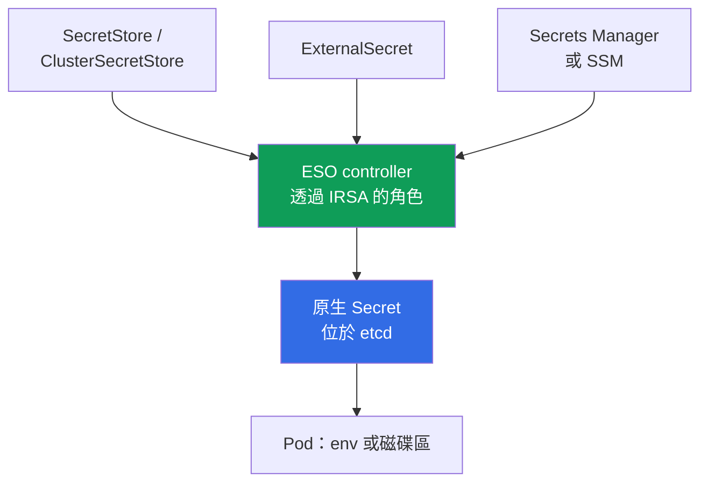
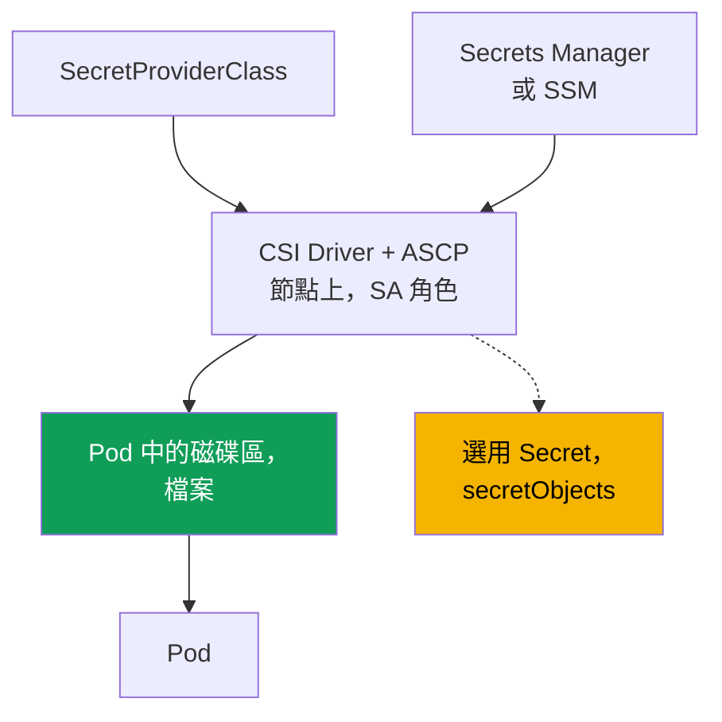

[Русская версия](ru.md) · [Eng version](en.md) · [Versión en español](es.md) · [Version française](fr.md) · [Deutsche Version](de.md) · [ქართული ვერსია](ge.md) · [日本語版](jp.md)
# 第 18 章。Secret：KMS 加密、Secrets Manager，以及透過 External Secrets 和 CSI 使用 SSM

> **接下來。** 第 16 與第 17 章說明了如何透過 IRSA 或 Pod Identity 為 Pod 賦予其專屬的 AWS 角色。Secret 直接依賴此機制：External Secrets controller 與 CSI driver 都需要角色來讀取 Secrets Manager 和 SSM，本章只會引用這些機制而不重複說明。相關主題分屬其他章節：建立叢集時的加密（第 4 章）、對 `Secret` 的 RBAC 存取權（第 5 章）、supply chain 與 ECR（第 20 章）、強化與 Pod Security（第 19 章）、git 和 GitOps 中的 Secret（第 44 章）。

## 18.1.「Kubernetes 的 Secret 不是加密，而是 base64」

應用程式需要資料庫密碼。工程師將它放進 `Secret`，掛載到 Pod，便以為任務完成了：「資料都在 secret 裡」。但 Kubernetes 中的 `Secret` 並未加密任何內容。

- **base64 是編碼，不是加密。** 任何能存取 manifest 或物件的人，都可以用 `base64 -d` 解碼 `data` 中的值。密碼是明文。
- **存取權由 RBAC 決定，而且只有它。** 在該 namespace 中，任何擁有 `get`/`list` 權限的主體都能讀取 `Secret`（第 5 章）。物件沒有超越 RBAC 的第二道屏障。
- **Secret 存在 etcd 中。** 值儲存在 control plane 的資料庫。EKS 會在儲存層加密 etcd 磁碟，但這是保護磁碟區而非物件：持有有效 RBAC 的人仍可照常讀取。
- **Secret 會經由 git 外洩。** 包含 `Secret` 的 manifest 被 commit 到 repository 後，密碼便永久留在 git 歷史中。這是經典的外洩，而單靠一次 `git rm` 無法修復。

我們需要的是另一種做法：將 secret 存放在具備輪換與稽核功能的受管 AWS 儲存庫，無須寫入 manifest 即可交付給 Pod，並真正保護 etcd 中的物件，而不是只做 base64。

## 18.2. 兩個不可混淆的獨立保護層

「EKS 中的 secret」有兩個不同層次：它們解決不同問題，卻經常被混為一談，儘管任一層都不能取代另一層。

- **第 1 層：透過 KMS 對 etcd 中 Kubernetes secret 進行加密**（envelope encryption）。關注 `Secret` 物件**如何**儲存在 control plane 中，也就是儲存層的資料保護。
- **第 2 層：將 secret 移至外部 AWS 儲存庫**（Secrets Manager、SSM Parameter Store）並交付給 Pod。關注 secret **實際存放在哪裡**，以及如何進入應用程式。

第 1 層保護儲存位置中的 `Secret` 物件，卻不會取消對它的 RBAC 存取權。第 2 層將 secret 移出 manifest 和 git，但若它建立原生 `Secret`，該物件又會回到 etcd 中，因此第 1 層依然必要。

## 18.3. 第 1 層：etcd secret 的 KMS envelope encryption

Envelope encryption 使用兩把金鑰進行加密。**Data encryption key (DEK)** 在將 `Secret` 寫入 etcd 前加密它，而 **key encryption key (KEK)**，也就是您的 KMS 金鑰，會加密 DEK。etcd 中儲存的是已加密的 secret 及已加密的 DEK，明文 DEK 不會被保存。EKS 使用 Kubernetes KMS provider v2，且每一次在 KMS 中解密 DEK 都會記錄於 CloudTrail，因此可供稽核。

在 Kubernetes **1.28 以上**的 EKS 上，Kubernetes API 資料的 envelope encryption 預設啟用，使用 AWS 金鑰（AWS owned key），無須您採取行動。自有的 **customer managed key (CMK)** 提供 AWS owned key 無法提供的功能：控制金鑰政策並在 CloudTrail 稽核解密。既有叢集必須另外啟用 CMK（第 4 章）。

```bash
# 在既有叢集啟用自己的 CMK（secrets 資源）
aws eks associate-encryption-config --cluster-name demo \
  --encryption-config '[{"resources":["secrets"],"provider":{"keyArn":"arn:aws:kms:eu-central-1:111122223333:key/abcd-1234"}}]'

# 確認已設定加密
aws eks describe-cluster --name demo --query 'cluster.encryptionConfig'
```

金鑰必須是對稱金鑰，且與叢集位於相同區域。請注意其不可逆性：您可以啟用以 CMK 加密 secret，但**無法關閉**（第 4 章）。因此主要的操作風險是金鑰本身：若 CMK 被停用或刪除，control plane 將無法解密 secret，也會失去對它們的存取權。因此，供 EKS 使用的 CMK 不應停用，且其政策必須受到控管。

| etcd 中的 `Secret` | AWS owned key（預設 1.28+） | 自有 CMK |
|---|---|---|
| etcd 磁碟上的資料 | 由 AWS 加密 | 由 AWS 加密 |
| `Secret` 物件（envelope encryption） | 是，使用 AWS 金鑰 | 是，使用您的金鑰 |
| 對金鑰和政策的控制權 | 否 | 是 |
| CloudTrail 中的解密稽核 | 否 | 是 |
| 是否取消對 `Secret` 的 RBAC 存取？ | 否 | 否 |

最後一列最重要：加密會保護**儲存庫中的** secret，但具備讀取 RBAC 的主體仍會像往常一樣取得它。存取控制依舊由 RBAC 處理（第 5 章），而 envelope encryption 關閉的是另一種攻擊途徑：繞過 API 存取 etcd 資料。

## 18.4. 為何要將 secret 移出叢集

即使已有第 1 層，secret 仍留在叢集中：它位於 manifest 中（可能進入 git）、輪換需手動進行，而且沒有統一存放處。第 2 層將外部儲存庫設為來源，再把 secret 交付至叢集。

- **輪換。** Secrets Manager 能依排程輪換，應用程式可取得新值。
- **稽核與單一來源。** 存取透過 IAM 並會出現在 CloudTrail；secret 集中在單一位置。
- **manifest 和 git 中沒有 secret。** 僅有 secret 的參照會進入叢集，值本身不會。
- **依資料類型區分。** Secrets Manager 用於需輪換的 secret，SSM Parameter Store 用於其中一部分並非 secret 的設定。

兩種工具以不同方式解決交付問題：**External Secrets Operator** 建立原生 `Secret`，而 **Secrets Store CSI Driver** 將 secret 直接以磁碟區掛載至 Pod。兩者都經由 IRSA 或 Pod Identity 取得存取 AWS 所需角色（第 16 與第 17 章），這是其基礎而非細節。

## 18.5. External Secrets Operator：controller 建立原生 Secret

External Secrets Operator（ESO）是叢集中的 controller。它從 Secrets Manager 或 SSM 讀取 secret，並**由其建立一般的 Kubernetes `Secret`**，應用程式可一如既往透過 env 或磁碟區使用，程式碼無須支援。



三個物件定義了這項連結。**`SecretStore`** 描述對儲存庫的存取方式（`aws` provider、`SecretsManager` 或 `ParameterStore` 服務、區域、驗證），其範圍為 namespace；**`ClusterSecretStore`** 則在整個叢集範圍有效。**`ExternalSecret`** 宣告要擷取哪個 secret 並放入哪個 `Secret`；controller 會依此建立並更新目標 `Secret`。

隔離方面，預設應使用具 namespace 範圍的 `SecretStore`：擁有 namespace 的團隊只能讀取自己的 secret。`ClusterSecretStore` 可被所有 namespace 存取，容易成為通往其他團隊 secret 的管道，因此應精確使用並加以限制，而非作為預設選項。

```yaml
apiVersion: external-secrets.io/v1
kind: SecretStore
metadata:
  name: aws-sm
  namespace: payments
spec:
  provider:
    aws:
      service: SecretsManager
      region: eu-central-1
      # 驗證：controller 透過 IRSA 或 Pod Identity 取得角色（第 16、17 章）
---
apiVersion: external-secrets.io/v1
kind: ExternalSecret
metadata:
  name: db-credentials
  namespace: payments
spec:
  refreshInterval: 1h            # 重新同步頻率；0 表示僅建立一次
  secretStoreRef:
    name: aws-sm
    kind: SecretStore
  target:
    name: db-credentials         # ESO 將建立的 Secret 名稱
  data:
    - secretKey: password        # Secret 中的金鑰
      remoteRef:
        key: prod/payments/db    # Secrets Manager 中的 secret 名稱
        property: password       # JSON secret 中的欄位
```

`refreshInterval` 設定重新同步週期；設定為 `0` 時，ESO 僅建立一次 `Secret`。ESO 的優點是結果為原生 `Secret`，與任何取用端（env、磁碟區、第三方 chart）相容。重要缺點是 secret **會具現化至 etcd**，因此 ESO 必須使用第 1 層（第 18.3 節）。controller 從 AWS 讀取資料所需的角色由 IRSA 或 Pod Identity 提供（第 16 與第 17 章）。

輪換的細節：ESO 會更新 `Secret`，但在啟動時將其讀入 env 的 Pod 不會看到新值，因為環境變數在啟動時便固定（kubelet 會自行更新磁碟區，env 不會）。要讓 Pod 重新讀取 secret，必須重新啟動它；**Stakater Reloader** 可自動完成此事，它會監看 `Secret` 與 `ConfigMap`，並對使用它們的 Deployment 觸發 rolling restart：

```yaml
metadata:
  annotations:
    reloader.stakater.com/auto: "true"   # 掛載的 Secret/ConfigMap 變更時重啟
```

```bash
kubectl -n payments get externalsecret db-credentials   # STATUS 是否為 SecretSynced？
kubectl -n payments get secret db-credentials            # 原生 Secret 是否出現
```

## 18.6. Secrets Store CSI Driver：secret 掛載至 Pod

使用 AWS provider（ASCP）的 Secrets Store CSI Driver 採取另一條路徑：secret **會直接以磁碟區形式掛載至 Pod**，成為檔案，並繞過 `Secret` 物件。預設 driver 不會建立 `Secret`，而是將 secret 放在節點上的磁碟區。要掛載什麼由 `SecretProviderClass` 定義。



```yaml
apiVersion: secrets-store.csi.x-k8s.io/v1
kind: SecretProviderClass
metadata:
  name: db-credentials
  namespace: payments
spec:
  provider: aws
  parameters:
    objects: |
      - objectName: "prod/payments/db"   # Secrets Manager 中的 secret 名稱（或 ARN）
        objectType: "secretsmanager"     # secretsmanager 或 ssmparameter
```

Pod 透過帶有 `secretProviderClass` 的 CSI 磁碟區參照此類別。關鍵特性是：未啟用同步時，secret **僅存在於節點上的磁碟區，完全不會進入 etcd**，這是它與 ESO 的主要差異。driver 可選擇透過 `secretObjects` 區塊建立原生 `Secret`，但同步僅會在 Pod 掛載磁碟區時進行，且 `Secret` 會隨最後一個取用端一併刪除。rotation reconciler 可提供值輪換（以旗標啟用，並更新磁碟區）。

```bash
kubectl -n payments get secretproviderclass db-credentials    # 類別是否存在
kubectl -n payments exec deploy/app -- ls /mnt/secrets-store   # 磁碟區中的 secret 檔案
```

供 driver 存取 AWS 的角色同樣由 IRSA 或 Pod Identity 提供（第 16 與第 17 章）：它會繫結至掛載 secret 之 Pod 所使用的 `ServiceAccount`。

## 18.7. ESO 與 CSI Driver 的比較

兩個工具都解決「從 AWS 將 secret 交付給 Pod」的問題，但方式不同，選擇取決於核心問題：secret 會落在哪裡，以及誰要取用它。

| 特性 | External Secrets Operator | Secrets Store CSI Driver |
|---|---|---|
| secret 存放位置 | etcd 中的原生 `Secret` | 節點磁碟區中的檔案 |
| 是否進入 etcd | 是，永遠會 | 否（未啟用 `secretObjects` 時） |
| 應用程式如何取用 | 由 `Secret` 提供的 env 或磁碟區 | 從磁碟區讀取檔案 |
| 與 env 的相容性 | 完整（就是一般 `Secret`） | 僅能透過同步至 `Secret` |
| 輪換 | 依 `refreshInterval` | rotation reconciler 更新磁碟區 |
| 是否需要第 1 層（KMS） | 是，secret 位於 etcd | 磁碟區不需要；同步時需要 |
| 存取 AWS 的角色 | IRSA / Pod Identity | IRSA / Pod Identity |
| 是否依賴 Pod 生命週期 | 否，`Secret` 自行存在 | 是，磁碟區與同步隨 Pod 存在 |

簡言之：對需要 `Secret` 的應用程式（env、現成 chart），ESO 較簡單，但代價是它始終位於 etcd。未同步的 CSI 可留下最小的足跡，但應用程式必須從磁碟區讀取檔案。

### HashiCorp Vault：同樣是第 2 層，但儲存庫不屬於 AWS

目前儲存庫的角色由 Secrets Manager 與 SSM Parameter Store 擔任，但第 2 層並不綁定 AWS。Vault 在架構中位居相同位置，通常基於三種原因進入叢集：公司已部署 Vault，且它不只服務 EKS；需要**動態 secret**（AWS secrets engine 發出短期 IAM 憑證，database engine 針對特定請求發出短期資料庫使用者）；或需要供多雲與自有資料中心使用的單一來源。

Pod 對 Vault 的驗證依賴與第 16 章相同的機制。Kubernetes auth method 會透過叢集 API 的 `TokenReview` 驗證 ServiceAccount token；JWT/OIDC auth 會以叢集 OIDC issuer 驗證 projected token，而不存取 API；AWS IAM auth 接受已簽署的 `sts:GetCallerIdentity` 請求，也就是辨識 IRSA 或 Pod Identity 角色。第一種最簡單，第三種最自然地整合至既有 IRSA。

將 secret 交付給 Pod 有四種方式，其中兩種您已見過：

- **Vault Agent Injector**：mutating webhook 會向 Pod 注入 sidecar 或 init container，該 container 登入 Vault，並將 secret 寫入共用 `emptyDir`；透過 `vault.hashicorp.com/agent-inject` 與 `vault.hashicorp.com/role` 註解啟用。不會有任何內容進入 etcd。
- **Vault Secrets Operator**：具有 CRD（`VaultStaticSecret`、`VaultDynamicSecret`、`VaultAuth`）的 controller，會將值同步至原生 `Secret`。這正是 ESO 模型，也具有上表中的所有特性。
- **搭配 Vault provider 的 ESO**：仍是第 18.5 節的 operator，但 `SecretStore` 指向 Vault 而非 Secrets Manager。當部分 secret 在 AWS、部分在 Vault 時很實用。
- **搭配 Vault provider 的 Secrets Store CSI Driver**：如第 18.6 節，透過檔案掛載。

其代價如第 8 章更換 CNI 時同樣明確：儲存庫成為您必須營運的系統。自建 Vault 是包含自身 storage backend、unseal 與 recovery keys、升級、備份與稽核的 HA 叢集；在 AWS 上通常使用 KMS 的 auto-unseal（`seal "awskms"`），以免將 unseal key 交由人員保存。供應商提供的受管方案可移除部分工作，但不會移除您對政策與角色的責任。另一項操作細節是 secret 存取會出現在 Vault 的 audit device，而不是 CloudTrail，因此調查存取需要查閱兩份日誌（第 21 章）。第 1 層也不會消失：若 secret 最終同步至 `Secret`，它便位於 etcd，並受到第 18.3 節 KMS 加密保護。

## 18.8. 輪換：資料庫密碼已變更

夜間觸發了資料庫 secret 輪換。早晨的情況是：部分 Pod 正常運作，部分因驗證錯誤而失敗，Secrets Manager 中卻有正確的新密碼。AWS 中的值會立刻更新，但它要經過四個環節才能到達應用程式，而且可能卡在任一環節。

| 環節 | 決定延遲的因素 | 設定錯誤時的症狀 |
|---|---|---|
| 儲存庫 | 輪換策略與資料庫中密碼變更的時刻 | 資料庫密碼已更新，但讀取端仍使用舊密碼的時間窗 |
| 同步至叢集 | ESO 的 `refreshInterval`、CSI 的 rotation reconciler | `Secret` 或磁碟區檔案仍有舊值 |
| 應用程式如何取得值 | env 相對於磁碟區或檔案 | env 永遠不會變，磁碟區會更新 |
| 資料庫連線 | 連線池與重新連線邏輯 | 連線池在重啟前持續使用舊憑證 |

**環節 1：Secrets Manager 如何輪換。** 輪換由 rotation function 控制，secret 版本帶有標籤：預設所有人讀取 `AWSCURRENT`，`AWSPENDING` 是待驗證的新值，`AWSPREVIOUS` 是前一值。有兩種策略，選擇會直接影響可用性。採用 **single user** 時，一個使用者的密碼會變更：現有連線不會中斷，但在資料庫密碼變更與 secret 更新之間有一小段時間，使用剛讀取的憑證連線可能被拒絕。AWS 認為此策略適合大多數情況，風險可藉由具有指數退避的重試處理。採用 **alternating users** 時，secret 中有兩個使用者：rotator 複製原始使用者，接著輪流變更密碼，因此應用程式在輪換的任一時刻都會取得有效憑證，且輪換後兩組憑證都能運作。代價是需有一個具 superuser 權限的獨立 secret（使用者通常無法複製自己），並且必須將權限變更同步套用到複本。

**環節 2：新值如何進入叢集。** 對 ESO 而言，是第 18.5 節的 `refreshInterval`：若為 `0`，secret 僅建立一次，輪換後便會永久維持舊值。CSI Driver 中則由另一個 rotation reconciler 更新磁碟區檔案，且必須啟用它，否則磁碟區同樣是靜態的。因此，沒有設定此環節時，所謂「我們會輪換 secret」實際上只是「我們只在 AWS 中更改密碼」。

**環節 3：程序如何看到值。** 環境變數在 container 啟動時設定，**永遠不會更新**，即使 `Secret` 已換成新值。kubelet 會自行更新磁碟區中的值，但應用程式必須重新讀取檔案，而不能將密碼自啟動起一直保留在記憶體。因此有兩種可行作法：在 secret 變更時重啟 Pod（第 18.5 節的 Reloader），或讀取檔案並對檔案變更作出反應。

**環節 4：連線。** 即使應用程式重新讀取密碼，仍會使用已開啟的連線池。正確行為是在驗證失敗時重新讀取憑證、以重試與延遲重新建立連線，而不是進入 `CrashLoopBackOff` 或等待手動重啟。

**如何徹底消除此問題。** 密碼輪換是在管理最好根本不存在的事物。RDS 與 Aurora 提供 **IAM database authentication**：應用程式不使用密碼，而是透過 `aws rds generate-db-auth-token` 取得預設存活 15 分鐘的 token，Pod 角色透過 IRSA 或 Pod Identity 取得權限（第 16 與第 17 章）。沒有永久密碼，就沒有需要輪換的東西。第 18.7 節 Vault 的動態 secret 也有相同概念：憑證按請求發出並自行過期。若仍需要密碼，production 的手動變更應遵循 alternating users 邏輯：先建立第二個使用者、遷移流量、再撤銷第一個，而非直接變更正在使用中的使用者密碼。

## 18.9. KMS 與外部儲存庫一起使用

這些層次不是替代方案，而是疊加；規則取決於 secret 是否進入 etcd：

- **ESO** 寫入原生 `Secret`，secret 因此進入 etcd，所以第 1 層永遠需要。否則外部儲存庫受到保護，而其位於 etcd 的副本卻沒有。
- **未同步的 CSI** 僅將 secret 掛載至節點磁碟區，並不進入 etcd，因此第 1 層不會用於它。使用 `secretObjects` 後會出現 `Secret`，第 1 層又再次必要。

將 secret 移到外部，並不會取消對留在叢集內資料的加密：第 1 層應始終維持（1.28+ 預設已啟用），而選擇 ESO 或 CSI 只會決定叢集內足跡的大小。

## 18.10. 診斷：secret 未出現或未更新

故障模式可預期：幾乎所有問題都可歸結於 controller 或 driver 的角色、設定物件，以及 AWS 中 secret 本身 KMS 金鑰的權限。

| 症狀 | 可能原因 | 應檢查項目 |
|---|---|---|
| `ExternalSecret` 不是 `SecretSynced` | controller 角色無法讀取 secret | ESO controller 的 IRSA/Pod Identity |
| 未建立原生 `Secret` | `SecretStore` 或 `remoteRef` 錯誤 | `kubectl describe externalsecret` |
| 磁碟區空白，Pod 無法啟動 | `SecretProviderClass` 或 Pod SA 的角色 | 類別、SA 的註解/關聯 |
| 讀取 secret 時 `AccessDenied` | role IAM policy 中沒有權限 | `secretsmanager:GetSecretValue` |
| 解密時 `AccessDenied` | secret KMS 金鑰沒有權限 | secret 金鑰上的 `kms:Decrypt` |
| 值過期 | 未設定輪換或 refresh | `refreshInterval`（ESO）、reconciler（CSI） |

排查順序是從角色到物件，再往外到 AWS：

```bash
# 1. ESO 的同步狀態與事件
kubectl -n payments describe externalsecret db-credentials

# 2. ESO controller 日誌（角色、儲存庫存取、provider 錯誤）
kubectl -n external-secrets logs deploy/external-secrets

# 3. CSI：Pod 所在節點上的 driver 日誌
kubectl -n kube-system logs ds/csi-secrets-store-secrets-store-csi-driver -c secrets-store
```

常見陷阱是 Secrets Manager 的 secret 本身以 KMS 金鑰加密，controller 或 driver 的角色需要對**該金鑰**具有 `kms:Decrypt`，不要與第 1 層叢集 CMK 混淆。若 `GetSecretValue` 成功但無法讀取 secret，原因通常是其金鑰權限。

## 18.11. 在 production 中如何實踐

- **不 commit secret。** 進入 git 的是 `ExternalSecret`、`SecretStore` 與 `SecretProviderClass`，即 secret 的參照而非值。從根本避免經由 git 歷史外洩（第 44 章）。
- **第 1 層始終啟用。** 1.28+ 預設運作 envelope encryption；production 使用自有 CMK 以取得 CloudTrail 的控制與稽核，並嚴格保護金鑰政策。
- **對 `Secret` 實施最小 RBAC。** Envelope encryption 不會取代 RBAC：讀取權限應精確授予，否則第 1 層能防護所有事情，唯獨防不了有效的主體（第 5 章）。
- **在來源端輪換。** 可輪換的 secret 放在 Secrets Manager，並設定 ESO 的 `refreshInterval` 或 CSI 的 rotation reconciler，使 Pod 取得新值。以 env 讀取 `Secret` 的 Pod 則透過 Stakater Reloader 的 rolling restart 更新。
- **依 namespace 隔離儲存庫。** 預設採用具 namespace 範圍的 `SecretStore`；`ClusterSecretStore` 應精確使用並受限制，避免團隊讀取其他團隊的 secret。
- **依資料選擇不同儲存庫。** Secrets Manager 用於可輪換的 secret，SSM Parameter Store 用於設定，這也區分了權限與呼叫成本。
- **角色透過 IRSA 或 Pod Identity。** controller 與 driver 應有各自的角色，只授予所需 secret 與金鑰的 `GetSecretValue` 及 `kms:Decrypt` 權限，而非共用角色（第 16 與第 17 章）。

## 18.12. 迷你詞彙表

- **Envelope encryption**：雙金鑰加密。DEK 加密資料，KEK（KMS 金鑰）加密 DEK。EKS 透過 Kubernetes KMS provider v2 對 etcd secret 套用它。
- **CMK (customer managed key)**：您的 KMS 金鑰。相較於預設 AWS owned key，它能控制金鑰政策並在 CloudTrail 稽核解密。
- **External Secrets Operator (ESO)**：從 AWS 讀取 secret 並建立原生 `Secret` 的 controller，使用 `SecretStore`/`ClusterSecretStore` 與 `ExternalSecret` 物件。
- **Secrets Store CSI Driver + AWS provider (ASCP)**：將 AWS secret 作為節點磁碟區檔案掛載的 driver，使用 `SecretProviderClass` 物件，並可選擇同步至 `Secret`。
- **Stakater Reloader**：controller。當掛載的 `Secret` 或 `ConfigMap` 變更時，它會依註解對 Deployment 執行 rolling restart，讓 Pod 取得新值。
- **Staging labels**：Secrets Manager 中的 secret 版本標籤。預設讀取 `AWSCURRENT`，`AWSPENDING` 是輪換中待驗證的值，`AWSPREVIOUS` 是前一值。
- **輪換策略**：`single user`（變更一個使用者密碼，存在短暫失敗風險窗，以延遲重試處理）或 `alternating users`（兩名使用者輪流，任一時刻都有有效憑證，但需要具 superuser 權限的 secret）。
- **IAM database authentication**：以臨時 token（`aws rds generate-db-auth-token`，預設 15 分鐘）取代密碼登入 RDS 或 Aurora，無須輪換任何密碼。
- **HashiCorp Vault**：非 AWS 的外部 secret 儲存庫，與 Secrets Manager 位於相同架構位置。Pod 透過 Kubernetes、JWT/OIDC 或 AWS IAM auth 驗證；透過 Vault Agent Injector、Vault Secrets Operator、ESO 或搭配 Vault provider 的 CSI Driver 交付。關鍵差異是**動態 secret**（依請求取得的短期 IAM 與資料庫憑證），代價是需營運 Vault 本身，並使用獨立 audit device 而非 CloudTrail。

## 18.13. 本章重點

- Kubernetes 的 `Secret` 是 base64，而非加密：RBAC 決定存取權，值位於 etcd，且很容易經由 git 外洩。因此有兩項不能混淆的不同任務。
- 第 1 層是 etcd secret 的 KMS envelope encryption：DEK 加密 `Secret`，KEK（KMS 金鑰）加密 DEK。1.28+ 預設以 AWS owned key 啟用；自有 CMK 提供控制與稽核。
- 第 1 層保護儲存庫中的 secret，卻**不會取消 RBAC** 的讀取權。啟用不可逆，而停用或刪除 CMK 會使 control plane 無法存取 secret。
- 第 2 層將 secret 移至外部儲存庫（Secrets Manager、SSM），以取得輪換、稽核、單一來源，並避免 secret 出現在 manifest。兩種工具是 ESO 與 CSI Driver。
- ESO 建立原生 `Secret`（與任一取用端相容，但 secret 位於 etcd，故第 1 層必要）。CSI 將 secret 掛載至磁碟區，預設不建立 `Secret`，所以不會進入 etcd。
- 兩者都透過 IRSA 或 Pod Identity 取得 AWS 角色（第 16 與第 17 章）。診斷從角色到物件，再到 AWS 中 secret 自身 KMS 金鑰的權限（`kms:Decrypt`）。
- 輪換透過四個環節到達應用程式：儲存庫策略、同步至叢集（`refreshInterval` 或 rotation reconciler）、讀取值的方式（env 永不更新）與連線池。根本解法是 RDS 的 IAM database authentication 或沒有永久密碼的動態 secret。

## 18.14. 這在實際工作中如何運用

使用外部儲存庫後，「secret 位於何處，誰可讀取」可由 Secrets Manager 的一筆記錄和 role IAM policy 回答，而不是搜尋所有 namespace 的 manifest。「git 中有 secret」的事故也不再發生：repository 中只有參照。在值班時，「Pod 未啟動且磁碟區為空」或「`ExternalSecret` 未同步」可依第 18.10 節的鏈結排除：角色、設定物件、secret 權限與其 KMS 金鑰權限。知道 ESO 將 secret 寫入 etcd，而未同步的 CSI 不會，則能協助您依所需足跡選擇工具。

## 18.15. 自我檢查問題

1. 為何 Kubernetes 中的 `Secret` 不可視為加密？是什麼限制其存取？
2. AWS 中 etcd 磁碟加密與 `Secret` 物件的 envelope encryption 有何不同？
3. 透過 KMS 的 envelope encryption 如何運作：DEK 與 KEK 各自負責什麼？
4. 自哪個 EKS 版本起，envelope encryption 預設啟用？使用何種金鑰？
5. 與 AWS owned key 相比，自有 CMK 提供什麼？它有什麼操作風險？
6. 第 1 層（KMS）是否取消對讀取 `Secret` 的 RBAC 需求？為什麼？
7. 如果 etcd 已加密，為何仍要將 secret 移至外部儲存庫？
8. `SecretStore` 與 `ClusterSecretStore` 有何差異？`ExternalSecret` 描述什麼？
9. 為什麼使用 ESO 時第 1 層仍是必要的？
10. CSI Driver 預設將 secret 放在哪裡？何時仍會建立原生 `Secret`？
11. `GetSecretValue` 成功但無法讀取 secret。應檢查哪一項權限以及哪一把金鑰？
12. ESO 更新了 `Secret`，但應用程式在 env 中看到舊密碼。為何如此？什麼能解決它？
13. 為何在隔離需求下，具 namespace 範圍的 `SecretStore` 優於 `ClusterSecretStore`？
14. 哪三項原因會讓 Vault 進入叢集？您在營運上為此付出什麼代價？
15. Vault Agent Injector 與 Vault Secrets Operator 在 etcd 足跡上有何差異？
16. 資料庫密碼已輪換，Secrets Manager 中是新密碼，但部分 Pod 因驗證錯誤而失敗。請分析四個環節，值可能卡在哪裡？
17. `single user` 與 `alternating users` 在可用性上有何不同？後者需要什麼？
18. 為何使用環境變數中密碼的應用程式無法經歷輪換？哪兩種方法可解決？

## 實作

本主題的課程 lab：[lab 105，Secret：KMS envelope encryption 與 External Secrets Operator](../../labs/105/README_TW.MD)。除此之外，所有內容都可在實際叢集驗證。第 1 層：`aws eks describe-cluster --name <cluster> --query 'cluster.encryptionConfig'` 會顯示是否已啟用加密以及使用的金鑰。1.28+ 即使未使用 CMK 也會啟用；可使用第 18.3 節的 `aws eks associate-encryption-config` 新增自有金鑰，並記住其不可逆性。

接著是第 2 層。部署 External Secrets Operator，透過 IRSA 或 Pod Identity（第 16 與第 17 章）為其 controller 提供角色，並授予 `secretsmanager:GetSecretValue` 與 secret 金鑰的 `kms:Decrypt` 權限；建立 `SecretStore` 和 `ExternalSecret`，並檢查 `kubectl get externalsecret`（`SecretSynced` 狀態）與出現的 `kubectl get secret`。再透過 Secrets Store CSI Driver 重複：建立 `SecretProviderClass`、帶 CSI 磁碟區的 Pod，並確認檔案位於磁碟區中，但沒有原生 `Secret`。練習故障情境：移除 role 對 secret 金鑰的 `kms:Decrypt`，並在 controller 或 driver 日誌中找到 `AccessDenied`。

---
[目錄](../README_TW.md) · [第 17 章](../17/tw.md) · [第 19 章](../19/tw.md)
