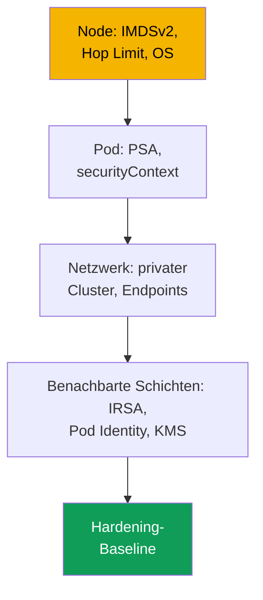
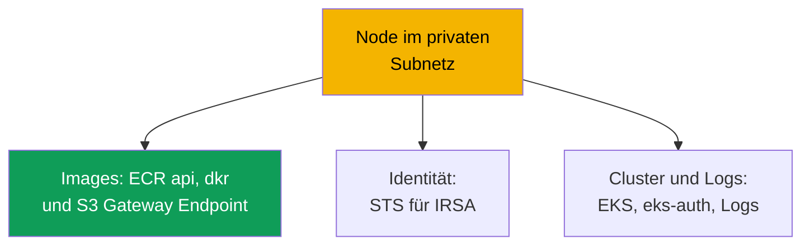

[Русская версия](ru.md) · [Eng version](en.md) · [Versión en español](es.md) · [Version française](fr.md) · [ქართული ვერსია](ge.md) · [繁體中文版](tw.md) · [日本語版](jp.md)
# Kapitel 19. Hardening: IMDSv2 und Hop Limit, Pod Security Admission, privater Cluster

> **Wie geht es weiter?** Die Kapitel 16 bis 18 haben dem Pod seine Rolle gegeben (IRSA, Pod
> Identity) und Secrets abgesichert (KMS, externe Speicher). Dieses Kapitel schließt Teil 3 ab
> und ordnet das Hardening in Schichten: Node (IMDS), Pod (Pod Security Admission,
> securityContext) und Netzwerk (privater Cluster, VPC Endpoints). Das IMDS-Hardening ergänzt die
> Kapitel 16 und 17: Selbst mit IRSA bleibt die Node-Rolle ein Ziel. Verwandte Themen stehen in
> anderen Kapiteln: privater Control-Plane-Endpoint und public/private-Modi (Kapitel 2), Secrets
> und KMS (Kapitel 18), NetworkPolicy (Kapitel 30), Kyverno- und Gatekeeper-Policies sowie
> Multitenancy (Kapitel 22), Audit, CloudTrail und GuardDuty (Kapitel 21), ECR (Kapitel 20).

## 19.1. „Der Pod ruft 169.254.169.254 auf und holt sich die Credentials der Node-Rolle“

IRSA ist eingerichtet, die Anwendung hat ihre eigene Rolle, die Node-Rolle ist minimal (Kapitel
16). Der AWS-Zugriff scheint unter Kontrolle. Doch der Container wird kompromittiert und ein
Angreifer führt `curl` gegen
`169.254.169.254/latest/meta-data/iam/security-credentials/` aus. Standardmäßig können Pods auf
der Node häufig **den Instance Metadata Service (IMDS)** erreichen und die temporären Credentials
der Node-Rolle vollständig abrufen. Dabei spielt es keine Rolle, dass Anwendungsrechte in IRSA
ausgelagert wurden: Die Node-Rolle behält Berechtigungen für Systemkomponenten (Pull aus ECR,
Arbeit des CNI mit ENIs, Logs), und das reicht für laterale Bewegungen. IRSA hat Least Privilege
auf Pod-Ebene umgesetzt, doch **der Netzwerkpfad zur Node-Rolle bleibt offen**.

Daneben gibt es zwei verwandte Szenarien derselben Art:

- **Ein privilegierter Pod hat das Root-Dateisystem der Node gemountet.** Ein Pod mit
  `privileged: true` oder `hostPath` auf `/` erhält das Dateisystem des Hosts, kubelet-
  Credentials und die Secrets anderer Pods. Ein Namespace ohne Pod-Security-Labels lässt einen
  solchen Pod ohne jede Warnung zu.
- **Der Cluster benötigt einen privaten Modus, startet jedoch nicht.** Nodes ohne
  Internet-Zugang kommen nicht hoch: VPC Endpoints fehlen und sie können kein Image aus ECR
  abrufen oder sich registrieren.

Drei verschiedene Probleme, die mit einem Ansatz behandelt werden: Hardening nach Schichten.

## 19.2. Hardening als Schichten: Node, Pod, Netzwerk

Es gibt keinen einzelnen „Sicherheits-Haken“. EKS-Schutz setzt sich aus unabhängigen Schichten
zusammen: Eine Lücke in einer Schicht wird nicht durch andere ausgeglichen.



- **Node-Schicht**: IMDS vor Pods abschirmen (IMDSv2 und Hop Limit), gehärtetes OS,
  Einschränkung von Host-Mounts (Abschnitte 19.3 und 19.7).
- **Pod-Schicht**: Keine privilegierten Pods zulassen: PSA und `securityContext` (19.4 bis
  19.5).
- **Netzwerkschicht**: Private Subnetze ohne Internet-Zugang und VPC Endpoints (Abschnitt
  19.6).

Identität (Kapitel 16 und 17) und Secrets (Kapitel 18) sind benachbarte Schichten; die Checkliste
steht in 19.8.

## 19.3. IMDSv2 und Hop Limit im Detail

IMDS ist ein link-local-Service auf `169.254.169.254`, über den eine EC2-Instance Metadaten und
**temporäre Credentials der Node-Rolle** liest. Es gibt zwei Protokollversionen.

- **IMDSv1**: Anfrage und Antwort: `GET`, die Antwort enthält direkt die Credentials. Kein Token
  ist erforderlich. Daher kann jeder, der von der Instance aus eine HTTP-Anfrage stellt
  (einschließlich eines Pods und SSRF in der Anwendung), die Credentials abrufen.
- **IMDSv2**: session-based: Zuerst erfolgt ein `PUT` für ein Token, dann ein `GET` mit dem Token
  im Header. Das unterbindet naives SSRF. IMDSv2 wird **verpflichtend** gemacht
  (`httpTokens=required`), andernfalls bleibt IMDSv1 ein Umgehungsweg.

```bash
# Credentials über IMDSv2 abrufen: zuerst Token (PUT), dann Anfrage mit Token
TOKEN=$(curl -sX PUT "http://169.254.169.254/latest/api/token" \
  -H "X-aws-ec2-metadata-token-ttl-seconds: 21600")
curl -s -H "X-aws-ec2-metadata-token: $TOKEN" \
  http://169.254.169.254/latest/meta-data/iam/security-credentials/
```

Allein verpflichtendes IMDSv2 schließt den Pod jedoch nicht aus: Ein Pod kann ebenfalls `PUT` und
`GET`. Der entscheidende Mechanismus ist das **Hop Limit** (`httpPutResponseHopLimit`), ein
TTL-ähnliches Feld: Es legt fest, wie viele Netzwerk-Hops die IMDS-Antwort passieren darf. Ein
Paket von einem Prozess **auf dem Host** durchläuft einen Hop; ein Paket **aus einem Pod** läuft
durch den Netzwerk-Namespace des Containers und macht einen zusätzlichen Hop.

Daraus folgt der Trick: Bei **Hop Limit = 1** erreicht die IMDS-Antwort den Pod nicht (ein Hop
fehlt), während die Node und ihre Komponenten unverändert funktionieren. Der Pod kann die
Credentials der Node-Rolle nicht mehr abrufen, die Lücke aus 19.1 ist geschlossen.

| `httpPutResponseHopLimit` | Node (Host) | Pod | Kommentar |
|---|---|---|---|
| 1 | IMDS erreichbar | IMDS **nicht erreichbar** | empfohlener Wert für Hardening |
| 2 und höher | IMDS erreichbar | IMDS erreichbar | Pod erreicht Credentials der Node-Rolle (maximal 64) |

Dies wird im **Launch Template** der Node (Kapitel 10) oder auf einer laufenden Instance
konfiguriert:

```bash
# auf einer laufenden Instance: IMDSv2 und Hop Limit 1 verlangen
aws ec2 modify-instance-metadata-options --instance-id i-0abc123 \
  --http-tokens required --http-put-response-hop-limit 1 --http-endpoint enabled
```

AL2023 und Bottlerocket erfordern standardmäßig IMDSv2 und setzen Hop Limit 1. Managed Node
Groups setzen `httpTokens` und `httpPutResponseHopLimit` über ein Launch Template.

Wichtige Zusammenhänge und Einschränkungen:

- **Zusammenhang mit IRSA (Kapitel 16).** Hop Limit schließt IMDS, IRSA entfernt
  Anwendungsrechte von der Node-Rolle: Die Rolle ist minimal **und** kann nicht über IMDS
  gestohlen werden.
- **Eine Komponente kann IMDS benötigen.** Bei Hop Limit 1 erhält sie keine Credentials aus IMDS.
  Die Rolle wird über IRSA oder Pod Identity vergeben. Man kann das Hop Limit auf 2 erhöhen,
  doch das öffnet wieder die Credentials der Node-Rolle. Die äußerste Variante ist, IMDS ganz
  abzuschalten (`--http-endpoint disabled`).
- **Einschränkung zu `hostNetwork: true`.** Ein solcher Pod läuft im Netzwerk-Namespace des
  Hosts; sein Paket zu IMDS benötigt einen Hop. Hop Limit 1 blockiert ihn nicht, Metadaten und
  Credentials der Node-Rolle sind erreichbar. Hier hilft nicht das Hop Limit, sondern PSA:
  Baseline und Restricted verbieten `hostNetwork`.

## 19.4. Pod Security Admission im Detail

Pod Security Admission (PSA) ist der eingebaute Admission Controller von Kubernetes als Ersatz
für Pod Security Policies (PSP wurden in 1.25 entfernt). Er setzt die **Pod Security Standards**
um, drei Profile mit unterschiedlicher Strenge auf Namespace-Ebene.

- **privileged**: keine Einschränkungen.
- **baseline**: verbietet die gefährlichsten Einstellungen: `privileged`-Container,
  `hostNetwork`, `hostPID`, `hostIPC`, `hostPath`-Volumes und gefährliche Linux Capabilities.
- **restricted**: strenges Profil für Produktion: alles aus Baseline, zusätzlich Start nicht als
  root (`runAsNonRoot`), `allowPrivilegeEscalation: false`, Entfernen **aller** Capabilities
  (nur `NET_BIND_SERVICE` zurückgeben), `seccompProfile` `RuntimeDefault`/`Localhost`,
  eingeschränkte Volume-Typen.

PSA hat drei unabhängige Modi, die in einem Namespace kombiniert werden können:

| Modus | Verhalten bei Verstoß | Einsatzzeitpunkt |
|---|---|---|
| `enforce` | Pod wird **abgelehnt** | produktives Verbot |
| `audit` | Pod wird erstellt, Ereignis im Audit Log | Beobachtung, Erprobung des Profils |
| `warn` | Pod wird erstellt, Warnung in der Antwort | Hinweis für den Manifest-Autor |

Die Modi werden durch **Labels am Namespace** festgelegt. Der Schlüssel lautet
`pod-security.kubernetes.io/<Modus>`; zusätzlich kann `<Modus>-version` die Version des Standards
festschreiben.

```bash
# Restricted auf dem Namespace aktivieren: enforce strikt, audit und warn zum schrittweisen Einführen
kubectl label namespace payments \
  pod-security.kubernetes.io/enforce=restricted \
  pod-security.kubernetes.io/enforce-version=latest \
  pod-security.kubernetes.io/warn=restricted \
  pod-security.kubernetes.io/audit=restricted
```

Wichtig für EKS: PSA ist ein Upstream-Mechanismus, der **eingebaut und aktiviert** ist. Für einen
Namespace ohne Labels lautet die Stufe jedoch **privileged**, schränkt also nichts ein. Der Schutz
muss **explizit** festgelegt werden: EKS setzt Restricted nicht für Sie. Das Profil wird
schrittweise eingeführt: Zuerst `warn` und `audit`, um Verstöße zu sehen, dann `enforce`.
Produktive Namespaces bleiben auf Restricted, System-Namespaces mindestens auf Baseline;
`kube-system` wird nicht auf Restricted gesetzt, da dort privilegierte Komponenten wie CNI und
Pod Identity Agent laufen.

Verstöße lassen sich praktisch über die Control-Plane-Metrik
`apiserver_pod_security_evaluations_total` zählen: Ihre Labels `decision`, `policy_level` und
`mode` zeigen, wie viele Pods in jedem Profil von `audit` und `warn` erfasst werden. Das ist die
Liste dessen, was beim Umschalten eines Namespace auf `enforce` fehlschlagen wird.

## 19.5. securityContext des Pods und Containers

PSA prüft, was im `securityContext` des Pods und seiner Container festgelegt ist. Restricted
fordert eine Reihe von Feldern, die daher im Manifest gesetzt werden.

```yaml
spec:                              # Pod-Fragment für das Restricted-Profil
  securityContext:
    runAsNonRoot: true             # nicht als root ausführen
    seccompProfile:
      type: RuntimeDefault         # standardmäßiges seccomp-Profil der Runtime
  containers:
    - name: app
      securityContext:
        allowPrivilegeEscalation: false   # keine Rechteerweiterung möglich (kein setuid)
        readOnlyRootFilesystem: true      # Root-Dateisystem schreibgeschützt
        capabilities:
          drop: ["ALL"]                   # alle Linux Capabilities entfernen
```

Was und warum (alle außer dem letzten sind Anforderungen von Restricted):

- **`runAsNonRoot: true`**: Nicht als root starten; root im Container ist bei einem Ausbruch
  gefährlicher.
- **`allowPrivilegeEscalation: false`**: Der Prozess erhält keine zusätzlichen Rechte
  (blockiert setuid).
- **`capabilities.drop: ["ALL"]`**: Capabilities entfernen, nur `NET_BIND_SERVICE` bei Bedarf
  zurückgeben.
- **`seccompProfile.type: RuntimeDefault`**: Filter für Syscalls; ein häufiger Grund für einen
  Fehlschlag beim Wechsel von Baseline zu Restricted.
- **`readOnlyRootFilesystem: true`**: Gute Praxis, gehört aber **nicht** zum Restricted-Profil.

Der Zusammenhang ist direkt: `securityContext` beschreibt das Verhalten des Pods, PSA Restricted
**prüft**, dass die Felder gesetzt sind. PSA ohne securityContext lehnt den Pod ab,
securityContext ohne PSA verhindert jedoch nicht, dass daneben ein privilegierter Pod startet.

## 19.6. Privater Cluster als Datenebene

Dabei geht es nicht um einen privaten Control-Plane-Endpoint (public/private-Modi in Kapitel 2),
sondern um die **Datenebene**: Nodes in privaten Subnetzen ohne Route zum Internet Gateway und in
der strikten Variante ganz ohne Internet-Ausgang. Nodes und Pods benötigen dennoch AWS-Services:
Image aus ECR abrufen, sich im Cluster registrieren, Credentials über STS beziehen. Ohne Internet
funktioniert dies nur über **VPC Endpoints** (PrivateLink), private Zugangspunkte zu Services
innerhalb der VPC. Fehlt ein benötigter Endpoint, bricht eine konkrete Funktion.



Die Endpoints für einen privaten Cluster (gemäß AWS-Dokumentation; die Region wird in
`region-code` eingesetzt):

| Service | Endpoint | Fehler ohne ihn |
|---|---|---|
| Amazon ECR | `ecr.api`, `ecr.dkr` | Container-Images können nicht gepullt werden |
| Amazon S3 (Gateway) | `s3` | Image-Layer aus ECR werden nicht heruntergeladen |
| Amazon EC2 | `ec2` | EKS Optimized AMI setzt keinen DNS-Namen der Node |
| AWS STS | `sts` | IRSA tauscht das Token nicht gegen Credentials (Kapitel 16) |
| EKS OIDC | `oidc-eks` | IRSA kann nicht innerhalb der VPC eingerichtet werden (Kapitel 16) |
| EKS Auth | `eks-auth` | Pod Identity funktioniert nicht (Kapitel 17) |
| Amazon EKS | `eks` | Kein Zugriff auf die EKS-API aus der VPC |
| CloudWatch Logs | `logs` | Logs von Nodes und Pods werden nicht gesendet |
| Elastic Load Balancing | `elasticloadbalancing` | LB Controller erstellt kein ALB/NLB (Kapitel 26) |

Wichtige Details:

- **S3 ist ein Gateway Endpoint**, kein Interface Endpoint: kostenlos und der Route Table
  hinzugefügt. ECR-Image-Layer liegen in S3. Ohne S3-Endpoint wird daher kein Image
  heruntergeladen, auch wenn `ecr.api` und `ecr.dkr` vorhanden sind.
- **Private Access zum API-Server ist erforderlich** (Kapitel 2), sonst registrieren sich die
  Nodes nicht.
- **OIDC und STS sind verschiedene Endpoints.** `oidc-eks` privatisiert OIDC-Traffic aus der
  VPC, `sts` den Aufruf `AssumeRoleWithWebIdentity`; beide werden benötigt (Kapitel 16). SDK v1
  geht standardmäßig zum globalen `sts.amazonaws.com` am Endpoint vorbei. Es wird auf regionales
  STS konfiguriert.
- **Interface Endpoints** benötigen Private DNS und eine Security Group, die den CIDR der
  Node-Subnetze zulässt.

## 19.7. Zusätzliche Maßnahmen auf Node-Ebene

Neben IMDS wird die Node durch das OS und die Einschränkung von Host-Mounts gehärtet.

- **Bottlerocket ist ein von Haus aus gehärtetes OS** (Kapitel 10): minimales Container-OS,
  read-only Root-Dateisystem, SELinux im Enforcing-Modus, atomare Updates. SELinux und read-only
  Root begrenzen, was ein Prozess auf der Node lesen und wohin er schreiben kann, selbst bei
  einem Container-Ausbruch.
- **Host-Mounts** werden durch PSA eingeschränkt: Baseline und Restricted verbieten `hostPath`,
  `hostNetwork`, `hostPID`, `hostIPC`. Das schließt das Szenario „Pod mountet das
  Root-Dateisystem der Node“ aus 19.1.

Die Maßnahmen ergänzen das IMDS-Hardening: Ein geschlossenes IMDS schützt nicht, wenn ein Pod
`/` des Hosts gemountet hat.

## 19.8. Zusammensetzung der Hardening-Baseline

Die einzelnen Maßnahmen ergeben zusammen eine Baseline für jede Produktion: eine überprüfbare
Liste der Schichten aus 19.2.

| Schicht | Erforderlich | Kapitel |
|---|---|---|
| Node | IMDSv2 required, Hop Limit 1 im Launch Template | 19 |
| Node | gehärtetes OS (Bottlerocket oder AL2023) | 10, 19 |
| Pod | PSA Restricted als Standard, Ausnahmen gezielt | 19 |
| Pod | `securityContext` in Workload-Manifesten | 19 |
| Netzwerk | private Subnetze + benötigte VPC Endpoints | 19 |
| Identität | minimale Node-Rolle + IRSA/Pod Identity | 16, 17 |
| Secrets | KMS-Verschlüsselung, externe Speicher | 18 |

Reihenfolge der Einführung: zuerst IMDS und Node-Rolle (häufigster Vektor für Credential-Diebstahl),
dann PSA über `warn`/`audit` zu `enforce`, getrennt davon der private Cluster mit vollständigem
Endpoint-Satz (19.6).

## 19.9. Diagnose und Prüfung

Hardening wird so geprüft, wie es gebrochen wird: Man versucht Verbotenes und kontrolliert, dass
es nicht durchgeht. **IMDS aus einem Pod** muss bei Hop Limit 1 wegen eines Timeouts scheitern.

```bash
# IMDS aus einem temporären Pod erreichen: muss FEHLSCHLAGEN (Timeout)
kubectl run imds-test --rm -it --image=curlimages/curl --restart=Never -- \
  sh -c 'curl -s --max-time 5 http://169.254.169.254/latest/meta-data/ || echo BLOCKED'
```

`BLOCKED` (Timeout) bedeutet, dass Hop Limit IMDS geschlossen hat. Werden Metadaten
zurückgegeben, ist das Hop Limit nicht 1 und der Pod kann weiterhin die Credentials der
Node-Rolle erreichen. **PSA** muss einen privilegierten Pod in einem Restricted-Namespace
ablehnen.

```bash
# PSA-Labels auf dem Namespace: ohne enforce kein Schutz, privileged wird zugelassen
kubectl get namespace payments -o jsonpath='{.metadata.labels}' ; echo

# privilegierter Pod im Restricted-Namespace muss durch Admission abgelehnt werden
kubectl -n payments run bad --image=busybox --restart=Never \
  --overrides='{"spec":{"containers":[{"name":"bad","image":"busybox","securityContext":{"privileged":true}}]}}'
```

Fehlt das Label `pod-security.kubernetes.io/enforce` und der privilegierte Pod wird zugelassen,
läuft PSA im Modus Privileged, es gibt keinen Schutz. Unter Restricted wird der Pod mit einer
Meldung über die Verletzung des Standards abgelehnt.

**Privater Cluster: Nodes starten nicht oder `ImagePullBackOff`** bedeutet, dass ein benötigter
VPC Endpoint fehlt. Registrieren sie sich nicht, prüfen Sie Private Access zur API und `ec2`;
werden Images nicht gepullt, `ecr.api`, `ecr.dkr` und **S3** (Layer); funktioniert IRSA nicht,
`sts` und `oidc-eks`.

## 19.10. Einsatz in der Produktion

- **IMDS im Launch Template schließen, nicht manuell.** `httpTokens=required` und
  `httpPutResponseHopLimit=1` werden in das Launch Template der Node Group oder von Karpenter
  aufgenommen, damit jede neue Node gehärtet startet. Die Node-Rolle bleibt dabei minimal
  (Kapitel 16).
- **PSA schrittweise einführen:** zuerst `warn` und `audit`, dann `enforce=restricted`.
  Restricted ist Standard für neue Namespaces, privilegierte Workloads erhalten gezielt Baseline.
- **securityContext ist Teil des Deployment-Templates.** `runAsNonRoot`, Drop Capabilities,
  seccomp und `allowPrivilegeEscalation: false` gehören in das Basis-Chart, statt unter Druck
  durch PSA nachgetragen zu werden.
- **Den privaten Cluster anhand der Endpoint-Liste planen.** Der Satz aus 19.6 wird zusammen mit
  der VPC in IaC angelegt; ein vergessener Endpoint zeigt sich sofort als Ausfall einer Funktion.
  Hardening wird regelmäßig durch Smoke-Tests geprüft: `curl` zu IMDS und Start eines
  privilegierten Pods in einem Restricted-Namespace.

## 19.11. Mini-Glossar

- **IMDS**: Instance Metadata Service auf `169.254.169.254`; Quelle für Metadaten und
  Credentials der Node-Rolle. IMDSv1 arbeitet ohne Token, IMDSv2 ist session-based
  (`PUT`+Token).
- **Hop Limit** (`httpPutResponseHopLimit`): Anzahl der Netzwerk-Hops für eine IMDS-Antwort; bei
  1 erreicht der Pod IMDS nicht, die Node funktioniert weiter.
- **Pod Security Admission (PSA)**: eingebauter Admission Controller, der Pod Security Standards
  über Labels auf Namespaces anwendet; ersetzte Pod Security Policies.
- **Pod Security Standards**: Profile privileged, baseline, restricted (streng, für Produktion).
- **VPC Endpoint (PrivateLink)**: privater Zugangspunkt zu einem AWS-Service innerhalb der VPC;
  für eine private Datenebene erforderlich für ECR, S3, STS, EKS und weitere.

## 19.12. Zusammenfassung des Kapitels

- Selbst mit IRSA bleibt die Node-Rolle ein Ziel: Ein Pod erreicht standardmäßig IMDS und kann
  ihre Credentials abrufen. Der Netzwerkpfad zur Node-Rolle muss separat geschlossen werden.
  Hardening besteht aus unabhängigen Schichten.
- IMDSv2 (`httpTokens=required`) unterbindet SSRF, doch ein Pod kann weiterhin IMDS aufrufen.
  Entscheidend ist Hop Limit 1: Das Paket aus dem Pod macht einen zusätzlichen Hop und erreicht
  IMDS nicht. AL2023 und Bottlerocket setzen dies.
- PSA setzt Pod Security Standards (privileged/baseline/restricted) in den Modi
  enforce/audit/warn über Labels `pod-security.kubernetes.io/*` um. In EKS ist PSA eingebaut,
  aber standardmäßig privileged. Restricted wird explizit gesetzt. Restricted erfordert
  `runAsNonRoot`, `allowPrivilegeEscalation: false`, das Entfernen aller Capabilities, seccomp
  `RuntimeDefault` und eingeschränkte Volume-Typen; `readOnlyRootFilesystem` gehört nicht dazu.
- Eine private Datenebene benötigt private Subnetze und VPC Endpoints: ECR api und dkr, S3
  (Gateway, Layer), STS und oidc-eks (IRSA), eks-auth (Pod Identity), ec2, logs, eks. Geprüft
  wird durch verbotene Versuche: `curl` zu IMDS scheitert wegen eines Timeouts, ein
  privilegierter Pod wird abgelehnt.

## 19.13. Nutzen in der Praxis

Die Frage „Kann ein kompromittierter Pod die Credentials der Node-Rolle abrufen?“ wird bei
geschlossenem IMDS mit einem `curl` aus einem Pod beantwortet, nicht durch Audit aller
Berechtigungen der Rolle. Der Vorfall „ein privilegierter Pod hat den Host gemountet“ ist dort
unmöglich, wo der Namespace auf Restricted steht. Ein privater Cluster, der „nicht startet“, wird
anhand der Endpoint-Liste aus 19.6 analysiert: Welche Funktion ausfällt, für die fehlt der
Endpoint. Schichtenbasiertes Hardening ist praktisch, weil jede Schicht mit einem eigenen kurzen
Test überprüft wird und im Review sichtbar ist, welche Schicht fehlt.

## 19.14. Fragen zur Selbstkontrolle

1. Warum ersetzt eingerichtetes IRSA nicht das Abschirmen von IMDS vor Pods?
2. Worin unterscheiden sich IMDSv1 und IMDSv2, und warum schließt verpflichtendes IMDSv2 den Pod
   allein nicht aus?
3. Wie blockiert Hop Limit 1 den Zugriff des Pods auf IMDS, lässt aber den Zugriff der Node zu?
   Was ist der zusätzliche Hop?
4. In welchem Objekt werden `httpTokens` und `httpPutResponseHopLimit` für EKS-Nodes gesetzt?
5. Was ist bei Hop Limit 1 mit einer Komponente zu tun, die tatsächlich IMDS benötigt?
6. Welche drei Profile bieten die Pod Security Standards und was verbietet Restricted konkret?
7. Worin unterscheiden sich die Modi enforce, audit und warn, und weshalb führt man sie in dieser
   Reihenfolge ein?
8. Mit welchen Labels wird PSA auf einem Namespace aktiviert, und warum muss das in EKS explizit
   erfolgen?
9. Welche Felder von `securityContext` fordert Restricted, und welches Feld gehört nicht dazu?
10. Warum benötigt ein privater Cluster einen S3 Gateway Endpoint, wenn ECR Endpoints bereits
    vorhanden sind?
11. Worin unterscheiden sich die Endpoints `sts`, `oidc-eks` und `eks-auth`?
12. Wie lässt sich mit einer Anfrage aus einem Pod prüfen, dass IMDS für ihn geschlossen ist?

## Praxis

Das Kurs-Lab zu diesem Thema: [Lab 116: Hardening: IMDSv2 und Hop Limit, Pod Security Admission,
privater Endpoint](../../labs/116/README_DE.MD). Darüber hinaus lässt sich alles auf einem
laufenden Cluster prüfen. Node: `aws ec2
describe-instances --instance-ids <id> --query 'Reservations[].Instances[].MetadataOptions'`:
Stellen Sie sicher, dass `HttpTokens` den Wert `required` und `HttpPutResponseHopLimit` den Wert
`1` hat. Starten Sie einen Pod mit `curlimages/curl` und
`curl --max-time 5 http://169.254.169.254/latest/meta-data/`; bei Hop Limit 1 läuft die Anfrage
in ein Timeout. Erhöhen Sie Hop Limit auf 2 und wiederholen Sie den Test, danach setzen Sie es
wieder auf 1.

Danach PSA. Setzen Sie an einem Namespace `pod-security.kubernetes.io/warn=restricted` und
`audit=restricted`, starten Sie ein typisches Deployment und lesen Sie die Warnungen. Das ist die
Liste dessen, was `enforce` nicht passieren wird. Ergänzen Sie den `securityContext` aus 19.5,
erzielen Sie einen sauberen Durchlauf, schalten Sie auf `enforce=restricted` und stellen Sie
sicher, dass ein privilegierter Pod abgelehnt wird. Falls eine private VPC vorhanden ist,
vergleichen Sie anhand der Tabelle aus 19.6 mit `aws ec2 describe-vpc-endpoints`, dass ECR (api
und dkr), S3, STS, eks und logs vorhanden sind und Private Access aktiviert ist (Kapitel 2).

---
[Inhaltsverzeichnis](../README_DE.md) · [Kapitel 18](../18/de.md) · [Kapitel 20](../20/de.md)
