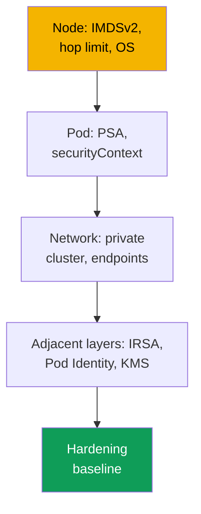
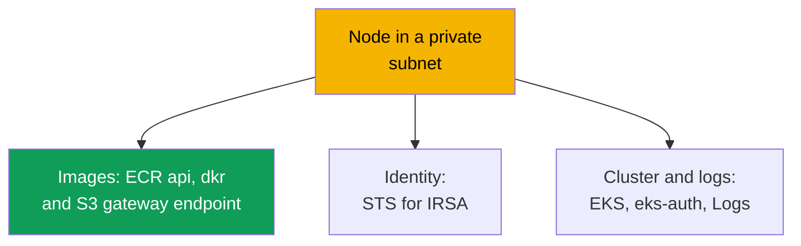

[Русская версия](ru.md) · [Versión en español](es.md) · [Version française](fr.md) · [Deutsche Version](de.md) · [ქართული ვერსია](ge.md) · [繁體中文版](tw.md) · [日本語版](jp.md)
# Chapter 19. Hardening: IMDSv2 and hop limit, Pod Security Admission, private cluster

> **What comes next.** Chapters 16-18 gave a pod its own role (IRSA, Pod Identity) and covered
> secrets (KMS, external stores). This chapter completes Part 3 and assembles hardening into
> layers: node (IMDS), pod (Pod Security Admission, `securityContext`), and network (private
> cluster, VPC endpoints). IMDS hardening complements chapters 16-17: even with IRSA, the node
> role remains a target. Related topics are in other chapters: private control plane endpoint and
> public/private modes (chapter 2), secrets and KMS (chapter 18), NetworkPolicy (chapter 30),
> Kyverno and Gatekeeper policies and multitenancy (chapter 22), audit, CloudTrail, and GuardDuty
> (chapter 21), and ECR (chapter 20).

## 19.1. "A pod reached 169.254.169.254 and took the node-role credentials"

IRSA is configured, the application has its own role, and the node role is minimal (chapter 16).
It seems that AWS access is under control. But a container is compromised, and the attacker runs
`curl` against `169.254.169.254/latest/meta-data/iam/security-credentials/`. By default, pods on
a node can often **reach the Instance Metadata Service (IMDS)** and retrieve the node role's
entire temporary credentials. It does not matter that application permissions were moved to IRSA:
the node role retains permissions for system components (pulling from ECR, CNI work with ENIs,
logs), and that is enough for lateral movement. IRSA provided least privilege at the pod level,
but **the network path to the node role remained open**.

Two related scenarios have the same nature:

- **A privileged pod mounted the node root.** A pod with `privileged: true` or a `hostPath` mount
  to `/` gains the host filesystem, kubelet credentials, and other pods' secrets. A namespace
  without Pod Security labels admits such a pod without a single warning.
- **The cluster needs private mode, but it does not start.** Nodes without Internet access do not
  come up: VPC endpoints are missing, so they cannot pull an image from ECR or register.

Three different problems, all solved with one approach: layered hardening.

## 19.2. Hardening as layers: node, pod, network

There is no "single security checkbox." EKS protection is assembled from independent layers: a
hole in one is not compensated for by the others.



- **Node layer**: block pods from accessing IMDS (IMDSv2 and hop limit), use a hardened OS, and
  restrict host mounts (sections 19.3 and 19.7).
- **Pod layer**: do not admit privileged pods, using PSA and `securityContext` (19.4-19.5).
- **Network layer**: private subnets without Internet access and VPC endpoints (section 19.6).

Identity (chapters 16-17) and secrets (chapter 18) are adjacent layers; the checklist is in 19.8.

## 19.3. IMDSv2 and hop limit in detail

IMDS is a link-local service at `169.254.169.254` from which an EC2 instance reads metadata and
**temporary node-role credentials**. There are two protocol versions.

- **IMDSv1**: request-response, `GET`, with credentials returned immediately. No token is needed,
  so anyone who makes an HTTP request from the instance (including a pod or application SSRF) can
  retrieve credentials.
- **IMDSv2**: session-based, first `PUT` for a token, then `GET` with the token in a header. This
  breaks naive SSRF. Make IMDSv2 **required** (`httpTokens=required`), otherwise IMDSv1 remains a
  bypass.

```bash
# retrieve credentials through IMDSv2: first a token (PUT), then a request with the token
TOKEN=$(curl -sX PUT "http://169.254.169.254/latest/api/token" \
  -H "X-aws-ec2-metadata-token-ttl-seconds: 21600")
curl -s -H "X-aws-ec2-metadata-token: $TOKEN" \
  http://169.254.169.254/latest/meta-data/iam/security-credentials/
```

But requiring IMDSv2 alone does not block a pod: a pod can also perform `PUT` and `GET`. The key
technique is the **hop limit** (`httpPutResponseHopLimit`), a TTL-like field that specifies how
many network hops the IMDS response is allowed. A packet from a process **on the host** passes one
hop; a packet **from a pod** goes through the container network namespace and takes an additional
hop.

This gives the trick: with a **hop limit of 1**, the IMDS response cannot reach a pod (there are
not enough hops), while the node and its components work as before. The pod can no longer retrieve
the node-role credentials, closing the hole in 19.1.

| `httpPutResponseHopLimit` | Node (host) | Pod | Comment |
|---|---|---|---|
| 1 | IMDS available | IMDS **unavailable** | recommended hardening value |
| 2 and above | IMDS available | IMDS available | the pod can retrieve node-role credentials (maximum 64) |

Configure this in the node **launch template** (chapter 10) or on a running instance:

```bash
# on a running instance: require IMDSv2 and set hop limit to 1
aws ec2 modify-instance-metadata-options --instance-id i-0abc123 \
  --http-tokens required --http-put-response-hop-limit 1 --http-endpoint enabled
```

AL2023 and Bottlerocket require IMDSv2 and set hop limit 1 by default. Managed node groups set
`httpTokens` and `httpPutResponseHopLimit` through a launch template.

Important connections and caveats:

- **Connection to IRSA (chapter 16).** Hop limit blocks IMDS, while IRSA removes application
  permissions from the node role: the role is minimal **and** cannot be stolen through IMDS.
- **A component may need IMDS.** With hop limit 1, it will not receive credentials from IMDS; give
  it a role through IRSA or Pod Identity. You can raise the hop limit to 2, but that reopens the
  node-role credentials. An extreme option is to disable IMDS entirely (`--http-endpoint disabled`).
- **Caveat about `hostNetwork: true`.** Such a pod runs in the host network namespace, so its
  packet reaches IMDS in one hop. Hop limit 1 does not block it, and metadata and node-role
  credentials are available. PSA, not hop limit, protects here: baseline and restricted forbid
  `hostNetwork`.

## 19.4. Pod Security Admission in detail

Pod Security Admission (PSA) is the built-in Kubernetes admission controller that replaced Pod
Security Policies (PSP were removed in 1.25). It applies the **Pod Security Standards**, three
strictness profiles at the namespace level.

- **privileged**: no restrictions.
- **baseline**: forbids the most dangerous settings: `privileged` containers, `hostNetwork`,
  `hostPID`, `hostIPC`, `hostPath` volumes, and dangerous Linux capabilities.
- **restricted**: a strict profile for production: everything in baseline, plus not running as root
  (`runAsNonRoot`), `allowPrivilegeEscalation: false`, dropping **all** capabilities (restore only
  `NET_BIND_SERVICE`), `seccompProfile` `RuntimeDefault`/`Localhost`, and restricted volume types.

PSA has three independent modes, which can be combined on a single namespace:

| Mode | What it does on a violation | When to use it |
|---|---|---|
| `enforce` | the pod is **rejected** | production prohibition |
| `audit` | the pod is created, with an event in the audit log | observation, profile rollout |
| `warn` | the pod is created, with a warning in the response | guidance for the manifest author |

Modes are configured with **labels on the namespace**. The key is
`pod-security.kubernetes.io/<mode>`, and you can add `<mode>-version` to pin the standard
version.

```bash
# enable restricted on a namespace: enforce strictly, audit and warn for rollout
kubectl label namespace payments \
  pod-security.kubernetes.io/enforce=restricted \
  pod-security.kubernetes.io/enforce-version=latest \
  pod-security.kubernetes.io/warn=restricted \
  pod-security.kubernetes.io/audit=restricted
```

An important EKS fact: PSA is an upstream mechanism that is **built in and enabled**, but the
level for a namespace without labels is **privileged**, so it restricts nothing. You must
**configure protection explicitly**: EKS does not apply restricted for you. Introduce the profile
gradually, first `warn` and `audit` to see violations, then `enforce`. Keep production namespaces
under restricted and system namespaces at least under baseline, but do not put `kube-system` under
restricted: privileged components such as CNI and Pod Identity Agent run there.

A convenient metric for violations is the control-plane metric
`apiserver_pod_security_evaluations_total`: its `decision`, `policy_level`, and `mode` labels show
how many pods trigger `audit` and `warn` in each profile. This is the list of what will fail when
a namespace is moved to `enforce`.

## 19.5. Pod and container securityContext

PSA checks what is specified in the pod and container `securityContext`. Restricted requires a
set of fields, so set them in the manifest.

```yaml
spec:                              # pod fragment for the restricted profile
  securityContext:
    runAsNonRoot: true             # do not run as root
    seccompProfile:
      type: RuntimeDefault         # runtime default seccomp profile
  containers:
    - name: app
      securityContext:
        allowPrivilegeEscalation: false   # privileges cannot be elevated (no setuid)
        readOnlyRootFilesystem: true      # read-only root filesystem
        capabilities:
          drop: ["ALL"]                   # drop all Linux capabilities
```

What each does and why (all except the last are restricted requirements):

- **`runAsNonRoot: true`**: do not start as root; root in a container is more dangerous during an
  escape.
- **`allowPrivilegeEscalation: false`**: the process cannot obtain more permissions (blocks setuid).
- **`capabilities.drop: ["ALL"]`**: drop capabilities; restore only `NET_BIND_SERVICE`.
- **`seccompProfile.type: RuntimeDefault`**: a syscall filter, and a frequent cause of failure
  when moving from baseline to restricted.
- **`readOnlyRootFilesystem: true`**: good practice, but **not** part of the restricted profile.

The relationship is direct: `securityContext` describes pod behavior, while PSA restricted
**checks** that the fields are set. PSA without securityContext rejects the pod, while
securityContext without PSA does not prevent a privileged pod from being run alongside it.

## 19.6. A private cluster as a data plane

This is not about a private control-plane endpoint (public/private modes are in chapter 2), but
about the **data plane**: nodes in private subnets without a route to an Internet Gateway and, in
the strict case, with no Internet access at all. Nodes and pods still need AWS services: pulling
an image from ECR, registering with the cluster, and obtaining credentials through STS. Without
Internet access, this works only through **VPC endpoints** (PrivateLink), private entry points to
services within the VPC. Without a required endpoint, a specific function breaks.



Endpoint set for a private cluster (from AWS documentation; substitute the region in
`region-code`):

| Service | Endpoint | What breaks without it |
|---|---|---|
| Amazon ECR | `ecr.api`, `ecr.dkr` | container images cannot be pulled |
| Amazon S3 (gateway) | `s3` | image layers cannot be downloaded from ECR |
| Amazon EC2 | `ec2` | the EKS Optimized AMI does not set the node DNS name |
| AWS STS | `sts` | IRSA cannot exchange a token for credentials (chapter 16) |
| EKS OIDC | `oidc-eks` | IRSA cannot be configured from within the VPC (chapter 16) |
| EKS Auth | `eks-auth` | Pod Identity does not work (chapter 17) |
| Amazon EKS | `eks` | no access to the EKS API from the VPC |
| CloudWatch Logs | `logs` | node and pod logs are not sent |
| Elastic Load Balancing | `elasticloadbalancing` | LB Controller cannot create ALB/NLB (chapter 26) |

Key details:

- **S3 is a gateway endpoint**, not an interface endpoint: it is free and is added to the route
  table. ECR image layers are stored in S3, so without an S3 endpoint, an image cannot be
  downloaded even when `ecr.api` and `ecr.dkr` are present.
- **Private API-server access is mandatory** (chapter 2), otherwise nodes cannot register.
- **OIDC and STS are different endpoints.** `oidc-eks` makes OIDC traffic from the VPC private,
  while `sts` handles `AssumeRoleWithWebIdentity`; both are needed (chapter 16). By default, v1
  SDKs go to global `sts.amazonaws.com`, bypassing the endpoint, so configure them to use regional
  STS.
- **Interface endpoints** require private DNS and an SG that permits the node-subnet CIDR.

## 19.7. Additional techniques at the node level

In addition to IMDS, harden the node through its OS and by limiting host mounts.

- **Bottlerocket is a hardened OS by design** (chapter 10): a minimal container OS with a
  read-only root, SELinux in enforcing mode, and atomic updates. SELinux and a read-only root
  limit what a node process can read and where it can write, even after a container escape.
- **PSA limits host mounts**: baseline and restricted forbid `hostPath`, `hostNetwork`, `hostPID`,
  and `hostIPC`, closing the "pod mounted the node root" issue from 19.1.

These techniques complement IMDS hardening: blocked IMDS does not help if a pod mounted the host
`/`.

## 19.8. Assembling a hardening baseline

The separate techniques form a baseline for every production environment: a verifiable list of
the layers from 19.2.

| Layer | What must be present | Chapter |
|---|---|---|
| Node | IMDSv2 required, hop limit 1 in the launch template | 19 |
| Node | hardened OS (Bottlerocket or AL2023) | 10, 19 |
| Pod | PSA restricted by default, with targeted exceptions | 19 |
| Pod | `securityContext` in workload manifests | 19 |
| Network | private subnets plus the required VPC endpoints | 19 |
| Identity | minimal node role plus IRSA/Pod Identity | 16, 17 |
| Secrets | KMS encryption, external stores | 18 |

Implementation order: first IMDS and the node role (the most common credential-theft vector),
then PSA from `warn`/`audit` to `enforce`, and separately a private cluster with the complete
endpoint set (19.6).

## 19.9. Diagnostics and verification

Verify hardening the same way it is broken: attempt what is prohibited and confirm that it does
not pass. **IMDS from a pod** with hop limit 1 must fail by timing out.

```bash
# reach IMDS from a temporary pod: this must NOT work (timeout)
kubectl run imds-test --rm -it --image=curlimages/curl --restart=Never -- \
  sh -c 'curl -s --max-time 5 http://169.254.169.254/latest/meta-data/ || echo BLOCKED'
```

`BLOCKED` (timeout) means hop limit blocked IMDS. If metadata is returned, hop limit is not 1 and
the pod can still retrieve node-role credentials. **PSA** must reject a privileged pod in a
restricted namespace.

```bash
# PSA labels on the namespace: without enforce there is no protection, and privileged passes
kubectl get namespace payments -o jsonpath='{.metadata.labels}' ; echo

# a privileged pod in a restricted namespace must be rejected by admission
kubectl -n payments run bad --image=busybox --restart=Never \
  --overrides='{"spec":{"containers":[{"name":"bad","image":"busybox","securityContext":{"privileged":true}}]}}'
```

If the `pod-security.kubernetes.io/enforce` label is absent and the privileged pod is admitted,
PSA is in privileged mode and there is no protection. Under restricted, the pod is rejected with a
standard-violation message.

**Private cluster: nodes do not come up or `ImagePullBackOff` occurs** means a required VPC
endpoint is missing. If nodes do not register, check private API access and `ec2`; if images do
not pull, check `ecr.api`, `ecr.dkr`, and **S3** (layers); if IRSA does not work, check `sts` and
`oidc-eks`.

## 19.10. How this is used in production

- **Block IMDS in a launch template, not manually.** Put `httpTokens=required` and
  `httpPutResponseHopLimit=1` in the node-group or Karpenter launch template so every new node
  starts hardened. Keep the node role minimal (chapter 16).
- **Introduce PSA gradually:** first `warn` and `audit`, then `enforce=restricted`. Use restricted
  by default on new namespaces, and baseline only as a targeted exception for privileged workloads.
- **Make securityContext part of the deployment template.** Put `runAsNonRoot`, dropped
  capabilities, seccomp, and `allowPrivilegeEscalation: false` in the base chart rather than
  adding them under PSA pressure.
- **Plan a private cluster from the endpoint list.** Create the set in 19.6 in IaC together with
  the VPC; a forgotten endpoint is immediately visible as a function failure. Regularly verify
  hardening with smoke tests: `curl` to IMDS and starting a privileged pod in a restricted namespace.

## 19.11. Mini-glossary

- **IMDS**: Instance Metadata Service at `169.254.169.254`; a source of metadata and node-role
  credentials. IMDSv1 has no token; IMDSv2 is session-based (`PUT` + token).
- **hop limit** (`httpPutResponseHopLimit`): the number of network hops for an IMDS response;
  at 1, a pod cannot reach IMDS while the node continues to work.
- **Pod Security Admission (PSA)**: the built-in admission controller that applies Pod Security
  Standards to a namespace through labels; it replaced Pod Security Policies.
- **Pod Security Standards**: privileged, baseline, and restricted profiles (strict, for
  production).
- **VPC endpoint (PrivateLink)**: a private entry point to an AWS service within a VPC; mandatory
  for ECR, S3, STS, EKS, and other services in a private data plane.

## 19.12. Chapter summary

- Even with IRSA, the node role remains a target: by default a pod can reach IMDS and retrieve its
  credentials. The network path to the node role must be closed separately. Hardening consists of
  independent layers.
- IMDSv2 (`httpTokens=required`) breaks SSRF, but a pod can still access IMDS. The key is hop
  limit 1: a packet from a pod takes an additional hop and cannot reach IMDS; AL2023 and
  Bottlerocket set this.
- PSA applies Pod Security Standards (privileged/baseline/restricted) in enforce/audit/warn modes
  through `pod-security.kubernetes.io/*` labels. PSA is built into EKS but defaults to privileged,
  so configure restricted explicitly. Restricted requires `runAsNonRoot`,
  `allowPrivilegeEscalation: false`, dropping all capabilities, `RuntimeDefault` seccomp, and
  restricted volume types; it does not include `readOnlyRootFilesystem`.
- A private data plane requires private subnets and VPC endpoints: ECR api and dkr, S3 (gateway,
  layers), STS and oidc-eks (IRSA), eks-auth (Pod Identity), ec2, logs, and eks. Verify through a
  prohibited attempt: `curl` to IMDS times out and a privileged pod is rejected.

## 19.13. How this helps in real work

With IMDS closed, the question "can a compromised pod retrieve node-role credentials" is answered
with a single `curl` from a pod rather than auditing every permission on the role. The incident
"a privileged pod mounted the host" is impossible where the namespace is restricted. And a private
cluster that "does not start" can be diagnosed from the endpoint list in 19.6: the function that
broke identifies the missing endpoint. Layered hardening is useful because each layer is verified
by a separate fast test, and a review makes it clear which layer is absent.

## 19.14. Self-check questions

1. Why does configured IRSA not remove the need to block pods from IMDS?
2. How does IMDSv1 differ from IMDSv2, and why does requiring IMDSv2 alone not block a pod?
3. How does hop limit 1 prevent a pod from accessing IMDS while keeping access for the node? What
   is the additional hop?
4. In which object are `httpTokens` and `httpPutResponseHopLimit` set for EKS nodes?
5. What should be done with a component that genuinely needs IMDS when hop limit is 1?
6. Which three profiles do Pod Security Standards provide, and what exactly does restricted forbid?
7. How do enforce, audit, and warn modes differ, and why are they introduced in that order?
8. Which labels enable PSA on a namespace, and why must this be done explicitly in EKS?
9. Which `securityContext` fields does restricted require, and which field is not part of it?
10. Why does a private cluster need an S3 gateway endpoint if ECR endpoints already exist?
11. How do the `sts`, `oidc-eks`, and `eks-auth` endpoints differ?
12. How can a single request from a pod verify that IMDS is blocked for it?

## Practice

The course lab for this topic is [lab 116: Hardening: IMDSv2 and hop limit, Pod Security Admission,
private endpoint](../../labs/116/README.MD). In addition, everything can be verified on a running
cluster. Node: `aws ec2 describe-instances --instance-ids <id> --query
'Reservations[].Instances[].MetadataOptions'`: confirm that `HttpTokens` is `required` and
`HttpPutResponseHopLimit` is `1`. Start a pod with `curlimages/curl` and run
`curl --max-time 5 http://169.254.169.254/latest/meta-data/`: with hop limit 1, the request times
out. Raise hop limit to 2 and repeat, then return it to 1.

Next, PSA. Apply `pod-security.kubernetes.io/warn=restricted` and `audit=restricted` to a
namespace, run a typical deployment, and read the warnings: they are the list of what will not
pass enforce. Add the `securityContext` from 19.5, obtain a clean pass, switch to
`enforce=restricted`, and confirm that a privileged pod is rejected. If you have a private VPC,
use `aws ec2 describe-vpc-endpoints` to compare it with the table in 19.6 and confirm that ECR
(api and dkr), S3, STS, eks, and logs are present, and that private access is enabled (chapter 2).

---
[Table of contents](../README.md) · [Chapter 18](../18/en.md) · [Chapter 20](../20/en.md)
