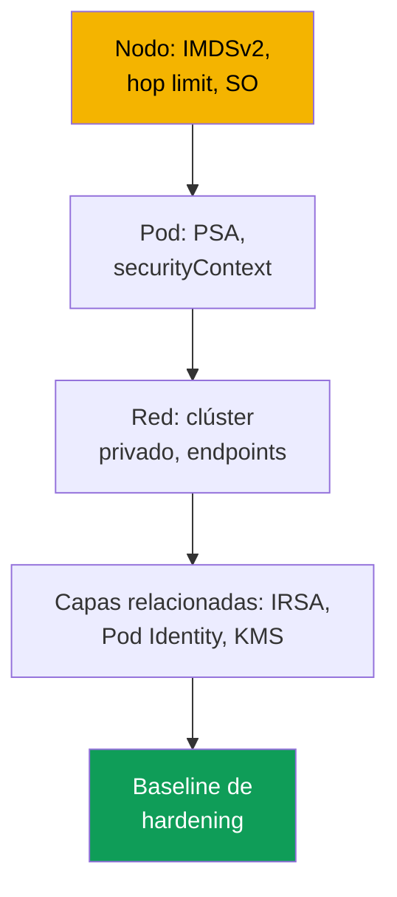
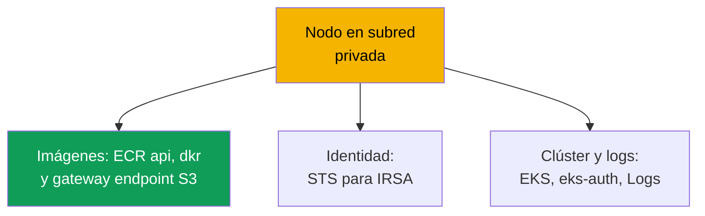

[Русская версия](ru.md) · [Eng version](en.md) · [Version française](fr.md) · [Deutsche Version](de.md) · [ქართული ვერსია](ge.md) · [繁體中文版](tw.md) · [日本語版](jp.md)
# Capítulo 19. Hardening: IMDSv2 y hop limit, Pod Security Admission, clúster privado

> **Qué sigue.** Los capítulos 16-18 asignaron al pod su rol (IRSA, Pod Identity) y protegieron los secretos
> (KMS, almacenes externos). Este capítulo concluye la Parte 3 y reúne el hardening en capas: nodo
> (IMDS), pod (Pod Security Admission, securityContext) y red (clúster privado, VPC
> endpoints). El hardening de IMDS complementa los capítulos 16-17: incluso con IRSA, el rol del nodo sigue siendo un objetivo.
> Los temas relacionados están en otros capítulos: endpoint privado del control plane y modos public/private (capítulo
> 2), secretos y KMS (capítulo 18), NetworkPolicy (capítulo 30), políticas de Kyverno y Gatekeeper y
> multitenencia (capítulo 22), auditoría, CloudTrail y GuardDuty (capítulo 21), ECR (capítulo 20).

## 19.1. «El pod consultó 169.254.169.254 y obtuvo las credenciales del rol del nodo»

IRSA está configurado, la aplicación tiene su propio rol y el rol del nodo es mínimo (capítulo 16). Parece que el acceso a AWS
está bajo control. Pero se compromete un contenedor y el atacante hace `curl` a
`169.254.169.254/latest/meta-data/iam/security-credentials/`. De forma predeterminada, los pods del nodo a menudo
**pueden llegar al Instance Metadata Service (IMDS)** y obtienen por completo las credenciales temporales del rol del nodo.
Y no importa que los permisos de aplicación se hayan llevado a IRSA: el rol del nodo conserva los permisos de los
componentes del sistema (pull desde ECR, operación del CNI con ENI, logs), y bastan para el movimiento lateral. IRSA
resolvió el least privilege a nivel de pod, pero **la ruta de red hacia el rol del nodo permaneció abierta**.

Hay dos escenarios relacionados, de la misma naturaleza:

- **Un pod privilegiado montó la raíz del nodo.** Un pod con `privileged: true` o `hostPath` en
  `/` obtiene el sistema de archivos del host, credenciales de kubelet y secretos de otros pods. Un
  namespace sin etiquetas de Pod Security permite ese pod sin una sola advertencia.
- **El clúster necesita el modo privado, pero no arranca.** Los nodos sin salida a Internet no
  se levantan: no hay VPC endpoints, y no pueden extraer una imagen de ECR ni registrarse.

Tres problemas diferentes, pero se solucionan con el mismo enfoque: hardening por capas.

## 19.2. El hardening por capas: nodo, pod, red

No existe una «única casilla de seguridad». La protección de EKS se compone de capas independientes: un hueco en
una no se compensa con las demás.



- **Capa del nodo**: cerrar IMDS para los pods (IMDSv2 y hop limit), SO reforzado, restricción de
  montajes del host (secciones 19.3 y 19.7).
- **Capa del pod**: no permitir pods privilegiados: PSA y `securityContext` (19.4-19.5).
- **Capa de red**: subredes privadas sin salida a Internet y VPC endpoints (sección 19.6).

La identidad (capítulos 16-17) y los secretos (capítulo 18) son capas relacionadas; el checklist se reúne en 19.8.

## 19.3. IMDSv2 y hop limit en detalle

IMDS es un servicio link-local en `169.254.169.254` desde el que la instancia EC2 lee metadatos y
**credenciales temporales del rol del nodo**. Hay dos versiones del protocolo.

- **IMDSv1**: solicitud-respuesta: `GET`, y la respuesta contiene directamente las credenciales. No hace falta
  token, por lo que cualquiera que haga una solicitud HTTP desde la instancia (incluidos un pod y un SSRF en la aplicación)
  obtiene las credenciales.
- **IMDSv2**: basado en sesión: primero un `PUT` para obtener un token, después un `GET` con el token en la cabecera. Esto
  rompe un SSRF ingenuo. IMDSv2 debe hacerse **obligatorio** (`httpTokens=required`), de lo contrario IMDSv1
  sigue siendo una vía de evasión.

```bash
# obtener credenciales mediante IMDSv2: primero el token (PUT), después la solicitud con el token
TOKEN=$(curl -sX PUT "http://169.254.169.254/latest/api/token" \
  -H "X-aws-ec2-metadata-token-ttl-seconds: 21600")
curl -s -H "X-aws-ec2-metadata-token: $TOKEN" \
  http://169.254.169.254/latest/meta-data/iam/security-credentials/
```

Pero exigir IMDSv2 por sí solo no cierra el acceso del pod: un pod también sabe hacer `PUT` y `GET`. La técnica
clave es el **hop limit** (`httpPutResponseHopLimit`), un campo similar al TTL: cuántos saltos de red tiene permitida
la respuesta de IMDS. Un paquete de un proceso **en el host** cruza un hop; un paquete **desde un pod**
va mediante el namespace de red del contenedor y realiza un salto adicional.

De ahí el truco: con **hop limit = 1**, la respuesta de IMDS no llega al pod (no le alcanzan los hops),
pero el nodo y sus componentes siguen funcionando igual. El pod ya no obtiene las credenciales del rol del nodo: el hueco de
19.1 queda cerrado.

| `httpPutResponseHopLimit` | Nodo (host) | Pod | Comentario |
|---|---|---|---|
| 1 | IMDS disponible | IMDS **no disponible** | valor recomendado para hardening |
| 2 y superior | IMDS disponible | IMDS disponible | el pod obtiene las credenciales del rol del nodo (máximo 64) |

Esto se configura en el **launch template** del nodo (capítulo 10) o en una instancia activa:

```bash
# en una instancia activa: exigir IMDSv2 y hop limit 1
aws ec2 modify-instance-metadata-options --instance-id i-0abc123 \
  --http-tokens required --http-put-response-hop-limit 1 --http-endpoint enabled
```

AL2023 y Bottlerocket exigen IMDSv2 de forma predeterminada y establecen hop limit en 1. Los managed node groups
establecen `httpTokens` y `httpPutResponseHopLimit` mediante launch template.

Relaciones y advertencias importantes:

- **Relación con IRSA (capítulo 16).** El hop limit cierra IMDS, e IRSA quita los permisos de aplicación del rol
  del nodo: el rol es mínimo **y** no se puede robar mediante IMDS.
- **Un componente puede necesitar IMDS.** Con hop limit 1 no obtendrá credenciales de IMDS: el rol se le
  proporciona mediante IRSA o Pod Identity. Se puede elevar el hop limit a 2, pero esto vuelve a abrir las
  credenciales del rol del nodo. La opción extrema es desactivar IMDS por completo (`--http-endpoint disabled`).
- **Advertencia sobre `hostNetwork: true`.** Ese pod vive en el namespace de red del host; su paquete
  hacia IMDS va en un hop, por lo que hop limit 1 no lo bloquea y los metadatos y las credenciales del rol del nodo
  están disponibles. Aquí no salva el hop limit, sino PSA: baseline y restricted prohíben `hostNetwork`.

## 19.4. Pod Security Admission en detalle

Pod Security Admission (PSA) es el admission controller incorporado de Kubernetes que sustituye a Pod Security
Policies (PSP se eliminó en 1.25). Aplica los **Pod Security Standards**, tres perfiles de rigor
a nivel de namespace.

- **privileged**: sin restricciones.
- **baseline**: prohíbe lo más peligroso: contenedores `privileged`, `hostNetwork`, `hostPID`,
  `hostIPC`, volúmenes `hostPath`, Linux capabilities peligrosas.
- **restricted**: perfil estricto para producción: todo lo de baseline más no ejecutar como root
  (`runAsNonRoot`), `allowPrivilegeEscalation: false`, eliminar **todas** las capabilities (devolver solo
  `NET_BIND_SERVICE`), `seccompProfile` `RuntimeDefault`/`Localhost`, tipos de volumen restringidos.

PSA tiene tres modos y son independientes; se pueden combinar en un mismo namespace:

| Modo | Qué hace ante una infracción | Cuándo aplicarlo |
|---|---|---|
| `enforce` | el pod se **rechaza** | prohibición en producción |
| `audit` | el pod se crea, evento en el audit log | observación, prueba del perfil |
| `warn` | el pod se crea, advertencia en la respuesta | pista para el autor del manifiesto |

Los modos se establecen mediante **etiquetas en el namespace**. La clave es `pod-security.kubernetes.io/<modo>`, y
se puede añadir `<modo>-version` para fijar la versión del estándar.

```bash
# activar restricted en el namespace: enforce estricto, audit y warn para la prueba
kubectl label namespace payments \
  pod-security.kubernetes.io/enforce=restricted \
  pod-security.kubernetes.io/enforce-version=latest \
  pod-security.kubernetes.io/warn=restricted \
  pod-security.kubernetes.io/audit=restricted
```

Un hecho importante sobre EKS: PSA es un mecanismo upstream, está **incorporado y activado**, pero el nivel para un
namespace sin etiquetas es **privileged**, es decir, no restringe nada. La protección debe **establecerse
explícitamente**: EKS no aplica restricted por usted. El perfil se introduce gradualmente: primero `warn` y
`audit` para ver los infractores, después `enforce`. Los namespaces de producción se mantienen bajo restricted,
los del sistema como mínimo bajo baseline, y `kube-system` no se fuerza a restricted: allí viven componentes
privilegiados como CNI y Pod Identity Agent.

Es útil contar las infracciones con la métrica del control plane `apiserver_pod_security_evaluations_total`: sus
etiquetas `decision`, `policy_level` y `mode` muestran cuántos pods encuentran `audit` y `warn` en
cada perfil. Esa es la lista de lo que fallará al cambiar el namespace a `enforce`.

## 19.5. securityContext del pod y del contenedor

PSA comprueba lo establecido en el `securityContext` del pod y sus contenedores. restricted exige un conjunto de
campos, que se establecen en el manifiesto.

```yaml
spec:                              # fragmento de pod para el perfil restricted
  securityContext:
    runAsNonRoot: true             # no ejecutar como root
    seccompProfile:
      type: RuntimeDefault         # perfil seccomp predeterminado del runtime
  containers:
    - name: app
      securityContext:
        allowPrivilegeEscalation: false   # no se pueden elevar privilegios (sin setuid)
        readOnlyRootFilesystem: true      # sistema de archivos raíz de solo lectura
        capabilities:
          drop: ["ALL"]                   # eliminar todas las Linux capabilities
```

Qué y por qué (todos salvo el último son requisitos de restricted):

- **`runAsNonRoot: true`**: no iniciar como root; root en el contenedor es más peligroso ante un escape.
- **`allowPrivilegeEscalation: false`**: el proceso no obtiene más permisos (bloquea setuid).
- **`capabilities.drop: ["ALL"]`**: eliminar capabilities; devolver solo `NET_BIND_SERVICE`.
- **`seccompProfile.type: RuntimeDefault`**: filtro de syscalls; causa frecuente de fallo al
  pasar de baseline a restricted.
- **`readOnlyRootFilesystem: true`**: buena práctica, pero **no forma parte** del perfil restricted.

La relación es directa: `securityContext` describe el comportamiento del pod, PSA restricted **comprueba**
que los campos estén establecidos. PSA sin securityContext rechazará el pod, y securityContext sin PSA no impide
que se ejecute al lado un pod privilegiado.

## 19.6. El clúster privado como nodo de datos

No se trata del endpoint privado del control plane (modos public/private, capítulo 2), sino del **nodo de
datos**: nodos en subredes privadas sin ruta hacia Internet Gateway y, en la variante estricta, sin salida a
Internet en absoluto. Pero los nodos y pods siguen necesitando servicios de AWS: extraer una imagen de ECR,
registrarse en el clúster, obtener credenciales mediante STS. Sin Internet esto funciona solo mediante
**VPC endpoints** (PrivateLink), puntos de entrada privados a servicios dentro de la VPC. Si falta el endpoint
necesario, falla una función concreta.



Conjunto de endpoints para un clúster privado (según la documentación de AWS; la región se sustituye en
`region-code`):

| Servicio | Endpoint | Qué falla sin él |
|---|---|---|
| Amazon ECR | `ecr.api`, `ecr.dkr` | no se extraen imágenes de contenedor |
| Amazon S3 (gateway) | `s3` | no se descargan capas de imágenes desde ECR |
| Amazon EC2 | `ec2` | EKS Optimized AMI no establece el nombre DNS del nodo |
| AWS STS | `sts` | IRSA no intercambia el token por credenciales (capítulo 16) |
| EKS OIDC | `oidc-eks` | no se puede configurar IRSA desde dentro de la VPC (capítulo 16) |
| EKS Auth | `eks-auth` | Pod Identity no funciona (capítulo 17) |
| Amazon EKS | `eks` | no hay acceso a la API de EKS desde la VPC |
| CloudWatch Logs | `logs` | no se envían logs de nodos y pods |
| Elastic Load Balancing | `elasticloadbalancing` | LB Controller no crea ALB/NLB (capítulo 26) |

Detalles clave:

- **S3 es un gateway endpoint**, no interface: es gratuito y se añade a la tabla de rutas. Las capas de
  imágenes de ECR están en S3, así que sin el endpoint de S3 la imagen no se descarga, aunque `ecr.api` y
  `ecr.dkr` estén presentes.
- **El acceso privado al API server es obligatorio** (capítulo 2), de lo contrario los nodos no se registran.
- **OIDC y STS son endpoints distintos.** `oidc-eks` privatiza el tráfico OIDC desde la VPC; `sts`,
  la llamada a `AssumeRoleWithWebIdentity`; se necesitan ambos (capítulo 16). Los SDK v1 por defecto van al
  `sts.amazonaws.com` global fuera del endpoint: se configuran para STS regional.
- **Los interface endpoints** necesitan DNS privado y un SG que permita el CIDR de las subredes de los nodos.

## 19.7. Técnicas adicionales a nivel de nodo

Además de IMDS, el nodo se refuerza mediante el SO y la restricción de montajes del host.

- **Bottlerocket es un SO reforzado por diseño** (capítulo 10): SO de contenedores mínimo, raíz de solo
  lectura, SELinux en enforcing, actualizaciones atómicas. SELinux y la raíz de solo lectura restringen qué
  lee un proceso en el nodo y dónde escribe, incluso si escapa del contenedor.
- **PSA restringe los montajes del host**: baseline y restricted prohíben `hostPath`,
  `hostNetwork`, `hostPID`, `hostIPC`; esto cierra el caso de «el pod montó la raíz del nodo» de 19.1.

Estas técnicas complementan el hardening de IMDS: IMDS cerrado no salvará nada si un pod montó el `/` del host.

## 19.8. Cómo se reúne en un baseline de hardening

Las técnicas individuales se combinan en un conjunto base para cada producción: una lista verificable de las capas de
19.2.

| Capa | Qué debe existir | Capítulo |
|---|---|---|
| Nodo | IMDSv2 required, hop limit 1 en launch template | 19 |
| Nodo | SO reforzado (Bottlerocket o AL2023) | 10, 19 |
| Pod | PSA restricted de forma predeterminada, excepciones puntuales | 19 |
| Pod | `securityContext` en manifiestos de cargas de trabajo | 19 |
| Red | subredes privadas + VPC endpoints necesarios | 19 |
| Identidad | rol mínimo del nodo + IRSA/Pod Identity | 16, 17 |
| Secretos | cifrado KMS, almacenes externos | 18 |

Orden de implementación: primero IMDS y el rol del nodo (el vector más frecuente de robo de credenciales), después
PSA de `warn`/`audit` a `enforce`; por separado, el clúster privado con el conjunto completo de endpoints (19.6).

## 19.9. Diagnóstico y verificación

El hardening se comprueba del mismo modo en que se vulnera: se intenta lo prohibido y se verifica que no
pase. **IMDS desde un pod** con hop limit 1 debe fallar por timeout.

```bash
# llegar a IMDS desde un pod temporal: NO debe funcionar (timeout)
kubectl run imds-test --rm -it --image=curlimages/curl --restart=Never -- \
  sh -c 'curl -s --max-time 5 http://169.254.169.254/latest/meta-data/ || echo BLOCKED'
```

`BLOCKED` (timeout) significa que hop limit cerró IMDS. Si regresan metadatos, el hop limit no es 1 y el pod aún
puede obtener las credenciales del rol del nodo. **PSA** debe rechazar un pod privilegiado en un namespace restricted.

```bash
# etiquetas PSA del namespace: sin enforce no hay protección, privileged pasa
kubectl get namespace payments -o jsonpath='{.metadata.labels}' ; echo

# el pod privileged en un namespace restricted debe ser rechazado por admission
kubectl -n payments run bad --image=busybox --restart=Never \
  --overrides='{"spec":{"containers":[{"name":"bad","image":"busybox","securityContext":{"privileged":true}}]}}'
```

Si no hay etiqueta `pod-security.kubernetes.io/enforce` y el pod privilegiado pasa, PSA está en modo privileged y
no hay protección. En restricted el pod se rechazará con un mensaje de infracción del estándar.

**Clúster privado: los nodos no se levantan o aparece `ImagePullBackOff`**: falta el VPC endpoint necesario.
Si no se registran, faltan el acceso privado al API y `ec2`; si no se extraen imágenes, faltan `ecr.api`, `ecr.dkr` y
**S3** (capas); si IRSA no funciona, faltan `sts` y `oidc-eks`.

## 19.10. Cómo se aplica en producción

- **IMDS se cierra en launch template, no a mano.** Se colocan `httpTokens=required` y
  `httpPutResponseHopLimit=1` en el launch template del node group o Karpenter, para que cada nodo
  nuevo se levante reforzado. El rol del nodo se mantiene mínimo (capítulo 16).
- **PSA se introduce gradualmente:** primero `warn` y `audit`, después `enforce=restricted`. restricted
  de forma predeterminada en namespaces nuevos; para cargas de trabajo privilegiadas, baseline de forma puntual.
- **securityContext forma parte de la plantilla de despliegue.** `runAsNonRoot`, drop capabilities, seccomp y
  `allowPrivilegeEscalation: false` se ponen en el chart base, no se añaden bajo la presión de PSA.
- **El clúster privado se planifica según la lista de endpoints.** El conjunto de 19.6 se crea en IaC junto con la
  VPC; un endpoint olvidado se ve de inmediato como el fallo de una función. El hardening se comprueba regularmente
  con smoke tests: `curl` a IMDS y el inicio de un pod privilegiado en un namespace restricted.

## 19.11. Mini glosario

- **IMDS**: Instance Metadata Service en `169.254.169.254`; fuente de metadatos y credenciales del rol del
  nodo. IMDSv1 no usa token; IMDSv2 está basado en sesión (`PUT`+token).
- **hop limit** (`httpPutResponseHopLimit`): número de saltos de red para la respuesta de IMDS; con 1 el pod no
  llega a IMDS, mientras que el nodo funciona.
- **Pod Security Admission (PSA)**: admission controller incorporado que aplica Pod Security
  Standards a un namespace mediante etiquetas; reemplazó Pod Security Policies.
- **Pod Security Standards**: perfiles privileged, baseline, restricted (estricto, para producción).
- **VPC endpoint (PrivateLink)**: punto de entrada privado a un servicio de AWS dentro de la VPC; para un
  nodo de datos privado es obligatorio para ECR, S3, STS, EKS y otros.

## 19.12. Resumen del capítulo

- Incluso con IRSA, el rol del nodo sigue siendo un objetivo: por defecto el pod llega a IMDS y obtiene sus credenciales.
  La ruta de red al rol del nodo debe cerrarse por separado. El hardening son capas independientes.
- IMDSv2 (`httpTokens=required`) rompe SSRF, pero el pod aún llega a IMDS. La clave es hop limit
  1: el paquete desde el pod hace un salto adicional y no llega a IMDS; AL2023 y Bottlerocket establecen esto.
- PSA aplica Pod Security Standards (privileged/baseline/restricted) en los modos
  enforce/audit/warn mediante las etiquetas `pod-security.kubernetes.io/*`. En EKS, PSA está incorporado, pero de
  forma predeterminada es privileged: restricted se establece explícitamente. restricted exige `runAsNonRoot`,
  `allowPrivilegeEscalation: false`, eliminar todas las capabilities, seccomp `RuntimeDefault`,
  tipos de volumen restringidos; `readOnlyRootFilesystem` no forma parte de él.
- El nodo de datos privado requiere subredes privadas y VPC endpoints: ECR api y dkr, S3 (gateway,
  capas), STS y oidc-eks (IRSA), eks-auth (Pod Identity), ec2, logs, eks. La comprobación se hace intentando
  lo prohibido: `curl` a IMDS falla por timeout y el pod privilegiado se rechaza.

## 19.13. Cómo sirve en el trabajo real

La pregunta «¿puede un pod comprometido obtener las credenciales del rol del nodo?» con IMDS cerrado se responde con
un solo `curl` desde el pod, no auditando todos los permisos del rol. El incidente «un pod privilegiado montó el
host» es imposible donde el namespace está bajo restricted. Y un clúster privado que «no arranca» se resuelve
mediante la lista de endpoints de 19.6: la función que se rompió indica el endpoint que falta. El hardening por capas
es práctico porque cada capa se comprueba con una prueba rápida independiente y en una revisión se ve qué capa falta.

## 19.14. Preguntas de autoevaluación

1. ¿Por qué tener IRSA configurado no elimina la necesidad de cerrar IMDS para los pods?
2. ¿En qué se diferencia IMDSv1 de IMDSv2 y por qué exigir IMDSv2 por sí solo no cierra el acceso del pod?
3. ¿Cómo hop limit 1 no permite que el pod llegue a IMDS, pero conserva el acceso del propio nodo? ¿Cuál es el salto adicional?
4. ¿En qué objeto se establecen `httpTokens` y `httpPutResponseHopLimit` para los nodos de EKS?
5. ¿Qué hacer con un componente que realmente necesita IMDS con hop limit 1?
6. ¿Qué tres perfiles ofrece Pod Security Standards y qué prohíbe exactamente restricted?
7. ¿En qué se diferencian los modos enforce, audit y warn, y por qué se introducen en ese orden?
8. ¿Con qué etiquetas se activa PSA en un namespace y por qué hay que hacerlo explícitamente en EKS?
9. ¿Qué campos de `securityContext` exige restricted y qué campo no forma parte de él?
10. ¿Por qué un clúster privado necesita un S3 gateway endpoint si los endpoints de ECR ya existen?
11. ¿En qué se diferencian los endpoints `sts`, `oidc-eks` y `eks-auth`?
12. ¿Cómo comprobar con una sola solicitud desde un pod que IMDS está cerrado para él?

## Práctica

El laboratorio del curso para este tema: [laboratorio 116: Hardening: IMDSv2 y hop limit, Pod Security Admission,
endpoint privado](../../labs/116/README_ES.MD). Además, todo se comprueba en un clúster activo. Nodo: `aws ec2
describe-instances --instance-ids <id> --query 'Reservations[].Instances[].MetadataOptions'`: asegúrese de que
`HttpTokens` sea `required` y `HttpPutResponseHopLimit` sea `1`. Ejecute un pod con `curlimages/curl` y
`curl --max-time 5 http://169.254.169.254/latest/meta-data/`: con hop limit 1 la solicitud falla por timeout.
Eleve hop limit a 2 y repita; después vuelva a 1.

A continuación, PSA. Aplique a un namespace `pod-security.kubernetes.io/warn=restricted` y
`audit=restricted`, ejecute un despliegue típico y lea las advertencias: esa es la lista de lo que no
pasará enforce. Añada el `securityContext` de 19.5, consiga una ejecución limpia, cambie a
`enforce=restricted` y compruebe que el pod privilegiado se rechaza. Si tiene una VPC privada, compruebe según la
tabla de 19.6 mediante `aws ec2 describe-vpc-endpoints` que ECR (api y dkr), S3, STS, eks y logs están presentes,
y que el acceso privado está activado (capítulo 2).

---
[Índice](../README_ES.md) · [Capítulo 18](../18/es.md) · [Capítulo 20](../20/es.md)
