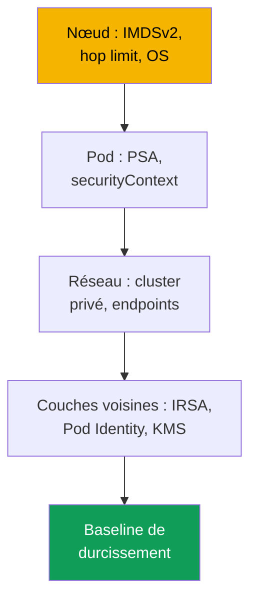
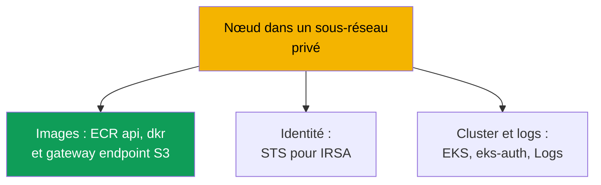

[Русская версия](ru.md) · [Eng version](en.md) · [Versión en español](es.md) · [Deutsche Version](de.md) · [ქართული ვერსია](ge.md) · [繁體中文版](tw.md) · [日本語版](jp.md)
# Chapitre 19. Durcissement : IMDSv2 et hop limit, Pod Security Admission, cluster privé

> **La suite.** Les chapitres 16 à 18 ont donné son rôle au pod (IRSA, Pod Identity) et protégé les secrets
> (KMS, stockages externes). Ce chapitre conclut la partie 3 et organise le durcissement en couches : nœud
> (IMDS), pod (Pod Security Admission, securityContext) et réseau (cluster privé, VPC
> endpoints). Le durcissement d'IMDS complète les chapitres 16 et 17 : même avec IRSA, le rôle du nœud reste une cible.
> Les sujets connexes sont dans d'autres chapitres : endpoint privé du control plane et modes public/privé (chapitre
> 2), secrets et KMS (chapitre 18), NetworkPolicy (chapitre 30), politiques Kyverno et Gatekeeper et
> multitenancy (chapitre 22), audit, CloudTrail et GuardDuty (chapitre 21), ECR (chapitre 20).

## 19.1. « Le pod a atteint 169.254.169.254 et récupéré les identifiants du rôle du nœud »

IRSA est configuré, l'application a son propre rôle et le rôle du nœud est minimal (chapitre 16). L'accès à AWS
semble sous contrôle. Mais le conteneur est compromis et l'attaquant fait un `curl` vers
`169.254.169.254/latest/meta-data/iam/security-credentials/`. Par défaut, les pods d'un nœud peuvent souvent
**atteindre l'Instance Metadata Service (IMDS)** et récupérer tous les identifiants temporaires du rôle du nœud.
Peu importe que les droits applicatifs aient été déplacés vers IRSA : le rôle du nœud conserve les droits des
composants système (pull depuis ECR, travail du CNI avec les ENI, logs), ce qui suffit pour un mouvement latéral.
IRSA assure le least privilege au niveau du pod, mais **le chemin réseau vers le rôle du nœud est resté ouvert**.

Deux scénarios apparentés sont de même nature :

- **Un pod privilégié a monté la racine du nœud.** Un pod avec `privileged: true` ou un `hostPath` vers
  `/` obtient le système de fichiers de l'hôte, les identifiants de kubelet et les secrets d'autres pods. Un
  namespace sans labels Pod Security laisse passer un tel pod sans le moindre avertissement.
- **Le cluster a besoin du mode privé, mais ne démarre pas.** Les nœuds sans sortie Internet ne se lancent
  pas : il n'y a pas de VPC endpoints et ils ne peuvent ni récupérer une image depuis ECR ni s'enregistrer.

Trois problèmes distincts, mais une même solution : le durcissement par couches.

## 19.2. Le durcissement par couches : nœud, pod, réseau

Il n'existe pas de « case de sécurité unique ». La protection EKS est construite avec des couches indépendantes :
une faille dans l'une n'est pas compensée par les autres.



- **Couche nœud** : fermer IMDS aux pods (IMDSv2 et hop limit), OS durci, restriction des
  montages hôte (sections 19.3 et 19.7).
- **Couche pod** : ne pas laisser passer les pods privilégiés : PSA et `securityContext` (19.4-19.5).
- **Couche réseau** : sous-réseaux privés sans sortie Internet et VPC endpoints (section 19.6).

L'identité (chapitres 16 et 17) et les secrets (chapitre 18) sont des couches voisines ; la checklist est réunie en 19.8.

## 19.3. IMDSv2 et hop limit en pratique

IMDS est un service link-local sur `169.254.169.254`, depuis lequel une instance EC2 lit les métadonnées et les
**identifiants temporaires du rôle du nœud**. Il existe deux versions du protocole.

- **IMDSv1** : requête-réponse, un `GET` retourne directement les identifiants. Aucun token n'est requis ;
  toute entité qui effectue une requête HTTP depuis l'instance (y compris un pod et un SSRF dans une application)
  récupère donc les identifiants.
- **IMDSv2** : session-based : on demande d'abord un token avec `PUT`, puis on fait un `GET` avec le token
  dans l'en-tête. Cela casse les SSRF naïfs. IMDSv2 doit être **obligatoire** (`httpTokens=required`), sinon
  IMDSv1 reste une voie de contournement.

```bash
# récupérer les identifiants via IMDSv2 : d'abord le token (PUT), puis la requête avec le token
TOKEN=$(curl -sX PUT "http://169.254.169.254/latest/api/token" \
  -H "X-aws-ec2-metadata-token-ttl-seconds: 21600")
curl -s -H "X-aws-ec2-metadata-token: $TOKEN" \
  http://169.254.169.254/latest/meta-data/iam/security-credentials/
```

Mais IMDSv2 obligatoire ne ferme pas le pod à lui seul : un pod sait aussi faire `PUT` et `GET`. La technique
clé est le **hop limit** (`httpPutResponseHopLimit`), un champ similaire au TTL : le nombre de sauts réseau
autorisés pour une réponse IMDS. Un paquet d'un processus **sur l'hôte** passe en un hop ; un paquet **depuis un pod**
traverse le namespace réseau du conteneur et fait un saut supplémentaire.

D'où l'astuce : avec un **hop limit = 1**, la réponse IMDS n'atteint pas le pod (il manque un hop), tandis que le
nœud et ses composants fonctionnent comme avant. Le pod ne peut plus récupérer les identifiants du rôle du nœud :
la faille de 19.1 est fermée.

| `httpPutResponseHopLimit` | Nœud (hôte) | Pod | Commentaire |
|---|---|---|---|
| 1 | IMDS accessible | IMDS **inaccessible** | valeur recommandée pour le durcissement |
| 2 et plus | IMDS accessible | IMDS accessible | le pod récupère les identifiants du rôle du nœud (maximum 64) |

Cela se configure dans le **launch template** du nœud (chapitre 10) ou sur une instance active :

```bash
# sur une instance active : exiger IMDSv2 et un hop limit de 1
aws ec2 modify-instance-metadata-options --instance-id i-0abc123 \
  --http-tokens required --http-put-response-hop-limit 1 --http-endpoint enabled
```

AL2023 et Bottlerocket exigent IMDSv2 par défaut et définissent un hop limit de 1. Les managed node groups
configurent `httpTokens` et `httpPutResponseHopLimit` via le launch template.

Liens et réserves importants :

- **Lien avec IRSA (chapitre 16).** Le hop limit ferme IMDS, IRSA retire les droits applicatifs du rôle du
  nœud : le rôle est minimal **et** il ne peut pas être volé via IMDS.
- **Un composant peut avoir besoin d'IMDS.** Avec un hop limit de 1, il n'obtiendra pas les identifiants
  depuis IMDS : on lui attribue le rôle via IRSA ou Pod Identity. Il est possible de monter le hop limit à 2,
  mais cela rouvre les identifiants du rôle du nœud. L'option extrême est de désactiver IMDS complètement
  (`--http-endpoint disabled`).
- **Réserve concernant `hostNetwork: true`.** Un tel pod vit dans le namespace réseau de l'hôte ; son paquet
  vers IMDS fait un hop, donc le hop limit de 1 ne le bloque pas et les métadonnées ainsi que les identifiants du
  rôle du nœud restent accessibles. Ici, ce n'est pas le hop limit qui protège, mais PSA : baseline et restricted
  interdisent `hostNetwork`.

## 19.4. Pod Security Admission en pratique

Pod Security Admission (PSA) est l'admission controller Kubernetes intégré qui remplace Pod Security Policies
(PSP supprimées en 1.25). Il applique les **Pod Security Standards**, trois profils de sévérité au niveau du namespace.

- **privileged** : aucune restriction.
- **baseline** : interdit le plus dangereux : conteneurs `privileged`, `hostNetwork`, `hostPID`,
  `hostIPC`, volumes `hostPath`, Linux capabilities dangereuses.
- **restricted** : profil strict pour la production : tout ce qui est dans baseline, plus l'exécution hors root
  (`runAsNonRoot`), `allowPrivilegeEscalation: false`, suppression de **toutes** les capabilities (ne remettre que
  `NET_BIND_SERVICE`), `seccompProfile` `RuntimeDefault`/`Localhost`, types de volumes limités.

PSA propose trois modes indépendants, qui peuvent être combinés sur un même namespace :

| Mode | Ce qui se produit lors d'une violation | Quand l'utiliser |
|---|---|---|
| `enforce` | le pod est **rejeté** | interdiction en production |
| `audit` | le pod est créé, événement dans l'audit log | observation, rodage du profil |
| `warn` | le pod est créé, avertissement dans la réponse | indication à l'auteur du manifeste |

Les modes sont définis par des **labels sur le namespace**. La clé est `pod-security.kubernetes.io/<mode>` et
on peut ajouter `<mode>-version` pour fixer la version du standard.

```bash
# activer restricted sur le namespace : enforce strict, audit et warn pour le rodage
kubectl label namespace payments \
  pod-security.kubernetes.io/enforce=restricted \
  pod-security.kubernetes.io/enforce-version=latest \
  pod-security.kubernetes.io/warn=restricted \
  pod-security.kubernetes.io/audit=restricted
```

Point important pour EKS : PSA est un mécanisme upstream, **intégré et activé**, mais le niveau d'un namespace
sans labels est **privileged**, donc il ne restreint rien. La protection doit être **définie explicitement** : EKS
n'applique pas restricted à votre place. Le profil est introduit progressivement : d'abord `warn` et `audit` pour
voir les contrevenants, puis `enforce`. Les namespaces de production restent sous restricted, les namespaces système
au moins sous baseline, et `kube-system` n'est pas mis sous restricted : des composants privilégiés tels que CNI et
Pod Identity Agent y vivent.

Les violations se comptent utilement grâce à la métrique control plane `apiserver_pod_security_evaluations_total` :
ses labels `decision`, `policy_level` et `mode` indiquent combien de pods déclenchent `audit` et `warn` dans chaque
profil. C'est précisément la liste de ce qui échouera lors du passage du namespace à `enforce`.

## 19.5. securityContext du pod et du conteneur

PSA vérifie ce qui est défini dans le `securityContext` du pod et de ses conteneurs. restricted exige un ensemble
de champs, qu'il faut donc définir dans le manifeste.

```yaml
spec:                              # fragment de pod pour le profil restricted
  securityContext:
    runAsNonRoot: true             # ne pas exécuter en root
    seccompProfile:
      type: RuntimeDefault         # profil seccomp par défaut du runtime
  containers:
    - name: app
      securityContext:
        allowPrivilegeEscalation: false   # pas d'élévation de privilèges (no setuid)
        readOnlyRootFilesystem: true      # système de fichiers racine en lecture seule
        capabilities:
          drop: ["ALL"]                   # supprimer toutes les Linux capabilities
```

Quoi et pourquoi (tous, sauf le dernier, sont des exigences de restricted) :

- **`runAsNonRoot: true`** : ne pas démarrer en root ; root dans le conteneur est plus dangereux en cas d'évasion.
- **`allowPrivilegeEscalation: false`** : le processus n'obtient pas davantage de droits (bloque setuid).
- **`capabilities.drop: ["ALL"]`** : supprimer les capabilities, ne remettre que `NET_BIND_SERVICE`.
- **`seccompProfile.type: RuntimeDefault`** : filtre de syscalls ; cause fréquente d'échec lors du passage de
  baseline à restricted.
- **`readOnlyRootFilesystem: true`** : bonne pratique, mais **ne fait pas** partie du profil restricted.

Le lien est direct : `securityContext` décrit le comportement du pod, PSA restricted **vérifie** que les champs
sont présents. PSA sans securityContext rejettera le pod, tandis que securityContext sans PSA n'empêche pas le
démarrage d'un pod privilégié voisin.

## 19.6. Le cluster privé comme nœud de données

Il ne s'agit pas de l'endpoint privé du control plane (modes public/privé au chapitre 2), mais du **nœud de données** :
des nœuds dans des sous-réseaux privés sans route vers un Internet Gateway et, dans la variante stricte, sans aucune
sortie Internet. Pourtant, les nœuds et les pods ont toujours besoin de services AWS : récupérer une image depuis ECR,
s'enregistrer dans le cluster, obtenir des identifiants via STS. Sans Internet, cela ne fonctionne qu'avec des
**VPC endpoints** (PrivateLink), des points d'entrée privés vers les services à l'intérieur du VPC. Sans l'endpoint
requis, une fonction donnée échoue.



Ensemble des endpoints d'un cluster privé (selon la documentation AWS ; la région est substituée dans
`region-code`) :

| Service | Endpoint | Ce qui échoue sans lui |
|---|---|---|
| Amazon ECR | `ecr.api`, `ecr.dkr` | les images de conteneur ne sont pas téléchargées |
| Amazon S3 (gateway) | `s3` | les layers des images ECR ne sont pas récupérés |
| Amazon EC2 | `ec2` | EKS Optimized AMI ne définit pas le nom DNS du nœud |
| AWS STS | `sts` | IRSA n'échange pas le token contre des identifiants (chapitre 16) |
| EKS OIDC | `oidc-eks` | impossible de configurer IRSA depuis le VPC (chapitre 16) |
| EKS Auth | `eks-auth` | Pod Identity ne fonctionne pas (chapitre 17) |
| Amazon EKS | `eks` | pas d'accès à l'API EKS depuis le VPC |
| CloudWatch Logs | `logs` | les logs des nœuds et des pods ne sont pas envoyés |
| Elastic Load Balancing | `elasticloadbalancing` | LB Controller ne crée pas les ALB/NLB (chapitre 26) |

Points essentiels :

- **S3 est un gateway endpoint**, pas un interface endpoint : il est gratuit et ajouté à la table de routage.
  Les layers d'image ECR se trouvent dans S3 ; sans endpoint S3, l'image ne peut donc pas être téléchargée, même
  si `ecr.api` et `ecr.dkr` sont présents.
- **L'accès privé à l'API server est obligatoire** (chapitre 2), sinon les nœuds ne s'enregistrent pas.
- **OIDC et STS sont des endpoints différents.** `oidc-eks` privatise le trafic OIDC depuis le VPC, `sts` est
  l'appel à `AssumeRoleWithWebIdentity` ; les deux sont nécessaires (chapitre 16). Les SDK v1 ciblent par défaut
  le `sts.amazonaws.com` global en dehors de l'endpoint : il faut les configurer pour utiliser le STS régional.
- Les **interface endpoints** nécessitent le private DNS et un SG autorisant le CIDR des sous-réseaux des nœuds.

## 19.7. Techniques supplémentaires au niveau du nœud

Outre IMDS, le nœud se durcit au moyen de l'OS et de la limitation des montages hôte.

- **Bottlerocket est un OS durci par conception** (chapitre 10) : OS conteneur minimal, racine read-only,
  SELinux en enforcing, mises à jour atomiques. SELinux et la racine read-only limitent ce qu'un processus du nœud
  peut lire et où il peut écrire, même en cas d'évasion d'un conteneur.
- Les **montages hôte** sont limités par PSA : baseline et restricted interdisent `hostPath`, `hostNetwork`,
  `hostPID`, `hostIPC`. Cela ferme le scénario « le pod a monté la racine du nœud » de 19.1.

Ces techniques complètent le durcissement IMDS : fermer IMDS ne sauvera pas la situation si un pod a monté le `/`
de l'hôte.

## 19.8. Composition de la baseline de durcissement

Les techniques individuelles forment un ensemble de base pour chaque environnement de production : une liste
vérifiable des couches de 19.2.

| Couche | Ce qui doit être en place | Chapitre |
|---|---|---|
| Nœud | IMDSv2 required, hop limit 1 dans le launch template | 19 |
| Nœud | OS durci (Bottlerocket ou AL2023) | 10, 19 |
| Pod | PSA restricted par défaut, exceptions ciblées | 19 |
| Pod | `securityContext` dans les manifestes de workloads | 19 |
| Réseau | sous-réseaux privés + VPC endpoints requis | 19 |
| Identité | rôle minimal du nœud + IRSA/Pod Identity | 16, 17 |
| Secrets | chiffrement KMS, stockages externes | 18 |

Ordre de déploiement : d'abord IMDS et le rôle du nœud (le vecteur de vol d'identifiants le plus fréquent), puis
PSA de `warn`/`audit` vers `enforce`, séparément le cluster privé avec l'ensemble complet des endpoints (19.6).

## 19.9. Diagnostic et vérification

Le durcissement se vérifie de la même manière qu'il est contourné : on tente l'action interdite et on vérifie qu'elle
échoue. **IMDS depuis un pod** doit expirer avec un hop limit de 1.

```bash
# atteindre IMDS depuis un pod temporaire : cela NE doit pas fonctionner (timeout)
kubectl run imds-test --rm -it --image=curlimages/curl --restart=Never -- \
  sh -c 'curl -s --max-time 5 http://169.254.169.254/latest/meta-data/ || echo BLOCKED'
```

`BLOCKED` (timeout) signifie que le hop limit a fermé IMDS. Si les métadonnées sont retournées, le hop limit n'est pas
à 1 et le pod peut toujours récupérer les identifiants du rôle du nœud. **PSA** doit rejeter un pod privilégié dans
un restricted-namespace.

```bash
# labels PSA sur le namespace : sans enforce, aucune protection, privileged passe
kubectl get namespace payments -o jsonpath='{.metadata.labels}' ; echo

# un pod privileged dans un restricted-namespace doit être rejeté par l'admission
kubectl -n payments run bad --image=busybox --restart=Never \
  --overrides='{"spec":{"containers":[{"name":"bad","image":"busybox","securityContext":{"privileged":true}}]}}'
```

S'il n'y a pas de label `pod-security.kubernetes.io/enforce` et qu'un pod privilégié passe, PSA est en mode
privileged : il n'y a pas de protection. Sous restricted, le pod est rejeté avec un message de violation du standard.

**Cluster privé : les nœuds ne démarrent pas ou `ImagePullBackOff`** signifie qu'un VPC endpoint requis manque.
Ils ne s'enregistrent pas : private access API et `ec2` ; les images ne sont pas récupérées : `ecr.api`, `ecr.dkr` et
**S3** (layers) ; IRSA ne fonctionne pas : `sts` et `oidc-eks`.

## 19.10. Application en production

- **IMDS est fermé dans le launch template, pas manuellement.** `httpTokens=required` et
  `httpPutResponseHopLimit=1` sont placés dans le launch template du node group ou de Karpenter afin que chaque
  nouveau nœud démarre durci. Le rôle du nœud reste minimal (chapitre 16).
- **PSA est introduit progressivement :** d'abord `warn` et `audit`, puis `enforce=restricted`. restricted est
  la valeur par défaut sur les nouveaux namespaces, les workloads privilégiés reçoivent baseline de façon ciblée.
- **securityContext fait partie du modèle de déploiement.** `runAsNonRoot`, la suppression des capabilities,
  seccomp et `allowPrivilegeEscalation: false` sont placés dans le chart de base, et non ajoutés sous la pression de PSA.
- **Le cluster privé est planifié à partir de la liste d'endpoints.** L'ensemble de 19.6 est créé dans l'IaC avec
  le VPC ; un endpoint oublié se révèle immédiatement par l'échec d'une fonction. Le durcissement est vérifié
  régulièrement avec des smoke tests : `curl` vers IMDS et lancement d'un pod privilégié dans un restricted-namespace.

## 19.11. Mini-glossaire

- **IMDS** : Instance Metadata Service sur `169.254.169.254`, source des métadonnées et des identifiants du rôle
  du nœud. IMDSv1 est sans token, IMDSv2 est session-based (`PUT`+token).
- **hop limit** (`httpPutResponseHopLimit`) : nombre de sauts réseau pour la réponse IMDS ; à 1, le pod n'atteint
  pas IMDS tandis que le nœud fonctionne.
- **Pod Security Admission (PSA)** : admission controller intégré qui applique les Pod Security Standards aux
  namespaces par des labels ; il a remplacé Pod Security Policies.
- **Pod Security Standards** : profils privileged, baseline, restricted (strict, pour la production).
- **VPC endpoint (PrivateLink)** : point d'entrée privé vers un service AWS dans le VPC ; indispensable au nœud de
  données privé pour ECR, S3, STS, EKS et les autres services.

## 19.12. Résultats du chapitre

- Même avec IRSA, le rôle du nœud reste une cible : par défaut, un pod atteint IMDS et récupère ses identifiants.
  Le chemin réseau vers le rôle du nœud doit être fermé séparément. Le durcissement est un ensemble de couches
  indépendantes.
- IMDSv2 (`httpTokens=required`) casse les SSRF, mais le pod atteint toujours IMDS. La clé est le hop limit de
  1 : le paquet du pod fait un saut de plus et n'atteint pas IMDS ; AL2023 et Bottlerocket le définissent ainsi.
- PSA applique les Pod Security Standards (privileged/baseline/restricted) dans les modes enforce/audit/warn via
  les labels `pod-security.kubernetes.io/*`. Dans EKS, PSA est intégré mais privileged par défaut : restricted doit
  être défini explicitement. restricted exige `runAsNonRoot`, `allowPrivilegeEscalation: false`, la suppression de
  toutes les capabilities, seccomp `RuntimeDefault`, des types de volumes limités ; `readOnlyRootFilesystem` n'en fait pas partie.
- Un nœud de données privé exige des sous-réseaux privés et des VPC endpoints : ECR api et dkr, S3 (gateway,
  layers), STS et oidc-eks (IRSA), eks-auth (Pod Identity), ec2, logs, eks. La vérification se fait par une
  tentative interdite : le `curl` vers IMDS expire et le pod privilégié est rejeté.

## 19.13. Utilité dans le travail réel

À la question « un pod compromis peut-il récupérer les identifiants du rôle du nœud ? », avec IMDS fermé, on répond
par un seul `curl` depuis le pod plutôt que par l'audit de tous les droits du rôle. L'incident « un pod privilégié a
monté l'hôte » est impossible là où le namespace est sous restricted. Un cluster privé qui « ne démarre pas » se
diagnostique par la liste des endpoints de 19.6 : la fonction qui échoue indique l'endpoint absent. Le durcissement
par couches est pratique car chaque couche se vérifie par un test rapide distinct et, en revue, la couche manquante
est visible.

## 19.14. Questions d'auto-évaluation

1. Pourquoi un IRSA configuré ne supprime-t-il pas la nécessité de fermer IMDS aux pods ?
2. Quelle est la différence entre IMDSv1 et IMDSv2, et pourquoi IMDSv2 obligatoire ne ferme-t-il pas le pod à lui seul ?
3. Comment un hop limit de 1 empêche-t-il le pod d'atteindre IMDS tout en laissant l'accès au nœud ? Quel est le saut supplémentaire ?
4. Dans quel objet configure-t-on `httpTokens` et `httpPutResponseHopLimit` pour les nœuds EKS ?
5. Que faire d'un composant qui a réellement besoin d'IMDS avec un hop limit de 1 ?
6. Quels sont les trois profils fournis par Pod Security Standards et qu'interdit précisément restricted ?
7. En quoi les modes enforce, audit et warn diffèrent-ils, et pourquoi les introduit-on dans cet ordre ?
8. Quels labels activent PSA sur un namespace et pourquoi faut-il le faire explicitement dans EKS ?
9. Quels champs de `securityContext` restricted exige-t-il et quel champ n'en fait pas partie ?
10. Pourquoi un cluster privé a-t-il besoin du gateway endpoint S3 si les endpoints ECR sont déjà présents ?
11. En quoi les endpoints `sts`, `oidc-eks` et `eks-auth` diffèrent-ils ?
12. Comment vérifier, par une seule requête depuis le pod, qu'IMDS lui est fermé ?

## Pratique

La lab du cours associée à ce sujet : [lab 116 : Durcissement : IMDSv2 et hop limit, Pod Security Admission,
endpoint privé](../../labs/116/README_FR.MD). En dehors de celle-ci, tout se vérifie sur un cluster actif. Nœud : `aws ec2
describe-instances --instance-ids <id> --query 'Reservations[].Instances[].MetadataOptions'` : vérifiez que
`HttpTokens` vaut `required` et `HttpPutResponseHopLimit` vaut `1`. Lancez un pod avec `curlimages/curl` et
`curl --max-time 5 http://169.254.169.254/latest/meta-data/` : avec un hop limit de 1, la requête expire. Montez le
hop limit à 2 et répétez, puis remettez-le à 1.

Ensuite, PSA. Ajoutez à un namespace `pod-security.kubernetes.io/warn=restricted` et
`audit=restricted`, lancez un déploiement type et lisez les avertissements : c'est la liste de ce qui ne passera pas
enforce. Ajoutez le `securityContext` de 19.5, obtenez un passage propre, passez à `enforce=restricted` et vérifiez
qu'un pod privilégié est rejeté. Si vous avez un VPC privé, vérifiez dans la table 19.6 avec
`aws ec2 describe-vpc-endpoints` que ECR (api et dkr), S3, STS, eks et logs sont en place et que private access est
activé (chapitre 2).

---
[Table des matières](../README_FR.md) · [Chapitre 18](../18/fr.md) · [Chapitre 20](../20/fr.md)
