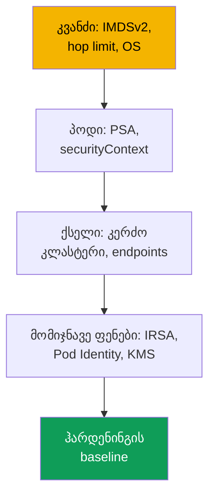
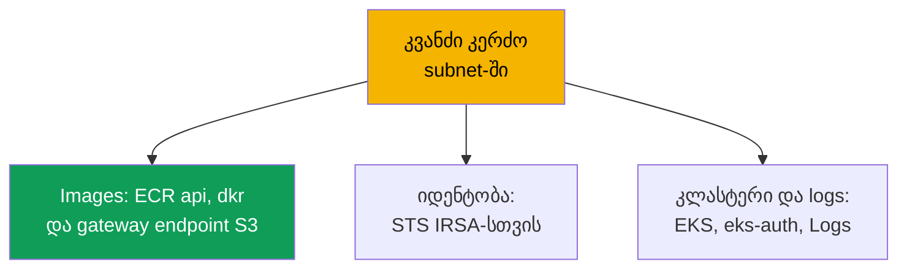

[Русская версия](ru.md) · [Eng version](en.md) · [Versión en español](es.md) · [Version française](fr.md) · [Deutsche Version](de.md) · [繁體中文版](tw.md) · [日本語版](jp.md)
# თავი 19. ჰარდენინგი: IMDSv2 და hop limit, Pod Security Admission, კერძო კლასტერი

> **რა არის შემდეგ.** მე-16-18 თავებში პოდს საკუთარი როლი მივეცით (IRSA, Pod Identity) და secrets
> დავიცავით (KMS, გარე საცავები). ეს თავი მე-3 ნაწილს ასრულებს და ჰარდენინგს ფენებად აერთიანებს:
> კვანძი (IMDS), პოდი (Pod Security Admission, securityContext) და ქსელი (კერძო კლასტერი, VPC
> endpoints). IMDS-ის ჰარდენინგი მე-16-17 თავებს ავსებს: IRSA-ის არსებობის შემთხვევაშიც კი კვანძის
> როლი სამიზნედ რჩება. მომიჯნავე თემები სხვა თავებშია: control plane-ის კერძო endpoint და
> public/private რეჟიმები (თავი 2), secrets და KMS (თავი 18), NetworkPolicy (თავი 30), Kyverno-სა და
> Gatekeeper-ის პოლიტიკები და მულტიტენანტობა (თავი 22), აუდიტი, CloudTrail და GuardDuty (თავი 21),
> ECR (თავი 20).

## 19.1. „პოდი 169.254.169.254-ზე გადავიდა და კვანძის როლის credentials აიღო“

IRSA კონფიგურირებულია, აპლიკაციას საკუთარი როლი აქვს, კვანძის როლი კი მინიმალურია (თავი 16).
თითქოს AWS-ზე წვდომა კონტროლდება. მაგრამ კონტეინერი კომპრომეტირებულია და თავდამსხმელი
`169.254.169.254/latest/meta-data/iam/security-credentials/` მისამართზე `curl`-ს უშვებს.
ნაგულისხმევად კვანძზე გაშვებული პოდები ხშირად **Instance Metadata Service-მდე (IMDS) აღწევენ** და
კვანძის როლის დროებით credentials-ს სრულად იღებენ. მნიშვნელობა არ აქვს, რომ აპლიკაციის უფლებები
IRSA-ში გადაიტანეთ: კვანძის როლს სისტემური კომპონენტების უფლებები რჩება (ECR-იდან pull, CNI-ის მუშაობა
ENI-ებთან, logs), რაც გვერდითი გადაადგილებისთვის საკმარისია. IRSA-მ least privilege პოდის დონეზე
უზრუნველყო, მაგრამ **კვანძის როლამდე ქსელური გზა ღია დარჩა**.

ახლოსაა იმავე ბუნების ორი მონათესავე სცენარი:

- **პრივილეგირებულმა პოდმა კვანძის root დაამონტაჟა.** პოდი, რომელსაც `privileged: true` აქვს ან
  `/`-ზე `hostPath` mount, ჰოსტის ფაილურ სისტემას, kubelet credentials-სა და სხვა პოდების secrets-ს
  იღებს. Pod Security labels-ის გარეშე namespace ასეთ პოდს ერთი გაფრთხილების გარეშეც უშვებს.
- **კლასტერს კერძო რეჟიმი სჭირდება, მაგრამ ვერ ეშვება.** ინტერნეტში გასასვლელის გარეშე კვანძები
  არ ირთვება: VPC endpoints არ არის და ისინი ვერც ECR-იდან image-ს იღებენ, ვერც რეგისტრირდებიან.

სამი განსხვავებული პრობლემა ერთი მიდგომით გვარდება: ფენობრივი ჰარდენინგით.

## 19.2. ჰარდენინგი ფენებად: კვანძი, პოდი, ქსელი

„უსაფრთხოების ერთი ალამი“ არ არსებობს. EKS-ის დაცვა დამოუკიდებელი ფენებისგან შედგება: ერთ ფენაში
არსებულ ხვრელს სხვა ფენები ვერ აკომპენსირებს.



- **კვანძის ფენა**: პოდებისთვის IMDS-ის დახურვა (IMDSv2 და hop limit), ჰარდენინგიანი OS,
  ჰოსტის mount-ების შეზღუდვა (სექციები 19.3 და 19.7).
- **პოდის ფენა**: პრივილეგირებული პოდების არშეშვება PSA-ისა და `securityContext`-ის მეშვეობით
  (19.4-19.5).
- **ქსელის ფენა**: კერძო subnet-ები ინტერნეტში გასასვლელის გარეშე და VPC endpoints (სექცია 19.6).

იდენტობა (თავები 16-17) და secrets (თავი 18) მომიჯნავე ფენებია; checklist მოცემულია 19.8-ში.

## 19.3. IMDSv2 და hop limit დეტალურად

IMDS არის link-local სერვისი `169.254.169.254` მისამართზე, საიდანაც EC2 instance metadata-სა და
**კვანძის როლის დროებით credentials-ს** კითხულობს. პროტოკოლს ორი ვერსია აქვს.

- **IMDSv1**: request-response, `GET`, პასუხში credentials დაუყოვნებლივ ბრუნდება. token საჭირო არ
  არის, ამიტომ ყველას, ვისაც instance-იდან HTTP მოთხოვნის გაგზავნა შეუძლია (მათ შორის პოდსა და
  აპლიკაციაში SSRF-ს), credentials-ის მიღებაც შეუძლია.
- **IMDSv2**: session-based, ჯერ `PUT` token-ის მისაღებად, შემდეგ `GET` header-ში token-ით. ეს
  გულუბრყვილო SSRF-ს არღვევს. IMDSv2 უნდა გახდეს **სავალდებულო** (`httpTokens=required`), წინააღმდეგ
  შემთხვევაში IMDSv1 შემოვლით გზად რჩება.

```bash
# credentials-ის მიღება IMDSv2-ით: ჯერ token (PUT), შემდეგ მოთხოვნა token-ით
TOKEN=$(curl -sX PUT "http://169.254.169.254/latest/api/token" \
  -H "X-aws-ec2-metadata-token-ttl-seconds: 21600")
curl -s -H "X-aws-ec2-metadata-token: $TOKEN" \
  http://169.254.169.254/latest/meta-data/iam/security-credentials/
```

თუმცა მხოლოდ IMDSv2-ის სავალდებულოობა პოდს არ ბლოკავს: პოდსაც შეუძლია `PUT` და `GET`. მთავარი
მეთოდია **hop limit** (`httpPutResponseHopLimit`), TTL-ის მსგავსი ველი, რომელიც განსაზღვრავს,
რამდენი ქსელური hop-ის გავლის უფლება აქვს IMDS-ის პასუხს. პროცესიდან **ჰოსტზე** გაგზავნილი პაკეტი
ერთ hop-ს გადის; **პოდიდან** გაგზავნილი პაკეტი კონტეინერის network namespace-ს გაივლის და დამატებით
hop-ს აკეთებს.

აქედან მოდის ხერხი: **hop limit = 1**-ის დროს IMDS-ის პასუხი პოდამდე ვერ აღწევს (hop-ები არ ჰყოფნის),
კვანძი და მისი კომპონენტები კი ძველებურად მუშაობს. პოდი კვანძის როლის credentials-ს ვეღარ მიიღებს,
რაც 19.1-ის ხვრელს ხურავს.

| `httpPutResponseHopLimit` | კვანძი (ჰოსტი) | პოდი | კომენტარი |
|---|---|---|---|
| 1 | IMDS ხელმისაწვდომია | IMDS **მიუწვდომელია** | ჰარდენინგისთვის რეკომენდებული მნიშვნელობა |
| 2 და მეტი | IMDS ხელმისაწვდომია | IMDS ხელმისაწვდომია | პოდი კვანძის როლის credentials-ს იღებს (მაქსიმუმ 64) |

ეს კვანძის **launch template**-ში (თავი 10) ან მოქმედ instance-ზე კონფიგურირდება:

```bash
# მოქმედ instance-ზე: IMDSv2-ის მოთხოვნა და hop limit 1
aws ec2 modify-instance-metadata-options --instance-id i-0abc123 \
  --http-tokens required --http-put-response-hop-limit 1 --http-endpoint enabled
```

AL2023 და Bottlerocket ნაგულისხმევად IMDSv2-ს მოითხოვს და hop limit 1-ს აყენებს. Managed node groups
`httpTokens`-სა და `httpPutResponseHopLimit`-ს launch template-ის მეშვეობით განსაზღვრავს.

მნიშვნელოვანი კავშირები და შენიშვნები:

- **კავშირი IRSA-სთან (თავი 16).** hop limit IMDS-ს ხურავს, IRSA კი აპლიკაციის უფლებებს კვანძის
  როლიდან იღებს: როლი მინიმალურია **და** IMDS-ის მეშვეობით მისი მოპარვა შეუძლებელია.
- **კომპონენტს შეიძლება IMDS სჭირდებოდეს.** hop limit 1-ის დროს ის IMDS-იდან credentials-ს ვერ
  მიიღებს, ამიტომ როლი IRSA-ის ან Pod Identity-ის მეშვეობით უნდა მიეცეს. hop limit-ის 2-მდე გაზრდა
  შეიძლება, მაგრამ ეს კვანძის როლის credentials-ს ისევ ხსნის. უკიდურესი ვარიანტია IMDS-ის სრულად
  გამორთვა (`--http-endpoint disabled`).
- **შენიშვნა `hostNetwork: true`-ის შესახებ.** ასეთი პოდი ჰოსტის network namespace-ში მუშაობს,
  ამიტომ მისი პაკეტი IMDS-მდე ერთი hop-ით აღწევს. hop limit 1 მას არ ბლოკავს, metadata და კვანძის
  როლის credentials კი ხელმისაწვდომია. აქ hop limit-ის ნაცვლად PSA გვიცავს: baseline და restricted
  `hostNetwork`-ს კრძალავს.

## 19.4. Pod Security Admission დეტალურად

Pod Security Admission (PSA) არის Kubernetes-ში ჩაშენებული admission controller, რომელმაც Pod
Security Policies ჩაანაცვლა (PSP 1.25-ში წაიშალა). ის **Pod Security Standards**-ს იყენებს, ანუ
namespace-ის დონეზე სიმკაცრის სამ პროფილს.

- **privileged**: შეზღუდვების გარეშე.
- **baseline**: ყველაზე სახიფათო პარამეტრებს კრძალავს: `privileged` კონტეინერებს, `hostNetwork`,
  `hostPID`, `hostIPC`, `hostPath` volumes-სა და სახიფათო Linux capabilities-ს.
- **restricted**: მკაცრი პროფილი production-ისთვის: ყველაფერი baseline-იდან, დამატებით root-ის
  სახელით გაშვების აკრძალვა (`runAsNonRoot`), `allowPrivilegeEscalation: false`, **ყველა** capability-ს
  drop (შესაძლებელია მხოლოდ `NET_BIND_SERVICE`-ის დაბრუნება), `seccompProfile`
  `RuntimeDefault`/`Localhost` და volumes-ის შეზღუდული ტიპები.

PSA-ს სამი დამოუკიდებელი რეჟიმი აქვს და მათი ერთ namespace-ზე კომბინირება შეიძლება:

| რეჟიმი | რას აკეთებს დარღვევისას | როდის გამოვიყენოთ |
|---|---|---|
| `enforce` | პოდი **უარყოფილია** | production-ში აკრძალვა |
| `audit` | პოდი იქმნება, audit log-ში event იწერება | დაკვირვება, პროფილის გამოცდა |
| `warn` | პოდი იქმნება, პასუხში გაფრთხილება ბრუნდება | manifest-ის ავტორისთვის მინიშნება |

რეჟიმები namespace-ზე **labels-ით** განისაზღვრება. გასაღებია
`pod-security.kubernetes.io/<mode>`, ხოლო სტანდარტის ვერსიის დასაფიქსირებლად შეიძლება
`<mode>-version` დაემატოს.

```bash
# namespace-ზე restricted-ის ჩართვა: მკაცრი enforce, audit და warn გამოცდისთვის
kubectl label namespace payments \
  pod-security.kubernetes.io/enforce=restricted \
  pod-security.kubernetes.io/enforce-version=latest \
  pod-security.kubernetes.io/warn=restricted \
  pod-security.kubernetes.io/audit=restricted
```

მნიშვნელოვანი ფაქტი EKS-ის შესახებ: PSA არის upstream მექანიზმი, რომელიც **ჩაშენებული და ჩართულია**,
მაგრამ labels-ის გარეშე namespace-ის დონე **privileged** არის, ანუ არაფერს ზღუდავს. დაცვა
**ცხადად უნდა დააკონფიგურიროთ**: EKS restricted-ს თქვენ ნაცვლად არ გამოიყენებს. პროფილი ეტაპობრივად
ინერგება, ჯერ `warn` და `audit`, რათა დამრღვევები გამოჩნდეს, შემდეგ `enforce`. production namespace-ები
restricted-ის ქვეშ უნდა იყოს, სისტემური namespace-ები მინიმუმ baseline-ის ქვეშ, ხოლო `kube-system`
restricted-ში არ უნდა მოაქციოთ: იქ CNI-ისა და Pod Identity Agent-ის მსგავსი პრივილეგირებული
კომპონენტები მუშაობს.

დარღვევების დათვლა მოსახერხებელია control plane-ის მეტრიკით
`apiserver_pod_security_evaluations_total`: მისი labels `decision`, `policy_level` და `mode` აჩვენებს,
თითოეულ პროფილში რამდენი პოდი ხვდება `audit`-სა და `warn`-ში. სწორედ ეს არის სია იმისა, რაც
namespace-ის `enforce`-ზე გადაყვანისას აღარ გაეშვება.

## 19.5. პოდისა და კონტეინერის securityContext

PSA ამოწმებს, რა არის მითითებული პოდისა და კონტეინერების `securityContext`-ში. restricted ველების
ერთობლიობას მოითხოვს, ამიტომ ისინი manifest-ში უნდა განისაზღვროს.

```yaml
spec:                              # პოდის ფრაგმენტი restricted პროფილისთვის
  securityContext:
    runAsNonRoot: true             # არ გაეშვას root-ის სახელით
    seccompProfile:
      type: RuntimeDefault         # runtime-ის ნაგულისხმევი seccomp პროფილი
  containers:
    - name: app
      securityContext:
        allowPrivilegeEscalation: false   # პრივილეგიების გაზრდა შეუძლებელია (no setuid)
        readOnlyRootFilesystem: true      # root ფაილური სისტემა მხოლოდ წასაკითხად
        capabilities:
          drop: ["ALL"]                   # ყველა Linux capability-ს მოხსნა
```

რას აკეთებს თითოეული და რატომ (ყველა, უკანასკნელის გარდა, restricted-ის მოთხოვნაა):

- **`runAsNonRoot: true`**: არ გაეშვას root-ის სახელით; კონტეინერიდან გაქცევისას root უფრო სახიფათოა.
- **`allowPrivilegeEscalation: false`**: პროცესი მეტ უფლებას ვერ მიიღებს (ბლოკავს setuid-ს).
- **`capabilities.drop: ["ALL"]`**: capabilities-ის მოხსნა; მხოლოდ `NET_BIND_SERVICE` დაბრუნდეს.
- **`seccompProfile.type: RuntimeDefault`**: syscalls-ის ფილტრი; baseline-იდან restricted-ზე
  გადასვლისას ჩავარდნის ხშირი მიზეზი.
- **`readOnlyRootFilesystem: true`**: კარგი პრაქტიკაა, მაგრამ restricted პროფილში **არ შედის**.

კავშირი პირდაპირია: `securityContext` პოდის ქცევას აღწერს, PSA restricted კი **ამოწმებს**, რომ ველები
მითითებულია. PSA securityContext-ის გარეშე პოდს უარყოფს, securityContext PSA-ის გარეშე კი გვერდით
პრივილეგირებული პოდის გაშვებას ხელს არ უშლის.

## 19.6. კერძო კლასტერი, როგორც data plane

აქ საუბარი არ არის control plane-ის კერძო endpoint-ზე (public/private რეჟიმები მოცემულია მე-2 თავში),
არამედ **data plane**-ზე: კვანძები კერძო subnet-ებში Internet Gateway-მდე route-ის გარეშე და, მკაცრ
ვარიანტში, საერთოდ ინტერნეტზე წვდომის გარეშე. თუმცა კვანძებსა და პოდებს AWS-ის სერვისები მაინც
სჭირდება: ECR-იდან image-ის მიღება, კლასტერში რეგისტრაცია, STS-ის მეშვეობით credentials-ის მიღება.
ინტერნეტის გარეშე ეს მხოლოდ **VPC endpoints**-ის (PrivateLink) მეშვეობით მუშაობს, ანუ VPC-ის შიგნით
სერვისების კერძო შესასვლელი წერტილებით. საჭირო endpoint-ის გარეშე კონკრეტული ფუნქცია ირღვევა.



კერძო კლასტერისთვის საჭირო endpoints-ის ნაკრები (AWS-ის დოკუმენტაციის მიხედვით; რეგიონი
`region-code`-ში ჩასვით):

| სერვისი | Endpoint | რა ირღვევა მის გარეშე |
|---|---|---|
| Amazon ECR | `ecr.api`, `ecr.dkr` | კონტეინერის images არ იტვირთება |
| Amazon S3 (gateway) | `s3` | ECR-იდან image layers არ იტვირთება |
| Amazon EC2 | `ec2` | EKS Optimized AMI კვანძის DNS სახელს არ განსაზღვრავს |
| AWS STS | `sts` | IRSA token-ს credentials-ზე ვერ ცვლის (თავი 16) |
| EKS OIDC | `oidc-eks` | VPC-ის შიგნიდან IRSA-ის კონფიგურაცია შეუძლებელია (თავი 16) |
| EKS Auth | `eks-auth` | Pod Identity არ მუშაობს (თავი 17) |
| Amazon EKS | `eks` | VPC-იდან EKS API-ზე წვდომა არ არის |
| CloudWatch Logs | `logs` | კვანძებისა და პოდების logs არ იგზავნება |
| Elastic Load Balancing | `elasticloadbalancing` | LB Controller ALB/NLB-ს ვერ ქმნის (თავი 26) |

მთავარი დეტალები:

- **S3 gateway endpoint-ია** და არა interface endpoint: უფასოა და route table-ში ემატება. ECR-ის
  image layers S3-ში ინახება, ამიტომ S3 endpoint-ის გარეშე image ვერ ჩამოიტვირთება მაშინაც კი,
  როცა `ecr.api` და `ecr.dkr` არსებობს.
- **API server-ზე private access სავალდებულოა** (თავი 2), წინააღმდეგ შემთხვევაში კვანძები ვერ
  რეგისტრირდება.
- **OIDC და STS სხვადასხვა endpoints-ია.** `oidc-eks` VPC-იდან OIDC traffic-ს კერძოს ხდის, `sts`
  კი `AssumeRoleWithWebIdentity` გამოძახებას ემსახურება; ორივე საჭიროა (თავი 16). SDK v1 ნაგულისხმევად
  გლობალურ `sts.amazonaws.com`-ზე გადის და endpoint-ს გვერდს უვლის, ამიტომ ის regional STS-ზე უნდა
  დააკონფიგურიროთ.
- **Interface endpoints**-ს private DNS და SG სჭირდება, რომელიც კვანძების subnet CIDR-ს უშვებს.

## 19.7. დამატებითი მეთოდები კვანძის დონეზე

IMDS-ის გარდა, კვანძის ჰარდენინგი OS-ისა და ჰოსტის mount-ების შეზღუდვით ხდება.

- **Bottlerocket თავიდანვე ჰარდენინგიანი OS-ია** (თავი 10): მინიმალური კონტეინერული OS, read-only
  root, SELinux enforcing რეჟიმში და ატომური განახლებები. SELinux და read-only root ზღუდავს, რას
  კითხულობს კვანძზე პროცესი და სად წერს, კონტეინერიდან გაქცევის შემთხვევაშიც კი.
- **ჰოსტის mount-ებს PSA ზღუდავს**: baseline და restricted კრძალავს `hostPath`, `hostNetwork`,
  `hostPID`, `hostIPC`-ს, რაც 19.1-ში აღწერილ „პოდმა კვანძის root დაამონტაჟა“ პრობლემას ხურავს.

ეს მეთოდები IMDS-ის ჰარდენინგს ავსებს: დახურული IMDS ვერ გიშველით, თუ პოდმა ჰოსტის `/` დაამონტაჟა.

## 19.8. როგორ ერთიანდება ეს ჰარდენინგის baseline-ში

ცალკეული მეთოდები ყოველი production გარემოსთვის საბაზისო ნაკრებად ერთიანდება, ანუ 19.2-ში აღწერილი
ფენების შემოწმებად სიად.

| ფენა | რა უნდა არსებობდეს | თავი |
|---|---|---|
| კვანძი | IMDSv2 required, hop limit 1 launch template-ში | 19 |
| კვანძი | ჰარდენინგიანი OS (Bottlerocket ან AL2023) | 10, 19 |
| პოდი | PSA restricted ნაგულისხმევად, წერტილოვანი გამონაკლისებით | 19 |
| პოდი | `securityContext` workload manifests-ში | 19 |
| ქსელი | კერძო subnet-ები + საჭირო VPC endpoints | 19 |
| იდენტობა | კვანძის მინიმალური როლი + IRSA/Pod Identity | 16, 17 |
| Secrets | KMS encryption, გარე საცავები | 18 |

დანერგვის რიგი: ჯერ IMDS და კვანძის როლი (credentials-ის მოპარვის ყველაზე ხშირი ვექტორი), შემდეგ
PSA `warn`/`audit`-იდან `enforce`-მდე, ცალკე კი კერძო კლასტერი endpoints-ის სრული ნაკრებით (19.6).

## 19.9. დიაგნოსტიკა და შემოწმება

ჰარდენინგი იმავე გზით მოწმდება, რომლითაც მას არღვევენ: აკრძალულის შესრულებას ცდილობთ და ამოწმებთ,
რომ არ შესრულდა. hop limit 1-ის დროს **IMDS პოდიდან** timeout-ით უნდა ჩავარდეს.

```bash
# IMDS-მდე მიღწევა დროებითი პოდიდან: არ უნდა იმუშაოს (timeout)
kubectl run imds-test --rm -it --image=curlimages/curl --restart=Never -- \
  sh -c 'curl -s --max-time 5 http://169.254.169.254/latest/meta-data/ || echo BLOCKED'
```

`BLOCKED` (timeout) ნიშნავს, რომ hop limit-მა IMDS დახურა. თუ metadata დაბრუნდა, hop limit 1 არ არის
და პოდს ჯერ კიდევ შეუძლია კვანძის როლის credentials-ის მიღება. **PSA** restricted namespace-ში
პრივილეგირებულ პოდს უნდა უარყოფდეს.

```bash
# PSA labels namespace-ზე: enforce-ის გარეშე დაცვა არ არის და privileged გადის
kubectl get namespace payments -o jsonpath='{.metadata.labels}' ; echo

# privileged პოდი restricted namespace-ში admission-მა უნდა უარყოს
kubectl -n payments run bad --image=busybox --restart=Never \
  --overrides='{"spec":{"containers":[{"name":"bad","image":"busybox","securityContext":{"privileged":true}}]}}'
```

თუ label `pod-security.kubernetes.io/enforce` არ არის და პრივილეგირებული პოდი გაეშვა, PSA privileged
რეჟიმშია და დაცვა არ არსებობს. restricted-ის დროს პოდი სტანდარტის დარღვევის შეტყობინებით უარყოფილია.

**კერძო კლასტერი: კვანძები არ ირთვება ან ჩნდება `ImagePullBackOff`** ნიშნავს, რომ საჭირო VPC endpoint
არ არსებობს. თუ კვანძები არ რეგისტრირდება, შეამოწმეთ private API access და `ec2`; თუ images არ
იტვირთება, შეამოწმეთ `ecr.api`, `ecr.dkr` და **S3** (layers); თუ IRSA არ მუშაობს, შეამოწმეთ `sts`
და `oidc-eks`.

## 19.10. როგორ გამოიყენება ეს production-ში

- **IMDS launch template-ში დახურეთ და არა ხელით.** `httpTokens=required` და
  `httpPutResponseHopLimit=1` node group-ის ან Karpenter-ის launch template-ში ჩაწერეთ, რათა ყოველი
  ახალი კვანძი ჰარდენინგით გაეშვას. ამასთან, კვანძის როლი მინიმალური უნდა იყოს (თავი 16).
- **PSA ეტაპობრივად დანერგეთ:** ჯერ `warn` და `audit`, შემდეგ `enforce=restricted`. ახალ namespace-ებზე
  ნაგულისხმევად restricted გამოიყენეთ, პრივილეგირებული workload-ებისთვის კი baseline მხოლოდ
  წერტილოვანი გამონაკლისის სახით.
- **securityContext deployment template-ის ნაწილი უნდა იყოს.** `runAsNonRoot`, capabilities-ის drop,
  seccomp და `allowPrivilegeEscalation: false` საბაზისო chart-ში ჩაწერეთ და არა PSA-ის ზეწოლის ქვეშ.
- **კერძო კლასტერი endpoints-ის სიის მიხედვით დაგეგმეთ.** 19.6-ის ნაკრები VPC-სთან ერთად IaC-ში
  შექმენით; დავიწყებული endpoint ფუნქციის ჩავარდნით დაუყოვნებლივ გამოჩნდება. ჰარდენინგი რეგულარულად
  შეამოწმეთ smoke tests-ით: `curl` IMDS-მდე და restricted namespace-ში პრივილეგირებული პოდის გაშვება.

## 19.11. მინი-ლექსიკონი

- **IMDS**: Instance Metadata Service `169.254.169.254` მისამართზე; metadata-სა და კვანძის როლის
  credentials-ის წყარო. IMDSv1 token-ის გარეშეა, IMDSv2 კი session-based (`PUT` + token).
- **hop limit** (`httpPutResponseHopLimit`): IMDS-ის პასუხისთვის ქსელური hop-ების რაოდენობა; 1-ის
  დროს პოდი IMDS-მდე ვერ აღწევს, კვანძი კი მუშაობას აგრძელებს.
- **Pod Security Admission (PSA)**: ჩაშენებული admission controller, რომელიც labels-ის მეშვეობით
  namespace-ზე Pod Security Standards-ს იყენებს; მან Pod Security Policies ჩაანაცვლა.
- **Pod Security Standards**: პროფილები privileged, baseline და restricted (მკაცრი, production-ისთვის).
- **VPC endpoint (PrivateLink)**: VPC-ის შიგნით AWS სერვისის კერძო შესასვლელი წერტილი; კერძო data
  plane-ისთვის ECR, S3, STS, EKS და სხვა სერვისებზე სავალდებულოა.

## 19.12. თავის შეჯამება

- IRSA-ის შემთხვევაშიც კვანძის როლი სამიზნედ რჩება: ნაგულისხმევად პოდი IMDS-მდე აღწევს და მის
  credentials-ს იღებს. კვანძის როლამდე ქსელური გზა ცალკე უნდა დაიხუროს. ჰარდენინგი დამოუკიდებელი
  ფენებისგან შედგება.
- IMDSv2 (`httpTokens=required`) SSRF-ს არღვევს, მაგრამ პოდს IMDS-ზე წვდომა მაინც შეუძლია. მთავარია
  hop limit 1: პაკეტი პოდიდან დამატებით hop-ს აკეთებს და IMDS-მდე ვერ აღწევს; AL2023 და Bottlerocket
  ამ მნიშვნელობას აყენებს.
- PSA Pod Security Standards-ს (privileged/baseline/restricted) enforce/audit/warn რეჟიმებში
  `pod-security.kubernetes.io/*` labels-ის მეშვეობით იყენებს. EKS-ში PSA ჩაშენებულია, მაგრამ
  ნაგულისხმევად privileged არის, ამიტომ restricted ცხადად უნდა განსაზღვროთ. restricted მოითხოვს
  `runAsNonRoot`, `allowPrivilegeEscalation: false`, ყველა capability-ს drop-ს, seccomp
  `RuntimeDefault`-ს და volumes-ის შეზღუდულ ტიპებს; `readOnlyRootFilesystem` მასში არ შედის.
- კერძო data plane მოითხოვს კერძო subnet-ებსა და VPC endpoints-ს: ECR api და dkr, S3 (gateway,
  layers), STS და oidc-eks (IRSA), eks-auth (Pod Identity), ec2, logs, eks. შემოწმება აკრძალულის
  მცდელობით ხდება: `curl` IMDS-მდე timeout-ით ვარდება, პრივილეგირებული პოდი კი უარყოფილია.

## 19.13. როგორ გამოგადგებათ ეს რეალურ სამუშაოში

დახურული IMDS-ის შემთხვევაში კითხვას „შეუძლია თუ არა კომპრომეტირებულ პოდს კვანძის როლის credentials-ის
მიღება“ პოდიდან ერთი `curl` პასუხობს და არა როლის ყველა უფლების აუდიტი. ინციდენტი „პრივილეგირებულმა
პოდმა ჰოსტი დაამონტაჟა“ შეუძლებელია იქ, სადაც namespace restricted-ის ქვეშაა. ხოლო კერძო კლასტერი,
რომელიც „არ ირთვება“, 19.6-ის endpoints სიის მიხედვით დიაგნოსტირდება: რომელი ფუნქციაც გაფუჭდა, სწორედ
მისი endpoint აკლია. ფენობრივი ჰარდენინგი მოსახერხებელია, რადგან თითოეული ფენა ცალკე სწრაფი test-ით
მოწმდება, review-ზე კი ჩანს, რომელი ფენა არ არსებობს.

## 19.14. კითხვები თვითშემოწმებისთვის

1. რატომ არ აუქმებს კონფიგურირებული IRSA პოდებისთვის IMDS-ის დახურვის საჭიროებას?
2. რით განსხვავდება IMDSv1 IMDSv2-ისგან და რატომ არ კეტავს მხოლოდ IMDSv2-ის სავალდებულოობა პოდს?
3. როგორ უშლის hop limit 1 პოდს IMDS-ზე წვდომას, მაგრამ კვანძს წვდომას უტოვებს? რა არის დამატებითი hop?
4. რომელ ობიექტში განისაზღვრება `httpTokens` და `httpPutResponseHopLimit` EKS-ის კვანძებისთვის?
5. რა უნდა გავაკეთოთ კომპონენტისთვის, რომელსაც hop limit 1-ის დროს IMDS ნამდვილად სჭირდება?
6. რომელ სამ პროფილს გვთავაზობს Pod Security Standards და კონკრეტულად რას კრძალავს restricted?
7. რით განსხვავდება enforce, audit და warn რეჟიმები და რატომ ინერგება ამ თანმიმდევრობით?
8. რომელი labels რთავს PSA-ს namespace-ზე და რატომ უნდა გაკეთდეს ეს EKS-ში ცხადად?
9. `securityContext`-ის რომელ ველებს მოითხოვს restricted და რომელი ველი არ შედის მასში?
10. რატომ სჭირდება კერძო კლასტერს S3 gateway endpoint, თუ ECR endpoints უკვე არსებობს?
11. რით განსხვავდება endpoints `sts`, `oidc-eks` და `eks-auth`?
12. როგორ შეიძლება პოდიდან ერთი მოთხოვნით შემოწმდეს, რომ IMDS მისთვის დახურულია?

## პრაქტიკა

ამ თემის სასწავლო ლაბაა [ლაბა 116: ჰარდენინგი: IMDSv2 და hop limit, Pod Security Admission,
კერძო endpoint](../../labs/116/README_GE.MD). გარდა ამისა, ყველაფრის შემოწმება მოქმედ კლასტერზე
შეიძლება. კვანძი: `aws ec2
describe-instances --instance-ids <id> --query 'Reservations[].Instances[].MetadataOptions'`:
დარწმუნდით, რომ `HttpTokens` არის `required`, ხოლო `HttpPutResponseHopLimit` არის `1`. გაუშვით პოდი
`curlimages/curl`-ით და შეასრულეთ
`curl --max-time 5 http://169.254.169.254/latest/meta-data/`: hop limit 1-ის დროს მოთხოვნა timeout-ით
ვარდება. გაზარდეთ hop limit 2-მდე და გაიმეორეთ, შემდეგ ისევ 1 დააბრუნეთ.

შემდეგ PSA. namespace-ს მიანიჭეთ `pod-security.kubernetes.io/warn=restricted` და
`audit=restricted`, გაუშვით ტიპური deployment და წაიკითხეთ გაფრთხილებები: ეს არის სია იმისა, რაც
`enforce`-ს ვერ გაივლის. დაამატეთ `securityContext` 19.5-დან, მიაღწიეთ სუფთა გავლას, გადაერთეთ
`enforce=restricted`-ზე და დარწმუნდით, რომ პრივილეგირებული პოდი უარყოფილია. თუ კერძო VPC გაქვთ,
`aws ec2 describe-vpc-endpoints`-ით შეადარეთ 19.6-ის ცხრილს, რომ ECR (api და dkr), S3, STS, eks და
logs ადგილზეა, private access კი ჩართულია (თავი 2).

---
[სარჩევი](../README_GE.md) · [თავი 18](../18/ge.md) · [თავი 20](../20/ge.md)
