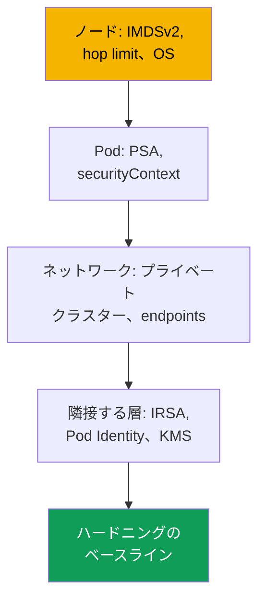
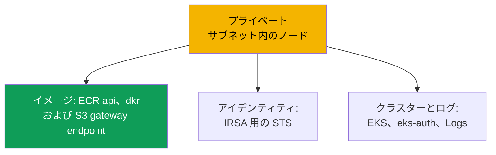

[Eng version](en.md) · [Versión en español](es.md) · [Version française](fr.md) · [Deutsche Version](de.md) · [Русская версия](ru.md) · [ქართული ვერსია](ge.md) · [繁體中文版](tw.md)
# 第19章. ハードニング: IMDSv2 と hop limit、Pod Security Admission、プライベートクラスター

> **この先。** 第16-18章では Pod にロールを割り当て（IRSA、Pod Identity）、シークレット
> （KMS、外部ストア）を保護しました。この章で第3部を終え、ハードニングをノード
> （IMDS）、Pod（Pod Security Admission、`securityContext`）、ネットワーク（プライベート
> クラスター、VPC endpoints）の層としてまとめます。IMDS のハードニングは第16-17章を補完
> します。IRSA があってもノードロールは依然として攻撃対象です。関連する内容は別章で扱います。
> control plane のプライベート endpoint と public/private モード（第2章）、シークレットと
> KMS（第18章）、NetworkPolicy（第30章）、Kyverno と Gatekeeper のポリシーおよびマルチテナンシー
> （第22章）、監査、CloudTrail、GuardDuty（第21章）、ECR（第20章）です。

## 19.1. 「Pod が 169.254.169.254 にアクセスし、ノードロールの認証情報を取得した」

IRSA は設定済みで、アプリケーションには専用ロールがあり、ノードロールは最小限です（第16章）。
AWS へのアクセスは制御されているように見えます。しかしコンテナが侵害され、攻撃者が
`169.254.169.254/latest/meta-data/iam/security-credentials/` に対して `curl` を実行します。
デフォルトでは、ノード上の Pod はしばしば **Instance Metadata Service（IMDS）に到達でき**、
ノードロールの一時認証情報を丸ごと取得できます。アプリケーション権限を IRSA に移していても
関係ありません。ノードロールにはシステムコンポーネント用の権限（ECR からの pull、CNI による
ENI 操作、ログ）が残っており、それでラテラルムーブメントには十分です。IRSA は Pod レベルの
least privilege を実現しましたが、**ノードロールへのネットワーク経路は開いたままです**。

同じ性質を持つ、関連したシナリオが2つあります。

- **特権 Pod がノードのルートをマウントした。** `privileged: true` の Pod、または `/` への
  `hostPath` を持つ Pod は、ホストのファイルシステム、kubelet の認証情報、他の Pod のシークレットを
  取得します。Pod Security ラベルのない namespace は、そのような Pod を一切の警告なしに受け入れます。
- **クラスターにプライベートモードが必要だが、起動しない。** インターネットに出られないノードは
  起動しません。VPC endpoints がないため、ECR からイメージを pull することも登録することもできません。

異なる3つの問題ですが、いずれも1つの方法、層ごとのハードニングで解決します。

## 19.2. 層としてのハードニング: ノード、Pod、ネットワーク

「セキュリティのチェックボックス1つ」は存在しません。EKS の保護は独立した層で構成されます。
1つの層の穴を他の層で補うことはできません。



- **ノード層**: Pod からの IMDS アクセスを遮断し（IMDSv2 と hop limit）、ハードニング済み OS を使い、
  ホストマウントを制限します（19.3節と19.7節）。
- **Pod 層**: PSA と `securityContext` により、特権 Pod を受け入れません（19.4-19.5節）。
- **ネットワーク層**: インターネットアクセスのないプライベートサブネットと VPC endpoints（19.6節）。

アイデンティティ（第16-17章）とシークレット（第18章）は隣接する層です。チェックリストは19.8節にあります。

## 19.3. IMDSv2 と hop limit の詳細

IMDS は `169.254.169.254` にある link-local サービスで、EC2 インスタンスはここからメタデータと
**ノードロールの一時認証情報**を読み取ります。プロトコルには2つのバージョンがあります。

- **IMDSv1**: リクエストとレスポンスによる方式で、`GET` に対してただちに認証情報を返します。トークンは
  不要なため、インスタンスから HTTP リクエストを実行する誰もが（Pod やアプリケーションの SSRF を含む）
  認証情報を取得できます。
- **IMDSv2**: session-based です。最初にトークン用の `PUT` を実行し、次にヘッダー内のトークンを使って
  `GET` を行います。これにより単純な SSRF を防げます。IMDSv2 を**必須**にします
  （`httpTokens=required`）。そうしなければ IMDSv1 が迂回経路として残ります。

```bash
# IMDSv2 で認証情報を取得する: まずトークン（PUT）、次にトークン付きリクエスト
TOKEN=$(curl -sX PUT "http://169.254.169.254/latest/api/token" \
  -H "X-aws-ec2-metadata-token-ttl-seconds: 21600")
curl -s -H "X-aws-ec2-metadata-token: $TOKEN" \
  http://169.254.169.254/latest/meta-data/iam/security-credentials/
```

ただし、IMDSv2 を必須にするだけでは Pod を遮断できません。Pod も `PUT` と `GET` を実行できます。
重要な手法は **hop limit**（`httpPutResponseHopLimit`）です。これは IMDS レスポンスに許可するネットワーク
ホップ数を指定する TTL のようなフィールドです。**ホスト上**のプロセスからのパケットは1 hop を通過しますが、
**Pod から**のパケットはコンテナのネットワーク namespace を経由し、追加の hop を通過します。

ここから導かれる方法は、**hop limit = 1** では IMDS レスポンスが Pod に届かないことです（hop が足りません）。
一方でノードとそのコンポーネントは従来どおり動作します。Pod はノードロールの認証情報を取得できなくなり、
19.1節の穴は塞がれます。

| `httpPutResponseHopLimit` | ノード（ホスト） | Pod | コメント |
|---|---|---|---|
| 1 | IMDS にアクセス可能 | IMDS **にアクセス不可** | ハードニングで推奨する値 |
| 2 以上 | IMDS にアクセス可能 | IMDS にアクセス可能 | Pod がノードロールの認証情報に到達する（最大64） |

これはノードの **launch template**（第10章）または稼働中インスタンスで設定します。

```bash
# 稼働中インスタンスで IMDSv2 を必須にし、hop limit を 1 にする
aws ec2 modify-instance-metadata-options --instance-id i-0abc123 \
  --http-tokens required --http-put-response-hop-limit 1 --http-endpoint enabled
```

AL2023 と Bottlerocket はデフォルトで IMDSv2 を必須にし、hop limit を1に設定します。Managed node groups は
launch template を通じて `httpTokens` と `httpPutResponseHopLimit` を指定します。

重要な関連事項と注意点です。

- **IRSA との関係（第16章）。** hop limit は IMDS を閉じ、IRSA はアプリケーション権限をノードロールから
  取り除きます。すなわちロールは最小限となり、さらに IMDS 経由で盗めなくなります。
- **コンポーネントが IMDS を必要とする場合があります。** hop limit が1の場合、Pod は IMDS から認証情報を
  取得できません。そのロールは IRSA または Pod Identity で渡します。hop limit を2に上げることもできますが、
  それは再びノードロールの認証情報を公開します。極端な選択肢は IMDS を完全に無効化することです
  （`--http-endpoint disabled`）。
- **`hostNetwork: true` に関する注意。** この Pod はホストのネットワーク namespace で動作するため、IMDS
  までのパケットは1 hop で到達します。hop limit 1 では遮断されず、メタデータとノードロールの認証情報に
  アクセスできます。ここで必要なのは hop limit ではなく PSA です。baseline と restricted は `hostNetwork` を
  禁止します。

## 19.4. Pod Security Admission の詳細

Pod Security Admission（PSA）は、Pod Security Policies（PSP は 1.25 で削除済み）に代わる Kubernetes 組み込みの
admission controller です。namespace レベルで、厳格さが異なる3つの **Pod Security Standards** プロファイルを
適用します。

- **privileged**: 制限なし。
- **baseline**: `privileged` コンテナ、`hostNetwork`、`hostPID`、`hostIPC`、`hostPath` volume、危険な
  Linux capabilities といった最も危険なものを禁止します。
- **restricted**: 本番向けの厳格なプロファイルです。baseline のすべてに加え、root 以外での実行
  （`runAsNonRoot`）、`allowPrivilegeEscalation: false`、**すべての** capabilities の drop（戻せるのは
  `NET_BIND_SERVICE` のみ）、`RuntimeDefault`/`Localhost` の `seccompProfile`、制限された volume type を要求します。

PSA には3つのモードがあり、独立しているため1つの namespace 上で組み合わせられます。

| モード | 違反時の動作 | 使用する時期 |
|---|---|---|
| `enforce` | Pod を**拒否する** | 本番での禁止 |
| `audit` | Pod は作成され、audit log にイベントが記録される | 観測、プロファイルの試行 |
| `warn` | Pod は作成され、レスポンスに警告が出る | マニフェスト作成者への通知 |

モードは **namespace のラベル**で設定します。キーは `pod-security.kubernetes.io/<モード>` です。標準の
バージョンを固定するには、`<モード>-version` を追加できます。

```bash
# namespace で restricted を有効化する: enforce は厳格に、audit と warn は試行用
kubectl label namespace payments \
  pod-security.kubernetes.io/enforce=restricted \
  pod-security.kubernetes.io/enforce-version=latest \
  pod-security.kubernetes.io/warn=restricted \
  pod-security.kubernetes.io/audit=restricted
```

EKS に関する重要な事実があります。PSA は upstream の仕組みであり、**組み込み済みかつ有効**ですが、ラベルのない
namespace のレベルは **privileged** です。つまり何も制限しません。保護は**明示的に設定する**必要があります。
EKS が代わりに restricted を付けることはありません。プロファイルは段階的に導入します。まず `warn` と `audit`
で違反者を確認し、次に `enforce` へ進みます。本番 namespace は restricted にし、システム namespace は少なくとも
baseline にします。`kube-system` を restricted にしてはいけません。CNI や Pod Identity Agent のような特権
コンポーネントがそこで動作するためです。

違反は control plane のメトリクス `apiserver_pod_security_evaluations_total` で数えると便利です。そのラベル
`decision`、`policy_level`、`mode` は、各プロファイルで `audit` と `warn` に捕捉される Pod 数を示します。これは
namespace を `enforce` に切り替えたときに失敗する対象の一覧です。

## 19.5. Pod とコンテナの securityContext

PSA は Pod とコンテナの `securityContext` に設定された内容を検査します。restricted は一連のフィールドを要求するため、
マニフェストでそれらを設定します。

```yaml
spec:                              # restricted プロファイル用の Pod フラグメント
  securityContext:
    runAsNonRoot: true             # root として実行しない
    seccompProfile:
      type: RuntimeDefault         # ランタイムのデフォルト seccomp プロファイル
  containers:
    - name: app
      securityContext:
        allowPrivilegeEscalation: false   # 権限昇格を許可しない（no setuid）
        readOnlyRootFilesystem: true      # ルート FS を読み取り専用にする
        capabilities:
          drop: ["ALL"]                   # すべての Linux capabilities を外す
```

何を、なぜ設定するかです（最後のもの以外はすべて restricted の要件です）。

- **`runAsNonRoot: true`**: root として起動しません。コンテナから脱出した場合、コンテナ内 root はより危険です。
- **`allowPrivilegeEscalation: false`**: プロセスはそれ以上の権限を得ません（setuid を遮断）。
- **`capabilities.drop: ["ALL"]`**: capabilities を削除し、必要なら `NET_BIND_SERVICE` だけを戻します。
- **`seccompProfile.type: RuntimeDefault`**: syscall フィルターです。baseline から restricted への移行で失敗する
  一般的な原因です。
- **`readOnlyRootFilesystem: true`**: 優れたプラクティスですが、restricted プロファイルには**含まれません**。

関係は直接的です。`securityContext` は Pod の動作を記述し、PSA restricted はそのフィールドが設定されていることを
**検査します**。securityContext のない PSA は Pod を拒否し、PSA のない securityContext は隣で特権 Pod を起動する
ことを妨げません。

## 19.6. データプレーンとしてのプライベートクラスター

ここで扱うのは private control plane endpoint（public/private モードは第2章）ではなく、**データプレーン**です。
つまり Internet Gateway へのルートがなく、より厳格な形ではインターネットアクセスがまったくないプライベート
サブネットのノードです。しかしノードと Pod には、ECR からのイメージ pull、クラスターへの登録、STS 経由での
認証情報取得など、依然として AWS サービスが必要です。インターネットなしで動作させるには、VPC 内から AWS
サービスへプライベートに入る入口である **VPC endpoints**（PrivateLink）が必要です。必要な endpoint がなければ、
対応する機能が壊れます。



プライベートクラスターの endpoints 一式です（AWS のドキュメントによる。`region-code` にはリージョンを入れます）。

| サービス | Endpoint | ない場合に壊れるもの |
|---|---|---|
| Amazon ECR | `ecr.api`, `ecr.dkr` | コンテナイメージを pull できない |
| Amazon S3（gateway） | `s3` | ECR からイメージレイヤーをダウンロードできない |
| Amazon EC2 | `ec2` | EKS Optimized AMI がノードの DNS 名を設定しない |
| AWS STS | `sts` | IRSA がトークンを認証情報に交換できない（第16章） |
| EKS OIDC | `oidc-eks` | VPC 内から IRSA を設定できない（第16章） |
| EKS Auth | `eks-auth` | Pod Identity が動作しない（第17章） |
| Amazon EKS | `eks` | VPC から EKS API にアクセスできない |
| CloudWatch Logs | `logs` | ノードと Pod のログを送信できない |
| Elastic Load Balancing | `elasticloadbalancing` | LB Controller が ALB/NLB を作成できない（第26章） |

重要な詳細です。

- **S3 は interface ではなく gateway endpoint** です。無料であり、ルートテーブルに追加します。ECR のイメージ
  レイヤーは S3 にあるため、`ecr.api` と `ecr.dkr` が存在しても、S3 endpoint がなければイメージをダウンロード
  できません。
- **API サーバーの private access は必須**です（第2章）。そうしなければノードが登録できません。
- **OIDC と STS は別の endpoints です。** `oidc-eks` は VPC 内からの OIDC トラフィックをプライベート化し、`sts` は
  `AssumeRoleWithWebIdentity` 呼び出しに使われます。両方が必要です（第16章）。SDK v1 はデフォルトで endpoint を
  経由せずグローバルな `sts.amazonaws.com` に接続するため、リージョン STS を使用するよう設定します。
- **Interface endpoints** には、ノードサブネットの CIDR を許可する private DNS と SG が必要です。

## 19.7. ノードレベルの追加手法

IMDS に加え、OS とホストマウントの制限によりノードをハードニングします。

- **Bottlerocket は初めからハードニングされた OS** です（第10章）。最小限のコンテナ OS、read-only root、enforcing
  モードの SELinux、アトミックな更新を備えます。SELinux と read-only root は、コンテナから脱出された場合でも、
  ノード上のプロセスが読み取れるものと書き込める場所を制限します。
- **ホストマウント**は PSA が制限します。baseline と restricted は `hostPath`、`hostNetwork`、`hostPID`、`hostIPC`
  を禁止し、19.1節の「Pod がノードのルートをマウントした」問題を防ぎます。

これらの手法は IMDS ハードニングを補完します。Pod がホストの `/` をマウントできれば、IMDS を閉じても防げません。

## 19.8. ハードニングのベースラインとして組み合わせる方法

個別の手法を、本番環境ごとのベースラインにまとめます。これは19.2節の層を検証可能なリストにしたものです。

| 層 | 必要なもの | 章 |
|---|---|---|
| ノード | launch template で IMDSv2 required、hop limit 1 | 19 |
| ノード | ハードニング済み OS（Bottlerocket または AL2023） | 10, 19 |
| Pod | デフォルトで PSA restricted、例外は限定的に | 19 |
| Pod | ワークロードマニフェストに `securityContext` | 19 |
| ネットワーク | プライベートサブネット + 必要な VPC endpoints | 19 |
| アイデンティティ | 最小限のノードロール + IRSA/Pod Identity | 16, 17 |
| シークレット | KMS 暗号化、外部ストア | 18 |

導入順序は、まず IMDS とノードロール（認証情報窃取の最も一般的な経路）、次に `warn`/`audit` から `enforce` へ
進める PSA、そして必要な endpoints 一式を揃えたプライベートクラスター（19.6節）です。

## 19.9. 診断と検証

ハードニングは、それを破る方法と同じ方法で検証します。禁止したことを試し、通らないことを確認します。hop limit 1
での **Pod からの IMDS** はタイムアウトで失敗するはずです。

```bash
# 一時 Pod から IMDS に到達する: 動作してはならない（タイムアウト）
kubectl run imds-test --rm -it --image=curlimages/curl --restart=Never -- \
  sh -c 'curl -s --max-time 5 http://169.254.169.254/latest/meta-data/ || echo BLOCKED'
```

`BLOCKED`（タイムアウト）は hop limit が IMDS を閉じたことを示します。メタデータが返った場合、hop limit は1ではなく、
Pod はまだノードロールの認証情報に到達できます。**PSA** は restricted namespace 内の特権 Pod を拒否する必要があります。

```bash
# namespace の PSA ラベル: enforce がなければ保護はなく、privileged は通る
kubectl get namespace payments -o jsonpath='{.metadata.labels}' ; echo

# restricted namespace 内の privileged Pod は admission により拒否される必要がある
kubectl -n payments run bad --image=busybox --restart=Never \
  --overrides='{"spec":{"containers":[{"name":"bad","image":"busybox","securityContext":{"privileged":true}}]}}'
```

`pod-security.kubernetes.io/enforce` ラベルがなく、特権 Pod が通る場合、PSA は privileged モードであり保護はありません。
restricted では、標準違反のメッセージとともに Pod が拒否されます。

**プライベートクラスターでノードが起動しない、または `ImagePullBackOff` になる**場合、必要な VPC endpoint がありません。
登録されない場合は private access API と `ec2`、イメージを pull できない場合は `ecr.api`、`ecr.dkr`、**S3**（レイヤー）、
IRSA が動作しない場合は `sts` と `oidc-eks` を確認します。

## 19.10. 本番環境での適用方法

- **IMDS は手作業ではなく launch template で閉じます。** `httpTokens=required` と
  `httpPutResponseHopLimit=1` を node group または Karpenter の launch template に設定し、すべての
  新規ノードがハードニングされた状態で起動するようにします。同時にノードロールを最小限にします（第16章）。
- **PSA は段階的に導入します。** 最初に `warn` と `audit`、次に `enforce=restricted` を設定します。新しい
  namespace ではデフォルトで restricted とし、特権ワークロードには限定的に baseline を適用します。
- **securityContext はデプロイテンプレートの一部です。** `runAsNonRoot`、capabilities の drop、seccomp、
  `allowPrivilegeEscalation: false` を PSA に迫られて後から追加するのではなく、ベースチャートに入れます。
- **プライベートクラスターは endpoint の一覧に基づいて計画します。** 19.6節のセットを VPC とともに IaC で作成します。
  endpoint の漏れは、対応する機能の失敗としてすぐに見つかります。`curl` による IMDS アクセスと restricted namespace
  での特権 Pod 起動という smoke test により、ハードニングを定期的に検証します。

## 19.11. ミニ用語集

- **IMDS**: `169.254.169.254` 上の Instance Metadata Service。メタデータとノードロールの認証情報の取得元です。
  IMDSv1 はトークンなし、IMDSv2 は session-based（`PUT`+トークン）です。
- **hop limit**（`httpPutResponseHopLimit`）: IMDS レスポンスのネットワーク hop 数。1の場合、Pod は IMDS に到達
  できず、ノードは動作します。
- **Pod Security Admission（PSA）**: namespace のラベルを通じて Pod Security Standards を適用する、組み込みの
  admission controller。Pod Security Policies を置き換えました。
- **Pod Security Standards**: privileged、baseline、restricted（厳格、本番向け）のプロファイル。
- **VPC endpoint（PrivateLink）**: VPC 内から AWS サービスへ入るプライベートな入口。プライベートデータプレーンでは
  ECR、S3、STS、EKS などに必須です。

## 19.12. この章のまとめ

- IRSA があってもノードロールは依然として対象です。デフォルトでは Pod が IMDS に到達し、その認証情報を取得できます。
  ノードロールへのネットワーク経路は別途閉じる必要があります。ハードニングは独立した層で構成されます。
- IMDSv2（`httpTokens=required`）は SSRF を防ぎますが、Pod はなお IMDS にアクセスできます。鍵となるのは hop limit
  1です。Pod からのパケットは追加の hop を通過するため IMDS に届かず、AL2023 と Bottlerocket はこれを設定します。
- PSA は `pod-security.kubernetes.io/*` ラベルを通じ、enforce/audit/warn モードで Pod Security Standards
  （privileged/baseline/restricted）を適用します。EKS では PSA は組み込みですがデフォルトは privileged のため、
  restricted を明示的に設定します。restricted は `runAsNonRoot`、`allowPrivilegeEscalation: false`、すべての
  capabilities の drop、`RuntimeDefault` の seccomp、制限された volume type を要求します。
  `readOnlyRootFilesystem` は含まれません。
- プライベートデータプレーンにはプライベートサブネットと VPC endpoints が必要です。ECR api と dkr、S3
  （gateway、レイヤー）、STS と oidc-eks（IRSA）、eks-auth（Pod Identity）、ec2、logs、eks を用意します。検証は
  禁止したことを試して行います。IMDS への `curl` はタイムアウトし、特権 Pod は拒否されます。

## 19.13. 実務での役立ち方

「侵害された Pod がノードロールの認証情報を取得できるか」という問いには、IMDS を閉じた状態ならロールの全権限を
監査するのではなく、Pod からの `curl` 1つで答えられます。「特権 Pod がホストをマウントした」というインシデントは、
namespace が restricted なら起こりません。また、起動しないプライベートクラスターは、19.6節の endpoint 一覧で
切り分けられます。どの機能が壊れたかを見れば、足りない endpoint がわかります。層ごとのハードニングは、各層を
独立した高速なテストで検証でき、レビューではどの層が欠けているか明確になるため便利です。

## 19.14. 自己確認の質問

1. IRSA を設定していても、なぜ Pod から IMDS を閉じる必要があるのですか？
2. IMDSv1 と IMDSv2 はどう違い、IMDSv2 を必須にするだけではなぜ Pod を閉じられないのですか？
3. hop limit 1 はどのように Pod の IMDS アクセスを防ぎつつ、ノード自身のアクセスを残すのですか？追加の hop とは何ですか？
4. EKS ノードの `httpTokens` と `httpPutResponseHopLimit` はどのオブジェクトで設定しますか？
5. hop limit 1 で IMDS を本当に必要とするコンポーネントには何をすべきですか？
6. Pod Security Standards が提供する3つのプロファイルは何で、restricted は具体的に何を禁止しますか？
7. enforce、audit、warn のモードはどう異なり、なぜこの順番で導入するのですか？
8. namespace で PSA を有効化するラベルは何で、EKS ではなぜ明示的に設定する必要があるのですか？
9. restricted が要求する `securityContext` フィールドは何で、そこに含まれないフィールドは何ですか？
10. ECR endpoints がすでにあるのに、プライベートクラスターにはなぜ S3 gateway endpoint が必要なのですか？
11. `sts`、`oidc-eks`、`eks-auth` の endpoints はどう異なりますか？
12. Pod からの1つのリクエストで、IMDS がその Pod に対して閉じていることをどう確認しますか？

## 演習

このテーマのコースラボ: [ラボ116 - ハードニング: IMDSv2 と hop limit、Pod Security Admission、
プライベート endpoint](../../labs/116/README_JP.MD)。これ以外も、すべて稼働中のクラスターで確認できます。
ノードについては、`aws ec2
 describe-instances --instance-ids <id> --query 'Reservations[].Instances[].MetadataOptions'` を実行し、
`HttpTokens` が `required`、`HttpPutResponseHopLimit` が `1` であることを確認します。`curlimages/curl` を含む
Pod を起動し、`curl --max-time 5 http://169.254.169.254/latest/meta-data/` を実行します。hop limit 1 ではリクエストは
タイムアウトするはずです。hop limit を2へ上げて繰り返し、その後1へ戻します。

次に PSA です。namespace に `pod-security.kubernetes.io/warn=restricted` と `audit=restricted` を付け、典型的な
デプロイを起動して警告を読みます。これが enforce を通らない対象の一覧です。19.5節の `securityContext` を追加し、
問題なく通るようにしてから `enforce=restricted` に切り替え、特権 Pod が拒否されることを確認します。プライベート
VPC がある場合、`aws ec2 describe-vpc-endpoints` により19.6節の表と照合し、ECR（api と dkr）、S3、STS、eks、logs
が存在することと、private access が有効であること（第2章）を確認します。

---
[目次](../README_JP.md) · [第18章](../18/jp.md) · [第20章](../20/jp.md)
