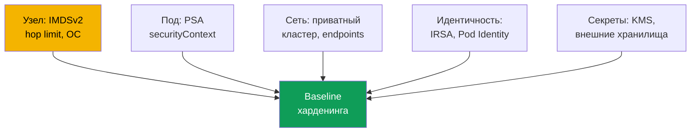
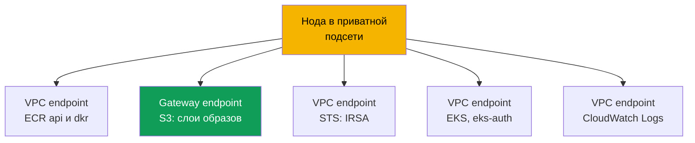

# Глава 19. Харденинг: IMDSv2 и hop limit, Pod Security Admission, приватный кластер

> **Что дальше.** Главы 16-18 выдали поду его роль (IRSA, Pod Identity) и закрыли секреты
> (KMS, внешние хранилища). Эта глава завершает Часть 3 и собирает харденинг в слои: узел
> (IMDS), под (Pod Security Admission, securityContext) и сеть (приватный кластер, VPC
> endpoints). IMDS-харденинг дополняет главы 16-17: даже с IRSA роль ноды остаётся целью.
> Смежное - в других главах: приватный endpoint control plane и режимы public/private (глава
> 2), секреты и KMS (глава 18), NetworkPolicy (глава 30), политики Kyverno и Gatekeeper и
> мультитенантность (глава 22), аудит, CloudTrail и GuardDuty (глава 21), ECR (глава 20).

## 19.1. «Под сходил на 169.254.169.254 и забрал креды роли ноды»

IRSA настроен, у приложения своя роль, роль ноды минимальна (глава 16). Кажется, доступ к AWS
под контролем. Но контейнер скомпрометирован, и атакующий делает `curl` на
`169.254.169.254/latest/meta-data/iam/security-credentials/`. По умолчанию поды на ноде часто
**достают до Instance Metadata Service (IMDS)** и забирают временные креды роли ноды целиком.
И неважно, что прикладные права вы вынесли в IRSA: у роли ноды остаются права системных
компонентов (pull из ECR, работа CNI с ENI, логи), и этого хватает для бокового движения. IRSA
закрыл least privilege на уровне пода, но **сетевой путь к роли ноды остался открыт**.

Рядом два родственных сценария той же природы:

- **Привилегированный под смонтировал корень ноды.** Под с `privileged: true` или `hostPath` на
  `/` получает файловую систему хоста, kubelet-креды и секреты других подов. Namespace без Pod
  Security-лейблов пропускает такой под без единого предупреждения.
- **Кластеру нужен приватный режим, а он не заводится.** Ноды без выхода в интернет не
  поднимаются: нет VPC endpoints, и они не могут забрать образ из ECR или зарегистрироваться.

Три разные боли, но лечатся одним подходом - харденингом по слоям.

## 19.2. Харденинг как слои: узел, под, сеть

Не бывает «одной галочки безопасности». Защита EKS собирается из независимых слоёв: дырка в
одном не компенсируется другими.



- **Слой узла** - закрыть IMDS от подов (IMDSv2 и hop limit), хардненная ОС, ограничение
  хостовых монтирований (разделы 19.3 и 19.7).
- **Слой пода** - не пускать привилегированные поды: PSA и `securityContext` (19.4-19.5).
- **Слой сети** - приватные подсети без выхода в интернет и VPC endpoints (раздел 19.6).

Идентичность (главы 16-17) и секреты (глава 18) - соседние слои; чеклист собран в 19.8.

## 19.3. IMDSv2 и hop limit предметно

IMDS - link-local сервис на `169.254.169.254`, откуда инстанс EC2 читает метаданные и
**временные креды роли ноды**. Есть две версии протокола.

- **IMDSv1** - запрос-ответ: `GET`, в ответе сразу креды. Токен не нужен, поэтому любой, кто
  сделает HTTP-запрос из инстанса (включая под и SSRF в приложении), забирает креды.
- **IMDSv2** - session-based: сначала `PUT` за токеном, затем `GET` с токеном в заголовке. Это
  ломает наивный SSRF. IMDSv2 делают **обязательным** (`httpTokens=required`), иначе IMDSv1
  остаётся обходным путём.

```bash
# получить креды через IMDSv2: сначала токен (PUT), потом запрос с токеном
TOKEN=$(curl -sX PUT "http://169.254.169.254/latest/api/token" \
  -H "X-aws-ec2-metadata-token-ttl-seconds: 21600")
curl -s -H "X-aws-ec2-metadata-token: $TOKEN" \
  http://169.254.169.254/latest/meta-data/iam/security-credentials/
```

Но обязательный IMDSv2 сам по себе не закрывает под: под тоже умеет `PUT` и `GET`. Ключевой
приём - **hop limit** (`httpPutResponseHopLimit`), TTL-подобное поле: сколько сетевых прыжков
разрешено ответу IMDS. Пакет от процесса **на хосте** проходит за один hop; пакет **из пода**
идёт через сетевой namespace контейнера и делает лишний hop.

Отсюда трюк: при **hop limit = 1** ответ IMDS не доходит до пода (не хватает hop), а узел и его
компоненты работают как прежде. Под больше не заберёт креды роли ноды - дыра из 19.1 закрыта.

| `httpPutResponseHopLimit` | Узел (хост) | Под | Комментарий |
|---|---|---|---|
| 1 | IMDS доступен | IMDS **недоступен** | рекомендуемое значение для харденинга |
| 2 и выше | IMDS доступен | IMDS доступен | под достаёт креды роли ноды (максимум 64) |

Настраивается это в **launch template** ноды (глава 10) или на живом инстансе:

```bash
# на живом инстансе: требовать IMDSv2 и hop limit 1
aws ec2 modify-instance-metadata-options --instance-id i-0abc123 \
  --http-tokens required --http-put-response-hop-limit 1 --http-endpoint enabled
```

AL2023 и Bottlerocket по умолчанию требуют IMDSv2 и ставят hop limit 1. Managed node groups
задают `httpTokens` и `httpPutResponseHopLimit` через launch template.

Важные связи и оговорки:

- **Связь с IRSA (глава 16).** hop limit закрывает IMDS, IRSA убирает прикладные права с роли
  ноды: роль минимальна **и** красть её через IMDS нельзя.
- **Компоненту IMDS может быть нужен.** При hop limit 1 он кредов из IMDS не получит - роль
  дают через IRSA или Pod Identity. Поднять hop limit до 2 можно, но это снова открывает
  креды роли ноды. Крайний вариант - вовсе отключить IMDS (`--http-endpoint disabled`).

## 19.4. Pod Security Admission предметно

Pod Security Admission (PSA) - встроенный admission-контроллер Kubernetes на смену Pod Security
Policies (PSP удалены в 1.25). Он применяет **Pod Security Standards** - три профиля жёсткости
на уровне namespace.

- **privileged** - без ограничений.
- **baseline** - запрещает самое опасное: `privileged`-контейнеры, `hostNetwork`, `hostPID`,
  `hostIPC`, `hostPath`-тома, опасные Linux capabilities.
- **restricted** - строгий профиль для прода: всё из baseline плюс запуск не от root
  (`runAsNonRoot`), `allowPrivilegeEscalation: false`, drop **всех** capabilities (вернуть лишь
  `NET_BIND_SERVICE`), `seccompProfile` `RuntimeDefault`/`Localhost`, ограниченные типы томов.

У PSA три режима, и они независимы, их можно комбинировать на одном namespace:

| Режим | Что делает при нарушении | Когда применять |
|---|---|---|
| `enforce` | под **отклоняется** | боевой запрет |
| `audit` | под создаётся, событие в audit log | наблюдение, обкатка профиля |
| `warn` | под создаётся, предупреждение в ответе | подсказка автору манифеста |

Режимы задаются **лейблами на namespace**. Ключ - `pod-security.kubernetes.io/<режим>`, а к
нему можно добавить `<режим>-version` для фиксации версии стандарта.

```bash
# включить restricted на namespace: enforce жёстко, audit и warn для обкатки
kubectl label namespace payments \
  pod-security.kubernetes.io/enforce=restricted \
  pod-security.kubernetes.io/enforce-version=latest \
  pod-security.kubernetes.io/warn=restricted \
  pod-security.kubernetes.io/audit=restricted
```

Важный факт про EKS: PSA - upstream-механизм, он **встроен и включён**, но уровень для
namespace без лейблов - **privileged**, то есть не ограничивает ничего. Защиту надо **задавать
явно**: EKS не навешивает restricted за вас. Профиль вводят постепенно - сначала `warn` и
`audit`, чтобы увидеть нарушителей, потом `enforce`. Системные namespace (`kube-system`) под
restricted не загоняют: там живут привилегированные компоненты вроде CNI и Pod Identity Agent.

## 19.5. securityContext пода и контейнера

PSA проверяет то, что задано в `securityContext` пода и контейнеров. restricted требует набор
полей - их и выставляют в манифесте.

```yaml
spec:                              # фрагмент пода под профиль restricted
  securityContext:
    runAsNonRoot: true             # не запускать от root
    seccompProfile:
      type: RuntimeDefault         # seccomp-профиль по умолчанию рантайма
  containers:
    - name: app
      securityContext:
        allowPrivilegeEscalation: false   # нельзя повысить привилегии (no setuid)
        readOnlyRootFilesystem: true      # корневая ФС только на чтение
        capabilities:
          drop: ["ALL"]                   # снять все Linux capabilities
```

Что и зачем (все, кроме последнего, - требования restricted):

- **`runAsNonRoot: true`** - не стартовать от root; root в контейнере опаснее при побеге.
- **`allowPrivilegeEscalation: false`** - процесс не получит больше прав (блок setuid).
- **`capabilities.drop: ["ALL"]`** - снять capabilities, вернуть лишь `NET_BIND_SERVICE`.
- **`seccompProfile.type: RuntimeDefault`** - фильтр syscalls; частая причина провала при
  переходе baseline -> restricted.
- **`readOnlyRootFilesystem: true`** - хорошая практика, но в профиль restricted **не входит**.

Связь прямая: `securityContext` описывает поведение пода, PSA restricted **проверяет**, что
поля выставлены. PSA без securityContext отклонит под, а securityContext без PSA не мешает
запустить рядом привилегированный под.

## 19.6. Приватный кластер как узел данных

Речь не про приватный endpoint control plane (режимы public/private - глава 2), а про **узел
данных**: ноды в приватных подсетях без маршрута в Internet Gateway и, в жёстком варианте, без
выхода в интернет вовсе. Но нодам и подам всё равно нужны сервисы AWS: забрать образ из ECR,
зарегистрироваться в кластере, получить креды через STS. Без интернета это работает только
через **VPC endpoints** (PrivateLink) - приватные точки входа к сервисам внутри VPC. Нет
нужного endpoint - ломается конкретная функция.



Набор endpoints для приватного кластера (по документации AWS; регион подставляется в
`region-code`):

| Сервис | Endpoint | Что ломается без него |
|---|---|---|
| Amazon ECR | `ecr.api`, `ecr.dkr` | не тянутся образы контейнеров |
| Amazon S3 (gateway) | `s3` | не качаются слои образов из ECR |
| Amazon EC2 | `ec2` | EKS Optimized AMI не ставит DNS-имя ноды |
| AWS STS | `sts` | IRSA не обменивает токен на креды (главы 16) |
| EKS OIDC | `oidc-eks` | не настроить IRSA изнутри VPC (глава 16) |
| EKS Auth | `eks-auth` | не работает Pod Identity (глава 17) |
| Amazon EKS | `eks` | нет доступа к API EKS из VPC |
| CloudWatch Logs | `logs` | не уходят логи нод и подов |
| Elastic Load Balancing | `elasticloadbalancing` | LB Controller не создаёт ALB/NLB (глава 26) |

Ключевые тонкости:

- **S3 - gateway endpoint**, а не interface: бесплатный, добавляется в таблицу маршрутов. Слои
  образов ECR лежат в S3, поэтому без S3-endpoint образ не скачается, даже если `ecr.api` и
  `ecr.dkr` есть.
- **Private access API-сервера обязателен** (глава 2), иначе ноды не зарегистрируются.
- **OIDC и STS - разные endpoints.** `oidc-eks` приватизирует OIDC-трафик из VPC, `sts` -
  вызов `AssumeRoleWithWebIdentity`; нужны оба (глава 16). SDK v1 по умолчанию идут на
  глобальный `sts.amazonaws.com` мимо endpoint - их настраивают на региональный STS.
- **Interface-endpoints** нужны private DNS и SG, пускающая CIDR подсетей нод.

## 19.7. Дополнительные приёмы на уровне узла

Помимо IMDS, узел хардненится через ОС и ограничение хостовых монтирований.

- **Bottlerocket - заведомо хардненная ОС** (глава 10): минимальная контейнерная ОС, read-only
  корень, SELinux в enforcing, атомарные обновления. SELinux и read-only root ограничивают, что
  процесс на ноде читает и куда пишет, даже при побеге из контейнера.
- **Хостовые монтирования** ограничивает PSA: baseline и restricted запрещают `hostPath`,
  `hostNetwork`, `hostPID`, `hostIPC` - это закрывает «под смонтировал корень ноды» из 19.1.

Приёмы дополняют IMDS-харденинг: закрытый IMDS не спасёт, если под смонтировал `/` хоста.

## 19.8. Как это собирается в baseline харденинга

Отдельные приёмы складываются в базовый набор для каждого прода - проверяемый список слоёв из
19.2.

| Слой | Что должно быть | Глава |
|---|---|---|
| Узел | IMDSv2 required, hop limit 1 в launch template | 19 |
| Узел | хардненная ОС (Bottlerocket или AL2023) | 10, 19 |
| Под | PSA restricted по умолчанию, исключения точечно | 19 |
| Под | `securityContext` в манифестах нагрузок | 19 |
| Сеть | приватные подсети + нужные VPC endpoints | 19 |
| Идентичность | минимальная роль ноды + IRSA/Pod Identity | 16, 17 |
| Секреты | шифрование KMS, внешние хранилища | 18 |

Порядок внедрения: сначала IMDS и роль ноды (самый частый вектор кражи кредов), затем PSA через
`warn`/`audit` к `enforce`, отдельно - приватный кластер с полным набором endpoints (19.6).

## 19.9. Диагностика и проверка

Харденинг проверяется тем же способом, каким его ломают: пробуют запрещённое и смотрят, что оно
не проходит. **IMDS из пода** при hop limit 1 должен падать по таймауту.

```bash
# дойти до IMDS из временного пода - должно НЕ сработать (таймаут)
kubectl run imds-test --rm -it --image=curlimages/curl --restart=Never -- \
  sh -c 'curl -s --max-time 5 http://169.254.169.254/latest/meta-data/ || echo BLOCKED'
```

`BLOCKED` (таймаут) - hop limit закрыл IMDS. Вернулись метаданные - hop limit не 1, под всё ещё
достаёт креды роли ноды. **PSA** должен отклонять привилегированный под в restricted-namespace.

```bash
# лейблы PSA на namespace: нет enforce - защиты нет, privileged проходит
kubectl get namespace payments -o jsonpath='{.metadata.labels}' ; echo

# privileged-под в restricted-namespace должен быть отклонён admission
kubectl -n payments run bad --image=busybox --restart=Never \
  --overrides='{"spec":{"containers":[{"name":"bad","image":"busybox","securityContext":{"privileged":true}}]}}'
```

Нет лейбла `pod-security.kubernetes.io/enforce`, а привилегированный под проходит - PSA в
режиме privileged, защиты нет. В restricted под отклонится с сообщением о нарушении стандарта.

**Приватный кластер: ноды не поднимаются или `ImagePullBackOff`** - нет нужного VPC endpoint.
Не регистрируются - private access API и `ec2`; образы не тянутся - `ecr.api`, `ecr.dkr` и
**S3** (слои); IRSA не работает - `sts` и `oidc-eks`.

## 19.10. Как это применяют в продакшене

- **IMDS закрывают в launch template, не руками.** `httpTokens=required` и
  `httpPutResponseHopLimit=1` кладут в launch template node group или Karpenter, чтобы каждая
  новая нода поднималась хардненной. Роль ноды при этом минимальна (глава 16).
- **PSA вводят постепенно:** сначала `warn` и `audit`, потом `enforce=restricted`. restricted
  по умолчанию на новых namespace, привилегированным нагрузкам - baseline точечно.
- **securityContext - часть шаблона деплоя.** `runAsNonRoot`, drop capabilities, seccomp и
  `allowPrivilegeEscalation: false` кладут в базовый чарт, а не дописывают под давлением PSA.
- **Приватный кластер планируют по списку endpoints.** Набор из 19.6 заводят в IaC вместе с
  VPC; забытый endpoint виден сразу как отказ функции. Харденинг проверяют регулярно
  smoke-тестами: `curl` к IMDS и запуск привилегированного пода в restricted-namespace.

## 19.11. Мини-глоссарий

- **IMDS** - Instance Metadata Service на `169.254.169.254`; источник метаданных и кредов роли
  ноды. IMDSv1 - без токена, IMDSv2 - session-based (`PUT`+токен).
- **hop limit** (`httpPutResponseHopLimit`) - число сетевых прыжков ответа IMDS; при 1 под до
  IMDS не дотягивается, а узел работает.
- **Pod Security Admission (PSA)** - встроенный admission-контроллер, применяющий Pod Security
  Standards на namespace через лейблы; заменил Pod Security Policies.
- **Pod Security Standards** - профили privileged, baseline, restricted (строгий, для прода).
- **VPC endpoint (PrivateLink)** - приватная точка входа к сервису AWS внутри VPC; для
  приватного узла данных обязательна для ECR, S3, STS, EKS и других.

## 19.12. Итоги главы

- Даже с IRSA роль ноды остаётся целью: под по умолчанию достаёт до IMDS и забирает её креды.
  Сетевой путь к роли ноды надо закрыть отдельно. Харденинг - это независимые слои.
- IMDSv2 (`httpTokens=required`) ломает SSRF, но под всё равно ходит в IMDS. Ключ - hop limit
  1: пакет из пода делает лишний hop и до IMDS не доходит; AL2023 и Bottlerocket ставят это.
- PSA применяет Pod Security Standards (privileged/baseline/restricted) в режимах
  enforce/audit/warn через лейблы `pod-security.kubernetes.io/*`. В EKS PSA встроен, но по
  умолчанию privileged - restricted задают явно. restricted требует `runAsNonRoot`,
  `allowPrivilegeEscalation: false`, drop всех capabilities, seccomp `RuntimeDefault`,
  ограниченные типы томов; `readOnlyRootFilesystem` не входит.
- Приватный узел данных требует приватных подсетей и VPC endpoints: ECR api и dkr, S3 (gateway,
  слои), STS и oidc-eks (IRSA), eks-auth (Pod Identity), ec2, logs, eks. Проверка - через
  попытку запрещённого: `curl` к IMDS падает по таймауту, привилегированный под отклоняется.

## 19.13. Как это пригодится в реальной работе

Вопрос «может ли скомпрометированный под забрать креды роли ноды» с закрытым IMDS отвечается
одним `curl` из пода, а не аудитом всех прав роли. Инцидент «привилегированный под смонтировал
хост» невозможен там, где namespace под restricted. А приватный кластер, который «не
заводится», разбирается по списку endpoints из 19.6: какая функция сломалась - такого endpoint
и не хватает. Харденинг по слоям удобен тем, что каждый слой проверяется отдельным быстрым
тестом, и на ревью видно, какой слой отсутствует.

## 19.14. Вопросы для самопроверки

1. Почему настроенный IRSA не отменяет необходимости закрывать IMDS от подов?
2. Чем IMDSv1 отличается от IMDSv2 и почему обязательный IMDSv2 сам по себе не закрывает под?
3. Как hop limit 1 не пускает под к IMDS, но оставляет доступ самому узлу? Что за лишний hop?
4. В каком объекте задают `httpTokens` и `httpPutResponseHopLimit` для нод EKS?
5. Что делать с компонентом, которому IMDS реально нужен, при hop limit 1?
6. Какие три профиля даёт Pod Security Standards и что именно запрещает restricted?
7. Чем различаются режимы enforce, audit и warn и почему их вводят в этом порядке?
8. Какими лейблами включают PSA на namespace и почему в EKS это надо делать явно?
9. Какие поля `securityContext` требует restricted и какое поле в него не входит?
10. Почему для приватного кластера нужен S3 gateway endpoint, если ECR-endpoints уже есть?
11. Чем отличаются endpoints `sts`, `oidc-eks` и `eks-auth`?
12. Как одним запросом из пода проверить, что IMDS для него закрыт?

## Практика

Своей лабы у главы пока нет, но всё проверяется на живом кластере. Узел: `aws ec2
describe-instances --instance-ids <id> --query 'Reservations[].Instances[].MetadataOptions'` -
убедитесь, что `HttpTokens` - `required`, `HttpPutResponseHopLimit` - `1`. Запустите под с
`curlimages/curl` и `curl --max-time 5 http://169.254.169.254/latest/meta-data/` - при hop
limit 1 запрос падает по таймауту. Поднимите hop limit до 2 и повторите, потом верните 1.

Дальше PSA. Навесьте на namespace `pod-security.kubernetes.io/warn=restricted` и
`audit=restricted`, запустите типовой деплой и прочитайте предупреждения - это список того, что
не пройдёт enforce. Добавьте `securityContext` из 19.5, добейтесь чистого прохода, переключите
на `enforce=restricted` и убедитесь, что привилегированный под отклоняется. Если есть приватная
VPC, сверьте по таблице из 19.6 через `aws ec2 describe-vpc-endpoints`, что ECR (api и dkr),
S3, STS, eks и logs на месте, а private access включён (глава 2).

---
[Оглавление](../README_RU.md) · [Глава 18](../18/ru.md) · [Глава 20](../20/ru.md)
