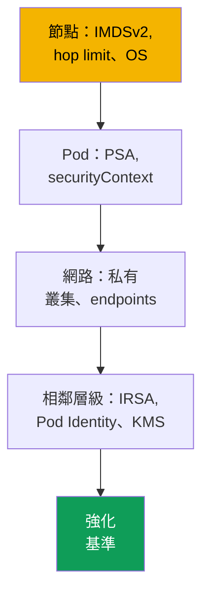
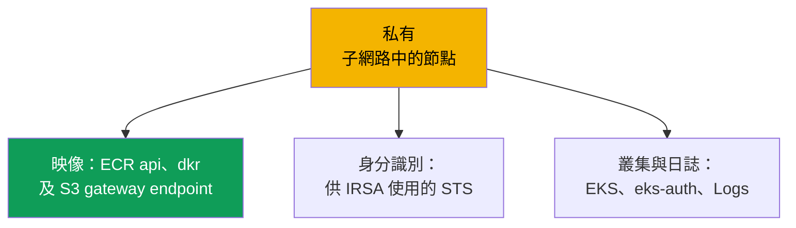

[English version](en.md) · [Versión en español](es.md) · [Version française](fr.md) · [Deutsche Version](de.md) · [ქართული ვერსია](ge.md) · [Русская версия](ru.md) · [日本語版](jp.md)
# 第 19 章。強化：IMDSv2 與 hop limit、Pod Security Admission、私有叢集

> **接下來。** 第 16-18 章為 Pod 賦予其角色（IRSA、Pod Identity）並保護 Secret（KMS、外部儲存庫）。本章完成第 3 部分，並將強化措施分為多個層級：節點（IMDS）、Pod（Pod Security Admission、securityContext）和網路（私有叢集、VPC endpoints）。IMDS 強化補足第 16-17 章：即使使用 IRSA，節點角色仍是目標。相關內容見其他章節：control plane 的私有 endpoint 與 public/private 模式（第 2 章）、Secret 與 KMS（第 18 章）、NetworkPolicy（第 30 章）、Kyverno 與 Gatekeeper 政策及多租戶（第 22 章）、稽核、CloudTrail 與 GuardDuty（第 21 章）、ECR（第 20 章）。

## 19.1.「Pod 連上 169.254.169.254 並取得節點角色憑證」

IRSA 已設定，應用程式有自己的角色，節點角色的權限最小化（第 16 章）。看起來 AWS 存取已受控。但容器遭入侵後，攻擊者對 `169.254.169.254/latest/meta-data/iam/security-credentials/` 執行 `curl`。預設情況下，節點上的 Pod 往往**能存取 Instance Metadata Service (IMDS)**，並取得完整的節點角色暫時憑證。不論你是否已將應用程式權限移至 IRSA，節點角色仍保有系統元件的權限（從 ECR pull、CNI 操作 ENI、日誌），這已足以進行橫向移動。IRSA 在 Pod 層級實現了 least privilege，但**通往節點角色的網路路徑仍然開放**。

同樣性質的兩個相近情境：

- **特權 Pod 掛載了節點根目錄。** 具有 `privileged: true` 或將 `/` 掛載為 `hostPath` 的 Pod，可取得主機檔案系統、kubelet 憑證及其他 Pod 的 Secret。沒有 Pod Security 標籤的 namespace 會讓這種 Pod 通過，且完全不發出警告。
- **叢集需要私有模式，卻無法啟動。** 沒有網際網路出口的節點無法啟動：缺少 VPC endpoints，因此無法從 ECR 取得映像或註冊。

三種不同的問題，但都透過同一種方法解決：分層強化。

## 19.2. 將強化視為層級：節點、Pod、網路

不存在「一個安全核取方塊」。EKS 防護由彼此獨立的層級構成：某一層有漏洞，其他層無法補償。



- **節點層級** - 對 Pod 關閉 IMDS（IMDSv2 與 hop limit）、強化 OS、限制主機掛載（第 19.3 與 19.7 節）。
- **Pod 層級** - 不允許特權 Pod：PSA 與 `securityContext`（19.4-19.5）。
- **網路層級** - 沒有網際網路出口的私有子網路及 VPC endpoints（第 19.6 節）。

身分識別（第 16-17 章）與 Secret（第 18 章）是相鄰層級；檢查清單彙整於 19.8。

## 19.3. IMDSv2 與 hop limit 的具體說明

IMDS 是位於 `169.254.169.254` 的 link-local 服務，EC2 instance 可從其中讀取中繼資料及**節點角色的暫時憑證**。協定有兩個版本。

- **IMDSv1** - request-response：執行 `GET`，回應立即包含憑證。不需要 token，因此任何從 instance 發送 HTTP request 的人（包括 Pod 及應用程式中的 SSRF）都能取得憑證。
- **IMDSv2** - session-based：先使用 `PUT` 取得 token，再透過帶有 token header 的 `GET` 請求。這會阻擋簡單的 SSRF。必須將 IMDSv2 設為**必要**（`httpTokens=required`），否則 IMDSv1 仍是繞過途徑。

```bash
# 透過 IMDSv2 取得憑證：先取得 token（PUT），再用 token 發出請求
TOKEN=$(curl -sX PUT "http://169.254.169.254/latest/api/token" \
  -H "X-aws-ec2-metadata-token-ttl-seconds: 21600")
curl -s -H "X-aws-ec2-metadata-token: $TOKEN" \
  http://169.254.169.254/latest/meta-data/iam/security-credentials/
```

但僅強制 IMDSv2 並不會阻擋 Pod：Pod 同樣可以使用 `PUT` 與 `GET`。關鍵做法是 **hop limit**（`httpPutResponseHopLimit`），一個類似 TTL 的欄位：它定義 IMDS 回應可通過的網路跳數。**主機上**的程序收到封包只需一個 hop；**Pod 中**的封包會經過容器 network namespace，因而多走一個 hop。

因此，在 **hop limit = 1** 時，IMDS 回應無法到達 Pod（hop 數不足），而節點及其元件仍照常運作。Pod 不再能取得節點角色憑證，第 19.1 節的漏洞因而關閉。

| `httpPutResponseHopLimit` | 節點（主機） | Pod | 說明 |
|---|---|---|---|
| 1 | 可存取 IMDS | IMDS **無法存取** | 建議的強化值 |
| 2 以上 | 可存取 IMDS | 可存取 IMDS | Pod 可取得節點角色憑證（最高 64） |

請在節點的 **launch template**（第 10 章）中設定，或在運行中的 instance 上設定：

```bash
# 在運行中的 instance：要求使用 IMDSv2 並設 hop limit 為 1
aws ec2 modify-instance-metadata-options --instance-id i-0abc123 \
  --http-tokens required --http-put-response-hop-limit 1 --http-endpoint enabled
```

AL2023 與 Bottlerocket 預設會要求 IMDSv2 並設定 hop limit 為 1。Managed node groups 會透過 launch template 設定 `httpTokens` 與 `httpPutResponseHopLimit`。

重要關聯與注意事項：

- **與 IRSA 的關聯（第 16 章）。** hop limit 關閉 IMDS，IRSA 將應用程式權限從節點角色移除：角色的權限最小化，且無法透過 IMDS 竊取。
- **某個元件可能確實需要 IMDS。** hop limit 為 1 時，它無法從 IMDS 取得憑證，應透過 IRSA 或 Pod Identity 授予角色。可將 hop limit 提高至 2，但這會再次暴露節點角色憑證。極端選項是完全關閉 IMDS（`--http-endpoint disabled`）。
- **關於 `hostNetwork: true` 的注意事項。** 這類 Pod 位於主機 network namespace，其前往 IMDS 的封包只需一個 hop，因此 hop limit 1 不會阻擋它，仍可存取中繼資料與節點角色憑證。這時依靠的不是 hop limit，而是 PSA：baseline 與 restricted 都禁止 `hostNetwork`。

## 19.4. Pod Security Admission 的具體說明

Pod Security Admission (PSA) 是 Kubernetes 內建的 admission controller，用以取代 Pod Security Policies（PSP 已於 1.25 移除）。它在 namespace 層級套用 **Pod Security Standards**，即三種嚴格程度的 profile。

- **privileged** - 不限制。
- **baseline** - 禁止最危險的設定：`privileged` 容器、`hostNetwork`、`hostPID`、`hostIPC`、`hostPath` volumes、危險的 Linux capabilities。
- **restricted** - 用於 production 的嚴格 profile：包含 baseline 的全部規則，另加上不以 root 執行（`runAsNonRoot`）、`allowPrivilegeEscalation: false`、移除**所有** capabilities（僅可加回 `NET_BIND_SERVICE`）、`seccompProfile` 為 `RuntimeDefault`/`Localhost`，以及受限的 volume 類型。

PSA 有三種彼此獨立的模式，可在同一個 namespace 上組合：

| 模式 | 違規時的行為 | 適用時機 |
|---|---|---|
| `enforce` | Pod **遭拒絕** | 正式禁止 |
| `audit` | Pod 建立，audit log 中產生事件 | 觀察、驗證 profile |
| `warn` | Pod 建立，回應中產生警告 | 提示 manifest 作者 |

模式透過 **namespace 上的標籤**設定。key 為 `pod-security.kubernetes.io/<模式>`，也可加入 `<模式>-version` 以固定標準版本。

```bash
# 對 namespace 啟用 restricted：enforce 強制執行，audit 與 warn 用於驗證
kubectl label namespace payments \
  pod-security.kubernetes.io/enforce=restricted \
  pod-security.kubernetes.io/enforce-version=latest \
  pod-security.kubernetes.io/warn=restricted \
  pod-security.kubernetes.io/audit=restricted
```

關於 EKS 的重要事實：PSA 是 upstream 機制，**已內建並啟用**，但沒有標籤的 namespace 預設層級是 **privileged**，也就是完全不限制。必須**明確設定**防護：EKS 不會替你設定 restricted。應逐步導入 profile：先使用 `warn` 與 `audit` 來識別違規者，然後再使用 `enforce`。production namespace 應維持 restricted，系統 namespace 至少應維持 baseline，而不應將 `kube-system` 設為 restricted：其中有 CNI 與 Pod Identity Agent 等特權元件。

可將違規情形作為 control plane 指標 `apiserver_pod_security_evaluations_total` 來計數：其 `decision`、`policy_level` 和 `mode` 標籤可顯示每個 profile 中有多少 Pod 被 `audit` 和 `warn` 捕捉。這正是將 namespace 切換為 `enforce` 時會失敗的項目清單。

## 19.5. Pod 與容器的 securityContext

PSA 會檢查 Pod 及其容器 `securityContext` 中的設定。restricted 要求一組欄位，因此須在 manifest 中設定它們。

```yaml
spec:                              # restricted profile 的 Pod 片段
  securityContext:
    runAsNonRoot: true             # 不以 root 執行
    seccompProfile:
      type: RuntimeDefault         # runtime 的預設 seccomp profile
  containers:
    - name: app
      securityContext:
        allowPrivilegeEscalation: false   # 不可提升權限（無 setuid）
        readOnlyRootFilesystem: true      # 根檔案系統為唯讀
        capabilities:
          drop: ["ALL"]                   # 移除所有 Linux capabilities
```

各項設定的用途（最後一項除外，均為 restricted 要求）：

- **`runAsNonRoot: true`** - 不以 root 啟動；若發生 container escape，容器中的 root 更危險。
- **`allowPrivilegeEscalation: false`** - 程序無法取得更多權限（封鎖 setuid）。
- **`capabilities.drop: ["ALL"]`** - 移除 capabilities，只可加回 `NET_BIND_SERVICE`。
- **`seccompProfile.type: RuntimeDefault`** - syscall filter；從 baseline 轉至 restricted 時常見的失敗原因。
- **`readOnlyRootFilesystem: true`** - 良好實務，但**不屬於** restricted profile。

其關係是直接的：`securityContext` 描述 Pod 行為，PSA restricted **檢查**這些欄位是否已設定。沒有 securityContext 的 PSA 會拒絕 Pod，而沒有 PSA 的 securityContext 無法阻止旁邊啟動特權 Pod。

## 19.6. 將私有叢集視為資料節點

此處不是指私有 control plane endpoint（public/private 模式見第 2 章），而是指**資料節點**：位於私有子網路中的節點，沒有通往 Internet Gateway 的路由，且在嚴格模式下完全沒有網際網路出口。但節點與 Pod 仍需要 AWS 服務：從 ECR 取得映像、在叢集中註冊、透過 STS 取得憑證。沒有網際網路時，這只能透過 **VPC endpoints** (PrivateLink) 實現，也就是 VPC 內服務的私有進入點。缺少所需 endpoint 時，相應功能便會故障。



私有叢集所需的 endpoints（依 AWS 文件；將區域代入 `region-code`）：

| 服務 | Endpoint | 缺少時會故障的項目 |
|---|---|---|
| Amazon ECR | `ecr.api`, `ecr.dkr` | 無法 pull 容器映像 |
| Amazon S3 (gateway) | `s3` | 無法從 ECR 下載映像 layers |
| Amazon EC2 | `ec2` | EKS Optimized AMI 無法設定節點 DNS 名稱 |
| AWS STS | `sts` | IRSA 無法將 token 交換為憑證（第 16 章） |
| EKS OIDC | `oidc-eks` | 無法在 VPC 內設定 IRSA（第 16 章） |
| EKS Auth | `eks-auth` | Pod Identity 無法運作（第 17 章） |
| Amazon EKS | `eks` | 無法從 VPC 存取 EKS API |
| CloudWatch Logs | `logs` | 節點與 Pod 日誌無法送出 |
| Elastic Load Balancing | `elasticloadbalancing` | LB Controller 無法建立 ALB/NLB（第 26 章） |

關鍵細節：

- **S3 是 gateway endpoint，而非 interface endpoint：**免費並加入 route table。ECR 映像 layers 位於 S3，因此即使已有 `ecr.api` 與 `ecr.dkr`，沒有 S3 endpoint 仍無法下載映像。
- **必須啟用 API server private access**（第 2 章），否則節點無法註冊。
- **OIDC 與 STS 是不同 endpoints。** `oidc-eks` 將 VPC 內的 OIDC 流量私有化，`sts` 用於呼叫 `AssumeRoleWithWebIdentity`；兩者皆必需（第 16 章）。SDK v1 預設前往全域 `sts.amazonaws.com`，會繞過 endpoint，因此應設定使用區域 STS。
- **Interface endpoints** 需要 private DNS 及允許節點子網路 CIDR 的 SG。

## 19.7. 節點層級的其他做法

除了 IMDS 外，也可透過 OS 和限制主機掛載來強化節點。

- **Bottlerocket 是預先強化的 OS**（第 10 章）：精簡的 container OS、唯讀根目錄、enforcing 模式的 SELinux、原子更新。SELinux 與唯讀 root 可限制節點上的程序在 container escape 後可讀取及寫入的位置。
- **主機掛載**由 PSA 限制：baseline 與 restricted 禁止 `hostPath`、`hostNetwork`、`hostPID`、`hostIPC`，這可關閉 19.1 中「Pod 掛載節點根目錄」的問題。

這些做法補足 IMDS 強化：若 Pod 已掛載主機的 `/`，關閉 IMDS 也無法保護你。

## 19.8. 如何組成強化基準

各項做法構成每個 production 環境的基礎集合，也就是 19.2 中可驗證的分層清單。

| 層級 | 必須具備的項目 | 章節 |
|---|---|---|
| 節點 | launch template 中的 IMDSv2 required、hop limit 1 | 19 |
| 節點 | 強化 OS（Bottlerocket 或 AL2023） | 10, 19 |
| Pod | 預設 PSA restricted，僅針對特定項目設例外 | 19 |
| Pod | workload manifest 中的 `securityContext` | 19 |
| 網路 | 私有子網路 + 所需 VPC endpoints | 19 |
| 身分識別 | 最小權限節點角色 + IRSA/Pod Identity | 16, 17 |
| Secret | KMS 加密、外部儲存庫 | 18 |

導入順序：先處理 IMDS 與節點角色（最常見的憑證竊取向量），然後透過 `warn`/`audit` 導向 PSA `enforce`，私有叢集則另行建立完整的 endpoints 集合（19.6）。

## 19.9. 診斷與驗證

強化措施應以攻擊它們的同樣方式驗證：嘗試被禁止的行為，並確認它無法通過。hop limit 為 1 時，從 Pod 存取 **IMDS** 應因 timeout 失敗。

```bash
# 從暫時 Pod 存取 IMDS - 應該無法成功（timeout）
kubectl run imds-test --rm -it --image=curlimages/curl --restart=Never -- \
  sh -c 'curl -s --max-time 5 http://169.254.169.254/latest/meta-data/ || echo BLOCKED'
```

`BLOCKED`（timeout）表示 hop limit 已關閉 IMDS。若回傳中繼資料，hop limit 不是 1，Pod 仍能取得節點角色憑證。**PSA** 應在 restricted namespace 中拒絕特權 Pod。

```bash
# namespace 上的 PSA 標籤：沒有 enforce 就沒有防護，privileged 會通過
kubectl get namespace payments -o jsonpath='{.metadata.labels}' ; echo

# restricted namespace 中的 privileged Pod 應遭 admission 拒絕
kubectl -n payments run bad --image=busybox --restart=Never \
  --overrides='{"spec":{"containers":[{"name":"bad","image":"busybox","securityContext":{"privileged":true}}]}}'
```

若沒有 `pod-security.kubernetes.io/enforce` 標籤，而特權 Pod 可通過，則 PSA 處於 privileged 模式，沒有防護。在 restricted 中，Pod 會因違反標準而遭拒絕並顯示錯誤訊息。

**私有叢集：節點未啟動或出現 `ImagePullBackOff`**，表示缺少必要的 VPC endpoint。無法註冊時，檢查 API private access 與 `ec2`；無法 pull 映像時，檢查 `ecr.api`、`ecr.dkr` 與 **S3**（layers）；IRSA 無法運作時，檢查 `sts` 與 `oidc-eks`。

## 19.10. 在 production 中的實作方式

- **在 launch template 中關閉 IMDS，而非手動操作。** 將 `httpTokens=required` 與 `httpPutResponseHopLimit=1` 放入 node group 或 Karpenter 的 launch template，使每個新節點都以強化設定啟動。同時使節點角色權限最小化（第 16 章）。
- **逐步導入 PSA：**先使用 `warn` 與 `audit`，再使用 `enforce=restricted`。新 namespace 預設使用 restricted，而特權 workload 僅針對特定項目使用 baseline。
- **securityContext 是 deployment template 的一部分。** 將 `runAsNonRoot`、drop capabilities、seccomp 與 `allowPrivilegeEscalation: false` 放入基礎 chart，而不是在 PSA 壓力下才補上。
- **依 endpoint 清單規劃私有叢集。** 在 IaC 中將 19.6 的集合與 VPC 一起建立；遺漏的 endpoint 會立即表現為功能故障。定期以 smoke test 驗證強化：對 IMDS 執行 `curl`，並在 restricted namespace 中啟動特權 Pod。

## 19.11. 小型詞彙表

- **IMDS** - 位於 `169.254.169.254` 的 Instance Metadata Service；中繼資料與節點角色憑證的來源。IMDSv1 不需 token，IMDSv2 為 session-based（`PUT`+token）。
- **hop limit**（`httpPutResponseHopLimit`）- IMDS 回應的網路跳數；值為 1 時 Pod 無法到達 IMDS，而節點可正常運作。
- **Pod Security Admission (PSA)** - 內建 admission controller，透過 namespace 標籤套用 Pod Security Standards；取代 Pod Security Policies。
- **Pod Security Standards** - privileged、baseline、restricted profile（嚴格，適用於 production）。
- **VPC endpoint (PrivateLink)** - VPC 內 AWS 服務的私有進入點；私有資料節點必須具有 ECR、S3、STS、EKS 與其他服務的 endpoint。

## 19.12. 本章摘要

- 即使有 IRSA，節點角色仍是目標：Pod 預設能存取 IMDS 並取得其憑證。必須另外關閉通往節點角色的網路路徑。強化是由獨立層級構成。
- IMDSv2（`httpTokens=required`）可阻擋 SSRF，但 Pod 仍可存取 IMDS。關鍵是 hop limit 1：Pod 封包多走一個 hop，無法取得 IMDS 回應；AL2023 與 Bottlerocket 會設定此值。
- PSA 透過 `pod-security.kubernetes.io/*` 標籤，以 enforce/audit/warn 模式套用 Pod Security Standards（privileged/baseline/restricted）。EKS 內建 PSA，但預設為 privileged，必須明確設定 restricted。restricted 要求 `runAsNonRoot`、`allowPrivilegeEscalation: false`、移除所有 capabilities、`RuntimeDefault` seccomp 及受限 volume 類型；不包含 `readOnlyRootFilesystem`。
- 私有資料節點需要私有子網路與 VPC endpoints：ECR api 與 dkr、S3（gateway、layers）、STS 與 oidc-eks（IRSA）、eks-auth（Pod Identity）、ec2、logs、eks。驗證方法是嘗試被禁止的行為：對 IMDS 的 `curl` 因 timeout 失敗，特權 Pod 遭拒絕。

## 19.13. 如何用於實際工作

對於「遭入侵的 Pod 能否取得節點角色憑證」這個問題，在 IMDS 關閉時只需從 Pod 執行一次 `curl` 即可回答，無須稽核角色的所有權限。在 restricted namespace 中，「特權 Pod 掛載主機」的事件不可能發生。而對於「無法啟動」的私有叢集，依 19.6 的 endpoint 清單排查：哪個功能故障，就缺少哪個 endpoint。分層強化的便利之處在於每個層級都能以獨立的快速測試驗證，且 code review 時可清楚看出缺少哪一層。

## 19.14. 自我檢查問題

1. 為何已設定 IRSA 仍不代表不必對 Pod 關閉 IMDS？
2. IMDSv1 與 IMDSv2 有何不同，為何僅強制 IMDSv2 並不會關閉 Pod 存取？
3. hop limit 1 如何阻止 Pod 存取 IMDS，卻保留節點本身的存取權？多出的 hop 是什麼？
4. 應在哪個物件中設定 EKS 節點的 `httpTokens` 與 `httpPutResponseHopLimit`？
5. 對於 hop limit 為 1 時確實需要 IMDS 的元件，應怎麼做？
6. Pod Security Standards 提供哪三種 profile？restricted 具體禁止什麼？
7. enforce、audit 和 warn 模式有何不同，為何依此順序導入？
8. 使用哪些標籤可在 namespace 啟用 PSA？為何 EKS 必須明確設定？
9. restricted 要求哪些 `securityContext` 欄位，哪個欄位不在其中？
10. 若已有 ECR endpoints，私有叢集為何仍需要 S3 gateway endpoint？
11. `sts`、`oidc-eks` 與 `eks-auth` endpoints 有何不同？
12. 如何透過 Pod 中的一個 request 驗證 IMDS 已對其關閉？

## 實作練習

本主題的課程實驗：[實驗 116 - 強化：IMDSv2 與 hop limit、Pod Security Admission、私有 endpoint](../../labs/116/README_TW.MD)。此外，一切都可在運行中的叢集驗證。節點：`aws ec2 describe-instances --instance-ids <id> --query 'Reservations[].Instances[].MetadataOptions'` - 確認 `HttpTokens` 為 `required`、`HttpPutResponseHopLimit` 為 `1`。使用 `curlimages/curl` 啟動 Pod，並執行 `curl --max-time 5 http://169.254.169.254/latest/meta-data/` - hop limit 為 1 時，request 會因 timeout 失敗。將 hop limit 提高至 2 並重試，再將其恢復為 1。

接著處理 PSA。對 namespace 加上 `pod-security.kubernetes.io/warn=restricted` 與 `audit=restricted`，啟動典型 deployment 並閱讀警告 - 這是無法通過 enforce 的項目清單。從 19.5 加入 `securityContext`，使其完全通過，切換至 `enforce=restricted`，並確認特權 Pod 遭拒絕。若有私有 VPC，請依 19.6 的表格透過 `aws ec2 describe-vpc-endpoints` 確認 ECR（api 與 dkr）、S3、STS、eks 與 logs 均已存在，且 private access 已啟用（第 2 章）。

---
[目錄](../README_TW.md) · [第 18 章](../18/tw.md) · [第 20 章](../20/tw.md)
