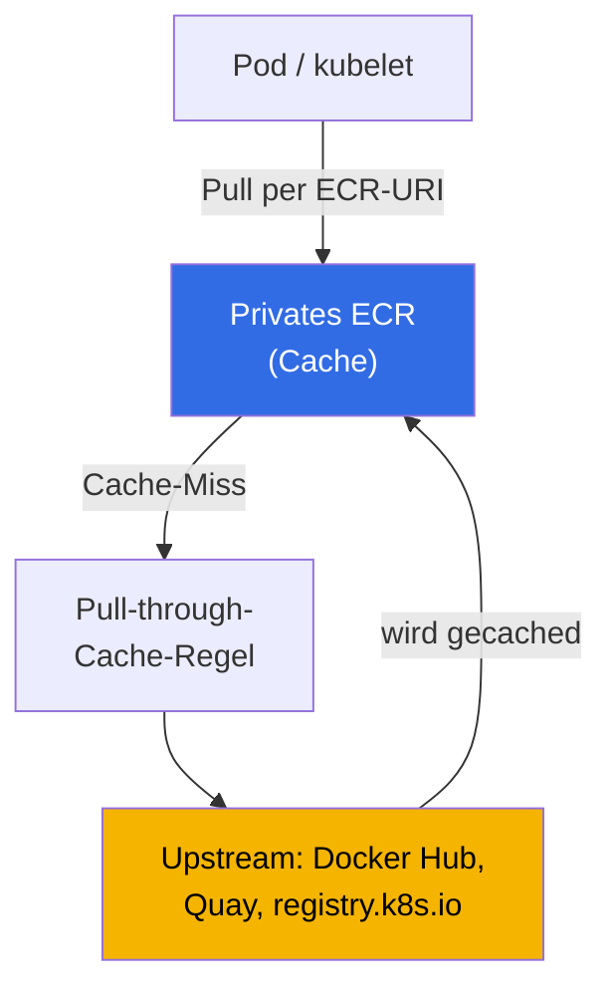
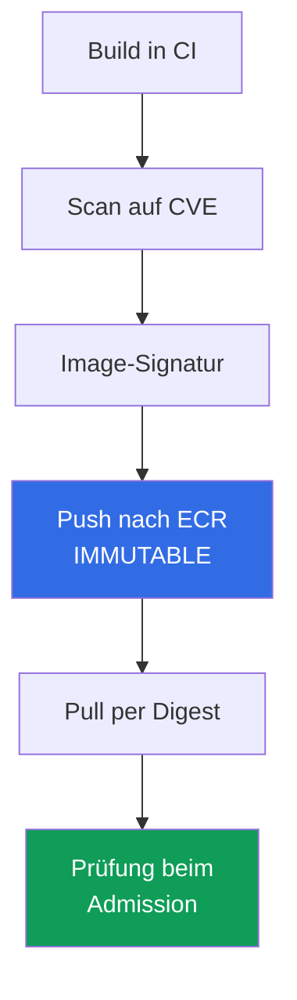

[Русская версия](ru.md) · [Eng version](en.md) · [Versión en español](es.md) · [Version française](fr.md) · [ქართული ვერსია](ge.md) · [繁體中文版](tw.md) · [日本語版](jp.md)
# Kapitel 20. Images und Supply Chain: ECR, Scans, Signaturen, Pull-through-Cache

> **Was als Nächstes kommt.** Teil 3 behandelte Identitäten (Kapitel 16-17), Secrets (Kapitel 18) und das Hardening von Node, Pod und Netzwerk (Kapitel 19). In diesem Kapitel geht es darum, was im Cluster überhaupt ausgeführt wird: Woher das Image stammt, wer es geprüft hat und ob es wirklich das ist, das die CI gebaut hat. Wir behandeln ECR als Registry, das Scannen auf Schwachstellen, Integrität über Digest und Signaturen, Pull-through-Cache und Lifecycle-Policies. Verwandte Themen stehen in anderen Kapiteln: die Node-Rolle mit Pull-Berechtigungen für ECR und die AMI als Image des **Nodes** (nicht zu verwechseln mit dem Container-Image) - Kapitel 10; Pod-Zugriff auf AWS (IRSA, Pod Identity) - Kapitel 16-17; Secrets in Images - Kapitel 18; privater Cluster und VPC Endpoints - Kapitel 19; Prüfung von Signatur und Registry beim Admission (Kyverno, Gatekeeper) - Kapitel 22; Audit, Scans zur Laufzeit und GuardDuty - Kapitel 21; die Account- und OU-Struktur, in der sich die gemeinsame Registry befindet - Kapitel 0.1.

## 20.1. „Ein Image mit kritischer CVE gelangte in Produktion, weil es niemand gescannt hat“

Die Anwendung läuft, der Bereitschaftsdienst ist entspannt - bis zum Sicherheitsbericht: In Produktion läuft ein Image mit einer bekannten kritischen CVE, deren Patch vor einem halben Jahr erschien. Die CI baute das Image, pushte und deployte es, doch zwischen Build und Produktion gab es keine einzige Prüfung. Niemand suchte nach Schwachstellen, weil es dafür weder ein Werkzeug noch einen Ort gab. Das ist kein Einzelfehler, sondern eine Klasse von Supply-Chain-Problemen - der Kette vom Quellcode bis zum laufenden Container. Daneben existieren verwandte Probleme derselben Art:

- **Rate Limit und nicht verfügbarer Upstream.** Die Hälfte der Images wird direkt von Docker Hub bezogen. Zur Stoßzeit erscheint `429 Too Many Requests` (anonymous pull limit), neue Pods bleiben in `ImagePullBackOff` hängen und das Rollout kommt zum Stillstand. Die externe Registry ist zu einer Laufzeitabhängigkeit geworden.
- **Manipulation und Typosquatting.** Im Manifest steht `image: mycompany/paymets:latest` - ein Tippfehler im Namen, und statt Ihres Images wird ein fremdes bezogen. Oder die CI baute ein Image, während ein anderes in Produktion gelangte: Es gibt keinen Beleg, dass es sich um dasselbe Artefakt handelt - eine Signatur fehlt.
- **`latest` hat sich unbemerkt geändert.** Das Deployment referenziert `app:latest`. Jemand hat den Tag überschrieben und beim nächsten `pull` erhält der Pod ein anderes Image, obwohl sich das Manifest nicht geändert hat. Es ist unmöglich nachzuvollziehen, was gestern tatsächlich lief: Ein Tag ist ein Label, keine feste Version.

Alle vier Probleme löst keine einzelne Option, sondern eine aufgebaute Kette: eine Registry, in der das Artefakt liegt, Scans vor Produktion, Tag-Unveränderlichkeit und Deployment per Digest, Signatur und deren Prüfung.

## 20.2. ECR als Registry

Amazon ECR (Elastic Container Registry) ist eine verwaltete Registry für OCI-Images. Es gibt zwei Arten: **private Repositories** (Registry-Adresse `<account-id>.dkr.ecr.<region>.amazonaws.com`) und **öffentliche** (`public.ecr.aws`). Jeder Account besitzt in jeder Region eine eigene private Registry, die Repositories enthält; ein Repository speichert Images mit Tags und Digests.

Die Authentifizierung ist **kein Login mit Passwort**, sondern ein temporäres Token über IAM. `get-login-password` liefert ein Token für 12 Stunden, mit dem sich Docker anmeldet:

```bash
# Login bei der privaten Registry: Token für 12 Stunden, Benutzer ist immer AWS
aws ecr get-login-password --region eu-central-1 \
  | docker login --username AWS --password-stdin 111122223333.dkr.ecr.eu-central-1.amazonaws.com
```

Der Zugriff wird auf zwei Ebenen von Richtlinien bestimmt. Die **IAM-Policy** des Subjekts (wer allgemein welche Aktionen mit ECR durchführen darf) und die **Repository Policy** - eine resource-based Policy für ein konkretes Repository (wer genau daraus `pull`en oder dorthin `push`en darf). Für **Cross-Account**-Zugriff wird eine Repository Policy (oder Registry Policy für die gesamte Registry) konfiguriert, die einem anderen Account das Beziehen von Images erlaubt - so entsteht ein gemeinsames ECR in einer Multi-Account-Umgebung (Kapitel 0.1). Der Node erhält die Berechtigung für `pull` über seine Rolle mit der Policy `AmazonEC2ContainerRegistryReadOnly` (Node-Rolle - Kapitel 10), deshalb bezieht der kubelet Images ohne `imagePullSecrets`.

```bash
# Repository erstellen: unveränderliche Tags + Scan beim Push + Verschlüsselung mit eigenem KMS-Schlüssel
aws ecr create-repository --repository-name payments/api \
  --image-tag-mutability IMMUTABLE \
  --image-scanning-configuration scanOnPush=true \
  --encryption-configuration encryptionType=KMS,kmsKey=arn:aws:kms:eu-central-1:111122223333:key/abcd \
  --region eu-central-1
```

Die entscheidende Wahl bei der Erstellung ist die **Veränderlichkeit von Tags**. `MUTABLE` (Standard) erlaubt, einen Tag mit einem anderen Image zu überschreiben - daraus entsteht das Problem, dass sich `latest` unbemerkt ändert. `IMMUTABLE` verhindert das Überschreiben: Ein Tag, der einmal an einen Digest gebunden wurde, ist festgelegt; ein weiterer `push` desselben Tags wird abgelehnt. Für Produktion verwendet man `IMMUTABLE`.

| Eigenschaft | `MUTABLE` | `IMMUTABLE` |
|---|---|---|
| Überschreiben eines bestehenden Tags | erlaubt | verboten |
| `latest` kann sich unbemerkt ändern | ja | nein (Tag ist belegt) |
| Reproduzierbarkeit über Tag | keine Garantie | Tag = konkreter Digest |
| Geeignet für | Sandbox, Entwürfe | Produktion, Release-Images |

### Eine Registry für die gesamte Organisation

Images aus den Registries jedes einzelnen Accounts bereitzustellen bedeutet, Scans, Lifecycle und Signaturen zu vervielfachen. Daher besteht das typische Multi-Account-Modell aus Kapitel 0.1 aus **einer Registry im Account für gemeinsame Services**, in die die CI pusht und aus der die Cluster `prod`, `stage` und `dev` nur beziehen. Der Zugriff muss dabei nicht pro Account vergeben werden: Eine Repository Policy ist eine normale resource-based Policy, daher funktionieren darin globale Condition Keys, und der Zugriff wird der gesamten Organisation über `aws:PrincipalOrgID` auf einmal erteilt.

```json
{
  "Version": "2012-10-17",
  "Statement": [{
    "Sid": "AllowPullFromOrg",
    "Effect": "Allow",
    "Principal": "*",
    "Action": ["ecr:BatchGetImage", "ecr:GetDownloadUrlForLayer"],
    "Condition": {"StringEquals": {"aws:PrincipalOrgID": "o-exampleorgid"}}
  }]
}
```

Ein neuer Account, der der Organisation beitritt, erhält automatisch Zugriff; ein ausgetretener verliert ihn ohne Änderung der Policy. Bei vier Punkten treten häufig Probleme auf.

- **Die Repository Policy ersetzt keine IAM-Policy.** Für Cross-Account-Zugriff werden beide Berechtigungen benötigt: die Repository Policy und Rechte auf der aufrufenden Seite. Hinzu kommt `ecr:GetAuthorizationToken` - eine Berechtigung auf Account-Ebene, die nicht in einer Repository Policy gesetzt werden kann; bei EKS-Nodes wird sie durch dieselbe Managed Policy der Node-Rolle erteilt (Kapitel 10).
- **Regel für die gesamte Registry statt für ein Repository.** Anstelle einer Policy für jedes Repository kann eine **Registry Policy** verwendet werden - sie gilt für die gesamte Registry des Accounts. Repositories, die ECR selbst erstellt (Cache, Replikation), werden über ein Repository Creation Template konfiguriert (Abschnitt 20.5).
- **Private Cluster.** Pull aus einem anderen Account über einen Interface Endpoint funktioniert, aber der Endpoint selbst befindet sich im lesenden Account und seine Endpoint Policy muss den fremden Resource-Zugriff erlauben (Kapitel 0.3 und 19), sonst wird das Image trotz korrekter Repository Policy nicht heruntergeladen.
- **Region und Datenverkehr.** Ein Cluster in einer anderen Region bezieht Layer regionsübergreifend: Das erhöht die Startlatenz des Pods und verursacht Datenverkehrskosten. Die Antwort ist **Registry-Replikation**: Regeln für Cross-Region und Cross-Account kopieren Images dorthin, wo sie bezogen werden. Für Cross-Account-Replikation setzt der Ziel-Account in seiner Registry eine Registry Policy mit `ecr:CreateRepository` und `ecr:ReplicateImage` für den Quell-Account; kopiert werden nur Images, die nach Einrichtung der Regel gepusht wurden.

Der Preis der Zentralisierung ist real: Die Registry wird zu einer gemeinsamen Abhängigkeit mit eigenem Owner, eigenen API-Quotas und eigenem Blast Radius. Daher hält Produktion häufig eine Replik in ihrem Account oder ihrer Region - die Quelle der Wahrheit bleibt eine, aber der Ausfallpunkt beim Rollout nicht.

Die zweite Einstellung bei der Erstellung, die **ebenfalls danach nicht mehr änderbar ist**, ist die Verschlüsselung at rest. Standardmäßig werden Layer mit S3-Schlüsseln verschlüsselt (SSE-S3, AES-256, ohne eigenes Zutun). Für Kontrolle über den Schlüssel wird `encryptionType=KMS` festgelegt: entweder mit dem AWS-managed Key `aws/ecr` oder einem eigenen customer managed key (der in derselben Region wie das Repository liegen muss). Wie die Veränderlichkeit kann die Encryption Configuration nach dem Erstellen nicht geändert werden, nur durch Neuerstellen des Repositorys.

## 20.3. Scannen auf Schwachstellen

ECR kann in Images nach bekannten CVEs suchen. Es gibt zwei Modi, und dies ist eine Auswahl für die gesamte Registry, nicht für ein Repository.

- **Basic Scanning** - ECR-Technologie mit einer CVE-Datenbank; scannt **Schwachstellen in Betriebssystempaketen**. Zwei Frequenzen: manuell und Scan on Push (beim Push). Findings werden über `DescribeImageScanFindings` ausgegeben.
- **Enhanced Scanning** - Integration mit **Amazon Inspector**: scannt Schwachstellen in **Betriebssystem- und Programmiersprachenpaketen** (npm, pip, gem usw.) und tut dies **kontinuierlich**. Wenn eine neue CVE erscheint, werden die Ergebnisse für bereits gespeicherte Images automatisch aktualisiert und Inspector sendet ein Event an EventBridge. Zwei Frequenzen: Scan on Push und Continuous Scan.

```bash
# Basic Scan on Push auf Registry-Ebene aktivieren
aws ecr put-registry-scanning-configuration --scan-type BASIC \
  --rules '[{"scanFrequency":"SCAN_ON_PUSH","repositoryFilters":[{"filter":"*","filterType":"WILDCARD"}]}]'

# Einmaligen Scan eines konkreten Images durchführen und Findings nach Severity anzeigen
aws ecr start-image-scan --repository-name payments/api --image-id imageTag=1.4.2
aws ecr describe-image-scan-findings --repository-name payments/api --image-id imageTag=1.4.2
```

Findings enthalten eine Severity (`CRITICAL`, `HIGH`, `MEDIUM`, ...) und einen Verweis auf die CVE. Das Scannen allein blockiert nichts - es ist ein Signal. Damit ein Image mit kritischen Findings **nicht in Produktion gelangt**, wird der Scan in den Prozess integriert: ein Gate in der CI (bei `CRITICAL` nicht pushen oder deployen) und eine Prüfung beim Admission per Policy (Kyverno oder Gatekeeper - Kapitel 22). ECR findet die Schwachstelle, die Policy entscheidet, ob ein solches Image zugelassen wird.

| Eigenschaft | Basic Scanning | Enhanced Scanning (Inspector) |
|---|---|---|
| Was gescannt wird | Betriebssystempakete | Betriebssystem + Sprachpakete (npm, pip, ...) |
| Frequenz | manuell, Scan on Push | Scan on Push, kontinuierlich |
| Neubewertung bei neuen CVEs | nein | ja, automatisch |
| Benachrichtigungen | - | Event in EventBridge |
| Geeignet für | Minimum, Sandbox | Produktion, dauerhafte Kontrolle |

Ein Wechsel zwischen Basic und Enhanced setzt zuvor ausgeführte Scans zurück: Sie müssen erneut eingerichtet werden (bei der Rückkehr zum vorherigen Typ sind die alten Ergebnisse wieder verfügbar).

## 20.4. Image-Integrität: Digest, Tags und Signaturen

Ein Tag ist ein bewegliches Label für ein Image. Die tatsächlich unveränderliche Kennung eines Images ist sein **Digest**: ein `sha256`-Hash des Inhalts. Derselbe Digest verweist immer auf dasselbe Image; ändert sich der Inhalt, ändert sich der Digest. Daraus folgt die Regel: In Produktion per **Digest** deployen, nicht per Tag.

```bash
# Pull per Digest - garantiert exakt das Image, das die CI gebaut hat
docker pull 111122223333.dkr.ecr.eu-central-1.amazonaws.com/payments/api@sha256:9f2c...e41a
```

```yaml
# Im Pod-Manifest fixiert eine Referenz per Digest den Image-Inhalt endgültig
spec:
  containers:
    - name: api
      image: 111122223333.dkr.ecr.eu-central-1.amazonaws.com/payments/api@sha256:9f2c...e41a
```

Warum `latest` gefährlich ist: Semantisch ist es ein `MUTABLE`-Tag - immer das „neueste“ und daher veränderlich. Auch ein fester Tag `1.4.2` kann in einem `MUTABLE`-Repository überschrieben werden. Die zuverlässige Kombination lautet: ein `IMMUTABLE`-Repository (der Tag kann nicht überschrieben werden) plus Deployment per Digest (Verweis auf Inhalt statt Label).

Ein Digest schützt vor **versehentlicher** Manipulation, beweist aber nicht, **wer** das Image gebaut hat. Das löst eine **Signatur**. Das Image wird beim Build signiert (`cosign` aus dem Sigstore-Projekt oder Notation/Notary Project; AWS Signer als verwalteter Signaturdienst), und am Eingang zum Cluster wird die Signatur beim Admission **geprüft** - mit der Kyverno-Regel `verifyImages` oder dem Sigstore policy-controller (Kapitel 22). Nur ein Image mit gültiger Signatur eines vertrauenswürdigen Schlüssels darf starten - dadurch werden Manipulation und Typosquatting aus 20.1 verhindert.

## 20.5. Pull-through-Cache

Ein Pull-through-Cache löst die Probleme mit Docker-Hub-Rate-Limits und nicht verfügbarem Upstream. ECR **cached Images aus einer externen Registry bei Bedarf in Ihrem privaten ECR**: Sie beziehen ein Image über die URI Ihrer Registry, ECR erstellt beim ersten Zugriff selbst ein Repository und cached das Image; bei späteren Anfragen per Tag prüft es den Upstream mindestens **alle 24 Stunden** auf eine neue Version dieses Tags und aktualisiert den Cache.



Wozu das in EKS dient:

- **Umgehung von Docker-Hub-Rate-Limits** - Images werden aus Ihrem ECR statt anonym von Docker Hub bezogen.
- **Verfügbarkeit** - der Upstream ist ausgefallen, aber das Image liegt bereits im Cache.
- **Privater Cluster ohne Internetzugang** (Kapitel 19) - Nodes nutzen nur ECR über VPC Endpoints statt das Internet für externe Images.
- **Einheitlicher Scan-Punkt** - gecachte Images liegen in Ihrem ECR und unterliegen denselben Scans und Policies wie eigene Images.

Unterstützte Upstreams (laut AWS-Dokumentation): **ohne Authentifizierung** - Amazon ECR Public, Kubernetes Registry (`registry.k8s.io`) und Quay; **mit Authentifizierung** über ein Secret in AWS Secrets Manager - Docker Hub, Microsoft Azure Container Registry, GitHub Container Registry, GitLab (SaaS) und Chainguard; **Amazon ECR** (Cross-Account) - über eine IAM-Rolle.

```bash
# Regel für Docker Hub: Präfix docker-hub, Anmeldedaten in Secrets Manager
aws ecr create-pull-through-cache-rule --ecr-repository-prefix docker-hub \
  --upstream-registry-url registry-1.docker.io \
  --credential-arn arn:aws:secretsmanager:eu-central-1:111122223333:secret:ecr-pullthroughcache/dh
```

Danach wird das Image über die URI der eigenen Registry mit dem Regelpräfix referenziert:

```yaml
# war docker.io/library/nginx:1.27 - wird über den ECR-Cache bezogen
image: 111122223333.dkr.ecr.eu-central-1.amazonaws.com/docker-hub/library/nginx:1.27
```

Eine Feinheit: Repositories, die ECR selbst für den Cache anlegt, erhalten standardmäßig `MUTABLE`-Tags, SSE-S3-Verschlüsselung und keine Lifecycle Policy - die Einstellungen aus 20.2 und 20.6 gelten nicht automatisch für sie. Damit Cache-Repositories KMS-Schlüssel, automatische Bereinigung und Tag-Unveränderlichkeit erben, wird ein **Repository Creation Template** mit demselben Präfix wie die Cache-Regel eingerichtet:

```bash
# Template für das Präfix docker-hub: Cache-Repositories erhalten KMS-Schlüssel und Lifecycle Policy
aws ecr create-repository-creation-template --prefix docker-hub --applied-for PULL_THROUGH_CACHE \
  --encryption-configuration encryptionType=KMS,kmsKey=arn:aws:kms:eu-central-1:111122223333:key/abcd \
  --lifecycle-policy file://lifecycle.json
```

Das Template gilt nur bei der Erstellung eines Repositorys und darüber werden auch die Repository Policy und die Tag-Unveränderlichkeit festgelegt (mit Ausnahmen für bewegliche Cache-Tags wie `latest`).

## 20.6. Lifecycle Policy: automatische Bereinigung von Repositories

Ohne Bereinigung wächst ein Repository unbegrenzt: Alte Tags und ungetaggte Layer sammeln sich ebenso wie alte verwundbare Images, die noch jemand deployen könnte. Eine **Lifecycle Policy** definiert Regeln für das automatische Löschen nach Alter oder Image-Anzahl.

```bash
# Die 10 neuesten Images mit dem Tag-Präfix v behalten, alle anderen löschen
aws ecr put-lifecycle-policy --repository-name payments/api --lifecycle-policy-text '{
  "rules": [{
    "rulePriority": 1,
    "description": "keep last 10 tagged",
    "selection": {"tagStatus":"tagged","tagPrefixList":["v"],"countType":"imageCountMoreThan","countNumber":10},
    "action": {"type": "expire"}
  }]
}'
```

Typische Regeln löschen ungetaggte Images, die älter als N Tage sind, oder bewahren höchstens N Images mit einem Tag-Präfix auf. Das spart Speicher und reduziert das Risiko, dass ein uraltes verwundbares Image aus dem Repository gestartet wird. Regeln werden über `tagStatus` (`tagged`/`untagged`/`any`) und `countType` nach Alter (`sinceImagePushed`) oder Anzahl (`imageCountMoreThan`) ausgedrückt.

## 20.7. Privater Cluster und Images

In einem privaten Cluster (Kapitel 19) beziehen Nodes ohne Internetzugang Images aus ECR **nur über VPC Endpoints**. Für `pull` sind drei erforderlich: die Interface Endpoints `ecr.api` (ECR-API-Aufrufe einschließlich Authentifizierung) und `ecr.dkr` (das Docker-Protokoll für den Pull) sowie der **Gateway Endpoint `s3`** - denn **Image-Layer liegen physisch in S3**. Ohne S3 Endpoint sind `ecr.api` und `ecr.dkr` vorhanden, doch das Image wird trotzdem nicht heruntergeladen: Die Layer kommen nicht an. Es ist dieselbe Endpoint-Tabelle wie in Kapitel 19; wichtig ist hier, dass ein Image-Pull an die Kombination ECR + S3 gebunden ist und ein Pull-through-Cache in einem solchen Cluster der einzige Weg ist, externe Images zu erreichen, ohne den Nodes Internetzugang zu öffnen.

## 20.8. Die Supply Chain als Kette

Die einzelnen Maßnahmen ergeben eine Kette vom Build bis zum Start. Ein Bruch in einem beliebigen Glied entwertet die übrigen.



| Glied | Beitrag | Wo der Bruch liegt |
|---|---|---|
| Scan auf CVE | bekannte Schwachstellen sind vor Produktion sichtbar | Image wird überhaupt nicht gescannt |
| Push nach ECR `IMMUTABLE` | Tag kann nicht überschrieben werden | `MUTABLE` - Tag hat sich unbemerkt geändert |
| Pull per Digest | exakt das gebaute Artefakt wird gestartet | Deployment per `latest`/Tag |
| Signaturprüfung beim Admission | nur ein vertrauenswürdiges Image wird zugelassen | Signatur wird nicht geprüft |

So liest sich die Kette: Die CI baut das Image, scannt es (20.3), signiert es (20.4), pusht es in `IMMUTABLE`-ECR (20.2), der Cluster bezieht es per Digest und die Admission Policy (Kapitel 22) prüft Signatur und Quelle. Ein ungescanntes Image, ein `MUTABLE`-Tag, ein Deployment per `latest` oder das Fehlen der Signaturprüfung sind die Punkte, an denen die Kette bricht und die Probleme aus 20.1 zurückkehren.

## 20.9. Einsatz in Produktion

- **Enhanced Scanning für die gesamte Registry.** Der kontinuierliche Inspector-Scan findet CVEs, die erst nach dem Push entstehen, und sendet ein Event an EventBridge - statt das Image nur einmal beim Push zu prüfen.
- **Immutable Tags und Deployment per Digest.** Repositories werden mit `IMMUTABLE` erstellt und Workloads referenzieren das Image per `@sha256:` - der Tag kann nicht überschrieben werden und es startet exakt das gebaute Artefakt.
- **Pull-through-Cache statt direktem Docker Hub.** Externe Images werden über den Cache in ECR bezogen: keine Abhängigkeit von Rate Limit und Upstream-Verfügbarkeit, alles unter einheitlichem Scan und einheitlichen Policies. Die Einstellungen für Cache-Repositories (KMS, Lifecycle, Immutability) werden mit einem Repository Creation Template für das Regelpräfix angewendet.
- **Lifecycle Policy für jedes Repository.** Das automatische Bereinigen alter und ungetaggter Images begrenzt das Repository und verhindert, dass ein uraltes verwundbares Image gestartet wird.
- **Signatur und ihre Prüfung beim Admission.** Images werden in der CI signiert (cosign, Notation, AWS Signer), und am Eingang zum Cluster lässt eine Policy (Kapitel 22) nur gültig signierte Images zu.
- **Cross-Account über ein gemeinsames ECR.** In einer Multi-Account-Umgebung (Kapitel 0.1) liegen Images in einer Registry mit Repository Policy für Zugriff aus anderen Accounts, statt sie pro Account zu duplizieren.

## 20.10. Mini-Glossar

- **ECR** - verwaltete AWS-Registry für OCI-Images; private Registry je Account und Region mit der Adresse `<account-id>.dkr.ecr.<region>.amazonaws.com` und öffentliche Registry `public.ecr.aws`.
- **Digest** - `sha256`-Hash des Image-Inhalts, eine unveränderliche Kennung; Deployment per Digest garantiert den Start des exakt gebauten Artefakts, anders als ein beweglicher Tag.
- **Tag Immutability** - Repository-Modus `IMMUTABLE`, der das Überschreiben eines Tags durch ein anderes Image verhindert; `MUTABLE` (Standard) erlaubt das Überschreiben.
- **Basic / Enhanced Scanning** - ECR-Modi zum Finden von CVEs: Basic scannt nativ Betriebssystempakete; Enhanced scannt Betriebssystem- und Sprachpakete fortlaufend über Amazon Inspector.
- **Pull-through-Cache** - ECR-Regel, die Images einer externen Registry (Docker Hub, Quay, `registry.k8s.io` usw.) bei Bedarf im eigenen privaten ECR cached.
- **Lifecycle Policy** - Regeln für das automatische Löschen von Images nach Alter oder Anzahl.
- **Repository Policy und Registry Policy** - resource-based Policies für ein Repository bzw. für die gesamte Registry eines Accounts; `aws:PrincipalOrgID` funktioniert darin, sodass Pull der gesamten Organisation gewährt werden kann, ohne Accounts einzeln aufzulisten. `ecr:GetAuthorizationToken` kann darin nicht gesetzt werden - es ist eine Berechtigung auf Account-Ebene in der IAM-Policy des Aufrufenden.
- **Replication Configuration** - ECR-Regeln, die Images in andere Regionen und Accounts kopieren; bei Cross-Account-Replikation erlaubt der Ziel-Account der Quelle `ecr:CreateRepository` und `ecr:ReplicateImage` in seiner Registry Policy.
- **Repository Creation Template** - Vorlage für Einstellungen (Verschlüsselung, Lifecycle, Immutability, Policy) für Repositories, die ECR unter einem Präfix selbst für den Pull-through-Cache erstellt; ohne sie erhält ein Cache-Repository die Standardwerte (`MUTABLE`, SSE-S3, keine Policies).
- **Encryption at Rest** - Verschlüsselung von Layern in ECR: Standard ist SSE-S3 (AES-256), optional SSE-KMS mit dem Schlüssel `aws/ecr` oder einem eigenen customer managed key; sie wird beim Erstellen festgelegt und bleibt unveränderlich.

## 20.11. Zusammenfassung des Kapitels

- Supply-Chain-Probleme (ungescannte CVE in Produktion, Docker-Hub-Rate-Limit, Image-Manipulation, verändertes `latest`) werden durch eine Kette aus Registry, Scan, Unveränderlichkeit, Digest und Signatur gelöst.
- ECR ist eine private Registry pro Account und Region; Authentifizierung erfolgt über ein IAM-Token (`get-login-password`), nicht über ein Passwort. Zugriff erfolgt über IAM plus Repository Policy, Cross-Account über Repository/Registry Policy. Der Node erhält Pull über seine Rolle (Kapitel 10).
- Die Veränderlichkeit von Tags ist eine Schlüsselentscheidung: `IMMUTABLE` fixiert die Beziehung zwischen Tag und Digest, `MUTABLE` erlaubt, dass sich `latest` unbemerkt ändert. Für Produktion gelten `IMMUTABLE` und Deployment per `@sha256:`.
- Scanning: Basic (Betriebssystempakete, manuell/Scan on Push) und Enhanced (Betriebssystem + Sprachen, kontinuierlich, Inspector, Events in EventBridge). Es blockiert nicht selbst - die Admission Policy entscheidet (Kapitel 22).
- Integrität: Der Digest schützt vor Manipulation, die Signatur (cosign, Notation, AWS Signer) vor absichtlicher Manipulation; die Signatur wird am Eingang zum Cluster durch eine Kyverno/Gatekeeper-Policy geprüft (Kapitel 22).
- Pull-through-Cache cached externe Images in ECR (Umgehung von Rate Limits, Verfügbarkeit, privater Cluster, einheitlicher Scan). Die Lifecycle Policy bereinigt Altes. Pull in einem privaten Cluster erfolgt über `ecr.api`, `ecr.dkr` und den S3 Endpoint (Layer liegen in S3, Kapitel 19).

## 20.12. Nutzen in der täglichen Arbeit

Die Frage „Ist das wirklich das Image, das die CI gebaut hat?“ wird mit Deployment per Digest und Signaturprüfung durch das Manifest selbst beantwortet, nicht durch eine Untersuchung. Der Vorfall „Das Rollout steht wegen `ImagePullBackOff` durch ein Docker-Hub-Rate-Limit“ passiert nicht, wenn Images über den Pull-through-Cache in ECR laufen. Im Bereitschaftsdienst wird „In Produktion gibt es eine kritische CVE“ von einem Bericht im Nachhinein zu einer Blockade bereits beim Admission, weil Enhanced Scanning sie gefunden hat und die Policy sie nicht zuließ. Und ein `IMMUTABLE`-Repository zusammen mit einem Digest beseitigt eine ganze Klasse von „Gestern hat es funktioniert, heute ist es ein anderes Image“ - der Tag ist kein Label mehr, das sich unbemerkt ändert.

## 20.13. Fragen zur Selbstkontrolle

1. Welche vier Supply-Chain-Probleme werden in 20.1 genannt, und welches Kettenglied löst jeweils welches Problem?
2. Wie sieht die Adresse einer privaten ECR-Registry aus, und worin unterscheidet sich die ECR-Authentifizierung von einem Passwort?
3. Welche zwei Policies steuern den Zugriff auf ein Repository, und wie wird Cross-Account-Pull gewährt?
4. Wer gibt dem Node womit die Berechtigung, Images aus ECR ohne `imagePullSecrets` zu beziehen?
5. Worin unterscheidet sich ein `IMMUTABLE`-Repository von `MUTABLE`, und warum wird für Produktion ersteres verwendet?
6. Worin unterscheidet sich Basic Scanning von Enhanced Scanning, und was bringt die Integration mit Amazon Inspector?
7. Blockiert das Scanning allein das Deployment eines verwundbaren Images? Falls nicht, was blockiert es und wo?
8. Warum ist Deployment per Digest zuverlässiger als Deployment per Tag, und worin unterscheidet sich ein Digest von einem Tag?
9. Wovor schützt ein Digest, wovor eine Signatur, und wo wird die Signatur geprüft?
10. Was macht ein Pull-through-Cache, und welche Upstreams benötigen Authentifizierung und welche nicht?
11. Wozu dient ein Pull-through-Cache in einem privaten Cluster ohne Internetzugang?
12. Warum wird eine Lifecycle Policy benötigt, und anhand welcher Kriterien löscht sie Images?
13. Warum wird in einem privaten Cluster für Image-Pull zusätzlich ein S3 VPC Endpoint benötigt und nicht nur ECR?
14. Worin unterscheidet sich die ECR-Standardverschlüsselung von SSE-KMS, und wann kann die Konfiguration nicht mehr geändert werden?
15. Welche Einstellungen erhalten Cache-Repositories standardmäßig, und wie werden KMS und Lifecycle für sie festgelegt?
16. Wie kann Pull aus einer Registry sofort der gesamten Organisation gewährt werden, und warum reicht eine Repository Policy allein für Cross-Account nicht aus?
17. Ein Cluster in einer anderen Region bezieht Images aus einer gemeinsamen Registry. Was ändern Sie, und welche Berechtigungen benötigt der Ziel-Account?

## Praxis

Das Kurs-Lab zu diesem Thema: [Lab 130 - ECR und Supply Chain: unveränderliche Tags, Scan beim Push, Pull-through-Cache](../../labs/130/README_DE.MD). Dort gibt es ein Repository mit `IMMUTABLE` und `scanOnPush`, die Ablehnung eines wiederholten Pushs desselben Tags durch die Registry, die Analyse von Findings und den Geltungsbereich des Scanners, Deployment per Digest aus privatem ECR sowie zwei Pull-through-Caches - ohne Authentifizierung und mit Secret. Das Ergebnis wird mit dem Befehl `check_result` geprüft.

Nachfolgend dasselbe im eigenen Account. Erstellen Sie ein Repository mit `--image-tag-mutability IMMUTABLE` und `--image-scanning-configuration scanOnPush=true`, melden Sie sich über `aws ecr get-login-password | docker login` an, pushen Sie ein Image und zeigen Sie die Findings an: `aws ecr describe-image-scan-findings --repository-name <repo> --image-id imageTag=<tag>`. Versuchen Sie, den Tag zu überschreiben - `IMMUTABLE` weist den Push zurück. Ermitteln Sie den Digest des Images (`aws ecr describe-images ... --query 'imageDetails[].imageDigest'`) und deployen Sie den Pod per `@sha256:` statt per Tag.

Danach folgt der Pull-through-Cache: `aws ecr create-pull-through-cache-rule` für Quay oder `registry.k8s.io` (ohne Secret) oder für Docker Hub (mit Secret in Secrets Manager), anschließend beziehen Sie ein Image über die URI Ihrer Registry mit Regelpräfix und stellen sicher, dass ein gecachtes Repository in ECR erscheint. Fügen Sie mit `aws ecr put-lifecycle-policy` eine Lifecycle Policy hinzu und prüfen Sie die Löschvorschau mit `aws ecr get-lifecycle-policy-preview`. Die Signaturprüfung beim Admission bleibt Kapitel 22 vorbehalten.

---
[Inhaltsverzeichnis](../README_DE.md) · [Kapitel 19](../19/de.md) · [Kapitel 21](../21/de.md)
