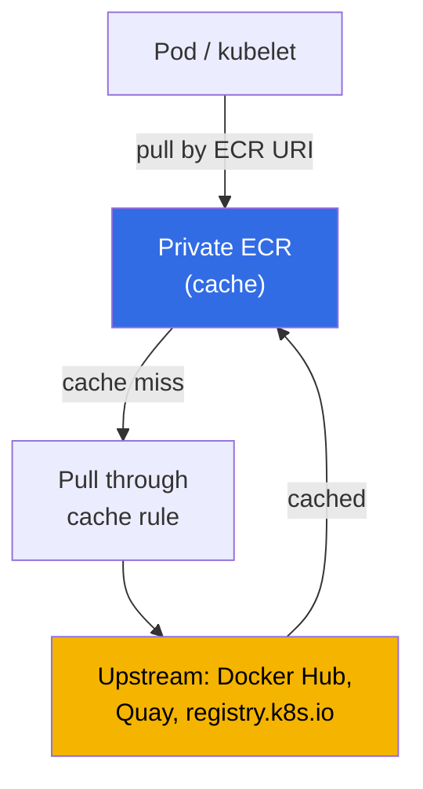
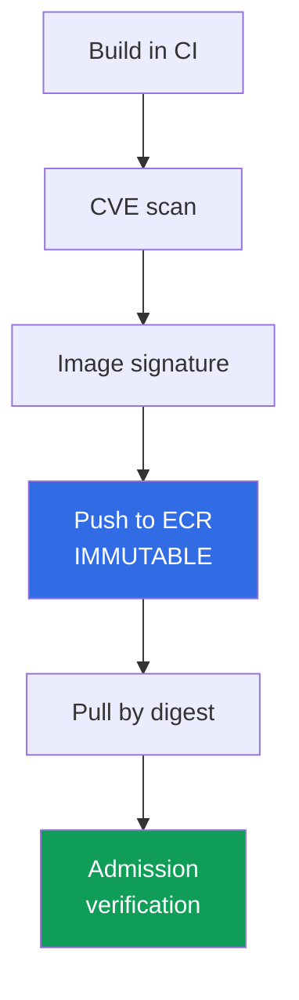

[Русская версия](ru.md) · [Versión en español](es.md) · [Version française](fr.md) · [Deutsche Version](de.md) · [ქართული ვერსია](ge.md) · [繁體中文版](tw.md) · [日本語版](jp.md)
# Chapter 20. Images and supply chain: ECR, scanning, signatures, pull through cache

> **What comes next.** Part 3 covered identity (chapters 16-17), secrets (chapter 18), and
> node, pod, and network hardening (chapter 19). This chapter is about what actually runs in the
> cluster: where an image comes from, who checked it, and whether it is the one built by CI. We
> cover ECR as a registry, vulnerability scanning, integrity through digests and signatures, pull
> through cache, and lifecycle policies. Related topics are in other chapters: the node role with
> ECR pull permissions and the node **image** AMI (not to be confused with a container image) in
> chapter 10; pod access to AWS (IRSA, Pod Identity) in chapters 16-17; secrets inside images in
> chapter 18; private clusters and VPC endpoints in chapter 19; signature and registry validation
> at admission (Kyverno, Gatekeeper) in chapter 22; audit, runtime scanning, and GuardDuty in
> chapter 21; and the account and OU structure where a shared registry lives in chapter 0.1.

## 20.1. "A critical-CVE image reached production because no one scanned it"

The application works, on-call is quiet, until the security report arrives: production is running
an image with a known critical CVE whose patch was released six months ago. CI built the image,
pushed it, and deployed it, but there was not a single check between the build and production. No
one looked for the vulnerability because there was neither a tool nor a place to look. This is not
an isolated failure but a class of supply chain problems, the chain from source code to the running
container. Related issues of the same nature are common:

- **Rate limits and an unavailable upstream.** Half the images are pulled directly from Docker
  Hub. During peak time, `429 Too Many Requests` arrives (the anonymous pull limit), new pods get
  stuck in `ImagePullBackOff`, and the rollout stops. An external registry has become a runtime
  dependency.
- **Substitution and typosquatting.** The manifest says `image: mycompany/paymets:latest`, with a
  typo in the name, and a foreign image is pulled instead of yours. Or CI built one image but
  another reached production: there is no way to prove it is the same artifact because it has no
  signature.
- **`latest` moved under your feet.** A deployment references `app:latest`. Someone overwrote the
  tag, and on the next `pull` the pod gets a different image even though the manifest did not
  change. Reproducing what was running yesterday is impossible: a tag is a label, not a fixed
  version.

None of the four issues is fixed by one checkbox, but by an established chain: a registry holding
the artifact, scanning before production, tag immutability and deployment by digest, then signing
and signature verification.

## 20.2. ECR as a registry

Amazon ECR (Elastic Container Registry) is a managed registry for OCI images. There are two types:
**private repositories** (registry address
`<account-id>.dkr.ecr.<region>.amazonaws.com`) and **public** ones (`public.ecr.aws`). Each
account in a Region has its own private registry, containing repositories; a repository holds
images with tags and digests.

Authentication is **not a username and password login**, but a temporary token via IAM.
`get-login-password` issues a 12-hour token used to log Docker in:

```bash
# log in to a private registry: token valid for 12 hours, username is always AWS
aws ecr get-login-password --region eu-central-1 \
  | docker login --username AWS --password-stdin 111122223333.dkr.ecr.eu-central-1.amazonaws.com
```

Access is controlled by two policy layers. The subject's **IAM policy** determines who can do what
with ECR in general, and a **repository policy** is a resource-based policy on a specific
repository, determining who can `pull` or `push` there. For **cross-account** access, configure a
repository policy (or a registry policy for the entire registry) that lets another account pull
images. This is how a shared ECR is built for a multi-account setup (chapter 0.1). A node gets
`pull` permissions from its node role with the `AmazonEC2ContainerRegistryReadOnly` policy
(chapter 10), so kubelet pulls an image without `imagePullSecrets`.

```bash
# create a repository: immutable tags, scan on push, and encryption with a KMS key
aws ecr create-repository --repository-name payments/api \
  --image-tag-mutability IMMUTABLE \
  --image-scanning-configuration scanOnPush=true \
  --encryption-configuration encryptionType=KMS,kmsKey=arn:aws:kms:eu-central-1:111122223333:key/abcd \
  --region eu-central-1
```

The key choice at creation is **tag mutability**. `MUTABLE` (the default) lets a tag be overwritten
with another image, causing the "`latest` moved under your feet" problem. `IMMUTABLE` prohibits
an overwrite: once a tag is associated with a digest, it is fixed, and another `push` of that tag
is rejected. Use `IMMUTABLE` in production.

| Property | `MUTABLE` | `IMMUTABLE` |
|---|---|---|
| Overwrite an existing tag | allowed | prohibited |
| `latest` can change unnoticed | yes | no (the tag is occupied) |
| Reproducibility by tag | no guarantee | tag = a specific digest |
| Appropriate use | sandbox, drafts | production, release images |

### One registry for the whole organization

Distributing images from a registry in every account multiplies scanning, lifecycle, and signing.
A typical multi-account design from chapter 0.1 therefore uses **one registry in a shared-services
account**, where CI pushes, while `prod`, `stage`, and `dev` clusters only pull. Access does not
need to be granted account by account: a repository policy is an ordinary resource-based policy,
so global condition keys work in it and access can be granted to the whole organization through
`aws:PrincipalOrgID`.

```json
{
  "Version": "2012-10-17",
  "Statement": [{
    "Sid": "AllowPullFromOrg",
    "Effect": "Allow",
    "Principal": "*",
    "Action": ["ecr:BatchGetImage", "ecr:GetDownloadUrlForLayer"],
    "Condition": {"StringEquals": {"aws:PrincipalOrgID": "o-exampleorgid"}}
  }]
}
```

A new account joining the organization automatically gets access, while an account leaving loses
it without a policy change. There are four pitfalls.

- **A repository policy does not replace an IAM policy.** Cross-account access needs both
  permissions: the repository policy and permissions on the caller side. It also needs
  `ecr:GetAuthorizationToken`, an account-level permission that cannot be set in a repository
  policy. On EKS nodes, the same managed policy on the node role provides it (chapter 10).
- **A rule for the whole registry, not a repository.** Instead of a policy on every repository,
  use a **registry policy**, which applies to an account's whole registry. Repositories created by
  ECR itself (for cache and replication) are configured with a repository creation template
  (section 20.5).
- **Private clusters.** Pulling from a foreign account through an interface endpoint works, but
  the endpoint itself is in the reader account, and its endpoint policy must allow the foreign
  resource (chapters 0.3 and 19). Otherwise the image will not download despite a valid
  repository policy.
- **Region and traffic.** A cluster in another Region pulls layers across the Region boundary,
  which means both pod startup latency and traffic on the bill. The answer is **registry
  replication**: cross-Region and cross-account rules copy images where they are pulled. For
  cross-account replication, the receiving account attaches a registry policy granting
  `ecr:CreateRepository` and `ecr:ReplicateImage` to the source account. Only images pushed after
  the rule is configured are copied.

The cost of centralization is real: the registry becomes a shared dependency with its own owner,
API quotas, and blast radius. Production therefore often keeps a replica in its own account or
Region: one source of truth, but no single point of failure during rollout.

A second setting at creation, which is also **immutable afterward**, is encryption at rest. By
default, layers are encrypted with S3 keys (SSE-S3, AES-256, with no action from you). To control
the key, set `encryptionType=KMS`: either the AWS-managed `aws/ecr` key or your own customer
managed key (which must be in the same Region as the repository). As with mutability, an
encryption configuration cannot be changed after creation, only by recreating the repository.

## 20.3. Vulnerability scanning

ECR can search images for known CVEs. There are two modes, selected for the entire registry rather
than per repository.

- **Basic scanning** uses ECR technology and the CVE database to scan **OS package
  vulnerabilities**. It has two frequencies: manual and scan on push. Findings are returned by
  `DescribeImageScanFindings`.
- **Enhanced scanning** integrates with **Amazon Inspector**. It scans vulnerabilities in **OS
  and programming-language packages** (npm, pip, gem, and others), and does so **continuously**.
  When a new CVE appears, findings for existing images are updated automatically, and Inspector
  sends an event to EventBridge. Its frequencies are scan on push and continuous scan.

```bash
# enable basic scan on push at the registry level
aws ecr put-registry-scanning-configuration --scan-type BASIC \
  --rules '[{"scanFrequency":"SCAN_ON_PUSH","repositoryFilters":[{"filter":"*","filterType":"WILDCARD"}]}]'

# scan one specific image and view findings by severity
aws ecr start-image-scan --repository-name payments/api --image-id imageTag=1.4.2
aws ecr describe-image-scan-findings --repository-name payments/api --image-id imageTag=1.4.2
```

Findings include severity (`CRITICAL`, `HIGH`, `MEDIUM`, and others) and a CVE reference.
Scanning alone does not block anything: it is a signal. To ensure that an image with critical
findings **does not reach production**, integrate scanning into the process: a CI gate (do not
push or deploy if `CRITICAL` is present) and an admission policy check (Kyverno or Gatekeeper,
chapter 22). ECR identifies the vulnerability; policy decides whether that image is admitted.

| Property | Basic scanning | Enhanced scanning (Inspector) |
|---|---|---|
| What it scans | OS packages | OS + language packages (npm, pip, ...) |
| Frequency | manual, scan on push | scan on push, continuous |
| Re-evaluation for new CVEs | no | yes, automatically |
| Notifications | - | EventBridge event |
| Appropriate use | minimum, sandbox | production, continuous control |

Switching between basic and enhanced resets previously completed scans, which must be configured
again. When returning to the original type, the old results become available again.

## 20.4. Image integrity: digests, tags, and signatures

A tag is a movable label for an image. The real immutable image identifier is its **digest**, a
`sha256` hash of its content. The same digest always points to the same image; when the content
changes, the digest changes. This leads to the rule: deploy **by digest** in production, not by
Tag.

```bash
# pull by digest: guarantees this is exactly the image built by CI
docker pull 111122223333.dkr.ecr.eu-central-1.amazonaws.com/payments/api@sha256:9f2c...e41a
```

```yaml
# a digest reference in a pod manifest fixes the image content permanently
spec:
  containers:
    - name: api
      image: 111122223333.dkr.ecr.eu-central-1.amazonaws.com/payments/api@sha256:9f2c...e41a
```

Why `latest` is dangerous: by its nature it is a `MUTABLE` tag, always meaning "the latest," and
it changes under your feet. Even a fixed `1.4.2` tag can be overwritten in a `MUTABLE` repository.
The reliable combination is an `IMMUTABLE` repository (the tag cannot be overwritten) and
deployment by digest (a reference to content, not a label).

A digest protects against **accidental** substitution but does not prove **who** built the image.
A **signature** solves that. Sign the image during the build (`cosign` from the Sigstore project or
Notation/Notary Project; AWS Signer as a managed signing service), then **verify** the signature
at cluster admission with a Kyverno `verifyImages` rule or Sigstore policy-controller (chapter
22). Only an image with a valid signature from a trusted key is allowed to run, closing the
substitution and typosquatting issues from 20.1.

## 20.5. Pull through cache

Pull through cache addresses Docker Hub rate limits and upstream unavailability. ECR **caches
images from an external registry in your private ECR on demand**: you pull an image through your
registry URI, ECR creates a repository itself and caches the image on the first request, then on
subsequent requests by tag it checks the upstream for a new version of that tag no less often than
**every 24 hours** and updates the cache.



Why this matters in EKS:

- **Bypass Docker Hub rate limits**: pull from your ECR instead of anonymously from Docker Hub.
- **Availability**: if the upstream is down, an image already exists in the cache.
- **Private cluster without Internet access** (chapter 19): nodes access only ECR through VPC
  endpoints rather than the Internet for external images.
- **A single scanning point**: cached images are in your ECR and are subject to the same scanning
  and policies as your own images.

Supported upstreams according to AWS documentation are **without authentication**: Amazon ECR
Public, Kubernetes registry (`registry.k8s.io`), and Quay; **with authentication** through an AWS
Secrets Manager secret: Docker Hub, Microsoft Azure Container Registry, GitHub Container Registry,
GitLab (SaaS), and Chainguard; and **Amazon ECR** (cross-account), through an IAM role.

```bash
# Docker Hub rule: docker-hub prefix, credentials in Secrets Manager
aws ecr create-pull-through-cache-rule --ecr-repository-prefix docker-hub \
  --upstream-registry-url registry-1.docker.io \
  --credential-arn arn:aws:secretsmanager:eu-central-1:111122223333:secret:ecr-pullthroughcache/dh
```

After that, reference an image through your registry URI with the rule prefix:

```yaml
# was docker.io/library/nginx:1.27, now through the ECR cache
image: 111122223333.dkr.ecr.eu-central-1.amazonaws.com/docker-hub/library/nginx:1.27
```

A nuance: repositories created by ECR itself for cache use `MUTABLE` tags, SSE-S3 encryption, and
no lifecycle policy by default. The settings from 20.2 and 20.6 do not apply to them
automatically. To make cache repositories inherit a KMS key, automatic cleanup, and tag
immutability, create a **repository creation template** with the same prefix as the cache rule:

```bash
# template for the docker-hub prefix: cache repositories get a KMS key and lifecycle policy
aws ecr create-repository-creation-template --prefix docker-hub --applied-for PULL_THROUGH_CACHE \
  --encryption-configuration encryptionType=KMS,kmsKey=arn:aws:kms:eu-central-1:111122223333:key/abcd \
  --lifecycle-policy file://lifecycle.json
```

The template applies only when the repository is created. Use it to set a repository policy and
tag immutability as well, with exceptions for movable cache tags such as `latest`.

## 20.6. Lifecycle policy: repository cleanup

Without cleanup, a repository grows forever: old tags and untagged layers accumulate, along with
old vulnerable images that someone may still deploy. A **lifecycle policy** defines automatic
deletion rules by age or image count.

```bash
# retain the latest 10 images tagged v and delete the rest
aws ecr put-lifecycle-policy --repository-name payments/api --lifecycle-policy-text '{
  "rules": [{
    "rulePriority": 1,
    "description": "keep last 10 tagged",
    "selection": {"tagStatus":"tagged","tagPrefixList":["v"],"countType":"imageCountMoreThan","countNumber":10},
    "action": {"type": "expire"}
  }]
}'
```

Typical rules delete untagged images older than N days or retain no more than N images with a tag
prefix. This both saves storage and lowers the risk that an ancient vulnerable image is launched
from the repository. Rules use `tagStatus` (`tagged`/`untagged`/`any`) and `countType`, either by
age (`sinceImagePushed`) or count (`imageCountMoreThan`).

## 20.7. Private clusters and images

In a private cluster (chapter 19), nodes without Internet access pull images from ECR **only
through VPC endpoints**. Pulling requires three: the `ecr.api` interface endpoint (ECR API calls,
including authentication), the `ecr.dkr` interface endpoint (the Docker pull protocol itself), and
the **`s3` gateway endpoint**, because **image layers physically reside in S3**. Without the S3
endpoint, `ecr.api` and `ecr.dkr` may exist but the image still cannot download because the layers
do not arrive. This is the same endpoints table as in chapter 19; the important point here is that
an image pull relies on ECR + S3, and pull through cache becomes the only way for such a cluster
to reach external images without opening Internet access for nodes.

## 20.8. Supply chain as a chain

The individual techniques form one chain from build to launch. A break in any link devalues the
rest.



| Link | What it provides | Where it breaks |
|---|---|---|
| CVE scan | known vulnerabilities are visible before production | the image is not scanned at all |
| Push to `IMMUTABLE` ECR | a tag cannot be overwritten | `MUTABLE`: the tag moved under your feet |
| Pull by digest | exactly the built artifact is launched | deployment by `latest`/tag |
| Signature verification at admission | only a trusted image is admitted | the signature is not verified |

Read it as follows: CI builds the image, scans it (20.3), signs it (20.4), pushes it to
`IMMUTABLE` ECR (20.2), the cluster pulls by digest, and an admission policy (chapter 22) checks
the signature and source. An unscanned image, `MUTABLE` tag, deployment by `latest`, or missing
signature verification are the points where the chain breaks and the issues from 20.1 return.

## 20.9. How this is used in production

- **Enhanced scanning for the entire registry.** Inspector's continuous scan catches CVEs that
  arise after a push and sends an EventBridge event, rather than checking an image only once on
  push.
- **Immutable tags and deployment by digest.** Create repositories with `IMMUTABLE`, and have
  workloads reference images by `@sha256:`. The tag cannot be overwritten, and exactly what was
  built runs.
- **Pull through cache instead of direct Docker Hub.** Pull external images through the ECR cache:
  no dependency on upstream rate limits or availability, and everything shares one scanner and
  policy set. Apply cache-repository settings (KMS, lifecycle, immutability) using a repository
  creation template for the rule prefix.
- **A lifecycle policy for every repository.** Automatic cleanup of old and untagged images keeps
  the repository bounded and prevents launching an ancient vulnerable image.
- **Signing and signature verification at admission.** Sign images in CI (cosign, Notation, AWS
  Signer), then a policy at cluster entry (chapter 22) admits only validly signed images.
- **Cross-account through a shared ECR.** In a multi-account setup (chapter 0.1), keep images in
  a registry with a repository policy granting access to other accounts rather than duplicating
  them per account.

## 20.10. Mini glossary

- **ECR**: AWS-managed registry for OCI images, with a private registry per account-Region at
  `<account-id>.dkr.ecr.<region>.amazonaws.com` and public `public.ecr.aws`.
- **Digest**: a `sha256` hash of image content and an immutable identifier. Deployment by digest
  guarantees that exactly the built artifact runs, unlike a movable tag.
- **Tag immutability**: the `IMMUTABLE` repository mode, which prohibits overwriting a tag with
  another image. `MUTABLE` (the default) allows an overwrite.
- **Basic / Enhanced scanning**: ECR CVE-detection modes. Basic scans OS packages natively;
  enhanced scans OS and language packages through Amazon Inspector, continuously.
- **Pull through cache**: an ECR rule that caches on demand images from an external registry
  (Docker Hub, Quay, `registry.k8s.io`, and others) in your private ECR.
- **Lifecycle policy**: rules for automatic deletion of images by age or count.
- **Repository policy and registry policy**: resource-based policies for one repository and an
  account's entire registry. `aws:PrincipalOrgID` works in them, so pull access is granted to the
  whole organization without listing accounts. `ecr:GetAuthorizationToken` cannot be set there;
  it is an account-level right in the caller's IAM policy.
- **Replication configuration**: ECR rules that copy images to other Regions and accounts. For
  cross-account replication, the receiving account grants the source `ecr:CreateRepository` and
  `ecr:ReplicateImage` in its registry policy.
- **Repository creation template**: a configuration template (encryption, lifecycle, immutability,
  policy) for repositories ECR creates itself for pull through cache under a prefix. Without it, a
  cache repository gets defaults (`MUTABLE`, SSE-S3, no policies).
- **Encryption at rest**: encryption of ECR layers. The default is SSE-S3 (AES-256); optionally
  use the `aws/ecr` SSE-KMS key or a customer managed key. It is configured at creation and is
  immutable afterward.

## 20.11. Chapter summary

- Supply chain issues (an unscanned CVE in production, Docker Hub rate limits, image
  substitution, and a moved `latest`) are addressed with a chain: registry, scan, immutability,
  digest, signature.
- ECR is a private registry per account-Region. Authentication uses an IAM token
  (`get-login-password`), not a password. Access is IAM plus a repository policy; cross-account
  access uses a repository or registry policy. A node gets pull rights from its node role
  (chapter 10).
- Tag mutability is a key choice: `IMMUTABLE` fixes the tag-digest relationship, while `MUTABLE`
  lets `latest` move under your feet. Production uses `IMMUTABLE` and deployment by `@sha256:`.
- Scanning has basic (OS packages, manual/scan on push) and enhanced (OS + language packages,
  continuous, Inspector, EventBridge events) modes. It does not block by itself: admission policy
  decides (chapter 22).
- Integrity: a digest protects from substitution, while a signature (cosign, Notation, AWS Signer)
  protects from malicious substitution. Verify the signature at cluster entry with a Kyverno or
  Gatekeeper policy (chapter 22).
- Pull through cache stores external images in ECR (bypassing rate limits, improving availability,
  supporting private clusters, and providing unified scanning). Lifecycle policy cleans up old
  images. Pulling in a private cluster uses `ecr.api`, `ecr.dkr`, and an S3 endpoint because
  layers reside in S3 (chapter 19).

## 20.12. How this helps in real work

With deployment by digest and signature verification, the question "is this the image CI built?"
is answered by the manifest itself, not an investigation. The incident "the rollout stopped with
`ImagePullBackOff` due to a Docker Hub rate limit" does not happen where images go through an ECR
pull through cache. On call, "production has a critical CVE" becomes a block at admission rather
than an after-the-fact report because enhanced scanning found it and policy denied it. An
`IMMUTABLE` repository and a digest eliminate a whole class of "it worked yesterday but today it
is a different image" problems: the tag is no longer a label that changes under your feet.

## 20.13. Self-check questions

1. What four supply chain issues are listed in 20.1, and what chain component addresses each?
2. What does a private ECR registry address look like, and how does ECR authentication differ from
   a password?
3. Which two policies control access to a repository, and how is cross-account pull granted?
4. Who gives a node permission to pull images from ECR without `imagePullSecrets`, and how?
5. How does an `IMMUTABLE` repository differ from `MUTABLE`, and why is the former used in
   production?
6. How does basic scanning differ from enhanced scanning, and what does Amazon Inspector
   integration provide?
7. Does scanning itself block deployment of a vulnerable image? If not, what blocks it and where?
8. Why is deployment by digest more reliable than deployment by tag, and how does a digest differ
   from a tag?
9. What does a digest protect against, what does a signature protect against, and where is a
   signature verified?
10. What does pull through cache do, and which upstreams require authentication versus those that
    do not?
11. Why use pull through cache in a private cluster without Internet access?
12. Why is a lifecycle policy needed, and by what criteria does it delete images?
13. Why does a private cluster need an S3 VPC endpoint as well as ECR to pull an image?
14. How does default ECR encryption differ from SSE-KMS, and when can the configuration no longer
    be changed?
15. Which settings do cache repositories receive by default, and how do you give them KMS and a
    lifecycle policy?
16. How do you grant pull from one registry to an entire organization, and why is a repository
    policy alone insufficient for cross-account access?
17. A cluster in another Region pulls images from a shared registry. What would you change, and
    what permissions does the receiving account need?

## Practice

This topic's course lab is [lab 130: ECR and supply chain, immutable tags, scan on push, pull
through cache](../../labs/130/README.MD). It includes a repository with `IMMUTABLE` and
`scanOnPush`, the registry rejecting a repeat tag push, examination of findings and the scanner's
limits, deployment by digest from private ECR, and two pull through caches, one without
authentication and one with a secret. The result is checked with `check_result`.

Below is the same workflow in your own account. Create a repository with
`--image-tag-mutability IMMUTABLE` and `--image-scanning-configuration scanOnPush=true`, log in
through `aws ecr get-login-password | docker login`, push an image, and view findings:
`aws ecr describe-image-scan-findings --repository-name <repo> --image-id imageTag=<tag>`.
Try to overwrite the tag: `IMMUTABLE` rejects the push. Get the image digest
(`aws ecr describe-images ... --query 'imageDetails[].imageDigest'`) and deploy a pod by
`@sha256:` rather than by tag.

Next, configure pull through cache: use `aws ecr create-pull-through-cache-rule` for Quay or
`registry.k8s.io` (without a secret), or Docker Hub (with a secret in Secrets Manager), then pull
an image through your registry URI with the rule prefix and confirm that a cached repository
appears in ECR. Attach a lifecycle policy with `aws ecr put-lifecycle-policy` and check the
deletion preview with `aws ecr get-lifecycle-policy-preview`. Leave signature verification at
admission for chapter 22.

---
[Table of contents](../README.md) · [Chapter 19](../19/en.md) · [Chapter 21](../21/en.md)
