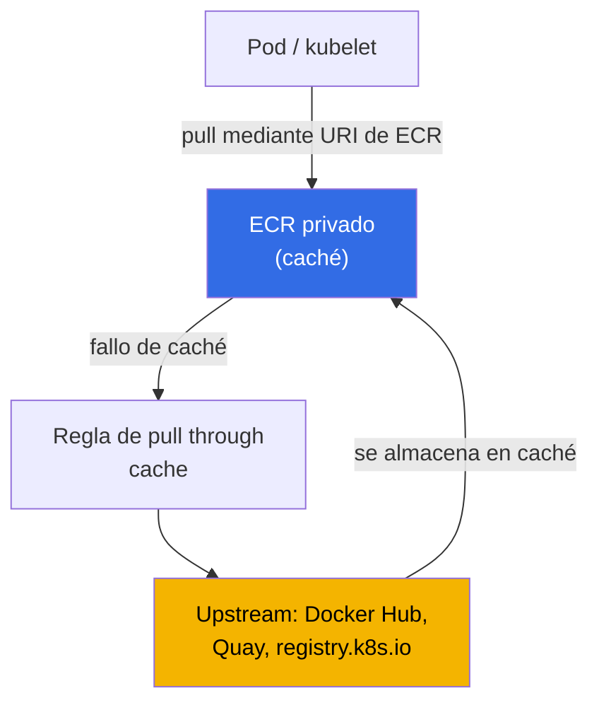
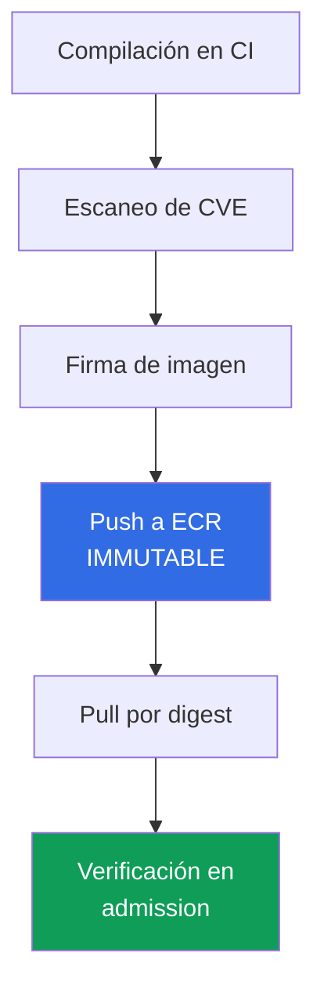

[Русская версия](ru.md) · [Eng version](en.md) · [Version française](fr.md) · [Deutsche Version](de.md) · [ქართული ვერსია](ge.md) · [繁體中文版](tw.md) · [日本語版](jp.md)
# Capítulo 20. Imágenes y supply chain: ECR, escaneo, firmas, pull through cache

> **Qué sigue.** La Parte 3 cubrió la identidad (capítulos 16-17), los secretos (capítulo 18) y el hardening
> del nodo, el pod y la red (capítulo 19). Este capítulo trata sobre lo que realmente se ejecuta en el clúster:
> de dónde procede una imagen, quién la verificó y si es la misma que compiló CI. Revisamos ECR como registro,
> el escaneo de vulnerabilidades, la integridad mediante digest y firmas, pull through cache y lifecycle policy.
> Los temas relacionados están en otros capítulos: el rol del nodo con permisos para pull desde ECR y la AMI como
> imagen del **nodo** (no confundir con la imagen de contenedor), capítulo 10; acceso de pods a AWS (IRSA,
> Pod Identity), capítulos 16-17; secretos dentro de las imágenes, capítulo 18; clúster privado y VPC endpoints,
> capítulo 19; verificación de firma y registro en admission (Kyverno, Gatekeeper), capítulo 22; auditoría,
> escaneo en runtime y GuardDuty, capítulo 21; estructura de cuentas y OU donde reside el registro compartido,
> capítulo 0.1.

## 20.1. «Una imagen con una CVE crítica llegó a producción porque nadie la escaneó»

La aplicación funciona y la guardia está tranquila, hasta el informe de seguridad: en producción se ejecuta una
imagen con una CVE crítica conocida cuyo parche salió hace medio año. CI compiló la imagen, la publicó y la
desplegó, pero entre la compilación y producción no hubo ninguna verificación. Nadie buscó la vulnerabilidad porque
no había con qué ni dónde buscarla. No es un fallo aislado, sino una clase de problemas de supply chain, la cadena
desde el código fuente hasta el contenedor en ejecución. Junto a ella existen problemas relacionados de la misma
naturaleza:

- **Rate limit e indisponibilidad del upstream.** La mitad de las imágenes se descarga directamente de Docker Hub.
  En hora punta llega un `429 Too Many Requests` (límite de pulls anónimos), los pods nuevos se quedan en
  `ImagePullBackOff` y el despliegue se detiene. El registro externo se convirtió en una dependencia de runtime.
- **Suplantación y typosquatting.** En el manifiesto aparece `image: mycompany/paymets:latest`, hay un error
  tipográfico en el nombre y se descarga una imagen ajena en lugar de la propia. O CI compiló una imagen y otra
  llegó a producción: no hay forma de demostrar que es el mismo artefacto, porque no tiene firma.
- **`latest` cambió bajo nuestros pies.** El despliegue apunta a `app:latest`. Alguien sobrescribió la etiqueta y,
  en el siguiente `pull`, el pod obtuvo otra imagen aunque el manifiesto no cambió. Es imposible reproducir qué se
  ejecutaba exactamente ayer: una etiqueta es un rótulo, no una versión fija.

Los cuatro problemas no se resuelven con una sola casilla, sino con una cadena construida: un registro que contiene
el artefacto, escaneo antes de producción, inmutabilidad de etiquetas y despliegue por digest, firma y su verificación.

## 20.2. ECR como registro

Amazon ECR (Elastic Container Registry) es un registro administrado de imágenes OCI. Hay dos tipos: repositorios
**privados** (dirección del registro `<account-id>.dkr.ecr.<region>.amazonaws.com`) y **públicos**
(`public.ecr.aws`). Cada cuenta en una región tiene su propio registry privado, dentro del que viven repositorios;
un repositorio almacena imágenes con etiquetas y digest.

La autenticación **no es un inicio de sesión con contraseña**, sino un token temporal mediante IAM.
`get-login-password` entrega un token de 12 horas con el que inicia sesión docker:

```bash
# inicio de sesión en el registro privado: token de 12 horas, el usuario siempre es AWS
aws ecr get-login-password --region eu-central-1 \
  | docker login --username AWS --password-stdin 111122223333.dkr.ecr.eu-central-1.amazonaws.com
```

El acceso se define mediante dos niveles de políticas. La **política IAM** del sujeto (quién puede hacer qué con ECR
en general) y la **repository policy**, una política basada en recursos para un repositorio específico (quién puede
hacer `pull`/`push` precisamente en él). Para acceso **cross-account** se configura una repository policy (o una
registry policy para todo el registry) que permite a otra cuenta descargar imágenes; así se construye un ECR común
en un entorno multicuentas (capítulo 0.1). Al nodo, el rol de nodo le concede permisos para `pull` con la política
`AmazonEC2ContainerRegistryReadOnly` (rol de nodo, capítulo 10), por lo que kubelet descarga la imagen sin
`imagePullSecrets`.

```bash
# crear un repositorio: etiquetas inmutables + escaneo al publicar + cifrado con una clave KMS propia
aws ecr create-repository --repository-name payments/api \
  --image-tag-mutability IMMUTABLE \
  --image-scanning-configuration scanOnPush=true \
  --encryption-configuration encryptionType=KMS,kmsKey=arn:aws:kms:eu-central-1:111122223333:key/abcd \
  --region eu-central-1
```

La elección clave al crearlo es la **mutabilidad de las etiquetas**. `MUTABLE` (predeterminado) permite sobrescribir
una etiqueta con otra imagen, de ahí el problema de que «`latest` cambió bajo nuestros pies». `IMMUTABLE` prohíbe
la sobrescritura: una etiqueta vinculada una vez a un digest queda fijada, y se rechaza un `push` posterior de la
misma etiqueta. Para producción se usa `IMMUTABLE`.

| Propiedad | `MUTABLE` | `IMMUTABLE` |
|---|---|---|
| Sobrescribir una etiqueta existente | permitido | prohibido |
| `latest` puede cambiar inadvertidamente | sí | no (la etiqueta está ocupada) |
| Reproducibilidad por etiqueta | sin garantía | etiqueta = digest concreto |
| Cuándo usarlo | sandbox, borradores | producción, imágenes de release |

### Un registro para toda la organización

Distribuir imágenes desde el registro de cada cuenta implica duplicar tanto el escaneo como lifecycle y las firmas.
Por eso, el esquema multicuentas habitual del capítulo 0.1 usa **un registro en la cuenta de servicios compartidos**,
donde CI hace push y los clústeres `prod`, `stage` y `dev` solo hacen pull. No es necesario conceder acceso cuenta
por cuenta: repository policy es una política normal basada en recursos, por lo que funcionan en ella las claves de
condición globales y el acceso se concede a toda la organización mediante `aws:PrincipalOrgID`.

```json
{
  "Version": "2012-10-17",
  "Statement": [{
    "Sid": "AllowPullFromOrg",
    "Effect": "Allow",
    "Principal": "*",
    "Action": ["ecr:BatchGetImage", "ecr:GetDownloadUrlForLayer"],
    "Condition": {"StringEquals": {"aws:PrincipalOrgID": "o-exampleorgid"}}
  }]
}
```

Una cuenta nueva que entra en la organización obtiene acceso automáticamente, y una que sale lo pierde sin editar
la política. Hay cuatro detalles que suelen causar problemas.

- **Repository policy no sustituye a la política IAM.** Para cross-account se necesitan ambos permisos: la política
  del repositorio y permisos en el lado que invoca. Además, `ecr:GetAuthorizationToken` es un permiso a nivel de
  cuenta, no se puede definir en la política del repositorio; a los nodos se lo concede la misma política administrada
  del rol de nodo (capítulo 10).
- **Regla para todo el registro, no para un repositorio.** En vez de una política en cada repositorio se usa una
  **registry policy**, que se aplica a todo el registry de la cuenta. Los repositorios que ECR crea por sí mismo
  (caché, replicación) se configuran mediante repository creation template (sección 20.5).
- **Clústeres privados.** El pull desde una cuenta ajena mediante interface endpoint funciona, pero el endpoint vive
  en la cuenta lectora y su endpoint policy debe permitir el recurso ajeno (capítulos 0.3 y 19), de lo contrario la
  imagen no se descarga aunque la política del repositorio sea correcta.
- **Región y tráfico.** Un clúster de otra región descarga las capas cruzando la frontera regional: esto implica tanto
  latencia al iniciar el pod como tráfico facturado. La respuesta es la **replicación del registro**: las reglas
  cross-region y cross-account copian las imágenes donde se descargan. Para replicación cross-account, la cuenta
  receptora aplica en su lado una registry policy con `ecr:CreateRepository` y `ecr:ReplicateImage` para la cuenta
  de origen, y solo se copian imágenes publicadas después de configurar la regla.

El coste de la centralización es real: el registro se convierte en una dependencia compartida con su propietario,
sus cuotas de API y su radio de impacto. Por eso producción suele mantener una réplica en su propia cuenta o región:
la fuente de verdad es una, pero no hay un único punto de fallo durante el despliegue.

La segunda configuración al crear, y **también inmutable después**, es el cifrado en reposo. De forma predeterminada,
las capas se cifran con claves de S3 (SSE-S3, AES-256, sin ninguna acción por su parte). Para controlar la clave se
configura `encryptionType=KMS`: una clave administrada por AWS `aws/ecr` o una customer managed key propia (debe
estar en la misma región que el repositorio). Como la mutabilidad, la configuración de cifrado no cambia después de
crear: solo recreando el repositorio.

## 20.3. Escaneo de vulnerabilidades

ECR puede buscar CVE conocidas en las imágenes. Hay dos modos, y se eligen para todo el registry, no para un
repositorio.

- **Basic scanning**: tecnología de ECR basada en la base de CVE, escanea **vulnerabilidades de paquetes del SO**.
  Dos frecuencias: manual y scan on push (al publicar). Los findings se obtienen con `DescribeImageScanFindings`.
- **Enhanced scanning**: integración con **Amazon Inspector**; escanea vulnerabilidades de **SO y paquetes de
  lenguajes de programación** (npm, pip, gem, etc.) y lo hace de forma **continua**. Cuando aparece una nueva CVE,
  los resultados de las imágenes ya almacenadas se actualizan solos, e Inspector envía un evento a EventBridge. Dos
  frecuencias: scan on push y continuous scan.

```bash
# activar basic scan on push a nivel de registry
aws ecr put-registry-scanning-configuration --scan-type BASIC \
  --rules '[{"scanFrequency":"SCAN_ON_PUSH","repositoryFilters":[{"filter":"*","filterType":"WILDCARD"}]}]'

# escaneo único de una imagen específica y ver findings por severity
aws ecr start-image-scan --repository-name payments/api --image-id imageTag=1.4.2
aws ecr describe-image-scan-findings --repository-name payments/api --image-id imageTag=1.4.2
```

Los findings llegan con severity (`CRITICAL`, `HIGH`, `MEDIUM`, etc.) y un enlace a la CVE. El escaneo por sí solo
no bloquea nada, es una señal. Para que una imagen con findings críticos **no llegue a producción**, se integra el
escaneo en el proceso: un gate en CI (no hacer push/no desplegar con `CRITICAL`) y una comprobación en admission
mediante una política (Kyverno o Gatekeeper, capítulo 22). ECR encuentra la vulnerabilidad, la política decide si
se permite esa imagen.

| Propiedad | Basic scanning | Enhanced scanning (Inspector) |
|---|---|---|
| Qué escanea | Paquetes del SO | SO + paquetes de lenguajes (npm, pip, ...) |
| Frecuencia | manual, scan on push | scan on push, continuo |
| Reevaluación ante CVE nuevas | no | sí, automáticamente |
| Notificaciones | - | evento en EventBridge |
| Cuándo usarlo | mínimo, sandbox | producción, control continuo |

Cambiar entre basic y enhanced reinicia los escaneos realizados anteriormente: habrá que configurarlos de nuevo (al
volver al tipo anterior, los resultados antiguos vuelven a estar disponibles).

## 20.4. Integridad de la imagen: digest, etiquetas y firmas

Una etiqueta es un rótulo móvil de una imagen. El verdadero identificador inmutable de una imagen es su **digest**:
el hash `sha256` del contenido. El mismo digest siempre apunta a la misma imagen; si cambia el contenido, cambia el
digest. De ahí la regla: desplegar en producción **por digest**, no por etiqueta.

```bash
# pull por digest: garantiza que es exactamente la imagen que compiló CI
docker pull 111122223333.dkr.ecr.eu-central-1.amazonaws.com/payments/api@sha256:9f2c...e41a
```

```yaml
# en el manifiesto del pod, una referencia por digest fija el contenido de la imagen de forma permanente
spec:
  containers:
    - name: api
      image: 111122223333.dkr.ecr.eu-central-1.amazonaws.com/payments/api@sha256:9f2c...e41a
```

Por qué `latest` es peligroso: es una etiqueta `MUTABLE` por definición, siempre es «la última» y cambia bajo
nuestros pies. Incluso una etiqueta fija `1.4.2` en un repositorio `MUTABLE` se puede sobrescribir. La combinación
fiable es: repositorio `IMMUTABLE` (la etiqueta no se puede sobrescribir) más despliegue por digest (referencia al
contenido, no al rótulo).

El digest protege contra una suplantación **accidental**, pero no demuestra **quién** compiló la imagen. Eso lo
resuelve la **firma**. La imagen se firma al compilarla (`cosign` del proyecto Sigstore o Notation/Notary Project;
AWS Signer como servicio administrado de firma), y al entrar en el clúster la firma se **verifica** en admission
mediante una regla Kyverno `verifyImages` o Sigstore policy-controller (capítulo 22). Solo una imagen con firma
válida de una clave de confianza puede ejecutarse; así se cierran la suplantación y el typosquatting de 20.1.

## 20.5. Pull through cache

Pull through cache resuelve el problema del rate limit de Docker Hub y la indisponibilidad del upstream. ECR
**almacena bajo demanda en caché las imágenes de un registro externo en su ECR privado**: se descarga una imagen
mediante el URI de su registry, ECR crea por sí mismo el repositorio en el primer acceso y almacena la imagen en
caché; en solicitudes posteriores por etiqueta, verifica el upstream para una versión nueva de esa etiqueta y
actualiza la caché no menos de **una vez cada 24 horas**.



Por qué usarlo en EKS:

- **Evita el rate limit de Docker Hub**: se descarga desde su ECR, no anónimamente desde Docker Hub.
- **Disponibilidad**: si el upstream cae, la imagen ya está en la caché.
- **Clúster privado sin salida a internet** (capítulo 19): los nodos solo acceden a ECR mediante VPC endpoints, no a
  internet para imágenes externas.
- **Un único punto de escaneo**: las imágenes en caché residen en su ECR y pasan por el mismo escaneo y las mismas
  políticas que las propias.

Upstreams admitidos (según la documentación de AWS): **sin autenticación**: Amazon ECR Public, Kubernetes registry
(`registry.k8s.io`) y Quay; **con autenticación** mediante un secreto de AWS Secrets Manager: Docker Hub, Microsoft
Azure Container Registry, GitHub Container Registry, GitLab (SaaS) y Chainguard; **Amazon ECR** (cross-account):
mediante un rol IAM.

```bash
# regla para Docker Hub: prefijo docker-hub, credenciales en Secrets Manager
aws ecr create-pull-through-cache-rule --ecr-repository-prefix docker-hub \
  --upstream-registry-url registry-1.docker.io \
  --credential-arn arn:aws:secretsmanager:eu-central-1:111122223333:secret:ecr-pullthroughcache/dh
```

Después se hace referencia a la imagen mediante el URI de su registry con el prefijo de la regla:

```yaml
# antes docker.io/library/nginx:1.27; ahora mediante la caché de ECR
image: 111122223333.dkr.ecr.eu-central-1.amazonaws.com/docker-hub/library/nginx:1.27
```

Un detalle: los repositorios que ECR crea por sí mismo para la caché llevan por defecto etiquetas `MUTABLE`, cifrado
SSE-S3 y ninguna lifecycle policy; las configuraciones de 20.2 y 20.6 no se les aplican automáticamente. Para que
los repositorios de caché hereden la clave KMS, la limpieza automática y la inmutabilidad de etiquetas, se crea un
**repository creation template** con el mismo prefijo que la regla de caché:

```bash
# plantilla para el prefijo docker-hub: los repositorios de caché recibirán clave KMS y lifecycle policy
aws ecr create-repository-creation-template --prefix docker-hub --applied-for PULL_THROUGH_CACHE \
  --encryption-configuration encryptionType=KMS,kmsKey=arn:aws:kms:eu-central-1:111122223333:key/abcd \
  --lifecycle-policy file://lifecycle.json
```

La plantilla solo se aplica al crear el repositorio, y mediante ella también se definen repository policy e
inmutabilidad de etiquetas (con excepciones para etiquetas móviles de caché como `latest`).

## 20.6. Lifecycle policy: limpieza automática del repositorio

Sin limpieza, el repositorio crece indefinidamente: se acumulan etiquetas antiguas y capas sin etiqueta, y con ellas
imágenes vulnerables antiguas que alguien todavía podría desplegar. **Lifecycle policy** define reglas de eliminación
automática por antigüedad o cantidad de imágenes.

```bash
# conservar las 10 últimas imágenes con etiqueta v, eliminar el resto
aws ecr put-lifecycle-policy --repository-name payments/api --lifecycle-policy-text '{
  "rules": [{
    "rulePriority": 1,
    "description": "keep last 10 tagged",
    "selection": {"tagStatus":"tagged","tagPrefixList":["v"],"countType":"imageCountMoreThan","countNumber":10},
    "action": {"type": "expire"}
  }]
}'
```

Las reglas típicas eliminan imágenes untagged de más de N días o almacenan como máximo N imágenes por prefijo de
etiqueta. Esto ahorra almacenamiento y reduce el riesgo de levantar una imagen vulnerable antigua desde el
repositorio. Las reglas se expresan con `tagStatus` (`tagged`/`untagged`/`any`) y `countType` por antigüedad
(`sinceImagePushed`) o cantidad (`imageCountMoreThan`).

## 20.7. Clúster privado e imágenes

En un clúster privado (capítulo 19), los nodos sin salida a internet descargan imágenes de ECR **solo mediante VPC
endpoints**. Para `pull` se necesitan tres: los endpoints de interfaz `ecr.api` (llamadas a la API de ECR, incluida
la autenticación) y `ecr.dkr` (el protocolo docker para pull), y el **gateway endpoint `s3`**, porque **las capas de
las imágenes residen físicamente en S3**. Sin el endpoint S3, existen `ecr.api` y `ecr.dkr`, pero la imagen sigue sin
descargarse: las capas no llegan. Es la misma tabla de endpoints del capítulo 19; aquí importa que el pull de una
imagen depende de la combinación ECR + S3, y pull through cache en ese clúster se convierte en la única forma de
alcanzar imágenes externas sin abrir internet a los nodos.

## 20.8. Supply chain como cadena

Las técnicas individuales forman una única cadena desde la compilación hasta la ejecución. Una ruptura en cualquier
eslabón invalida los demás.



| Eslabón | Qué proporciona | Dónde está la ruptura |
|---|---|---|
| Escaneo de CVE | vulnerabilidades conocidas visibles antes de producción | la imagen no se escanea en absoluto |
| Push a ECR `IMMUTABLE` | la etiqueta no se puede sobrescribir | `MUTABLE`: la etiqueta cambió bajo nuestros pies |
| Pull por digest | se ejecuta exactamente el artefacto compilado | despliegue por `latest`/etiqueta |
| Verificación de firma en admission | solo se admite una imagen de confianza | no se verifica la firma |

Se lee así: CI compila la imagen, la escanea (20.3), la firma (20.4), hace push a ECR `IMMUTABLE` (20.2), el
clúster la descarga por digest y la política de admission (capítulo 22) verifica la firma y el origen. Una imagen sin
escanear, una etiqueta `MUTABLE`, desplegar por `latest` o no verificar la firma son puntos donde la cadena se rompe
y regresan los problemas de 20.1.

## 20.9. Cómo se aplica en producción

- **Enhanced scanning para todo el registry.** El escaneo continuo de Inspector detecta CVE surgidas incluso después
  del push y envía un evento a EventBridge, en vez de comprobar la imagen una única vez al publicar.
- **Etiquetas inmutables y despliegue por digest.** Los repositorios se crean con `IMMUTABLE`, y las cargas apuntan a
  la imagen mediante `@sha256:`: no se puede sobrescribir la etiqueta y se ejecuta exactamente lo compilado.
- **Pull through cache en lugar de Docker Hub directo.** Las imágenes externas se descargan mediante la caché de
  ECR: no hay dependencia del rate limit ni de la disponibilidad del upstream, y todo pasa por un escaneo y unas
  políticas unificados. La configuración de los repositorios de caché (KMS, lifecycle, immutability) se aplica con
  repository creation template según el prefijo de la regla.
- **Lifecycle policy en cada repositorio.** La limpieza automática de imágenes antiguas y untagged mantiene el tamaño
  del repositorio y evita levantar una imagen vulnerable muy antigua.
- **Firma y su verificación en admission.** Las imágenes se firman en CI (cosign, Notation, AWS Signer), y al entrar
  en el clúster una política (capítulo 22) permite solo las firmadas válidamente.
- **Cross-account mediante ECR compartido.** En un entorno multicuentas (capítulo 0.1), las imágenes se mantienen en
  un registry con repository policy para acceso desde otras cuentas, en vez de duplicarlas por cuenta.

## 20.10. Mini glosario

- **ECR**: registro administrado de imágenes OCI de AWS; registry privado por cuenta-región con dirección
  `<account-id>.dkr.ecr.<region>.amazonaws.com` y el público `public.ecr.aws`.
- **Digest**: hash `sha256` del contenido de la imagen, identificador inmutable; el despliegue por digest garantiza
  ejecutar exactamente el artefacto compilado, a diferencia de una etiqueta móvil.
- **Tag immutability**: modo de repositorio `IMMUTABLE` que prohíbe sobrescribir una etiqueta con otra imagen;
  `MUTABLE` (predeterminado) permite la sobrescritura.
- **Basic / Enhanced scanning**: modos para buscar CVE en ECR: basic para paquetes del SO de forma nativa; enhanced
  para SO y paquetes de lenguajes mediante Amazon Inspector, de forma continua.
- **Pull through cache**: regla de ECR que almacena bajo demanda imágenes de un registro externo (Docker Hub, Quay,
  `registry.k8s.io`, etc.) en su ECR privado.
- **Lifecycle policy**: reglas para eliminar automáticamente imágenes según antigüedad o cantidad.
- **Repository policy y registry policy**: políticas basadas en recursos para un repositorio y para todo el registry
  de una cuenta; `aws:PrincipalOrgID` funciona en ellas, por lo que se puede conceder pull a toda la organización sin
  enumerar cuentas. `ecr:GetAuthorizationToken` no se define en ellas, es un permiso a nivel de cuenta en la política
  IAM del invocador.
- **Replication configuration**: reglas de ECR que copian imágenes a otras regiones y cuentas; para cross-account,
  la cuenta receptora permite al origen `ecr:CreateRepository` y `ecr:ReplicateImage` en su registry policy.
- **Repository creation template**: plantilla de configuración (cifrado, lifecycle, immutability, policy) para
  repositorios que ECR crea por sí mismo para pull through cache según el prefijo; sin ella, el repositorio de caché
  recibe los valores predeterminados (`MUTABLE`, SSE-S3, sin políticas).
- **Encryption at rest**: cifrado de capas en ECR: SSE-S3 (AES-256) por defecto y, opcionalmente, SSE-KMS con la
  clave `aws/ecr` o una customer managed key propia; se define al crear y es inmutable.

## 20.11. Resumen del capítulo

- Los problemas de supply chain (CVE sin escanear en producción, rate limit de Docker Hub, suplantación de imagen,
  cambio de `latest`) se resuelven con una cadena: registro, escaneo, inmutabilidad, digest y firma.
- ECR es un registry privado por cuenta-región; la autenticación es mediante token IAM (`get-login-password`), no
  contraseña. El acceso es IAM más repository policy, y cross-account se logra mediante repository/registry policy.
  Al nodo, el rol de nodo le concede pull (capítulo 10).
- La mutabilidad de etiquetas es una elección clave: `IMMUTABLE` fija el vínculo etiqueta-digest, mientras `MUTABLE`
  permite que `latest` cambie bajo nuestros pies. Para producción: `IMMUTABLE` y despliegue mediante `@sha256:`.
- Escaneo: basic (paquetes del SO, manual/scan on push) y enhanced (SO + lenguajes, continuo, Inspector, eventos en
  EventBridge). Por sí solo no bloquea: decide la política de admission (capítulo 22).
- Integridad: digest protege contra suplantación; firma (cosign, Notation, AWS Signer) contra suplantación maliciosa;
  una política Kyverno/Gatekeeper verifica la firma al entrar en el clúster (capítulo 22).
- Pull through cache almacena imágenes externas en ECR (evita rate limit, aporta disponibilidad, clúster privado y
  escaneo unificado). Lifecycle policy limpia lo antiguo. Pull en clúster privado usa `ecr.api`, `ecr.dkr` y endpoint
  S3 (las capas están en S3, capítulo 19).

## 20.12. Cómo será útil en el trabajo real

La pregunta «¿es esta la misma imagen que compiló CI?» se responde con el propio manifiesto mediante despliegue por
digest y verificación de firma, no mediante una investigación. El incidente «el despliegue se detuvo, `ImagePullBackOff`
por el rate limit de Docker Hub» no ocurre donde las imágenes pasan por pull through cache hacia ECR. Durante la
guardia, «hay una CVE crítica en producción» deja de ser un informe a posteriori y se convierte en un bloqueo en
admission, porque enhanced scanning la detectó y la política no la permitió. Y un repositorio `IMMUTABLE` y el digest
eliminan toda una clase de «ayer funcionaba, hoy es otra imagen»: la etiqueta ya no es un rótulo que cambia bajo
nuestros pies.

## 20.13. Preguntas de autoevaluación

1. ¿Qué cuatro problemas de supply chain se enumeran en 20.1 y qué eslabón de la cadena resuelve cada uno?
2. ¿Cómo es la dirección de un registro ECR privado y en qué se diferencia la autenticación de ECR de una contraseña?
3. ¿Qué dos políticas gestionan el acceso a un repositorio y cómo se concede pull cross-account?
4. ¿Quién concede al nodo el derecho a descargar imágenes de ECR sin `imagePullSecrets` y mediante qué mecanismo?
5. ¿En qué se diferencia un repositorio `IMMUTABLE` de uno `MUTABLE` y por qué se usa el primero para producción?
6. ¿En qué se diferencia basic scanning de enhanced y qué aporta la integración con Amazon Inspector?
7. ¿El escaneo por sí solo bloquea el despliegue de una imagen vulnerable? Si no, ¿qué lo bloquea y dónde?
8. ¿Por qué el despliegue por digest es más fiable que el despliegue por etiqueta y en qué se diferencia digest de una etiqueta?
9. ¿Contra qué protege un digest y contra qué una firma, y dónde se verifica la firma?
10. ¿Qué hace pull through cache y qué upstreams requieren autenticación y cuáles no?
11. ¿Para qué sirve pull through cache en un clúster privado sin salida a internet?
12. ¿Para qué se necesita lifecycle policy y según qué criterios elimina imágenes?
13. ¿Por qué un clúster privado necesita además un S3 VPC endpoint para pull de una imagen, no solo ECR?
14. ¿En qué se diferencia el cifrado predeterminado de ECR de SSE-KMS y cuándo ya no se puede cambiar la configuración?
15. ¿Qué configuraciones reciben por defecto los repositorios de caché y con qué se les asignan KMS y lifecycle?
16. ¿Cómo se concede pull desde un registro a toda la organización de una vez y por qué una repository policy sola no basta para cross-account?
17. Un clúster de otra región descarga imágenes de un registro compartido. ¿Qué cambiaría y qué permisos necesita la cuenta receptora?

## Práctica

El laboratorio del curso para este tema: [laboratorio 130: ECR y supply chain, etiquetas inmutables, escaneo al
publicar, pull through cache](../../labs/130/README_ES.MD). Incluye un repositorio con `IMMUTABLE` y `scanOnPush`,
el rechazo del registro a un push repetido de una etiqueta, revisión de findings y límites de aplicabilidad del
escáner, despliegue por digest desde un ECR privado y dos pull through cache, sin autenticación y con secreto. El
resultado se verifica con el comando `check_result`.

A continuación, haga lo mismo en su propia cuenta. Cree un repositorio con `--image-tag-mutability IMMUTABLE` y
`--image-scanning-configuration scanOnPush=true`, inicie sesión mediante `aws ecr get-login-password | docker login`,
haga push de una imagen y consulte los findings: `aws ecr describe-image-scan-findings --repository-name <repo>
--image-id imageTag=<tag>`. Intente sobrescribir la etiqueta: `IMMUTABLE` rechazará el push. Obtenga el digest de la
imagen (`aws ecr describe-images ... --query 'imageDetails[].imageDigest'`) y despliegue el pod por `@sha256:` en
lugar de la etiqueta.

Después, pull through cache: `aws ecr create-pull-through-cache-rule` para Quay o `registry.k8s.io` (sin secreto),
o para Docker Hub (con un secreto en Secrets Manager); luego descargue una imagen mediante el URI de su registry con
el prefijo de la regla y compruebe que apareció un repositorio en caché en ECR. Aplique lifecycle policy con
`aws ecr put-lifecycle-policy` y compruebe la vista previa de eliminación con
`aws ecr get-lifecycle-policy-preview`. Deje la verificación de firma en admission para el capítulo 22.

---
[Índice](../README_ES.md) · [Capítulo 19](../19/es.md) · [Capítulo 21](../21/es.md)
