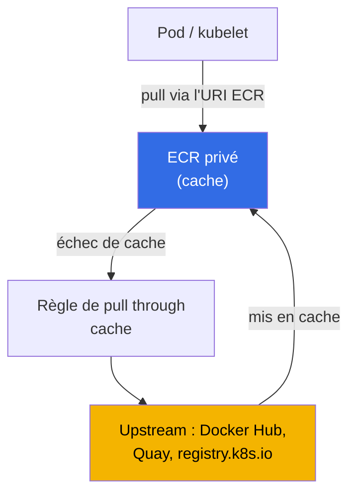
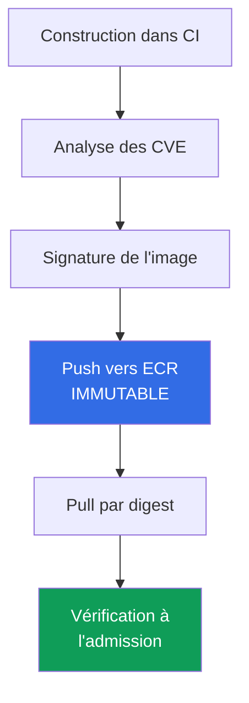

[English version](en.md) · [Русская версия](ru.md) · [Versión en español](es.md) · [Deutsche Version](de.md) · [ქართული ვერსია](ge.md) · [繁體中文版](tw.md) · [日本語版](jp.md)
# Chapitre 20. Images et chaîne d'approvisionnement : ECR, analyse, signatures, pull through cache

> **La suite.** La partie 3 a couvert l'identité (chapitres 16-17), les secrets (chapitre 18) et le durcissement
> du nœud, du pod et du réseau (chapitre 19). Ce chapitre traite de ce qui s'exécute réellement dans le cluster :
> d'où vient une image, qui l'a vérifiée et si elle correspond bien à celle construite par CI. Nous examinons ECR
> comme registre, l'analyse des vulnérabilités, l'intégrité par digest et signatures, pull through cache et
> lifecycle policy. Les sujets connexes sont dans d'autres chapitres : le rôle du nœud avec les droits de pull
> depuis ECR et l'AMI en tant qu'image du **nœud** (à ne pas confondre avec l'image de conteneur), chapitre 10 ;
> l'accès des pods à AWS (IRSA, Pod Identity), chapitres 16-17 ; les secrets dans les images, chapitre 18 ; le
> cluster privé et les VPC endpoints, chapitre 19 ; la vérification de signature et du registre à l'admission
> (Kyverno, Gatekeeper), chapitre 22 ; l'audit, l'analyse au runtime et GuardDuty, chapitre 21 ; la structure des
> comptes et l'OU qui héberge le registre partagé, chapitre 0.1.

## 20.1. « Une image avec une CVE critique est arrivée en production parce que personne ne l'a analysée »

L'application fonctionne et l'astreinte est calme, jusqu'au rapport de sécurité : une image avec une CVE critique
connue, dont le correctif est sorti il y a six mois, tourne en production. CI a construit l'image, l'a poussée et
l'a déployée, mais il n'y a eu aucune vérification entre la construction et la production. Personne n'a recherché la
vulnérabilité, car il n'y avait ni outil ni endroit où la chercher. Ce n'est pas une panne isolée, mais une classe de
problèmes de chaîne d'approvisionnement, celle qui va du code source au conteneur en cours d'exécution. Des problèmes
apparentés de même nature existent à ses côtés :

- **Rate limit et indisponibilité de l'upstream.** La moitié des images est tirée directement depuis Docker Hub. Aux
  heures de pointe, un `429 Too Many Requests` arrive (limite des pulls anonymes), les nouveaux pods restent dans
  `ImagePullBackOff` et le déploiement s'arrête. Le registre externe est devenu une dépendance au runtime.
- **Substitution et typosquatting.** Le manifeste contient `image: mycompany/paymets:latest`, une faute de frappe dans
  le nom, et une image étrangère est tirée à la place de la vôtre. Ou CI a construit une image et une autre est
  arrivée en production : il est impossible de prouver qu'il s'agit du même artefact, faute de signature.
- **`latest` a changé sans prévenir.** Le déploiement référence `app:latest`. Quelqu'un a réécrit le tag et, au pull
  suivant, le pod a obtenu une autre image alors que le manifeste n'avait pas changé. Il est impossible de reproduire
  précisément ce qui s'exécutait hier : un tag est une étiquette, pas une version fixe.

Ces quatre problèmes ne se résolvent pas avec une seule case à cocher, mais avec une chaîne organisée : un registre
qui contient l'artefact, une analyse avant la production, l'immuabilité des tags et le déploiement par digest, une
signature et sa vérification.

## 20.2. ECR comme registre

Amazon ECR (Elastic Container Registry) est un registre géré d'images OCI. Il existe deux types : les référentiels
**privés** (adresse du registre `<account-id>.dkr.ecr.<region>.amazonaws.com`) et les référentiels **publics**
(`public.ecr.aws`). Chaque compte d'une région possède son propre registry privé, qui contient des référentiels ; un
référentiel stocke des images avec des tags et des digests.

L'authentification **n'est pas une connexion par mot de passe**, mais un token temporaire via IAM.
`get-login-password` fournit un token de 12 heures avec lequel docker se connecte :

```bash
# connexion au registre privé : token de 12 heures, l'utilisateur est toujours AWS
aws ecr get-login-password --region eu-central-1 \
  | docker login --username AWS --password-stdin 111122223333.dkr.ecr.eu-central-1.amazonaws.com
```

L'accès est défini par deux niveaux de politiques. La **politique IAM** du sujet (qui peut faire quoi avec ECR en
général) et la **repository policy**, une politique basée sur les ressources pour un référentiel spécifique (qui peut
faire `pull`/`push` précisément sur celui-ci). Pour un accès **cross-account**, on configure une repository policy
(ou une registry policy pour tout le registry) qui permet à un autre compte de tirer les images ; c'est ainsi qu'un
ECR partagé se construit dans un environnement multi-comptes (chapitre 0.1). Pour le `pull`, le rôle du nœud reçoit
les droits via la politique `AmazonEC2ContainerRegistryReadOnly` (rôle du nœud, chapitre 10), donc kubelet tire
l'image sans `imagePullSecrets`.

```bash
# créer un référentiel : tags immuables + analyse au push + chiffrement avec une clé KMS propre
aws ecr create-repository --repository-name payments/api \
  --image-tag-mutability IMMUTABLE \
  --image-scanning-configuration scanOnPush=true \
  --encryption-configuration encryptionType=KMS,kmsKey=arn:aws:kms:eu-central-1:111122223333:key/abcd \
  --region eu-central-1
```

Le choix principal à la création est la **mutabilité des tags**. `MUTABLE` (valeur par défaut) permet d'écraser un
tag avec une autre image, d'où le problème de « `latest` a changé sans prévenir ». `IMMUTABLE` interdit l'écrasement :
un tag déjà associé à un digest est figé et un `push` ultérieur du même tag est rejeté. En production, on utilise
`IMMUTABLE`.

| Propriété | `MUTABLE` | `IMMUTABLE` |
|---|---|---|
| Écraser un tag existant | autorisé | interdit |
| `latest` peut changer par inadvertance | oui | non (le tag est occupé) |
| Reproductibilité par tag | sans garantie | tag = digest précis |
| Cas d'usage | sandbox, brouillons | production, images de release |

### Un registre pour toute l'organisation

Distribuer des images depuis le registre de chaque compte revient à dupliquer l'analyse, le lifecycle et les
signatures. Le modèle multi-comptes courant du chapitre 0.1 utilise donc **un registre dans le compte des services
partagés**, où CI fait les push et dont les clusters `prod`, `stage` et `dev` font seulement les pull. Il n'est pas
nécessaire d'accorder l'accès compte par compte : une repository policy est une politique standard basée sur les
ressources, les clés de condition globales y fonctionnent donc, et l'accès peut être accordé à toute l'organisation
via `aws:PrincipalOrgID`.

```json
{
  "Version": "2012-10-17",
  "Statement": [{
    "Sid": "AllowPullFromOrg",
    "Effect": "Allow",
    "Principal": "*",
    "Action": ["ecr:BatchGetImage", "ecr:GetDownloadUrlForLayer"],
    "Condition": {"StringEquals": {"aws:PrincipalOrgID": "o-exampleorgid"}}
  }]
}
```

Un nouveau compte qui entre dans l'organisation reçoit automatiquement l'accès, et un compte qui la quitte le perd
sans modifier la politique. Quatre détails causent fréquemment des problèmes.

- **Une repository policy ne remplace pas la politique IAM.** Pour le cross-account, les deux autorisations sont
  nécessaires : la politique du référentiel et les droits du côté appelant. De plus, `ecr:GetAuthorizationToken` est
  une autorisation au niveau du compte, qui ne peut pas être définie dans la politique du référentiel ; les nœuds EKS
  l'obtiennent via la même politique gérée du rôle du nœud (chapitre 10).
- **Règle pour tout le registre, non pour un référentiel.** Plutôt qu'une politique par référentiel, on utilise une
  **registry policy**, qui s'applique à tout le registry du compte. Les référentiels qu'ECR crée lui-même (cache,
  réplication) sont configurés au moyen d'un repository creation template (section 20.5).
- **Clusters privés.** Un pull depuis un compte externe à travers un interface endpoint fonctionne, mais l'endpoint
  réside dans le compte lecteur et son endpoint policy doit autoriser la ressource externe (chapitres 0.3 et 19),
  sinon l'image ne se télécharge pas même si la politique du référentiel est correcte.
- **Région et trafic.** Un cluster situé dans une autre région tire les couches au-delà de la frontière régionale :
  cela ajoute de la latence au démarrage du pod et du trafic facturé. La réponse est la **réplication du registre** :
  les règles cross-region et cross-account copient les images là où elles sont tirées. Pour une réplication
  cross-account, le compte destinataire applique de son côté une registry policy avec `ecr:CreateRepository` et
  `ecr:ReplicateImage` pour le compte source, et seules les images poussées après la configuration de la règle sont
  copiées.

Le coût de la centralisation est réel : le registre devient une dépendance partagée, avec son propriétaire, ses
quotas d'API et son rayon d'impact. C'est pourquoi la production conserve souvent une réplique dans son propre compte
ou sa région : la source de vérité est unique, mais le déploiement n'a pas un point de défaillance unique.

La deuxième configuration à la création, **également immuable par la suite**, est le chiffrement au repos. Par
défaut, les couches sont chiffrées avec des clés S3 (SSE-S3, AES-256, sans action de votre part). Pour contrôler la
clé, configurez `encryptionType=KMS` : une clé gérée par AWS `aws/ecr` ou votre propre customer managed key (elle
doit être dans la même région que le référentiel). Comme la mutabilité, la configuration de chiffrement ne peut plus
être modifiée après la création : il faut recréer le référentiel.

## 20.3. Analyse des vulnérabilités

ECR peut rechercher les CVE connues dans les images. Il existe deux modes, et ils sont choisis pour tout le registry,
pas pour un seul référentiel.

- **Basic scanning** : technologie ECR basée sur la base de CVE, qui analyse les **vulnérabilités des paquets de
  l'OS**. Deux fréquences : manuelle et scan on push (à la publication). Les findings sont obtenus avec
  `DescribeImageScanFindings`.
- **Enhanced scanning** : intégration à **Amazon Inspector** ; analyse les vulnérabilités des **paquets de l'OS et
  des langages de programmation** (npm, pip, gem, etc.) et le fait de manière **continue**. Lorsqu'une nouvelle CVE
  apparaît, les résultats pour les images déjà stockées sont mis à jour automatiquement, et Inspector envoie un
  événement à EventBridge. Deux fréquences : scan on push et continuous scan.

```bash
# activer basic scan on push au niveau du registry
aws ecr put-registry-scanning-configuration --scan-type BASIC \
  --rules '[{"scanFrequency":"SCAN_ON_PUSH","repositoryFilters":[{"filter":"*","filterType":"WILDCARD"}]}]'

# analyse unique d'une image spécifique et affichage des findings par severity
aws ecr start-image-scan --repository-name payments/api --image-id imageTag=1.4.2
aws ecr describe-image-scan-findings --repository-name payments/api --image-id imageTag=1.4.2
```

Les findings incluent une severity (`CRITICAL`, `HIGH`, `MEDIUM`, etc.) et un lien vers la CVE. L'analyse seule ne
bloque rien, elle n'est qu'un signal. Pour qu'une image avec des findings critiques **n'arrive pas en production**,
on intègre l'analyse au processus : un gate dans CI (ne pas pousser/ne pas déployer avec `CRITICAL`) et une
vérification à l'admission par une politique (Kyverno ou Gatekeeper, chapitre 22). ECR trouve la vulnérabilité, la
politique décide si cette image est admise.

| Propriété | Basic scanning | Enhanced scanning (Inspector) |
|---|---|---|
| Ce qui est analysé | Paquets de l'OS | OS + paquets de langages (npm, pip, ...) |
| Fréquence | manuelle, scan on push | scan on push, continu |
| Réévaluation lors de nouvelles CVE | non | oui, automatiquement |
| Notifications | - | événement dans EventBridge |
| Cas d'usage | minimum, sandbox | production, contrôle continu |

Passer de basic à enhanced, ou inversement, réinitialise les analyses précédemment effectuées : elles devront être
configurées à nouveau (en revenant au type précédent, les anciens résultats redeviennent disponibles).

## 20.4. Intégrité de l'image : digest, tags et signatures

Un tag est une étiquette mobile pour une image. Le véritable identifiant immuable d'une image est son **digest** : le
hash `sha256` du contenu. Un même digest pointe toujours vers la même image ; si le contenu change, le digest change.
D'où la règle : déployer en production **par digest**, pas par tag.

```bash
# pull par digest : garantit qu'il s'agit exactement de l'image construite par CI
docker pull 111122223333.dkr.ecr.eu-central-1.amazonaws.com/payments/api@sha256:9f2c...e41a
```

```yaml
# dans le manifeste du pod, une référence par digest fixe définitivement le contenu de l'image
spec:
  containers:
    - name: api
      image: 111122223333.dkr.ecr.eu-central-1.amazonaws.com/payments/api@sha256:9f2c...e41a
```

Pourquoi `latest` est dangereux : c'est un tag `MUTABLE` par définition, toujours « le dernier », qui peut changer
sans prévenir. Même un tag fixe `1.4.2` dans un référentiel `MUTABLE` peut être écrasé. La combinaison fiable est :
un référentiel `IMMUTABLE` (le tag ne peut pas être écrasé) et un déploiement par digest (une référence au contenu,
non à l'étiquette).

Le digest protège contre une substitution **accidentelle**, mais ne démontre pas **qui** a construit l'image. La
**signature** résout ce problème. L'image est signée lors de sa construction (`cosign` du projet Sigstore ou
Notation/Notary Project ; AWS Signer comme service géré de signature) et, à son entrée dans le cluster, la signature
est **vérifiée** à l'admission par une règle Kyverno `verifyImages` ou Sigstore policy-controller (chapitre 22).
Seule une image ayant une signature valide d'une clé de confiance peut s'exécuter ; cela élimine la substitution et
le typosquatting de 20.1.

## 20.5. Pull through cache

Pull through cache résout les problèmes de rate limit Docker Hub et d'indisponibilité de l'upstream. ECR **met en
cache à la demande les images d'un registre externe dans votre ECR privé** : une image est tirée à l'aide de l'URI de
votre registry, ECR crée lui-même le référentiel au premier accès et met l'image en cache ; lors des requêtes
ultérieures par tag, il vérifie l'upstream pour une nouvelle version de ce tag et actualise le cache au moins **une
fois toutes les 24 heures**.



Pourquoi l'utiliser dans EKS :

- **Évite le rate limit de Docker Hub** : l'image est tirée depuis votre ECR, pas anonymement depuis Docker Hub.
- **Disponibilité** : si l'upstream est indisponible, l'image est déjà dans le cache.
- **Cluster privé sans accès Internet** (chapitre 19) : les nœuds accèdent uniquement à ECR via des VPC endpoints,
  pas à Internet pour les images externes.
- **Point d'analyse unique** : les images en cache résident dans votre ECR et sont soumises à la même analyse et aux
  mêmes politiques que vos propres images.

Upstreams pris en charge (selon la documentation AWS) : **sans authentification** : Amazon ECR Public, Kubernetes
registry (`registry.k8s.io`) et Quay ; **avec authentification** via un secret AWS Secrets Manager : Docker Hub,
Microsoft Azure Container Registry, GitHub Container Registry, GitLab (SaaS) et Chainguard ; **Amazon ECR**
(cross-account) : via un rôle IAM.

```bash
# règle pour Docker Hub : préfixe docker-hub, identifiants dans Secrets Manager
aws ecr create-pull-through-cache-rule --ecr-repository-prefix docker-hub \
  --upstream-registry-url registry-1.docker.io \
  --credential-arn arn:aws:secretsmanager:eu-central-1:111122223333:secret:ecr-pullthroughcache/dh
```

L'image est ensuite référencée par l'URI de votre registry avec le préfixe de la règle :

```yaml
# avant docker.io/library/nginx:1.27 ; maintenant via le cache ECR
image: 111122223333.dkr.ecr.eu-central-1.amazonaws.com/docker-hub/library/nginx:1.27
```

Un détail : les référentiels créés automatiquement par ECR pour le cache reçoivent par défaut des tags `MUTABLE`, un
chiffrement SSE-S3 et aucune lifecycle policy ; les configurations de 20.2 et 20.6 ne leur sont pas appliquées
automatiquement. Pour que les référentiels de cache héritent de la clé KMS, du nettoyage automatique et de
l'immuabilité des tags, on crée un **repository creation template** avec le même préfixe que la règle de cache :

```bash
# modèle pour le préfixe docker-hub : les référentiels de cache recevront une clé KMS et une lifecycle policy
aws ecr create-repository-creation-template --prefix docker-hub --applied-for PULL_THROUGH_CACHE \
  --encryption-configuration encryptionType=KMS,kmsKey=arn:aws:kms:eu-central-1:111122223333:key/abcd \
  --lifecycle-policy file://lifecycle.json
```

Le modèle s'applique uniquement lors de la création du référentiel ; il permet aussi de définir la repository policy
et l'immuabilité des tags (avec des exceptions pour les tags de cache mobiles tels que `latest`).

## 20.6. Lifecycle policy : nettoyage automatique du référentiel

Sans nettoyage, le référentiel croît indéfiniment : les anciens tags et les couches sans tag s'accumulent, ainsi que
d'anciennes images vulnérables que quelqu'un pourrait encore déployer. Une **lifecycle policy** définit des règles de
suppression automatique selon l'âge ou le nombre d'images.

```bash
# conserver les 10 dernières images avec un tag v, supprimer les autres
aws ecr put-lifecycle-policy --repository-name payments/api --lifecycle-policy-text '{
  "rules": [{
    "rulePriority": 1,
    "description": "keep last 10 tagged",
    "selection": {"tagStatus":"tagged","tagPrefixList":["v"],"countType":"imageCountMoreThan","countNumber":10},
    "action": {"type": "expire"}
  }]
}'
```

Les règles typiques suppriment les images untagged de plus de N jours ou conservent au maximum N images par préfixe
de tag. Cela économise du stockage et réduit le risque qu'une ancienne image vulnérable soit démarrée depuis le
référentiel. Les règles utilisent `tagStatus` (`tagged`/`untagged`/`any`) et `countType`, selon l'âge
(`sinceImagePushed`) ou le nombre (`imageCountMoreThan`).

## 20.7. Cluster privé et images

Dans un cluster privé (chapitre 19), les nœuds sans accès Internet tirent les images d'ECR **uniquement via des VPC
endpoints**. Trois endpoints sont requis pour le `pull` : les interface endpoints `ecr.api` (appels à l'API ECR, y
compris l'authentification) et `ecr.dkr` (le protocole docker de pull), ainsi que le **gateway endpoint `s3`**, car
**les couches d'images résident physiquement dans S3**. Sans endpoint S3, `ecr.api` et `ecr.dkr` existent, mais
l'image ne se télécharge toujours pas : les couches n'arrivent pas. C'est le même tableau d'endpoints qu'au chapitre
19 ; ici, l'essentiel est que le pull d'une image dépend de l'ensemble ECR + S3, et pull through cache devient dans
ce cluster le seul moyen d'atteindre les images externes sans ouvrir Internet aux nœuds.

## 20.8. La chaîne d'approvisionnement comme chaîne

Les techniques individuelles forment une chaîne unique, de la construction à l'exécution. Une rupture dans n'importe
quel maillon annule les autres.



| Maillon | Ce qu'il apporte | Où se situe la rupture |
|---|---|---|
| Analyse des CVE | vulnérabilités connues visibles avant la production | l'image n'est pas analysée du tout |
| Push vers ECR `IMMUTABLE` | le tag ne peut pas être écrasé | `MUTABLE` : le tag a changé sans prévenir |
| Pull par digest | l'artefact construit est exactement celui qui s'exécute | déploiement par `latest`/tag |
| Vérification de signature à l'admission | seule une image de confiance est admise | la signature n'est pas vérifiée |

Cela se lit ainsi : CI construit l'image, l'analyse (20.3), la signe (20.4), la pousse dans ECR `IMMUTABLE` (20.2),
le cluster la tire par digest et la politique d'admission (chapitre 22) vérifie la signature et l'origine. Une image
non analysée, un tag `MUTABLE`, un déploiement par `latest` ou l'absence de vérification de signature sont les points
où la chaîne se rompt et où les problèmes de 20.1 réapparaissent.

## 20.9. Mise en œuvre en production

- **Enhanced scanning pour tout le registry.** L'analyse continue d'Inspector détecte les CVE apparues même après le
  push et envoie un événement à EventBridge, au lieu de ne vérifier l'image qu'une seule fois à la publication.
- **Tags immuables et déploiement par digest.** Les référentiels sont créés avec `IMMUTABLE` et les charges
  référencent l'image par `@sha256:` : le tag ne peut pas être écrasé et c'est exactement l'image construite qui
  s'exécute.
- **Pull through cache au lieu de Docker Hub direct.** Les images externes sont tirées via le cache ECR : aucune
  dépendance au rate limit ni à la disponibilité de l'upstream, et tout passe par une analyse et des politiques
  unifiées. La configuration des référentiels de cache (KMS, lifecycle, immutability) est appliquée par repository
  creation template selon le préfixe de la règle.
- **Lifecycle policy sur chaque référentiel.** Le nettoyage automatique des images anciennes et untagged contrôle la
  taille du référentiel et évite de démarrer une très ancienne image vulnérable.
- **Signature et sa vérification à l'admission.** Les images sont signées dans CI (cosign, Notation, AWS Signer) et,
  à l'entrée dans le cluster, une politique (chapitre 22) n'autorise que celles qui sont valablement signées.
- **Cross-account via un ECR partagé.** Dans un environnement multi-comptes (chapitre 0.1), les images sont stockées
  dans un registry avec une repository policy donnant accès aux autres comptes, au lieu d'être dupliquées par compte.

## 20.10. Mini-glossaire

- **ECR** : registre géré d'images OCI d'AWS ; registry privé par compte-région à l'adresse
  `<account-id>.dkr.ecr.<region>.amazonaws.com` et registre public `public.ecr.aws`.
- **Digest** : hash `sha256` du contenu d'une image, identifiant immuable ; le déploiement par digest garantit
  l'exécution exacte de l'artefact construit, contrairement à un tag mobile.
- **Tag immutability** : mode de référentiel `IMMUTABLE` qui interdit d'écraser un tag avec une autre image ;
  `MUTABLE` (valeur par défaut) autorise cet écrasement.
- **Basic / Enhanced scanning** : modes de recherche de CVE dans ECR : basic pour les paquets de l'OS de manière
  native ; enhanced pour l'OS et les paquets de langages via Amazon Inspector, de façon continue.
- **Pull through cache** : règle ECR qui met à la demande en cache dans votre ECR privé les images d'un registre
  externe (Docker Hub, Quay, `registry.k8s.io`, etc.).
- **Lifecycle policy** : règles permettant de supprimer automatiquement les images selon leur âge ou leur nombre.
- **Repository policy et registry policy** : politiques basées sur les ressources pour un référentiel et pour tout le
  registry d'un compte ; `aws:PrincipalOrgID` y fonctionne, donc le pull peut être accordé à toute l'organisation sans
  énumérer les comptes. `ecr:GetAuthorizationToken` ne s'y définit pas, car c'est une autorisation au niveau du
  compte dans la politique IAM de l'appelant.
- **Replication configuration** : règles ECR qui copient des images vers d'autres régions et comptes ; pour le
  cross-account, le compte destinataire autorise la source à utiliser `ecr:CreateRepository` et
  `ecr:ReplicateImage` dans sa registry policy.
- **Repository creation template** : modèle de configuration (chiffrement, lifecycle, immutability, policy) des
  référentiels créés par ECR lui-même pour pull through cache selon le préfixe ; sans lui, le référentiel de cache
  reçoit les valeurs par défaut (`MUTABLE`, SSE-S3, sans politiques).
- **Encryption at rest** : chiffrement des couches dans ECR : SSE-S3 (AES-256) par défaut et, en option, SSE-KMS
  avec la clé `aws/ecr` ou une customer managed key ; il est défini à la création et est immuable.

## 20.11. Résumé du chapitre

- Les problèmes de chaîne d'approvisionnement (CVE non analysée en production, rate limit Docker Hub, substitution
  d'image, changement de `latest`) se résolvent avec une chaîne : registre, analyse, immuabilité, digest et signature.
- ECR est un registry privé par compte-région ; l'authentification utilise un token IAM (`get-login-password`), pas un
  mot de passe. L'accès associe IAM et repository policy, et le cross-account passe par repository/registry policy.
  Le rôle du nœud accorde le pull au nœud (chapitre 10).
- La mutabilité des tags est un choix clé : `IMMUTABLE` fige le lien tag-digest, alors que `MUTABLE` permet à
  `latest` de changer sans prévenir. Pour la production : `IMMUTABLE` et déploiement par `@sha256:`.
- Analyse : basic (paquets de l'OS, manuel/scan on push) et enhanced (OS + langages, continu, Inspector, événements
  EventBridge). Elle ne bloque rien à elle seule : c'est la politique d'admission qui décide (chapitre 22).
- Intégrité : le digest protège contre la substitution ; la signature (cosign, Notation, AWS Signer) contre la
  substitution malveillante ; une politique Kyverno/Gatekeeper vérifie la signature à l'entrée dans le cluster
  (chapitre 22).
- Pull through cache met les images externes en cache dans ECR (évite le rate limit, apporte la disponibilité, permet
  un cluster privé et une analyse unifiée). Lifecycle policy nettoie les anciennes images. Le pull dans un cluster
  privé utilise `ecr.api`, `ecr.dkr` et l'endpoint S3 (les couches sont dans S3, chapitre 19).

## 20.12. Utilité dans le travail réel

La question « est-ce bien la même image que CI a construite ? » trouve sa réponse dans le manifeste même grâce au
déploiement par digest et à la vérification de signature, non grâce à une enquête. L'incident « le déploiement s'est
arrêté, `ImagePullBackOff` à cause du rate limit Docker Hub » ne se produit pas là où les images passent par pull
through cache vers ECR. Pendant l'astreinte, « il y a une CVE critique en production » cesse d'être un rapport a
posteriori et devient un blocage à l'admission, parce que enhanced scanning l'a détectée et que la politique ne l'a
pas autorisée. Un référentiel `IMMUTABLE` et le digest éliminent aussi toute une catégorie de « cela fonctionnait
hier, aujourd'hui c'est une autre image » : le tag n'est plus une étiquette qui change sans prévenir.

## 20.13. Questions d'autoévaluation

1. Quels sont les quatre problèmes de chaîne d'approvisionnement énumérés en 20.1, et quel maillon de la chaîne
   résout chacun d'eux ?
2. À quoi ressemble l'adresse d'un registre ECR privé et en quoi l'authentification ECR diffère-t-elle d'un mot de
   passe ?
3. Quelles sont les deux politiques qui gèrent l'accès à un référentiel et comment accorde-t-on un pull cross-account ?
4. Qui accorde au nœud le droit de tirer des images ECR sans `imagePullSecrets`, et par quel mécanisme ?
5. En quoi un référentiel `IMMUTABLE` diffère-t-il d'un référentiel `MUTABLE` et pourquoi utilise-t-on le premier en
   production ?
6. En quoi basic scanning diffère-t-il de enhanced scanning et qu'apporte l'intégration à Amazon Inspector ?
7. L'analyse seule bloque-t-elle le déploiement d'une image vulnérable ? Sinon, qu'est-ce qui le bloque et où ?
8. Pourquoi le déploiement par digest est-il plus fiable que le déploiement par tag, et en quoi un digest diffère-t-il
   d'un tag ?
9. Contre quoi un digest protège-t-il, contre quoi une signature protège-t-elle, et où la signature est-elle vérifiée ?
10. Que fait pull through cache et quels upstreams nécessitent une authentification ou non ?
11. À quoi sert pull through cache dans un cluster privé sans accès Internet ?
12. À quoi sert lifecycle policy et selon quels critères supprime-t-elle les images ?
13. Pourquoi un cluster privé nécessite-t-il aussi un S3 VPC endpoint pour tirer une image, et pas seulement ECR ?
14. En quoi le chiffrement ECR par défaut diffère-t-il de SSE-KMS et quand la configuration ne peut-elle plus être
    modifiée ?
15. Quelles configurations les référentiels de cache reçoivent-ils par défaut et comment leur attribuer KMS et
    lifecycle ?
16. Comment accorder le pull depuis un registre à toute l'organisation en une fois, et pourquoi une repository policy
    seule ne suffit-elle pas pour le cross-account ?
17. Un cluster d'une autre région tire des images depuis un registre partagé. Que changeriez-vous et quelles
    autorisations le compte destinataire nécessite-t-il ?

## Pratique

Le laboratoire du cours pour ce thème : [laboratoire 130 : ECR et chaîne d'approvisionnement, tags immuables,
analyse au push, pull through cache](../../labs/130/README_FR.MD). Il comprend un référentiel avec `IMMUTABLE` et
`scanOnPush`, le rejet par le registre d'un push répété d'un tag, l'examen des findings et des limites d'applicabilité
du scanner, le déploiement par digest depuis un ECR privé et deux pull through cache, sans authentification et avec
secret. Le résultat est vérifié avec la commande `check_result`.

Faites ensuite de même dans votre propre compte. Créez un référentiel avec `--image-tag-mutability IMMUTABLE` et
`--image-scanning-configuration scanOnPush=true`, connectez-vous avec `aws ecr get-login-password | docker login`,
poussez une image et consultez les findings : `aws ecr describe-image-scan-findings --repository-name <repo>
--image-id imageTag=<tag>`. Essayez d'écraser le tag : `IMMUTABLE` rejettera le push. Obtenez le digest de l'image
(`aws ecr describe-images ... --query 'imageDetails[].imageDigest'`) et déployez le pod par `@sha256:` au lieu du
tag.

Ensuite, pull through cache : utilisez `aws ecr create-pull-through-cache-rule` pour Quay ou `registry.k8s.io` (sans
secret), ou pour Docker Hub (avec un secret dans Secrets Manager) ; tirez ensuite une image par l'URI de votre
registry avec le préfixe de la règle et vérifiez qu'un référentiel mis en cache est apparu dans ECR. Appliquez une
lifecycle policy avec `aws ecr put-lifecycle-policy` et vérifiez l'aperçu de suppression avec
`aws ecr get-lifecycle-policy-preview`. Gardez la vérification de signature à l'admission pour le chapitre 22.

---
[Sommaire](../README_FR.md) · [Chapitre 19](../19/fr.md) · [Chapitre 21](../21/fr.md)
