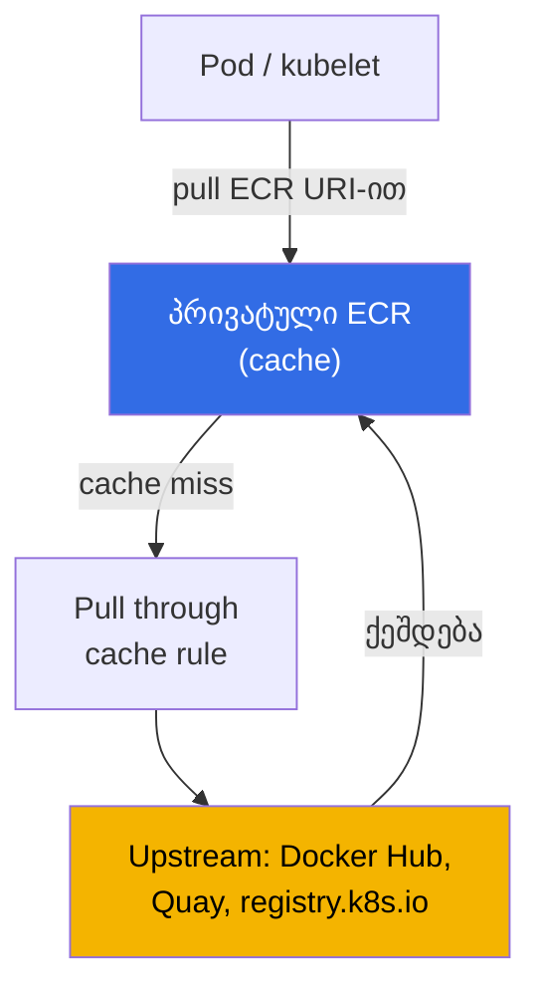
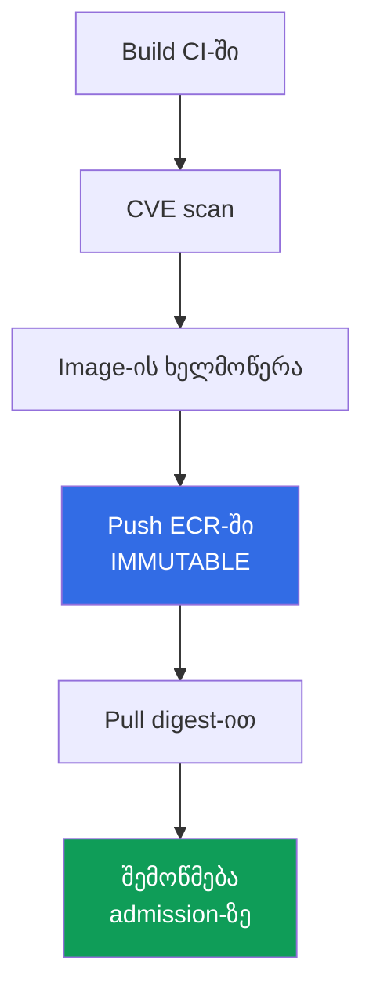

[Русская версия](ru.md) · [Eng version](en.md) · [Versión en español](es.md) · [Version française](fr.md) · [Deutsche Version](de.md) · [繁體中文版](tw.md) · [日本語版](jp.md)
# თავი 20. Images და supply chain: ECR, სკანირება, ხელმოწერები, pull through cache

> **რა არის შემდეგ.** მე-3 ნაწილმა მოიცვა იდენტობა (თავები 16-17), secrets (თავი 18) და
> კვანძის, პოდისა და ქსელის ჰარდენინგი (თავი 19). ეს თავი ეხება იმას, თუ საერთოდ რა ეშვება
> კლასტერში: საიდან მოდის image, ვინ შეამოწმა ის და არის თუ არა ეს ზუსტად ის image, რომელიც CI-მ
> ააწყო. განვიხილავთ ECR-ს, როგორც registry-ს, მოწყვლადობების სკანირებას, მთლიანობას digest-ისა
> და ხელმოწერების მეშვეობით, pull through cache-სა და lifecycle policy-ს. მომიჯნავე თემები სხვა
> თავებშია: კვანძის როლი ECR-იდან pull-ის უფლებებით და AMI, როგორც **კვანძის** image (არ აგერიოთ
> კონტეინერის image-ში) - თავი 10; პოდების წვდომა AWS-ზე (IRSA, Pod Identity) - თავები 16-17;
> secrets image-ებში - თავი 18; კერძო კლასტერი და VPC endpoints - თავი 19; ხელმოწერისა და
> registry-ს შემოწმება admission-ზე (Kyverno, Gatekeeper) - თავი 22; აუდიტი, runtime-ში
> სკანირება და GuardDuty - თავი 21; ანგარიშებისა და OU-ების სტრუქტურა, სადაც საერთო registry
> მდებარეობს, - თავი 0.1.

## 20.1. „პროდში კრიტიკული CVE-ის მქონე image მოხვდა, რადგან ის არავის დაუსკანირებია“

აპლიკაცია მუშაობს და მორიგეობა მშვიდია, სანამ უსაფრთხოების ანგარიში არ გამოჩნდება: პროდში
გაშვებულია ცნობილი კრიტიკული CVE-ის მქონე image, რომლის პატჩიც ნახევარი წლის წინ გამოვიდა.
CI-მ image ააწყო, push გააკეთა და deploy შეასრულა, მაგრამ აწყობასა და პროდს შორის არც ერთი
შემოწმება არ ყოფილა. მოწყვლადობა არავის უძებნია, რადგან ამისთვის არც საშუალება და არც ადგილი
არსებობდა. ეს ერთეული მარცხი კი არა, supply chain-ის პრობლემათა კლასია, ანუ ჯაჭვისა საწყისი
კოდიდან გაშვებულ კონტეინერამდე. მის გვერდით იმავე ბუნების მონათესავე პრობლემებიც გვხვდება:

- **Rate limit და upstream-ის მიუწვდომლობა.** Images-ის ნახევარი პირდაპირ Docker Hub-იდან
  იტვირთება. პიკურ საათში მოდის `429 Too Many Requests` (anonymous pull limit), ახალი პოდები
  `ImagePullBackOff`-ში იჭედება, rollout კი ჩერდება. გარე registry runtime-ში თქვენს
  დამოკიდებულებად იქცა.
- **ჩანაცვლება და typosquatting.** მანიფესტში წერია `image: mycompany/paymets:latest`, სადაც
  სახელში შეცდომაა და თქვენი image-ის ნაცვლად უცხო image იტვირთება. ან CI-მ ერთი image ააწყო,
  პროდში კი სხვა მოხვდა: ვერაფრით დაამტკიცებთ, რომ ეს სწორედ ის არტეფაქტია, რადგან ხელმოწერა
  არ არსებობს.
- **`latest` შეუმჩნევლად შეიცვალა.** Deploy მიუთითებს `app:latest`-ზე. ვიღაცამ tag გადაწერა და
  შემდეგი `pull`-ის დროს პოდმა სხვა image მიიღო, მიუხედავად იმისა, რომ მანიფესტი არ შეცვლილა.
  იმის აღდგენა, თუ კონკრეტულად რა იყო გუშინ გაშვებული, შეუძლებელია: tag არის იარლიყი და არა
  ფიქსირებული ვერსია.

ოთხივე პრობლემა ერთი პარამეტრით კი არა, გამართული ჯაჭვით გვარდება: registry, რომელშიც
არტეფაქტი ინახება, პროდამდე სკანირება, tag-ის უცვლელობა და deploy digest-ით, ხელმოწერა და მისი
შემოწმება.

## 20.2. ECR როგორც registry

Amazon ECR (Elastic Container Registry) არის OCI images-ის მართვადი registry. არსებობს ორი
სახეობა: **კერძო repositories** (registry-ს მისამართია
`<account-id>.dkr.ecr.<region>.amazonaws.com`) და **საჯარო** (`public.ecr.aws`). თითოეულ
ანგარიშს ყოველ რეგიონში საკუთარი კერძო registry აქვს, რომლის შიგნითაც repositories
მდებარეობს; repository images-ს tag-ებითა და digest-ებით ინახავს.

ავთენტიფიკაცია არის **არა login და password**, არამედ დროებითი token IAM-ის მეშვეობით.
`get-login-password` გასცემს 12-საათიან token-ს, რომლითაც docker-ში login სრულდება:

```bash
# პრივატულ რეესტრში login: token 12 საათით, მომხმარებელი ყოველთვის AWS
aws ecr get-login-password --region eu-central-1 \
  | docker login --username AWS --password-stdin 111122223333.dkr.ecr.eu-central-1.amazonaws.com
```

წვდომას პოლიტიკების ორი დონე განსაზღვრავს. სუბიექტის **IAM policy** (ვის და რისი გაკეთება
შეუძლია ზოგადად ECR-ში) და **repository policy**, ანუ resource-based policy კონკრეტული
repository-სთვის (ვის შეუძლია `pull`/`push` სწორედ მასში). **Cross-account** წვდომისთვის
აწყობენ repository policy-ს (ან registry policy-ს მთელი registry-სთვის), რომელიც სხვა
ანგარიშს images-ის pull-ის უფლებას აძლევს, და ასე ქმნიან საერთო ECR-ს multi-account
გარემოში (თავი 0.1). `pull`-ის უფლებას კვანძს აძლევს კვანძის როლი
`AmazonEC2ContainerRegistryReadOnly` policy-ით (კვანძის როლი - თავი 10), ამიტომ kubelet image-ს
`imagePullSecrets`-ის გარეშე ტვირთავს.

```bash
# repository-ის შექმნა: immutable tags + scan push-ზე + დაშიფვრა საკუთარი KMS key-ით
aws ecr create-repository --repository-name payments/api \
  --image-tag-mutability IMMUTABLE \
  --image-scanning-configuration scanOnPush=true \
  --encryption-configuration encryptionType=KMS,kmsKey=arn:aws:kms:eu-central-1:111122223333:key/abcd \
  --region eu-central-1
```

შექმნისას მთავარი არჩევანია **tag-ების mutability**. `MUTABLE` (ნაგულისხმევი მნიშვნელობა)
სხვა image-ით tag-ის გადაწერის საშუალებას იძლევა, საიდანაც მოდის პრობლემა „`latest`
შეუმჩნევლად შეიცვალა“. `IMMUTABLE` გადაწერას კრძალავს: როდესაც tag ერთხელ მიებმება digest-ს,
ის ფიქსირდება და იმავე tag-ის განმეორებითი `push` უარყოფილი იქნება. პროდისთვის `IMMUTABLE`-ს
ირჩევენ.

| თვისება | `MUTABLE` | `IMMUTABLE` |
|---|---|---|
| არსებული tag-ის გადაწერა | ნებადართულია | აკრძალულია |
| `latest` შეიძლება შეუმჩნევლად შეიცვალოს | დიახ | არა (tag დაკავებულია) |
| tag-ით კვლავწარმოებადობა | გარანტია არ არსებობს | tag = კონკრეტული digest |
| სად არის მიზანშეწონილი | sandbox, მონახაზები | პროდი, release images |

### ერთი registry მთელი ორგანიზაციისთვის

ყოველი ანგარიშის registry-დან images-ის გავრცელება ნიშნავს როგორც სკანირების, ისე lifecycle-ისა
და ხელმოწერების დუბლირებას. ამიტომ 0.1 თავში აღწერილი ტიპური multi-account სქემაა **ერთი
registry საერთო სერვისების ანგარიშში**, რომელშიც CI push-ს აკეთებს, ხოლო `prod`, `stage` და
`dev` კლასტერები მხოლოდ pull-ს ასრულებენ. ამ შემთხვევაში წვდომის ანგარიშების მიხედვით გაცემა
საჭირო არ არის: repository policy ჩვეულებრივი resource-based policy-ა, ამიტომ მასში მუშაობს
პირობების გლობალური keys და წვდომა მთელი ორგანიზაციისთვის ერთდროულად გაიცემა
`aws:PrincipalOrgID`-ის მეშვეობით.

```json
{
  "Version": "2012-10-17",
  "Statement": [{
    "Sid": "AllowPullFromOrg",
    "Effect": "Allow",
    "Principal": "*",
    "Action": ["ecr:BatchGetImage", "ecr:GetDownloadUrlForLayer"],
    "Condition": {"StringEquals": {"aws:PrincipalOrgID": "o-exampleorgid"}}
  }]
}
```

ორგანიზაციაში დამატებული ახალი ანგარიში წვდომას ავტომატურად იღებს, ხოლო გასვლისას მას
policy-ს შესწორების გარეშე კარგავს. გასათვალისწინებელია ოთხი საკითხი.

- **Repository policy არ ცვლის IAM policy-ს.** Cross-account წვდომისთვის ორივე ნებართვაა
  საჭირო: repository-ს policy-ც და გამომძახებელი მხარის უფლებებიც. ამას ემატება
  `ecr:GetAuthorizationToken`, რომელიც ანგარიშის დონის უფლებაა და repository policy-ში ვერ
  განისაზღვრება; EKS-ის კვანძებს მას კვანძის როლის იგივე managed policy აძლევს (თავი 10).
- **წესი მთელი registry-სთვის და არა repository-სთვის.** თითოეულ repository-ზე policy-ს
  ნაცვლად იყენებენ **registry policy**-ს, რომელიც ანგარიშის მთელ registry-ზე მოქმედებს. ხოლო
  repositories-ს, რომლებსაც ECR თავად ქმნის (cache, replication), repository creation
  template აკონფიგურირებს (სექცია 20.5).
- **კერძო კლასტერები.** სხვა ანგარიშიდან interface endpoint-ის გავლით pull მუშაობს, მაგრამ
  თავად endpoint მკითხველის ანგარიშში მდებარეობს და მისმა endpoint policy-მ უცხო resource
  უნდა დაუშვას (თავები 0.3 და 19), წინააღმდეგ შემთხვევაში სწორი repository policy-ის
  მიუხედავად image ვერ ჩამოიტვირთება.
- **რეგიონი და ტრაფიკი.** სხვა რეგიონში მყოფი კლასტერი layers-ს რეგიონის საზღვრის გავლით
  ტვირთავს, რაც პოდის გაშვების latency-სა და ანგარიშში ტრაფიკის საფასურს ნიშნავს. გამოსავალია
  **registry replication**: cross-region და cross-account წესები images-ს იქ აკოპირებს, სადაც
  მათ ტვირთავენ. Cross-account replication-ისთვის მიმღები ანგარიში საკუთარ registry policy-ში
  წყაროს ანგარიშს `ecr:CreateRepository` და `ecr:ReplicateImage` უფლებებს აძლევს, ამასთან
  კოპირდება მხოლოდ წესის კონფიგურაციის შემდეგ push-ით ატვირთული images.

ცენტრალიზაციის ფასი აშკარაა: registry საერთო დამოკიდებულება ხდება, რომელსაც საკუთარი owner,
API quotas და blast radius აქვს. ამიტომ პროდი ხშირად საკუთარ ანგარიშში ან რეგიონში replica-ს
ინახავს: source of truth ერთია, მაგრამ rollout-ის failure point ერთზე მეტია.

შექმნისას მეორე პარამეტრი, რომელიც **შემდგომშიც უცვლელია**, არის encryption at rest.
ნაგულისხმევად layers იშიფრება S3 keys-ით (SSE-S3, AES-256, თქვენი მხრიდან მოქმედება საჭირო არ
არის). key-ზე კონტროლისთვის უთითებენ `encryptionType=KMS`-ს: ან AWS-managed key `aws/ecr`, ან
საკუთარ customer managed key-ს (ის იმავე რეგიონში უნდა იყოს, რომელშიც repository). Mutability-ს
მსგავსად, encryption configuration შექმნის შემდეგ არ იცვლება და ამისთვის repository-ს თავიდან
შექმნაა საჭირო.

## 20.3. მოწყვლადობების სკანირება

ECR-ს images-ში ცნობილი CVE-ების მოძებნა შეუძლია. ორი რეჟიმი არსებობს და ეს არჩევანი მთელი
registry-სთვის კეთდება და არა ცალკეული repository-სთვის.

- **Basic scanning** - ECR-ის ტექნოლოგია CVE database-ის საფუძველზე, რომელიც **OS packages-ის
  მოწყვლადობებს** ასკანირებს. აქვს ორი სიხშირე: ხელით და scan on push (push-ისას). Findings-ს
  `DescribeImageScanFindings` აბრუნებს.
- **Enhanced scanning** - **Amazon Inspector**-თან ინტეგრაცია: ასკანირებს **OS-ისა და
  programming language packages-ის** (npm, pip, gem და სხვ.) მოწყვლადობებს და ამას
  **უწყვეტად** აკეთებს. ახალი CVE-ის გამოჩენისას უკვე შენახული images-ის შედეგები ავტომატურად
  განახლდება, Inspector კი EventBridge-ში event-ს აგზავნის. აქვს ორი სიხშირე: scan on push და
  continuous scan.

```bash
# basic scan on push-ის ჩართვა registry-ის დონეზე
aws ecr put-registry-scanning-configuration --scan-type BASIC \
  --rules '[{"scanFrequency":"SCAN_ON_PUSH","repositoryFilters":[{"filter":"*","filterType":"WILDCARD"}]}]'

# კონკრეტული image-ის ერთჯერადი scan და findings-ის ნახვა severity-ის მიხედვით
aws ecr start-image-scan --repository-name payments/api --image-id imageTag=1.4.2
aws ecr describe-image-scan-findings --repository-name payments/api --image-id imageTag=1.4.2
```

Findings მოდის severity მნიშვნელობებით (`CRITICAL`, `HIGH`, `MEDIUM`, ...) და CVE-ის ბმულით.
თავად სკანირება არაფერს ბლოკავს, ის მხოლოდ სიგნალია. იმისათვის, რომ კრიტიკული findings-ის მქონე
image **პროდში არ მოხვდეს**, სკანირებას პროცესში რთავენ: gate CI-ში (`CRITICAL`-ის შემთხვევაში
არ გაკეთდეს push/deploy) და admission-ზე policy-ით შემოწმება (Kyverno ან Gatekeeper - თავი 22).
ECR მოწყვლადობას პოულობს, policy კი წყვეტს, დაუშვას თუ არა ასეთი image.

| თვისება | Basic scanning | Enhanced scanning (Inspector) |
|---|---|---|
| რას ასკანირებს | OS packages | OS + language packages (npm, pip, ...) |
| სიხშირე | ხელით, scan on push | scan on push, უწყვეტად |
| ახალი CVE-ებით ხელახალი შეფასება | არა | დიახ, ავტომატურად |
| შეტყობინებები | - | event EventBridge-ში |
| სად არის მიზანშეწონილი | მინიმუმი, sandbox | პროდი, მუდმივი კონტროლი |

Basic-სა და enhanced-ს შორის გადართვა ადრე შესრულებულ scans-ს ანულებს: მათი თავიდან
კონფიგურირება იქნება საჭირო (წინა ტიპზე დაბრუნებისას ძველი შედეგები კვლავ ხელმისაწვდომი ხდება).

## 20.4. Image-ის მთლიანობა: digest, tags და ხელმოწერები

Tag არის image-ის მოძრავი იარლიყი. Image-ის ნამდვილი უცვლელი იდენტიფიკატორია მისი **digest**,
ანუ შიგთავსის `sha256` hash. ერთი და იგივე digest ყოველთვის ერთსა და იმავე image-ზე მიუთითებს;
შიგთავსის შეცვლასთან ერთად digest-იც იცვლება. აქედან გამომდინარეობს წესი: პროდში deploy უნდა
შესრულდეს **digest-ით** და არა tag-ით.

```bash
# pull digest-ით - გარანტია, რომ ეს ზუსტად ის image-ია, რომელიც CI-მ აგო
docker pull 111122223333.dkr.ecr.eu-central-1.amazonaws.com/payments/api@sha256:9f2c...e41a
```

```yaml
# pod-ის მანიფესტში digest-ით მითითება image-ის შიგთავსს სამუდამოდ აფიქსირებს
spec:
  containers:
    - name: api
      image: 111122223333.dkr.ecr.eu-central-1.amazonaws.com/payments/api@sha256:9f2c...e41a
```

რატომ არის `latest` სახიფათო: თავისი მნიშვნელობით ის `MUTABLE` tag-ია, ყოველთვის „უახლესია“ და
შეუმჩნევლად იცვლება. `MUTABLE` repository-ში ფიქსირებული `1.4.2` tag-ის გადაწერაც შეიძლება.
საიმედოობის კომბინაციაა `IMMUTABLE` repository (tag-ის გადაწერა შეუძლებელია) და deploy
 digest-ით (მითითება შიგთავსზე და არა იარლიყზე).

Digest **შემთხვევითი** ჩანაცვლებისგან იცავს, მაგრამ ვერ ამტკიცებს, **ვინ** ააწყო image. ამას
**ხელმოწერა** წყვეტს. Image-ს აწყობისას ხელს აწერენ (`cosign` Sigstore პროექტიდან ან
Notation/Notary Project; AWS Signer, როგორც ხელმოწერის მართვადი სერვისი), ხოლო კლასტერში
შესვლისას ხელმოწერას admission-ზე **ამოწმებენ** Kyverno-ს `verifyImages` წესით ან Sigstore
policy-controller-ით (თავი 22). გაშვება ნებადართულია მხოლოდ სანდო key-ის ვალიდური ხელმოწერის
მქონე image-ისთვის, რაც 20.1 სექციაში აღწერილ ჩანაცვლებასა და typosquatting-ს აგვარებს.

## 20.5. Pull through cache

Pull through cache Docker Hub-ის rate limit-ისა და upstream-ის მიუწვდომლობის პრობლემას
აგვარებს. ECR **მოთხოვნისას გარე registry-ს images-ს თქვენს კერძო ECR-ში cache-ს უკეთებს**:
თქვენ image-ს საკუთარი registry-ს URI-ით ტვირთავთ, პირველი მიმართვისას ECR repository-ს თავად
ქმნის და image-ს cache-ში ინახავს, შემდგომ მოთხოვნებზე კი tag-ის ახალ ვერსიას upstream-ში სულ
მცირე **24 საათში ერთხელ** ამოწმებს და cache-ს აახლებს.



რატომ არის ეს საჭირო EKS-ში:

- **Docker Hub-ის rate limit-ის გვერდის ავლა** - image-ს საკუთარი ECR-იდან ტვირთავთ და არა
  ანონიმურად Docker Hub-იდან.
- **ხელმისაწვდომობა** - upstream გაითიშა, cache-ში კი image უკვე არის.
- **კერძო კლასტერი ინტერნეტში გასასვლელის გარეშე** (თავი 19) - კვანძები მხოლოდ ECR-ს
  უკავშირდება VPC endpoints-ის გავლით და გარე images-ისთვის ინტერნეტში არ გადის.
- **სკანირების ერთიანი წერტილი** - cache-ში შენახული images თქვენს ECR-ში მდებარეობს და მათზე
  იგივე scan და policies ვრცელდება, რაც საკუთარ images-ზე.

მხარდაჭერილი upstream-ები (AWS-ის დოკუმენტაციის მიხედვით): **ავთენტიფიკაციის გარეშე** - Amazon
ECR Public, Kubernetes registry (`registry.k8s.io`) და Quay; **ავთენტიფიკაციით**, AWS Secrets
Manager-ში შენახული secret-ის მეშვეობით - Docker Hub, Microsoft Azure Container Registry,
GitHub Container Registry, GitLab (SaaS) და Chainguard; **Amazon ECR** (cross-account) - IAM
role-ის მეშვეობით.

```bash
# Docker Hub-ის წესი: docker-hub პრეფიქსი, credentials Secrets Manager-ში
aws ecr create-pull-through-cache-rule --ecr-repository-prefix docker-hub \
  --upstream-registry-url registry-1.docker.io \
  --credential-arn arn:aws:secretsmanager:eu-central-1:111122223333:secret:ecr-pullthroughcache/dh
```

ამის შემდეგ image-ზე მიუთითებენ საკუთარი registry-ს URI-ითა და წესის prefix-ით:

```yaml
# იყო docker.io/library/nginx:1.27 - გახდა ECR cache-ის მეშვეობით
image: 111122223333.dkr.ecr.eu-central-1.amazonaws.com/docker-hub/library/nginx:1.27
```

ერთი მნიშვნელოვანი დეტალი: repositories, რომლებსაც ECR cache-სთვის თავად ქმნის,
ნაგულისხმევად იქმნება `MUTABLE` tags-ით, SSE-S3 encryption-ითა და lifecycle policy-ის გარეშე,
ამიტომ 20.2 და 20.6 სექციების პარამეტრები მათზე ავტომატურად არ ვრცელდება. იმისათვის, რომ
cache repositories-მა KMS key, ავტომატური გაწმენდა და tag-ის უცვლელობა მემკვიდრეობით მიიღოს,
ქმნიან **repository creation template**-ს იმავე prefix-ით, რომელიც cache-ის წესს აქვს:

```bash
# შაბლონი docker-hub პრეფიქსისთვის: cache-repository-ები მიიღებენ KMS key-სა და lifecycle policy-ს
aws ecr create-repository-creation-template --prefix docker-hub --applied-for PULL_THROUGH_CACHE \
  --encryption-configuration encryptionType=KMS,kmsKey=arn:aws:kms:eu-central-1:111122223333:key/abcd \
  --lifecycle-policy file://lifecycle.json
```

Template მხოლოდ repository-ს შექმნის მომენტში მოქმედებს და მისივე მეშვეობით განისაზღვრება
repository policy და tag-ების უცვლელობა (cache-ის მოძრავი tags-ისთვის, მაგალითად `latest`,
გამონაკლისებით).

## 20.6. Lifecycle policy: repository-ს ავტომატური გაწმენდა

გაწმენდის გარეშე repository უსასრულოდ იზრდება: გროვდება ძველი tags და untagged layers, მათთან
ერთად კი ძველი მოწყვლადი images, რომლებიც ვინმემ შეიძლება კვლავ deploy-ზე გაუშვას. **Lifecycle
policy** ასაკის ან images-ის რაოდენობის მიხედვით ავტომატური წაშლის წესებს განსაზღვრავს.

```bash
# v tag-იანი უახლესი 10 image-ის შენარჩუნება, დანარჩენის წაშლა
aws ecr put-lifecycle-policy --repository-name payments/api --lifecycle-policy-text '{
  "rules": [{
    "rulePriority": 1,
    "description": "keep last 10 tagged",
    "selection": {"tagStatus":"tagged","tagPrefixList":["v"],"countType":"imageCountMoreThan","countNumber":10},
    "action": {"type": "expire"}
  }]
}'
```

ტიპური წესებია N დღეზე ძველი untagged images-ის წაშლა და tag prefix-ის მიხედვით მაქსიმუმ N
image-ის შენახვა. ეს როგორც storage-ს ზოგავს, ისე ამცირებს repository-დან ძველი მოწყვლადი
image-ის გაშვების რისკს. წესები გამოისახება `tagStatus`-ით (`tagged`/`untagged`/`any`) და
`countType`-ით ასაკის (`sinceImagePushed`) ან რაოდენობის (`imageCountMoreThan`) მიხედვით.

## 20.7. კერძო კლასტერი და images

კერძო კლასტერში (თავი 19) ინტერნეტში გასასვლელის არმქონე კვანძები images-ს ECR-იდან **მხოლოდ
VPC endpoints-ის გავლით** ტვირთავენ. `pull`-ისთვის სამი endpoint არის საჭირო: interface
`ecr.api` (ECR API calls, მათ შორის ავთენტიფიკაცია) და `ecr.dkr` (თავად docker pull protocol),
ასევე **gateway endpoint `s3`**, რადგან **image layers ფიზიკურად S3-ში ინახება**. S3 endpoint-ის
გარეშე `ecr.api` და `ecr.dkr` არსებობს, მაგრამ image მაინც ვერ ჩამოიტვირთება, რადგან layers
კვანძამდე ვერ მივა. ეს endpoints-ის იგივე ცხრილია, რომელიც მე-19 თავშია მოცემული; აქ მთავარია,
რომ image-ის pull ECR + S3 კომბინაციაზეა დამოკიდებული, ხოლო ასეთ კლასტერში pull through cache
გარე images-ის ინტერნეტში კვანძებისთვის გასასვლელის გახსნის გარეშე მიღების ერთადერთი გზა ხდება.

## 20.8. Supply chain როგორც ჯაჭვი

ცალკეული მეთოდები აწყობიდან გაშვებამდე ერთიან ჯაჭვად ერთიანდება. ნებისმიერი რგოლის გაწყვეტა
დანარჩენების ღირებულებას აუფასურებს.



| რგოლი | რას გვაძლევს | სად წყდება |
|---|---|---|
| CVE scan | ცნობილი მოწყვლადობები პროდამდე ჩანს | image საერთოდ არ სკანირდება |
| Push `IMMUTABLE` ECR-ში | tag-ის გადაწერა შეუძლებელია | `MUTABLE`, tag შეუმჩნევლად შეიცვალა |
| Pull digest-ით | ზუსტად აწყობილი არტეფაქტი ეშვება | deploy `latest`/tag-ით |
| ხელმოწერის შემოწმება admission-ზე | მხოლოდ სანდო image დაიშვება | ხელმოწერა არ მოწმდება |

ეს ასე იკითხება: CI image-ს აწყობს, ასკანირებს (20.3), ხელს აწერს (20.4), `IMMUTABLE` ECR-ში
push-ს აკეთებს (20.2), კლასტერი digest-ით ტვირთავს, admission policy (თავი 22) კი ხელმოწერასა
და წყაროს ამოწმებს. დაუსკანირებელი image, `MUTABLE` tag, deploy `latest`-ით ან ხელმოწერის
შემოწმების არარსებობა ის წერტილებია, სადაც ჯაჭვი წყდება და 20.1 სექციის პრობლემები ბრუნდება.

## 20.9. როგორ იყენებენ ამას production-ში

- **Enhanced scanning მთელი registry-სთვის.** Inspector-ის უწყვეტი scan პოულობს CVE-ებს,
  რომლებიც push-ის შემდეგ გაჩნდა, და EventBridge-ში event-ს აგზავნის, ნაცვლად იმისა, რომ image
  push-ისას მხოლოდ ერთხელ შეამოწმოს.
- **Immutable tags და deploy digest-ით.** Repositories იქმნება `IMMUTABLE`-ით, workloads კი
  image-ზე `@sha256:`-ით მიუთითებს: tag ვერ გადაიწერება და ზუსტად ის ეშვება, რაც ააწყეს.
- **Pull through cache პირდაპირი Docker Hub-ის ნაცვლად.** გარე images იტვირთება ECR cache-ის
  გავლით: upstream-ის rate limit-სა და ხელმისაწვდომობაზე დამოკიდებულება აღარ არსებობს და
  ყველაფერი ერთიანი scan-ისა და policies-ის ქვეშაა. Cache repositories-ის პარამეტრები (KMS,
  lifecycle, immutability) წესის prefix-ზე repository creation template-ით ედება.
- **Lifecycle policy თითოეულ repository-ზე.** ძველი და untagged images-ის ავტომატური გაწმენდა
  repository-ს ზომას აკონტროლებს და ძველი მოწყვლადი image-ის გაშვებას უშლის ხელს.
- **ხელმოწერა და მისი შემოწმება admission-ზე.** Images-ს CI-ში ხელს აწერენ (cosign, Notation,
  AWS Signer), კლასტერში შესვლისას კი policy (თავი 22) მხოლოდ ვალიდურად ხელმოწერილ images-ს
  უშვებს.
- **Cross-account საერთო ECR-ის მეშვეობით.** Multi-account გარემოში (თავი 0.1) images ინახება
  registry-ში, რომელსაც სხვა ანგარიშებისთვის წვდომის repository policy აქვს, და არ ხდება მათი
  ანგარიშების მიხედვით დუბლირება.

## 20.10. მინი-ლექსიკონი

- **ECR** - AWS-ის OCI images-ის მართვადი registry; კერძო registry თითო ანგარიში-რეგიონისთვის,
  მისამართით `<account-id>.dkr.ecr.<region>.amazonaws.com`, და საჯარო `public.ecr.aws`.
- **Digest** - image-ის შიგთავსის `sha256` hash, უცვლელი იდენტიფიკატორი; მოძრავი tag-ისგან
  განსხვავებით, digest-ით deploy ზუსტად აწყობილი არტეფაქტის გაშვებას უზრუნველყოფს.
- **Tag immutability** - repository-ს `IMMUTABLE` რეჟიმი, რომელიც tag-ის სხვა image-ით
  გადაწერას კრძალავს; `MUTABLE` (ნაგულისხმევი) გადაწერას უშვებს.
- **Basic / Enhanced scanning** - ECR-ში CVE-ების ძებნის რეჟიმები: basic ნატიურად ასკანირებს
  OS packages-ს; enhanced Amazon Inspector-ის მეშვეობით უწყვეტად ასკანირებს OS-სა და language
  packages-ს.
- **Pull through cache** - ECR-ის წესი, რომელიც მოთხოვნისას გარე registry-ს (Docker Hub, Quay,
  `registry.k8s.io` და სხვ.) images-ს თქვენს კერძო ECR-ში cache-ს უკეთებს.
- **Lifecycle policy** - ასაკის ან რაოდენობის მიხედვით images-ის ავტომატური წაშლის წესები.
- **Repository policy და registry policy** - resource-based policies ერთი repository-სა და
  ანგარიშის მთელი registry-სთვის; მათში `aws:PrincipalOrgID` მუშაობს, ამიტომ pull ერთდროულად
  მთელი ორგანიზაციისთვის გაიცემა ანგარიშების ჩამოთვლის გარეშე. მათში
  `ecr:GetAuthorizationToken` არ განისაზღვრება, რადგან ის გამომძახებლის IAM policy-ში ანგარიშის
  დონის უფლებაა.
- **Replication configuration** - ECR-ის წესები, რომლებიც images-ს სხვა რეგიონებსა და
  ანგარიშებში აკოპირებს; cross-account შემთხვევაში მიმღები ანგარიში საკუთარ registry policy-ში
  წყაროს `ecr:CreateRepository` და `ecr:ReplicateImage` უფლებებს აძლევს.
- **Repository creation template** - პარამეტრების template (encryption, lifecycle,
  immutability, policy) repositories-სთვის, რომლებსაც ECR pull through cache-სთვის prefix-ის
  მიხედვით თავად ქმნის; მის გარეშე cache repository ნაგულისხმევ მნიშვნელობებს იღებს
  (`MUTABLE`, SSE-S3, policies-ის გარეშე).
- **Encryption at rest** - ECR-ში layers-ის encryption: ნაგულისხმევად SSE-S3 (AES-256),
  სურვილისამებრ SSE-KMS `aws/ecr` key-ით ან საკუთარი customer managed key-ით; განისაზღვრება
  შექმნისას და უცვლელია.

## 20.11. თავის შეჯამება

- Supply chain-ის პრობლემები (დაუსკანირებელი CVE პროდში, Docker Hub-ის rate limit, image-ის
  ჩანაცვლება, შეუმჩნევლად შეცვლილი `latest`) გვარდება ჯაჭვით: registry, scan, immutability,
  digest, ხელმოწერა.
- ECR არის კერძო registry თითო ანგარიში-რეგიონისთვის; ავთენტიფიკაცია ხდება IAM token-ით
  (`get-login-password`) და არა password-ით. წვდომა არის IAM დამატებული repository policy,
  cross-account კი repository/registry policy-ის მეშვეობით მუშაობს. კვანძს pull-ის უფლებას
  კვანძის როლი აძლევს (თავი 10).
- Tag-ის mutability ძირითადი არჩევანია: `IMMUTABLE` tag-digest კავშირს აფიქსირებს, `MUTABLE` კი
  `latest`-ის შეუმჩნევლად შეცვლას უშვებს. პროდისთვის გამოიყენება `IMMUTABLE` და deploy
  `@sha256:`-ით.
- სკანირება: basic (OS packages, ხელით/scan on push) და enhanced (OS + languages, უწყვეტად,
  Inspector, events EventBridge-ში). თავად არაფერს ბლოკავს, გადაწყვეტილებას admission policy
  იღებს (თავი 22).
- მთლიანობა: digest ჩანაცვლებისგან იცავს, ხელმოწერა (cosign, Notation, AWS Signer) კი განზრახ
  გაყალბებისგან; კლასტერში შესვლისას ხელმოწერას Kyverno/Gatekeeper policy ამოწმებს (თავი 22).
- Pull through cache გარე images-ს ECR-ში cache-ს უკეთებს (rate limit-ის გვერდის ავლა,
  ხელმისაწვდომობა, კერძო კლასტერი, ერთიანი scan). Lifecycle policy ძველს ასუფთავებს. კერძო
  კლასტერში pull გადის `ecr.api`, `ecr.dkr` და S3 endpoint-ზე (layers S3-შია, თავი 19).

## 20.12. როგორ გამოგადგებათ ეს რეალურ სამუშაოში

კითხვას „ეს ნამდვილად ის image-ია, რომელიც CI-მ ააწყო?“ digest-ით deploy და ხელმოწერის
შემოწმება თავად მანიფესტით პასუხობს და არა გამოძიებით. ინციდენტი „rollout გაჩერდა, Docker
Hub-ის rate limit-ის გამო `ImagePullBackOff` მივიღეთ“ არ ხდება იქ, სადაც images ECR-ის pull
through cache-ის გავლით მოდის. მორიგეობისას „პროდში კრიტიკული CVE არის“ post factum ანგარიშის
ნაცვლად admission-ზე ბლოკად იქცევა, რადგან enhanced scanning-მა ის იპოვა, policy-მ კი არ
დაუშვა. `IMMUTABLE` repository და digest ასევე ხსნის შემთხვევათა მთელ კლასს „გუშინ მუშაობდა,
დღეს კი სხვა image არის“, რადგან tag აღარ არის იარლიყი, რომელიც შეუმჩნევლად იცვლება.

## 20.13. თვითშემოწმების კითხვები

1. Supply chain-ის რომელი ოთხი პრობლემაა ჩამოთვლილი 20.1-ში და ჯაჭვის რომელი ნაწილი აგვარებს
   თითოეულს?
2. როგორ გამოიყურება კერძო ECR registry-ს მისამართი და რით განსხვავდება ECR-ში ავთენტიფიკაცია
   password-ისგან?
3. რომელი ორი policy მართავს repository-ზე წვდომას და როგორ გაიცემა cross-account pull?
4. ვინ და რის ხარჯზე აძლევს კვანძს ECR-იდან images-ის `imagePullSecrets`-ის გარეშე pull-ის
   უფლებას?
5. რით განსხვავდება `IMMUTABLE` repository `MUTABLE`-ისგან და რატომ ირჩევენ პროდისთვის პირველს?
6. რით განსხვავდება basic scanning enhanced scanning-ისგან და რას გვაძლევს Amazon
   Inspector-თან ინტეგრაცია?
7. თავად სკანირება ბლოკავს მოწყვლადი image-ის deploy-ს? თუ არა, რა ბლოკავს და სად?
8. რატომ არის digest-ით deploy tag-ით deploy-ზე საიმედო და რით განსხვავდება digest tag-ისგან?
9. რისგან იცავს digest და რისგან ხელმოწერა, და სად მოწმდება ხელმოწერა?
10. რას აკეთებს pull through cache და რომელი upstream-ები მოითხოვს ავთენტიფიკაციას, ხოლო
    რომელი არა?
11. რისთვის არის pull through cache საჭირო ინტერნეტში გასასვლელის არმქონე კერძო კლასტერში?
12. რატომ არის საჭირო lifecycle policy და რომელი კრიტერიუმებით შლის ის images-ს?
13. რატომ არის კერძო კლასტერში image-ის pull-ისთვის ECR-ის გარდა S3 VPC endpoint-იც საჭირო?
14. რით განსხვავდება ECR-ის ნაგულისხმევი encryption SSE-KMS-ისგან და როდის აღარ შეიძლება
    კონფიგურაციის შეცვლა?
15. ნაგულისხმევად რომელ პარამეტრებს იღებს cache repositories და რით უნდა მიენიჭოს მათ KMS და
    lifecycle?
16. როგორ გავცეთ ერთი registry-დან pull-ის უფლება ერთდროულად მთელი ორგანიზაციისთვის და რატომ
    არ არის cross-account წვდომისთვის მხოლოდ repository policy საკმარისი?
17. სხვა რეგიონში მყოფი კლასტერი images-ს საერთო registry-დან ტვირთავს. რას შეცვლით და რომელი
    უფლებები სჭირდება მიმღებ ანგარიშს?

## პრაქტიკა

ამ თემის კურსის ლაბაა [ლაბა 130 - ECR და supply chain: უცვლელი tags, scan push-ისას,
pull through cache](../../labs/130/README_GE.MD). მასში არის repository `IMMUTABLE` და
`scanOnPush` პარამეტრებით, registry-ს უარი tag-ის განმეორებით push-ზე, findings-ისა და scanner-ის
გამოყენების საზღვრების განხილვა, კერძო ECR-იდან digest-ით deploy და ორი pull through cache,
ერთი ავთენტიფიკაციის გარეშე და მეორე secret-ით. შედეგი მოწმდება `check_result` ბრძანებით.

ქვემოთ იგივე მოქმედებები საკუთარ ანგარიშში შეასრულეთ. შექმენით
repository `--image-tag-mutability IMMUTABLE` და `--image-scanning-configuration
scanOnPush=true` პარამეტრებით, შეასრულეთ login `aws ecr get-login-password | docker login`-ით,
გააკეთეთ image-ის push და ნახეთ findings: `aws ecr describe-image-scan-findings
--repository-name <repo> --image-id imageTag=<tag>`. სცადეთ tag-ის გადაწერა, `IMMUTABLE` push-ს
უარყოფს. აიღეთ image-ის digest (`aws ecr describe-images ... --query
'imageDetails[].imageDigest'`) და tag-ის ნაცვლად პოდი `@sha256:`-ით deploy-ზე გაუშვით.

შემდეგ შექმენით pull through cache: `aws ecr create-pull-through-cache-rule` Quay-სთვის ან
`registry.k8s.io`-სთვის (secret-ის გარეშე), ან Docker Hub-ისთვის (Secrets Manager-ში secret-ით),
შემდეგ image საკუთარი registry-ს URI-ითა და წესის prefix-ით ჩამოტვირთეთ და დარწმუნდით, რომ ECR-ში
cache repository გამოჩნდა. Lifecycle policy დაამატეთ `aws ecr put-lifecycle-policy` ბრძანებით
და წაშლის preview შეამოწმეთ `aws ecr get-lifecycle-policy-preview`-ით. ხელმოწერის admission-ზე
შემოწმება 22-ე თავისთვის დატოვეთ.

---
[სარჩევი](../README_GE.md) · [თავი 19](../19/ge.md) · [თავი 21](../21/ge.md)
