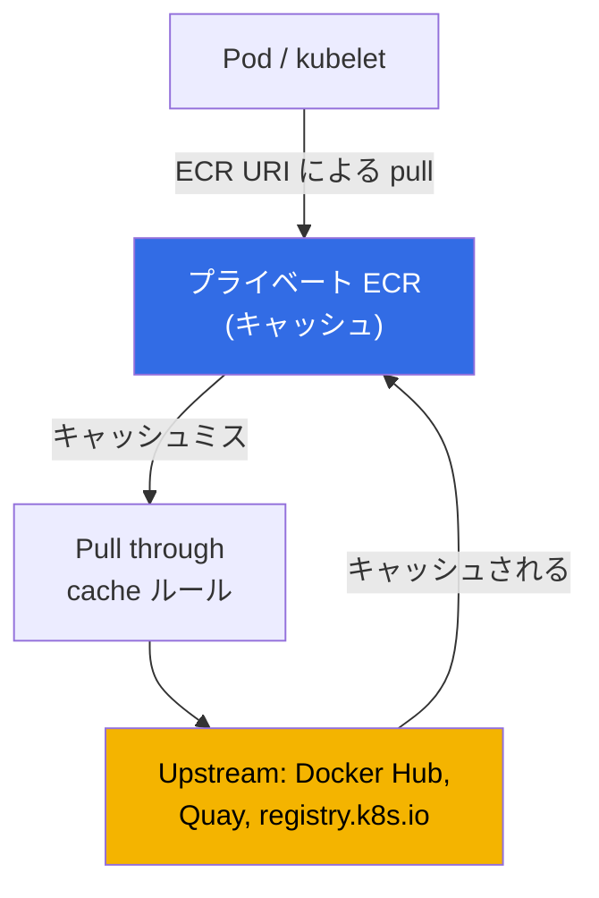
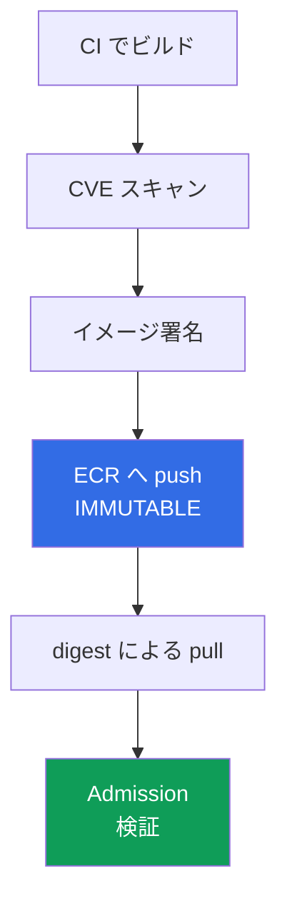

[Eng version](en.md) · [Versión en español](es.md) · [Version française](fr.md) · [Deutsche Version](de.md) · [Русская версия](ru.md) · [ქართული ვერსია](ge.md) · [繁體中文版](tw.md)
# 第20章. イメージとサプライチェーン: ECR、スキャン、署名、pull through cache

> **この先。** 第3部ではアイデンティティ（第16-17章）、シークレット（第18章）、ノード、Pod、
> ネットワークのハードニング（第19章）を扱いました。この章は、クラスターで実際に何が動くのか、
> イメージがどこから来たのか、誰が検査したのか、CI がビルドしたものと同一なのかを扱います。
> レジストリとしての ECR、脆弱性スキャン、digest と署名による完全性、pull through cache、
> lifecycle policy を取り上げます。関連する内容は別章で扱います。ECR pull 権限を持つノードロールと
> **ノード**イメージである AMI（コンテナイメージと混同しない）は第10章、Pod の AWS へのアクセス
> （IRSA、Pod Identity）は第16-17章、イメージ内のシークレットは第18章、プライベートクラスターと
> VPC endpoints は第19章、admission 時の署名とレジストリ検証（Kyverno、Gatekeeper）は第22章、
> 監査、ランタイムスキャン、GuardDuty は第21章、共有レジストリが置かれるアカウントと OU の構造は
> 第0.1章です。

## 20.1. 「誰もスキャンしなかったため、critical CVE を含むイメージが本番環境に入った」

アプリケーションは動作し、オンコールも平穏です。しかしセキュリティレポートが届きます。本番環境で
既知の critical CVE を含むイメージが動いており、そのパッチは半年前にリリースされていました。CI は
イメージをビルド、push、deploy しましたが、ビルドから本番までの間に検査は一度もありませんでした。
手段も確認場所もなかったため、誰も脆弱性を探しませんでした。これは単発の障害ではなく、ソースコード
から実行中のコンテナまでの連鎖であるサプライチェーン問題の一種です。同じ性質の関連問題もあります。

- **Rate limit と利用不能な upstream。** イメージの半分を Docker Hub から直接 pull しています。
  ピーク時に `429 Too Many Requests`（anonymous pull limit）が返され、新しい Pod は
  `ImagePullBackOff` で停止し、ロールアウトが止まります。外部レジストリがランタイム依存関係に
  なっています。
- **すり替えと typosquatting。** マニフェストに `image: mycompany/paymets:latest` とあり、名前の
  タイプミスにより自分たちのイメージではなく外部のイメージが pull されます。または、CI が一方の
  イメージをビルドしたのに、本番には別のものが入ります。署名がないため、それが同じアーティファクト
  であることを証明できません。
- **`latest` がいつの間にか変わった。** デプロイが `app:latest` を参照します。誰かがタグを上書きし、
  次の `pull` で Pod はマニフェストが変わっていないにもかかわらず別のイメージを取得します。タグは
  ラベルであり固定バージョンではないため、昨日何が動いていたかを再現できません。

これら4つの問題は1つのチェックボックスでは解決しません。アーティファクトを保持するレジストリ、
本番前のスキャン、タグの不変性と digest によるデプロイ、そして署名と署名検証という連鎖で解決します。

## 20.2. レジストリとしての ECR

Amazon ECR（Elastic Container Registry）は OCI イメージ用のマネージドレジストリです。種類は2つあります。
**プライベートリポジトリ**（レジストリアドレス
`<account-id>.dkr.ecr.<region>.amazonaws.com`）と**パブリック**なもの（`public.ecr.aws`）です。
各アカウントは Region ごとに独自のプライベートレジストリを持ち、その中にリポジトリがあります。
リポジトリはタグと digest を持つイメージを格納します。

認証は**ユーザー名とパスワードによるログインではなく**、IAM を通じた一時トークンです。
`get-login-password` は12時間有効のトークンを発行し、それで Docker にログインします。

```bash
# プライベートレジストリへログイン: トークンは12時間有効、ユーザー名は常に AWS
aws ecr get-login-password --region eu-central-1 \
  | docker login --username AWS --password-stdin 111122223333.dkr.ecr.eu-central-1.amazonaws.com
```

アクセスは2層のポリシーで制御します。主体の **IAM policy** は ECR 全般に対して誰が何をできるかを決め、
**repository policy** は特定リポジトリ上の resource-based policy で、そこで誰が `pull` または `push`
できるかを決めます。**cross-account** アクセスでは、他アカウントによるイメージ pull を許可する
repository policy（またはレジストリ全体の registry policy）を設定します。これがマルチアカウント環境
（第0.1章）で共有 ECR を作る方法です。ノードは `AmazonEC2ContainerRegistryReadOnly` ポリシーを持つ
ノードロールから `pull` 権限を得るため（第10章）、kubelet は `imagePullSecrets` なしでイメージを
pull できます。

```bash
# リポジトリを作成: 不変タグ、push 時スキャン、KMS キーによる暗号化
aws ecr create-repository --repository-name payments/api \
  --image-tag-mutability IMMUTABLE \
  --image-scanning-configuration scanOnPush=true \
  --encryption-configuration encryptionType=KMS,kmsKey=arn:aws:kms:eu-central-1:111122223333:key/abcd \
  --region eu-central-1
```

作成時の重要な選択は**タグの可変性**です。`MUTABLE`（デフォルト）はタグを別のイメージで上書きでき、
「`latest` がいつの間にか変わった」問題を引き起こします。`IMMUTABLE` は上書きを禁止します。タグが
一度 digest に関連付けられると固定され、同じタグへの再度の `push` は拒否されます。本番環境では
`IMMUTABLE` を使います。

| 特性 | `MUTABLE` | `IMMUTABLE` |
|---|---|---|
| 既存タグの上書き | 許可 | 禁止 |
| `latest` が気付かれずに変わる | はい | いいえ（タグは使用済み） |
| タグによる再現性 | 保証なし | タグ = 特定の digest |
| 適切な用途 | サンドボックス、下書き | 本番、リリースイメージ |

### 組織全体で1つのレジストリ

各アカウントのレジストリからイメージを配布すると、スキャン、lifecycle、署名が増殖します。そのため
第0.1章の一般的なマルチアカウント設計では、**共有サービスアカウントに1つのレジストリ**を置き、
CI はそこへ push し、`prod`、`stage`、`dev` クラスターは pull のみを行います。アカウントごとに
アクセスを許可する必要はありません。repository policy は通常の resource-based policy なので、
グローバル条件キーが機能し、`aws:PrincipalOrgID` を通じて組織全体にアクセスを許可できます。

```json
{
  "Version": "2012-10-17",
  "Statement": [{
    "Sid": "AllowPullFromOrg",
    "Effect": "Allow",
    "Principal": "*",
    "Action": ["ecr:BatchGetImage", "ecr:GetDownloadUrlForLayer"],
    "Condition": {"StringEquals": {"aws:PrincipalOrgID": "o-exampleorgid"}}
  }]
}
```

組織に参加した新しいアカウントは自動的にアクセスを得て、離脱したアカウントはポリシーを変更せずに
アクセスを失います。4つの注意点があります。

- **Repository policy は IAM policy を置き換えない。** cross-account アクセスには、repository policy と
  呼び出し側の権限の両方が必要です。さらに `ecr:GetAuthorizationToken` が必要です。これは repository
  policy には設定できないアカウントレベルの権限です。EKS ノードでは、ノードロールに付けた同じ managed
  policy がそれを提供します（第10章）。
- **リポジトリではなくレジストリ全体に適用するルール。** リポジトリごとのポリシーの代わりに、
  アカウントのレジストリ全体に適用される **registry policy** を使えます。ECR 自身が作成する
  リポジトリ（キャッシュとレプリケーション用）は repository creation template で設定します（20.5節）。
- **プライベートクラスター。** interface endpoint を通じた他アカウントからの pull は動作しますが、
  endpoint 自体は読み取り側アカウントにあり、その endpoint policy は外部リソースを許可しなければ
  なりません（第0.3章と第19章）。そうでなければ、有効な repository policy があってもイメージは
  ダウンロードされません。
- **Region とトラフィック。** 別 Region のクラスターは Region 境界をまたいでレイヤーを pull します。
  これは Pod 起動のレイテンシーと請求上のトラフィックの両方になります。解決策は**レジストリ
  レプリケーション**です。cross-Region および cross-account ルールで、イメージを pull される場所に
  コピーします。cross-account レプリケーションでは、受信アカウントが送信元アカウントに
  `ecr:CreateRepository` と `ecr:ReplicateImage` を許可する registry policy を設定します。コピー
  されるのはルール設定後に push されたイメージだけです。

集約のコストは現実的です。レジストリは独自の所有者、API クォータ、blast radius を持つ共有依存関係に
なります。そのため本番環境では、独自のアカウントまたは Region にレプリカを持つことがよくあります。
単一の source of truth は維持しつつ、ロールアウト時の単一障害点をなくせます。

作成時の2つ目の設定で、しかも後から**変更不可**なのが保存時の暗号化です。デフォルトではレイヤーは
S3 キーで暗号化されます（SSE-S3、AES-256、ユーザー操作は不要）。キーを管理するには
`encryptionType=KMS` を設定します。AWS 管理キー `aws/ecr`、または自身の customer managed key
（リポジトリと同じ Region にある必要があります）のいずれかです。可変性と同様に、暗号化設定は作成後に
変更できず、リポジトリを再作成するしかありません。

## 20.3. 脆弱性スキャン

ECR はイメージ内の既知の CVE を検索できます。モードは2つあり、リポジトリ単位ではなくレジストリ
全体で選択します。

- **Basic scanning** は ECR の技術と CVE データベースを使い、**OS パッケージの脆弱性**をスキャンします。
  頻度は手動と scan on push の2つです。findings は `DescribeImageScanFindings` で返されます。
- **Enhanced scanning** は **Amazon Inspector** と統合します。**OS とプログラミング言語パッケージ**
  （npm、pip、gem など）の脆弱性をスキャンし、**継続的に**実行します。新しい CVE が出現すると、
  既存イメージの findings が自動更新され、Inspector は EventBridge にイベントを送ります。頻度は
  scan on push と continuous scan です。

```bash
# レジストリレベルで basic scan on push を有効化
aws ecr put-registry-scanning-configuration --scan-type BASIC \
  --rules '[{"scanFrequency":"SCAN_ON_PUSH","repositoryFilters":[{"filter":"*","filterType":"WILDCARD"}]}]'

# 特定イメージを1回スキャンし、severity 別の findings を表示
aws ecr start-image-scan --repository-name payments/api --image-id imageTag=1.4.2
aws ecr describe-image-scan-findings --repository-name payments/api --image-id imageTag=1.4.2
```

findings には severity（`CRITICAL`、`HIGH`、`MEDIUM` など）と CVE への参照が含まれます。スキャン
自体は何もブロックせず、シグナルにすぎません。critical findings を持つイメージが**本番に入らない**
ようにするには、スキャンをプロセスに組み込みます。CI gate（`CRITICAL` があれば push または deploy
しない）と admission policy の確認（Kyverno または Gatekeeper、第22章）です。ECR は脆弱性を見つけ、
ポリシーがそのイメージを許可するか決定します。

| 特性 | Basic scanning | Enhanced scanning（Inspector） |
|---|---|---|
| スキャン対象 | OS パッケージ | OS + 言語パッケージ（npm、pip、...） |
| 頻度 | 手動、scan on push | scan on push、継続的 |
| 新しい CVE に対する再評価 | いいえ | はい、自動 |
| 通知 | - | EventBridge イベント |
| 適切な用途 | 最低限、サンドボックス | 本番、継続的な管理 |

basic と enhanced を切り替えると、以前に完了したスキャンはリセットされ、再設定が必要になります。
元のタイプに戻すと、以前の結果を再び利用できます。

## 20.4. イメージの完全性: digest、タグ、署名

タグはイメージを指す移動可能なラベルです。真の不変なイメージ識別子は**digest**、すなわち内容の
`sha256` ハッシュです。同じ digest は常に同じイメージを指し、内容が変われば digest も変わります。
ここから得られるルールは、本番環境ではタグではなく**digest で**デプロイすることです。

```bash
# digest による pull: CI がビルドしたイメージそのものであることを保証
docker pull 111122223333.dkr.ecr.eu-central-1.amazonaws.com/payments/api@sha256:9f2c...e41a
```

```yaml
# Pod マニフェストの digest 参照はイメージ内容を恒久的に固定する
spec:
  containers:
    - name: api
      image: 111122223333.dkr.ecr.eu-central-1.amazonaws.com/payments/api@sha256:9f2c...e41a
```

`latest` が危険な理由は、本質的に常に「最新」を意味する `MUTABLE` タグであり、いつの間にか変わる
ためです。固定された `1.4.2` タグでさえ、`MUTABLE` リポジトリでは上書き可能です。信頼できる組み合わせは、
`IMMUTABLE` リポジトリ（タグを上書きできない）と digest によるデプロイ（ラベルではなく内容への参照）です。

Digest は**偶発的な**すり替えを防ぎますが、誰がイメージをビルドしたかを証明しません。それを解決するのが
**署名**です。ビルド時にイメージへ署名し（Sigstore プロジェクトの `cosign`、Notation/Notary Project、
またはマネージド署名サービスの AWS Signer）、クラスター admission 時に Kyverno の `verifyImages` ルール
または Sigstore policy-controller（第22章）で署名を**検証**します。信頼済みキーの有効な署名を持つイメージ
のみ実行を許可し、20.1節のすり替えと typosquatting 問題を解決します。

## 20.5. Pull through cache

Pull through cache は Docker Hub の rate limit と upstream の利用不能に対処します。ECR は**外部
レジストリのイメージをオンデマンドでプライベート ECR にキャッシュ**します。レジストリ URI を通じて
イメージを pull すると、最初のリクエスト時に ECR がリポジトリを作成してイメージをキャッシュします。
以後のタグによるリクエストでは、**24時間ごと**より短くない間隔で upstream にそのタグの新バージョンが
ないか確認し、キャッシュを更新します。



EKS で重要な理由は次のとおりです。

- **Docker Hub の rate limit を回避**: Docker Hub から匿名で pull する代わりに、自分の ECR から pull します。
- **可用性**: upstream が停止していても、イメージがすでにキャッシュにあれば利用できます。
- **インターネットアクセスのないプライベートクラスター**（第19章）: ノードは外部イメージのために
  インターネットへ出ず、VPC endpoints 経由で ECR のみにアクセスします。
- **単一のスキャン地点**: キャッシュ済みイメージは自分の ECR 内にあり、自前のイメージと同じスキャンと
  ポリシーの対象になります。

AWS ドキュメントでサポートされる upstream は、**認証なし**では Amazon ECR Public、Kubernetes registry
（`registry.k8s.io`）、Quay、AWS Secrets Manager のシークレットによる**認証あり**では Docker Hub、
Microsoft Azure Container Registry、GitHub Container Registry、GitLab（SaaS）、Chainguard、そして
IAM ロールによる **Amazon ECR**（cross-account）です。

```bash
# Docker Hub ルール: docker-hub プレフィックス、認証情報は Secrets Manager に格納
aws ecr create-pull-through-cache-rule --ecr-repository-prefix docker-hub \
  --upstream-registry-url registry-1.docker.io \
  --credential-arn arn:aws:secretsmanager:eu-central-1:111122223333:secret:ecr-pullthroughcache/dh
```

その後、ルールのプレフィックス付きの自分のレジストリ URI を通じてイメージを参照します。

```yaml
# docker.io/library/nginx:1.27 だったものを ECR キャッシュ経由にする
image: 111122223333.dkr.ecr.eu-central-1.amazonaws.com/docker-hub/library/nginx:1.27
```

注意点として、キャッシュ用に ECR 自身が作成するリポジトリは、デフォルトで `MUTABLE` タグ、SSE-S3
暗号化、lifecycle policy なしとなります。20.2節と20.6節の設定は自動では適用されません。キャッシュ
リポジトリに KMS キー、自動削除、タグ不変性を継承させるには、キャッシュルールと同じプレフィックスで
**repository creation template** を作成します。

```bash
# docker-hub プレフィックスのテンプレート: キャッシュリポジトリに KMS キーと lifecycle policy を設定
aws ecr create-repository-creation-template --prefix docker-hub --applied-for PULL_THROUGH_CACHE \
  --encryption-configuration encryptionType=KMS,kmsKey=arn:aws:kms:eu-central-1:111122223333:key/abcd \
  --lifecycle-policy file://lifecycle.json
```

テンプレートはリポジトリ作成時にのみ適用されます。repository policy とタグ不変性も、`latest` のような
移動可能なキャッシュタグへの例外とともに設定できます。

## 20.6. Lifecycle policy: リポジトリのクリーンアップ

クリーンアップしなければ、リポジトリは無限に増大します。古いタグと untagged レイヤーが蓄積し、
誰かがまだデプロイできる古い脆弱なイメージも残ります。**Lifecycle policy** は、経過時間または
イメージ数に基づく自動削除ルールを定義します。

```bash
# v タグ付きの最新10イメージを残し、それ以外を削除
aws ecr put-lifecycle-policy --repository-name payments/api --lifecycle-policy-text '{
  "rules": [{
    "rulePriority": 1,
    "description": "keep last 10 tagged",
    "selection": {"tagStatus":"tagged","tagPrefixList":["v"],"countType":"imageCountMoreThan","countNumber":10},
    "action": {"type": "expire"}
  }]
}'
```

一般的なルールは、N 日より古い untagged イメージを削除するか、タグプレフィックスを持つイメージを
N 個以下に保つものです。これによりストレージを節約し、リポジトリから古く脆弱なイメージが起動される
リスクを減らせます。ルールでは `tagStatus`（`tagged`/`untagged`/`any`）と `countType` を使い、
経過時間（`sinceImagePushed`）または数（`imageCountMoreThan`）で指定します。

## 20.7. プライベートクラスターとイメージ

プライベートクラスター（第19章）では、インターネットアクセスのないノードは **VPC endpoints 経由でのみ**
ECR からイメージを pull します。pull には3つが必要です。`ecr.api` interface endpoint（認証を含む ECR API
呼び出し）、`ecr.dkr` interface endpoint（Docker pull プロトコルそのもの）、そして**`s3` gateway endpoint**
です。なぜなら、**イメージレイヤーは物理的に S3 に置かれている**からです。S3 endpoint がなければ、
`ecr.api` と `ecr.dkr` が存在してもレイヤーが届かず、イメージはダウンロードできません。これは第19章と
同じ endpoints の表です。ここで重要なのは、イメージ pull は ECR + S3 に依存し、pull through cache は
ノードにインターネットアクセスを許可せず外部イメージへ到達する唯一の方法になることです。

## 20.8. 連鎖としてのサプライチェーン

個別の手法はビルドから起動までの1つの連鎖を構成します。どのリンクが切れても、残りの価値は失われます。



| リンク | 提供するもの | 切れる場所 |
|---|---|---|
| CVE スキャン | 既知の脆弱性を本番前に可視化 | イメージがまったくスキャンされない |
| `IMMUTABLE` ECR への push | タグを上書きできない | `MUTABLE`: タグがいつの間にか変わる |
| digest による pull | ビルドしたアーティファクトそのものを起動 | `latest`/タグによるデプロイ |
| admission での署名検証 | 信頼済みイメージだけを許可 | 署名を検証しない |

次のように読みます。CI がイメージをビルドし、スキャンし（20.3節）、署名し（20.4節）、`IMMUTABLE` ECR
へ push し（20.2節）、クラスターが digest で pull し、admission policy（第22章）が署名とソースを確認
します。未スキャンのイメージ、`MUTABLE` タグ、`latest` によるデプロイ、署名検証の欠如は、この連鎖が
切れて20.1節の問題が再発する箇所です。

## 20.9. 本番環境での使い方

- **レジストリ全体で Enhanced scanning。** Inspector の継続的スキャンは、push 後に出現した CVE も検知し、
  イメージを push 時に一度だけ確認するのではなく EventBridge イベントを送ります。
- **Immutable タグと digest によるデプロイ。** リポジトリを `IMMUTABLE` で作成し、ワークロードは
  `@sha256:` でイメージを参照します。タグを上書きできず、ビルドしたものがそのまま実行されます。
- **Docker Hub 直結ではなく pull through cache。** 外部イメージを ECR キャッシュ経由で pull します。
  upstream の rate limit や可用性に依存せず、すべてが1つのスキャナーとポリシーセットの対象になります。
  ルールプレフィックス用の repository creation template で、キャッシュリポジトリの設定（KMS、lifecycle、
  immutability）を適用します。
- **すべてのリポジトリに lifecycle policy。** 古いイメージと untagged イメージの自動削除により、
  リポジトリの規模を制限し、古く脆弱なイメージの起動を防ぎます。
- **admission での署名と署名検証。** CI でイメージに署名し（cosign、Notation、AWS Signer）、クラスターへの
  入口のポリシー（第22章）が有効に署名されたイメージだけを許可します。
- **共有 ECR による cross-account。** マルチアカウント環境（第0.1章）では、アカウントごとにイメージを
  複製するのではなく、他アカウントにアクセスを許可する repository policy を持つレジストリに保持します。

## 20.10. ミニ用語集

- **ECR**: OCI イメージ用の AWS マネージドレジストリ。アカウントと Region ごとに
  `<account-id>.dkr.ecr.<region>.amazonaws.com` のプライベートレジストリがあり、パブリックは
  `public.ecr.aws` です。
- **Digest**: イメージ内容の `sha256` ハッシュであり不変の識別子です。移動可能なタグとは異なり、
  digest によるデプロイはビルドしたアーティファクトそのものの実行を保証します。
- **Tag immutability**: タグを別のイメージで上書きすることを禁止する `IMMUTABLE` リポジトリモードです。
  `MUTABLE`（デフォルト）は上書きを許可します。
- **Basic / Enhanced scanning**: ECR の CVE 検出モードです。basic はネイティブに OS パッケージをスキャンし、
  enhanced は Amazon Inspector を通じて OS と言語パッケージを継続的にスキャンします。
- **Pull through cache**: 外部レジストリ（Docker Hub、Quay、`registry.k8s.io` など）のイメージをオンデマンドで
  プライベート ECR にキャッシュする ECR ルールです。
- **Lifecycle policy**: 経過時間または数に基づいてイメージを自動削除するルールです。
- **Repository policy と registry policy**: 1つのリポジトリとアカウントのレジストリ全体に対する
  resource-based policy です。これらでは `aws:PrincipalOrgID` が機能するため、アカウントを列挙せず
  組織全体に pull アクセスを許可できます。`ecr:GetAuthorizationToken` はここには設定できず、呼び出し側
  IAM policy のアカウントレベル権限です。
- **Replication configuration**: イメージを他の Region とアカウントへコピーする ECR ルールです。
  cross-account レプリケーションでは、受信アカウントが registry policy で送信元に
  `ecr:CreateRepository` と `ecr:ReplicateImage` を許可します。
- **Repository creation template**: pull through cache 用に ECR 自身がプレフィックス配下へ作成する
  リポジトリの設定テンプレート（暗号化、lifecycle、immutability、policy）です。これがない場合、
  キャッシュリポジトリはデフォルト（`MUTABLE`、SSE-S3、ポリシーなし）になります。
- **Encryption at rest**: ECR レイヤーの暗号化です。デフォルトは SSE-S3（AES-256）で、任意で
  `aws/ecr` SSE-KMS キーまたは customer managed key を使用します。作成時に設定し、その後は変更不可です。

## 20.11. 章のまとめ

- サプライチェーン問題（本番の未スキャン CVE、Docker Hub の rate limit、イメージのすり替え、変わった
  `latest`）は、レジストリ、スキャン、不変性、digest、署名という連鎖で対処します。
- ECR はアカウントと Region ごとのプライベートレジストリです。認証にはパスワードではなく IAM トークン
  （`get-login-password`）を使います。アクセスは IAM と repository policy、cross-account アクセスは
  repository policy または registry policy によります。ノードはノードロールから pull 権限を得ます（第10章）。
- タグの可変性は重要な選択です。`IMMUTABLE` はタグと digest の関係を固定し、`MUTABLE` では `latest` が
  いつの間にか変わります。本番では `IMMUTABLE` と `@sha256:` によるデプロイを使います。
- スキャンには basic（OS パッケージ、手動/scan on push）と enhanced（OS + 言語パッケージ、継続的、
  Inspector、EventBridge イベント）のモードがあります。スキャン自体はブロックせず、admission policy が
  決定します（第22章）。
- 完全性では、digest はすり替えから保護し、署名（cosign、Notation、AWS Signer）は悪意あるすり替えから
  保護します。クラスター入口で Kyverno または Gatekeeper policy により署名を検証します（第22章）。
- Pull through cache は外部イメージを ECR に格納します。rate limit を回避し、可用性を改善し、
  プライベートクラスターを支援し、スキャンを統一します。lifecycle policy は古いイメージを削除します。
  プライベートクラスターでの pull は、レイヤーが S3 にあるため `ecr.api`、`ecr.dkr`、S3 endpoint を使います
  （第19章）。

## 20.12. 実務での役立ち方

Digest によるデプロイと署名検証があれば、「これは CI がビルドしたイメージか」という問いには調査ではなく
マニフェストそのもので答えられます。イメージが ECR pull through cache を通る環境では、「Docker Hub の
rate limit により `ImagePullBackOff` でロールアウトが止まった」というインシデントは起きません。オンコール
では、「本番に critical CVE がある」は事後レポートではなく admission でのブロックになります。enhanced
scanning がそれを見つけ、policy が拒否するからです。`IMMUTABLE` リポジトリと digest により、「昨日は
動いたのに、今日は別のイメージだ」という問題の一群がなくなります。タグはもはやいつの間にか変わるラベル
ではありません。

## 20.13. 自己確認の質問

1. 20.1節にある4つのサプライチェーン問題は何であり、連鎖のどの要素がそれぞれに対処しますか？
2. プライベート ECR レジストリのアドレスはどのような形式で、ECR 認証はパスワードとどう異なりますか？
3. リポジトリへのアクセスはどの2つのポリシーで制御され、cross-account pull はどのように許可しますか？
4. `imagePullSecrets` なしでノードに ECR からイメージを pull する権限を与えるのは誰で、どのようにですか？
5. `IMMUTABLE` リポジトリは `MUTABLE` とどう異なり、なぜ本番では前者を使いますか？
6. Basic scanning は enhanced scanning とどう異なり、Amazon Inspector 統合は何を提供しますか？
7. スキャン自体が脆弱なイメージのデプロイをブロックしますか？ しない場合、何がどこでブロックしますか？
8. Digest によるデプロイはタグによるデプロイよりなぜ信頼でき、digest はタグとどう異なりますか？
9. Digest は何から保護し、署名は何から保護し、署名はどこで検証されますか？
10. Pull through cache は何を行い、認証が必要な upstream と不要な upstream はどれですか？
11. インターネットアクセスのないプライベートクラスターで pull through cache を使う理由は何ですか？
12. Lifecycle policy が必要な理由と、イメージを削除する基準は何ですか？
13. プライベートクラスターでイメージを pull するには、ECR に加えて S3 VPC endpoint が必要なのはなぜですか？
14. デフォルトの ECR 暗号化は SSE-KMS とどう異なり、いつから設定を変更できなくなりますか？
15. キャッシュリポジトリはデフォルトでどの設定を受け取り、KMS と lifecycle policy をどう設定しますか？
16. 1つのレジストリから組織全体に pull を許可するにはどうし、cross-account アクセスで repository policy
    だけでは不十分なのはなぜですか？
17. 別 Region のクラスターが共有レジストリからイメージを pull しています。何を変更し、受信アカウントには
    どの権限が必要ですか？

## 実践

このトピックのコースラボは[ラボ130: ECR とサプライチェーン、不変タグ、scan on push、pull through
cache](../../labs/130/README_JP.MD)です。`IMMUTABLE` と `scanOnPush` を持つリポジトリ、同じタグへの
再度の push をレジストリが拒否すること、findings とスキャナーの限界の確認、プライベート ECR から
 digest によるデプロイ、認証なしとシークレット使用の2つの pull through cache を扱います。結果は
`check_result` コマンドで確認します。

以下は自分のアカウントで同じワークフローを行う手順です。`--image-tag-mutability IMMUTABLE` と
`--image-scanning-configuration scanOnPush=true` を指定してリポジトリを作成し、
`aws ecr get-login-password | docker login` でログインしてイメージを push し、findings を確認します。
`aws ecr describe-image-scan-findings --repository-name <repo> --image-id imageTag=<tag>`。タグを上書きして
みてください。`IMMUTABLE` は push を拒否します。イメージ digest
（`aws ecr describe-images ... --query 'imageDetails[].imageDigest'`）を取得し、タグではなく `@sha256:`
で Pod をデプロイします。

次に pull through cache を設定します。Quay または `registry.k8s.io` には
`aws ecr create-pull-through-cache-rule` を使います（シークレット不要）。または Docker Hub には
Secrets Manager のシークレットとともに使います。次に、ルールプレフィックス付きの自分のレジストリ URI
経由でイメージを pull し、キャッシュされたリポジトリが ECR に現れることを確認します。
`aws ecr put-lifecycle-policy` で lifecycle policy をアタッチし、
`aws ecr get-lifecycle-policy-preview` で削除プレビューを確認します。admission での署名検証は第22章で
扱います。

---
[目次](../README_JP.md) · [第19章](../19/jp.md) · [第21章](../21/jp.md)
