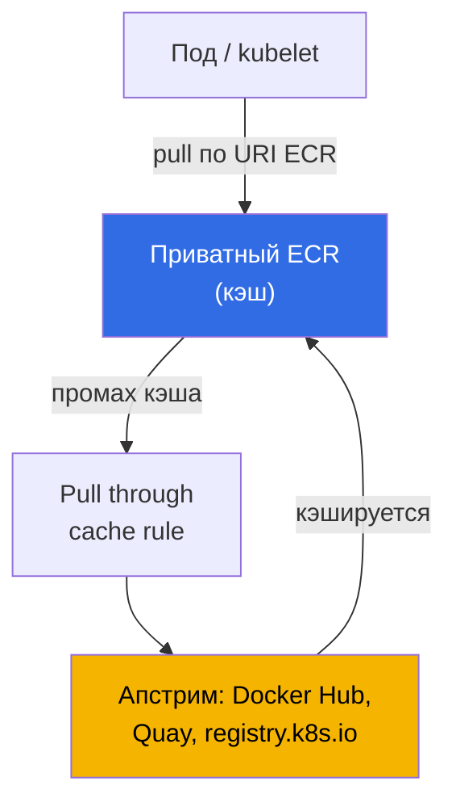
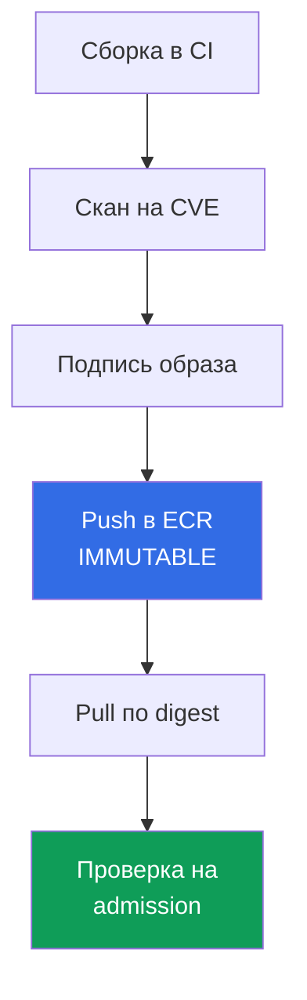

# Глава 20. Образы и supply chain: ECR, сканирование, подписи, pull through cache

> **Что дальше.** Часть 3 закрыла идентичность (главы 16-17), секреты (глава 18) и харденинг
> узла, пода и сети (глава 19). Эта глава - про то, что вообще запускается в кластере: откуда
> берётся образ, кто его проверил и тот ли он, что собрал CI. Разбираем ECR как реестр,
> сканирование на уязвимости, целостность через digest и подписи, pull through cache и
> lifecycle policy. Смежное - в других главах: роль ноды с правами на pull из ECR и AMI как
> образ **ноды** (не путать с образом контейнера) - глава 10; доступ подов к AWS (IRSA, Pod
> Identity) - главы 16-17; секреты внутри образов - глава 18; приватный кластер и VPC endpoints
> - глава 19; проверка подписи и реестра на admission (Kyverno, Gatekeeper) - глава 22; аудит,
> сканирование в рантайме и GuardDuty - глава 21; структура аккаунтов и OU, в которой живёт
> общий реестр, - глава 0.1.

## 20.1. «В прод уехал образ с критической CVE, потому что его никто не сканировал»

Приложение работает, дежурство спокойное - до отчёта безопасности: в проде крутится образ с
известной критической CVE, патч вышел полгода назад. CI собрал образ, запушил и задеплоил, а
между сборкой и продом не было ни одной проверки. Уязвимость никто не искал, потому что искать
было нечем и негде. Это не единичный отказ, а класс проблем supply chain - цепочки от исходника
до запущенного контейнера. Рядом живут родственные боли той же природы:

- **Rate limit и недоступность апстрима.** Половина образов тянется прямо с Docker Hub. В час
  пик прилетает `429 Too Many Requests` (anonymous pull limit), новые поды застревают в
  `ImagePullBackOff`, а выкатка встаёт. Внешний реестр стал вашей зависимостью в рантайме.
- **Подмена и typosquatting.** В манифесте `image: mycompany/paymets:latest` - опечатка в
  имени, и вместо вашего образа тянется чужой. Или CI собрал один образ, а в прод уехал другой:
  доказать, что это тот самый артефакт, нечем - подписи нет.
- **`latest` уехал из-под ног.** Деплой ссылается на `app:latest`. Кто-то перезаписал тег, и
  при следующем `pull` под получил другой образ, хотя манифест не менялся. Воспроизвести, что
  именно крутилось вчера, невозможно: тег - это ярлык, а не фиксированная версия.

Все четыре боли лечатся не одной галочкой, а выстроенной цепочкой: реестр, в котором лежит
артефакт, сканирование до прода, неизменность тега и деплой по digest, подпись и её проверка.

## 20.2. ECR как реестр

Amazon ECR (Elastic Container Registry) - управляемый реестр OCI-образов. Два вида: **приватные
репозитории** (адрес реестра `<account-id>.dkr.ecr.<region>.amazonaws.com`) и **публичные**
(`public.ecr.aws`). У каждого аккаунта в регионе есть свой приватный registry, внутри которого
живут репозитории; репозиторий хранит образы с тегами и digest.

Аутентификация - **не логин с паролем**, а временный токен через IAM. `get-login-password`
выдаёт токен на 12 часов, которым логинится docker:

```bash
# логин в приватный реестр: токен на 12 часов, пользователь всегда AWS
aws ecr get-login-password --region eu-central-1 \
  | docker login --username AWS --password-stdin 111122223333.dkr.ecr.eu-central-1.amazonaws.com
```

Доступ определяют два уровня политик. **IAM-политика** субъекта (кто и что может делать с ECR
вообще) и **repository policy** - resource-based политика на конкретном репозитории (кто может
`pull`/`push` именно в него). Для **cross-account** доступа настраивают repository policy (или
registry policy на весь registry), разрешающую другому аккаунту тянуть образы, - так строят
общий ECR на мультиаккаунт (глава 0.1). Ноде для `pull` права даёт роль ноды с политикой
`AmazonEC2ContainerRegistryReadOnly` (роль ноды - глава 10), поэтому kubelet тянет образ без
`imagePullSecrets`.

```bash
# создать репозиторий: неизменяемые теги + скан при пуше + шифрование своим ключом KMS
aws ecr create-repository --repository-name payments/api \
  --image-tag-mutability IMMUTABLE \
  --image-scanning-configuration scanOnPush=true \
  --encryption-configuration encryptionType=KMS,kmsKey=arn:aws:kms:eu-central-1:111122223333:key/abcd \
  --region eu-central-1
```

Ключевой выбор при создании - **мутабельность тегов**. `MUTABLE` (по умолчанию) позволяет
перезаписать тег другим образом - отсюда боль «`latest` уехал из-под ног». `IMMUTABLE`
запрещает перезапись: тег, однажды привязанный к digest, зафиксирован, повторный `push` того же
тега отклоняется. Для прода берут `IMMUTABLE`.

| Свойство | `MUTABLE` | `IMMUTABLE` |
|---|---|---|
| Перезапись существующего тега | разрешена | запрещена |
| `latest` может смениться незаметно | да | нет (тег занят) |
| Воспроизводимость по тегу | нет гарантии | тег = конкретный digest |
| Где уместно | песочница, черновики | прод, релизные образы |

### Один реестр на всю организацию

Раздавать образы из реестра каждого аккаунта означает размножить и сканирование, и lifecycle, и
подписи. Поэтому типовая схема мультиаккаунта из главы 0.1 - **один реестр в аккаунте общих
сервисов**, куда пушит CI, а кластеры `prod`, `stage` и `dev` только тянут. Выдавать доступ
поаккаунтно при этом не нужно: repository policy - обычная resource-based политика, поэтому в
ней работают глобальные ключи условий, и доступ выдаётся сразу всей организации через
`aws:PrincipalOrgID`.

```json
{
  "Version": "2012-10-17",
  "Statement": [{
    "Sid": "AllowPullFromOrg",
    "Effect": "Allow",
    "Principal": "*",
    "Action": ["ecr:BatchGetImage", "ecr:GetDownloadUrlForLayer"],
    "Condition": {"StringEquals": {"aws:PrincipalOrgID": "o-exampleorgid"}}
  }]
}
```

Новый аккаунт, попавший в организацию, получает доступ автоматически, а вышедший теряет его без
правки политики. Четыре вещи, о которых спотыкаются.

- **Repository policy не заменяет IAM-политику.** Для cross-account нужны оба разрешения: и
  политика репозитория, и права у вызывающей стороны. Плюс `ecr:GetAuthorizationToken` - право
  уровня аккаунта, в политике репозитория его не задать; у нод EKS его даёт та же
  managed-политика роли ноды (глава 10).
- **Правило на весь реестр, а не на репозиторий.** Вместо политики на каждом репозитории берут
  **registry policy** - она действует на весь registry аккаунта. А репозитории, которые ECR
  создаёт сам (кэш, репликация), настраивает repository creation template (раздел 20.5).
- **Приватные кластеры.** Pull из чужого аккаунта через interface endpoint работает, но сам
  endpoint живёт в аккаунте-читателе, и его endpoint policy обязана разрешать чужой ресурс
  (главы 0.3 и 19), иначе образ не скачается при верной политике репозитория.
- **Регион и трафик.** Кластер в другом регионе тянет слои через границу региона: это и
  латентность старта пода, и трафик в счёте. Ответ - **репликация реестра**: правила
  cross-region и cross-account копируют образы туда, где их тянут. Для cross-account репликации
  аккаунт-получатель вешает у себя registry policy с `ecr:CreateRepository` и
  `ecr:ReplicateImage` для аккаунта-источника, а копируются только образы, запушенные после
  настройки правила.

Цена централизации честная: реестр становится общей зависимостью со своим владельцем, своими
квотами API и своим взрывным радиусом. Поэтому прод часто держит реплику в своём аккаунте или
регионе - источник истины один, а точка отказа при выкатке не одна.

Вторая настройка на создании и **тоже неизменяемая после** - шифрование at rest. По умолчанию
слои шифруются ключами S3 (SSE-S3, AES-256, без действий с вашей стороны). Для контроля над
ключом задают `encryptionType=KMS`: либо AWS-managed ключ `aws/ecr`, либо свой customer managed
key (должен лежать в том же регионе, что и репозиторий). Как и мутабельность, encryption
configuration после создания не меняется - только пересозданием репозитория.

## 20.3. Сканирование на уязвимости

ECR умеет искать известные CVE в образах. Есть два режима, и это выбор на весь registry, а не
на репозиторий.

- **Basic scanning** - технология ECR по базе CVE, сканирует **уязвимости ОС-пакетов**.
  Две частоты: вручную и scan on push (при пуше). Findings отдаёт `DescribeImageScanFindings`.
- **Enhanced scanning** - интеграция с **Amazon Inspector**: сканирует уязвимости **ОС и
  пакетов языков программирования** (npm, pip, gem и др.), и делает это **непрерывно**. Когда
  появляется новая CVE, результаты по уже лежащим образам обновляются сами, а Inspector шлёт
  событие в EventBridge. Две частоты: scan on push и continuous scan.

```bash
# включить basic scan on push на уровне registry
aws ecr put-registry-scanning-configuration --scan-type BASIC \
  --rules '[{"scanFrequency":"SCAN_ON_PUSH","repositoryFilters":[{"filter":"*","filterType":"WILDCARD"}]}]'

# разовый скан конкретного образа и просмотр findings по severity
aws ecr start-image-scan --repository-name payments/api --image-id imageTag=1.4.2
aws ecr describe-image-scan-findings --repository-name payments/api --image-id imageTag=1.4.2
```

Findings приходят с severity (`CRITICAL`, `HIGH`, `MEDIUM`, ...) и ссылкой на CVE. Само по себе
сканирование ничего не блокирует - это сигнал. Чтобы образ с критическими findings **не уехал в
прод**, сканирование встраивают в процесс: gate в CI (не пушить/не деплоить при `CRITICAL`) и
проверка на admission политикой (Kyverno или Gatekeeper - глава 22). ECR находит уязвимость,
политика решает, пускать ли такой образ.

| Свойство | Basic scanning | Enhanced scanning (Inspector) |
|---|---|---|
| Что сканирует | ОС-пакеты | ОС + пакеты языков (npm, pip, ...) |
| Частота | вручную, scan on push | scan on push, непрерывно |
| Переоценка по новым CVE | нет | да, автоматически |
| Уведомления | - | событие в EventBridge |
| Где уместно | минимум, песочница | прод, постоянный контроль |

Переключение между basic и enhanced сбрасывает ранее выполненные сканы: их придётся настроить
заново (при возврате к прежнему типу старые результаты снова доступны).

## 20.4. Целостность образа: digest, теги и подписи

Тег - это подвижный ярлык на образ. Настоящий неизменяемый идентификатор образа - его
**digest**: `sha256`-хеш содержимого. Один и тот же digest всегда указывает на один и тот же
образ; изменилось содержимое - изменился digest. Отсюда правило: в прод деплоить **по digest**,
а не по тегу.

```bash
# pull по digest - гарантия, что это ровно тот образ, что собрал CI
docker pull 111122223333.dkr.ecr.eu-central-1.amazonaws.com/payments/api@sha256:9f2c...e41a
```

```yaml
# в манифесте пода ссылка по digest фиксирует содержимое образа намертво
spec:
  containers:
    - name: api
      image: 111122223333.dkr.ecr.eu-central-1.amazonaws.com/payments/api@sha256:9f2c...e41a
```

Почему `latest` опасен: это `MUTABLE`-тег по смыслу - он всегда «последний», и под ногами он
меняется. Даже фиксированный тег `1.4.2` в `MUTABLE`-репозитории можно перезаписать. Связка
надёжности: `IMMUTABLE`-репозиторий (тег нельзя перезаписать) плюс деплой по digest (ссылка на
содержимое, а не на ярлык).

Digest защищает от **случайной** подмены, но не доказывает, **кто** собрал образ. Это решает
**подпись**. Образ подписывают при сборке (`cosign` из проекта Sigstore или Notation/Notary
Project; AWS Signer как управляемый сервис подписи), а на входе в кластер подпись
**проверяют** на admission - правилом Kyverno `verifyImages` или Sigstore
policy-controller (глава 22). Только образ с валидной подписью
доверенного ключа допускается к запуску - так закрываются подмена и typosquatting из 20.1.

## 20.5. Pull through cache

Pull through cache решает боль с Docker Hub rate limit и недоступностью апстрима. ECR
**кэширует образы из внешнего реестра в вашем приватном ECR по запросу**: вы тянете образ через
URI своего registry, ECR при первом обращении сам создаёт репозиторий и кэширует образ, а на
последующих запросах по тегу не реже чем **раз в 24 часа** проверяет апстрим на новую версию
этого тега и обновляет кэш.



Зачем это в EKS:

- **Обход rate limit Docker Hub** - тянете из своего ECR, а не анонимно из Docker Hub.
- **Доступность** - апстрим лёг, а в кэше образ уже есть.
- **Приватный кластер без выхода в интернет** (глава 19) - ноды ходят только в ECR через VPC
  endpoints, а не в интернет за внешними образами.
- **Единая точка сканирования** - закэшированные образы лежат в вашем ECR и попадают под тот же
  скан и те же политики, что и собственные.

Поддерживаемые апстримы (по документации AWS): **без аутентификации** - Amazon ECR Public,
Kubernetes registry (`registry.k8s.io`) и Quay; **с аутентификацией** через секрет в AWS
Secrets Manager - Docker Hub, Microsoft Azure Container Registry, GitHub Container Registry,
GitLab (SaaS) и Chainguard; **Amazon ECR** (cross-account) - через IAM-роль.

```bash
# правило для Docker Hub: префикс docker-hub, креды в Secrets Manager
aws ecr create-pull-through-cache-rule --ecr-repository-prefix docker-hub \
  --upstream-registry-url registry-1.docker.io \
  --credential-arn arn:aws:secretsmanager:eu-central-1:111122223333:secret:ecr-pullthroughcache/dh
```

После этого ссылаются на образ через URI своего registry с префиксом правила:

```yaml
# было docker.io/library/nginx:1.27 - стало через кэш ECR
image: 111122223333.dkr.ecr.eu-central-1.amazonaws.com/docker-hub/library/nginx:1.27
```

Тонкость: репозитории, которые ECR заводит под кэш сам, по умолчанию идут с `MUTABLE`-тегами,
шифрованием SSE-S3 и без lifecycle policy - настройки из 20.2 и 20.6 к ним не применяются
сами собой. Чтобы кэш-репозитории наследовали ключ KMS, автоочистку и неизменность тега,
заводят **repository creation template** с тем же префиксом, что и правило кэша:

```bash
# шаблон на префикс docker-hub: кэш-репозитории получат ключ KMS и lifecycle policy
aws ecr create-repository-creation-template --prefix docker-hub --applied-for PULL_THROUGH_CACHE \
  --encryption-configuration encryptionType=KMS,kmsKey=arn:aws:kms:eu-central-1:111122223333:key/abcd \
  --lifecycle-policy file://lifecycle.json
```

Шаблон действует только в момент создания репозитория и через него же задают repository
policy и неизменность тегов (с исключениями для подвижных тегов кэша вроде `latest`).

## 20.6. Lifecycle policy: автоочистка репозитория

Без уборки репозиторий растёт бесконечно: копятся старые теги и незатегированные слои, а вместе
с ними - старые уязвимые образы, которые кто-нибудь ещё может задеплоить. **Lifecycle policy**
задаёт правила автоудаления по возрасту или количеству образов.

```bash
# оставить 10 последних образов с тегом v, остальное удалять
aws ecr put-lifecycle-policy --repository-name payments/api --lifecycle-policy-text '{
  "rules": [{
    "rulePriority": 1,
    "description": "keep last 10 tagged",
    "selection": {"tagStatus":"tagged","tagPrefixList":["v"],"countType":"imageCountMoreThan","countNumber":10},
    "action": {"type": "expire"}
  }]
}'
```

Типовые правила: удалять untagged-образы старше N дней, хранить не больше N образов по префиксу
тега. Это и экономит хранилище, и снижает риск, что из репозитория поднимут древний уязвимый
образ. Правила выражаются через `tagStatus` (`tagged`/`untagged`/`any`), `countType` по
возрасту (`sinceImagePushed`) или количеству (`imageCountMoreThan`).

## 20.7. Приватный кластер и образы

В приватном кластере (глава 19) ноды без выхода в интернет тянут образы из ECR **только через
VPC endpoints**. Для `pull` нужны три: интерфейсные `ecr.api` (вызовы API ECR, в том числе
аутентификация) и `ecr.dkr` (сам docker-протокол pull), и **gateway-endpoint `s3`** - потому
что **слои образов физически лежат в S3**. Без S3-endpoint `ecr.api` и `ecr.dkr` есть, а образ
всё равно не скачается: слои не дойдут. Это та же таблица endpoints, что в главе 19; здесь
важно, что pull образа завязан на связку ECR + S3, а pull through cache в таком кластере
становится единственным способом дотянуться до внешних образов, не открывая нодам интернет.

## 20.8. Supply chain как цепочка

Отдельные приёмы складываются в одну цепочку от сборки до запуска. Разрыв в любом звене
обесценивает остальные.



| Звено | Что даёт | Где разрыв |
|---|---|---|
| Скан на CVE | известные уязвимости видны до прода | образ не сканируется вообще |
| Push в ECR `IMMUTABLE` | тег нельзя перезаписать | `MUTABLE` - тег уехал из-под ног |
| Pull по digest | запускается ровно собранный артефакт | деплой по `latest`/тегу |
| Проверка подписи на admission | допущен только доверенный образ | подпись не проверяется |

Читается так: CI собирает образ, сканирует (20.3), подписывает (20.4), пушит в `IMMUTABLE`-ECR
(20.2), кластер тянет по digest, а admission-политика (глава 22) проверяет подпись и источник.
Несканированный образ, `MUTABLE`-тег, деплой по `latest` или отсутствие проверки подписи - это
точки, где цепочка рвётся и возвращаются боли из 20.1.

## 20.9. Как это применяют в продакшене

- **Enhanced scanning на весь registry.** Непрерывный скан Inspector ловит CVE, возникшие
  уже после пуша, и шлёт событие в EventBridge - а не проверяет образ один раз при пуше.
- **Immutable-теги и деплой по digest.** Репозитории создают с `IMMUTABLE`, а нагрузки
  ссылаются на образ по `@sha256:` - тег не перезапишешь, и запускается ровно то, что собрали.
- **Pull through cache вместо прямого Docker Hub.** Внешние образы тянут через кэш в ECR: нет
  зависимости от rate limit и доступности апстрима, всё под единым сканом и политиками. А
  настройки кэш-репозиториев (KMS, lifecycle, immutability) навешивают repository creation
  template по префиксу правила.
- **Lifecycle policy на каждый репозиторий.** Автоочистка старых и untagged-образов держит
  репозиторий в размере и не даёт поднять древний уязвимый образ.
- **Подпись и её проверка на admission.** Образы подписывают в CI (cosign, Notation, AWS
  Signer), а на входе в кластер политика (глава 22) пускает только валидно подписанные.
- **Cross-account через общий ECR.** В мультиаккаунте (глава 0.1) образы держат в registry
  с repository policy на доступ другим аккаунтам, а не дублируют по аккаунтам.

## 20.10. Мини-глоссарий

- **ECR** - управляемый реестр OCI-образов AWS; приватный registry на аккаунт-регион с адресом
  `<account-id>.dkr.ecr.<region>.amazonaws.com` и публичный `public.ecr.aws`.
- **Digest** - `sha256`-хеш содержимого образа, неизменяемый идентификатор; деплой по digest
  гарантирует запуск ровно собранного артефакта, в отличие от подвижного тега.
- **Tag immutability** - режим репозитория `IMMUTABLE`, запрещающий перезапись тега другим
  образом; `MUTABLE` (по умолчанию) перезапись разрешает.
- **Basic / Enhanced scanning** - режимы поиска CVE в ECR: basic - ОС-пакеты нативно; enhanced
  - ОС и пакеты языков через Amazon Inspector, непрерывно.
- **Pull through cache** - правило ECR, кэширующее образы внешнего реестра (Docker Hub, Quay,
  `registry.k8s.io` и др.) в вашем приватном ECR по запросу.
- **Lifecycle policy** - правила автоудаления образов по возрасту или количеству.
- **Repository policy и registry policy** - resource-based политики на один репозиторий и на
  весь registry аккаунта; в них работает `aws:PrincipalOrgID`, поэтому pull выдаётся сразу всей
  организации, без перечисления аккаунтов. `ecr:GetAuthorizationToken` в них не задаётся - это
  право уровня аккаунта в IAM-политике вызывающего.
- **Replication configuration** - правила ECR, копирующие образы в другие регионы и аккаунты;
  для cross-account аккаунт-получатель разрешает источнику `ecr:CreateRepository` и
  `ecr:ReplicateImage` в своей registry policy.
- **Repository creation template** - шаблон настроек (шифрование, lifecycle, immutability,
  policy) для репозиториев, которые ECR создаёт сам под pull through cache по префиксу; без
  него кэш-репозиторий получает дефолты (`MUTABLE`, SSE-S3, без политик).
- **Encryption at rest** - шифрование слоёв в ECR: по умолчанию SSE-S3 (AES-256), опционально
  SSE-KMS ключом `aws/ecr` или своим customer managed key; задаётся на создании и неизменно.

## 20.11. Итоги главы

- Supply chain-боли (несканированная CVE в проде, rate limit Docker Hub, подмена образа,
  уехавший `latest`) лечатся цепочкой: реестр, скан, неизменность, digest, подпись.
- ECR - приватный registry на аккаунт-регион; аутентификация через IAM-токен
  (`get-login-password`), не пароль. Доступ - IAM плюс repository policy, cross-account
  - через repository/registry policy. Ноде pull даёт роль ноды (глава 10).
- Мутабельность тега - ключевой выбор: `IMMUTABLE` фиксирует связь тег-digest, `MUTABLE` даёт
  уехать `latest` из-под ног. Для прода - `IMMUTABLE` и деплой по `@sha256:`.
- Сканирование: basic (ОС-пакеты, вручную/scan on push) и enhanced (ОС + языки, непрерывно,
  Inspector, события в EventBridge). Само не блокирует - решает политика admission (глава 22).
- Целостность: digest защищает от подмены, подпись (cosign, Notation, AWS Signer) - от
  умышленной; проверка подписи на входе в кластер - политикой Kyverno/Gatekeeper (глава 22).
- Pull through cache кэширует внешние образы в ECR (обход rate limit, доступность, приватный
  кластер, единый скан). Lifecycle policy чистит старое. Pull в приватном кластере - через
  `ecr.api`, `ecr.dkr` и S3-endpoint (слои в S3, глава 19).

## 20.12. Как это пригодится в реальной работе

Вопрос «а тот ли это образ, что собрал CI» с деплоем по digest и проверкой подписи отвечается
самим манифестом, а не расследованием. Инцидент «выкатка встала, `ImagePullBackOff` от Docker
Hub rate limit» не случается там, где образы идут через pull through cache в ECR. На дежурстве
«в проде критическая CVE» превращается из отчёта постфактум в блок ещё на admission, потому что
enhanced scanning нашёл её, а политика не пустила. А `IMMUTABLE`-репозиторий и digest снимают
целый класс «оно вчера работало, а сегодня другой образ» - тег больше не ярлык, что меняется
под ногами.

## 20.13. Вопросы для самопроверки

1. Какие четыре supply chain-боли перечислены в 20.1 и что в цепочке закрывает каждую?
2. Как выглядит адрес приватного реестра ECR и чем аутентификация в ECR отличается от пароля?
3. Какими двумя политиками управляется доступ к репозиторию и как дают cross-account pull?
4. Кто и за счёт чего даёт ноде право тянуть образы из ECR без `imagePullSecrets`?
5. Чем `IMMUTABLE`-репозиторий отличается от `MUTABLE` и почему для прода берут первый?
6. Чем basic scanning отличается от enhanced и что даёт интеграция с Amazon Inspector?
7. Само сканирование блокирует деплой уязвимого образа? Если нет, что блокирует и где?
8. Почему деплой по digest надёжнее деплоя по тегу и чем digest отличается от тега?
9. От чего защищает digest, а от чего - подпись, и где подпись проверяется?
10. Что делает pull through cache и какие апстримы требуют аутентификации, а какие нет?
11. Зачем pull through cache в приватном кластере без выхода в интернет?
12. Зачем нужна lifecycle policy и по каким критериям она удаляет образы?
13. Почему в приватном кластере для pull образа нужен ещё и S3 VPC endpoint, а не только ECR?
14. Чем отличается шифрование ECR по умолчанию от SSE-KMS и когда конфигурацию уже не сменить?
15. Какие настройки получают кэш-репозитории по умолчанию и чем задать им KMS и lifecycle?
16. Как выдать pull из одного реестра сразу всей организации и почему одной repository policy
    для cross-account недостаточно?
17. Кластер в другом регионе тянет образы из общего реестра. Что вы измените и какие права
    нужны аккаунту-получателю?

## Практика

Лаба курса к этой теме: [лаба 130 - ECR и supply chain: неизменяемые теги, скан при пуше,
pull through cache](../../labs/130/README_RU.MD). Там репозиторий с `IMMUTABLE` и
`scanOnPush`, отказ реестра на повторный push тега, разбор findings и границы применимости
сканера, деплой по digest из приватного ECR и два pull through cache - без аутентификации и с
секретом. Результат проверяется командой `check_result`.

Ниже - то же самое на своём аккаунте. Создайте
репозиторий с `--image-tag-mutability IMMUTABLE` и `--image-scanning-configuration
scanOnPush=true`, залогиньтесь через `aws ecr get-login-password | docker login`, запушите
образ и посмотрите findings: `aws ecr describe-image-scan-findings --repository-name <repo>
--image-id imageTag=<tag>`. Попробуйте перезаписать тег - `IMMUTABLE` отклонит push. Возьмите
digest образа (`aws ecr describe-images ... --query 'imageDetails[].imageDigest'`) и задеплойте
под по `@sha256:` вместо тега.

Дальше pull through cache: `aws ecr create-pull-through-cache-rule` для Quay или
`registry.k8s.io` (без секрета) либо для Docker Hub (с секретом в Secrets Manager), затем
потяните образ через URI своего registry с префиксом правила и убедитесь, что в ECR появился
закэшированный репозиторий. Навесьте lifecycle policy командой `aws ecr put-lifecycle-policy` и
проверьте предпросмотр удаления через `aws ecr get-lifecycle-policy-preview`. Проверку подписи
на admission оставьте на главу 22.

---
[Оглавление](../README_RU.md) · [Глава 19](../19/ru.md) · [Глава 21](../21/ru.md)
