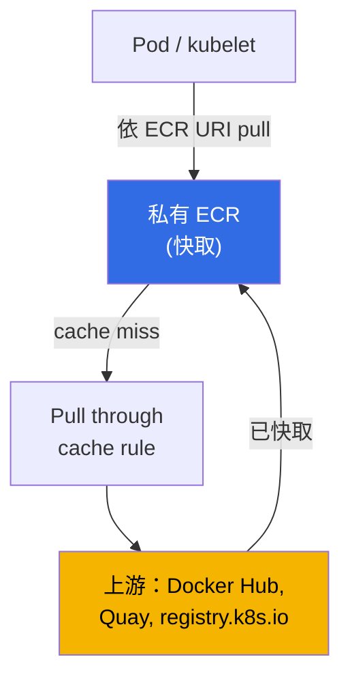
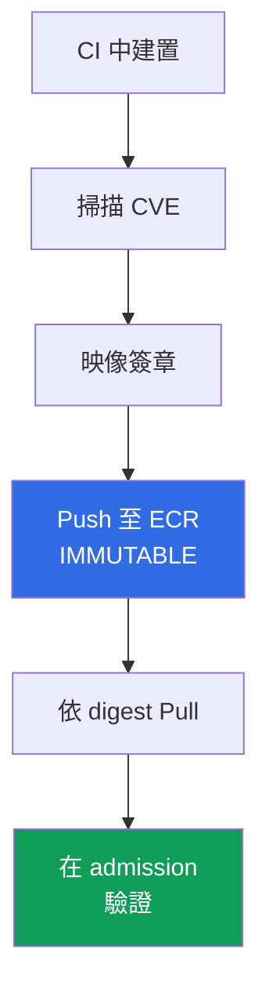

[English version](en.md) · [Versión en español](es.md) · [Version française](fr.md) · [Deutsche Version](de.md) · [ქართული ვერსია](ge.md) · [Русская версия](ru.md) · [日本語版](jp.md)
# 第 20 章。映像與 supply chain：ECR、掃描、簽章、pull through cache

> **接下來。** 第 3 部分已涵蓋身分識別（第 16-17 章）、Secret（第 18 章）以及節點、Pod 與網路的強化（第 19 章）。本章討論叢集中實際執行的內容：映像從何而來、誰驗證過它，以及它是否就是 CI 建置的那個映像。我們將介紹作為 registry 的 ECR、弱點掃描、透過 digest 與簽章確保完整性、pull through cache 及 lifecycle policy。相關主題位於其他章節：具備從 ECR pull 權限的節點角色，以及 AMI 作為**節點**映像（不要與容器映像混淆），見第 10 章；Pod 對 AWS 的存取（IRSA、Pod Identity）見第 16-17 章；映像中的 Secret 見第 18 章；私有叢集與 VPC endpoints 見第 19 章；在 admission 時驗證簽章與 registry（Kyverno、Gatekeeper）見第 22 章；稽核、執行階段掃描與 GuardDuty 見第 21 章；共用 registry 所在的帳戶與 OU 結構見第 0.1 章。

## 20.1.「含有嚴重 CVE 的映像進了 production，因為沒有人掃描它」

應用程式正常運作，值班平靜無事，直到安全報告指出：production 正在執行一個已知嚴重 CVE 的映像，而修補程式半年前就已發布。CI 建置、push 並部署了映像，但建置與 production 之間沒有任何檢查。沒有人尋找弱點，因為沒有工具也沒有地方可找。這不是單一故障，而是一類 supply chain 問題，也就是從原始碼到執行中容器的鏈路。同樣性質還有以下相關痛點：

- **Rate limit 與上游不可用。** 一半映像直接從 Docker Hub pull。尖峰時段收到 `429 Too Many Requests`（anonymous pull limit），新的 Pod 卡在 `ImagePullBackOff`，rollout 停擺。外部 registry 成為執行階段的相依項。
- **替換與 typosquatting。** manifest 中有 `image: mycompany/paymets:latest`，名稱拼錯，結果 pull 的是其他人的映像而非你的映像。或者 CI 建置了一個映像，但進到 production 的是另一個：沒有簽章，無法證明它就是該 artifact。
- **`latest` 從腳下滑走。** 部署參照 `app:latest`。有人覆寫該 tag，下一次 `pull` 時 Pod 取得不同的映像，即使 manifest 未變。無法重現昨天實際執行的是什麼：tag 是標籤，而不是固定版本。

這四種痛點不是靠單一核取方塊解決，而是透過完整鏈路：存放 artifact 的 registry、production 前的掃描、tag 不可變性與依 digest 部署、簽章及其驗證。

## 20.2. ECR 作為 registry

Amazon ECR（Elastic Container Registry）是受管的 OCI 映像 registry。有兩種類型：**私有 repositories**（registry 位址為 `<account-id>.dkr.ecr.<region>.amazonaws.com`）與**公開 repositories**（`public.ecr.aws`）。每個帳戶在每個區域都有自己的私有 registry，其中包含 repositories；repository 儲存帶有 tag 與 digest 的映像。

驗證**不是使用者名稱與密碼登入**，而是透過 IAM 取得暫時 token。`get-login-password` 會簽發有效 12 小時的 token，docker 使用它登入：

```bash
# 登入私有 registry：token 有效 12 小時，使用者一律是 AWS
aws ecr get-login-password --region eu-central-1 \
  | docker login --username AWS --password-stdin 111122223333.dkr.ecr.eu-central-1.amazonaws.com
```

存取由兩層政策決定。主體的 **IAM policy**（誰能對 ECR 做什麼）以及 **repository policy**，即針對特定 repository 的 resource-based policy（誰能對它 `pull`/`push`）。對於 **cross-account** 存取，設定允許其他帳戶 pull 映像的 repository policy（或針對整個 registry 的 registry policy），以此在多帳戶環境中建立共用 ECR（第 0.1 章）。節點的 `pull` 權限由帶有 `AmazonEC2ContainerRegistryReadOnly` policy 的節點角色授予（節點角色見第 10 章），因此 kubelet 不需要 `imagePullSecrets` 即可 pull 映像。

```bash
# 建立 repository：不可變 tag + push 時掃描 + 使用自有 KMS 金鑰加密
aws ecr create-repository --repository-name payments/api \
  --image-tag-mutability IMMUTABLE \
  --image-scanning-configuration scanOnPush=true \
  --encryption-configuration encryptionType=KMS,kmsKey=arn:aws:kms:eu-central-1:111122223333:key/abcd \
  --region eu-central-1
```

建立時的關鍵選擇是 **tag mutability**。`MUTABLE`（預設）允許以另一個映像覆寫 tag，因此會出現「`latest` 從腳下滑走」的問題。`IMMUTABLE` 禁止覆寫：一旦 tag 綁定 digest 就被固定，對同一 tag 再次 `push` 會被拒絕。production 應使用 `IMMUTABLE`。

| 特性 | `MUTABLE` | `IMMUTABLE` |
|---|---|---|
| 覆寫既有 tag | 允許 | 禁止 |
| `latest` 能在未察覺下變更 | 是 | 否（tag 已被占用） |
| 依 tag 的可重現性 | 無保證 | tag = 特定 digest |
| 適用位置 | sandbox、草稿 | production、release 映像 |

### 整個組織共用一個 registry

從每個帳戶的 registry 發布映像，意味著掃描、lifecycle 與簽章都要重複配置。因此第 0.1 章的典型多帳戶架構是：**在 shared services 帳戶中使用一個 registry**，CI 向其中 push，而 `prod`、`stage` 與 `dev` 叢集只負責 pull。無須逐一向帳戶授權：repository policy 是一般的 resource-based policy，因此支援全域條件 key，可透過 `aws:PrincipalOrgID` 一次授權給整個組織。

```json
{
  "Version": "2012-10-17",
  "Statement": [{
    "Sid": "AllowPullFromOrg",
    "Effect": "Allow",
    "Principal": "*",
    "Action": ["ecr:BatchGetImage", "ecr:GetDownloadUrlForLayer"],
    "Condition": {"StringEquals": {"aws:PrincipalOrgID": "o-exampleorgid"}}
  }]
}
```

加入組織的新帳戶會自動取得存取權，離開的帳戶也會無須修改政策即失去存取權。有四個常見陷阱。

- **Repository policy 不會取代 IAM policy。** cross-account 需要兩種許可：repository policy 和呼叫端的權限。此外，`ecr:GetAuthorizationToken` 是帳戶層級權限，無法寫入 repository policy；EKS 節點從同一個節點角色 managed policy 取得它（第 10 章）。
- **規則套用整個 registry，而非單一 repository。** 不必為每個 repository 設定 policy，可以使用 **registry policy**，它對帳戶的整個 registry 生效。對於 ECR 自行建立的 repositories（cache、replication），則使用 repository creation template 設定（第 20.5 節）。
- **私有叢集。** 透過 interface endpoint 從其他帳戶 pull 是可行的，但 endpoint 本身位於讀取方帳戶，且其 endpoint policy 必須允許該外部資源（第 0.3 與 19 章），否則即使 repository policy 正確也無法下載映像。
- **區域與流量。** 位於另一個區域的叢集會跨區域 pull layers：這會增加 Pod 啟動延遲及流量費用。解法是 **registry replication**：cross-region 與 cross-account 規則會將映像複製到 pull 它們的位置。對於 cross-account replication，接收帳戶必須在自己的 registry policy 中，授予來源帳戶 `ecr:CreateRepository` 與 `ecr:ReplicateImage`，且只會複製在設定規則後 push 的映像。

集中化的代價很明確：registry 會成為有自己負責人、API quotas 與 blast radius 的共同相依項。因此 production 通常在自己的帳戶或區域保有 replica：source of truth 只有一個，但 rollout 的故障點不只一個。

建立時的第二個設定，且**之後同樣不可變更**，是 at rest encryption。預設情況下，layers 以 S3 金鑰加密（SSE-S3、AES-256，無須你的操作）。若要控制金鑰，設定 `encryptionType=KMS`：使用 AWS-managed `aws/ecr` key 或自己的 customer managed key（必須與 repository 位於相同區域）。如同 mutability，建立後不能變更 encryption configuration，只能重建 repository。

## 20.3. 弱點掃描

ECR 能尋找映像中已知的 CVE。有兩種模式，這是針對整個 registry 而非單一 repository 的選擇。

- **Basic scanning**：ECR 使用 CVE 資料庫的技術，掃描**OS packages 的弱點**。有兩種頻率：手動與 scan on push（push 時）。Findings 透過 `DescribeImageScanFindings` 取得。
- **Enhanced scanning**：與 **Amazon Inspector** 整合，掃描**OS 與程式語言 packages**（npm、pip、gem 等）的弱點，並且**持續進行**。出現新 CVE 時，既有映像的結果會自行更新，Inspector 會向 EventBridge 傳送事件。有兩種頻率：scan on push 與 continuous scan。

```bash
# 在 registry 層級啟用 basic scan on push
aws ecr put-registry-scanning-configuration --scan-type BASIC \
  --rules '[{"scanFrequency":"SCAN_ON_PUSH","repositoryFilters":[{"filter":"*","filterType":"WILDCARD"}]}]'

# 對特定映像進行一次掃描，並依 severity 查看 findings
aws ecr start-image-scan --repository-name payments/api --image-id imageTag=1.4.2
aws ecr describe-image-scan-findings --repository-name payments/api --image-id imageTag=1.4.2
```

Findings 包含 severity（`CRITICAL`、`HIGH`、`MEDIUM`、...）及 CVE 連結。掃描本身不會阻擋任何事，它只是訊號。為防止有嚴重 findings 的映像**進入 production**，要將掃描納入流程：在 CI 設置 gate（若有 `CRITICAL` 則不 push 或部署），並以 admission policy 驗證（Kyverno 或 Gatekeeper，見第 22 章）。ECR 找出弱點，policy 決定是否允許映像。

| 特性 | Basic scanning | Enhanced scanning (Inspector) |
|---|---|---|
| 掃描內容 | OS packages | OS + 程式語言 packages（npm、pip、...） |
| 頻率 | 手動、scan on push | scan on push、持續掃描 |
| 新 CVE 的重新評估 | 否 | 是，自動 |
| 通知 | - | EventBridge 事件 |
| 適用位置 | 最低限度、sandbox | production、持續控制 |

在 basic 與 enhanced 之間切換會重設先前執行的掃描：必須重新設定它們（切回原先類型時，舊結果會再次可用）。

## 20.4. 映像完整性：digest、tag 與簽章

Tag 是映像的可移動標籤。真正不可變的映像識別碼是其 **digest**：內容的 `sha256` hash。同一個 digest 永遠指向同一映像；內容變更，digest 就變更。因此規則是：production 應依 **digest** 部署，而不是依 tag。

```bash
# 依 digest pull：保證這正是 CI 建置的映像
docker pull 111122223333.dkr.ecr.eu-central-1.amazonaws.com/payments/api@sha256:9f2c...e41a
```

```yaml
# Pod manifest 中依 digest 的參照會永久固定映像內容
spec:
  containers:
    - name: api
      image: 111122223333.dkr.ecr.eu-central-1.amazonaws.com/payments/api@sha256:9f2c...e41a
```

`latest` 為何危險：就其含義而言，它是 `MUTABLE` tag，永遠代表「最新」，且可能在你腳下改變。即使固定 tag `1.4.2`，在 `MUTABLE` repository 中仍可被覆寫。可靠性的組合是：`IMMUTABLE` repository（tag 無法覆寫）加上依 digest 部署（參照內容而不是標籤）。

Digest 能防止**意外的**替換，卻無法證明**誰**建置映像。這由**簽章**解決。在建置時簽署映像（Sigstore 專案的 `cosign` 或 Notation/Notary Project；AWS Signer 作為受管簽章服務），並在進入叢集時於 admission **驗證**簽章，使用 Kyverno 的 `verifyImages` rule 或 Sigstore policy-controller（第 22 章）。只有受信任 key 簽署且簽章有效的映像可執行，因而避免 20.1 節中的替換與 typosquatting。

## 20.5. Pull through cache

Pull through cache 解決 Docker Hub rate limit 與上游不可用的問題。ECR **依請求將外部 registry 映像快取到你的私有 ECR**：你經由自己 registry 的 URI pull 映像，ECR 在首次請求時自行建立 repository 並快取映像，之後依 tag 請求時，至少**每 24 小時一次**向上游檢查該 tag 是否有新版並更新快取。



這在 EKS 中的用途：

- **繞過 Docker Hub rate limit**：從自己的 ECR pull，而不是匿名從 Docker Hub pull。
- **可用性**：上游停擺時，映像仍可能已在快取中。
- **無網際網路出口的私有叢集**（第 19 章）：節點僅透過 VPC endpoints 存取 ECR，而不是連上網際網路取得外部映像。
- **統一掃描點**：快取映像位於你的 ECR，與自建映像一樣受到相同掃描及 policy 管理。

支援的上游（依 AWS 文件）：**無須驗證**的有 Amazon ECR Public、Kubernetes registry（`registry.k8s.io`）及 Quay；透過 AWS Secrets Manager 中 Secret 進行**驗證**的有 Docker Hub、Microsoft Azure Container Registry、GitHub Container Registry、GitLab（SaaS）及 Chainguard；**Amazon ECR**（cross-account）透過 IAM role。

```bash
# Docker Hub 規則：prefix 為 docker-hub，憑證存於 Secrets Manager
aws ecr create-pull-through-cache-rule --ecr-repository-prefix docker-hub \
  --upstream-registry-url registry-1.docker.io \
  --credential-arn arn:aws:secretsmanager:eu-central-1:111122223333:secret:ecr-pullthroughcache/dh
```

之後，透過帶有 rule prefix 的自有 registry URI 參照映像：

```yaml
# 原為 docker.io/library/nginx:1.27，改為經由 ECR cache
image: 111122223333.dkr.ecr.eu-central-1.amazonaws.com/docker-hub/library/nginx:1.27
```

一項細節：ECR 自行為 cache 建立的 repositories，預設使用 `MUTABLE` tags、SSE-S3 encryption，且沒有 lifecycle policy，20.2 與 20.6 節的設定不會自動套用。若要讓 cache repositories 繼承 KMS key、自動清理及 tag immutability，請建立與 cache rule 同 prefix 的 **repository creation template**：

```bash
# docker-hub prefix 的 template：cache repositories 將取得 KMS key 與 lifecycle policy
aws ecr create-repository-creation-template --prefix docker-hub --applied-for PULL_THROUGH_CACHE \
  --encryption-configuration encryptionType=KMS,kmsKey=arn:aws:kms:eu-central-1:111122223333:key/abcd \
  --lifecycle-policy file://lifecycle.json
```

Template 僅在 repository 建立時生效，亦可透過它設定 repository policy 與 tag immutability（對於如 `latest` 的移動式 cache tag 可設例外）。

## 20.6. Lifecycle policy：自動清理 repository

若不清理，repository 會無限成長：舊 tag 和 untagged layers 持續累積，連同可能仍被人部署的舊弱點映像。**Lifecycle policy** 定義依年齡或映像數量進行自動刪除的規則。

```bash
# 保留帶有 v tag 的最新 10 個映像，刪除其他映像
aws ecr put-lifecycle-policy --repository-name payments/api --lifecycle-policy-text '{
  "rules": [{
    "rulePriority": 1,
    "description": "keep last 10 tagged",
    "selection": {"tagStatus":"tagged","tagPrefixList":["v"],"countType":"imageCountMoreThan","countNumber":10},
    "action": {"type": "expire"}
  }]
}'
```

典型規則包括：刪除超過 N 天的 untagged 映像，或針對 tag prefix 最多保留 N 個映像。這既節省儲存空間，也降低從 repository 啟動過時弱點映像的風險。規則透過 `tagStatus`（`tagged`/`untagged`/`any`）與按年齡（`sinceImagePushed`）或數量（`imageCountMoreThan`）的 `countType` 表示。

## 20.7. 私有叢集與映像

在私有叢集（第 19 章）中，沒有網際網路出口的節點只能**透過 VPC endpoints** 從 ECR pull 映像。`pull` 需要三個 endpoint：interface `ecr.api`（ECR API 呼叫，包括驗證）與 `ecr.dkr`（實際 docker protocol pull），以及 **gateway endpoint `s3`**，因為**映像 layers 實際儲存在 S3**。沒有 S3 endpoint 時，即使存在 `ecr.api` 與 `ecr.dkr`，映像仍無法下載，因為 layers 無法送達。這與第 19 章的 endpoints 表相同；此處重點是映像 pull 仰賴 ECR + S3 的組合，且在此類叢集中，pull through cache 成為不向節點開放網際網路卻能取得外部映像的唯一方法。

## 20.8. Supply chain 作為鏈路

個別做法共同形成從建置到執行的單一鏈路。任何一環中斷都會使其餘措施失去價值。



| 環節 | 提供什麼 | 中斷位置 |
|---|---|---|
| 掃描 CVE | 已知弱點在 production 前可見 | 映像根本未掃描 |
| Push 至 ECR `IMMUTABLE` | tag 無法覆寫 | `MUTABLE`：tag 從腳下滑走 |
| 依 digest Pull | 執行的正是建置的 artifact | 依 `latest`/tag 部署 |
| 在 admission 驗證簽章 | 僅允許受信任映像 | 未驗證簽章 |

解讀方式如下：CI 建置映像、掃描（20.3）、簽署（20.4）、push 至 `IMMUTABLE` ECR（20.2），叢集依 digest pull，而 admission policy（第 22 章）驗證簽章與來源。未掃描映像、`MUTABLE` tag、依 `latest` 部署，或缺少簽章驗證，都是鏈路中斷並使 20.1 節痛點重現的位置。

## 20.9. 在 production 中的實務做法

- **對整個 registry 使用 Enhanced scanning。** Inspector 的持續掃描會發現 push 後才出現的 CVE 並向 EventBridge 傳送事件，而不是只在 push 時檢查一次映像。
- **Immutable tags 與依 digest 部署。** 建立 repositories 時設為 `IMMUTABLE`，workloads 透過 `@sha256:` 參照映像：tag 無法覆寫，且執行的正是建置內容。
- **使用 pull through cache 取代直接 Docker Hub。** 外部映像經由 ECR cache pull：不依賴上游的 rate limit 與可用性，所有內容皆受統一掃描及 policies 管理。cache repositories 的設定（KMS、lifecycle、immutability）透過 rule prefix 的 repository creation template 套用。
- **每個 repository 都有 Lifecycle policy。** 自動清理舊映像與 untagged 映像可控制 repository 大小，並避免啟動很久以前的弱點映像。
- **簽章及在 admission 驗證。** 在 CI 中簽署映像（cosign、Notation、AWS Signer），而在進入叢集時，policy（第 22 章）僅允許有效簽署的映像。
- **透過共用 ECR 實現 Cross-account。** 在多帳戶環境（第 0.1 章）中，將映像保存在以 repository policy 對其他帳戶授權的 registry，而不是複製到每個帳戶。

## 20.10. 迷你詞彙表

- **ECR**：AWS 受管 OCI 映像 registry；每個帳戶-區域有私有 registry，位址為 `<account-id>.dkr.ecr.<region>.amazonaws.com`，並提供公開 `public.ecr.aws`。
- **Digest**：映像內容的 `sha256` hash，不可變識別碼；依 digest 部署保證執行的正是建置 artifact，不同於可移動的 tag。
- **Tag immutability**：repository 的 `IMMUTABLE` 模式，禁止以另一映像覆寫 tag；`MUTABLE`（預設）允許覆寫。
- **Basic / Enhanced scanning**：ECR CVE 搜尋模式：basic 原生掃描 OS packages；enhanced 透過 Amazon Inspector 持續掃描 OS 與程式語言 packages。
- **Pull through cache**：ECR rule，可依請求將外部 registry（Docker Hub、Quay、`registry.k8s.io` 等）的映像快取至你的私有 ECR。
- **Lifecycle policy**：依年齡或數量自動刪除映像的規則。
- **Repository policy 與 registry policy**：分別針對一個 repository 與帳戶整個 registry 的 resource-based policies；它們支援 `aws:PrincipalOrgID`，因此可一次對整個組織授予 pull，而無須列出帳戶。無法在其中設定 `ecr:GetAuthorizationToken`，它是呼叫端 IAM policy 中的帳戶層級權限。
- **Replication configuration**：將映像複製到其他區域及帳戶的 ECR rules；對於 cross-account，接收帳戶在自己的 registry policy 中允許來源使用 `ecr:CreateRepository` 與 `ecr:ReplicateImage`。
- **Repository creation template**：ECR 為符合 prefix 的 pull through cache repositories 自行建立時所使用的設定模板（encryption、lifecycle、immutability、policy）；沒有它，cache repository 使用預設值（`MUTABLE`、SSE-S3、無 policies）。
- **Encryption at rest**：ECR layers 的加密：預設為 SSE-S3（AES-256），可選擇以 `aws/ecr` 或自己的 customer managed key 進行 SSE-KMS；於建立時設定且不可變更。

## 20.11. 章節總結

- Supply chain 痛點（production 中未掃描的 CVE、Docker Hub rate limit、映像替換、變動的 `latest`）透過以下鏈路解決：registry、掃描、不可變性、digest、簽章。
- ECR 是每帳戶-區域的私有 registry；驗證透過 IAM token（`get-login-password`），而非密碼。存取由 IAM 加上 repository policy 控制，cross-account 經由 repository/registry policy。節點透過節點角色獲得 pull 權限（第 10 章）。
- Tag mutability 是關鍵選擇：`IMMUTABLE` 固定 tag-digest 關聯，`MUTABLE` 可能讓 `latest` 從腳下滑走。production 應使用 `IMMUTABLE` 及依 `@sha256:` 部署。
- 掃描：basic（OS packages，手動/scan on push）與 enhanced（OS + 程式語言、持續、Inspector、EventBridge events）。其本身不會阻擋，admission policy（第 22 章）才會決定。
- 完整性：digest 防止意外替換，簽章（cosign、Notation、AWS Signer）防範蓄意替換；在進入叢集時以 Kyverno/Gatekeeper policy 驗證簽章（第 22 章）。
- Pull through cache 將外部映像快取至 ECR（繞過 rate limit、可用性、私有叢集、統一掃描）。Lifecycle policy 清理舊項目。私有叢集的 pull 經由 `ecr.api`、`ecr.dkr` 與 S3 endpoint（layers 在 S3，第 19 章）。

## 20.12. 對實際工作的幫助

有了依 digest 部署及簽章驗證，「這是否是 CI 建置的那個映像？」這個問題由 manifest 本身回答，而不是靠調查。若映像經由 ECR 的 pull through cache 取得，就不會出現「Docker Hub rate limit 導致 rollout 卡住、出現 `ImagePullBackOff`」的事故。值班時，「production 有嚴重 CVE」不再是事後報告，而是在 admission 就遭封鎖，因為 enhanced scanning 找到它且 policy 不允許它。`IMMUTABLE` repository 與 digest 也消除整類「昨天能運作，今天卻是不同映像」的問題：tag 不再是會在你腳下改變的標籤。

## 20.13. 自我檢查問題

1. 20.1 節列出的四項 supply chain 痛點是什麼？鏈路中的哪一部分解決每一項？
2. 私有 ECR registry 位址的格式是什麼？ECR 驗證與密碼有何不同？
3. 哪兩種 policies 管理對 repository 的存取？如何授予 cross-account pull？
4. 誰透過什麼方式授予節點從 ECR pull 映像的權限，而不需要 `imagePullSecrets`？
5. `IMMUTABLE` repository 與 `MUTABLE` 有何不同？為何 production 使用前者？
6. basic scanning 與 enhanced 有何不同？與 Amazon Inspector 整合提供什麼？
7. 掃描本身會阻擋弱點映像部署嗎？若不會，什麼機制會在何處阻擋？
8. 為何依 digest 部署比依 tag 部署可靠？digest 與 tag 有何不同？
9. digest 防止什麼，簽章又防止什麼？在哪裡驗證簽章？
10. pull through cache 做什麼？哪些上游需要驗證，哪些不需要？
11. 為何沒有網際網路出口的私有叢集需要 pull through cache？
12. lifecycle policy 的用途是什麼？它依哪些條件刪除映像？
13. 為何私有叢集 pull 映像還需要 S3 VPC endpoint，而不只需要 ECR？
14. ECR 預設 encryption 與 SSE-KMS 有何不同？何時無法再更改 configuration？
15. cache repositories 預設取得哪些設定？如何為它們設定 KMS 與 lifecycle？
16. 如何從一個 registry 一次授予整個組織 pull 權限？為何單一 repository policy 對 cross-account 不足？
17. 位於另一區域的叢集從共用 registry pull 映像。你會改變什麼？接收帳戶需要哪些權限？

## 實作

本主題的課程 lab：[lab 130 - ECR 與 supply chain：不可變 tags、push 時掃描、pull through cache](../../labs/130/README_TW.MD)。其中包含使用 `IMMUTABLE` 與 `scanOnPush` 的 repository、registry 拒絕重複 push 同一 tag、findings 與 scanner 適用範圍的分析、從私有 ECR 依 digest 部署，以及兩種 pull through cache：不含驗證與使用 Secret。以 `check_result` command 驗證結果。

以下是在自己的帳戶中做同樣的事。建立帶有 `--image-tag-mutability IMMUTABLE` 與 `--image-scanning-configuration scanOnPush=true` 的 repository，透過 `aws ecr get-login-password | docker login` 登入，push 映像並查看 findings：`aws ecr describe-image-scan-findings --repository-name <repo> --image-id imageTag=<tag>`。嘗試覆寫 tag：`IMMUTABLE` 將拒絕 push。取得映像 digest（`aws ecr describe-images ... --query 'imageDetails[].imageDigest'`），並使用 `@sha256:` 而非 tag 部署 Pod。

接著設定 pull through cache：為 Quay 或 `registry.k8s.io`（不需要 Secret），或為 Docker Hub（需要 Secrets Manager 中 Secret）使用 `aws ecr create-pull-through-cache-rule`，然後透過含有 rule prefix 的自有 registry URI pull 映像，並確認 ECR 中出現快取 repository。以 `aws ecr put-lifecycle-policy` command 套用 lifecycle policy，並透過 `aws ecr get-lifecycle-policy-preview` 檢查刪除預覽。將 admission 時的簽章驗證留到第 22 章。

---
[目錄](../README_TW.md) · [第 19 章](../19/tw.md) · [第 21 章](../21/tw.md)
