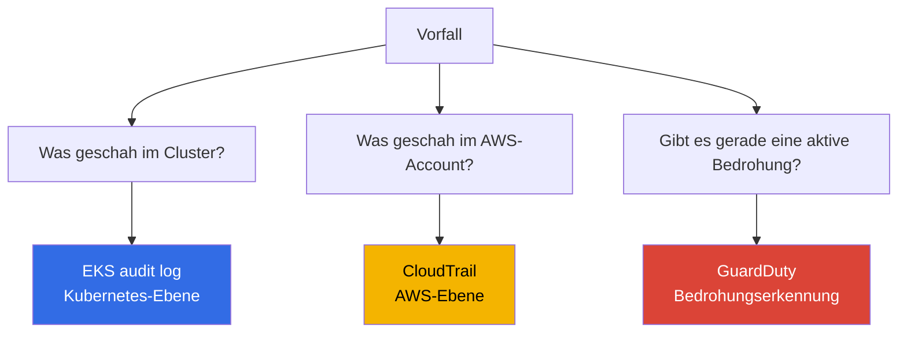
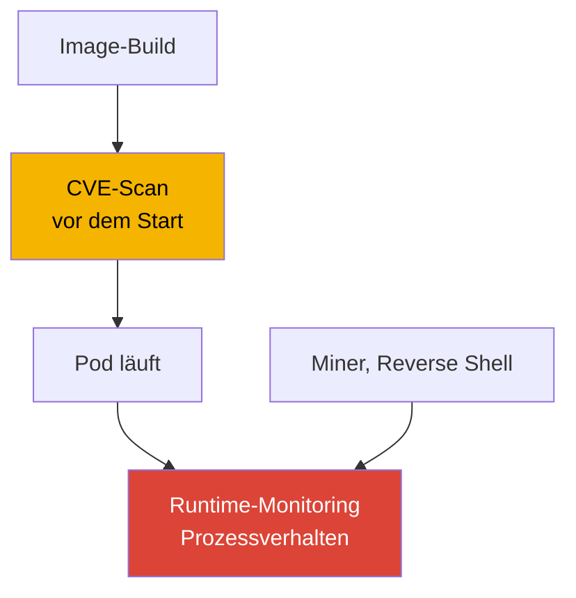
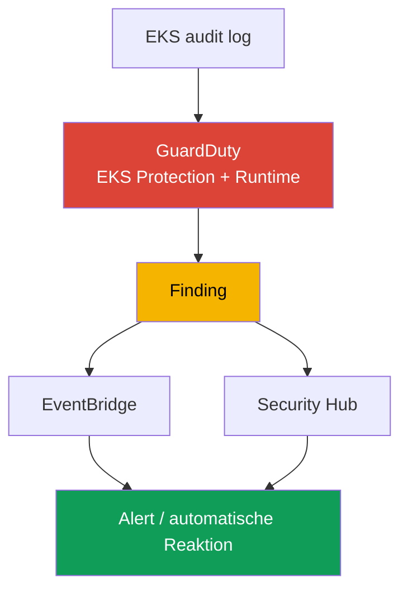
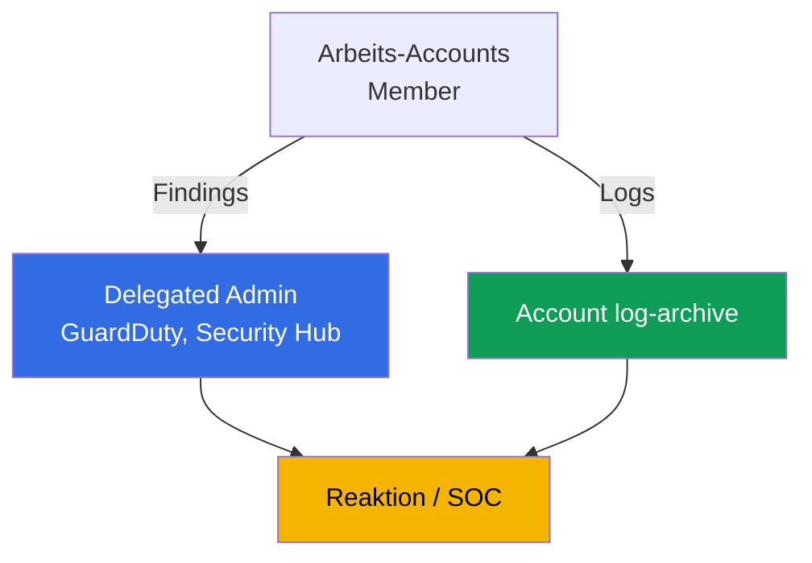

[Русская версия](ru.md) · [Eng version](en.md) · [Versión en español](es.md) · [Version française](fr.md) · [ქართული ვერსია](ge.md) · [繁體中文版](tw.md) · [日本語版](jp.md)
# Kapitel 21. Audit und Erkennung: Control-Plane-Logs, CloudTrail, GuardDuty, Runtime-Monitoring

> **Was als Nächstes kommt.** Teil 3 behandelte Identitäten (Kapitel 16-17), Secrets (Kapitel 18), das Hardening von Node, Pod und Netzwerk (Kapitel 19) sowie die Supply Chain von Images (Kapitel 20). In diesem Kapitel geht es darum herauszufinden, was im Cluster und Account geschehen ist und ob gerade ein Angriff stattfindet. Wir behandeln drei Ebenen: EKS audit log, CloudTrail und GuardDuty (EKS Protection und Runtime Monitoring). Verwandte Themen stehen in anderen Kapiteln: das Aktivieren der fünf Typen von Control-Plane-Logs und ihre Funktionsweise (Kapitel 2), Metriken und Observability für die Fehlerbehebung (Kapitel 33), Anwendungslogs über Fluent Bit (Kapitel 34), Hardening (Kapitel 19), Admission-Policies (Kapitel 22), RBAC und den Authenticator (Kapitel 5) sowie Kosten und Retention von Logs (Kapitel 34, 43).

## 21.1. „Wer hat den Namespace gelöscht, und warum lässt sich das nicht feststellen?“

Am Morgen ist ein Produktions-Namespace mitsamt seinen Workloads verschwunden. Die erste Frage des Bereitschaftsdienstes lautet: Wer hat ihn wann, mit welcher Identität und von welcher Adresse gelöscht? Es gibt keine Antwort: Das Audit-Log der Control Plane war nicht aktiviert (Kapitel 2), Metrikfilter für riskante Operationen waren nicht konfiguriert, und Logs können nicht rückwirkend entstehen. Der Verantwortliche kann nicht gefunden und eine Wiederholung nicht verhindert werden. Das ist kein Einzelfehler, sondern ein blinder Fleck: Sicherheitsaktivitäten im Cluster wurden nicht beobachtet.

Daneben treten verwandte Probleme derselben Art auf:

- **Ein kompromittierter Pod schürft eine Woche lang Kryptowährung.** Ein Angreifer dringt über eine Schwachstelle in einen Container ein, startet einen Miner und eine Reverse Shell. Niemand überwacht die Runtime: Das Image-Scanning (Kapitel 20) lief vor dem Start und weiß nichts darüber, was der Prozess jetzt tut. Anomaler Traffic und ein unbefugter Prozess bleiben unbemerkt, bis eine Rechnung oder Beschwerde eintrifft.
- **Jemand hat Secrets exfiltriert.** Ein Pod oder Benutzer führt im gesamten Namespace `get secrets` aus und ruft die Inhalte ab. RBAC erlaubte dies formal, das Ereignis wird nirgends hervorgehoben, und der Abfluss würde nur während einer Untersuchung auffallen, falls es überhaupt Daten zur Untersuchung gäbe.
- **Der Cluster wurde als AWS-Ressource geändert.** Jemand erweiterte `publicAccessCidrs` auf `0.0.0.0/0` oder entfernte die Encryption Config. Das ist kein Kubernetes-Ereignis, sondern ein Aufruf der AWS-API und fehlt daher vollständig im Audit-Log des Clusters.

Diese Fälle lassen sich nicht mit einer einzelnen Checkbox lösen, sondern mit drei unterschiedlichen Quellen, von denen jede ihre eigene Frage beantwortet.

## 21.2. Drei Sicherheitsfragen und drei Quellen für Antworten

Die zentrale Aussage dieses Kapitels ist: „Cluster-Logs“ sind kein einzelner Stream, sondern drei verschiedene Ebenen, und sie zu verwechseln ist teuer. Die Frage bestimmt die Quelle.



| Frage | Quelle | Ebene | Beispiel |
|---|---|---|---|
| Was geschah im Cluster | EKS audit log | Kubernetes API | wer einen Namespace löschte, wer Secrets las |
| Was geschah im Account | CloudTrail | AWS API | wer die Cluster-Konfiguration oder Node Group änderte |
| Gibt es eine aktive Bedrohung | GuardDuty | Echtzeiterkennung | Miner auf einem Node, anonymer Zugriff |

Entscheidend ist, die Ebenen zu trennen. Das Löschen eines Namespace über `kubectl` ist im **Audit-Log** sichtbar, aber nicht in CloudTrail: Für CloudTrail ist es kein AWS-Ereignis. Die Erweiterung von `publicAccessCidrs` ist in **CloudTrail** (`UpdateClusterConfig`) sichtbar, aber nicht im Audit-Log: Für Kubernetes ist es kein Cluster-Ereignis. Ein Miner, der weder die Kubernetes-API noch die AWS-API berührt, ist an beiden Stellen unsichtbar: Nur **GuardDuty Runtime Monitoring** erkennt ihn anhand des Prozessverhaltens. Die drei Quellen ersetzen einander nicht, sie ergänzen einander.

## 21.3. EKS audit log im Detail: Lesen für die Erkennung

Kapitel 2 behandelte die Mechanik zum Aktivieren der fünf Log-Typen. Hier ist das Audit-Log insbesondere als Quelle für Untersuchungen relevant. Jeder Eintrag ist ein Kubernetes-Audit-JSON-Ereignis: wer (`user.username`, der über den Authenticator zugeordnete IAM-Prinzipal, Kapitel 5), was getan wurde (`verb`: `get`, `list`, `create`, `delete`), woran (`objectRef.resource`, `objectRef.name`, `objectRef.namespace`), von wo (`sourceIPs`), wann (`requestReceivedTimestamp`) und mit welchem Ergebnis (`responseStatus.code`, die Autorisierungsentscheidung in `annotations`). Zusätzlich gibt es `auditID`, den eindeutigen Request-Identifier. Ein Request erzeugt in unterschiedlichen Stages (`RequestReceived`, `ResponseComplete`) Einträge mit derselben `auditID`; darüber werden alle Einträge einer Operation zu einem Gesamtbild zusammengeführt.

Es wird in CloudWatch Logs in die Log Group `/aws/eks/<cluster>/cluster` geschrieben, mit dem Stream `kube-apiserver-audit-<id>`. Analysiert wird es über **CloudWatch Logs Insights**, eine Abfragesprache mit `fields`, `filter`, `sort`, `stats` und `limit`.

```
fields @timestamp, user.username, verb, objectRef.resource, objectRef.namespace, sourceIPs.0
| filter verb = "delete" and objectRef.resource = "namespaces"
| sort @timestamp desc
| limit 20
```

Typische Abfragen für konkrete Fragen:

| Frage | Kern des Logs-Insights-Filters |
|---|---|
| Wer löschte einen Namespace | `verb="delete" and objectRef.resource="namespaces"` |
| Wer griff auf Secrets zu | `verb in ["get","list"] and objectRef.resource="secrets"` |
| Anonymer Zugriff | `user.username="system:anonymous"` |
| Autorisierungsablehnungen | `responseStatus.code=403` |
| Aktionen eines konkreten Prinzipals | `user.username="arn:aws:sts::...:assumed-role/..."` |

```
fields @timestamp, user.username, objectRef.namespace, objectRef.name
| filter user.username = "system:anonymous"
| sort @timestamp desc
| limit 50
```

Eine wichtige Grenze: Das Audit-Log beantwortet zuverlässig „wer/wann/mit welchem verb/an welcher Ressource“. Der Inhalt des Requests, etwa ob ein Pod `privileged: true` hatte, wird jedoch nicht immer aufgenommen. Das hängt von der Audit-Stufe ab, und standardmäßig erfasst die EKS-Audit-Policy den Request-Body nicht für alle Operationen. Daher lässt sich „Erstellung eines privilegierten Pods“ zuverlässiger über eine fertige Erkennung von GuardDuty EKS Protection (Abschnitt 21.5) erfassen als durch die Analyse des Bodys in Logs Insights. Aussagen auf Basis des Audit-Logs sollten vorsichtig formuliert werden: Es belegt die Tatsache einer Operation, aber nicht immer ihren vollständigen Inhalt.

## 21.4. CloudTrail für EKS: die AWS-Ebene

CloudTrail zeichnet AWS-API-Aufrufe auf. Für EKS sind dies Operationen am Cluster **als AWS-Ressource**: `CreateCluster`, `DeleteCluster`, `UpdateClusterConfig` (einschließlich der Änderung von `publicAccessCidrs` und der Logging-Konfiguration), `AssociateEncryptionConfig`, `CreateAccessEntry`, Änderungen an Managed Node Groups (`CreateNodegroup`, `UpdateNodegroupConfig`). Wer den Aufruf wann, von welcher IP-Adresse, unter welcher Rolle und mit welchem Ergebnis getätigt hat, steht alles in CloudTrail.

Der Unterschied zum Audit-Log ist grundlegend und sollte stets klar sein: **CloudTrail = AWS-Ebene** (was mit dem Cluster von außen über die EKS-API geschah), **Audit-Log = Kubernetes-Ebene** (was innerhalb des Clusters über die Kubernetes-API geschah). Das Löschen eines Pods erscheint nicht in CloudTrail, das Löschen einer Node Group nicht im Audit-Log.

CloudTrail unterscheidet **Management Events** (Operationen an Ressourcen, also Erstellen, Ändern und Löschen, standardmäßig aktiviert) und **Data Events** (Operationen an Daten innerhalb einer Ressource, standardmäßig deaktiviert, separat zu aktivieren und umfangreich). Verwaltungsoperationen am EKS-Cluster sind Management Events.

```bash
# Wer und wann die Cluster-Konfiguration änderte: die letzten Ereignisse
aws cloudtrail lookup-events \
  --lookup-attributes AttributeKey=EventName,AttributeValue=UpdateClusterConfig \
  --query 'Events[].{Time:EventTime,User:Username,Event:EventName}' --output table

# Alle Ereignisse für einen konkreten Cluster als Ressource
aws cloudtrail lookup-events \
  --lookup-attributes AttributeKey=ResourceName,AttributeValue=demo
```

Wenn ein Vorfall beide Ebenen berührt, etwa wenn die Cluster-Konfiguration über die AWS-API geändert und anschließend etwas innerhalb des Clusters getan wurde, wird das Bild aus beiden Quellen zugleich zusammengestellt. Audit-Log und CloudTrail haben keinen gemeinsamen Identifier: Innerhalb des Audit-Logs verknüpft `auditID` die Einträge, zwischen den Quellen werden Ereignisse über den Prinzipal (IAM-Rolle), die IP (`sourceIPs` gegenüber dem CloudTrail-Feld) und ein Zeitfenster zusammengeführt. So entsteht eine einheitliche Timeline „was im Account geschah -> was im Cluster geschah“ statt zweier Listen.

Sie werden anhand dreier übereinstimmender Dimensionen verknüpft. Das sind die Felder in jeder Quelle:

| Was wird zugeordnet | Feld im Audit-Log | Feld in CloudTrail |
|---|---|---|
| Prinzipal | `user.username` | `userIdentity` (`Username` in `lookup-events`) |
| Quell-IP | `sourceIPs` | `sourceIPAddress` |
| Zeit | `requestReceivedTimestamp` | `eventTime` |

## 21.5. GuardDuty für EKS: EKS Protection und Runtime Monitoring

GuardDuty ist ein Dienst zur Bedrohungserkennung. Für EKS arbeitet er auf zwei Ebenen, und dies sind unterschiedliche Dinge.

**EKS Protection** analysiert **EKS audit logs** auf verdächtige Aktivitäten der Control Plane. Wichtig ist: GuardDuty erfasst Audit-Logs über **einen eigenen unabhängigen Stream** und benötigt keine zusätzliche Konfiguration. Sie müssen Control-Plane-Logging in CloudWatch nicht aktivieren, damit EKS Protection funktioniert. Diese Aktivierung ist nur erforderlich, wenn Sie die Audit-Logs im eigenen Account sehen möchten. Es erkennt etwa API-Zugriffe von bekannten bösartigen IP-Adressen, Zugriff durch `system:anonymous`, Rechteausweitung, den Start privilegierter Container und verdächtige API-Nutzung.

**Runtime Monitoring** ist eine andere Ebene: Es beobachtet das **Verhalten auf Nodes**. Es arbeitet über das EKS-Add-on `aws-guardduty-agent` (GuardDuty Security Agent), das auf eBPF basiert und Prozesse, Netzwerkverbindungen und Dateiaktivität von Containern überwacht. Damit werden Dinge erkannt, die weder im Audit-Log noch in CloudTrail stehen: Miner, Reverse Shells, Zugriffe auf bösartige Domains und der Start verdächtiger Binärdateien. Laut Dokumentation unterstützt Runtime Monitoring EKS auf EC2-Instanzen und im EKS Auto Mode, unterstützt aber **nicht** Fargate und EKS Hybrid Nodes. Der Agent kann automatisch bereitgestellt werden (automated agent configuration) oder manuell verwaltet werden.

| Eigenschaft | EKS Protection | Runtime Monitoring |
|---|---|---|
| Quelle | EKS audit logs (eigener Stream) | Agent auf dem Node (eBPF) |
| Was es sieht | Kubernetes-API-Aufrufe | Prozesse, Netzwerk, Dateien des Containers |
| Agent auf Nodes erforderlich | nein | ja, `aws-guardduty-agent` |
| Erkennt | anonymen Zugriff, Rechteausweitung, bösartige IPs | Miner, Reverse Shells, bösartige Domains |
| Einschränkungen | - | kein Fargate, keine Hybrid Nodes |

Erkannte Bedrohungen werden von GuardDuty als **Finding** aufbereitet und an Security Hub und EventBridge gesendet. Darauf bauen Alerting und automatisierte Reaktionen auf (Abschnitt 21.7).

## 21.6. Runtime-Monitoring im Detail: Verhalten gegenüber Image

Runtime-Monitoring wird leicht mit Image-Scanning (Kapitel 20) verwechselt, aber sie betreffen unterschiedliche Zeitpunkte. Ein Scan erkennt **bekannte CVEs im Image VOR dem Start**, also eine statische Analyse des Artefakts. Runtime erkennt **Verhalten NACH dem Start**, also was ein Prozess im laufenden Container tatsächlich tut. Keines ersetzt das andere: Ein laut Scan sauberes Image kann zur Laufzeit über eine Anwendungsschwachstelle kompromittiert werden, und ein Miner muss gar nicht im Image enthalten sein, sondern kann erst in den laufenden Pod nachgeladen werden.



Runtime-Erkennung für EKS wird auf zwei Wegen umgesetzt. **GuardDuty Runtime Monitoring** ist die verwaltete Variante: AWS-Agent, Findings in Security Hub, nichts muss selbst gehostet werden. **Drittanbieter-Tools** wie Falco, ein CNCF-Projekt für Runtime Security auf denselben eBPF-/Syscall-Ereignissen, bieten mehr Flexibilität bei Regeln, müssen aber selbst installiert, aktualisiert und betrieben werden. Was der Agent in beiden Fällen sieht: Prozessstarts, Netzwerkverbindungen, Dateizugriffe und Versuche, aus einem Container auszubrechen. Die Wahl zwischen verwaltet und selbst betrieben ist eine Wahl zwischen „weniger Kontrolle, kein Betriebsaufwand“ und „vollständige Kontrolle, eigener Betrieb“.

## 21.7. Wie sich dies zu einer Erkennungskette zusammenfügt

Die einzelnen Quellen bilden eine Pipeline, vom Ereignis bis zur Reaktion. Eine Lücke am Ende entwertet den Anfang: Ein Finding, das niemand betrachtet, hält keinen Vorfall auf.



Das wird so gelesen: Audit-Log und Agent speisen GuardDuty, das ein Finding erzeugt. Das Finding geht an Security Hub zur Aggregation und Priorisierung über alle Accounts hinweg und an EventBridge, dessen Regel eine Reaktion auslöst: eine Benachrichtigung in Chat/SNS, ein Ticket oder eine automatische Aktion über Lambda, etwa einen Pod isolieren, einen Node entfernen oder eine Session widerrufen. Ein separater Zweig derselben Pipeline sind CloudWatch-Metrikfilter für kritische Ereignisse im Audit-Log selbst, etwa das Löschen eines Namespace oder Aktionen von `system:anonymous`, mit Alarmen, ohne auf GuardDuty zu warten.

## 21.8. Organisation in einer Multi-Account-Umgebung

In einem einzelnen Account ist Erkennung gegen jemanden mit Admin-Rechten in genau diesem Account nutzlos: Diese Person kann sowohl Spuren bereinigen als auch Logs löschen. Deshalb wird die Beobachtung in einer Organisation aus den Arbeits-Accounts ausgelagert.



- **Delegated administrator.** Über AWS Organizations werden GuardDuty und Security Hub einem separaten Administrator-Account (delegated administrator) zugewiesen, der den Dienst für die gesamte Organisation verwaltet und Findings aller Mitglieds-Accounts sieht. Die Zuweisung ist regional: Der delegated administrator wird in jeder Region festgelegt. Damit sind die Aktivierung von GuardDuty für neue Accounts und das Sammeln von Findings zentralisiert, statt vom guten Willen des Eigentümers eines Arbeits-Accounts abzuhängen. Kritische Findings des delegated administrator werden in den S3-Bucket des Accounts `log-archive` exportiert. Eine unveränderliche Kopie des Ereignisses übersteht auch die Bereinigung im Arbeits-Account selbst.
- **Separater Audit-Account.** Findings und Security-Dashboards liegen in einem Account, auf den Entwicklungsteams keinen Zugriff haben.
- **Logs in log-archive.** CloudTrail der Organisation und das Archiv der Audit-Logs werden in einem separaten Account `log-archive` (Kapitel 0.1) mit beschränktem Zugriff und unveränderlicher Aufbewahrung (S3 Object Lock, WORM) gespeichert, sodass ein Administrator des Arbeits-Accounts die Historie physisch weder löschen noch manipulieren kann. Das ist die Voraussetzung für Vertrauen in Logs während einer Untersuchung.

## 21.9. Anwendung in der Produktion

- **Audit-Log ist immer aktiviert.** Mindestens `audit` und `authenticator` ab dem ersten Tag (Kapitel 2), mit explizit gesetzter Retention; das Langzeitarchiv wird in S3 in einen separaten Account ausgelagert (Kapitel 34, 43).
- **GuardDuty für die gesamte Organisation.** EKS Protection und Runtime Monitoring sind über einen delegated administrator für alle Accounts und alle verwendeten Regionen aktiviert; neue Accounts werden automatisch angebunden.
- **Metrikfilter und Alarme für kritische Ereignisse.** Löschen eines Namespace, Aktionen von `system:anonymous`, ein Anstieg von `403`, Zugriffe auf Secrets: CloudWatch-Metrikfilter für das Audit-Log mit Alarmen, ohne auf einen externen Dienst zu warten.
- **Reaktion auf Findings ist automatisiert.** Findings aus Security Hub und EventBridge fließen in Alerting und Runbook: Für kritische Typen gibt es eine vorab beschriebene Reaktion, keine Untersuchung von Grund auf.
- **CloudTrail ist im Team gedanklich vom Audit-Log getrennt.** „Wer änderte den Cluster als AWS-Ressource?“ beantwortet CloudTrail; „wer änderte Objekte im Inneren?“ das Audit-Log. Beide Quellen sind vor Manipulation geschützt.
- **Runtime Monitoring dort, wo es unterstützt wird.** Auf EC2-Nodes und im Auto Mode läuft der GuardDuty-Agent. Für Fargate-Workloads, auf denen der Agent nicht unterstützt wird, erfolgt die Erkennung über andere Ebenen.

## 21.10. Mini-Glossar

- **EKS audit log**: Typ von Control-Plane-Logs (`audit`), Kubernetes-Audit-JSON-Ereignisse dazu, wer welchen Verb an welcher Ressource von wo und mit welchem Ergebnis ausführte; wird in CloudWatch Logs geschrieben.
- **CloudWatch Logs Insights**: Abfragesprache für Logs (`fields`, `filter`, `sort`, `stats`); das wichtigste Werkzeug zur Analyse des Audit-Logs.
- **CloudTrail**: Protokoll der AWS-API-Aufrufe. Für EKS zeichnet es Operationen am Cluster als AWS-Ressource auf (Management Events), nicht Ereignisse innerhalb von Kubernetes.
- **GuardDuty EKS Protection**: Analyse von EKS audit logs auf Bedrohungen über einen eigenen unabhängigen GuardDuty-Stream, ohne obligatorisches Control-Plane-Logging.
- **GuardDuty Runtime Monitoring**: Beobachtung des Verhaltens auf Nodes über den Agent `aws-guardduty-agent` (eBPF): Prozesse, Netzwerk, Dateien; unterstützt weder Fargate noch Hybrid Nodes.
- **auditID**: Eindeutiger Request-Identifier im Audit-Log, der für alle Stages einer Operation identisch ist. Es gibt keine gemeinsame ID mit CloudTrail; zwischen Quellen werden Ereignisse über Prinzipal, IP und Zeit verknüpft.
- **Finding**: GuardDuty-Fund, der für Alerting und Reaktion an Security Hub und EventBridge geht.
- **Delegated administrator**: Organisations-Account, der GuardDuty/Security Hub für die gesamte Organisation verwaltet und die Findings aller Mitglieder sieht; wird regional festgelegt.

## 21.11. Zusammenfassung des Kapitels

- Sicherheitsbeobachtung in EKS besteht aus drei unterschiedlichen Ebenen, nicht aus einem Log. Sie zu verwechseln ist teuer: Die Frage bestimmt die Quelle der Antwort.
- EKS audit log beantwortet „was im Cluster geschah“: wer, welcher Verb, an welcher Ressource, von wo und mit welchem Ergebnis. Es wird über CloudWatch Logs Insights in der Log Group `/aws/eks/<cluster>/cluster` analysiert. Der Request-Body wird nicht immer aufgenommen, das hängt von der Audit-Stufe ab.
- CloudTrail beantwortet „was im AWS-Account geschah“: Operationen am Cluster als Ressource (`UpdateClusterConfig`, `CreateAccessEntry`, Änderungen der Node Group). Dies ist die AWS-Ebene, nicht Kubernetes; Management Events sind standardmäßig aktiviert.
- GuardDuty beantwortet „ob gerade eine Bedrohung besteht“. EKS Protection analysiert Audit-Logs ohne zusätzliche Konfiguration über seinen eigenen Stream; Runtime Monitoring erkennt über einen Agent auf Nodes Miner und Reverse Shells, funktioniert aber nicht auf Fargate und Hybrid Nodes.
- Runtime-Monitoring erkennt Verhalten NACH dem Start und ersetzt nicht das Image-Scanning, das CVEs VOR dem Start erkennt. Die verwaltete Variante ist GuardDuty, die flexible ist Falco mit eigenem Betrieb.
- Findings werden zu einer Kette zusammengefügt: Audit/Agent -> GuardDuty -> Security Hub/EventBridge -> Alert/Reaktion. In einer Multi-Account-Umgebung wird dies zu einem delegated administrator und log-archive ausgelagert, damit ein Administrator des Arbeits-Accounts keine Spuren bereinigen kann.

## 21.12. Wie dies in der Praxis hilft

Die Frage „Wer löschte den Namespace?“ wird im Bereitschaftsdienst von einer Sackgasse zu einer einzigen Logs-Insights-Abfrage, aber nur wenn das Audit-Log vorab aktiviert war und die Retention noch nicht abgelaufen ist. Der Vorfall „Ein Pod schürft eine Woche lang“ dauert dort nicht eine Woche, wo Runtime Monitoring innerhalb der ersten Stunden ein Finding auslöst. Und der Streit „Wurde dies über die AWS-API oder im Cluster selbst geändert?“ wird durch die Wahl der Quelle gelöst: CloudTrail gegenüber Audit-Log. Diese Grenze im Kopf zu behalten, spart Stunden bei der Untersuchung. Bei der Planung sollten drei Dinge vor dem ersten Vorfall umgesetzt werden, nicht danach: Audit-Log mit Retention aktivieren, GuardDuty für die Organisation aktivieren und Logs in einen separaten Account auslagern. Nichts davon lässt sich nachträglich beschaffen.

## 21.13. Fragen zur Selbstkontrolle

1. Welche drei Sicherheitsfragen beantworten Audit-Log, CloudTrail und GuardDuty?
2. Warum ist das Löschen eines Namespace im Audit-Log sichtbar, aber nicht in CloudTrail?
3. Warum ist die Änderung von `publicAccessCidrs` in CloudTrail sichtbar, aber nicht im Audit-Log?
4. Welche Felder eines Audit-Log-Eintrags beantworten „wer, was, woran, von wo, mit welchem Ergebnis“?
5. Schreiben Sie den Kern der Logs-Insights-Abfrage für „wer löschte einen Namespace“ und „anonymer Zugriff“.
6. Warum lässt sich „Erstellung eines privilegierten Pods“ nicht immer zuverlässig über das Audit-Log erkennen?
7. Wodurch unterscheiden sich Management Events von Data Events in CloudTrail?
8. Was analysiert GuardDuty EKS Protection, und muss dafür Control-Plane-Logging aktiviert werden?
9. Wodurch arbeitet GuardDuty Runtime Monitoring, und welche Plattformen unterstützt es nicht?
10. Worin unterscheidet sich Runtime-Monitoring von Image-Scanning, und warum ersetzt keines das andere?
11. Wohin sendet GuardDuty Findings, und wie wird daraus eine Reaktion aufgebaut?
12. Wozu dienen in einer Multi-Account-Umgebung ein delegated administrator und ein separater Account log-archive?
13. Wie werden Audit-Log- und CloudTrail-Ereignisse verknüpft, wenn sie keinen gemeinsamen Identifier haben?

## Praxis

Das Kapitel hat noch kein eigenes Lab, aber alles lässt sich in einem laufenden Cluster und Account prüfen. Stellen Sie sicher, dass `audit` aktiviert ist: `aws eks describe-cluster --name demo --query 'cluster.logging'`, und dass die Log Group vorhanden ist: `aws logs describe-log-groups --log-group-name-prefix /aws/eks/demo`. Öffnen Sie CloudWatch Logs Insights für `/aws/eks/demo/cluster` und führen Sie die Abfrage mit `filter objectRef.resource="namespaces"` aus. Löschen Sie einen Test-Namespace und finden Sie sich selbst in den Ergebnissen.

Als Nächstes GuardDuty: `aws guardduty list-detectors` zeigt den Detector in der Region, `aws guardduty get-detector --detector-id <id>` seinen Status und die aktivierten Features (EKS Protection, Runtime Monitoring). Prüfen Sie Cluster-Operationen in CloudTrail: `aws cloudtrail lookup-events --lookup-attributes AttributeKey=EventName,AttributeValue=UpdateClusterConfig`. Falls es einen Test-Node auf EC2 gibt, installieren Sie das Add-on `aws-guardduty-agent` und prüfen Sie, ob Findings in Security Hub eintreffen. Die Admission-Policies, die Gefährliches bereits beim Eingang blockieren, behandelt Kapitel 22.

---
[Inhaltsverzeichnis](../README_DE.md) · [Kapitel 20](../20/de.md) · [Kapitel 22](../22/de.md)
