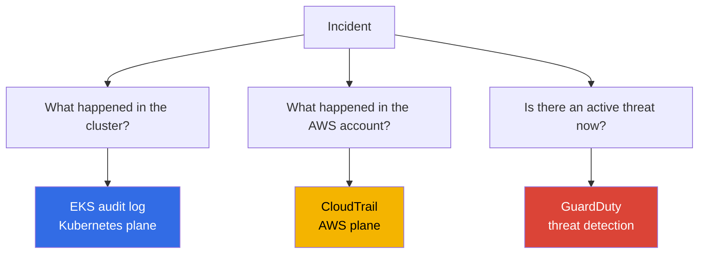
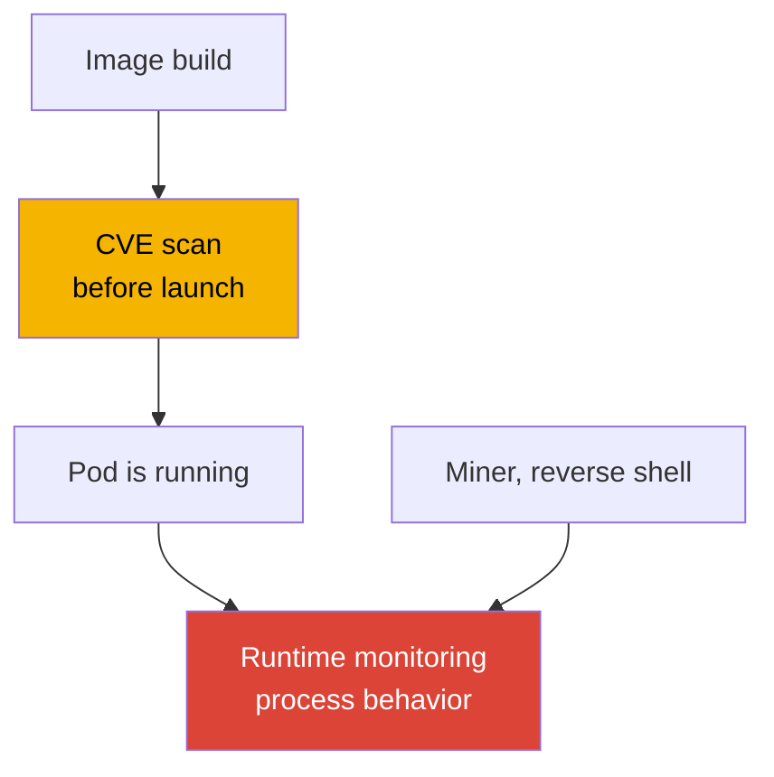
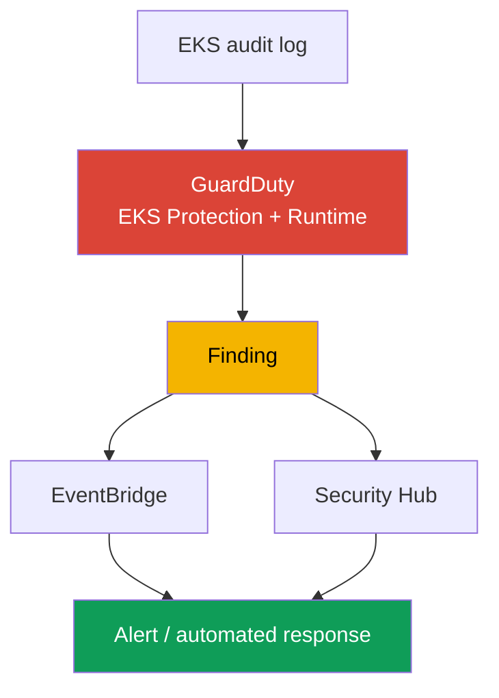
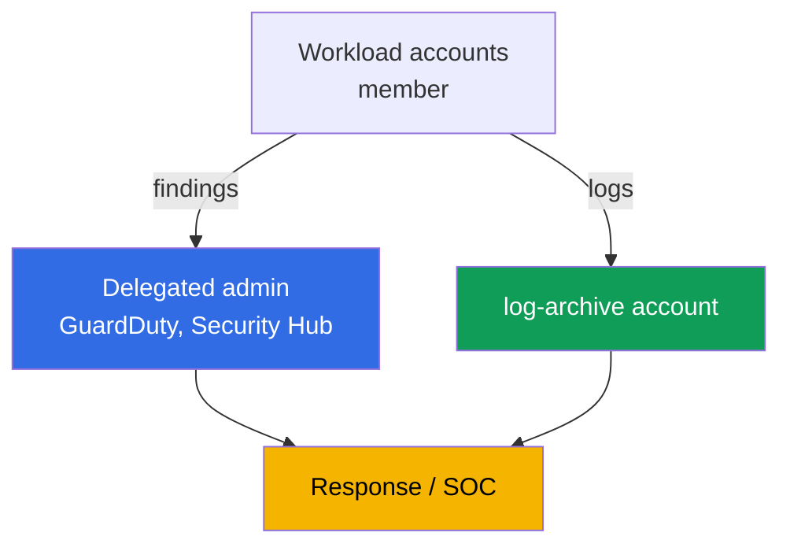

[Русская версия](ru.md) · [Versión en español](es.md) · [Version française](fr.md) · [Deutsche Version](de.md) · [ქართული ვერსია](ge.md) · [繁體中文版](tw.md) · [日本語版](jp.md)
# Chapter 21. Audit and detection: control plane logs, CloudTrail, GuardDuty, runtime monitoring

> **What comes next.** Part 3 covered identity (chapters 16-17), secrets (chapter 18), node,
> pod, and network hardening (chapter 19), and the image supply chain (chapter 20). This chapter
> is about how to find out what happened in the cluster and account, and whether an attack is
> happening right now. We cover three layers: EKS audit log, CloudTrail, and GuardDuty (EKS
> Protection and Runtime Monitoring). Related topics are in other chapters: enabling the five
> types of control plane logs and how they work (chapter 2), metrics and observability for
> troubleshooting (chapter 33), application logs through Fluent Bit (chapter 34), hardening
> (chapter 19), admission policies (chapter 22), RBAC and the authenticator (chapter 5), and log
> cost and retention (chapters 34, 43).

## 21.1. "Who deleted the namespace, and why it cannot be determined"

In the morning, a production namespace disappeared along with its workloads. The on-call
engineer's first question is who deleted it, when, from which identity, and from which address.
There is no answer: the control plane audit log was not enabled (chapter 2), metric filters for
risky operations were not configured, and logs cannot appear retroactively. The culprit cannot be
found and recurrence cannot be prevented. This is not an isolated failure, but a blind spot:
security activity in the cluster was not observed.

Related problems of the same nature also occur:

- **A compromised pod mines cryptocurrency for a week.** An attacker enters a container through a
  vulnerability, starts a miner and a reverse shell. No one watches runtime: image scanning
  (chapter 20) ran before launch and knows nothing about what the process does now. No one notices
  anomalous traffic and an unauthorized process until a bill or complaint arrives.
- **Someone exfiltrated secrets.** A pod or user runs `get secrets` throughout a namespace and
  retrieves the content. RBAC formally allowed it, the event is not highlighted anywhere, and the
  breach would surface only during an investigation, if there were data to investigate.
- **The cluster was changed as an AWS resource.** Someone expanded `publicAccessCidrs` to
  `0.0.0.0/0` or removed the encryption config. This is not a Kubernetes event, but an AWS API
  call, so it is absent from the cluster audit log altogether.

These cases are not addressed by one checkbox, but by three different sources, each answering its
own question.

## 21.2. Three security questions and three answer sources

The chapter's central point is that "cluster logs" are not one stream but three distinct planes,
and confusing them is costly. The question determines the source.



| Question | Source | Plane | Example |
|---|---|---|---|
| What happened in the cluster | EKS audit log | Kubernetes API | who deleted a namespace, who read secrets |
| What happened in the account | CloudTrail | AWS API | who changed cluster configuration, node group |
| Is there an active threat | GuardDuty | real-time detection | miner on a node, anonymous access |

The key is to separate the planes. Deleting a namespace through `kubectl` is visible in the
**audit log**, but not CloudTrail: it is not an AWS event for CloudTrail. Expanding
`publicAccessCidrs` is visible in **CloudTrail** (`UpdateClusterConfig`), but not the audit log:
it is not a cluster event for Kubernetes. A miner that touches neither the Kubernetes API nor the
AWS API is visible in neither place: only **GuardDuty Runtime Monitoring** detects it through
process behavior. The three sources do not replace one another, they complement one another.

## 21.3. EKS audit log in detail: reading it for detection

Chapter 2 covered the mechanics of enabling the five log types; here the audit log matters in
particular as an investigation source. Each record is a Kubernetes audit JSON event: who
(`user.username`, the IAM principal mapped through the authenticator, chapter 5), what they did
(`verb`: `get`, `list`, `create`, `delete`), to what (`objectRef.resource`, `objectRef.name`,
`objectRef.namespace`), from where (`sourceIPs`), when (`requestReceivedTimestamp`), and with
what result (`responseStatus.code`, the authorization decision in `annotations`). Separately,
there is `auditID`, the unique request identifier. One request produces records at different
stages (`RequestReceived`, `ResponseComplete`) with the same `auditID`; it is used to assemble all
records for one operation into a unified picture.

It is written to CloudWatch Logs in the `/aws/eks/<cluster>/cluster` log group, with the stream
`kube-apiserver-audit-<id>`. Analyze it through **CloudWatch Logs Insights**, a query language
with `fields`, `filter`, `sort`, `stats`, and `limit`.

```
fields @timestamp, user.username, verb, objectRef.resource, objectRef.namespace, sourceIPs.0
| filter verb = "delete" and objectRef.resource = "namespaces"
| sort @timestamp desc
| limit 20
```

Typical queries for specific questions:

| Question | Logs Insights filter core |
|---|---|
| Who deleted a namespace | `verb="delete" and objectRef.resource="namespaces"` |
| Who accessed secrets | `verb in ["get","list"] and objectRef.resource="secrets"` |
| Anonymous access | `user.username="system:anonymous"` |
| Authorization denials | `responseStatus.code=403` |
| Actions by a specific principal | `user.username="arn:aws:sts::...:assumed-role/..."` |

```
fields @timestamp, user.username, objectRef.namespace, objectRef.name
| filter user.username = "system:anonymous"
| sort @timestamp desc
| limit 50
```

An important boundary: the audit log reliably answers "who, when, which verb, and on which
resource." However, the request content, for example whether a pod had `privileged: true`, does
not always enter the log. It depends on the audit level, and the default EKS audit policy does not
record request bodies for all operations. Therefore, detecting "creation of a privileged pod" is
more reliable through the ready-made GuardDuty EKS Protection detection (section 21.5), rather
than by parsing the body in Logs Insights. Phrase audit-log findings carefully: it is about the
fact of an operation, not always its complete content.

## 21.4. CloudTrail for EKS: the AWS plane

CloudTrail records AWS API calls. For EKS, these are operations on the cluster **as an AWS
resource**: `CreateCluster`, `DeleteCluster`, `UpdateClusterConfig` (including changes to
`publicAccessCidrs` and logging settings), `AssociateEncryptionConfig`, `CreateAccessEntry`, and
managed node group changes (`CreateNodegroup`, `UpdateNodegroupConfig`). Who called it, when,
from which IP, under which role, and with what result are all in CloudTrail.

The difference from the audit log is fundamental and worth remembering: **CloudTrail = the AWS
plane** (what was done to the cluster externally through the EKS API), **audit log = the
Kubernetes plane** (what was done inside the cluster through the Kubernetes API). Deleting a pod
does not appear in CloudTrail; deleting a node group does not appear in the audit log.

CloudTrail distinguishes **management events** (operations on resources: creation, modification,
and deletion, enabled by default) and **data events** (operations on data inside a resource,
disabled by default, enabled separately, and high-volume). Management operations on an EKS cluster
are management events.

```bash
# who changed the cluster configuration and when, among recent events
aws cloudtrail lookup-events \
  --lookup-attributes AttributeKey=EventName,AttributeValue=UpdateClusterConfig \
  --query 'Events[].{Time:EventTime,User:Username,Event:EventName}' --output table

# all events for a specific cluster as a resource
aws cloudtrail lookup-events \
  --lookup-attributes AttributeKey=ResourceName,AttributeValue=demo
```

When an incident touches both planes, for example the cluster configuration was changed through
the AWS API and then something was done inside the cluster, assemble the picture from both sources
at once. There is no common identifier between the audit log and CloudTrail: within the audit log,
records are connected by `auditID`; across sources, correlate events by principal (IAM role), IP
(`sourceIPs` versus the CloudTrail field), and time window. This builds a unified timeline of
"what happened in the account -> what happened in the cluster," rather than two lists.

Correlate on three matching dimensions. These are their fields in each source:

| What to correlate | Audit-log field | CloudTrail field |
|---|---|---|
| Principal | `user.username` | `userIdentity` (`Username` in `lookup-events`) |
| Source IP | `sourceIPs` | `sourceIPAddress` |
| Time | `requestReceivedTimestamp` | `eventTime` |

## 21.5. GuardDuty for EKS: EKS Protection and Runtime Monitoring

GuardDuty is a threat-detection service. For EKS, it works at two levels, which are different
things.

**EKS Protection** analyzes **EKS audit logs** for suspicious control plane activity. An important
fact is that GuardDuty collects audit logs through **its own independent stream**, requiring no
additional configuration. You do not have to enable control plane logging in CloudWatch for EKS
Protection to work. That enablement is needed only if you want to view audit logs in your account.
It detects activity such as API access from known malicious IPs, access by `system:anonymous`,
privilege escalation, launching privileged containers, and suspicious API use.

**Runtime Monitoring** is a different level: it watches **behavior on nodes**. It works through
the `aws-guardduty-agent` EKS add-on (GuardDuty security agent), based on eBPF, which observes
container processes, network connections, and file activity. This detects things that appear in
neither the audit log nor CloudTrail: miners, reverse shells, connections to malicious domains,
and execution of suspicious binaries. According to the documentation, Runtime Monitoring supports
EKS on EC2 instances and EKS Auto Mode, but **does not** support Fargate or EKS Hybrid Nodes. The
agent can be deployed automatically (automated agent configuration) or managed manually.

| Property | EKS Protection | Runtime Monitoring |
|---|---|---|
| Source | EKS audit logs (own stream) | node agent (eBPF) |
| What it sees | Kubernetes API calls | container processes, network, files |
| Node agent required | no | yes, `aws-guardduty-agent` |
| Detects | anonymous access, escalation, malicious IPs | miner, reverse shell, malicious domains |
| Limitations | - | not Fargate, not Hybrid Nodes |

GuardDuty packages a detection as a **finding** and sends it to Security Hub and EventBridge. From
there, alerting and automated response are built (section 21.7).

## 21.6. Runtime monitoring in detail: behavior versus image

Runtime monitoring is easy to confuse with image scanning (chapter 20), but they address
different points in time. Scanning detects **known CVEs in an image BEFORE launch**, a static
artifact analysis. Runtime detects **behavior AFTER launch**, what a process actually does in a
running container. Neither replaces the other: an image clean according to a scan can be
compromised at runtime through an application vulnerability, and a miner does not need to be in
the image at all, since it can be downloaded into an already-running pod.



Runtime detection for EKS is implemented in two ways. **GuardDuty Runtime Monitoring** is the
managed option: an AWS agent, findings in Security Hub, and nothing to host yourself.
**Third-party tools**, for example Falco, a CNCF runtime-security project based on the same
eBPF/syscall events, provide more rule flexibility but must be installed, updated, and maintained
by you. In both cases, the agent sees process launches, network connections, file access, and
container-escape attempts. Choosing managed or self-managed is a choice between "less control,
zero maintenance" and "full control, your own operations."

## 21.7. How this becomes a detection chain

The separate sources combine into one pipeline, from event to response. A gap at the end negates
the beginning: a finding nobody watches does not stop an incident.



Read it as follows: the audit log and agent feed GuardDuty, which generates a finding. The finding
goes to Security Hub for aggregation and prioritization across all accounts, and to EventBridge,
where a rule triggers a response: a chat/SNS notification, a ticket, or an automated action
through Lambda (isolate a pod, remove a node, revoke a session). A separate branch of the same
pipeline is CloudWatch metric filters on critical audit-log events themselves, such as namespace
deletion and `system:anonymous` actions, with alarms without waiting for GuardDuty.

## 21.8. Organization in a multi-account environment

In one account, detection is useless against someone who has administrator access to that same
account: they can erase evidence and delete logs. Therefore, organizations move observability out
of workload accounts.



- **Delegated administrator.** Through AWS Organizations, assign GuardDuty and Security Hub to a
  separate administrator account (delegated administrator), which manages the service for the
  whole organization and sees findings from all member accounts. The assignment is regional: set
  a delegated administrator in every Region. This centralizes GuardDuty enablement for new
  accounts and finding collection instead of relying on the goodwill of a workload-account owner.
  Export critical findings from the delegated administrator to an S3 bucket in the `log-archive`
  account. An immutable copy of the event survives cleanup in the workload account itself.
- **Separate audit account.** Findings and security dashboards live in an account to which
  development teams have no access.
- **Logs in log-archive.** Store the organization CloudTrail and audit-log archive in a separate
  `log-archive` account (chapter 0.1), with restricted access and immutable storage (S3 Object
  Lock, WORM), so a workload-account administrator physically cannot delete or alter history.
  This is the condition for trusting logs during an investigation.

## 21.9. How this is applied in production

- **Audit log is always enabled.** At minimum, enable `audit` and `authenticator` from day one
  (chapter 2), set retention explicitly, and move the long-term archive to S3 in a separate
  account (chapters 34, 43).
- **GuardDuty covers the whole organization.** Enable EKS Protection and Runtime Monitoring
  through a delegated administrator for all accounts and all used Regions, with new accounts
  enrolled automatically.
- **Metric filters and alarms cover critical events.** Namespace deletion, `system:anonymous`
  actions, a spike in `403`, and secret access use CloudWatch audit-log metric filters and alarms,
  without waiting for an external service.
- **Response to findings is automated.** Findings from Security Hub and EventBridge go to
  alerting and a runbook. Critical types have a predefined response rather than investigation from
  scratch.
- **CloudTrail and the audit log are distinct in the team's mental model.** "Who changed the
  cluster as an AWS resource" is CloudTrail; "who changed objects inside" is the audit log. Both
  sources are protected from tampering.
- **Runtime Monitoring is used where supported.** Use the GuardDuty agent on EC2 nodes and Auto
  Mode. For Fargate workloads, where the agent is unsupported, build detection at other layers.

## 21.10. Mini glossary

- **EKS audit log**: a control plane log type (`audit`), Kubernetes audit JSON events describing
  who performed which verb on which resource, from where, and with what result. It is written to
  CloudWatch Logs.
- **CloudWatch Logs Insights**: a log query language (`fields`, `filter`, `sort`, `stats`), the
  primary audit-log analysis tool.
- **CloudTrail**: the AWS API call log. For EKS, it records operations on the cluster as an AWS
  resource (management events), not events inside Kubernetes.
- **GuardDuty EKS Protection**: EKS audit-log analysis for threats through GuardDuty's own
  independent stream, without mandatory control plane logging enablement.
- **GuardDuty Runtime Monitoring**: behavior monitoring on nodes through the
  `aws-guardduty-agent` (eBPF): processes, network, and files. It does not support Fargate or
  Hybrid Nodes.
- **auditID**: a unique request identifier in the audit log, the same for all stages of one
  operation. It has no common ID with CloudTrail; correlate between sources by principal, IP, and
  time.
- **Finding**: a GuardDuty detection sent to Security Hub and EventBridge for alerting and
  response.
- **Delegated administrator**: an organization account that manages GuardDuty/Security Hub for
  the whole organization and sees findings from all members. It is assigned regionally.

## 21.11. Chapter summary

- EKS security observability is three distinct planes, not one log. Confusing them is costly: the
  question determines the answer source.
- EKS audit log answers "what happened in the cluster": who, which verb, on which resource, from
  where, and with what result. Analyze it with CloudWatch Logs Insights in the
  `/aws/eks/<cluster>/cluster` log group. The request body does not always appear, as it depends
  on the audit level.
- CloudTrail answers "what happened in the AWS account": operations on the cluster as a resource
  (`UpdateClusterConfig`, `CreateAccessEntry`, node group changes). It is the AWS plane, not
  Kubernetes; management events are enabled by default.
- GuardDuty answers "is there an active threat now." EKS Protection analyzes audit logs through
  its own stream without extra configuration; Runtime Monitoring through a node agent detects
  miners and reverse shells, but does not work on Fargate or Hybrid Nodes.
- Runtime monitoring detects behavior AFTER launch and does not replace image scanning, which
  detects CVEs BEFORE launch. GuardDuty is the managed option; Falco is the flexible option with
  your own operations.
- Findings form a chain: audit/agent -> GuardDuty -> Security Hub/EventBridge -> alert/response.
  In a multi-account environment, move this to a delegated administrator and `log-archive`, so a
  workload-account administrator cannot erase evidence.

## 21.12. How this helps in real work

The on-call question "who deleted the namespace" changes from a dead end into one Logs Insights
query, but only if the audit log was enabled in advance and has not yet aged past retention. The
incident "a pod mines cryptocurrency for a week" does not last a week where Runtime Monitoring
raises a finding in the first hours. The dispute "was this changed through the AWS API or inside
the cluster" is resolved by choosing the source, CloudTrail versus the audit log, and keeping that
boundary in mind saves investigation hours. During planning, three things should be done before
the first incident, not after: enable the audit log with retention, enable GuardDuty for the
organization, and move logs to a separate account. None can be recovered after the fact.

## 21.13. Self-check questions

1. Which three security questions do the audit log, CloudTrail, and GuardDuty answer?
2. Why is namespace deletion visible in the audit log but not CloudTrail?
3. Why is changing `publicAccessCidrs` visible in CloudTrail but not the audit log?
4. Which audit-log record fields answer "who, what, on what, from where, and with what result"?
5. Write the core Logs Insights query for "who deleted a namespace" and "anonymous access."
6. Why is "creation of a privileged pod" not always reliably detected from the audit log?
7. How do management events differ from data events in CloudTrail?
8. What does GuardDuty EKS Protection analyze, and must control plane logging be enabled for it?
9. What does GuardDuty Runtime Monitoring operate through, and which platforms does it not support?
10. How does runtime monitoring differ from image scanning, and why does neither replace the other?
11. Where does GuardDuty send findings, and how is a response built from them?
12. Why use a delegated administrator and a separate `log-archive` account in a multi-account environment?
13. How do you connect audit-log and CloudTrail events when they have no common identifier?

## Practice

This chapter does not yet have its own lab, but everything can be tested on a live cluster and in
an account. Confirm that `audit` is enabled: `aws eks describe-cluster --name demo --query 'cluster.logging'`,
and that the log group exists: `aws logs describe-log-groups --log-group-name-prefix /aws/eks/demo`.
Open CloudWatch Logs Insights for `/aws/eks/demo/cluster` and run a query with `filter
objectRef.resource="namespaces"`. Delete a test namespace and find yourself in the results.

Next, GuardDuty: `aws guardduty list-detectors` shows the detector in the Region, and
`aws guardduty get-detector --detector-id <id>` shows its status and enabled features (EKS
Protection, Runtime Monitoring). View operations on the cluster in CloudTrail:
`aws cloudtrail lookup-events --lookup-attributes
AttributeKey=EventName,AttributeValue=UpdateClusterConfig`. If you have a test EC2 node, install
the `aws-guardduty-agent` add-on and confirm that findings arrive in Security Hub. Chapter 22
covers admission policies that prevent dangerous items at the point of entry.

---
[Table of contents](../README.md) · [Chapter 20](../20/en.md) · [Chapter 22](../22/en.md)
[Русская версия](ru.md) · [Versión en español](es.md) · [Version française](fr.md) · [Deutsche Version](de.md) · [ქართული ვერსია](ge.md) · [繁體中文版](tw.md) · [日本語版](jp.md)
