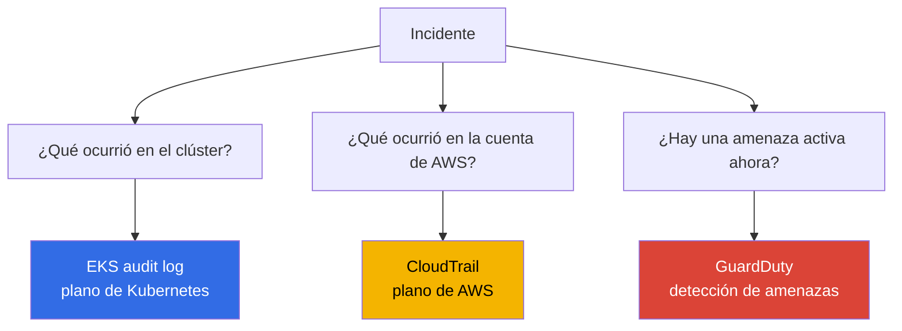
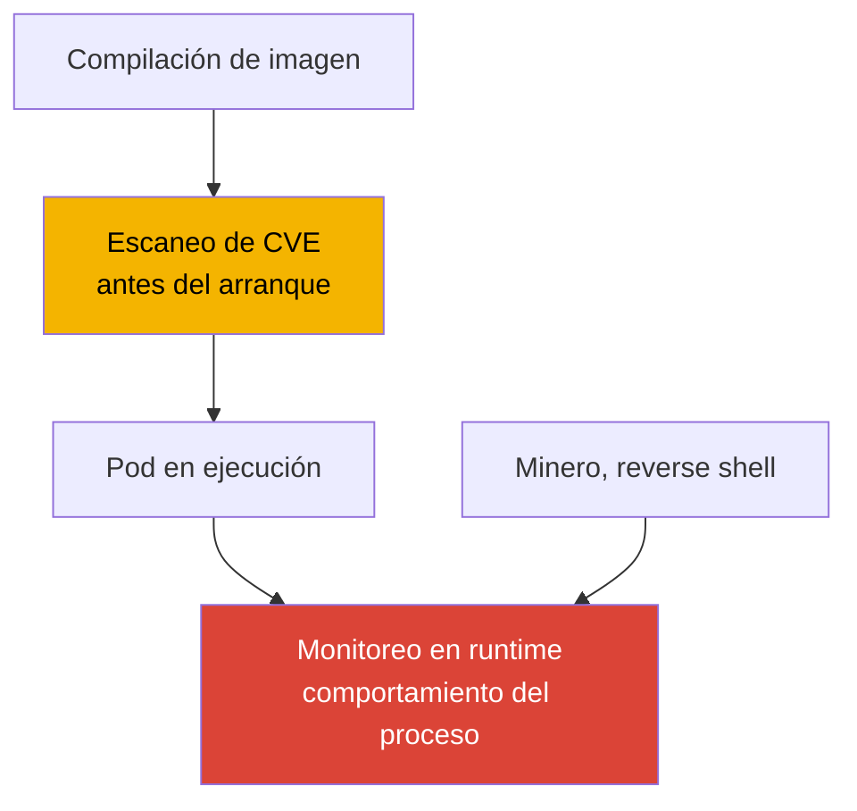
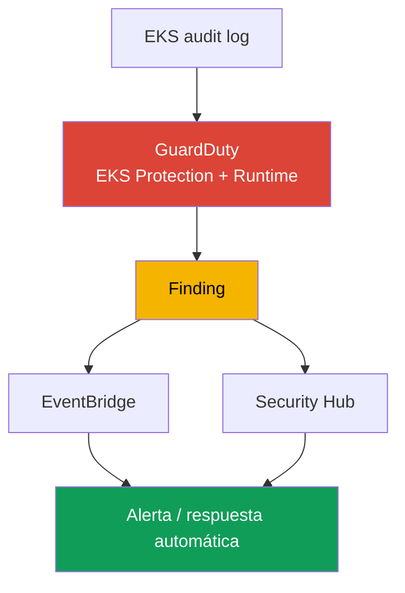
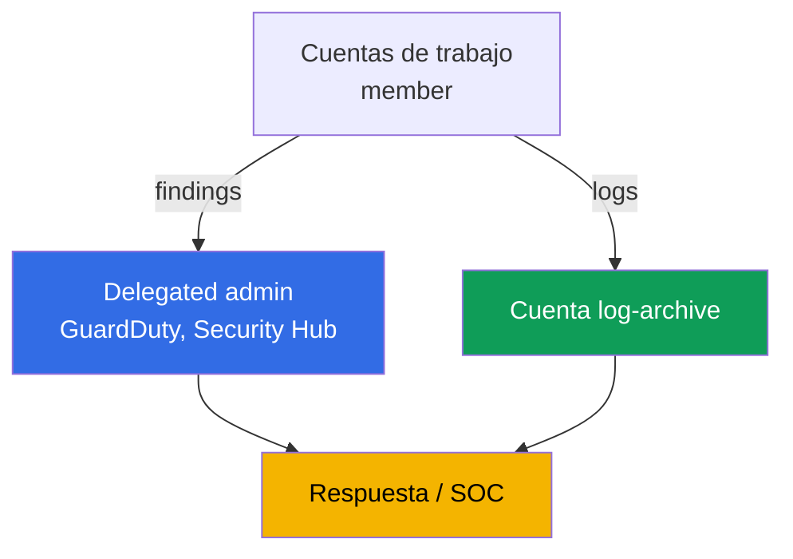

[English version](en.md) · [Русская версия](ru.md) · [Version française](fr.md) · [Deutsche Version](de.md) · [ქართული ვერსია](ge.md) · [繁體中文版](tw.md) · [日本語版](jp.md)
# Capítulo 21. Auditoría y detección: logs de control plane, CloudTrail, GuardDuty y monitoreo en runtime

> **Qué sigue.** La Parte 3 cubrió la identidad (capítulos 16-17), los secretos (capítulo 18), el hardening
> del nodo, el pod y la red (capítulo 19), y la supply chain de imágenes (capítulo 20). Este capítulo trata
> sobre cómo saber qué ocurrió en el clúster y en la cuenta, y si hay un ataque en curso ahora mismo.
> Revisamos tres niveles: EKS audit log, CloudTrail y GuardDuty (EKS Protection y Runtime Monitoring).
> Los temas relacionados están en otros capítulos: habilitar los cinco tipos de logs de control plane y su
> funcionamiento (capítulo 2), métricas y observabilidad para depuración (capítulo 33), logs de aplicaciones
> mediante Fluent Bit (capítulo 34), hardening (capítulo 19), políticas de admission (capítulo 22), RBAC y
> authenticator (capítulo 5), y coste y retention de logs (capítulos 34, 43).

## 21.1. «Quién eliminó el namespace y por qué no se puede averiguar»

Por la mañana, un namespace de producción desapareció junto con sus cargas de trabajo. La primera pregunta de la
persona de guardia es quién y cuándo lo eliminó, con qué identidad y desde qué dirección. No hay respuesta: el
log de auditoría del control plane no estaba habilitado (capítulo 2), no había filtros de métricas para operaciones
peligrosas, y los logs no pueden aparecer retroactivamente. No es posible encontrar al responsable ni evitar que se
repita. No es un fallo aislado, sino una zona ciega: no se observaba la actividad de seguridad en el clúster.

También existen problemas relacionados de la misma naturaleza:

- **Un pod comprometido mina criptomonedas durante una semana.** Un atacante entra en un contenedor mediante una
  vulnerabilidad, inicia un minero y una reverse shell. Nadie vigila el runtime: el escaneo de imágenes (capítulo
  20) se ejecutó antes del arranque y no sabe qué hace el proceso ahora. Nadie detecta el tráfico anómalo ni el
  proceso no autorizado hasta que llega una factura o una queja.
- **Alguien exfiltró secretos.** Un pod o usuario recorrió `get secrets` en un namespace y obtuvo el contenido.
  RBAC lo permitía formalmente, el evento no se destaca en ningún sitio y la filtración solo afloraría durante una
  investigación, si hubiera datos que investigar.
- **Se modificó el clúster como recurso de AWS.** Alguien amplió `publicAccessCidrs` a `0.0.0.0/0` o eliminó la
  configuración de encryption. No es un evento de Kubernetes, sino una llamada a la API de AWS, y no aparece en
  absoluto en el audit log del clúster.

Estos casos no se resuelven con una sola casilla, sino con tres fuentes distintas, cada una responde a su propia
pregunta.

## 21.2. Tres preguntas de seguridad y tres fuentes de respuesta

La tesis principal del capítulo es que los «logs del clúster» no son un único flujo, sino tres planos distintos, y
confundirlos es costoso. La pregunta determina la fuente.



| Pregunta | Fuente | Plano | Ejemplo |
|---|---|---|---|
| Qué ocurrió en el clúster | EKS audit log | API de Kubernetes | quién eliminó un namespace, quién leyó secrets |
| Qué ocurrió en la cuenta | CloudTrail | API de AWS | quién cambió la configuración del clúster, un node group |
| Si hay una amenaza activa | GuardDuty | detección en tiempo real | minero en un nodo, acceso anónimo |

La clave es separar los planos. La eliminación de un namespace mediante `kubectl` se ve en el **audit log**, pero
no en CloudTrail: para CloudTrail no es un evento de AWS. La ampliación de `publicAccessCidrs` se ve en
**CloudTrail** (`UpdateClusterConfig`), pero no en el audit log: para Kubernetes no es un evento del clúster. Y
un minero que no toca ni la API de Kubernetes ni la API de AWS no se ve en ninguna de esas fuentes, solo lo
captura **GuardDuty Runtime Monitoring** por el comportamiento del proceso. Las tres fuentes no se sustituyen,
se complementan.

## 21.3. EKS audit log en detalle: lectura para detección

El capítulo 2 explicó el mecanismo para habilitar los cinco tipos de logs; aquí el audit log interesa en concreto
como fuente de investigación. Cada entrada es un evento JSON de Kubernetes audit: quién (`user.username`, el
principal de IAM mapeado mediante authenticator, capítulo 5), qué hizo (`verb`: `get`, `list`, `create`, `delete`),
sobre qué (`objectRef.resource`, `objectRef.name`, `objectRef.namespace`), desde dónde (`sourceIPs`), cuándo
(`requestReceivedTimestamp`) y con qué resultado (`responseStatus.code`, la decisión de autorización en
`annotations`). Además, está `auditID`: el identificador único de la solicitud. Una solicitud genera entradas en
varios stage (`RequestReceived`, `ResponseComplete`) con el mismo `auditID`, lo que permite reunir todas las
entradas de una operación en una única imagen.

Se escribe en CloudWatch Logs, en el log group `/aws/eks/<cluster>/cluster`, y el flujo es
`kube-apiserver-audit-<id>`. Se analiza mediante **CloudWatch Logs Insights**: un lenguaje de consultas con
`fields`, `filter`, `sort`, `stats`, `limit`.

```
fields @timestamp, user.username, verb, objectRef.resource, objectRef.namespace, sourceIPs.0
| filter verb = "delete" and objectRef.resource = "namespaces"
| sort @timestamp desc
| limit 20
```

Consultas habituales para preguntas concretas:

| Pregunta | Núcleo del filtro de Logs Insights |
|---|---|
| Quién eliminó un namespace | `verb="delete" and objectRef.resource="namespaces"` |
| Quién accedió a secrets | `verb in ["get","list"] and objectRef.resource="secrets"` |
| Acceso anónimo | `user.username="system:anonymous"` |
| Denegaciones de autorización | `responseStatus.code=403` |
| Acciones de un principal concreto | `user.username="arn:aws:sts::...:assumed-role/..."` |

```
fields @timestamp, user.username, objectRef.namespace, objectRef.name
| filter user.username = "system:anonymous"
| sort @timestamp desc
| limit 50
```

Un límite importante: el audit log responde de forma fiable a «quién/cuándo/con qué verb/sobre qué recurso». Pero
el contenido de la solicitud, por ejemplo, si un pod tenía `privileged: true`, no siempre aparece en él. Depende
del nivel de auditoría, y de forma predeterminada el cuerpo de la solicitud no se registra para todas las
operaciones en la política de auditoría de EKS. Por ello, «la creación de un pod privilegiado» se detecta de forma
más fiable no analizando el cuerpo en Logs Insights, sino mediante la detección preparada de GuardDuty EKS
Protection (sección 21.5). Al formular conclusiones a partir del audit log, conviene ser prudente: trata sobre el
hecho de la operación, no siempre sobre todo su contenido.

## 21.4. CloudTrail para EKS: el plano de AWS

CloudTrail registra llamadas a la API de AWS. Para EKS, son operaciones sobre el clúster **como recurso de AWS**:
`CreateCluster`, `DeleteCluster`, `UpdateClusterConfig` (incluido el cambio de `publicAccessCidrs` y de la
configuración de logs), `AssociateEncryptionConfig`, `CreateAccessEntry`, y cambios en managed node group
(`CreateNodegroup`, `UpdateNodegroupConfig`). Quién llamó, cuándo, desde qué IP, bajo qué rol y con qué resultado,
todo eso está en CloudTrail.

La diferencia respecto al audit log es fundamental y conviene tenerla presente: **CloudTrail = plano de AWS**
(lo que se hizo con el clúster desde fuera, mediante la API de EKS), **audit log = plano de Kubernetes** (lo que se
hizo dentro del clúster, mediante la API de Kubernetes). La eliminación de un pod no aparecerá en CloudTrail; la
eliminación de un node group no aparecerá en el audit log.

CloudTrail distingue **management events** (operaciones sobre recursos, creación, modificación, eliminación;
habilitados de forma predeterminada) y **data events** (operaciones sobre datos dentro del recurso; deshabilitados
de forma predeterminada, se habilitan por separado y tienen mucho volumen). Las operaciones de administración
sobre un clúster de EKS son management events.

```bash
# quién y cuándo modificó la configuración del clúster, en los últimos eventos
aws cloudtrail lookup-events \
  --lookup-attributes AttributeKey=EventName,AttributeValue=UpdateClusterConfig \
  --query 'Events[].{Time:EventTime,User:Username,Event:EventName}' --output table

# todos los eventos del clúster concreto como recurso
aws cloudtrail lookup-events \
  --lookup-attributes AttributeKey=ResourceName,AttributeValue=demo
```

Cuando un incidente afecta a ambos planos, se cambió la configuración del clúster mediante la API de AWS y después
se hizo algo dentro del clúster, la imagen se reúne desde las dos fuentes a la vez. No existe un identificador común
entre el audit log y CloudTrail: las entradas dentro del audit log se relacionan mediante `auditID`, mientras que
entre fuentes los eventos se unen por principal (rol de IAM), IP (`sourceIPs` frente al campo de CloudTrail) y
ventana temporal. Así se construye una línea de tiempo única, «qué ocurrió en la cuenta -> qué ocurrió en el
clúster», y no dos listas.

Se correlacionan por tres dimensiones coincidentes. Estos son sus campos en cada fuente:

| Qué se correlaciona | Campo en audit log | Campo en CloudTrail |
|---|---|---|
| Principal | `user.username` | `userIdentity` (`Username` en `lookup-events`) |
| IP de origen | `sourceIPs` | `sourceIPAddress` |
| Hora | `requestReceivedTimestamp` | `eventTime` |

## 21.5. GuardDuty para EKS: EKS Protection y Runtime Monitoring

GuardDuty es un servicio de detección de amenazas. Para EKS opera en dos niveles, y son cosas diferentes.

**EKS Protection** analiza los **EKS audit logs** para encontrar actividad sospechosa en el control plane. Un dato
importante: GuardDuty recopila audit logs mediante **su propio flujo independiente** y no necesita configuración
adicional. No es obligatorio habilitar el control plane logging en CloudWatch para que funcione EKS Protection
(esa habilitación solo es necesaria si se quieren ver los audit logs en la propia cuenta). Detecta acciones como
acceso a la API desde IP maliciosas conocidas, acceso de `system:anonymous`, escalada de privilegios, ejecución de
contenedores privilegiados y uso sospechoso de la API.

**Runtime Monitoring** es otro nivel: observa el **comportamiento en los nodos**. Funciona mediante el add-on de
EKS `aws-guardduty-agent` (GuardDuty security agent), basado en eBPF, que supervisa los procesos, conexiones de
red y actividad de archivos de los contenedores. Así captura elementos que no están ni en el audit log ni en
CloudTrail: mineros, reverse shell, accesos a dominios maliciosos y ejecución de binarios sospechosos. Según la
documentación, Runtime Monitoring admite EKS en instancias EC2 y en EKS Auto Mode, pero **no** admite Fargate ni
EKS Hybrid Nodes. El agente puede desplegarse automáticamente (automated agent configuration) o administrarse de
forma manual.

| Propiedad | EKS Protection | Runtime Monitoring |
|---|---|---|
| Fuente | EKS audit logs (flujo propio) | agente en el nodo (eBPF) |
| Qué ve | llamadas a la API de Kubernetes | procesos, red, archivos del contenedor |
| Requiere agente en los nodos | no | sí, `aws-guardduty-agent` |
| Detecta | acceso anónimo, escalada, IP maliciosas | minero, reverse shell, dominios maliciosos |
| Limitaciones | - | no Fargate, no Hybrid Nodes |

GuardDuty presenta lo encontrado como un **finding** y lo envía a Security Hub y EventBridge. Desde ahí se
construyen las alertas y la respuesta automática (sección 21.7).

## 21.6. Monitoreo en runtime en detalle: comportamiento frente a imagen

Es fácil confundir el monitoreo en runtime con el escaneo de imágenes (capítulo 20), pero tratan momentos
distintos. El escaneo detecta **CVE conocidas en la imagen ANTES del arranque**, es un análisis estático del
artefacto. Runtime detecta el **comportamiento del software DESPUÉS del arranque**, lo que el proceso hace en
realidad dentro del contenedor en ejecución. Uno no sustituye al otro: una imagen limpia según el escaneo puede
comprometerse en runtime mediante una vulnerabilidad de la aplicación, y un minero ni siquiera tiene que estar en
la imagen, puede descargarse dentro de un pod ya en ejecución.



La detección en runtime para EKS se implementa por dos vías. **GuardDuty Runtime Monitoring** es la opción
administrada: agente de AWS, findings en Security Hub, no hay que alojar nada. Las **herramientas de terceros**,
por ejemplo Falco, un proyecto de CNCF de seguridad en runtime basado en los mismos eventos de eBPF/syscall,
ofrecen más flexibilidad en las reglas, pero hay que instalarlas, actualizarlas y mantenerlas. Lo que ve el agente
en ambos casos es el inicio de procesos, las conexiones de red, el acceso a archivos y los intentos de escape del
contenedor. Elegir entre una opción administrada y una propia es elegir entre «menos control, cero mantenimiento» y
«control total, operación propia».

## 21.7. Cómo se reúne en una cadena de detección

Las fuentes separadas forman un único flujo, desde el evento hasta la reacción. Una interrupción al final invalida
el principio: un finding que nadie observa no detiene el incidente.



Se lee así: el audit log y el agente alimentan a GuardDuty, que genera un finding; el finding va a Security Hub
(agregación y priorización en todas las cuentas) y a EventBridge, y una regla de EventBridge desencadena una
reacción, una notificación en chat/SNS, un ticket o una acción automática mediante Lambda (aislar un pod, retirar
un nodo, revocar una sesión). Otra rama del mismo flujo son los filtros de métricas de CloudWatch sobre eventos
críticos del propio audit log, como eliminación de namespace o acciones de `system:anonymous`, con alarmas sin
esperar a GuardDuty.

## 21.8. Organización en múltiples cuentas

En una sola cuenta, la detección no sirve contra quien tiene permisos de administrador de esa misma cuenta: puede
borrar rastros y logs. Por ello, en una organización la observación se saca de las cuentas de trabajo.



- **Delegated administrator.** Mediante AWS Organizations, se asigna a GuardDuty y Security Hub una cuenta de
  administrador independiente (delegated administrator), que gestiona el servicio para toda la organización y ve
  los findings de todas las cuentas miembro. La designación es regional: se configura un delegated administrator
  en cada región. Así, habilitar GuardDuty en nuevas cuentas y recopilar findings es centralizado y no depende de
  la buena voluntad de la persona propietaria de la cuenta de trabajo. Los findings críticos del delegated
  administrator se exportan a un bucket de S3 en la cuenta `log-archive`, una copia inmutable del evento sobrevive
  a la limpieza en la propia cuenta de trabajo.
- **Cuenta de auditoría independiente.** Los findings y dashboards de seguridad viven en una cuenta a la que los
  equipos de desarrollo no tienen acceso.
- **Logs en log-archive.** El CloudTrail de la organización y el archivo de audit logs se depositan en una cuenta
  `log-archive` separada (capítulo 0.1), con acceso restringido y almacenamiento inmutable (S3 Object Lock, WORM),
  para que el administrador de una cuenta de trabajo no pueda eliminar o falsificar físicamente el historial. Es
  una condición para confiar en los logs durante una investigación.

## 21.9. Cómo se aplica en producción

- **Audit log siempre habilitado.** Como mínimo `audit` y `authenticator` desde el primer día (capítulo 2), con
  retention configurada explícitamente y un archivo de largo plazo enviado a S3 en una cuenta independiente
  (capítulos 34, 43).
- **GuardDuty para toda la organización.** EKS Protection y Runtime Monitoring están habilitados mediante
  delegated administrator en todas las cuentas y regiones en uso, y las nuevas cuentas se conectan
automáticamente.
- **Filtros de métricas y alarmas para eventos críticos.** Eliminación de namespace, acciones de
  `system:anonymous`, un pico de `403`, acceso a secrets, filtros de métricas de CloudWatch sobre el audit log con
  alarmas, sin esperar a un servicio externo.
- **Respuesta automatizada a findings.** Los findings de Security Hub y EventBridge llegan a las alertas y al
  runbook. Para los tipos críticos existe una respuesta descrita de antemano, no una investigación desde cero.
- **CloudTrail separado del audit log en la mentalidad del equipo.** «Quién modificó el clúster como recurso de
  AWS» corresponde a CloudTrail; «quién modificó objetos dentro» corresponde al audit log. Ambas fuentes están
  protegidas contra alteraciones.
- **Runtime Monitoring donde está admitido.** En nodos EC2 y Auto Mode, agente de GuardDuty; para cargas de
  Fargate, donde el agente no está admitido, la detección se construye en otras capas.

## 21.10. Mini glosario

- **EKS audit log**: tipo de log de control plane (`audit`), eventos JSON de Kubernetes audit: quién, qué verb,
  sobre qué recurso, desde dónde y con qué resultado. Se escribe en CloudWatch Logs.
- **CloudWatch Logs Insights**: lenguaje de consultas de logs (`fields`, `filter`, `sort`, `stats`), la principal
  herramienta para analizar el audit log.
- **CloudTrail**: registro de llamadas a la API de AWS; para EKS registra operaciones sobre el clúster como
  recurso de AWS (management events), no eventos dentro de Kubernetes.
- **GuardDuty EKS Protection**: análisis de EKS audit logs para amenazas mediante un flujo independiente propio de
  GuardDuty, sin necesidad de habilitar control plane logging.
- **GuardDuty Runtime Monitoring**: observación del comportamiento en los nodos mediante el agente
  `aws-guardduty-agent` (eBPF): procesos, red, archivos. No admite Fargate ni Hybrid Nodes.
- **auditID**: identificador único de la solicitud en el audit log, igual para todos los stage de una operación. No
  hay un ID común con CloudTrail, entre fuentes se correlaciona por principal, IP y hora.
- **Finding**: hallazgo de GuardDuty; se envía a Security Hub y EventBridge para alertas y respuesta.
- **Delegated administrator**: cuenta de la organización que administra GuardDuty/Security Hub para toda la
  organización y ve los findings de todos los miembros; se asigna por región.

## 21.11. Resumen del capítulo

- La observación de seguridad de EKS son tres planos distintos, no un solo log. Confundirlos es costoso: la
  pregunta determina la fuente de respuesta.
- EKS audit log responde a «qué ocurrió en el clúster»: quién, qué verb, sobre qué recurso, desde dónde y con qué
  resultado. Se analiza mediante CloudWatch Logs Insights en el log group `/aws/eks/<cluster>/cluster`. El cuerpo
  de la solicitud no siempre se incluye, depende del nivel de auditoría.
- CloudTrail responde a «qué ocurrió en la cuenta de AWS»: operaciones sobre el clúster como recurso
  (`UpdateClusterConfig`, `CreateAccessEntry`, cambios de node group). Es el plano de AWS, no de Kubernetes; los
  management events están habilitados de forma predeterminada.
- GuardDuty responde a «hay una amenaza activa ahora». EKS Protection analiza audit logs mediante su propio flujo
  sin configuración adicional; Runtime Monitoring, mediante un agente en los nodos, captura mineros y reverse
  shell, pero no funciona en Fargate ni Hybrid Nodes.
- El monitoreo en runtime captura comportamiento DESPUÉS del arranque y no sustituye al escaneo de imágenes, que
  captura CVE ANTES del arranque. La opción administrada es GuardDuty; la flexible es Falco con operación propia.
- Los findings se reúnen en una cadena: audit/agente -> GuardDuty -> Security Hub/EventBridge ->
  alerta/respuesta. En múltiples cuentas se traslada a delegated administrator y log-archive para que el
  administrador de la cuenta de trabajo no pueda borrar los rastros.

## 21.12. Cómo será útil en el trabajo real

La pregunta «quién eliminó el namespace» durante una guardia deja de ser un callejón sin salida y se convierte en
una consulta de Logs Insights, pero solo si el audit log se habilitó de antemano y aún no ha superado su retention.
El incidente «un pod mina durante una semana» no dura una semana donde Runtime Monitoring genera un finding en las
primeras horas. Y la discusión «esto se modificó mediante la API de AWS o dentro del clúster» se resuelve eligiendo
la fuente: CloudTrail frente a audit log; mantener ese límite claro ahorra horas de investigación. En la
planificación, conviene hacer tres cosas antes del primer incidente, no después: habilitar audit log con retention,
habilitar GuardDuty para la organización y trasladar los logs a una cuenta independiente. Nada de esto se puede
obtener a posteriori.

## 21.13. Preguntas de autoevaluación

1. ¿Qué tres preguntas de seguridad responden el audit log, CloudTrail y GuardDuty?
2. ¿Por qué la eliminación de un namespace se ve en el audit log, pero no en CloudTrail?
3. ¿Por qué el cambio de `publicAccessCidrs` se ve en CloudTrail, pero no en el audit log?
4. ¿Qué campos de una entrada de audit log responden a «quién, qué, sobre qué, desde dónde y con qué resultado»?
5. Escriba el núcleo de las consultas de Logs Insights «quién eliminó un namespace» y «acceso anónimo».
6. ¿Por qué «la creación de un pod privilegiado» no siempre se detecta de forma fiable mediante el audit log?
7. ¿En qué se diferencian los management events de los data events en CloudTrail?
8. ¿Qué analiza GuardDuty EKS Protection y es necesario habilitar control plane logging para usarlo?
9. ¿Mediante qué funciona GuardDuty Runtime Monitoring y qué plataformas no admite?
10. ¿En qué se diferencia el monitoreo en runtime del escaneo de imágenes y por qué uno no sustituye al otro?
11. ¿A dónde envía GuardDuty los findings y cómo se construye una respuesta a partir de ellos?
12. ¿Para qué sirven delegated administrator y una cuenta log-archive independiente en múltiples cuentas?
13. ¿Cómo relacionar eventos del audit log y CloudTrail si no tienen un identificador común?

## Práctica

Este capítulo aún no tiene un laboratorio propio, pero todo puede verificarse en un clúster y cuenta activos.
Compruebe que `audit` está habilitado: `aws eks describe-cluster --name demo --query 'cluster.logging'`, y que
existe el log group: `aws logs describe-log-groups --log-group-name-prefix /aws/eks/demo`. Abra CloudWatch Logs
Insights para `/aws/eks/demo/cluster` y ejecute la consulta con `filter objectRef.resource="namespaces"`. Elimine
un namespace de prueba y encuéntrese en los resultados.

A continuación, GuardDuty: `aws guardduty list-detectors` mostrará el detector de la región, y
`aws guardduty get-detector --detector-id <id>` mostrará su estado y las features habilitadas (EKS Protection,
Runtime Monitoring). Consulte las operaciones sobre el clúster en CloudTrail:
`aws cloudtrail lookup-events --lookup-attributes
AttributeKey=EventName,AttributeValue=UpdateClusterConfig`. Si hay un nodo de prueba en EC2, instale el add-on
`aws-guardduty-agent` y compruebe que los findings llegan a Security Hub. El análisis de políticas de admission,
que bloquean lo peligroso antes de que entre, está en el capítulo 22.

---
[Índice](../README_ES.md) · [Capítulo 20](../20/es.md) · [Capítulo 22](../22/es.md)
[English version](en.md) · [Русская версия](ru.md) · [Version française](fr.md) · [Deutsche Version](de.md) · [ქართული ვერსია](ge.md) · [繁體中文版](tw.md) · [日本語版](jp.md)
