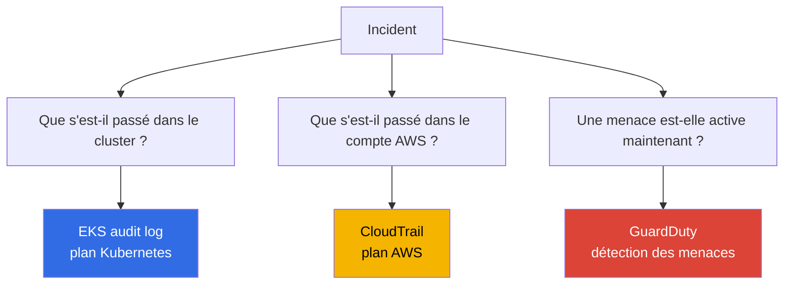
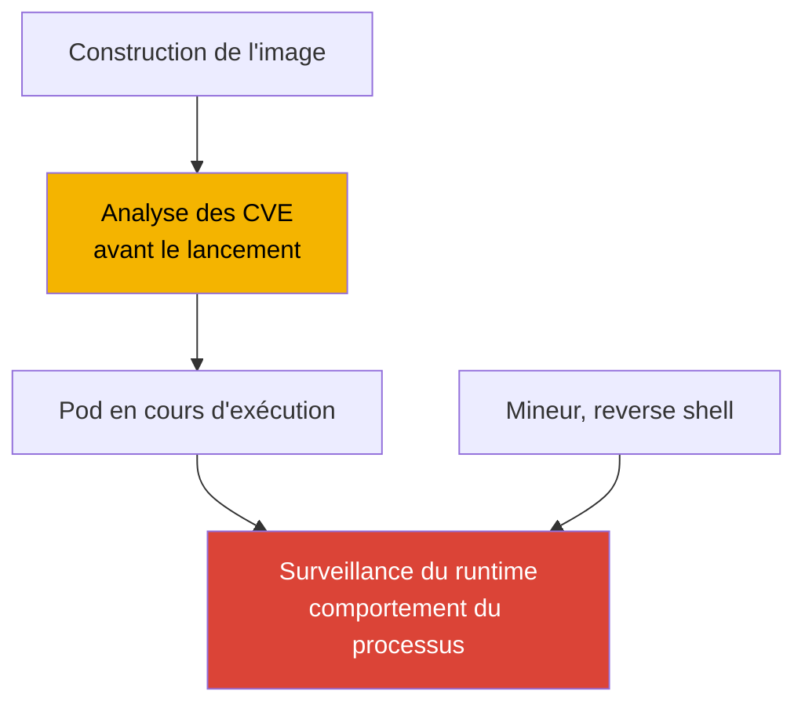
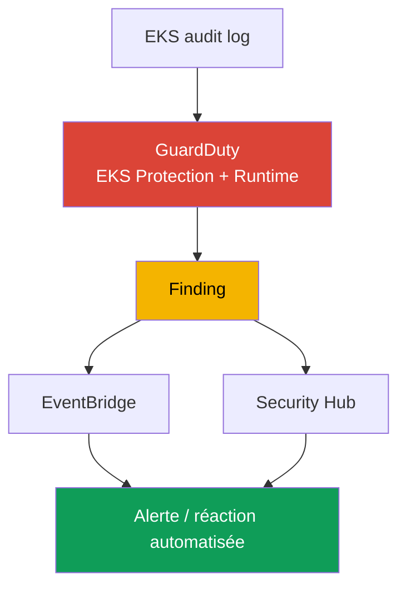
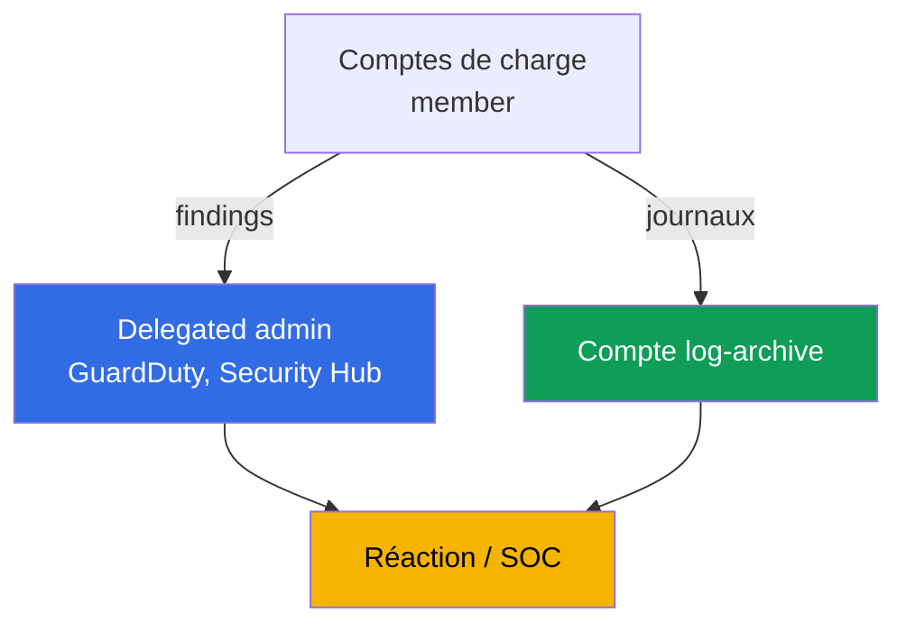

[English version](en.md) · [Русская версия](ru.md) · [Versión en español](es.md) · [Deutsche Version](de.md) · [ქართული ვერსია](ge.md) · [繁體中文版](tw.md) · [日本語版](jp.md)
# Chapitre 21. Audit et détection : journaux du control plane, CloudTrail, GuardDuty, surveillance du runtime

> **La suite.** La partie 3 a couvert l'identité (chapitres 16-17), les secrets (chapitre 18), le durcissement
> du nœud, du pod et du réseau (chapitre 19), ainsi que la chaîne d'approvisionnement des images (chapitre 20).
> Ce chapitre explique comment savoir ce qui s'est passé dans le cluster et le compte, et si une attaque est en
> cours. Nous examinons trois niveaux : EKS audit log, CloudTrail et GuardDuty (EKS Protection et Runtime
> Monitoring). Les sujets connexes sont traités dans d'autres chapitres : l'activation des cinq types de journaux
> du control plane et leur fonctionnement (chapitre 2), les métriques et l'observability pour le diagnostic
> (chapitre 33), les journaux applicatifs via Fluent Bit (chapitre 34), le durcissement (chapitre 19), les
> politiques d'admission (chapitre 22), RBAC et l'authenticator (chapitre 5), ainsi que le coût et la retention
> des journaux (chapitres 34, 43).

## 21.1. « Qui a supprimé le namespace, et pourquoi il est impossible de le savoir »

Le matin, un namespace de production a disparu avec ses charges. La première question de l'astreinte est de
savoir qui l'a supprimé, quand, avec quelle identité et depuis quelle adresse. Il n'y a pas de réponse : le
journal d'audit du control plane n'était pas activé (chapitre 2), aucun metric filter n'était configuré sur les
opérations dangereuses, et les journaux ne peuvent pas apparaître rétroactivement. Impossible de trouver le
responsable et d'empêcher la récidive. Ce n'est pas une panne isolée, mais une zone aveugle : la sécurité du
cluster n'était pas observée.

Des problèmes apparentés de même nature surviennent aussi :

- **Un pod compromis mine des cryptomonnaies pendant une semaine.** Un attaquant entre dans un conteneur par
  une vulnérabilité, lance un mineur et un reverse shell. Personne ne surveille le runtime : l'analyse de l'image
  (chapitre 20) s'est faite avant le démarrage et ne sait rien de ce que le processus fait maintenant. Personne ne
  remarque le trafic anormal ni le processus indésirable jusqu'à l'arrivée d'une facture ou d'une plainte.
- **Quelqu'un a exfiltré des secrets.** Un pod ou un utilisateur exécute `get secrets` dans tout un namespace et
  récupère le contenu. RBAC l'autorisait formellement, l'événement n'est signalé nulle part et la fuite ne serait
  découverte qu'au cours d'une enquête, à condition qu'il y ait des données à examiner.
- **Le cluster a été modifié comme ressource AWS.** Quelqu'un a étendu `publicAccessCidrs` à `0.0.0.0/0` ou a
  supprimé la encryption config. Ce n'est pas un événement Kubernetes, mais un appel à l'API AWS : il est donc
  totalement absent du journal d'audit du cluster.

Ces cas ne se résolvent pas par une seule case à cocher, mais par trois sources distinctes, chacune répondant à
sa propre question.

## 21.2. Trois questions de sécurité et trois sources de réponse

L'idée centrale du chapitre est que les « journaux du cluster » ne forment pas un seul flux, mais trois plans
séparés, et les confondre coûte cher. La question détermine la source.



| Question | Source | Plan | Exemple |
|---|---|---|---|
| Que s'est-il passé dans le cluster | EKS audit log | Kubernetes API | qui a supprimé un namespace, qui a lu des secrets |
| Que s'est-il passé dans le compte | CloudTrail | AWS API | qui a modifié la configuration du cluster, un node group |
| Une menace est-elle active | GuardDuty | détection en temps réel | mineur sur un nœud, accès anonyme |

L'essentiel est de séparer les plans. La suppression d'un namespace par `kubectl` est visible dans le
**journal d'audit**, mais pas dans CloudTrail : ce n'est pas un événement AWS pour CloudTrail. L'extension de
`publicAccessCidrs` est visible dans **CloudTrail** (`UpdateClusterConfig`), mais pas dans le journal d'audit :
ce n'est pas un événement de cluster pour Kubernetes. Un mineur qui ne touche ni l'API Kubernetes ni l'API AWS
n'est visible nulle part : seul **GuardDuty Runtime Monitoring** le détecte par le comportement du processus.
Les trois sources ne se remplacent pas, elles se complètent.

## 21.3. EKS audit log en détail : le lire pour détecter

Le chapitre 2 a expliqué l'activation des cinq types de journaux. Ici, le journal d'audit est particulièrement
important comme source d'enquête. Chaque enregistrement est un événement JSON d'audit Kubernetes : qui
(`user.username`, le principal IAM mappé via l'authenticator, chapitre 5), quoi (`verb` : `get`, `list`,
`create`, `delete`), sur quoi (`objectRef.resource`, `objectRef.name`, `objectRef.namespace`), d'où
(`sourceIPs`), quand (`requestReceivedTimestamp`) et avec quel résultat (`responseStatus.code`, la décision
d'autorisation dans `annotations`). Il existe aussi `auditID`, l'identifiant unique de la requête. Une requête
produit des enregistrements à différents stages (`RequestReceived`, `ResponseComplete`) avec le même `auditID`.
On l'utilise pour rassembler tous les enregistrements d'une opération en une vue unique.

Il est écrit dans CloudWatch Logs, dans le log group `/aws/eks/<cluster>/cluster`, avec le flux
`kube-apiserver-audit-<id>`. Il s'analyse avec **CloudWatch Logs Insights**, un langage de requête utilisant
`fields`, `filter`, `sort`, `stats` et `limit`.

```
fields @timestamp, user.username, verb, objectRef.resource, objectRef.namespace, sourceIPs.0
| filter verb = "delete" and objectRef.resource = "namespaces"
| sort @timestamp desc
| limit 20
```

Requêtes typiques pour des questions précises :

| Question | Noyau du filtre Logs Insights |
|---|---|
| Qui a supprimé un namespace | `verb="delete" and objectRef.resource="namespaces"` |
| Qui a accédé aux secrets | `verb in ["get","list"] and objectRef.resource="secrets"` |
| Accès anonyme | `user.username="system:anonymous"` |
| Refus d'autorisation | `responseStatus.code=403` |
| Actions d'un principal donné | `user.username="arn:aws:sts::...:assumed-role/..."` |

```
fields @timestamp, user.username, objectRef.namespace, objectRef.name
| filter user.username = "system:anonymous"
| sort @timestamp desc
| limit 50
```

Une limite importante : le journal d'audit répond de manière fiable à « qui, quand, quel verb et sur quelle
ressource ». En revanche, le contenu de la requête, par exemple si un pod contenait `privileged: true`, n'est pas
toujours enregistré. Cela dépend du niveau d'audit et la politique d'audit EKS par défaut ne consigne pas les
corps de requête de toutes les opérations. Il est donc plus fiable de détecter la « création d'un pod privilégié »
par la détection prête à l'emploi GuardDuty EKS Protection (section 21.5) qu'en analysant le corps dans Logs
Insights. Il faut formuler les constats du journal d'audit avec prudence : il porte sur le fait d'une opération,
pas toujours sur son contenu complet.

## 21.4. CloudTrail pour EKS : le plan AWS

CloudTrail enregistre les appels à l'API AWS. Pour EKS, il s'agit d'opérations sur le cluster **en tant que
ressource AWS** : `CreateCluster`, `DeleteCluster`, `UpdateClusterConfig` (notamment les modifications de
`publicAccessCidrs` et des paramètres de journalisation), `AssociateEncryptionConfig`, `CreateAccessEntry`, ainsi
que les modifications de managed node group (`CreateNodegroup`, `UpdateNodegroupConfig`). Qui a appelé, quand,
depuis quelle IP, sous quel rôle et avec quel résultat, tout est dans CloudTrail.

La différence avec le journal d'audit est fondamentale et mérite d'être retenue : **CloudTrail = le plan AWS**
(ce qui a été fait au cluster depuis l'extérieur par l'API EKS), **journal d'audit = le plan Kubernetes** (ce qui
a été fait à l'intérieur du cluster par l'API Kubernetes). La suppression d'un pod n'apparaît pas dans CloudTrail ;
la suppression d'un node group n'apparaît pas dans le journal d'audit.

CloudTrail distingue les **management events** (opérations sur les ressources : création, modification et
suppression, activées par défaut) et les **data events** (opérations sur les données au sein d'une ressource,
désactivées par défaut, activées séparément et volumineuses). Les opérations de gestion sur un cluster EKS sont des
management events.

```bash
# qui et quand a modifié la configuration du cluster, parmi les événements récents
aws cloudtrail lookup-events \
  --lookup-attributes AttributeKey=EventName,AttributeValue=UpdateClusterConfig \
  --query 'Events[].{Time:EventTime,User:Username,Event:EventName}' --output table

# tous les événements pour un cluster précis en tant que ressource
aws cloudtrail lookup-events \
  --lookup-attributes AttributeKey=ResourceName,AttributeValue=demo
```

Quand un incident touche les deux plans, par exemple lorsqu'on modifie la configuration du cluster par l'API AWS
puis que l'on fait quelque chose dans le cluster, il faut assembler la vue à partir des deux sources. Il n'existe
pas d'identifiant commun entre le journal d'audit et CloudTrail : dans le journal d'audit, les enregistrements sont
liés par `auditID` ; entre les sources, les événements sont corrélés par le principal (rôle IAM), l'IP
(`sourceIPs` face au champ CloudTrail) et la fenêtre temporelle. Cela construit une chronologie unique « ce qui
s'est passé dans le compte -> ce qui s'est passé dans le cluster », plutôt que deux listes.

La corrélation s'effectue selon trois dimensions communes. Voici leurs champs dans chaque source :

| Élément à corréler | Champ du journal d'audit | Champ CloudTrail |
|---|---|---|
| Principal | `user.username` | `userIdentity` (`Username` dans `lookup-events`) |
| IP source | `sourceIPs` | `sourceIPAddress` |
| Heure | `requestReceivedTimestamp` | `eventTime` |

## 21.5. GuardDuty pour EKS : EKS Protection et Runtime Monitoring

GuardDuty est un service de détection des menaces. Pour EKS, il fonctionne à deux niveaux, qui sont deux choses
distinctes.

**EKS Protection** analyse les **EKS audit logs** pour détecter l'activité suspecte du control plane. Un fait
important est que GuardDuty collecte les journaux d'audit par **son propre flux indépendant**, sans nécessiter de
configuration supplémentaire. Il n'est pas nécessaire d'activer le control plane logging dans CloudWatch pour que
EKS Protection fonctionne. Cette activation n'est requise que si vous voulez consulter les journaux d'audit dans
votre compte. Il détecte notamment les accès à l'API depuis des IP malveillantes connues, les accès par
`system:anonymous`, les élévations de privilèges, le lancement de conteneurs privilégiés et l'usage suspect de
l'API.

**Runtime Monitoring** est un autre niveau : il surveille le **comportement sur les nœuds**. Il fonctionne grâce à
l'add-on EKS `aws-guardduty-agent` (GuardDuty security agent), basé sur eBPF, qui observe les processus de
conteneurs, les connexions réseau et l'activité des fichiers. Il détecte des éléments qui n'apparaissent ni dans
le journal d'audit ni dans CloudTrail : mineurs, reverse shells, connexions à des domaines malveillants et
exécution de binaires suspects. D'après la documentation, Runtime Monitoring prend en charge EKS sur les instances
EC2 et EKS Auto Mode, mais ne prend **pas** en charge Fargate ni EKS Hybrid Nodes. L'agent peut être déployé
automatiquement (automated agent configuration) ou géré manuellement.

| Propriété | EKS Protection | Runtime Monitoring |
|---|---|---|
| Source | EKS audit logs (flux propre) | agent du nœud (eBPF) |
| Ce qu'il voit | appels à l'API Kubernetes | processus, réseau, fichiers du conteneur |
| Agent requis sur les nœuds | non | oui, `aws-guardduty-agent` |
| Détecte | accès anonyme, élévation, IP malveillantes | mineur, reverse shell, domaines malveillants |
| Limites | - | ni Fargate ni Hybrid Nodes |

GuardDuty produit une détection sous forme de **finding** et l'envoie à Security Hub et EventBridge. À partir de là,
l'alerte et la réaction automatisée sont construites (section 21.7).

## 21.6. Surveillance du runtime en détail : comportement contre image

Il est facile de confondre la surveillance du runtime avec l'analyse d'image (chapitre 20), mais elles concernent
des moments différents. L'analyse détecte les **CVE connues dans une image AVANT son lancement**, soit une analyse
statique de l'artefact. Le runtime détecte le **comportement APRÈS le lancement**, c'est-à-dire ce que le processus
fait réellement dans un conteneur en cours d'exécution. Aucun ne remplace l'autre : une image propre selon une
analyse peut être compromise au runtime par une vulnérabilité applicative, et un mineur n'a même pas besoin d'être
dans l'image puisqu'il peut être téléchargé dans un pod déjà en cours d'exécution.



La détection au runtime pour EKS est mise en œuvre de deux façons. **GuardDuty Runtime Monitoring** est l'option
gérée : un agent AWS, des findings dans Security Hub et rien à héberger soi-même. Les **outils tiers** (par exemple
Falco, projet CNCF de runtime security basé sur les mêmes événements eBPF/syscall) offrent plus de souplesse dans
les règles, mais doivent être installés, mis à jour et exploités par vos soins. Dans les deux cas, l'agent voit les
lancements de processus, les connexions réseau, les accès aux fichiers et les tentatives d'évasion du conteneur. Le
choix entre géré et autogéré est un choix entre « moins de contrôle, zéro maintenance » et « contrôle total,
exploitation à votre charge ».

## 21.7. Comment cela forme une chaîne de détection

Les sources séparées se combinent en un pipeline, de l'événement à la réaction. Une rupture à la fin annule la
valeur du début : un finding que personne ne regarde n'arrête pas un incident.



On le lit ainsi : le journal d'audit et l'agent alimentent GuardDuty, qui génère un finding. Le finding part vers
Security Hub pour l'agrégation et la priorisation dans tous les comptes, puis vers EventBridge, où une règle
déclenche une réaction : notification dans un chat/SNS, ticket ou action automatisée par Lambda (isoler un pod,
retirer un nœud, révoquer une session). Une branche distincte de ce même pipeline consiste en des metric filters
CloudWatch sur les événements critiques du journal d'audit lui-même, comme la suppression d'un namespace ou les
actions `system:anonymous`, avec des alarmes sans attendre GuardDuty.

## 21.8. Organisation dans un environnement multi-comptes

Dans un seul compte, la détection est inutile contre une personne disposant des droits administrateur sur ce même
compte : elle peut effacer les traces et supprimer les journaux. Les organisations déplacent donc l'observability
hors des comptes de charge de travail.



- **Delegated administrator.** Avec AWS Organizations, GuardDuty et Security Hub sont attribués à un compte
  administrateur séparé (delegated administrator), qui gère le service pour toute l'organisation et voit les
  findings de tous les comptes membres. L'attribution est régionale : un delegated administrator doit être défini
  dans chaque région. Ainsi, l'activation de GuardDuty pour les nouveaux comptes et la collecte des findings sont
  centralisées, plutôt que de dépendre de la bonne volonté du propriétaire d'un compte de charge. Les findings
  critiques du delegated administrator sont exportés vers un bucket S3 du compte `log-archive` : une copie
  immuable de l'événement survit à un nettoyage dans le compte de charge lui-même.
- **Compte d'audit séparé.** Les findings et les tableaux de bord de sécurité résident dans un compte auquel les
  équipes de développement n'ont pas accès.
- **Journaux dans log-archive.** Le CloudTrail de l'organisation et l'archive des journaux d'audit sont stockés
  dans un compte `log-archive` distinct (chapitre 0.1), avec accès restreint et stockage immuable (S3 Object Lock,
  WORM), afin qu'un administrateur de compte de charge ne puisse physiquement pas supprimer ou altérer
  l'historique. C'est la condition pour faire confiance aux journaux pendant une enquête.

## 21.9. Application en production

- **Le journal d'audit est toujours activé.** Au minimum, activer `audit` et `authenticator` dès le premier jour
  (chapitre 2), définir explicitement la retention et déplacer l'archive longue durée vers S3 dans un compte
  séparé (chapitres 34, 43).
- **GuardDuty couvre toute l'organisation.** EKS Protection et Runtime Monitoring sont activés par un delegated
  administrator dans tous les comptes et toutes les régions utilisées, et les nouveaux comptes sont inscrits
  automatiquement.
- **Metric filters et alarmes sur les événements critiques.** Suppression de namespace, actions
  `system:anonymous`, pic de `403` et accès aux secrets utilisent des metric filters CloudWatch du journal
d'audit avec alarmes, sans attendre un service externe.
- **La réaction aux findings est automatisée.** Les findings de Security Hub et EventBridge vont vers l'alerte et
  un runbook. Les types critiques disposent d'une réaction définie à l'avance, plutôt que d'une enquête repartant
de zéro.
- **CloudTrail et le journal d'audit sont distincts dans le modèle mental de l'équipe.** « Qui a modifié le
  cluster comme ressource AWS » relève de CloudTrail ; « qui a modifié les objets internes » relève du journal
d'audit. Les deux sources sont protégées contre l'altération.
- **Runtime Monitoring est utilisé là où il est pris en charge.** L'agent GuardDuty est installé sur les nœuds
  EC2 et Auto Mode. Pour les charges Fargate, où l'agent n'est pas pris en charge, la détection est construite à
  d'autres niveaux.

## 21.10. Mini-glossaire

- **EKS audit log** : type de journal du control plane (`audit`), événements JSON d'audit Kubernetes décrivant qui
  a exécuté quel verb sur quelle ressource, d'où et avec quel résultat ; il est écrit dans CloudWatch Logs.
- **CloudWatch Logs Insights** : langage de requête de journaux (`fields`, `filter`, `sort`, `stats`), principal
  outil d'analyse du journal d'audit.
- **CloudTrail** : journal des appels à l'API AWS ; pour EKS, il consigne les opérations sur le cluster comme
  ressource AWS (management events), et non les événements internes à Kubernetes.
- **GuardDuty EKS Protection** : analyse des EKS audit logs pour détecter les menaces par le flux indépendant de
  GuardDuty, sans activation obligatoire du control plane logging.
- **GuardDuty Runtime Monitoring** : surveillance du comportement sur les nœuds par l'agent
  `aws-guardduty-agent` (eBPF) : processus, réseau et fichiers ; ne prend pas en charge Fargate ni Hybrid Nodes.
- **auditID** : identifiant unique d'une requête dans le journal d'audit, identique à tous les stages d'une même
  opération. Il n'a pas d'ID commun avec CloudTrail ; les sources sont corrélées par le principal, l'IP et
  l'heure.
- **Finding** : détection GuardDuty envoyée à Security Hub et EventBridge pour l'alerte et la réaction.
- **Delegated administrator** : compte de l'organisation qui gère GuardDuty/Security Hub pour toute
  l'organisation et voit les findings de tous les membres ; il est attribué par région.

## 21.11. Résumé du chapitre

- L'observability de sécurité EKS comporte trois plans distincts, pas un seul journal. Les confondre coûte cher :
  la question détermine la source de réponse.
- EKS audit log répond à « que s'est-il passé dans le cluster » : qui, quel verb, sur quelle ressource, d'où et
  avec quel résultat. Il s'analyse avec CloudWatch Logs Insights dans le log group
  `/aws/eks/<cluster>/cluster`. Le corps de la requête n'apparaît pas toujours, car cela dépend du niveau d'audit.
- CloudTrail répond à « que s'est-il passé dans le compte AWS » : opérations sur le cluster en tant que ressource
  (`UpdateClusterConfig`, `CreateAccessEntry`, modifications de node group). C'est le plan AWS, pas Kubernetes ;
  les management events sont activés par défaut.
- GuardDuty répond à « y a-t-il une menace active maintenant ». EKS Protection analyse les journaux d'audit par son
  propre flux sans configuration supplémentaire ; Runtime Monitoring, par un agent sur les nœuds, détecte les
  mineurs et reverse shells, mais ne fonctionne pas sur Fargate ni Hybrid Nodes.
- La surveillance du runtime détecte le comportement APRÈS le lancement et ne remplace pas l'analyse d'image, qui
  détecte les CVE AVANT le lancement. GuardDuty est l'option gérée ; Falco est l'option flexible avec votre propre
  exploitation.
- Les findings forment une chaîne : audit/agent -> GuardDuty -> Security Hub/EventBridge -> alerte/réaction. Dans
  un environnement multi-comptes, cela est déplacé vers un delegated administrator et `log-archive`, afin qu'un
  administrateur de compte de charge ne puisse pas effacer les traces.

## 21.12. Utilité dans le travail réel

La question d'astreinte « qui a supprimé le namespace » passe d'une impasse à une requête Logs Insights, mais
uniquement si le journal d'audit avait été activé à l'avance et n'a pas dépassé sa retention. L'incident « un pod
mine des cryptomonnaies pendant une semaine » ne dure pas une semaine là où Runtime Monitoring lève un finding dans
les premières heures. Le débat « cela a-t-il été modifié via l'API AWS ou dans le cluster » se résout en choisissant
la source, CloudTrail ou le journal d'audit, et garder cette frontière en tête économise des heures d'enquête. Lors
de la planification, trois mesures doivent être prises avant le premier incident, et non après : activer le journal
d'audit avec une retention, activer GuardDuty pour l'organisation et déplacer les journaux dans un compte séparé.
Aucune ne peut être reconstituée après coup.

## 21.13. Questions d'auto-évaluation

1. À quelles trois questions de sécurité répondent le journal d'audit, CloudTrail et GuardDuty ?
2. Pourquoi la suppression d'un namespace est-elle visible dans le journal d'audit, mais pas dans CloudTrail ?
3. Pourquoi la modification de `publicAccessCidrs` est-elle visible dans CloudTrail, mais pas dans le journal
   d'audit ?
4. Quels champs d'un enregistrement du journal d'audit répondent à « qui, quoi, sur quoi, d'où et avec quel
   résultat » ?
5. Écrivez le noyau de requête Logs Insights pour « qui a supprimé un namespace » et « accès anonyme ».
6. Pourquoi la « création d'un pod privilégié » n'est-elle pas toujours détectée de façon fiable dans le journal
   d'audit ?
7. En quoi les management events diffèrent-ils des data events dans CloudTrail ?
8. Qu'analyse GuardDuty EKS Protection et faut-il activer le control plane logging pour qu'il fonctionne ?
9. Par quel moyen GuardDuty Runtime Monitoring fonctionne-t-il et quelles plateformes ne prend-il pas en charge ?
10. En quoi la surveillance du runtime diffère-t-elle de l'analyse d'image et pourquoi aucune ne remplace l'autre ?
11. Où GuardDuty envoie-t-il les findings et comment une réaction est-elle construite à partir d'eux ?
12. Pourquoi utiliser un delegated administrator et un compte `log-archive` séparé dans un environnement
    multi-comptes ?
13. Comment relier les événements du journal d'audit et CloudTrail lorsqu'ils n'ont pas d'identifiant commun ?

## Pratique

Ce chapitre n'a pas encore de laboratoire propre, mais tout peut être vérifié sur un cluster réel et dans un
compte. Vérifiez que `audit` est activé : `aws eks describe-cluster --name demo --query 'cluster.logging'`, puis que
le log group existe : `aws logs describe-log-groups --log-group-name-prefix /aws/eks/demo`. Ouvrez CloudWatch Logs
Insights pour `/aws/eks/demo/cluster` et exécutez une requête avec `filter objectRef.resource="namespaces"`.
Supprimez un namespace de test et retrouvez-vous dans les résultats.

Ensuite, GuardDuty : `aws guardduty list-detectors` affiche le detector dans la région,
`aws guardduty get-detector --detector-id <id>` affiche son statut et les features activées (EKS Protection,
Runtime Monitoring). Examinez les opérations sur le cluster dans CloudTrail :
`aws cloudtrail lookup-events --lookup-attributes
AttributeKey=EventName,AttributeValue=UpdateClusterConfig`. S'il existe un nœud EC2 de test, installez l'add-on
`aws-guardduty-agent` et vérifiez que les findings arrivent dans Security Hub. Le chapitre 22 traite des politiques
d'admission qui empêchent les éléments dangereux dès leur entrée.

---
[Table des matières](../README_FR.md) · [Chapitre 20](../20/fr.md) · [Chapitre 22](../22/fr.md)
[English version](en.md) · [Русская версия](ru.md) · [Versión en español](es.md) · [Deutsche Version](de.md) · [ქართული ვერსია](ge.md) · [繁體中文版](tw.md) · [日本語版](jp.md)