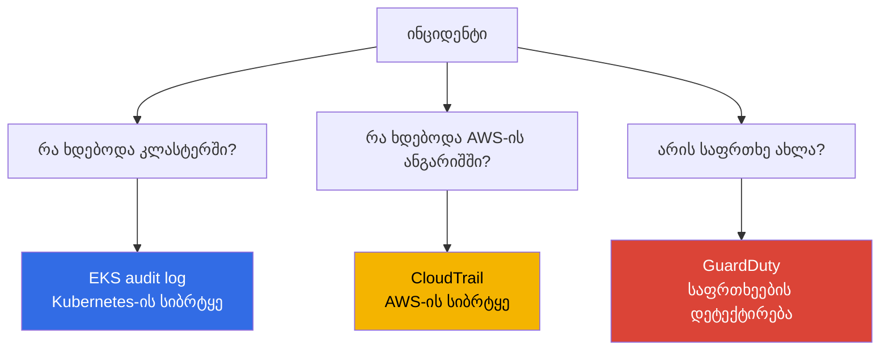
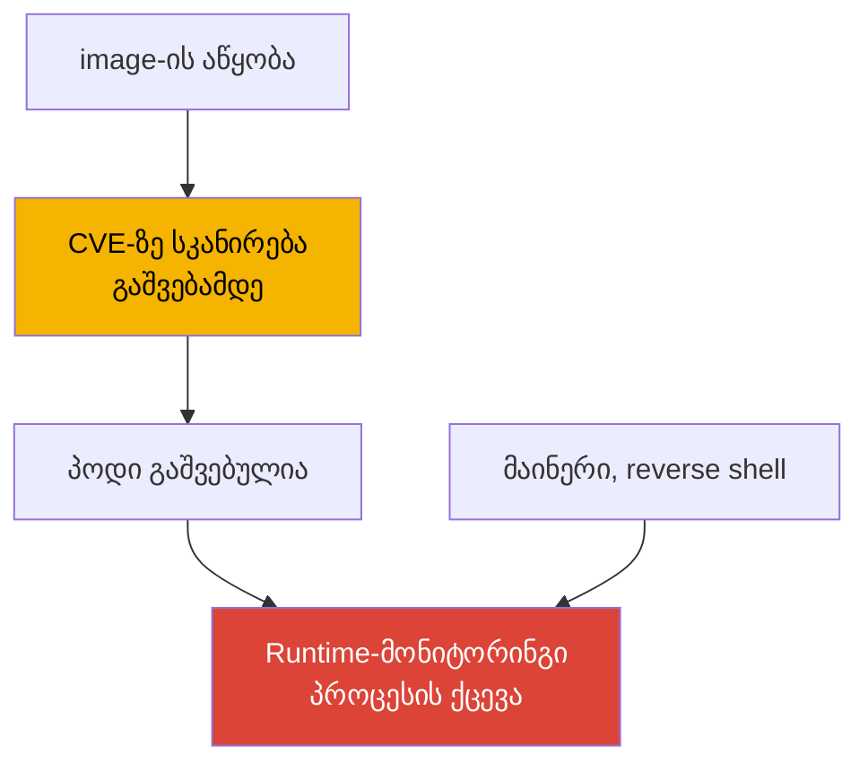
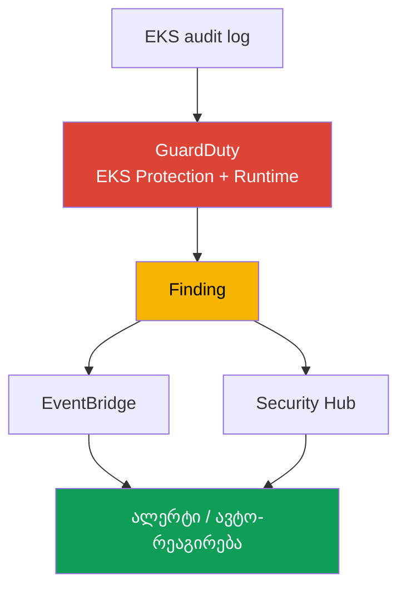
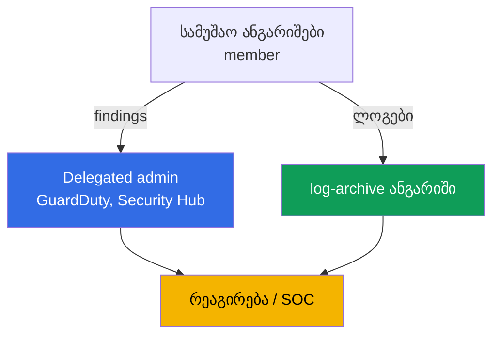

[Русская версия](ru.md) · [Eng version](en.md) · [Versión en español](es.md) · [Version française](fr.md) · [Deutsche Version](de.md) · [繁體中文版](tw.md) · [日本語版](jp.md)

# თავი 21. აუდიტი და დეტექტირება: control plane-ის ლოგები, CloudTrail, GuardDuty, runtime-მონიტორინგი

> **რა არის შემდეგ.** მე-3 ნაწილმა მოიცვა იდენტობა (თავები 16-17), secrets (თავი 18),
> კვანძის, პოდისა და ქსელის ჰარდენინგი (თავი 19) და images-ის supply chain (თავი 20). ეს თავი
> ეხება იმას, თუ როგორ გავიგოთ, საერთოდ რა ხდებოდა და ხდება კლასტერსა და ანგარიშში და მიმდინარეობს
> თუ არა შეტევა ამჟამად. განვიხილავთ სამ დონეს: EKS audit log-ს, CloudTrail-სა და GuardDuty-ს
> (EKS Protection და Runtime Monitoring). მომიჯნავე თემები სხვა თავებშია: control plane-ის ხუთივე
> ტიპის ლოგის ჩართვა და მათი მექანიკა (თავი 2), მეტრიკები და observability გამართვისთვის (თავი 33),
> აპლიკაციების ლოგები Fluent Bit-ის მეშვეობით (თავი 34), ჰარდენინგი (თავი 19), admission-პოლიტიკები
> (თავი 22), RBAC და authenticator (თავი 5), ლოგების ღირებულება და retention (თავები 34, 43).

## 21.1. „ვინ წაშალა namespace და რატომ არის ამის გარკვევა შეუძლებელი“

დილით პროდის namespace სამუშაო დატვირთვებთან ერთად გაქრა. მორიგის პირველი კითხვაა, ვინ და როდის
წაშალა ის, რომელი ანგარიშით და რომელი მისამართიდან. პასუხი არ არსებობს: control plane-ის audit-ლოგი
ჩართული არ იყო (თავი 2), სახიფათო ოპერაციებისთვის მეტრიკების ფილტრები არ იყო გამართული, ხოლო ლოგები
შემდგომი თარიღით ვერ გაჩნდება. დამნაშავის პოვნა და განმეორების თავიდან აცილება შეუძლებელია. ეს
ერთეული მარცხი კი არა, ბრმა ზონაა: კლასტერში უსაფრთხოების მონიტორინგი არ მიმდინარეობდა.

მის გვერდით იმავე ბუნების მონათესავე პრობლემებიც არსებობს:

- **კომპრომეტირებული პოდი ერთი კვირაა კრიპტოვალუტას მაინინგებს.** თავდამსხმელი კონტეინერში
  მოწყვლადობის მეშვეობით შევიდა, მაინერი და reverse shell გაუშვა. runtime-ს არავინ აკვირდება:
  image-ის სკანირება (თავი 20) გაშვებამდე შესრულდა და არაფერი იცის იმის შესახებ, რას აკეთებს
  პროცესი ახლა. ანომალიურ ტრაფიკსა და უცხო პროცესს ვერავინ ამჩნევს, სანამ ანგარიში ან საჩივარი
  არ მოვა.
- **ვიღაცამ secrets ჩამოტვირთა.** პოდმა ან მომხმარებელმა namespace-ში `get secrets` შეასრულა
  და შიგთავსი წაიღო. RBAC ამას ფორმალურად უშვებდა, მოვლენა არსად გამოჩენილა, ხოლო გაჟონვის ფაქტი
  მხოლოდ გამოძიებისას გამოვლინდებოდა, საამისო მასალა რომ არსებობდეს.
- **კლასტერი, როგორც AWS-ის რესურსი, შეცვალეს.** ვიღაცამ `publicAccessCidrs` გააფართოვა
  `0.0.0.0/0`-მდე ან encryption config მოხსნა. ეს Kubernetes-ის მოვლენა არ არის, ეს AWS API-ის
  გამოძახებაა და კლასტერის audit-ლოგში საერთოდ არ ჩანს.

ყველა ეს შემთხვევა ერთი მონიშვნით კი არა, სამი განსხვავებული წყაროთი იფარება, რომელთაგან თითოეული
საკუთარ კითხვას პასუხობს.

## 21.2. უსაფრთხოების სამი კითხვა და პასუხის სამი წყარო

თავის მთავარი თეზისი ასეთია: „კლასტერის ლოგები“ ერთი ნაკადი კი არა, სამი სხვადასხვა სიბრტყეა და
მათი ერთმანეთში არევა ძვირი ჯდება. წყაროს კითხვა განსაზღვრავს.



| კითხვა | წყარო | სიბრტყე | მაგალითი |
|---|---|---|---|
| რა ხდებოდა კლასტერში | EKS audit log | Kubernetes API | ვინ წაშალა namespace, ვინ კითხულობდა secrets |
| რა ხდებოდა ანგარიშში | CloudTrail | AWS API | ვინ ცვლიდა კლასტერის კონფიგურაციას, node group-ს |
| არის თუ არა აქტიური საფრთხე | GuardDuty | დეტექტირება რეალურ დროში | მაინერი ნოდზე, ანონიმური წვდომა |

მთავარია სიბრტყეების გამიჯვნა. `kubectl`-ის მეშვეობით namespace-ის წაშლა **audit-ლოგში** ჩანს,
მაგრამ CloudTrail-ში არა: CloudTrail-ისთვის ეს AWS-ის მოვლენა არ არის. `publicAccessCidrs`-ის
გაფართოება **CloudTrail**-ში (`UpdateClusterConfig`) ჩანს, მაგრამ audit-ლოგში არა: Kubernetes-ისთვის
ეს კლასტერის მოვლენა არ არის. ხოლო მაინერი, რომელიც არც Kubernetes API-ს და არც AWS API-ს არ
ეხება, არც ერთ მათგანში არ ჩანს. მას პროცესის ქცევის მიხედვით მხოლოდ **GuardDuty Runtime
Monitoring** იჭერს. სამი წყარო ერთმანეთს არ ცვლის, ისინი ერთმანეთს ავსებს.

## 21.3. EKS audit log დეტალურად: კითხვა დეტექტირებისთვის

ხუთივე ტიპის ლოგის ჩართვის მექანიკა მე-2 თავში განვიხილეთ; აქ audit-ლოგი გვაინტერესებს კონკრეტულად,
როგორც გამოძიების წყარო. თითოეული ჩანაწერი Kubernetes audit-ის JSON-მოვლენაა: ვინ
(`user.username`, IAM-პრინციპალი, რომელიც authenticator-ის მეშვეობით აისახა, თავი 5), რა გააკეთა
(`verb`: `get`, `list`, `create`, `delete`), რომელ ობიექტზე (`objectRef.resource`, `objectRef.name`,
`objectRef.namespace`), საიდან (`sourceIPs`), როდის (`requestReceivedTimestamp`) და რა შედეგით
(`responseStatus.code`, ავტორიზაციის გადაწყვეტილება `annotations`-ში). ცალკე აღსანიშნავია
`auditID`: მოთხოვნის უნიკალური იდენტიფიკატორი. ერთი მოთხოვნა სხვადასხვა stage-ზე
(`RequestReceived`, `ResponseComplete`) ერთსა და იმავე `auditID`-ს ქმნის და მისი მეშვეობით ერთი
ოპერაციის ყველა ჩანაწერი ერთიან სურათად იკრიბება.

ეს მონაცემები CloudWatch Logs-ში, log group-ში `/aws/eks/<cluster>/cluster` იწერება, ხოლო ნაკადია
`kube-apiserver-audit-<id>`. მას **CloudWatch Logs Insights**-ის მეშვეობით აანალიზებენ, რომლის
მოთხოვნების ენა იყენებს `fields`, `filter`, `sort`, `stats`, `limit` კონსტრუქციებს.

```
fields @timestamp, user.username, verb, objectRef.resource, objectRef.namespace, sourceIPs.0
| filter verb = "delete" and objectRef.resource = "namespaces"
| sort @timestamp desc
| limit 20
```

ტიპური მოთხოვნები კონკრეტული კითხვებისთვის:

| კითხვა | Logs Insights-ის ფილტრის ბირთვი |
|---|---|
| ვინ წაშალა namespace | `verb="delete" and objectRef.resource="namespaces"` |
| ვინ მიმართავდა secrets-ს | `verb in ["get","list"] and objectRef.resource="secrets"` |
| ანონიმური წვდომა | `user.username="system:anonymous"` |
| ავტორიზაციის უარყოფა | `responseStatus.code=403` |
| კონკრეტული პრინციპალის მოქმედებები | `user.username="arn:aws:sts::...:assumed-role/..."` |

```
fields @timestamp, user.username, objectRef.namespace, objectRef.name
| filter user.username = "system:anonymous"
| sort @timestamp desc
| limit 50
```

მნიშვნელოვანი ზღვარი: audit-ლოგი საიმედოდ პასუხობს კითხვას „ვინ/როდის/რომელი verb-ით/რომელ რესურსზე“.
თუმცა მოთხოვნის შიგთავსი, მაგალითად, ჰქონდა თუ არა პოდს `privileged: true`, მასში ყოველთვის არ
ხვდება. ეს აუდიტის დონეზეა დამოკიდებული და EKS-ის ნაგულისხმევ audit-პოლიტიკაში მოთხოვნის სხეული
ყველა ოპერაციისთვის არ ფიქსირდება. ამიტომ „პრივილეგირებული პოდის შექმნა“ უფრო საიმედოდ GuardDuty
EKS Protection-ის მზა detection-ით უნდა დაიჭიროთ (განყოფილება 21.5), და არა Logs Insights-ში
სხეულის გარჩევით. audit-ლოგზე დაყრდნობით ფორმულირება სიფრთხილით ჯობს: ის ოპერაციის ფაქტს აღწერს,
მაგრამ ყოველთვის არა მის სრულ შიგთავსს.

## 21.4. CloudTrail EKS-ისთვის: AWS-ის სიბრტყე

CloudTrail AWS API-ის გამოძახებებს აფიქსირებს. EKS-ისთვის ეს არის ოპერაციები კლასტერზე **როგორც
AWS-ის რესურსზე**: `CreateCluster`, `DeleteCluster`, `UpdateClusterConfig` (მათ შორის
`publicAccessCidrs`-ისა და ლოგირების პარამეტრების შეცვლა), `AssociateEncryptionConfig`,
`CreateAccessEntry`, managed node group-ის ცვლილებები (`CreateNodegroup`, `UpdateNodegroupConfig`).
ვინ გამოიძახა, როდის, რომელი IP-დან, რომელი როლით და რა შედეგით, ეს ყველაფერი CloudTrail-შია.

audit-ლოგისგან განსხვავება პრინციპულია და ყოველთვის უნდა გახსოვდეთ: **CloudTrail = AWS-ის
სიბრტყე** (რას აკეთებდნენ კლასტერზე გარედან, EKS API-ის მეშვეობით), **audit-ლოგი = Kubernetes-ის
სიბრტყე** (რას აკეთებდნენ კლასტერის შიგნით, Kubernetes API-ის მეშვეობით). პოდის წაშლა CloudTrail-ში
არ გამოჩნდება, ხოლო node group-ის წაშლა audit-ლოგში არ გამოჩნდება.

CloudTrail განასხვავებს **management events**-ს (რესურსებზე ოპერაციები: შექმნა, შეცვლა, წაშლა;
ნაგულისხმევად ჩართულია) და **data events**-ს (რესურსის შიგნით მონაცემებზე ოპერაციები; ნაგულისხმევად
გამორთულია, ცალკე ირთვება და მოცულობითია). EKS კლასტერზე მართვის ოპერაციები management events-ია.

```bash
# ვინ და როდის ცვლიდა კლასტერის კონფიგურაციას - ბოლო მოვლენები
aws cloudtrail lookup-events \
  --lookup-attributes AttributeKey=EventName,AttributeValue=UpdateClusterConfig \
  --query 'Events[].{Time:EventTime,User:Username,Event:EventName}' --output table

# კონკრეტულ კლასტერზე, როგორც რესურსზე, ყველა მოვლენა
aws cloudtrail lookup-events \
  --lookup-attributes AttributeKey=ResourceName,AttributeValue=demo
```

როდესაც ინციდენტი ორივე სიბრტყეს ეხება, მაგალითად, კლასტერის კონფიგურაცია AWS API-ის მეშვეობით
შეცვალეს და შემდეგ კლასტერის შიგნით რაღაც გააკეთეს, სურათი ერთდროულად ორი წყაროდან იკრიბება.
audit-ლოგსა და CloudTrail-ს საერთო იდენტიფიკატორი არ აქვს: audit-ლოგის შიგნით ჩანაწერებს `auditID`
აკავშირებს, წყაროებს შორის კი მოვლენებს პრინციპალის (IAM-როლი), IP-ის (`sourceIPs` CloudTrail-ის
ველის წინააღმდეგ) და დროის ფანჯრის მიხედვით აერთიანებენ. ასე იქმნება ერთიანი ქრონოლოგია „რა მოხდა
ანგარიშში -> რა მოხდა კლასტერში“ და არა ორი ცალკეული სია.

სამ თანხვედრილ განზომილებას აერთიანებენ. მათი ველები თითოეულ წყაროში ასეთია:

| რას ვადარებთ | ველი audit-ლოგში | ველი CloudTrail-ში |
|---|---|---|
| პრინციპალი | `user.username` | `userIdentity` (`Username` `lookup-events`-ში) |
| წყაროს IP | `sourceIPs` | `sourceIPAddress` |
| დრო | `requestReceivedTimestamp` | `eventTime` |

## 21.5. GuardDuty EKS-ისთვის: EKS Protection და Runtime Monitoring

GuardDuty საფრთხეების აღმოჩენის სერვისია. EKS-ისთვის ის ორ დონეზე მუშაობს და ეს ორი განსხვავებული
რამაა.

**EKS Protection** control plane-ის საეჭვო აქტივობის გამოსავლენად **EKS audit logs**-ს აანალიზებს.
მნიშვნელოვანი ფაქტი: GuardDuty audit-ლოგებს **საკუთარი დამოუკიდებელი ნაკადის** მეშვეობით აგროვებს
და დამატებით გამართვას არ მოითხოვს. EKS Protection-ის მუშაობისთვის CloudWatch-ში control plane
logging-ის ჩართვა აუცილებელი არ არის, ეს მხოლოდ მაშინ გჭირდებათ, თუ audit-ლოგების საკუთარ ანგარიშში
ნახვა გსურთ. ის პოულობს ისეთ მოვლენებს, როგორიცაა API-ზე მიმართვა ცნობილი მავნე IP-ებიდან,
`system:anonymous`-ის წვდომა, პრივილეგიების ესკალაცია, პრივილეგირებული კონტეინერების გაშვება და
API-ის საეჭვო გამოყენება.

**Runtime Monitoring** სხვა დონეა: ის **ნოდებზე ქცევას** აკვირდება. მუშაობს eBPF-ზე დაფუძნებული
EKS-ადონის `aws-guardduty-agent`-ის (GuardDuty security agent) მეშვეობით, რომელიც პროცესებს,
ქსელურ კავშირებსა და კონტეინერების ფაილურ აქტივობას აკონტროლებს. ასე იჭერენ იმას, რაც არც
 audit-ლოგშია და არც CloudTrail-ში: მაინერებს, reverse shell-ს, მავნე დომენებთან დაკავშირებას,
საეჭვო ბინარული ფაილების გაშვებას. დოკუმენტაციის მიხედვით, Runtime Monitoring მხარს უჭერს EKS-ს
EC2 ინსტანსებსა და EKS Auto Mode-ში, მაგრამ **არ** უჭერს მხარს Fargate-სა და EKS Hybrid Nodes-ს.
აგენტის გაშლა შესაძლებელია ავტომატურად (automated agent configuration) ან მისი ხელით მართვა.

| თვისება | EKS Protection | Runtime Monitoring |
|---|---|---|
| წყარო | EKS audit logs (საკუთარი ნაკადი) | აგენტი ნოდზე (eBPF) |
| რას ხედავს | Kubernetes API-ის გამოძახებები | პროცესები, ქსელი, კონტეინერის ფაილები |
| სჭირდება აგენტი ნოდებზე | არა | დიახ, `aws-guardduty-agent` |
| რას იჭერს | ანონიმური წვდომა, ესკალაცია, მავნე IP-ები | მაინერი, reverse shell, მავნე დომენები |
| შეზღუდვები | - | არა Fargate, არა Hybrid Nodes |

GuardDuty აღმოჩენილს **finding**-ად აფორმებს და Security Hub-სა და EventBridge-ში აგზავნის.
აქედან იგება ალერტინგი და ავტომატური რეაგირება (განყოფილება 21.7).

## 21.6. Runtime-მონიტორინგი დეტალურად: ქცევა image-ის წინააღმდეგ

Runtime-მონიტორინგი ადვილად შეიძლება image-ის სკანირებაში აგერიოთ (თავი 20), თუმცა ისინი დროის
სხვადასხვა მომენტს ეხება. სკანირება **გაშვებამდე image-ში ცნობილ CVE-ებს** იჭერს, ანუ არტეფაქტის
სტატიკურ ანალიზს ასრულებს. Runtime **გაშვების შემდეგ პროგრამული უზრუნველყოფის ქცევას** იჭერს,
ანუ რას აკეთებს პროცესი რეალურად გაშვებულ კონტეინერში. ერთი მეორეს არ ცვლის: სკანირების მიხედვით
სუფთა image შეიძლება runtime-ში აპლიკაციის მოწყვლადობის მეშვეობით დაკომპრომეტირდეს, ხოლო მაინერი
საერთოდ არ არის ვალდებული image-ში იყოს, ის უკვე გაშვებულ პოდში შეიძლება ჩამოიტვირთოს.



EKS-ისთვის runtime-დეტექტირება ორი გზით ხორციელდება. **GuardDuty Runtime Monitoring** მართვადი
ვარიანტია: AWS-ის აგენტი, findings Security Hub-ში და არაფრის დამოუკიდებლად ჰოსტინგი არ გჭირდებათ.
**მესამე მხარის ინსტრუმენტები** (მაგალითად, Falco, runtime security-ის CNCF-პროექტი იმავე
 eBPF/syscall-მოვლენებზე) წესებში მეტ მოქნილობას გაძლევთ, მაგრამ მათი დაყენება, განახლება და
მომსახურება თავად მოგიწევთ. ორივე შემთხვევაში აგენტი ხედავს პროცესების გაშვებას, ქსელურ კავშირებს,
ფაილებზე წვდომასა და კონტეინერიდან escape-ის მცდელობებს. მართვად და საკუთარ ვარიანტს შორის არჩევანი
ნიშნავს არჩევანს „ნაკლები კონტროლი, ნულოვანი მომსახურება“ და „სრული კონტროლი, საკუთარი
ექსპლუატაცია“ მიდგომებს შორის.

## 21.7. როგორ ერთიანდება ეს დეტექტირების ჯაჭვში

ცალკეული წყაროები ერთ კონვეიერად იკრიბება, მოვლენიდან რეაგირებამდე. ბოლოს არსებული წყვეტა დასაწყისს
აუფასურებს: finding, რომელსაც არავინ უყურებს, ინციდენტს ვერ აჩერებს.



ეს ასე იკითხება: audit-ლოგი და აგენტი GuardDuty-ს მონაცემებს აწვდის, ის finding-ს ქმნის, finding
Security Hub-ში (ყველა ანგარიშიდან აგრეგაცია და პრიორიტეტიზაცია) და EventBridge-ში იგზავნება,
ხოლო EventBridge-ის წესი რეაგირებას იწყებს, მაგალითად, შეტყობინებას ჩატში/SNS-ში, ტიკეტს ან
ავტომატურ მოქმედებას Lambda-ს მეშვეობით (პოდის იზოლირება, ნოდის მოხსნა, სესიის გაუქმება). იმავე
კონვეიერის ცალკე განშტოებაა CloudWatch-ის მეტრიკების ფილტრები უშუალოდ audit-ლოგის კრიტიკულ
მოვლენებზე (namespace-ის წაშლა, `system:anonymous`-ის მოქმედებები) და ალარმები GuardDuty-ს
დალოდების გარეშე.

## 21.8. ორგანიზება multi-account გარემოში

ერთ ანგარიშში დეტექტირება უსარგებლოა იმ პირის წინააღმდეგ, რომელსაც იმავე ანგარიშის admin-წვდომა
აქვს: ის კვალსაც გაასუფთავებს და ლოგებსაც წაშლის. ამიტომ ორგანიზაციაში მონიტორინგი სამუშაო
ანგარიშებიდან გააქვთ.



- **Delegated administrator.** AWS Organizations-ის მეშვეობით GuardDuty-სა და Security Hub-ს
  ცალკე ადმინისტრატორ ანგარიშს (delegated administrator) უნიშნავენ, რომელიც სერვისს მთელი
  ორგანიზაციისთვის მართავს და ყველა წევრი ანგარიშის findings-ს ხედავს. დანიშვნა რეგიონულია:
  delegated administrator თითოეულ რეგიონში განისაზღვრება. ასე ახალ ანგარიშებზე GuardDuty-ს
  ჩართვა და findings-ის შეგროვება ცენტრალიზებულია და სამუშაო ანგარიშის მფლობელის კეთილ ნებაზე
  აღარ არის დამოკიდებული. delegated administrator-ის კრიტიკული findings `log-archive` ანგარიშის
  S3-bucket-ში ექსპორტდება, რათა მოვლენის უცვლელი ასლი თვით სამუშაო ანგარიშში კვალის გასუფთავებას
  გადაურჩეს.
- **ცალკე აუდიტის ანგარიში.** Findings და უსაფრთხოების dashboard-ები ისეთ ანგარიშში ინახება,
  რომელზეც დეველოპერების გუნდებს წვდომა არ აქვთ.
- **ლოგები log-archive-ში.** ორგანიზაციის CloudTrail და audit-ლოგების არქივი ცალკე `log-archive`
  ანგარიშში (თავი 0.1), შეზღუდული წვდომითა და უცვლელი საცავით (S3 Object Lock, WORM) ინახება,
  რათა სამუშაო ანგარიშის ადმინისტრატორმა ისტორიის წაშლა ან გაყალბება ფიზიკურად ვერ შეძლოს. ეს
  გამოძიებისას ლოგების სანდოობის აუცილებელი პირობაა.

## 21.9. როგორ გამოიყენება ეს პროდში

- **Audit-ლოგი ყოველთვის ჩართულია.** სულ მცირე, `audit` და `authenticator` პირველივე დღიდან
  (თავი 2), retention აშკარადაა მითითებული, ხოლო ხანგრძლივი არქივი ცალკე ანგარიშის S3-ში მიდის
  (თავები 34, 43).
- **GuardDuty მთელი ორგანიზაციისთვის.** EKS Protection და Runtime Monitoring delegated
  administrator-ის მეშვეობით ყველა ანგარიშსა და ყველა გამოყენებულ რეგიონშია ჩართული, ახალი
  ანგარიშები კი ავტომატურად ერთვება.
- **მეტრიკების ფილტრები და ალარმები კრიტიკულ მოვლენებზე.** namespace-ის წაშლა,
  `system:anonymous`-ის მოქმედებები, `403`-ების მკვეთრი ზრდა, secrets-ზე მიმართვები: CloudWatch-ის
  მეტრიკების ფილტრები audit-ლოგზე ალარმებით, გარე სერვისის დალოდების გარეშე.
- **Findings-ზე რეაგირება ავტომატიზებულია.** Security Hub-იდან და EventBridge-იდან findings
  ალერტინგსა და runbook-ში გადადის: კრიტიკული ტიპებისთვის რეაგირება წინასწარ არის აღწერილი და
  ყველაფრის ნულიდან გარკვევა საჭირო არ ხდება.
- **გუნდი CloudTrail-ს audit-ლოგისგან განასხვავებს.** „ვინ ცვლიდა კლასტერს, როგორც AWS-ის
  რესურსს“ CloudTrail-ის კითხვაა, ხოლო „ვინ ცვლიდა შიდა ობიექტებს“ audit-ლოგის. ორივე წყარო
  გაყალბებისგან დაცულია.
- **Runtime Monitoring იქ გამოიყენება, სადაც მხარდაჭერილია.** EC2 და Auto Mode ნოდებზე GuardDuty-ს
  აგენტი მუშაობს; Fargate-ის დატვირთვებისთვის, სადაც აგენტი მხარდაჭერილი არ არის, დეტექტირება სხვა
  ფენებზე იგება.

## 21.10. მინი-ლექსიკონი

- **EKS audit log** - control plane-ის ლოგების ტიპი (`audit`), Kubernetes audit-ის JSON-მოვლენები:
  ვინ, რომელი verb-ით, რომელ რესურსზე, საიდან და რა შედეგით; CloudWatch Logs-ში იწერება.
- **CloudWatch Logs Insights** - ლოგების მოთხოვნების ენა (`fields`, `filter`, `sort`, `stats`);
  audit-ლოგის ანალიზის ძირითადი ინსტრუმენტი.
- **CloudTrail** - AWS API-ის გამოძახებების ჟურნალი; EKS-ისთვის აფიქსირებს ოპერაციებს კლასტერზე,
  როგორც AWS-ის რესურსზე (management events), და არა Kubernetes-ის შიდა მოვლენებს.
- **GuardDuty EKS Protection** - EKS audit logs-ის ანალიზი საფრთხეების გამოსავლენად GuardDuty-ს
  საკუთარი დამოუკიდებელი ნაკადის მეშვეობით, control plane logging-ის სავალდებულო ჩართვის გარეშე.
- **GuardDuty Runtime Monitoring** - ნოდებზე ქცევის მონიტორინგი `aws-guardduty-agent`-ის (eBPF)
  მეშვეობით: პროცესები, ქსელი, ფაილები; Fargate-სა და Hybrid Nodes-ს მხარს არ უჭერს.
- **auditID** - მოთხოვნის უნიკალური იდენტიფიკატორი audit-ლოგში; ერთი ოპერაციის ყველა stage-ისთვის
  ერთნაირია. CloudTrail-თან საერთო ID არ არსებობს, წყაროებს შორის კი პრინციპალის, IP-ისა და დროის
  მიხედვით აერთიანებენ.
- **Finding** - GuardDuty-ს აღმოჩენა; ალერტინგისა და რეაგირებისთვის Security Hub-სა და
  EventBridge-ში იგზავნება.
- **Delegated administrator** - ორგანიზაციის ანგარიში, რომელიც GuardDuty-სა და Security Hub-ს
  მთელი ორგანიზაციისთვის მართავს და ყველა წევრის findings-ს ხედავს; რეგიონების მიხედვით ინიშნება.

## 21.11. თავის შეჯამება

- EKS-ის უსაფრთხოების მონიტორინგი სამი სხვადასხვა სიბრტყეა და არა ერთი ლოგი. მათი არევა ძვირი
  ჯდება: პასუხის წყაროს კითხვა განსაზღვრავს.
- EKS audit log პასუხობს კითხვას „რა ხდებოდა კლასტერში“: ვინ, რომელი verb-ით, რომელ რესურსზე,
  საიდან და რა შედეგით. ის CloudWatch Logs Insights-ის მეშვეობით log group-ში
  `/aws/eks/<cluster>/cluster` ანალიზდება. მოთხოვნის სხეული ყოველთვის არ ხვდება ლოგში, ეს აუდიტის
  დონეზეა დამოკიდებული.
- CloudTrail პასუხობს კითხვას „რა ხდებოდა AWS-ის ანგარიშში“: ოპერაციები კლასტერზე, როგორც რესურსზე
  (`UpdateClusterConfig`, `CreateAccessEntry`, node group-ის ცვლილებები). ეს AWS-ის სიბრტყეა და
  არა Kubernetes-ის; management events ნაგულისხმევად ჩართულია.
- GuardDuty პასუხობს კითხვას „არის თუ არა საფრთხე ახლა“. EKS Protection audit-ლოგებს საკუთარი
  ნაკადით, დამატებითი გამართვის გარეშე აანალიზებს; Runtime Monitoring ნოდებზე აგენტის მეშვეობით
  მაინერებსა და reverse shell-ს იჭერს, მაგრამ Fargate-სა და Hybrid Nodes-ზე არ მუშაობს.
- Runtime-მონიტორინგი **გაშვების შემდეგ** ქცევას იჭერს და არ ცვლის image-ის სკანირებას, რომელიც
  **გაშვებამდე** CVE-ებს პოულობს. მართვადი ვარიანტია GuardDuty, მოქნილი კი Falco საკუთარი
  ექსპლუატაციით.
- Findings ჯაჭვში იკრიბება: audit/აგენტი -> GuardDuty -> Security Hub/EventBridge ->
  ალერტი/რეაგირება. multi-account გარემოში ეს delegated administrator-სა და log-archive-ში
  გადააქვთ, რათა სამუშაო ანგარიშის admin-მა კვალი ვერ გაასუფთაოს.

## 21.12. როგორ გამოგადგებათ ეს რეალურ მუშაობაში

მორიგეობისას კითხვა „ვინ წაშალა namespace“ ჩიხიდან Logs Insights-ის ერთ მოთხოვნად იქცევა, მაგრამ
მხოლოდ იმ შემთხვევაში, თუ audit-ლოგი წინასწარ იყო ჩართული და retention-ის ვადა ჯერ არ ამოწურულა.
ინციდენტი „პოდი ერთი კვირაა მაინინგებს“ კვირას აღარ გრძელდება იქ, სადაც Runtime Monitoring პირველ
საათებში ქმნის finding-ს. ხოლო დავა „ეს AWS API-ის მეშვეობით შეცვალეს თუ კლასტერის შიგნით“ წყაროს
არჩევით წყდება: CloudTrail audit-ლოგის წინააღმდეგ. ამ ზღვრის დამახსოვრება გამოძიების საათებს
ზოგავს. დაგეგმვისას სამი რამ პირველ ინციდენტამდე უნდა გაკეთდეს და არა მის შემდეგ: audit-ლოგის
retention-ით ჩართვა, GuardDuty-ს ორგანიზაციისთვის ჩართვა და ლოგების ცალკე ანგარიშში გატანა. არც
ერთი მათგანის მოპოვება ფაქტის შემდეგ შეუძლებელია.

## 21.13. თვითშემოწმების კითხვები

1. უსაფრთხოების რომელ სამ კითხვას პასუხობს audit-ლოგი, CloudTrail და GuardDuty?
2. რატომ ჩანს namespace-ის წაშლა audit-ლოგში, მაგრამ არა CloudTrail-ში?
3. რატომ ჩანს `publicAccessCidrs`-ის შეცვლა CloudTrail-ში, მაგრამ არა audit-ლოგში?
4. audit-ლოგის ჩანაწერის რომელი ველები პასუხობს კითხვებს „ვინ, რა, რაზე, საიდან, რა შედეგით“?
5. დაწერეთ Logs Insights-ის მოთხოვნის ბირთვი კითხვებისთვის „ვინ წაშალა namespace“ და „ანონიმური
   წვდომა“.
6. რატომ არ არის „პრივილეგირებული პოდის შექმნის“ audit-ლოგით დაჭერა ყოველთვის საიმედო?
7. რით განსხვავდება CloudTrail-ის management events data events-ისგან?
8. რას აანალიზებს GuardDuty EKS Protection და სჭირდება თუ არა მას control plane logging-ის ჩართვა?
9. რისი მეშვეობით მუშაობს GuardDuty Runtime Monitoring და რომელ პლატფორმებს არ უჭერს მხარს?
10. რით განსხვავდება runtime-მონიტორინგი image-ის სკანირებისგან და რატომ არ ცვლის ერთი მეორეს?
11. სად აგზავნის GuardDuty findings-ს და როგორ იგება მათგან რეაგირება?
12. რატომ არის multi-account გარემოში საჭირო delegated administrator და ცალკე log-archive ანგარიში?
13. როგორ დავაკავშიროთ audit-ლოგისა და CloudTrail-ის მოვლენები, თუ მათ საერთო იდენტიფიკატორი არ აქვთ?

## პრაქტიკა

ამ თავს ჯერ საკუთარი ლაბა არ აქვს, მაგრამ ყველაფერი მოქმედ კლასტერსა და ანგარიშში მოწმდება.
დარწმუნდით, რომ `audit` ჩართულია: `aws eks describe-cluster --name demo --query
'cluster.logging'`, და რომ არსებობს log group: `aws logs describe-log-groups
--log-group-name-prefix /aws/eks/demo`. გახსენით CloudWatch Logs Insights
`/aws/eks/demo/cluster`-ისთვის და გაუშვით მოთხოვნა `filter objectRef.resource="namespaces"`-ით.
წაშალეთ სატესტო namespace და შედეგებში საკუთარი მოქმედება იპოვეთ.

შემდეგ შეამოწმეთ GuardDuty: `aws guardduty list-detectors` რეგიონში detector-ს აჩვენებს,
`aws guardduty get-detector --detector-id <id>` კი მის სტატუსსა და ჩართულ features-ს (EKS
Protection, Runtime Monitoring). კლასტერის ოპერაციები CloudTrail-ში ნახეთ:
`aws cloudtrail lookup-events --lookup-attributes
AttributeKey=EventName,AttributeValue=UpdateClusterConfig`. თუ EC2-ზე სატესტო ნოდი გაქვთ,
დააყენეთ ადონი `aws-guardduty-agent` და შეამოწმეთ, რომ findings Security Hub-ში მოდის.
admission-პოლიტიკები, რომლებიც სახიფათო ობიექტებს შესვლისთანავე ბლოკავს, 22-ე თავში განიხილება.

---
[სარჩევი](../README_GE.md) · [თავი 20](../20/ge.md) · [თავი 22](../22/ge.md)
