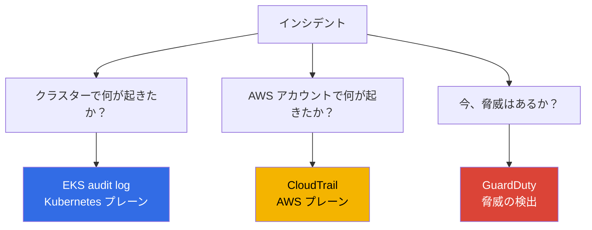
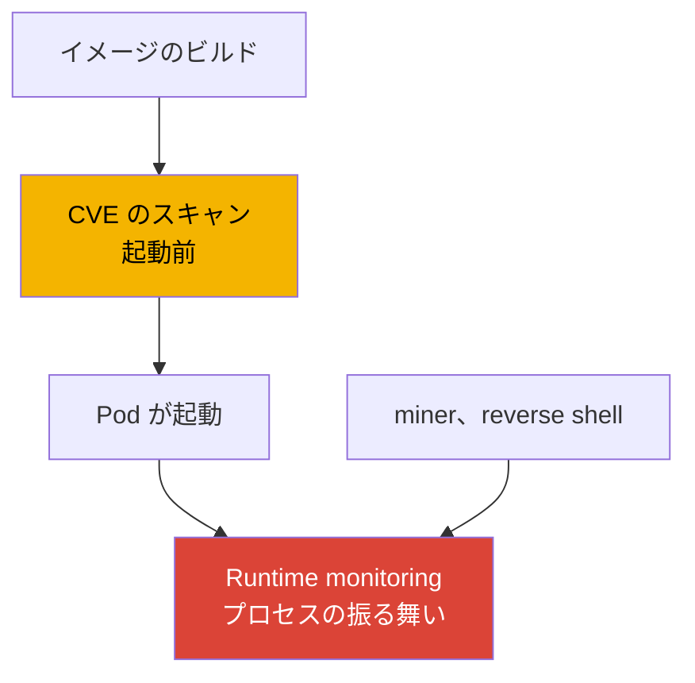
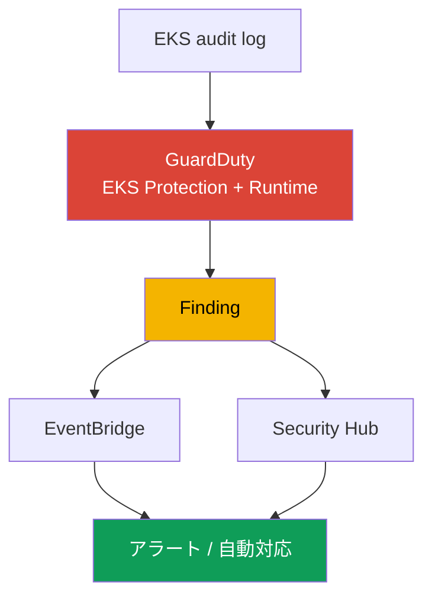
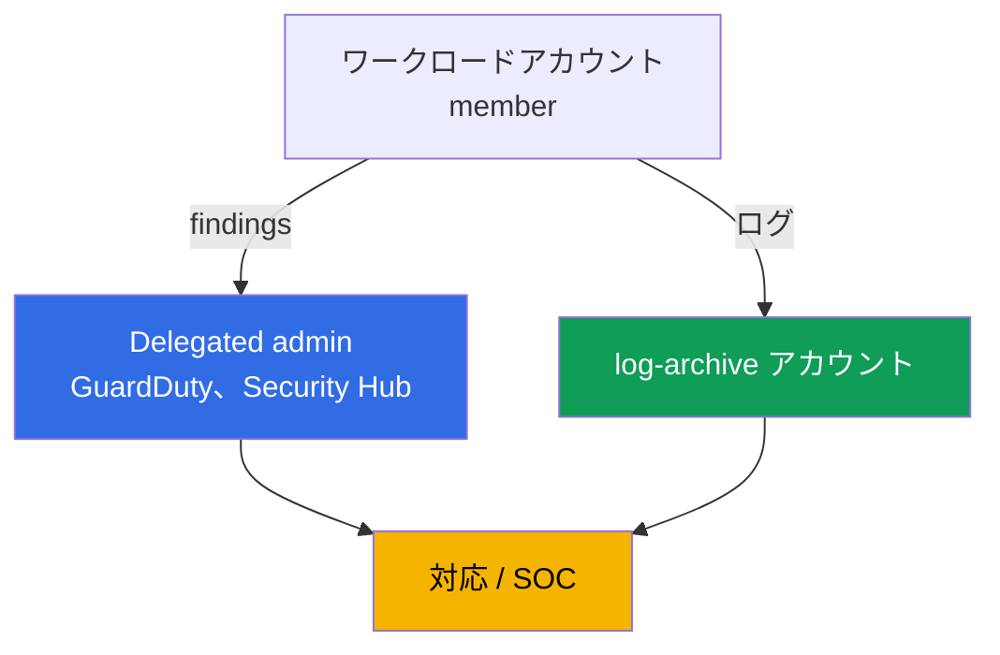

[Eng version](en.md) · [Versión en español](es.md) · [Version française](fr.md) · [Deutsche Version](de.md) · [Русская версия](ru.md) · [ქართული ვერსია](ge.md) · [繁體中文版](tw.md)
# 第21章. 監査と検出: control plane ログ、CloudTrail、GuardDuty、runtime monitoring

> **この先。** 第3部では、アイデンティティ（第16-17章）、シークレット（第18章）、ノード、Pod、
> ネットワークのハードニング（第19章）、イメージの supply chain（第20章）を扱いました。この章は、
> クラスターとアカウントで何が起きたか、そして今まさに攻撃が進行しているかを把握する方法を扱います。
> EKS audit log、CloudTrail、GuardDuty（EKS Protection と Runtime Monitoring）という3層を解説します。
> 関連内容は他章で扱います。5種類の control plane ログの有効化と仕組み（第2章）、トラブルシューティング
> のためのメトリクスと observability（第33章）、Fluent Bit によるアプリケーションログ（第34章）、
> ハードニング（第19章）、admission policy（第22章）、RBAC と authenticator（第5章）、ログの
> コストと retention（第34、43章）です。

## 21.1. 「誰が namespace を削除したのか、そしてなぜそれを特定できないのか」

朝、本番の namespace がワークロードごと消えました。当番担当者の最初の疑問は、誰がいつ、どの
アカウントから、どのアドレスで削除したのかです。答えはありません。control plane の audit ログが
有効化されておらず（第2章）、危険な操作に対するメトリクスフィルターも設定されておらず、ログを
過去にさかのぼって出現させることはできません。犯人を特定できず、再発も防げません。これは単発の
障害ではなく死角です。クラスターにおけるセキュリティ監視が行われていませんでした。

同じ性質の関連する問題もあります。

- **侵害された Pod が1週間暗号通貨を採掘する。** 攻撃者が脆弱性を通じてコンテナに侵入し、miner と
  reverse shell を起動しました。誰も runtime を監視していません。image scanning（第20章）は起動前に
  実行されるため、プロセスが現在何をしているかは分かりません。請求書や苦情が届くまで、異常な通信と
  不正なプロセスに誰も気付きません。
- **誰かが secrets を抜き出した。** Pod またはユーザーが namespace 全体で `get secrets` を実行し、
  内容を取得しました。RBAC は形式的には許可しており、イベントはどこにも強調表示されません。漏洩の
  事実は、調査できるデータがあれば、調査のときに初めて明らかになるでしょう。
- **AWS resource としてクラスターを変更した。** 誰かが `publicAccessCidrs` を `0.0.0.0/0` まで広げた、
  または encryption config を削除しました。これは Kubernetes event ではなく AWS API 呼び出しのため、
  クラスターの audit ログにはまったく記録されません。

これらの問題は1つのチェックボックスでは解決できません。異なる3つの情報源が、それぞれ別の問いに
答えます。

## 21.2. 3つのセキュリティ上の問いと3つの情報源

この章の中心的な主張は、「クラスターのログ」は1つのストリームではなく3つの異なるプレーンであり、
それらを混同するコストは高いということです。問いによって情報源が決まります。



| 問い | 情報源 | プレーン | 例 |
|---|---|---|---|
| クラスターで何が起きたか | EKS audit log | Kubernetes API | 誰が namespace を削除したか、誰が secrets を読んだか |
| アカウントで何が起きたか | CloudTrail | AWS API | 誰がクラスター設定、node group を変更したか |
| アクティブな脅威があるか | GuardDuty | リアルタイム検出 | ノード上の miner、匿名アクセス |

鍵はプレーンを分けて考えることです。`kubectl` による namespace の削除は **audit ログ**に記録
されますが、CloudTrail には記録されません。CloudTrail にとっては AWS event ではないからです。
`publicAccessCidrs` の拡大は **CloudTrail**（`UpdateClusterConfig`）に記録されますが、audit ログには
記録されません。Kubernetes にとってはクラスター event ではないからです。Kubernetes API にも AWS API
にも触れない miner はどちらにも記録されず、プロセスの振る舞いから検出できるのは
**GuardDuty Runtime Monitoring** だけです。3つの情報源は互いに代替するものではなく、補完し合います。

## 21.3. EKS audit log の実際: 検出のための読み方

第2章では5種類のログを有効化する仕組みを説明しました。ここでは audit ログを、調査の情報源として
具体的に扱います。各レコードは Kubernetes audit の JSON event です。誰が
（`user.username`: authenticator を通じてマッピングされた IAM principal、第5章）、何をしたか
（`verb`: `get`、`list`、`create`、`delete`）、何に対して行ったか（`objectRef.resource`、
`objectRef.name`、`objectRef.namespace`）、どこから行ったか（`sourceIPs`）、いつ行ったか
（`requestReceivedTimestamp`）、結果は何か（`responseStatus.code`、`annotations` 内の
authorization decision）を記録します。さらに `auditID` があります。これは request の一意な識別子です。
1つの request は異なる stage（`RequestReceived`、`ResponseComplete`）で同じ `auditID` を持つレコードを
生成するため、これを使って1つの操作のすべてのレコードを統一した全体像にまとめます。

ログは CloudWatch Logs の log group `/aws/eks/<cluster>/cluster`、stream
`kube-apiserver-audit-<id>` に書き込まれます。分析には **CloudWatch Logs Insights** を使います。これは
`fields`、`filter`、`sort`、`stats`、`limit` を持つクエリ言語です。

```
fields @timestamp, user.username, verb, objectRef.resource, objectRef.namespace, sourceIPs.0
| filter verb = "delete" and objectRef.resource = "namespaces"
| sort @timestamp desc
| limit 20
```

具体的な問いに対する代表的なクエリは次のとおりです。

| 問い | Logs Insights フィルターの中核 |
|---|---|
| 誰が namespace を削除したか | `verb="delete" and objectRef.resource="namespaces"` |
| 誰が secrets にアクセスしたか | `verb in ["get","list"] and objectRef.resource="secrets"` |
| 匿名アクセス | `user.username="system:anonymous"` |
| authorization の拒否 | `responseStatus.code=403` |
| 特定 principal の操作 | `user.username="arn:aws:sts::...:assumed-role/..."` |

```
fields @timestamp, user.username, objectRef.namespace, objectRef.name
| filter user.username = "system:anonymous"
| sort @timestamp desc
| limit 50
```

重要な境界があります。audit ログは「誰が、いつ、どの verb で、どの resource に対して」を確実に答えます。
一方、request の内容、たとえば Pod に `privileged: true` が含まれていたかどうかは、常に記録されるとは
限りません。これは audit level に依存し、EKS audit policy のデフォルトではすべての操作の request body
を記録しません。そのため、「privileged Pod の作成」は Logs Insights で body を解析するより、既存の
GuardDuty EKS Protection detection（21.5節）で検出するほうが確実です。audit ログについては、操作の
事実を記録するものであり、常に完全な内容を記録するわけではないと慎重に説明すべきです。

## 21.4. EKS 向け CloudTrail: AWS プレーン

CloudTrail は AWS API 呼び出しを記録します。EKS では、**AWS resource としての**クラスターに対する操作、
すなわち `CreateCluster`、`DeleteCluster`、`UpdateClusterConfig`（`publicAccessCidrs` の変更とログ設定を
含む）、`AssociateEncryptionConfig`、`CreateAccessEntry`、managed node group の変更
（`CreateNodegroup`、`UpdateNodegroupConfig`）が対象です。誰が呼び出したか、いつ、どの IP から、
どの role で、どの結果になったかは、すべて CloudTrail に記録されます。

この audit ログとの違いは根本的であり、常に意識すべきです。**CloudTrail = AWS プレーン**
（外部から EKS API を通じてクラスターに何をしたか）、**audit ログ = Kubernetes プレーン**
（Kubernetes API を通じてクラスター内部で何をしたか）です。Pod の削除は CloudTrail には現れず、node group
の削除は audit ログには現れません。

CloudTrail は **management events**（resource に対する作成、変更、削除などの操作で、デフォルトで
有効）と **data events**（resource 内のデータに対する操作で、デフォルトでは無効、別途有効化が必要で
量も多い）を区別します。EKS クラスターに対する管理操作は management events です。

```bash
# クラスター設定を誰がいつ変更したか: 直近のイベントを表示
aws cloudtrail lookup-events \
  --lookup-attributes AttributeKey=EventName,AttributeValue=UpdateClusterConfig \
  --query 'Events[].{Time:EventTime,User:Username,Event:EventName}' --output table

# 特定クラスターを resource とするすべてのイベント
aws cloudtrail lookup-events \
  --lookup-attributes AttributeKey=ResourceName,AttributeValue=demo
```

インシデントが両方のプレーンにまたがる場合、たとえば AWS API を通じてクラスター設定を変更したあとに
クラスター内部で何かが行われた場合は、2つの情報源を一緒にして全体像を構築します。audit ログと
CloudTrail の間に共通の識別子はありません。audit ログ内部では `auditID` がレコードを結び付け、
情報源間では principal（IAM role）、IP（`sourceIPs` と CloudTrail のフィールド）、時間帯によって
イベントを関連付けます。これにより、2つのリストではなく「アカウントで何が起きたか -> クラスターで
何が起きたか」という1つのタイムラインを構築できます。

3つの一致する次元で関連付けます。各情報源のフィールドは次のとおりです。

| 対応付ける対象 | audit ログのフィールド | CloudTrail のフィールド |
|---|---|---|
| Principal | `user.username` | `userIdentity`（`lookup-events` では `Username`） |
| 送信元 IP | `sourceIPs` | `sourceIPAddress` |
| 時刻 | `requestReceivedTimestamp` | `eventTime` |

## 21.5. EKS 向け GuardDuty: EKS Protection と Runtime Monitoring

GuardDuty は脅威検出サービスです。EKS では2つの層で動作し、両者は別物です。

**EKS Protection** は、不審な control plane アクティビティに対して **EKS audit logs** を分析します。
重要な点として、GuardDuty は独自の独立したストリームを通じて audit ログを収集するため、追加設定は
必要ありません。EKS Protection を動作させるだけなら、control plane logging を CloudWatch に有効化
する必要はありません。この有効化は audit ログを自分のアカウント内で確認したい場合にのみ必要です。
既知の悪意ある IP からの API アクセス、`system:anonymous` からのアクセス、privilege escalation、
privileged コンテナの起動、不審な API 使用などを検出します。

**Runtime Monitoring** は別の層です。**ノード上の振る舞い**を監視します。eBPF ベースの
`aws-guardduty-agent`（GuardDuty security agent）という EKS add-on を通じて動作し、コンテナの
プロセス、ネットワーク接続、ファイルアクティビティを監視します。これにより、audit ログにも
CloudTrail にも存在しない miner、reverse shell、悪意あるドメインへのアクセス、不審な binary の実行を
検出できます。ドキュメントによると、Runtime Monitoring は EC2 instance 上の EKS および EKS Auto Mode
をサポートしますが、Fargate と EKS Hybrid Nodes は**サポートしません**。agent は自動でデプロイする
（automated agent configuration）ことも、手動で管理することもできます。

| 特性 | EKS Protection | Runtime Monitoring |
|---|---|---|
| 情報源 | EKS audit logs（独自ストリーム） | ノード上の agent（eBPF） |
| 可視化できるもの | Kubernetes API 呼び出し | コンテナのプロセス、ネットワーク、ファイル |
| ノード上の agent が必要か | いいえ | はい、`aws-guardduty-agent` |
| 検出するもの | 匿名アクセス、privilege escalation、悪意ある IP | miner、reverse shell、悪意あるドメイン |
| 制限 | - | Fargate、Hybrid Nodes は非対応 |

GuardDuty は検出結果を **finding** として作成し、Security Hub と EventBridge に送ります。そこから
アラートと自動対応を構築します（21.7節）。

## 21.6. Runtime monitoring の実際: イメージに対する振る舞い

Runtime monitoring は image scanning（第20章）と混同しやすいですが、対象とする時間が異なります。
スキャンは**起動前**にイメージ内の**既知の CVE**を検出する、アーティファクトの静的分析です。runtime
は**起動後**に、実行中のコンテナでプロセスが実際に何をしているかという**ソフトウェアの振る舞い**を
検出します。両者は互いを置き換えません。スキャンではクリーンだったイメージもアプリケーションの
脆弱性を通じて runtime で侵害されることがあり、miner はそもそもイメージ内に存在する必要がなく、
実行中の Pod にあとから持ち込まれます。



EKS の runtime 検出には2つの方法があります。**GuardDuty Runtime Monitoring** はマネージドな方法です。
AWS agent、Security Hub 内の findings が提供され、何かを自分でホストする必要はありません。
**サードパーティツール**（たとえば Falco。これは同じ eBPF/syscall event を使用する CNCF の runtime
security プロジェクトです）はルールの柔軟性をより多く提供しますが、自分でインストール、更新、
運用する必要があります。どちらの agent も確認できるものは、プロセスの起動、ネットワーク接続、
ファイルアクセス、コンテナからの escape の試みです。マネージドか自前かの選択は、「制御は少ないが
運用は不要」と「完全な制御があるが自前で運用する」の選択です。

## 21.7. 検出チェーンとしての組み立て方

個別の情報源は、event から対応までの1つのパイプラインになります。最後に断絶があると、最初の努力は
無価値になります。誰も見ない finding はインシデントを止めません。



これは次のように読みます。audit ログと agent が GuardDuty にデータを送り、GuardDuty が finding を生成し、
finding は Security Hub（全アカウントにわたる集約と優先順位付け）と EventBridge に送られ、EventBridge
rule が対応を起動します。対応とは、chat/SNS への通知、ticket、または Lambda による自動アクション
（Pod の隔離、ノードの除去、session の無効化）です。同じパイプラインには別の分岐もあります。重大な
audit ログ event（namespace の削除、`system:anonymous` の操作）に対する CloudWatch のメトリクス
フィルターと alarm を使い、GuardDuty を待たずに検知します。

## 21.8. マルチアカウントでの構成

1つのアカウントでは、そのアカウントの admin 権限を持つ者に対する検出は役に立ちません。痕跡もログも
削除できるからです。そのため組織では、監視をワークロードアカウントの外に置きます。



- **Delegated administrator.** AWS Organizations を通じて、GuardDuty と Security Hub 用の別の
  administrator アカウント（delegated administrator）を指定します。このアカウントは組織全体で
  サービスを管理し、すべての member account の findings を確認します。指定は Region ごとです。各 Region
  で delegated administrator を設定します。これにより、新しい account での GuardDuty 有効化と finding
  の収集が集中管理され、ワークロードアカウントの所有者の善意に依存しません。delegated administrator
  の重大な findings は `log-archive` アカウントの S3 bucket にエクスポートされます。イベントの不変な
  コピーは、ワークロードアカウント内での痕跡削除後にも残ります。
- **専用の監査アカウント。** Findings とセキュリティ dashboard は、開発チームがアクセスできない
  アカウントに配置します。
- **log-archive 内のログ。** 組織の CloudTrail と audit ログの archive は、アクセスを制限し、不変な
  保存（S3 Object Lock、WORM）を行う専用の `log-archive` アカウント（第0.1章）に置きます。これにより
  ワークロードアカウントの administrator は、履歴を物理的に削除または改ざんできません。これは調査に
  おいてログを信頼するための条件です。

## 21.9. 本番環境での適用方法

- **Audit ログを常に有効化する。** 初日から少なくとも `audit` と `authenticator` を有効にし（第2章）、
  retention を明示的に設定し、長期 archive を別アカウントの S3 に送ります（第34、43章）。
- **組織全体で GuardDuty を有効にする。** EKS Protection と Runtime Monitoring を、すべての account と
  使用するすべての Region で delegated administrator により有効にし、新しい account を自動接続します。
- **重大 event に対するメトリクスフィルターと alarm。** namespace の削除、`system:anonymous` の操作、
  `403` の急増、secrets へのアクセスに対して、audit ログに CloudWatch メトリクスフィルターと alarm を
  設定し、外部サービスを待ちません。
- **Findings への対応を自動化する。** Security Hub と EventBridge からの findings を alerting と runbook
  に送り、重大なタイプにはゼロから調査するのではなく、あらかじめ記述した対応を用意します。
- **チーム内で CloudTrail と audit ログを区別する。** 「AWS resource としてのクラスターを誰が変更したか」
  は CloudTrail、「内部の object を誰が変更したか」は audit ログです。両方の情報源を改ざんから保護します。
- **サポートされる場所では Runtime Monitoring を使う。** EC2 ノードと Auto Mode には GuardDuty agent を
  使用します。agent がサポートされない Fargate workload では、他の層で検出を構築します。

## 21.10. ミニ用語集

- **EKS audit log**: control plane のログタイプ（`audit`）。誰が、どの verb で、どの resource に対して、
  どこから、どの結果で操作したかを示す Kubernetes audit JSON event で、CloudWatch Logs に書き込まれます。
- **CloudWatch Logs Insights**: ログのクエリ言語（`fields`、`filter`、`sort`、`stats`）。audit ログを
  分析する主なツールです。
- **CloudTrail**: AWS API 呼び出しの記録。EKS では AWS resource としてのクラスターに対する操作
  （management events）を記録し、Kubernetes 内部の event は記録しません。
- **GuardDuty EKS Protection**: GuardDuty 独自の独立ストリームを通じた、脅威に対する EKS audit logs の
  分析。control plane logging を必須としません。
- **GuardDuty Runtime Monitoring**: `aws-guardduty-agent`（eBPF）を通じたノード上の振る舞いの監視。
  プロセス、ネットワーク、ファイルを対象とし、Fargate と Hybrid Nodes はサポートしません。
- **auditID**: audit ログにおける request の一意な識別子。1つの操作のすべての stage で同一です。
  CloudTrail との共通 ID はないため、情報源間では principal、IP、時刻で関連付けます。
- **Finding**: GuardDuty の検出結果。alerting と対応のために Security Hub と EventBridge に送られます。
- **Delegated administrator**: 組織全体で GuardDuty/Security Hub を管理し、すべての member の findings を
  確認する組織アカウント。Region ごとに指定します。

## 21.11. この章のまとめ

- EKS のセキュリティ監視は、1つのログではなく3つの異なるプレーンです。これらを混同するコストは高く、
  問いによって答えの情報源が決まります。
- EKS audit log は「クラスターで何が起きたか」に答えます。誰が、どの verb で、どの resource に対して、
  どこから、どの結果で操作したかを示します。log group `/aws/eks/<cluster>/cluster` に対して
  CloudWatch Logs Insights で分析します。request body が記録されるかどうかは audit level に依存します。
- CloudTrail は「AWS アカウントで何が起きたか」に答えます。AWS resource としてのクラスターに対する操作
  （`UpdateClusterConfig`、`CreateAccessEntry`、node group の変更）が対象です。これは Kubernetes ではなく
  AWS のプレーンで、management events はデフォルトで有効です。
- GuardDuty は「今、脅威があるか」に答えます。EKS Protection は追加設定なしに独自ストリームを通じて
  audit ログを分析します。Runtime Monitoring はノード上の agent により miner と reverse shell を検出
  しますが、Fargate と Hybrid Nodes では動作しません。
- Runtime monitoring は**起動後**の振る舞いを検出し、**起動前**の CVE を検出する image scanning を
  置き換えるものではありません。マネージドな選択肢は GuardDuty、柔軟な選択肢は自前で運用する Falco です。
- Findings は、audit/agent -> GuardDuty -> Security Hub/EventBridge -> alert/対応というチェーンに
  集約されます。マルチアカウントでは、ワークロードアカウントの admin が痕跡を削除できないよう、これを
  delegated administrator と log-archive に移します。

## 21.12. 実務での役立て方

オンコール中の「誰が namespace を削除したのか」という問いは、audit ログがあらかじめ有効化され、まだ
retention 期間内であれば、Logs Insights の1つのクエリで行き止まりから解決へ変わります。「Pod が1週間
miner を動かしていた」というインシデントも、Runtime Monitoring が最初の数時間で finding を出す環境では
1週間も続きません。「AWS API 経由で触られたのか、それともクラスター内部か」という議論は、CloudTrail
か audit ログかという情報源の選択で解決し、この境界を意識しておくことが調査の時間を節約します。
計画時には、最初のインシデントの後ではなく前に、audit ログと retention を有効化すること、組織で
GuardDuty を有効化すること、ログを専用アカウントへ移すことの3点を実施してください。後からでは、
いずれも取得できません。

## 21.13. 自己確認の質問

1. audit ログ、CloudTrail、GuardDuty はそれぞれどの3つのセキュリティ上の問いに答えますか。
2. namespace の削除が audit ログには見える一方で CloudTrail には見えないのはなぜですか。
3. `publicAccessCidrs` の変更が CloudTrail には見える一方で audit ログには見えないのはなぜですか。
4. audit ログレコードのどのフィールドが「誰が、何を、何に対して、どこから、どの結果で」に答えますか。
5. 「誰が namespace を削除したか」と「匿名アクセス」の Logs Insights クエリの中核を書いてください。
6. 「privileged Pod の作成」が audit ログだけでは常に確実に検出できないのはなぜですか。
7. CloudTrail における management events と data events の違いは何ですか。
8. GuardDuty EKS Protection は何を分析し、そのために control plane logging を有効化する必要はありますか。
9. GuardDuty Runtime Monitoring は何を通じて動作し、どのプラットフォームをサポートしませんか。
10. runtime monitoring と image scanning の違いは何であり、なぜ一方が他方を置き換えないのですか。
11. GuardDuty は findings をどこへ送り、それらからどのように対応を構築しますか。
12. マルチアカウントで delegated administrator と専用の log-archive アカウントが必要な理由は何ですか。
13. 共通の識別子がない audit ログと CloudTrail の event を、どのように関連付けますか。

## Practice

この章には専用の lab はまだありませんが、すべて実際のクラスターとアカウントで確認できます。
`audit` が有効であることを確認します。`aws eks describe-cluster --name demo --query 'cluster.logging'`。
また、log group があることを確認します。`aws logs describe-log-groups --log-group-name-prefix /aws/eks/demo`。
`/aws/eks/demo/cluster` の CloudWatch Logs Insights を開き、`filter
objectRef.resource="namespaces"` を含むクエリを実行してください。テスト用 namespace を削除し、結果の中に
自分自身を見つけます。

次に GuardDuty です。`aws guardduty list-detectors` は Region 内の detector を表示し、
`aws guardduty get-detector --detector-id <id>` はその status と有効な features（EKS Protection、
Runtime Monitoring）を表示します。CloudTrail でクラスターに対する操作を確認します。
`aws cloudtrail lookup-events --lookup-attributes
AttributeKey=EventName,AttributeValue=UpdateClusterConfig`。EC2 上にテスト用ノードがある場合は、
`aws-guardduty-agent` add-on をインストールし、findings が Security Hub に届くことを確認してください。
危険なものを入口で拒否する admission policy の解説は第22章です。

---
[目次](../README_JP.md) · [第20章](../20/jp.md) · [第22章](../22/jp.md)
[Eng version](en.md) · [Versión en español](es.md) · [Version française](fr.md) · [Deutsche Version](de.md) · [Русская версия](ru.md) · [ქართული ვერსია](ge.md) · [繁體中文版](tw.md)
