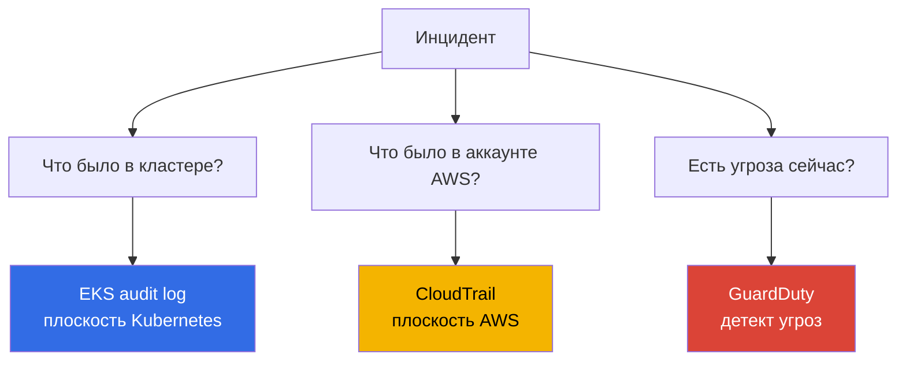
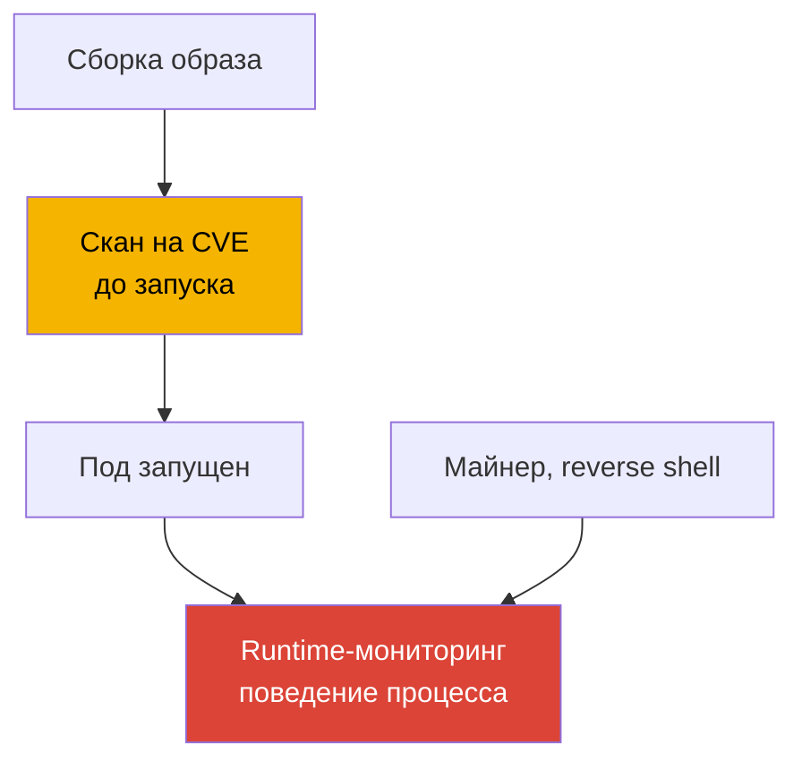
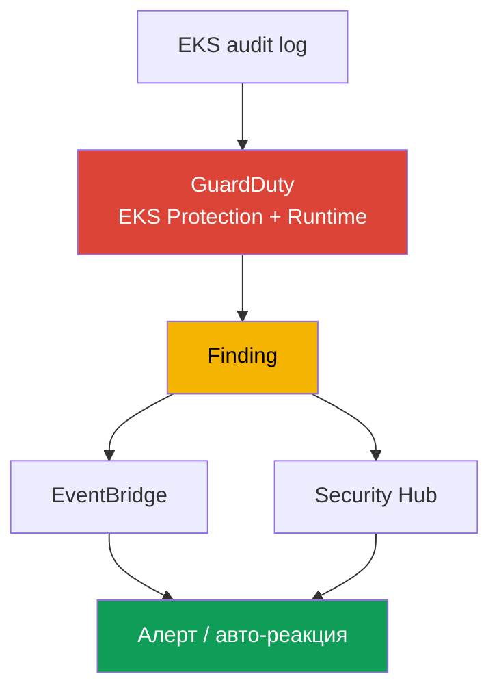
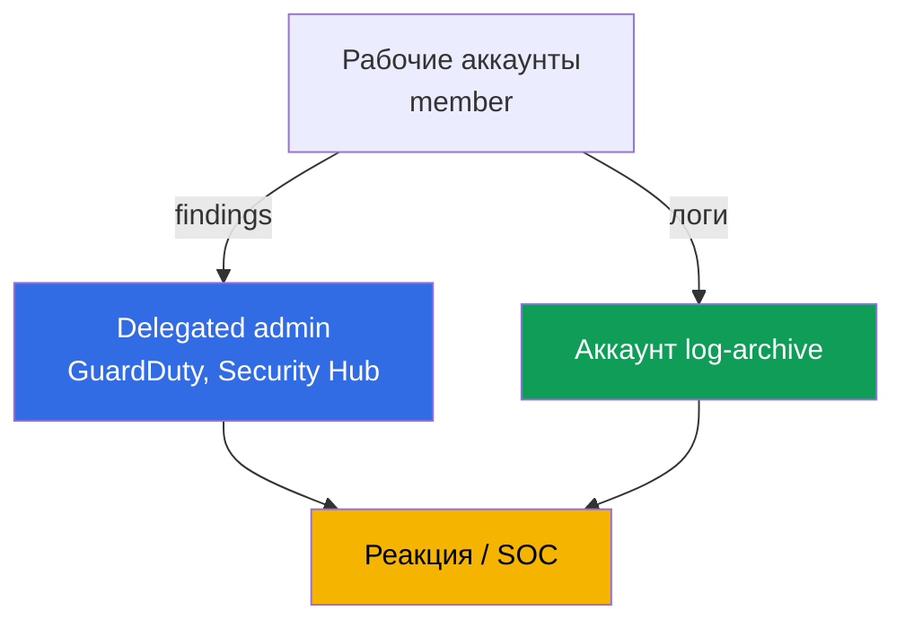

# Глава 21. Аудит и детект: логи control plane, CloudTrail, GuardDuty, runtime-мониторинг

> **Что дальше.** Часть 3 закрыла идентичность (главы 16-17), секреты (глава 18), харденинг
> узла, пода и сети (глава 19) и supply chain образов (глава 20). Эта глава - про то, как
> узнать, что в кластере и аккаунте вообще происходило и происходит ли атака прямо сейчас.
> Разбираем три уровня: EKS audit log, CloudTrail и GuardDuty (EKS Protection и Runtime
> Monitoring). Смежное - в других главах: включение пяти типов логов control plane и их
> механика (глава 2), метрики и observability для отладки (глава 33), логи приложений через
> Fluent Bit (глава 34), харденинг (глава 19), admission-политики (глава 22), RBAC и
> authenticator (глава 5), стоимость и retention логов (главы 34, 43).

## 21.1. «Кто удалил namespace - и почему это нельзя выяснить»

Утром продовый namespace исчез вместе с нагрузками. Первый вопрос дежурного - кто и когда его
удалил, с какой учётки и с какого адреса. Ответа нет: audit-лог control plane не был включён
(глава 2), метрик-фильтров на опасные операции не настроено, а задним числом логи не появятся.
Виновника не найти, повторение не предотвратить. Это не единичный сбой, а слепая зона: в
кластере не велось наблюдение за безопасностью.

Рядом живут родственные боли той же природы:

- **Скомпрометированный под майнит крипту неделю.** В контейнер через уязвимость залез
  атакующий, запустил майнер и reverse shell. За рантаймом никто не смотрит: сканирование
  образа (глава 20) отработало до запуска и ничего не знает о том, что процесс делает сейчас.
  Аномальный трафик и левый процесс никто не замечает, пока не придёт счёт или жалоба.
- **Кто-то выкачал секреты.** Под или пользователь прошёлся `get secrets` по namespace и
  забрал содержимое. RBAC формально позволял, событие нигде не подсвечено, факт утечки всплыл
  бы только при разборе, будь он на чём проводить.
- **Изменили кластер как ресурс AWS.** Кто-то расширил `publicAccessCidrs` до `0.0.0.0/0` или
  снял encryption config. Это не событие Kubernetes - это вызов API AWS, и в audit-логе
  кластера его нет вообще.

Все эти случаи закрываются не одной галочкой, а тремя разными источниками, каждый отвечает на
свой вопрос.

## 21.2. Три вопроса безопасности и три источника ответа

Главный тезис главы: «логи кластера» - это не один поток, а три разных плоскости, и путать их
дорого. Вопрос определяет источник.



| Вопрос | Источник | Плоскость | Пример |
|---|---|---|---|
| Что происходило в кластере | EKS audit log | Kubernetes API | кто удалил namespace, кто читал secrets |
| Что происходило в аккаунте | CloudTrail | API AWS | кто менял конфиг кластера, node group |
| Есть ли активная угроза | GuardDuty | детект в реальном времени | майнер на ноде, анонимный доступ |

Ключ - развести плоскости. Удаление namespace через `kubectl` видно в **audit-логе**, но не в
CloudTrail: для CloudTrail это не событие AWS. Расширение `publicAccessCidrs` видно в
**CloudTrail** (`UpdateClusterConfig`), но не в audit-логе: для Kubernetes это не событие
кластера. А майнер, который не трогает ни Kubernetes API, ни API AWS, не виден ни там, ни там -
его ловит только **GuardDuty Runtime Monitoring** по поведению процесса. Три источника не
заменяют друг друга, они дополняют.

## 21.3. EKS audit log предметно: чтение для детекта

Механику включения пяти типов логов разбирала глава 2; здесь audit-лог интересует предметно -
как источник для расследования. Каждая запись - это JSON-событие Kubernetes audit: кто
(`user.username` - IAM-принципал, отображённый через authenticator, глава 5), что сделал
(`verb`: `get`, `list`, `create`, `delete`), над чем (`objectRef.resource`, `objectRef.name`,
`objectRef.namespace`), откуда (`sourceIPs`), когда (`requestReceivedTimestamp`) и с каким
результатом (`responseStatus.code`, решение авторизации в `annotations`). Отдельно -
`auditID`: уникальный идентификатор запроса. Один запрос порождает записи на разных stage
(`RequestReceived`, `ResponseComplete`) с одним и тем же `auditID`, так по нему собираются все
записи одной операции в единую картину.

Пишется это в CloudWatch Logs в log group `/aws/eks/<cluster>/cluster`, поток -
`kube-apiserver-audit-<id>`. Разбирают его через **CloudWatch Logs Insights**: язык запросов с
`fields`, `filter`, `sort`, `stats`, `limit`.

```
fields @timestamp, user.username, verb, objectRef.resource, objectRef.namespace, sourceIPs.0
| filter verb = "delete" and objectRef.resource = "namespaces"
| sort @timestamp desc
| limit 20
```

Типовые запросы под конкретные вопросы:

| Вопрос | Ядро фильтра Logs Insights |
|---|---|
| Кто удалил namespace | `verb="delete" and objectRef.resource="namespaces"` |
| Кто обращался к secrets | `verb in ["get","list"] and objectRef.resource="secrets"` |
| Анонимный доступ | `user.username="system:anonymous"` |
| Отказы авторизации | `responseStatus.code=403` |
| Действия конкретного принципала | `user.username="arn:aws:sts::...:assumed-role/..."` |

```
fields @timestamp, user.username, objectRef.namespace, objectRef.name
| filter user.username = "system:anonymous"
| sort @timestamp desc
| limit 50
```

Важная граница: audit-лог надёжно отвечает на «кто/когда/каким verb/над каким ресурсом». А вот
содержимое запроса (например, был ли в поде `privileged: true`) в него попадает не всегда - это
зависит от уровня аудита, и по умолчанию тело запроса в EKS-политике аудита фиксируется не для
всех операций. Поэтому «создание привилегированного пода» надёжнее ловить не разбором тела в
Logs Insights, а готовым detection GuardDuty EKS Protection (раздел 21.5). Формулировать по
audit-логу лучше осторожно: он про факт операции, а не всегда про её полное содержимое.

## 21.4. CloudTrail для EKS: плоскость AWS

CloudTrail фиксирует вызовы API AWS. Для EKS это операции над кластером **как над ресурсом
AWS**: `CreateCluster`, `DeleteCluster`, `UpdateClusterConfig` (в том числе смена
`publicAccessCidrs` и настройки логирования), `AssociateEncryptionConfig`,
`CreateAccessEntry`, изменения managed node group (`CreateNodegroup`, `UpdateNodegroupConfig`).
Кто вызвал, когда, с какого IP, под какой ролью, с каким результатом - всё это в CloudTrail.

Отличие от audit-лога принципиально и его стоит держать в голове: **CloudTrail = плоскость
AWS** (что делали с кластером снаружи, через API EKS), **audit-лог = плоскость Kubernetes**
(что делали внутри кластера, через Kubernetes API). Удаление пода в CloudTrail не появится;
удаление node group в audit-логе не появится.

CloudTrail различает **management events** (операции над ресурсами - создание, изменение,
удаление; включены по умолчанию) и **data events** (операции над данными внутри ресурса; по
умолчанию выключены, включаются отдельно и объёмны). Управляющие операции над кластером EKS -
это management events.

```bash
# кто и когда менял конфигурацию кластера - за последние события
aws cloudtrail lookup-events \
  --lookup-attributes AttributeKey=EventName,AttributeValue=UpdateClusterConfig \
  --query 'Events[].{Time:EventTime,User:Username,Event:EventName}' --output table

# все события по конкретному кластеру как ресурсу
aws cloudtrail lookup-events \
  --lookup-attributes AttributeKey=ResourceName,AttributeValue=demo
```

Когда инцидент задевает обе плоскости (сменили конфиг кластера через API AWS, а следом что-то
сделали внутри кластера), картину собирают из двух источников сразу. Общего идентификатора у
audit-лога и CloudTrail нет: внутри audit-лога записи связывает `auditID`, а между источниками
события сшивают по принципалу (IAM-роль), IP (`sourceIPs` против поля CloudTrail) и окну
времени. Так строится единый таймлайн «что в аккаунте -> что в кластере», а не два списка.

Сшивают по трём совпадающим измерениям - вот их поля в каждом источнике:

| Что сопоставляем | Поле в audit-логе | Поле в CloudTrail |
|---|---|---|
| Принципал | `user.username` | `userIdentity` (`Username` в `lookup-events`) |
| IP источника | `sourceIPs` | `sourceIPAddress` |
| Время | `requestReceivedTimestamp` | `eventTime` |

## 21.5. GuardDuty для EKS: EKS Protection и Runtime Monitoring

GuardDuty - сервис обнаружения угроз. Для EKS он работает на двух уровнях, и это разные вещи.

**EKS Protection** анализирует **EKS audit logs** на подозрительную активность control plane.
Важный факт: GuardDuty собирает audit-логи через **собственный независимый поток** и
дополнительной настройки не требует - вам не обязательно включать control plane logging в
CloudWatch, чтобы EKS Protection работал (это включение нужно, только если audit-логи хотите
видеть у себя в аккаунте). Находит он такое, как обращения к API с известных вредоносных IP,
доступ от `system:anonymous`, эскалацию привилегий, запуск привилегированных контейнеров,
подозрительное использование API.

**Runtime Monitoring** - другой уровень: он смотрит за **поведением на нодах**. Работает через
EKS-аддон `aws-guardduty-agent` (GuardDuty security agent) на базе eBPF, который следит за
процессами, сетевыми соединениями и файловой активностью контейнеров. Так ловятся вещи, которых
нет ни в audit-логе, ни в CloudTrail: майнеры, reverse shell, обращения к вредоносным доменам,
запуск подозрительных бинарников. По документации Runtime Monitoring поддерживает EKS на
инстансах EC2 и в EKS Auto Mode, но **не** поддерживает Fargate и EKS Hybrid Nodes. Агент можно
разворачивать автоматически (automated agent configuration) или управлять вручную.

| Свойство | EKS Protection | Runtime Monitoring |
|---|---|---|
| Источник | EKS audit logs (свой поток) | агент на ноде (eBPF) |
| Что видит | вызовы Kubernetes API | процессы, сеть, файлы контейнера |
| Нужен агент на нодах | нет | да, `aws-guardduty-agent` |
| Ловит | анонимный доступ, эскалация, вредоносные IP | майнер, reverse shell, вредоносные домены |
| Ограничения | - | не Fargate, не Hybrid Nodes |

Найденное GuardDuty оформляет как **finding** и отправляет в Security Hub и в EventBridge -
оттуда строится алертинг и автоматическая реакция (раздел 21.7).

## 21.6. Runtime-мониторинг предметно: поведение против образа

Runtime-мониторинг легко перепутать со сканированием образа (глава 20), но это про разные
моменты времени. Скан ловит **известные CVE в образе ДО запуска** - статический анализ
артефакта. Runtime ловит **поведение ПОСЛЕ запуска** - что процесс реально делает в работающем
контейнере. Одно не заменяет другое: чистый по скану образ может быть скомпрометирован в
рантайме через уязвимость приложения, а майнер вообще не обязан быть в образе - его дотягивают
уже внутрь работающего пода.



Runtime-детект для EKS реализуют двумя путями. **GuardDuty Runtime Monitoring** - управляемый
вариант: агент AWS, findings в Security Hub, ничего не надо хостить самому. **Сторонние
инструменты** (например, Falco - CNCF-проект runtime security на тех же eBPF/syscall-событиях)
дают больше гибкости в правилах, но их надо ставить, обновлять и обслуживать самим. Что видит
агент в обоих случаях: запуск процессов, сетевые соединения, доступ к файлам, попытки escape из
контейнера. Выбор между управляемым и своим - это выбор между «меньше контроля, ноль
обслуживания» и «полный контроль, своя эксплуатация».

## 21.7. Как это собирается в цепочку детекта

Отдельные источники складываются в один конвейер: от события к реакции. Разрыв в конце
обесценивает начало - finding, на который никто не смотрит, инцидент не останавливает.



Читается так: audit-лог и агент кормят GuardDuty, тот генерирует finding, finding уходит в
Security Hub (агрегация и приоритизация по всем аккаунтам) и в EventBridge, а правило
EventBridge запускает реакцию - уведомление в чат/SNS, тикет или автоматическое действие через
Lambda (изолировать под, снять ноду, отозвать сессию). Отдельная ветка того же конвейера -
метрик-фильтры CloudWatch на критичные события самого audit-лога (удаление namespace, действия
`system:anonymous`) с алармами, не дожидаясь GuardDuty.

## 21.8. Организация в мультиаккаунте

В одном аккаунте детект бесполезен против того, у кого есть админ этого же аккаунта: он и следы
зачистит, и логи удалит. Поэтому в организации наблюдение выносят из рабочих аккаунтов.



- **Delegated administrator.** Через AWS Organizations GuardDuty и Security Hub назначают
  отдельный аккаунт-администратор (delegated administrator), который управляет сервисом на всю
  организацию и видит findings всех аккаунтов-членов. Назначение регионально: delegated
  administrator задаётся в каждом регионе. Так включение GuardDuty на новых аккаунтах и сбор
  findings централизованы, а не зависят от доброй воли владельца рабочего аккаунта. Критичные
  findings из delegated administrator экспортируют в S3-бакет аккаунта `log-archive` -
  неизменяемая копия события переживёт зачистку в самом рабочем аккаунте.
- **Отдельный аккаунт аудита.** Findings и дашборды безопасности живут в аккаунте, к которому у
  команд разработки доступа нет.
- **Логи в log-archive.** CloudTrail организации и архив audit-логов складывают в отдельный
  аккаунт `log-archive` (глава 0.1) с ограниченным доступом и неизменяемым хранением
  (S3 Object Lock, WORM) - чтобы администратор рабочего аккаунта физически не мог удалить или
  подделать историю. Это условие доверия к логам при
  расследовании.

## 21.9. Как это применяют в продакшене

- **Audit-лог включён всегда.** Как минимум `audit` и `authenticator` с первого дня (глава 2),
  retention выставлен явно, долгий архив уезжает в S3 в отдельный аккаунт (главы 34, 43).
- **GuardDuty на всю организацию.** EKS Protection и Runtime Monitoring включены через
  delegated administrator на всех аккаунтах и во всех используемых регионах, новые аккаунты
  подключаются автоматически.
- **Метрик-фильтры и алармы на критичные события.** Удаление namespace, действия
  `system:anonymous`, всплеск `403`, обращения к secrets - метрик-фильтры CloudWatch на
  audit-лог с алармами, не дожидаясь внешнего сервиса.
- **Реакция на findings автоматизирована.** Findings из Security Hub и EventBridge идут в
  алертинг и в runbook: у критичных типов есть заранее описанная реакция, а не разбор с нуля.
- **CloudTrail отделён от audit-лога в головах команды.** «Кто менял кластер как ресурс AWS» -
  это CloudTrail; «кто менял объекты внутри» - audit-лог. Оба источника защищены от подделки.
- **Runtime Monitoring там, где он поддержан.** На нодах EC2 и Auto Mode - агент GuardDuty; для
  Fargate-нагрузок (агент не поддержан) детект строят на других слоях.

## 21.10. Мини-глоссарий

- **EKS audit log** - тип логов control plane (`audit`), JSON-события Kubernetes audit: кто,
  какой verb, над каким ресурсом, откуда и с каким результатом; пишется в CloudWatch Logs.
- **CloudWatch Logs Insights** - язык запросов по логам (`fields`, `filter`, `sort`, `stats`);
  основной инструмент разбора audit-лога.
- **CloudTrail** - журнал вызовов API AWS; для EKS фиксирует операции над кластером как
  ресурсом AWS (management events), не события внутри Kubernetes.
- **GuardDuty EKS Protection** - анализ EKS audit logs на угрозы через собственный независимый
  поток GuardDuty, без обязательного включения control plane logging.
- **GuardDuty Runtime Monitoring** - наблюдение за поведением на нодах через агент
  `aws-guardduty-agent` (eBPF): процессы, сеть, файлы; не поддерживает Fargate и Hybrid Nodes.
- **auditID** - уникальный идентификатор запроса в audit-логе; одинаков для всех stage одной
  операции. Общего ID с CloudTrail нет - между источниками сшивают по принципалу, IP и времени.
- **Finding** - находка GuardDuty; уходит в Security Hub и EventBridge для алертинга и реакции.
- **Delegated administrator** - аккаунт организации, управляющий GuardDuty/Security Hub на всю
  организацию и видящий findings всех членов; назначается регионально.

## 21.11. Итоги главы

- Наблюдение за безопасностью EKS - это три разные плоскости, а не один лог. Путать их дорого:
  вопрос определяет источник ответа.
- EKS audit log отвечает на «что было в кластере»: кто, какой verb, над каким ресурсом, откуда,
  с каким результатом. Разбирается через CloudWatch Logs Insights по log group
  `/aws/eks/<cluster>/cluster`. Тело запроса попадает не всегда - зависит от уровня аудита.
- CloudTrail отвечает на «что было в аккаунте AWS»: операции над кластером как ресурсом
  (`UpdateClusterConfig`, `CreateAccessEntry`, изменения node group). Это плоскость AWS, а не
  Kubernetes; management events включены по умолчанию.
- GuardDuty отвечает на «есть ли угроза сейчас». EKS Protection анализирует audit-логи через
  свой поток без доп. настройки; Runtime Monitoring через агент на нодах ловит майнеры и
  reverse shell, но не работает на Fargate и Hybrid Nodes.
- Runtime-мониторинг ловит поведение ПОСЛЕ запуска и не заменяет сканирование образа, которое
  ловит CVE ДО запуска. Управляемый вариант - GuardDuty, гибкий - Falco со своей эксплуатацией.
- Findings собираются в цепочку: audit/агент -> GuardDuty -> Security Hub/EventBridge ->
  алерт/реакция. В мультиаккаунте это выносят в delegated administrator и log-archive, чтобы
  админ рабочего аккаунта не мог зачистить следы.

## 21.12. Как это пригодится в реальной работе

Вопрос «кто удалил namespace» на дежурстве превращается из тупика в один запрос Logs Insights -
но только если audit-лог был включён заранее и ещё не вышел за retention. Инцидент «под майнит
неделю» не тянется неделю там, где Runtime Monitoring поднимает finding в первые часы. А спор
«это трогали через API AWS или внутри кластера» решается выбором источника: CloudTrail против
audit-лога, и держать эту границу в голове экономит часы расследования. На планировании же три
вещи стоит сделать до первого инцидента, а не после: включить audit-лог с retention, включить
GuardDuty на организацию и вынести логи в отдельный аккаунт - постфактум ни одно из этого не
добывается.

## 21.13. Вопросы для самопроверки

1. На какие три вопроса безопасности отвечают audit-лог, CloudTrail и GuardDuty?
2. Почему удаление namespace видно в audit-логе, но не в CloudTrail?
3. Почему смена `publicAccessCidrs` видна в CloudTrail, но не в audit-логе?
4. Какие поля записи audit-лога отвечают на «кто, что, над чем, откуда, с каким результатом»?
5. Напишите ядро запроса Logs Insights «кто удалил namespace» и «анонимный доступ».
6. Почему «создание привилегированного пода» не всегда надёжно ловится по audit-логу?
7. Чем management events отличаются от data events в CloudTrail?
8. Что анализирует GuardDuty EKS Protection и нужно ли для него включать control plane logging?
9. Через что работает GuardDuty Runtime Monitoring и какие платформы он не поддерживает?
10. Чем runtime-мониторинг отличается от сканирования образа и почему одно не заменяет другое?
11. Куда GuardDuty отправляет findings и как из них строится реакция?
12. Зачем в мультиаккаунте delegated administrator и отдельный аккаунт log-archive?
13. Как связать события audit-лога и CloudTrail, если общего идентификатора у них нет?

## Практика

Своей лабы у главы пока нет, но всё проверяется на живом кластере и в аккаунте. Убедитесь, что
`audit` включён: `aws eks describe-cluster --name demo --query 'cluster.logging'`, и что есть
log group: `aws logs describe-log-groups --log-group-name-prefix /aws/eks/demo`. Откройте
CloudWatch Logs Insights по `/aws/eks/demo/cluster` и выполните запрос с `filter
objectRef.resource="namespaces"` - удалите тестовый namespace и найдите себя в результатах.

Дальше GuardDuty: `aws guardduty list-detectors` покажет detector в регионе,
`aws guardduty get-detector --detector-id <id>` - его статус и включённые features (EKS
Protection, Runtime Monitoring). Посмотрите операции над кластером в CloudTrail:
`aws cloudtrail lookup-events --lookup-attributes
AttributeKey=EventName,AttributeValue=UpdateClusterConfig`. Если есть тестовая нода на EC2,
поставьте аддон `aws-guardduty-agent` и проверьте, что findings приходят в Security Hub. Разбор
admission-политик, которые не пускают опасное ещё на входе, - глава 22.

---
[Оглавление](../README_RU.md) · [Глава 20](../20/ru.md) · [Глава 22](../22/ru.md)
