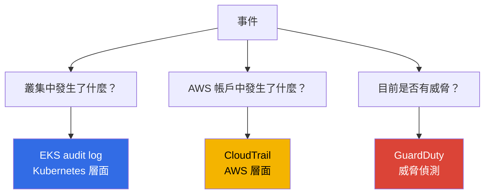
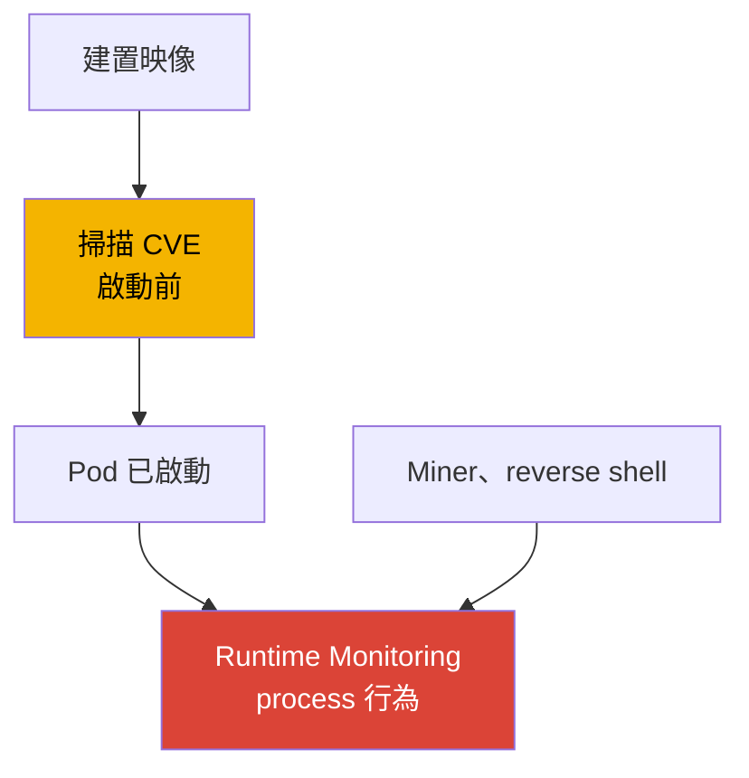
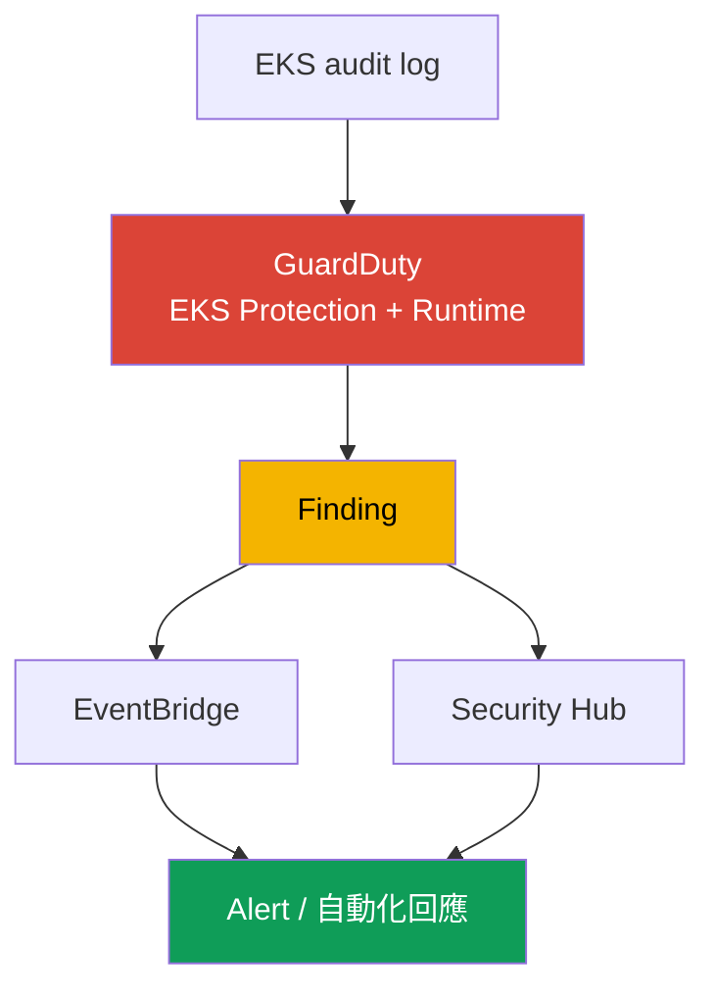
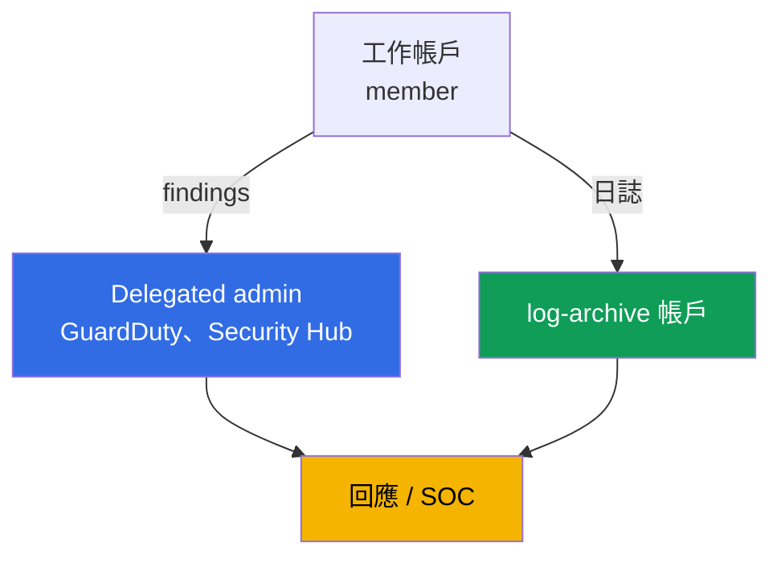

[English version](en.md) · [Versión en español](es.md) · [Version française](fr.md) · [Deutsche Version](de.md) · [ქართული ვერსია](ge.md) · [Русская версия](ru.md) · [日本語版](jp.md)
# 第 21 章。稽核與偵測：control plane 日誌、CloudTrail、GuardDuty、執行階段監控

> **接下來。** 第 3 部分已涵蓋身分識別（第 16-17 章）、Secret（第 18 章）、節點、Pod 與網路強化（第 19 章），以及映像 supply chain（第 20 章）。本章說明如何得知叢集與帳戶中曾發生及正在發生什麼，以及攻擊是否正在進行。我們會探討三個層面：EKS audit log、CloudTrail 與 GuardDuty（EKS Protection 和 Runtime Monitoring）。相關主題位於其他章節：啟用五種類型 control plane 日誌及其機制（第 2 章）、用於偵錯的 metrics 與 observability（第 33 章）、透過 Fluent Bit 的應用程式日誌（第 34 章）、強化（第 19 章）、admission policy（第 22 章）、RBAC 與 authenticator（第 5 章），以及日誌成本與 retention（第 34、43 章）。

## 21.1.「誰刪除了 namespace，為什麼無法查明」

早上，production namespace 與其 workloads 一起消失。值班人員的第一個問題是，誰在何時以哪個帳戶、從哪個位址刪除了它。沒有答案：control plane audit log 未啟用（第 2 章）、未為危險操作設定 metric filter，且日誌不會事後出現。無法找出責任人，也無法防止重演。這不是單一故障，而是一個盲區：叢集未進行安全觀測。

同類型還有以下相關痛點：

- **遭入侵的 Pod 挖礦一週。** 攻擊者透過漏洞進入 container，啟動 miner 與 reverse shell。沒有人監看 runtime：image scanning（第 20 章）在啟動前運作，並不知道 process 現在正在做什麼。沒有人察覺異常流量與未授權 process，直到收到帳單或投訴。
- **有人擷取了 Secret。** Pod 或使用者在 namespace 對 `get secrets` 逐一操作並取得內容。RBAC 在形式上允許，事件未在任何地方顯示，外洩事實只會在事後調查中浮現，前提是有資料可供調查。
- **有人把叢集作為 AWS resource 進行變更。** 有人將 `publicAccessCidrs` 擴大為 `0.0.0.0/0`，或移除了 encryption config。這不是 Kubernetes event，而是 AWS API 呼叫，完全不會出現在叢集 audit log 中。

這些情況不是靠單一勾選方塊解決，而是由三個不同來源解決，每個來源各自回答不同問題。

## 21.2. 三個安全問題與三個回答來源

本章的核心觀點是：「叢集日誌」不是一個資料流，而是三個不同層面，混淆它們代價高昂。問題決定資料來源。



| 問題 | 來源 | 層面 | 範例 |
|---|---|---|---|
| 叢集中發生了什麼 | EKS audit log | Kubernetes API | 誰刪除了 namespace、誰讀取了 secrets |
| AWS 帳戶中發生了什麼 | CloudTrail | AWS API | 誰變更了叢集設定、node group |
| 是否有活躍威脅 | GuardDuty | 即時偵測 | 節點上的 miner、匿名存取 |

關鍵在於區分層面。透過 `kubectl` 刪除 namespace 可在 **audit log** 中看到，但不會出現在 CloudTrail：對 CloudTrail 而言，這不是 AWS event。擴大 `publicAccessCidrs` 可在 **CloudTrail**（`UpdateClusterConfig`）中看到，但不會出現在 audit log：對 Kubernetes 而言，這不是叢集 event。至於不接觸 Kubernetes API 或 AWS API 的 miner，兩者都看不到，只有 **GuardDuty Runtime Monitoring** 能依 process 行為偵測。三個來源不會互相取代，而是互補。

## 21.3. EKS audit log 實務：為偵測而讀取

第 2 章已說明啟用五種類型日誌的機制，此處關注 audit log 的實務用途，也就是作為調查來源。每筆記錄都是 Kubernetes audit JSON event：誰（`user.username`，透過 authenticator 對應的 IAM principal，第 5 章）、做了什麼（`verb`：`get`、`list`、`create`、`delete`）、對什麼做（`objectRef.resource`、`objectRef.name`、`objectRef.namespace`）、從何處做（`sourceIPs`）、何時做（`requestReceivedTimestamp`），以及結果為何（`responseStatus.code`、`annotations` 中的 authorization decision）。另有 `auditID`，它是 request 的唯一識別碼。一個 request 會在不同 stage（`RequestReceived`、`ResponseComplete`）產生具有相同 `auditID` 的記錄，因此可藉此將同一操作的所有記錄整合為完整畫面。

日誌寫入 CloudWatch Logs 的 log group `/aws/eks/<cluster>/cluster`，stream 為 `kube-apiserver-audit-<id>`。使用 **CloudWatch Logs Insights** 進行分析：這是採用 `fields`、`filter`、`sort`、`stats`、`limit` 的查詢語言。

```
fields @timestamp, user.username, verb, objectRef.resource, objectRef.namespace, sourceIPs.0
| filter verb = "delete" and objectRef.resource = "namespaces"
| sort @timestamp desc
| limit 20
```

針對具體問題的常用查詢：

| 問題 | Logs Insights 篩選核心 |
|---|---|
| 誰刪除了 namespace | `verb="delete" and objectRef.resource="namespaces"` |
| 誰存取了 secrets | `verb in ["get","list"] and objectRef.resource="secrets"` |
| 匿名存取 | `user.username="system:anonymous"` |
| authorization 拒絕 | `responseStatus.code=403` |
| 特定 principal 的操作 | `user.username="arn:aws:sts::...:assumed-role/..."` |

```
fields @timestamp, user.username, objectRef.namespace, objectRef.name
| filter user.username = "system:anonymous"
| sort @timestamp desc
| limit 50
```

一項重要界限是：audit log 能可靠回答「誰、何時、使用何種 verb、對哪個 resource 操作」。但 request 的內容，例如 Pod 是否含有 `privileged: true`，不一定會包含在其中，這取決於 audit level，EKS audit policy 預設不會記錄所有操作的 request body。因此，與其在 Logs Insights 分析內容，使用現成的 GuardDuty EKS Protection detection（第 21.5 節）來偵測「建立 privileged Pod」更可靠。描述 audit log 時應謹慎：它記錄操作事實，但並非總是完整內容。

## 21.4. 適用於 EKS 的 CloudTrail：AWS 層面

CloudTrail 記錄 AWS API 呼叫。對 EKS 而言，這些是將叢集視為 **AWS resource** 的操作：`CreateCluster`、`DeleteCluster`、`UpdateClusterConfig`（包含變更 `publicAccessCidrs` 與日誌設定）、`AssociateEncryptionConfig`、`CreateAccessEntry`，以及 managed node group 的變更（`CreateNodegroup`、`UpdateNodegroupConfig`）。誰呼叫、何時呼叫、從哪個 IP、使用哪個 role 與結果為何，都記錄在 CloudTrail 中。

與 audit log 的差異至關重要，必須牢記：**CloudTrail = AWS 層面**（從外部經由 EKS API 對叢集進行的操作），**audit log = Kubernetes 層面**（從叢集內部經由 Kubernetes API 進行的操作）。刪除 Pod 不會出現在 CloudTrail，刪除 node group 也不會出現在 audit log。

CloudTrail 區分 **management events**（對 resource 的建立、變更與刪除操作，預設啟用）及 **data events**（resource 內資料上的操作，預設關閉、需另外啟用且數量龐大）。對 EKS 叢集的管理操作屬於 management events。

```bash
# 誰以及何時變更了叢集設定：最近的 events
aws cloudtrail lookup-events \
  --lookup-attributes AttributeKey=EventName,AttributeValue=UpdateClusterConfig \
  --query 'Events[].{Time:EventTime,User:Username,Event:EventName}' --output table

# 特定叢集作為 resource 的所有 events
aws cloudtrail lookup-events \
  --lookup-attributes AttributeKey=ResourceName,AttributeValue=demo
```

當事件涉及兩個層面，例如透過 AWS API 變更叢集設定後，隨即在叢集內進行其他操作，應同時使用兩個來源組合畫面。audit log 與 CloudTrail 沒有共同識別碼：audit log 內的記錄以 `auditID` 關聯，來源之間的 events 則依 principal（IAM role）、IP（`sourceIPs` 與 CloudTrail 欄位）及時間範圍串接。因此可建立「帳戶中發生什麼 -> 叢集中發生什麼」的完整 timeline，而非兩份獨立清單。

依三個相符維度進行串接，以下為各來源的對應欄位：

| 比對項目 | audit log 欄位 | CloudTrail 欄位 |
|---|---|---|
| Principal | `user.username` | `userIdentity`（`lookup-events` 中的 `Username`） |
| 來源 IP | `sourceIPs` | `sourceIPAddress` |
| 時間 | `requestReceivedTimestamp` | `eventTime` |

## 21.5. 適用於 EKS 的 GuardDuty：EKS Protection 與 Runtime Monitoring

GuardDuty 是威脅偵測服務。對 EKS 而言，它在兩個層級運作，且兩者是不同事物。

**EKS Protection** 會分析 **EKS audit logs**，找出可疑的 control plane activity。一項重要事實是：GuardDuty 透過**自身獨立的資料流**收集 audit logs，無須額外設定。EKS Protection 運作時，不必在 CloudWatch 啟用 control plane logging，只有在想要於自己的帳戶中查看 audit logs 時才需要啟用。它可找出例如來自已知惡意 IP 的 API 存取、`system:anonymous` 存取、privilege escalation、啟動 privileged container，以及可疑 API 使用。

**Runtime Monitoring** 是另一層級：它觀測**節點上的行為**。它透過基於 eBPF 的 EKS addon `aws-guardduty-agent`（GuardDuty security agent）運作，該 agent 監看 container 的 processes、network connections 與 file activity。因此可偵測 audit log 與 CloudTrail 都不存在的項目：miners、reverse shell、對惡意 domains 的連線、執行可疑 binaries。依文件說明，Runtime Monitoring 支援 EC2 instances 上的 EKS 與 EKS Auto Mode，但**不**支援 Fargate 與 EKS Hybrid Nodes。可自動部署 agent（automated agent configuration），或手動管理。

| 屬性 | EKS Protection | Runtime Monitoring |
|---|---|---|
| 來源 | EKS audit logs（自有資料流） | 節點上的 agent（eBPF） |
| 可見內容 | Kubernetes API 呼叫 | container 的 processes、network、files |
| 節點是否需要 agent | 否 | 是，`aws-guardduty-agent` |
| 可偵測 | 匿名存取、privilege escalation、惡意 IP | miner、reverse shell、惡意 domains |
| 限制 | - | 不支援 Fargate、Hybrid Nodes |

GuardDuty 將偵測到的項目建立為 **finding**，並傳送至 Security Hub 與 EventBridge，後續可據此建立 alerting 與自動化回應（第 21.7 節）。

## 21.6. 執行階段監控實務：行為與映像的差異

容易將 runtime monitoring 與 image scanning（第 20 章）混淆，但兩者關注不同時間點。掃描偵測的是**啟動前映像中的已知 CVE**，屬於 artifact 的靜態分析。runtime 偵測的是**啟動後軟體的行為**，也就是 process 在運行中的 container 實際做了什麼。兩者無法互相取代：掃描結果乾淨的映像仍可能透過應用程式漏洞在 runtime 遭入侵，而 miner 根本不必存在於映像中，它可能在運行中的 Pod 內才被下載。



EKS 的 runtime detection 有兩種實作方式。**GuardDuty Runtime Monitoring** 是受管選項：AWS agent、Security Hub 中的 findings，無須自行託管任何服務。**第三方工具**（例如 Falco，使用相同 eBPF/syscall events 的 CNCF runtime security project）可為規則提供更多彈性，但必須自行安裝、更新與維護。兩種 agent 都能看到的內容包括：process 啟動、network connections、file access 與 container escape attempts。在受管或自行管理之間選擇，等同於在「較少控制、無維運」與「完整控制、自行維運」間取捨。

## 21.7. 如何組成偵測鏈

個別來源會組成單一 pipeline，從 event 到回應。末端中斷會讓開端失去價值，無人查看的 finding 無法阻止事件。



可如此理解：audit log 與 agent 將資料提供給 GuardDuty，後者產生 finding，finding 會送往 Security Hub（跨帳戶彙總及優先排序）與 EventBridge，接著 EventBridge rule 觸發回應，例如傳送聊天/SNS notification、建立 ticket，或經由 Lambda 執行自動化動作（隔離 Pod、移除 node、撤銷 session）。同一 pipeline 的另一分支是，針對 audit log 的 critical events（刪除 namespace、`system:anonymous` 操作）建立 CloudWatch metric filters 與 alarms，而不等待 GuardDuty。

## 21.8. 多帳戶組織方式

在單一帳戶中，觀測無法對抗擁有該帳戶 admin 權限的人：他既能清除痕跡，也能刪除日誌。因此在 organization 中，應將觀測移出工作帳戶。



- **Delegated administrator。** 透過 AWS Organizations，為 GuardDuty 與 Security Hub 指派獨立 administrator account（delegated administrator），由其管理整個 organization 的服務並查看所有 member accounts 的 findings。此指派依區域進行，必須在每個 region 設定 delegated administrator。如此一來，新帳戶的 GuardDuty 啟用與 finding 收集得以集中化，而不依賴工作帳戶擁有者的意願。從 delegated administrator 匯出 critical findings 到 `log-archive` 帳戶的 S3 bucket，事件的不可變副本可在工作帳戶遭清除後仍然保存。
- **獨立稽核帳戶。** Findings 與 security dashboards 位於開發團隊無權存取的帳戶中。
- **日誌存放至 log-archive。** organization CloudTrail 與 audit log archive 應存放在獨立的 `log-archive` 帳戶（第 0.1 章），採用受限存取與不可變儲存（S3 Object Lock、WORM），使工作帳戶 admin 在實體上無法刪除或竄改歷史記錄。這是事件調查時信任日誌的條件。

## 21.9. 如何在 production 中採用

- **始終啟用 audit log。** 從第一天起至少啟用 `audit` 與 `authenticator`（第 2 章），明確設定 retention，長期 archive 傳送至另一帳戶的 S3（第 34、43 章）。
- **整個 organization 啟用 GuardDuty。** 透過 delegated administrator 在所有帳戶與所有使用中的 regions 啟用 EKS Protection 與 Runtime Monitoring，新帳戶自動加入。
- **為 critical events 設定 metric filters 與 alarms。** 對刪除 namespace、`system:anonymous` 操作、`403` 激增與 secrets 存取，在 audit log 設定 CloudWatch metric filters 及 alarms，不等待外部服務。
- **自動化 finding 回應。** 將來自 Security Hub 與 EventBridge 的 findings 傳送至 alerting 與 runbook。對 critical 類型預先定義回應，而非從零開始調查。
- **團隊思維中將 CloudTrail 與 audit log 分開。** 「誰將叢集作為 AWS resource 進行變更」應查看 CloudTrail，「誰變更了內部 objects」應查看 audit log。兩個來源都應受到保護，防止遭到竄改。
- **在支援之處使用 Runtime Monitoring。** 對 EC2 nodes 與 Auto Mode 使用 GuardDuty agent。對 Fargate workloads（不支援 agent），在其他層級建立偵測能力。

## 21.10. 小型詞彙表

- **EKS audit log**：control plane 日誌類型（`audit`），記錄 Kubernetes audit JSON events：誰、哪個 verb、哪個 resource、從何處及結果為何，寫入 CloudWatch Logs。
- **CloudWatch Logs Insights**：日誌查詢語言（`fields`、`filter`、`sort`、`stats`），是分析 audit log 的主要工具。
- **CloudTrail**：AWS API 呼叫日誌。對 EKS 而言，記錄將叢集視為 AWS resource 的操作（management events），不記錄 Kubernetes 內部 events。
- **GuardDuty EKS Protection**：透過 GuardDuty 自身的獨立資料流分析 EKS audit logs 的威脅，無須強制啟用 control plane logging。
- **GuardDuty Runtime Monitoring**：透過 `aws-guardduty-agent`（eBPF）觀測節點行為，包括 processes、network、files，不支援 Fargate 與 Hybrid Nodes。
- **auditID**：audit log 中 request 的唯一識別碼，同一操作的所有 stage 皆相同。它與 CloudTrail 沒有共同 ID，應依 principal、IP 與時間跨來源串接。
- **Finding**：GuardDuty 發現的項目，傳送至 Security Hub 與 EventBridge 以用於 alerting 與回應。
- **Delegated administrator**：管理整個 organization 的 GuardDuty/Security Hub 並可查看所有 members findings 的 organization account，依區域指派。

## 21.11. 本章總結

- EKS 安全觀測是三個不同層面，而不是一份日誌。混淆它們代價高昂，問題決定回答來源。
- EKS audit log 回答「叢集中發生什麼」：誰、何種 verb、哪個 resource、從何處與結果為何。透過 CloudWatch Logs Insights 分析 log group `/aws/eks/<cluster>/cluster`。request body 不一定包含，這取決於 audit level。
- CloudTrail 回答「AWS 帳戶中發生什麼」：將叢集作為 resource 的操作（`UpdateClusterConfig`、`CreateAccessEntry`、node group 變更）。這是 AWS 層面，不是 Kubernetes 層面，management events 預設啟用。
- GuardDuty 回答「目前是否有威脅」。EKS Protection 透過自身資料流分析 audit logs，無須額外設定。Runtime Monitoring 透過 nodes 上的 agent 偵測 miners 與 reverse shell，但不適用於 Fargate 與 Hybrid Nodes。
- Runtime monitoring 偵測**啟動後**的行為，並不取代偵測**啟動前** CVE 的 image scanning。受管選項是 GuardDuty，具彈性的選項是需自行維運的 Falco。
- Findings 會組成鏈：audit/agent -> GuardDuty -> Security Hub/EventBridge -> alert/回應。在 multi-account 環境中，應移至 delegated administrator 與 log-archive，使工作帳戶 admin 無法清除痕跡。

## 21.12. 如何應用於實務工作

值班期間，「誰刪除了 namespace」這個問題會變成一個 Logs Insights query，而非無解的困境，但前提是先前已啟用 audit log 且尚未超過 retention。若 Runtime Monitoring 在數小時內建立 finding，「Pod 挖礦一週」的事件就不會延續一週。至於「這是透過 AWS API 還是叢集內部操作」的爭論，選擇正確來源即可解決：CloudTrail 或 audit log，牢記這條界線可節省數小時的調查時間。在規劃階段，有三件事應在首次事件前完成，而不是事後：啟用具備 retention 的 audit log、為 organization 啟用 GuardDuty，以及將日誌移至獨立帳戶，這些事後都無法補回。

## 21.13. 自我檢查問題

1. audit log、CloudTrail 與 GuardDuty 各自回答哪三個安全問題？
2. 為何刪除 namespace 在 audit log 可見，卻不在 CloudTrail 中？
3. 為何變更 `publicAccessCidrs` 在 CloudTrail 可見，卻不在 audit log 中？
4. audit log record 中哪些欄位回答「誰、做什麼、對什麼、從何處、結果為何」？
5. 寫出 Logs Insights queries 的核心，分別用來查詢「誰刪除了 namespace」與「匿名存取」。
6. 為什麼不一定能透過 audit log 可靠偵測「建立 privileged Pod」？
7. CloudTrail 中的 management events 與 data events 有何差異？
8. GuardDuty EKS Protection 分析什麼，是否必須為它啟用 control plane logging？
9. GuardDuty Runtime Monitoring 透過什麼運作，且不支援哪些 platforms？
10. runtime monitoring 與 image scanning 有何差異，為何兩者無法互相取代？
11. GuardDuty 將 findings 傳送至何處，並如何從中建立回應？
12. multi-account 中為何需要 delegated administrator 與獨立 log-archive account？
13. 若 audit log 與 CloudTrail 沒有共同識別碼，如何關聯兩者的 events？

## 實作

本章尚無專屬 lab，但所有內容都可在實際叢集與帳戶中驗證。確認已啟用 `audit`：`aws eks describe-cluster --name demo --query 'cluster.logging'`，並確認存在 log group：`aws logs describe-log-groups --log-group-name-prefix /aws/eks/demo`。在 `/aws/eks/demo/cluster` 開啟 CloudWatch Logs Insights，並執行含有 `filter objectRef.resource="namespaces"` 的 query，刪除測試 namespace，然後在結果中找到自己。

接著檢查 GuardDuty：`aws guardduty list-detectors` 會顯示 region 中的 detector，`aws guardduty get-detector --detector-id <id>` 會顯示其 status 與已啟用的 features（EKS Protection、Runtime Monitoring）。在 CloudTrail 檢視叢集操作：`aws cloudtrail lookup-events --lookup-attributes AttributeKey=EventName,AttributeValue=UpdateClusterConfig`。若有 EC2 上的測試 node，安裝 `aws-guardduty-agent` addon，並確認 findings 會傳送至 Security Hub。第 22 章將探討用於在入口處阻擋危險內容的 admission policies。

---
[目錄](../README_TW.md) · [第 20 章](../20/tw.md) · [第 22 章](../22/tw.md)
[English version](en.md) · [Versión en español](es.md) · [Version française](fr.md) · [Deutsche Version](de.md) · [ქართული ვერსია](ge.md) · [Русская версия](ru.md) · [日本語版](jp.md)