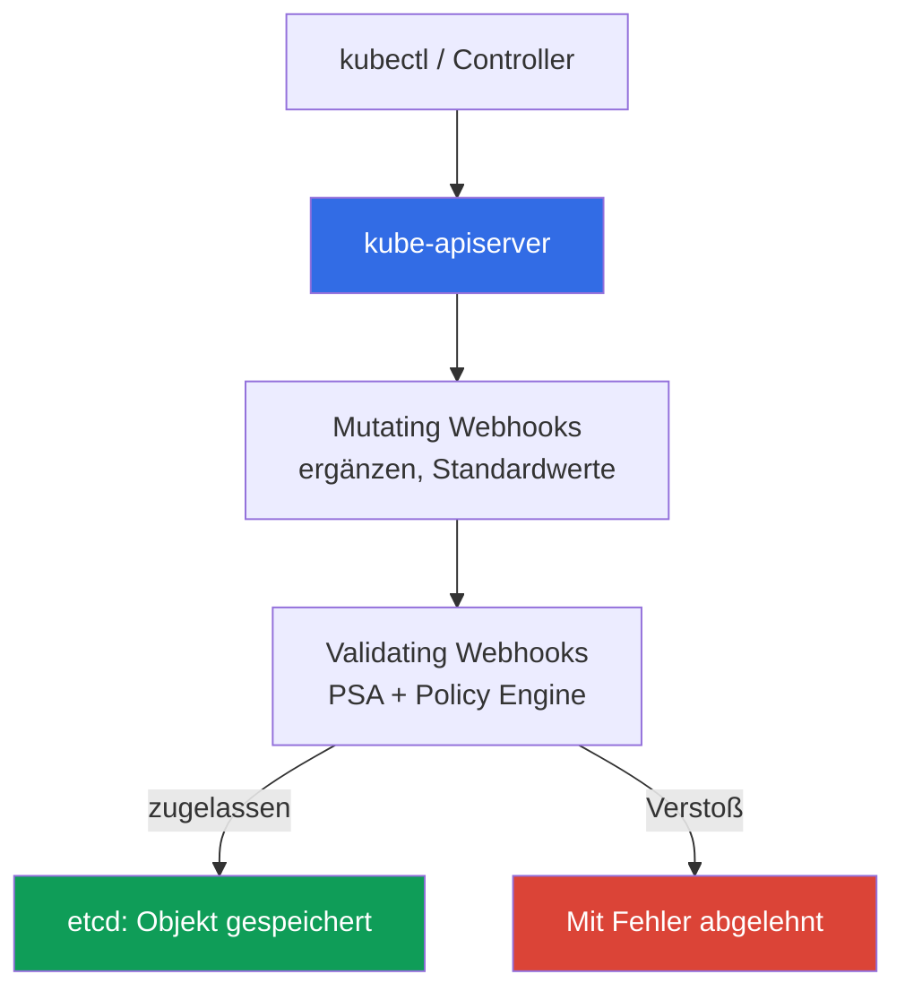
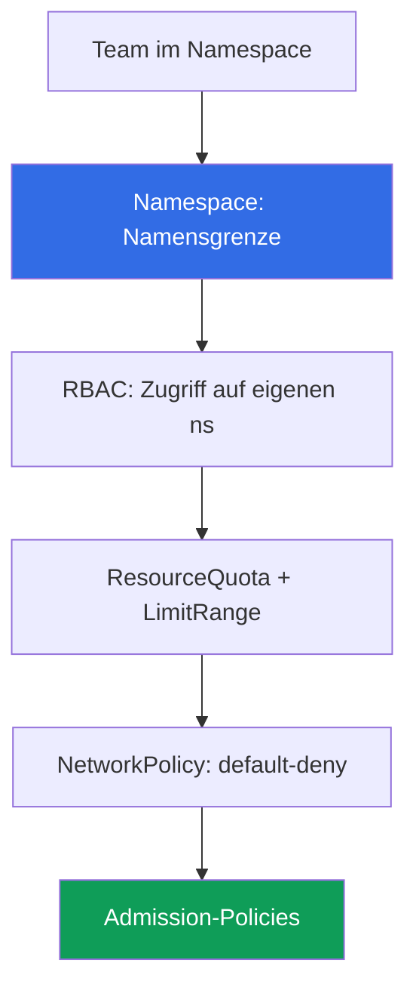

[Русская версия](ru.md) · [Eng version](en.md) · [Versión en español](es.md) · [Version française](fr.md) · [ქართული ვერსია](ge.md) · [繁體中文版](tw.md) · [日本語版](jp.md)
# Kapitel 22. Policies und Multi-Tenancy: Kyverno und Gatekeeper, Team-Isolation

> **Was als Nächstes kommt.** Kapitel 19 aktivierte Pod Security Admission (PSA) mit drei fertigen Ebenen: privileged/baseline/restricted. Sie reichen für das grundlegende Hardening eines Pods, aber nicht für eigene Regeln oder dafür, dass Teams im Cluster einander nicht beeinträchtigen. Dieses Kapitel schließt Teil 3 ab: Policy Engines (Kyverno, Gatekeeper) für Regeln, die PSA nicht bietet, und Multi-Tenancy innerhalb des Clusters. Verwandte Themen finden sich in anderen Kapiteln: PSA (Kapitel 19), Image-Signatur (Kapitel 20), RBAC (Kapitel 5), NetworkPolicy (Kapitel 30), Quotas (Kapitel 14), Admission Webhooks (Kapitel 2), der Account als Grenze (Kapitel 0.1, 32).

## 22.1. „PSA kann meine Regeln nicht, und Teams beeinträchtigen sich gegenseitig“

PSA ist aktiviert, restricted gilt für Produktions-Namespaces (Kapitel 19), ein privilegierter Pod kommt nicht durch. Admission scheint unter Kontrolle zu sein. Doch dann kommt eine Anforderung, die PSA nicht abdeckt: Images außerhalb des eigenen ECR verbieten. Das kann PSA nicht, denn es hat drei feste Profile, und **eine eigene Regel lässt sich ihnen nicht hinzufügen**. Danach folgt mehr: Auf Pods die Labels `owner` und `cost-center` verlangen, nur bestimmte StorageClasses zulassen, `:latest` nicht erlauben. Nichts davon lässt sich durch die Ebenen baseline/restricted ausdrücken. PSA beantwortet „Ist der Pod nach dem Standard sicher?“, aber nicht „Entspricht er **unseren** Regeln?“.

Daneben besteht ein zweites Problem: Mehrere Teams in einem Cluster treten sich gegenseitig auf die Füße:

- **Ein Team stellte einen Pod ohne Limits bereit und verbrauchte einen Node.** Ein Pod ohne `resources.limits` wuchs beim Speicherverbrauch, OOM trat ein, benachbarte Pods gerieten in Schwierigkeiten. Der Namespace hatte keine ResourceQuota, und ein Team zog Ressourcen des gesamten Nodes an sich (Sizing und Limits: Kapitel 14).
- **Ein Team erstellte einen LoadBalancer in einem fremden Namespace.** RBAC war zu weitreichend vergeben, ein Engineer stellte versehentlich einen Service vom Typ LoadBalancer im Namespace eines anderen Teams bereit, ein unnötiger NLB und Kosten entstanden.

Das erste Problem löst eine Policy Engine, indem sie Regeln erzwingt, die PSA nicht bietet. Das zweite löst Team-Isolation innerhalb des Clusters: Namespace, Quotas, RBAC, Netzwerk und dieselben Admission-Policies zusammen.

## 22.2. Admission Control als Kontrollpunkt

Bevor ein Objekt in etcd landet, führt der apiserver es durch Admission Controller (Kapitel 2). Zwei Arten von Webhooks erledigen die gesamte erweiterbare Arbeit:

- **Mutating Admission Webhook**: wird zuerst aufgerufen und **kann** das Objekt ändern, etwa ein Label ergänzen, Standardwerte für `resources` setzen oder einen Sidecar hinzufügen.
- **Validating Admission Webhook**: wird danach aufgerufen und **prüft nur**: zulassen oder ablehnen. Er kann das Objekt nicht verändern.



**Eine Policy Engine ist ein Admission Webhook**, nur legen Sie die Regeln selbst fest. Sie prüft und verändert bei Bedarf Objekte nach Ihren Regeln **vor dem Speichern in etcd**. PSA ist ebenfalls ein Admission Controller, jedoch mit festen Profilen: Wo PSA endet (drei Ebenen, keine eigenen Regeln), beginnt die Policy Engine. In der Praxis werden sie **kombiniert**: PSA hält das grundlegende Pod-Niveau, die Engine ergänzt den Rest. PSA muss nicht durch eine Engine ersetzt werden: Es sind unterschiedliche Aufgaben.

Seit Kubernetes 1.30 hat der apiserver eine **integrierte** Alternative zu Webhooks: `ValidatingAdmissionPolicy`. Regeln werden mit **CEL** (Common Expression Language) direkt in der Ressource geschrieben, die Prüfung läuft **innerhalb des apiserver, ohne externen Webhook**. Es gibt keinen separaten Engine-Pod, also auch keinen Netzwerkaufruf, der nicht antworten und Admission anhalten kann (zu diesem Risiko und `failurePolicy` siehe 22.9). Das Modell besteht aus zwei Ressourcen: `ValidatingAdmissionPolicy` (die CEL-Regel in `validations`) und `ValidatingAdmissionPolicyBinding` (worauf sie angewendet wird und die Reaktion). Dasselbe Verbot von `:latest` wie bei Kyverno in 22.3, aber ohne Drittanbieter-Engine:

```yaml
apiVersion: admissionregistration.k8s.io/v1
kind: ValidatingAdmissionPolicy
metadata:
  name: disallow-latest-tag
spec:
  matchConstraints:
    resourceRules:
      - apiGroups: [""]
        apiVersions: ["v1"]
        operations: ["CREATE", "UPDATE"]
        resources: ["pods"]
  validations:
    - expression: "object.spec.containers.all(c, !c.image.endsWith(':latest'))"
      message: "Das Tag :latest ist verboten"
---
apiVersion: admissionregistration.k8s.io/v1
kind: ValidatingAdmissionPolicyBinding
metadata:
  name: disallow-latest-tag-binding
spec:
  policyName: disallow-latest-tag
  validationActions: ["Deny"]        # Audit/Warn beim Rollout -> Deny
```

Die integrierte Validierung eignet sich für einfache Prüfungen ohne mutate/generate; komplexe Logik, Image-Signaturen und das Generieren von Ressourcen bleiben bei Kyverno/Gatekeeper.

## 22.3. Kyverno: Policies als YAML-Ressourcen

Kyverno ist eine Policy Engine, bei der **eine Policy eine gewöhnliche Kubernetes-YAML-Ressource** ist, ohne eigene Sprache. Sie schreiben `ClusterPolicy` (gilt für den gesamten Cluster) oder `Policy` (innerhalb eines Namespace), wenden sie über `kubectl apply` an und lesen sie mit `kubectl get`. Innerhalb der Policy stehen Regeln, und jede Regel hat einen der folgenden Typen:

- **validate**: prüfen und verbieten/verlangen (kein Label: ablehnen).
- **mutate**: Objekt ergänzen (ein Standard-Label oder `resources` setzen).
- **generate**: zugehörige Ressource erstellen (beispielsweise NetworkPolicy für einen neuen Namespace).
- **verifyImages**: Image-Signatur prüfen (genau der Schritt aus Kapitel 20 bei Admission).

Die Reaktion auf einen Verstoß wird durch `validationFailureAction` gesetzt: `Enforce` bedeutet, dass der Pod **abgelehnt** wird; bei `Audit` wird der Pod erstellt und der Verstoß landet im Policy Report. Die Einführungsreihenfolge ist dieselbe wie bei PSA (Kapitel 19): zuerst `Audit`, um Verstöße zu sehen, dann `Enforce`.

Beispiel für validate: das Tag `:latest` verbieten (eine Regel für erforderliche `requests`/`limits` wird genauso über `pattern` mit `resources` aufgebaut):

```yaml
apiVersion: kyverno.io/v1
kind: ClusterPolicy
metadata:
  name: disallow-latest-tag
spec:
  validationFailureAction: Enforce        # Verstoß -> Pod abgelehnt
  rules:
    - name: no-latest
      match:
        any:
          - resources:
              kinds: ["Pod"]
      validate:
        message: "Das Tag :latest ist verboten, Bereitstellung nach Version oder Digest"
        pattern:
          spec:
            containers:
              - image: "!*:latest"          # Image darf nicht auf :latest enden
```

Erforderliche `requests`/`limits` sind dieselbe validate-Regel mit `pattern` für `resources` (der Wert `?*` bedeutet einen beliebigen nichtleeren Wert). Nur das eigene ECR erlauben: validate anhand des Image-Musters; die Signatur prüfen: Regel `verifyImages` mit einem vertrauenswürdigen Schlüssel (die Mechanik: Kapitel 20). So erfüllt die Engine genau die Anforderungen aus 22.1, die PSA nicht bietet.

## 22.4. Gatekeeper: Policies in Rego

Gatekeeper ist eine Policy Engine auf Open Policy Agent (OPA), bei der Regeln in der Sprache **Rego** geschrieben werden. Sie besteht aus zwei Ressourcen:

- **ConstraintTemplate**: Vorlage mit Rego-Code (der Regel `violation`) und Parameterschema. Daraus erstellt Gatekeeper einen neuen Ressourcentyp (CRD).
- **Constraint**: Instanz der Vorlage, die angibt, **worauf** sie angewendet wird (welche kinds) und mit welchen Parametern.

Eine Vorlage „Labels verlangen“ und beliebig viele Constraints mit unterschiedlichen Label-Sätzen für verschiedene Namespaces. Beispiel für ein erforderliches Label (gekürzt):

```yaml
apiVersion: templates.gatekeeper.sh/v1
kind: ConstraintTemplate
metadata:
  name: k8srequiredlabels
spec:
  crd:
    spec:
      names:
        kind: K8sRequiredLabels
  targets:
    - target: admission.k8s.gatekeeper.sh
      rego: |
        package k8srequiredlabels
        violation[{"msg": msg}] {
          required := input.parameters.labels[_]
          not input.review.object.metadata.labels[required]
          msg := sprintf("missing label: %v", [required])
        }
---
apiVersion: constraints.gatekeeper.sh/v1beta1
kind: K8sRequiredLabels              # Typ wurde durch die Vorlage oben erstellt
metadata:
  name: pods-must-have-owner
spec:
  match:
    kinds:
      - apiGroups: [""]
        kinds: ["Pod"]
  parameters:
    labels: ["owner", "cost-center"]  # erforderliche Labels
```

Rego ist für komplexe Logik mächtiger als Kyvernos YAML-Muster, hat aber **eine höhere Einstiegshürde**: Die Sprache muss erlernt werden, die Fehlersuche ist schwieriger. Gatekeeper wird verwendet, wenn eine vollwertige Policy-Sprache nötig ist; Kyverno ist bei deklarativen Regeln und mutate/generate ohne eigene Sprache im Vorteil.

## 22.5. Kyverno gegenüber Gatekeeper

Beide sind Admission Webhooks im Cluster. Der Unterschied liegt in Sprache, Fähigkeiten und Einstiegshürde.

| Eigenschaft | Kyverno | Gatekeeper (OPA) |
|---|---|---|
| Policy-Sprache | Kubernetes-YAML-Ressourcen | Rego |
| Einstiegshürde | niedrig, vertraute Syntax | höher, Rego muss gelernt werden |
| Modell | `ClusterPolicy`/`Policy` mit Regeln | `ConstraintTemplate` + `Constraint` |
| mutate (Objekt ändern) | ja, standardmäßig | eingeschränkt (Mutation separat) |
| generate (Ressourcen erstellen) | ja | nein |
| verifyImages (Signatur) | ja, integriert | über eine separate Integration |
| Ausdrucksstärke | Muster + CEL | vollständiges Rego, komplexe Logik |
| Wann wählen | deklarative Regeln, mutate/generate | Sprache und komplexe Prüfungen nötig |

Praktische Wahl: ein Cluster, eine Engine, nicht beide gleichzeitig (zwei Admission Webhooks für dieselben Objekte erschweren die Fehlersuche). Für die meisten EKS-Teams ist Kyverno zu Beginn einfacher; Gatekeeper wird gewählt, wenn Regeln über deklarative Muster hinauswachsen.

## 22.6. Was Policies in der Praxis prüfen

Eine Policy Engine deckt eine ganze Klasse von Anforderungen ab, die PSA nicht bietet. Ein typischer Satz:

| Regel | Typ | Zweck |
|---|---|---|
| Tag `:latest` verbieten | validate | Reproduzierbarkeit, Bereitstellung per Digest (Kapitel 20) |
| Erforderliche `requests`/`limits` | validate | ein Team kann keinen Node verbrauchen (Kapitel 14) |
| Nur vertrauenswürdige Registries (eigenes ECR) | validate | keine fremden Images ziehen (Kapitel 20) |
| Erforderliche Labels/Annotations (owner, cost-center) | validate | Verantwortlicher und Kostenerfassung |
| `hostPath`/`privileged` verbieten | validate | ergänzt baseline/restricted PSA (Kapitel 19) |
| Image-Signatur prüfen | verifyImages | nur vertrauenswürdiges Artefakt (Kapitel 20) |
| Zulässige StorageClasses | validate | kein Volume auf einer teuren/fremden Klasse erstellen (Kapitel 23) |
| Zulässige Service-Typen | validate | keinen zusätzlichen LoadBalancer erzeugen (Kapitel 26) |
| Standard-Labels setzen | mutate | einheitliche Erfassung ohne Änderungen an Manifesten |
| NetworkPolicy für Namespace erstellen | generate | Netzwerk ist von der Namespace-Erstellung an geschlossen (Kapitel 30) |

Die letzten zwei Zeilen sind mutate und generate: Die Engine verbietet nicht nur, sondern ergänzt ein Objekt und erstellt Ressourcen. Das Verbot von `hostPath`/`privileged` überschneidet sich mit baseline/restricted PSA, und das ist normal: PSA hält den Standard, die Policy ergänzt Nuancen. Die Prüfung von Signatur und Registry ist das Admission-Glied der Supply-Chain-Kette aus Kapitel 20: ECR signiert, die Engine prüft beim Eingang.

## 22.7. Multi-Tenancy innerhalb des Clusters: soft gegenüber hard

Multi-Tenancy bedeutet mehrere „Mandanten“ (Teams, Umgebungen, Kunden) in einer Infrastruktur. Es gibt zwei Ansätze, und die Wahl zwischen ihnen ist grundlegend.

- **Soft Multi-Tenancy**: Mandanten befinden sich **in einem Cluster**, getrennt durch Namespaces und Kubernetes-Mechanismen (RBAC, ResourceQuota, LimitRange, NetworkPolicy, Policies). Das ist günstig, aber Control Plane und Node-Kernel werden gemeinsam genutzt.
- **Hard Multi-Tenancy**: Mandanten befinden sich **in getrennten Clustern oder Accounts** (Kapitel 0.1, 32). Das ist teurer und komplexer, aber die Grenze ist hart: eigener Kernel, eigene Control Plane.



Isolation im Soft-Modell bieten: der **Namespace** als Namensgrenze und Geltungsbereich von RBAC; **RBAC** (Kapitel 5) lässt ein Team nur in seinen eigenen Namespace; **ResourceQuota und LimitRange** (Verbindung zum Sizing, Kapitel 14) verhindern, dass ein Team den Cluster aufbraucht; **NetworkPolicy** (Kapitel 30) beschränkt Traffic zwischen Namespaces; **Admission-Policies** erzwingen erforderliche Regeln.

Was Soft Multi-Tenancy **nicht bietet**: eine gemeinsame Control Plane (apiserver, etcd, scheduler sind für alle gleich) und einen gemeinsamen Node-Kernel (die Pods der Teams teilen den Linux-Kernel; ein Container-Ausbruch über eine Kernel-Schwachstelle durchbricht die Namespace-Grenze). Namespace und RBAC sind logische Grenzen, keine Kernel-Isolation.

Regel für die Wahl: Vertrauenswürdige Teams einer Organisation nutzen das Soft-Modell in einem gemeinsamen Cluster; feindliche oder streng regulierte Mandanten benötigen hard, getrennte Cluster/Accounts (Kapitel 0.1, 32).

## 22.8. Team-Isolation im Detail

Soft Multi-Tenancy wird aus Schichten aufgebaut, und jede schließt eines der Probleme aus 22.1. Ein Namespace pro Team ist die Basiseinheit; daran wird der Rest angebracht.

**ResourceQuota** begrenzt den Gesamtverbrauch eines Namespace, damit ein Team den Cluster nicht aufbraucht:

```yaml
apiVersion: v1
kind: ResourceQuota
metadata:
  name: team-a-quota
  namespace: team-a
spec:
  hard:
    requests.cpu: "10"              # gesamte requests aller Pods im ns
    requests.memory: 20Gi
    limits.memory: 40Gi
    pods: "50"
    services.loadbalancers: "2"     # höchstens zwei LB im Namespace
```

**LimitRange** setzt Standardwerte und Grenzen für **einen einzelnen Container**, damit ein Pod ohne explizite `resources` nicht ohne Limits startet (das Problem aus 22.1):

```yaml
apiVersion: v1
kind: LimitRange
metadata:
  name: team-a-limits
  namespace: team-a
spec:
  limits:
    - type: Container
      default:                      # limits, falls nicht im Pod gesetzt
        cpu: "500m"
        memory: 512Mi
      defaultRequest: {cpu: "100m", memory: 128Mi}   # requests, falls nicht gesetzt
```

Darüber: **RBAC** (Kapitel 5) gibt Rollen nur im eigenen Namespace, sodass kein LoadBalancer in einem fremden erstellt werden kann; **NetworkPolicy** (Kapitel 30) mit default-deny beschränkt Traffic zwischen Namespaces; **Admission-Policies** erzwingen erforderliche Regeln: Registry, Labels, Service-Typen. Bei einer ResourceQuota verlangt Kubernetes von jedem Pod `requests`/`limits`; LimitRange mit Standardwerten ist hier daher kein Luxus, sondern Voraussetzung dafür, dass Pods überhaupt erstellt werden.

## 22.9. Anwendung in der Produktion

- **Regel-Rollout: `Audit`/`Warn` -> `PolicyReport` -> `Enforce`.** Eine neue Policy wird mit `Audit` (Kyverno) oder einer Warnung eingeführt, `PolicyReport` wird für echten Traffic gesammelt und Verstöße werden identifiziert, erst dann wird auf `Enforce` umgestellt. Andernfalls werden legitime Deployments blockiert. Der Weg ist derselbe wie bei PSA (Kapitel 19); für `ValidatingAdmissionPolicyBinding` sind es dieselben `validationActions`: `Audit`/`Warn` -> `Deny`.
- **`failurePolicy`: zuerst `Ignore`, dann `Fail`.** Der Engine-Webhook wird mit `failurePolicy` registriert: Bei `Fail` **hält** ein nicht verfügbarer Webhook Admission an und Deployments stehen still, bei `Ignore` passiert das Objekt die Prüfung nicht. Beim Rollout wird `Ignore` zusammen mit einem Alert für Webhook-Fehler und Timeouts gesetzt; erst nach Stabilisierung wird zu `Fail` gewechselt. Das integrierte `ValidatingAdmissionPolicy` hat dieses Risiko nicht: Die Prüfung läuft im apiserver (22.2).
- **Policies als Code in git.** `ClusterPolicy`/`ConstraintTemplate` liegen im Repository und werden über GitOps (Kapitel 44) ausgerollt, nicht manuell: Regelhistorie und Review befinden sich in git.
- **PSA für grundlegende Ebenen plus Policy Engine für den Rest.** PSA hält baseline/restricted auf dem Namespace (Kapitel 19), die Engine ergänzt Registry, Labels, Digest und Service-Typen, die PSA nicht bietet.
- **ResourceQuota und LimitRange für jeden Team-Namespace.** Ein Namespace ohne Quota bedeutet ein Team ohne Obergrenze; sie werden bei der Namespace-Erstellung gesetzt, nicht nach dem ersten Vorfall mit einem aufgebrauchten Node.
- **Eine Engine pro Cluster und regelmäßige Überprüfung.** Kyverno oder Gatekeeper, aber nicht beide für dieselben Objekte; der Regelsatz und Limits werden mit wachsender Last überprüft, sonst blockiert eine veraltete Policy fälschlich und eine zu niedrig angesetzte Quota bremst das Team.

## 22.10. Mini-Glossar

- **Admission Webhook**: externer Handler, den der apiserver vor dem Speichern eines Objekts in etcd aufruft; mutating verändert das Objekt, validating lässt nur zu oder lehnt ab (Kapitel 2).
- **Policy Engine**: Admission Webhook mit Ihren Regeln (Kyverno, Gatekeeper); prüft und verändert bei Bedarf Objekte nach Regeln vor dem Speichern in etcd.
- **Kyverno**: Policy Engine, bei der die Policy eine YAML-Ressource (`ClusterPolicy`/`Policy`) mit validate/mutate/generate/verifyImages-Regeln ist; Reaktion: `Enforce`/`Audit`.
- **Gatekeeper**: Policy Engine auf OPA; Regeln in Rego, Modell aus `ConstraintTemplate` (Vorlage + Schema) und `Constraint` (Instanz).
- **ValidatingAdmissionPolicy**: in den apiserver integrierte CEL-Validierung (Kubernetes 1.30+), ohne externen Webhook; zusammen mit `ValidatingAdmissionPolicyBinding` (worauf anwenden und Reaktion `Deny`/`Warn`/`Audit`).
- **failurePolicy**: Reaktion auf einen nicht verfügbaren Webhook: `Fail` hält Admission an, `Ignore` lässt das Objekt an der Prüfung vorbei.
- **Soft Multi-Tenancy**: Mandanten in einem Cluster (Namespace, RBAC, ResourceQuota, LimitRange, NetworkPolicy, Policies); gemeinsame Control Plane und gemeinsamer Kernel. **Hard Multi-Tenancy**: Mandanten in getrennten Clustern/Accounts; harte Grenze zum Preis höherer Komplexität (Kapitel 0.1, 32).
- **ResourceQuota / LimitRange**: Begrenzung des Gesamtverbrauchs eines Namespace beziehungsweise Standardwerte/Grenzen für einen einzelnen Container.

## 22.11. Zusammenfassung des Kapitels

- PSA (Kapitel 19) bietet drei feste Ebenen und **kann nicht durch eigene Regeln erweitert werden** (fremde Registry, erforderliches Label, StorageClass). Das schließt eine Policy Engine: ein Admission Webhook mit Ihren Regeln.
- Admission Control ist der Kontrollpunkt: Ein mutating Webhook verändert das Objekt, ein validating Webhook lässt es zu oder lehnt es ab, beide vor dem Speichern in etcd. PSA und Policy Engine werden kombiniert, nicht gegenseitig ersetzt. Seit 1.30 gibt es auch die integrierte `ValidatingAdmissionPolicy` auf CEL, eine Prüfung ohne externen Webhook.
- Kyverno: Policies als YAML (`ClusterPolicy`/`Policy`), validate/mutate/generate- und verifyImages-Regeln, Reaktion `Enforce`/`Audit`, niedrige Einstiegshürde. Gatekeeper: Policies in Rego, `ConstraintTemplate` plus `Constraint`; mächtiger und komplexer. Eine Engine pro Cluster, nicht beide.
- Policies erzwingen, was PSA nicht bietet: Verbot von `:latest`, erforderliche `requests`/`limits`, vertrauenswürdige Registries, erforderliche Labels, Image-Signatur, zulässige StorageClasses und Services.
- Multi-Tenancy innerhalb eines Clusters ist das Soft-Modell: Namespace, RBAC (Kapitel 5), ResourceQuota und LimitRange (Kapitel 14), NetworkPolicy (Kapitel 30), Policies. Es bietet keine Isolation von Kernel und Control Plane; für feindliche Mandanten wird hard benötigt (getrennte Cluster/Accounts, Kapitel 0.1, 32).

## 22.12. Wie dies in der Praxis hilft

Die Anforderung „Images außerhalb unseres ECR verbieten“, die PSA nicht beantworten kann, wird durch eine `ClusterPolicy` erfüllt. Im Review ist die Regel sichtbar, nicht nur Korrespondenz. Der Vorfall „Ein Team verbrauchte einen Node mit einem Pod ohne Limits“ tritt nicht auf, wenn für den Namespace eine ResourceQuota und LimitRange mit Standardwerten gelten: Ein Pod ohne `resources` erhält entweder den Standardwert oder wird nicht erstellt. Die Wahl zwischen Soft und Hard Multi-Tenancy lässt sich mit einer Frage entscheiden: Vertrauen Sie den Mandanten den gemeinsamen Kernel an? Falls nicht, ist ein getrennter Cluster oder Account nötig. Das vor einem Container-Ausbruch zu entscheiden, ist günstiger als danach.

## 22.13. Fragen zur Selbstkontrolle

1. Warum erfüllt PSA die Anforderung „nur Images aus dem eigenen ECR“ nicht, und was erfüllt sie?
2. Worin unterscheidet sich ein mutating Webhook von validating, und in welcher Reihenfolge ruft der apiserver sie auf?
3. Warum ist eine Policy Engine ein Admission Webhook, und wo endet PSA und beginnt die Engine?
4. Welche Regeltypen gibt es bei Kyverno, und worin unterscheidet sich validate von mutate und generate?
5. Was bewirkt `validationFailureAction: Audit` gegenüber `Enforce`, und warum beginnt man mit Audit?
6. Aus welchen zwei Ressourcen besteht eine Gatekeeper-Policy, und was enthält jede?
7. In welcher Sprache werden Gatekeeper-Regeln geschrieben, und was sind Vor- und Nachteil gegenüber Kyverno?
8. Warum wird pro Cluster eine Policy Engine gewählt und nicht beide gleichzeitig?
9. Worin unterscheidet sich Soft Multi-Tenancy von Hard Multi-Tenancy, und was schafft Isolation im Soft-Modell?
10. Was bietet Soft Multi-Tenancy nicht, und wann wird deshalb Hard benötigt?
11. Warum benötigt ein Team-Namespace sowohl ResourceQuota als auch LimitRange, und was macht jeweils welche?
12. Warum wird bei einer ResourceQuota LimitRange mit Standardwerten erforderlich?
13. Worin unterscheidet sich die integrierte `ValidatingAdmissionPolicy` auf CEL von einer Webhook-Engine, und was hat dabei `failurePolicy: Ignore`/`Fail` beim Rollout zu bedeuten?

## Praxis

Das Kurslabor zu diesem Thema: [Labor 127: Policies ohne Engine: ValidatingAdmissionPolicy auf CEL](../../labs/127/README_DE.MD). Darin schreiben Sie eine CEL-Regel gegen das Tag `:latest`, durchlaufen den Weg `Audit` -> `Deny` und sehen den Ablehnungstext des apiserver; Sie fügen eine zweite Policy für erforderliche `resources.requests` hinzu und klären, warum die integrierte Prüfung nicht das Risiko „Webhook antwortet nicht“ hat. Die Prüfung erfolgt mit dem Befehl `check_result`. Start: `TASK=127 make run_eks_task`.

Das Labor installiert Kyverno und Gatekeeper nicht, aber ihr Verhalten lässt sich sinnvoll manuell in einem laufenden Cluster vergleichen. Installieren Sie eine Policy Engine (Kyverno oder Gatekeeper) über Helm und betrachten Sie die Ressourcen: `kubectl get clusterpolicy` für Kyverno, `kubectl get constraints` für Gatekeeper. Wenden Sie die `ClusterPolicy` aus 22.3 mit `validationFailureAction: Audit` an, stellen Sie einen Pod mit `nginx:latest` bereit und finden Sie den Verstoß im Policy Report (`kubectl get policyreport -A`). Wechseln Sie zu `Enforce` und vergewissern Sie sich, dass ein solcher Pod nun bei Admission abgelehnt wird. Bauen Sie dasselbe Verbot ohne Drittanbieter-Engine mit der integrierten `ValidatingAdmissionPolicy` aus 22.2 (`kubectl get validatingadmissionpolicy`), beginnend mit `validationActions: ["Audit"]`.

Danach folgt die Team-Isolation. Erstellen Sie den Namespace `team-a`, wenden Sie ResourceQuota und LimitRange aus 22.8 an und erstellen Sie einen Pod ohne `resources`: Er muss Standardwerte von LimitRange erhalten. Überschreiten Sie die Quota (`pods` oder `requests.cpu`) und vergewissern Sie sich, dass der zusätzliche Pod nicht erstellt wird: `kubectl describe resourcequota -n team-a` zeigt die Nutzung gegenüber dem Limit. RBAC bleibt Kapitel 5, NetworkPolicy default-deny Kapitel 30 und die Image-Signaturprüfung der Verbindung mit Kapitel 20 vorbehalten.

---
[Inhaltsverzeichnis](../README_DE.md) · [Kapitel 21](../21/de.md) · [Kapitel 23](../23/de.md)
