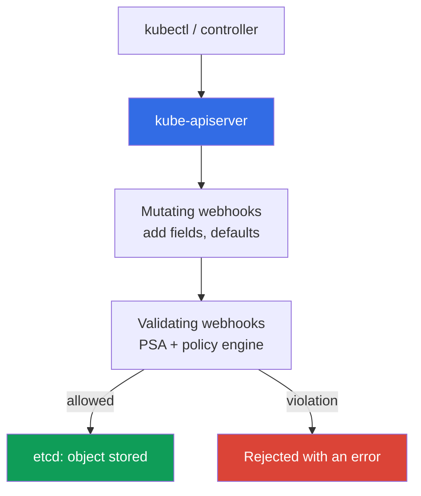
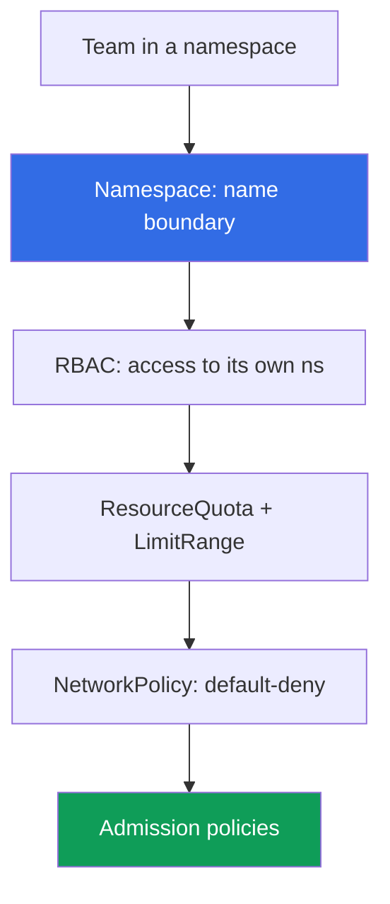

[Русская версия](ru.md) · [Versión en español](es.md) · [Version française](fr.md) · [Deutsche Version](de.md) · [ქართული ვერსია](ge.md) · [繁體中文版](tw.md) · [日本語版](jp.md)
# Chapter 22. Policies and multi-tenancy: Kyverno and Gatekeeper, team isolation

> **What comes next.** Chapter 19 enabled Pod Security Admission (PSA), with three ready-made
> privileged/baseline/restricted levels. They are enough for basic pod hardening, but not for
> custom rules or preventing teams in a cluster from interfering with one another. This chapter
> completes Part 3: policy engines (Kyverno, Gatekeeper) for rules not available in PSA, and
> multi-tenancy within a cluster. Related topics are in other chapters: PSA (chapter 19), image
> signing (chapter 20), RBAC (chapter 5), NetworkPolicy (chapter 30), quotas (chapter 14),
> admission webhooks (chapter 2), and an account as a boundary (chapters 0.1, 32).

## 22.1. “PSA cannot enforce my rules, and teams interfere with each other”

PSA is enabled, restricted is set on production namespaces (chapter 19), and a privileged pod
will not pass. Admission seems to be under control. But then comes a requirement that PSA does
not cover: disallow images outside the organization's ECR. PSA cannot do this: it has three
fixed profiles, and **you cannot add a custom rule** to them. Next come further requirements:
require `owner` and `cost-center` labels on a pod, allow only specific StorageClasses, and reject
`:latest`. None of these can be expressed by baseline/restricted levels. PSA answers “is the pod
secure according to the standard?”, but not “does it comply with **our** rules?”

There is another related pain point: several teams in one cluster interfere with one another:

- **A team deployed a pod without limits and exhausted a node.** A pod without `resources.limits`
  grew in memory, triggered an OOM, and affected neighboring pods. The namespace had no
  ResourceQuota, and one team consumed resources of the entire node (sizing and limits are in
  chapter 14).
- **A team created a LoadBalancer in another team's namespace.** RBAC was granted too broadly,
  and an engineer accidentally deployed a Service of type LoadBalancer into another team's
  namespace, creating an unnecessary NLB and bill.

The first problem is solved by a policy engine: enforce rules that PSA does not provide. The
second is solved by team isolation within the cluster: namespace, quotas, RBAC, network, and the
same admission policies working together.

## 22.2. Admission control as the control point

Before an object reaches etcd, the apiserver passes it through admission controllers (chapter 2).
Two webhook types perform all extensible work:

- **Mutating admission webhook**: called first, it **can change** the object: add a label, set
  default `resources`, or add a sidecar.
- **Validating admission webhook**: called afterward, it **only checks**: allow or reject. It
  cannot change the object.



**A policy engine is an admission webhook**, except you define its rules. It checks and, if
desired, changes objects according to your rules **before they are written to etcd**. PSA is also
an admission controller, but it has fixed profiles: where PSA ends (three levels, nothing
custom), a policy engine begins. In practice, they are **combined**: PSA maintains the pod's
baseline security level, while the engine adds everything else. There is no need to replace PSA
with an engine: they serve different purposes.

Since Kubernetes 1.30, the apiserver has a **built-in** alternative to a webhook:
`ValidatingAdmissionPolicy`. Rules are written in **CEL** (Common Expression Language) directly
in the resource, and validation happens **inside the apiserver, without an external webhook**.
There is no separate engine pod, and thus no network call that can fail to respond and halt
admission (this risk and `failurePolicy` are covered in 22.9). The model has two resources:
`ValidatingAdmissionPolicy` (a CEL rule in `validations`) and
`ValidatingAdmissionPolicyBinding` (what it applies to and the response). Here is the same
`:latest` prohibition as the Kyverno example in 22.3, but without a third-party engine:

```yaml
apiVersion: admissionregistration.k8s.io/v1
kind: ValidatingAdmissionPolicy
metadata:
  name: disallow-latest-tag
spec:
  matchConstraints:
    resourceRules:
      - apiGroups: [""]
        apiVersions: ["v1"]
        operations: ["CREATE", "UPDATE"]
        resources: ["pods"]
  validations:
    - expression: "object.spec.containers.all(c, !c.image.endsWith(':latest'))"
      message: "the :latest tag is prohibited"
---
apiVersion: admissionregistration.k8s.io/v1
kind: ValidatingAdmissionPolicyBinding
metadata:
  name: disallow-latest-tag-binding
spec:
  policyName: disallow-latest-tag
  validationActions: ["Deny"]        # Audit/Warn during rollout -> Deny
```

Built-in validation is well suited to simple checks without mutate/generate; complex logic, image
signing, and resource generation remain the domain of Kyverno/Gatekeeper.

## 22.3. Kyverno: policies as YAML resources

Kyverno is a policy engine in which **a policy is an ordinary Kubernetes YAML resource**, with no
separate language. You write a `ClusterPolicy` (applies to the entire cluster) or `Policy`
(within a namespace), apply it through `kubectl apply`, and inspect it through `kubectl get`.
A policy contains rules, each of one of these types:

- **validate**: check and reject/require (no label: reject).
- **mutate**: add to an object (set a default label or `resources`).
- **generate**: create an accompanying resource (for example, a NetworkPolicy for a new
  namespace).
- **verifyImages**: verify an image signature (the admission step from chapter 20).

`validationFailureAction` defines the response to a violation: `Enforce` means the pod is
**rejected**; `Audit` means the pod is created and the violation is added to a policy report. The
rollout order is the same as for PSA (chapter 19): start with `Audit` to identify violators, then
move to `Enforce`.

A validate example: prohibit the `:latest` tag (a rule requiring `requests`/`limits` is built the
same way, using a `pattern` with `resources`):

```yaml
apiVersion: kyverno.io/v1
kind: ClusterPolicy
metadata:
  name: disallow-latest-tag
spec:
  validationFailureAction: Enforce        # violation -> pod rejected
  rules:
    - name: no-latest
      match:
        any:
          - resources:
              kinds: ["Pod"]
      validate:
        message: "the :latest tag is prohibited; deploy by version or digest"
        pattern:
          spec:
            containers:
              - image: "!*:latest"          # image must not end with :latest
```

Mandatory `requests`/`limits` use the same validate with a `pattern` for `resources` (the `?*`
value means any non-empty value). Allow only the organization's ECR with an image-pattern
validate; verify a signature using a `verifyImages` rule with a trusted key (mechanics are in
chapter 20). This is how the engine addresses precisely the requirements in 22.1 that PSA lacks.

## 22.4. Gatekeeper: policies in Rego

Gatekeeper is a policy engine built on Open Policy Agent (OPA), where rules are written in the
**Rego** language. It consists of two resources:

- **ConstraintTemplate**: a template containing Rego code (a `violation` rule) and a parameter
  schema. Gatekeeper uses it to create a new resource type (CRD).
- **Constraint**: an instance of the template that specifies **what** to apply it to (which kinds)
  and with which parameters.

One “require labels” template can have any number of Constraints with different label sets for
different namespaces. An example of a required label (abbreviated):

```yaml
apiVersion: templates.gatekeeper.sh/v1
kind: ConstraintTemplate
metadata:
  name: k8srequiredlabels
spec:
  crd:
    spec:
      names:
        kind: K8sRequiredLabels
  targets:
    - target: admission.k8s.gatekeeper.sh
      rego: |
        package k8srequiredlabels
        violation[{"msg": msg}] {
          required := input.parameters.labels[_]
          not input.review.object.metadata.labels[required]
          msg := sprintf("missing label: %v", [required])
        }
---
apiVersion: constraints.gatekeeper.sh/v1beta1
kind: K8sRequiredLabels              # type created by the template above
metadata:
  name: pods-must-have-owner
spec:
  match:
    kinds:
      - apiGroups: [""]
        kinds: ["Pod"]
  parameters:
    labels: ["owner", "cost-center"]  # required labels
```

Rego is more powerful than Kyverno's YAML patterns for complex logic, but it has a **higher entry
barrier**: you must learn the language, and it is harder to debug. Use Gatekeeper when you need a
full policy language; Kyverno excels for declarative rules and when mutate/generate are needed
without a separate language.

## 22.5. Kyverno versus Gatekeeper

Both are admission webhooks in the cluster. They differ in language, capabilities, and entry
barrier.

| Property | Kyverno | Gatekeeper (OPA) |
|---|---|---|
| Policy language | Kubernetes YAML resources | Rego |
| Entry barrier | low, familiar syntax | higher, must learn Rego |
| Model | `ClusterPolicy`/`Policy` with rules | `ConstraintTemplate` + `Constraint` |
| mutate (change an object) | yes, built in | limited (mutation is separate) |
| generate (create resources) | yes | no |
| verifyImages (signature) | yes, built in | through a separate integration |
| Language power | patterns + CEL | full Rego, complex logic |
| When to choose | declarative rules, mutate/generate | need a language, complex checks |

The practical choice is one engine per cluster, not both at once (two admission webhooks handling
the same objects make debugging harder). For most EKS teams, Kyverno is easier to start with;
use Gatekeeper when rules outgrow declarative patterns.

## 22.6. What policies check in practice

A policy engine addresses an entire class of requirements that PSA does not provide. A typical
set is:

| Rule | Type | Why |
|---|---|---|
| Prohibit the `:latest` tag | validate | reproducibility, deploy by digest (chapter 20) |
| Mandatory `requests`/`limits` | validate | one team cannot exhaust a node (chapter 14) |
| Only trusted registries (the organization's ECR) | validate | do not pull untrusted images (chapter 20) |
| Mandatory labels/annotations (owner, cost-center) | validate | ownership and cost accounting |
| Prohibit `hostPath`/`privileged` | validate | complements baseline/restricted PSA (chapter 19) |
| Image signature verification | verifyImages | only trusted artifacts (chapter 20) |
| Allowed StorageClasses | validate | do not create a volume on an expensive or unauthorized class (chapter 23) |
| Allowed Service types | validate | do not create an unnecessary LoadBalancer (chapter 26) |
| Set default labels | mutate | consistent accounting without manifest changes |
| Create a NetworkPolicy for a namespace | generate | network is restricted from namespace creation |

The final two rows are mutate and generate: the engine not only prohibits, but also augments an
object and creates resources. Prohibiting `hostPath`/`privileged` overlaps with baseline/restricted
PSA, and that is fine: PSA maintains the standard, while policy adds nuances. Signature and
registry verification are the admission link in the supply-chain sequence from chapter 20: ECR
signed the image, and the engine checks it at entry.

## 22.7. Multi-tenancy within a cluster: soft versus hard

Multi-tenancy means multiple “tenants” (teams, environments, customers) in one infrastructure.
There are two approaches, and the choice between them is fundamental.

- **Soft multi-tenancy**: tenants are in **one cluster**, separated by namespaces and Kubernetes
  mechanisms (RBAC, ResourceQuota, LimitRange, NetworkPolicy, policies). It is inexpensive, but
  the control plane and node kernels are shared.
- **Hard multi-tenancy**: tenants are in **separate clusters or accounts** (chapters 0.1, 32).
  It is more expensive and complex, but the boundary is strong: separate kernel and separate
  control plane.



Isolation in the soft model comes from: a **namespace** as the name boundary and RBAC scope;
**RBAC** (chapter 5), which allows a team into only its own namespace; **ResourceQuota and
LimitRange** (related to sizing, chapter 14), which prevent one team from consuming the cluster;
**NetworkPolicy** (chapter 30), which restricts traffic between namespaces; and **admission
policies**, which enforce required rules.

What soft multi-tenancy **does not provide** is a shared control plane (the apiserver, etcd, and
scheduler are shared by everyone) and shared node kernels (team pods share the Linux kernel; an
escape from a container through a kernel vulnerability crosses the namespace boundary). Namespaces
and RBAC are logical boundaries, not kernel isolation.

The selection rule is: trusted teams in one organization use the soft model in a shared cluster;
hostile or strictly regulated tenants require hard multi-tenancy with separate clusters/accounts
(chapters 0.1, 32).

## 22.8. Specific team isolation measures

Soft multi-tenancy is assembled in layers, with each layer addressing a problem from 22.1. A
namespace per team is the base unit; everything else is applied to it.

**ResourceQuota** limits total namespace consumption so that one team cannot exhaust the cluster:

```yaml
apiVersion: v1
kind: ResourceQuota
metadata:
  name: team-a-quota
  namespace: team-a
spec:
  hard:
    requests.cpu: "10"              # total requests of all pods in the ns
    requests.memory: 20Gi
    limits.memory: 40Gi
    pods: "50"
    services.loadbalancers: "2"     # no more than two LBs in the namespace
```

**LimitRange** sets defaults and bounds for an **individual container** so a pod without explicit
`resources` does not start with unlimited consumption (the problem in 22.1):

```yaml
apiVersion: v1
kind: LimitRange
metadata:
  name: team-a-limits
  namespace: team-a
spec:
  limits:
    - type: Container
      default:                      # limits if not set in the pod
        cpu: "500m"
        memory: 512Mi
      defaultRequest: {cpu: "100m", memory: 128Mi}   # requests if not set
```

Above them, **RBAC** (chapter 5) grants roles only in the team's own namespace, preventing a
LoadBalancer in someone else's namespace; **NetworkPolicy** (chapter 30) with default-deny
restricts traffic between namespaces; and **admission policies** enforce required rules for the
registry, labels, and Service types. When ResourceQuota exists, Kubernetes requires every pod to
have `requests`/`limits`; therefore, a LimitRange with defaults is not a luxury here, but a
condition for pods to be created at all.

## 22.9. How to apply this in production

- **Rule rollout: `Audit`/`Warn` -> `PolicyReport` -> `Enforce`.** Introduce a new policy in
  `Audit` (Kyverno) or with a warning, collect `PolicyReport` from real traffic and identify
  violators, and only then change to `Enforce`; otherwise legitimate deployments will be blocked.
  This is the same path as PSA (chapter 19); for `ValidatingAdmissionPolicyBinding`, these are
  the same `validationActions`: `Audit`/`Warn` -> `Deny`.
- **`failurePolicy`: first `Ignore`, then `Fail`.** The engine webhook is registered with
  `failurePolicy`: with `Fail`, an unavailable webhook **halts admission** and deployments stop;
  with `Ignore`, the object bypasses checking. During rollout, use `Ignore` plus alerts on webhook
  errors and timeouts, and move to `Fail` only after stabilization. Built-in
  `ValidatingAdmissionPolicy` has no such risk because validation occurs inside the apiserver
  (22.2).
- **Policies as code in git.** Keep `ClusterPolicy`/`ConstraintTemplate` in a repository and roll
  them out through GitOps (chapter 44), rather than manually: rule history and review stay in git.
- **PSA for baseline levels plus a policy engine for everything else.** PSA maintains
  baseline/restricted on namespaces (chapter 19), while the engine adds registry, labels, digest,
  and Service types, which PSA lacks.
- **ResourceQuota and LimitRange for every team namespace.** A namespace without a quota is a
  team without a ceiling; apply them when the namespace is created, not after the first incident
  involving an exhausted node.
- **One engine per cluster and regular review.** Kyverno or Gatekeeper, but not both on the same
  objects; review the rule set and limits as loads grow, otherwise an outdated policy blocks
  falsely and an undersized quota slows a team down.

## 22.10. Mini-glossary

- **Admission webhook**: an external handler that the apiserver calls before storing an object in
  etcd; mutating changes the object, while validating only allows or rejects it (chapter 2).
- **Policy engine**: an admission webhook with your rules (Kyverno, Gatekeeper); it checks and,
  if needed, changes objects according to rules before they are written to etcd.
- **Kyverno**: a policy engine in which a policy is a YAML resource (`ClusterPolicy`/`Policy`)
  with validate/mutate/generate/verifyImages rules; its response is `Enforce`/`Audit`.
- **Gatekeeper**: a policy engine built on OPA; rules are written in Rego, with a
  `ConstraintTemplate` (template + schema) plus a `Constraint` (instance) model.
- **ValidatingAdmissionPolicy**: CEL-based validation built into the apiserver (Kubernetes 1.30+),
  without an external webhook; paired with `ValidatingAdmissionPolicyBinding` (what it applies to
  and the `Deny`/`Warn`/`Audit` response).
- **failurePolicy**: the response to an unavailable webhook: `Fail` halts admission, while
  `Ignore` lets the object bypass checking.
- **Soft multi-tenancy**: tenants in one cluster (namespace, RBAC, ResourceQuota, LimitRange,
  NetworkPolicy, policies) with a shared control plane and kernel. **Hard multi-tenancy**: tenants
  in separate clusters/accounts, with a hard boundary at the cost of complexity (chapters 0.1, 32).
- **ResourceQuota / LimitRange**: respectively, a total namespace-consumption limit and defaults/
  bounds for an individual container.

## 22.11. Chapter summary

- PSA (chapter 19) provides three fixed levels and **cannot be extended with custom rules**
  (an external registry, a required label, a StorageClass). A policy engine, an admission webhook
  with your rules, fills this gap.
- Admission control is the control point: a mutating webhook changes an object, a validating
  webhook allows or rejects it, and both run before it is written to etcd. PSA and a policy engine
  are combined rather than used as replacements. Since 1.30, there is also a CEL-based built-in
  `ValidatingAdmissionPolicy`, with validation without an external webhook.
- Kyverno uses YAML policies (`ClusterPolicy`/`Policy`), validate/mutate/generate rules, and
  verifyImages, with an `Enforce`/`Audit` response and a low entry barrier. Gatekeeper uses Rego
  policies with `ConstraintTemplate` plus `Constraint`; it is more powerful and more complex. Use
  one engine per cluster, not both.
- Policies enforce what PSA lacks: prohibiting `:latest`, mandatory `requests`/`limits`, trusted
  registries, mandatory labels, image signatures, and allowed StorageClasses and Services.
- Multi-tenancy inside a cluster is the soft model: namespace, RBAC (chapter 5), ResourceQuota and
  LimitRange (chapter 14), NetworkPolicy (chapter 30), and policies. It does not isolate the
  kernel or control plane; hostile tenants require hard multi-tenancy (separate clusters/accounts,
  chapters 0.1, 32).

## 22.12. How this helps in real work

The requirement “prohibit images outside our ECR,” which PSA cannot answer, is addressed by one
`ClusterPolicy`: the rule is visible in review rather than hidden in a discussion. The incident
“a team exhausted a node with a pod without limits” does not occur where a namespace has a
ResourceQuota and a LimitRange with defaults: a pod without `resources` either receives a default
or is not created. And the choice between soft and hard multi-tenancy is decided by one question:
do you trust tenants with a shared kernel? If not, use a separate cluster or account; it is less
expensive to decide this before rather than after a container escape.

## 22.13. Self-check questions

1. Why does PSA not address the requirement “only images from our ECR,” and what does?
2. How does a mutating webhook differ from a validating one, and in what order does the apiserver call them?
3. Why is a policy engine an admission webhook, and where does PSA end and an engine begin?
4. What rule types does Kyverno have, and how does validate differ from mutate and generate?
5. What does `validationFailureAction: Audit` do versus `Enforce`, and why start with Audit?
6. Which two resources make up a Gatekeeper policy, and what does each contain?
7. In which language are Gatekeeper rules written, and what is its advantage and disadvantage compared with Kyverno?
8. Why use one policy engine per cluster rather than both at once?
9. How does soft multi-tenancy differ from hard multi-tenancy, and what provides isolation in the soft model?
10. What does soft multi-tenancy not provide, and when does this require the hard model?
11. Why does a team namespace need both ResourceQuota and LimitRange, and what does each do?
12. Why does a LimitRange with defaults become necessary when ResourceQuota exists?
13. How does CEL-based built-in `ValidatingAdmissionPolicy` differ from a webhook engine, and how do `failurePolicy: Ignore`/`Fail` affect rollout?

## Practice

The course lab for this topic is [lab 127: policy without an engine,
ValidatingAdmissionPolicy on CEL](../../labs/127/README.MD). In it, you write a CEL rule against
the `:latest` tag, go through the `Audit` -> `Deny` path and see the rejection text from the
apiserver, add a second policy for mandatory `resources.requests`, and find out why the built-in
validation has no risk that “the webhook did not answer”; validate it with the `check_result`
command. Start it with `TASK=127 make run_eks_task`.

The lab does not install Kyverno or Gatekeeper, but comparing their behavior hands-on in a live
cluster is useful. Install one policy engine (Kyverno or Gatekeeper) through Helm and inspect its
resources: `kubectl get clusterpolicy` for Kyverno, `kubectl get constraints` for Gatekeeper.
Apply the `ClusterPolicy` from 22.3 with `validationFailureAction: Audit`, deploy a pod with
`nginx:latest`, and find the violation in the policy report (`kubectl get policyreport -A`).
Change it to `Enforce` and confirm that such a pod is now rejected at admission. Implement the
same prohibition without a third-party engine using the built-in `ValidatingAdmissionPolicy` from
22.2 (`kubectl get validatingadmissionpolicy`), starting with
`validationActions: ["Audit"]`.

Next, isolate a team. Create the `team-a` namespace, apply the ResourceQuota and LimitRange from
22.8, and create a pod without `resources`: it should receive defaults from the LimitRange. Exceed
the quota (`pods` or `requests.cpu`) and confirm that the extra pod is not created: `kubectl
describe resourcequota -n team-a` shows consumption versus the limit. Leave RBAC for chapter 5,
default-deny NetworkPolicy for chapter 30, and image-signature verification for the connection to
chapter 20.

---
[Table of contents](../README.md) · [Chapter 21](../21/en.md) · [Chapter 23](../23/en.md)
