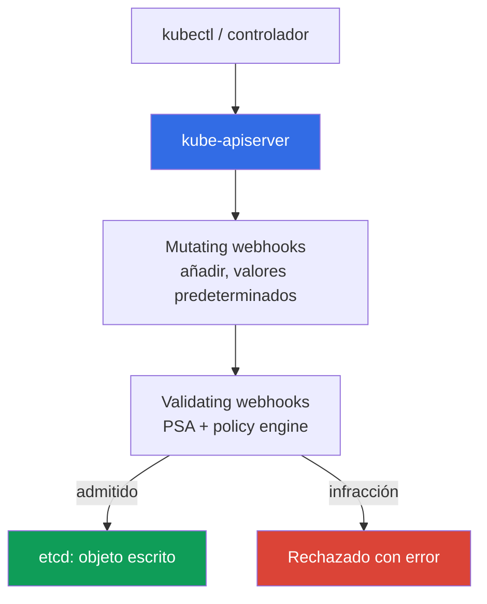
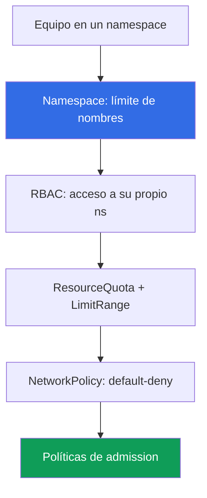

[Русская версия](ru.md) · [Eng version](en.md) · [Version française](fr.md) · [Deutsche Version](de.md) · [ქართული ვერსია](ge.md) · [繁體中文版](tw.md) · [日本語版](jp.md)

# Capítulo 22. Políticas y multitenencia: Kyverno y Gatekeeper, aislamiento de equipos

> **Qué sigue.** El capítulo 19 habilitó Pod Security Admission (PSA), con tres niveles predefinidos: privileged/baseline/restricted. Son suficientes para el hardening básico de pods, pero no para reglas propias ni para evitar que los equipos de un clúster interfieran entre sí. Este capítulo completa la Parte 3: policy engines (Kyverno, Gatekeeper) para reglas que PSA no ofrece, y multitenencia dentro de un clúster. Temas relacionados están en otros capítulos: PSA (capítulo 19), firma de imágenes (capítulo 20), RBAC (capítulo 5), NetworkPolicy (capítulo 30), cuotas (capítulo 14), admission webhooks (capítulo 2) y la cuenta como límite (capítulos 0.1, 32).

## 22.1. «PSA no puede aplicar mis reglas y los equipos interfieren entre sí»

PSA está habilitado y restricted se aplica en los namespace de producción (capítulo 19), por lo que un pod privilegiado no pasará. Parece que admission está bajo control. Pero llega un requisito que PSA no cubre: prohibir imágenes que no procedan del ECR propio. PSA no puede hacerlo: tiene tres perfiles fijos y **no se le pueden añadir reglas propias**. Después hay más: exigir en el pod las labels `owner` y `cost-center`, permitir solo determinadas StorageClass, no permitir `:latest`. Nada de esto se expresa mediante los niveles baseline/restricted. PSA responde a «¿es seguro el pod según el estándar?», pero no a «¿cumple **nuestras** reglas?».

Al lado existe un segundo problema: varios equipos en un clúster se estorban mutuamente:

- **Un equipo desplegó un pod sin límites y agotó el nodo.** Un pod sin `resources.limits` creció en memoria, se activó OOM y los pods vecinos se vieron afectados. El namespace no tenía ResourceQuota, y un equipo consumió los recursos de todo el nodo (sizing y límites, capítulo 14).
- **Un equipo creó un LoadBalancer en el namespace de otro.** Se concedió RBAC de forma demasiado amplia; por error, un ingeniero desplegó un Service de tipo LoadBalancer en el namespace de otro equipo, se levantó un NLB adicional y llegó la factura.

El primer problema se resuelve con un policy engine: imponer reglas que no están en PSA. El segundo, con el aislamiento de equipos dentro del clúster: namespace, cuotas, RBAC, red y las mismas políticas de admission trabajando conjuntamente.

## 22.2. Admission control como punto de control

Antes de que un objeto llegue a etcd, el apiserver lo hace pasar por admission controllers (capítulo 2). Dos tipos de webhook realizan todo el trabajo extensible:

- **Mutating admission webhook**: se invoca primero y **puede modificar** el objeto: añadir una label, establecer `resources` predeterminados o agregar un sidecar.
- **Validating admission webhook**: se invoca después y **solo valida**: permite o rechaza. No puede modificar el objeto.



**Un policy engine es un admission webhook**, pero las reglas las define usted. Valida y, si se desea, modifica objetos según sus reglas **antes de escribirlos en etcd**. PSA también es un admission controller, pero con perfiles fijos: donde termina PSA (tres niveles, sin reglas propias), comienza el policy engine. En la práctica se **combinan**: PSA mantiene el nivel básico del pod y el motor añade el resto. No es necesario sustituir PSA por un motor: son tareas distintas.

Desde Kubernetes 1.30, el apiserver dispone de una alternativa **integrada** al webhook: `ValidatingAdmissionPolicy`. Las reglas se escriben en **CEL** (Common Expression Language) directamente en el recurso y la validación se realiza **dentro del apiserver, sin un webhook externo**. No hay un pod de motor separado, por lo que tampoco hay una llamada de red que pueda no responder y detener admission (sobre este riesgo y `failurePolicy`, consulte 22.9). El modelo usa dos recursos: `ValidatingAdmissionPolicy` (la regla en CEL dentro de `validations`) y `ValidatingAdmissionPolicyBinding` (a qué aplicar y la reacción). La misma prohibición de `:latest` que con Kyverno en 22.3, pero sin un motor externo:

```yaml
apiVersion: admissionregistration.k8s.io/v1
kind: ValidatingAdmissionPolicy
metadata:
  name: disallow-latest-tag
spec:
  matchConstraints:
    resourceRules:
      - apiGroups: [""]
        apiVersions: ["v1"]
        operations: ["CREATE", "UPDATE"]
        resources: ["pods"]
  validations:
    - expression: "object.spec.containers.all(c, !c.image.endsWith(':latest'))"
      message: "la etiqueta :latest está prohibida"
---
apiVersion: admissionregistration.k8s.io/v1
kind: ValidatingAdmissionPolicyBinding
metadata:
  name: disallow-latest-tag-binding
spec:
  policyName: disallow-latest-tag
  validationActions: ["Deny"]        # Audit/Warn durante el despliegue -> Deny
```

La validación integrada es adecuada para comprobaciones simples sin mutate/generate; la lógica compleja, la firma de imágenes y la generación de recursos se dejan a Kyverno/Gatekeeper.

## 22.3. Kyverno: políticas como recursos YAML

Kyverno es un policy engine en el que **una política es un recurso YAML normal de Kubernetes**, sin un lenguaje aparte. Se escribe `ClusterPolicy` (actúa en todo el clúster) o `Policy` (dentro de un namespace), se aplica mediante `kubectl apply` y se consulta con `kubectl get`. Dentro de la política hay reglas, y cada regla es de uno de estos tipos:

- **validate**: validar y prohibir/exigir (si falta una label, rechazar).
- **mutate**: añadir contenido al objeto (establecer una label o `resources` predeterminados).
- **generate**: crear un recurso asociado (por ejemplo, NetworkPolicy para un namespace nuevo).
- **verifyImages**: verificar la firma de una imagen (el paso del capítulo 20 durante admission).

La reacción ante una infracción se establece mediante `validationFailureAction`: `Enforce` hace que el pod sea **rechazado**; `Audit` permite crear el pod y registra la infracción en un policy report. El orden de implantación es igual que con PSA (capítulo 19): primero `Audit`, para ver las infracciones, y después `Enforce`.

Ejemplo de validate: prohibir la etiqueta `:latest` (una regla para exigir `requests`/`limits` se construye igual, con `pattern` y `resources`):

```yaml
apiVersion: kyverno.io/v1
kind: ClusterPolicy
metadata:
  name: disallow-latest-tag
spec:
  validationFailureAction: Enforce        # infracción -> pod rechazado
  rules:
    - name: no-latest
      match:
        any:
          - resources:
              kinds: ["Pod"]
      validate:
        message: "la etiqueta :latest está prohibida; despliegue por versión o digest"
        pattern:
          spec:
            containers:
              - image: "!*:latest"          # la imagen no debe terminar en :latest
```

`requests`/`limits` obligatorios se implementan con el mismo validate y un `pattern` sobre `resources` (el valor `?*` significa cualquier valor no vacío). Permitir solo el ECR propio requiere validate sobre el patrón de imagen; comprobar la firma requiere una regla `verifyImages` con una clave de confianza (mecánica en el capítulo 20). Así, el motor cubre exactamente los requisitos de 22.1 que PSA no ofrece.

## 22.4. Gatekeeper: políticas en Rego

Gatekeeper es un policy engine sobre Open Policy Agent (OPA), donde las reglas se escriben en el lenguaje **Rego**. Se compone de dos recursos:

- **ConstraintTemplate**: una plantilla que incluye código Rego (la regla `violation`) y el esquema de parámetros. A partir de ella, Gatekeeper crea un nuevo tipo de recurso (CRD).
- **Constraint**: una instancia de la plantilla que indica **a qué** aplicar (qué kinds) y con qué parámetros.

Una plantilla para «exigir labels» permite tantos Constraint como se necesiten con conjuntos de labels distintos para diferentes namespace. Ejemplo: label obligatoria (abreviado):

```yaml
apiVersion: templates.gatekeeper.sh/v1
kind: ConstraintTemplate
metadata:
  name: k8srequiredlabels
spec:
  crd:
    spec:
      names:
        kind: K8sRequiredLabels
  targets:
    - target: admission.k8s.gatekeeper.sh
      rego: |
        package k8srequiredlabels
        violation[{"msg": msg}] {
          required := input.parameters.labels[_]
          not input.review.object.metadata.labels[required]
          msg := sprintf("missing label: %v", [required])
        }
---
apiVersion: constraints.gatekeeper.sh/v1beta1
kind: K8sRequiredLabels              # tipo creado por la plantilla anterior
metadata:
  name: pods-must-have-owner
spec:
  match:
    kinds:
      - apiGroups: [""]
        kinds: ["Pod"]
  parameters:
    labels: ["owner", "cost-center"]  # labels obligatorias
```

Rego es más potente que las plantillas YAML de Kyverno para lógica compleja, pero tiene una **barrera de entrada mayor**: hay que aprender el lenguaje y resulta más difícil de depurar. Gatekeeper se usa cuando se necesita un lenguaje de políticas completo; Kyverno destaca con reglas declarativas y cuando se requieren mutate/generate sin un lenguaje separado.

## 22.5. Kyverno frente a Gatekeeper

Ambos son admission webhooks del clúster. La diferencia está en el lenguaje, las capacidades y la barrera de entrada.

| Propiedad | Kyverno | Gatekeeper (OPA) |
|---|---|---|
| Lenguaje de políticas | Recursos YAML de Kubernetes | Rego |
| Barrera de entrada | baja, sintaxis conocida | más alta, hay que aprender Rego |
| Modelo | `ClusterPolicy`/`Policy` con reglas | `ConstraintTemplate` + `Constraint` |
| mutate (modificar un objeto) | sí, de forma nativa | limitado (mutation por separado) |
| generate (crear recursos) | sí | no |
| verifyImages (firma) | sí, integrado | mediante integración separada |
| Potencia del lenguaje | plantillas + CEL | Rego completo, lógica compleja |
| Cuándo elegirlo | reglas declarativas, mutate/generate | se necesita un lenguaje, comprobaciones complejas |

Elección práctica: un motor por clúster, no ambos a la vez (dos admission webhooks sobre los mismos objetos complican la depuración). Para la mayoría de los equipos de EKS, Kyverno es más sencillo al comenzar; Gatekeeper se adopta cuando las reglas superan las plantillas declarativas.

## 22.6. Qué se comprueba con políticas en la práctica

Un policy engine cubre toda una clase de requisitos que PSA no incluye. Conjunto típico:

| Regla | Tipo | Motivo |
|---|---|---|
| Prohibir la etiqueta `:latest` | validate | reproducibilidad, despliegue por digest (capítulo 20) |
| `requests`/`limits` obligatorios | validate | evitar que un equipo agote el nodo (capítulo 14) |
| Solo registros de confianza (ECR propio) | validate | no descargar imágenes ajenas (capítulo 20) |
| Labels/anotaciones obligatorias (owner, cost-center) | validate | propietario y control de costes |
| Prohibir `hostPath`/`privileged` | validate | complementa PSA baseline/restricted (capítulo 19) |
| Verificación de firma de imagen | verifyImages | solo artefacto de confianza (capítulo 20) |
| StorageClass permitidas | validate | no crear un volumen en una clase cara o ajena (capítulo 23) |
| Tipos de Service permitidos | validate | no levantar un LoadBalancer adicional (capítulo 26) |
| Establecer labels predeterminadas | mutate | control unificado sin editar manifiestos |
| Crear NetworkPolicy para un namespace | generate | red cerrada desde el nacimiento del namespace (capítulo 30) |

Las dos últimas filas son mutate y generate: el motor no solo prohíbe, sino que añade contenido al objeto y crea recursos. La prohibición de `hostPath`/`privileged` se solapa con PSA baseline/restricted, y eso es normal: PSA mantiene el estándar y la política añade matices. La verificación de firmas y registros es el eslabón de admission en la cadena de supply chain del capítulo 20: ECR firmó y el motor verifica en la entrada.

## 22.7. Multitenencia dentro del clúster: soft frente a hard

La multitenencia consiste en varios «inquilinos» (equipos, entornos, clientes) en una misma infraestructura. Hay dos enfoques, y la elección entre ellos es fundamental.

- **Soft multi-tenancy**: los inquilinos están en **un mismo clúster**, separados por namespace y mecanismos de Kubernetes (RBAC, ResourceQuota, LimitRange, NetworkPolicy, políticas). Es más económico, pero el control plane y el kernel de los nodos son compartidos.
- **Hard multi-tenancy**: los inquilinos están en **clústeres o cuentas separados** (capítulos 0.1, 32). Es más costoso y complejo, pero el límite es rígido: kernel y control plane propios.



Qué proporciona aislamiento en el modelo soft: **namespace** como límite de nombres y ámbito de RBAC; **RBAC** (capítulo 5) permite al equipo acceder solo a su namespace; **ResourceQuota y LimitRange** (relación con sizing, capítulo 14) evitan que un equipo agote el clúster; **NetworkPolicy** (capítulo 30) restringe el tráfico entre namespace; las **políticas de admission** imponen reglas obligatorias.

Qué **no proporciona** soft multi-tenancy: un control plane compartido (apiserver, etcd y scheduler son comunes para todos) y un kernel de nodos compartido (los pods de los equipos comparten el kernel de Linux; escapar de un contenedor mediante una vulnerabilidad del kernel atraviesa el límite del namespace). namespace y RBAC son límites lógicos, no aislamiento del kernel.

Regla de elección: equipos de confianza de una misma organización, modelo soft en un clúster compartido; inquilinos hostiles o estrictamente regulados, hard en clústeres/cuentas separados (capítulos 0.1, 32).

## 22.8. Aislamiento concreto de equipos

Soft multi-tenancy se compone de capas, y cada una resuelve un problema de 22.1. Un namespace por equipo es la unidad básica; sobre él se añade el resto.

**ResourceQuota** limita el consumo total del namespace para que un equipo no agote el clúster:

```yaml
apiVersion: v1
kind: ResourceQuota
metadata:
  name: team-a-quota
  namespace: team-a
spec:
  hard:
    requests.cpu: "10"              # requests totales de todos los pods del ns
    requests.memory: 20Gi
    limits.memory: 40Gi
    pods: "50"
    services.loadbalancers: "2"     # no más de dos LB en el namespace
```

**LimitRange** establece valores predeterminados y límites para **cada contenedor individual**, para que un pod sin `resources` explícitos no arranque sin límites (el problema de 22.1):

```yaml
apiVersion: v1
kind: LimitRange
metadata:
  name: team-a-limits
  namespace: team-a
spec:
  limits:
    - type: Container
      default:                      # limits si no se establecen en el pod
        cpu: "500m"
        memory: 512Mi
      defaultRequest: {cpu: "100m", memory: 128Mi}   # requests si no se establecen
```

Por encima: **RBAC** (capítulo 5) concede roles solo en el namespace propio, por lo que no se puede crear un LoadBalancer en el de otro; **NetworkPolicy** (capítulo 30) con default-deny restringe el tráfico entre ns; las **políticas de admission** imponen reglas obligatorias: registro, labels y tipos de Service. Con ResourceQuota, Kubernetes exige que cada pod tenga `requests`/`limits`; por eso LimitRange con valores predeterminados no es un lujo aquí, sino una condición para que los pods lleguen a crearse.

## 22.9. Cómo se aplica en producción

- **Despliegue de una regla: `Audit`/`Warn` -> `PolicyReport` -> `Enforce`.** Una política nueva se introduce en `Audit` (Kyverno) o con una advertencia, se recopila `PolicyReport` del tráfico real y se identifican infractores; solo después se pasa a `Enforce`, o se bloquean despliegues legítimos. Es el mismo camino que con PSA (capítulo 19); para `ValidatingAdmissionPolicyBinding` son las mismas `validationActions`: `Audit`/`Warn` -> `Deny`.
- **`failurePolicy`: primero `Ignore`, luego `Fail`.** El webhook del motor se registra con `failurePolicy`: con `Fail`, un webhook no disponible **detiene admission** y los despliegues se paralizan; con `Ignore`, el objeto pasa sin verificación. Durante el despliegue se usa `Ignore` más una alerta por errores y timeouts del webhook, y se cambia a `Fail` solo tras estabilizarlo. `ValidatingAdmissionPolicy` integrado no tiene este riesgo: la comprobación se realiza dentro del apiserver (22.2).
- **Políticas como código en git.** `ClusterPolicy`/`ConstraintTemplate` se guardan en el repositorio y se despliegan mediante GitOps (capítulo 44), no manualmente: el historial y la revisión de reglas están en git.
- **PSA para niveles básicos más policy engine para el resto.** PSA mantiene baseline/restricted en el namespace (capítulo 19), y el motor añade registro, labels, digest y tipos de Service: lo que PSA no ofrece.
- **ResourceQuota y LimitRange en cada namespace de equipo.** Un namespace sin cuota es un equipo sin techo; se configuran al crear el namespace, no después del primer incidente de un nodo agotado.
- **Un motor por clúster y revisión periódica.** Kyverno o Gatekeeper, pero no ambos sobre los mismos objetos; el conjunto de reglas y los límites se revisan a medida que crecen las cargas, o una política obsoleta bloquea falsamente y una cuota demasiado baja frena al equipo.

## 22.10. Mini glosario

- **Admission webhook**: procesador externo que el apiserver llama antes de escribir un objeto en etcd; mutating modifica el objeto y validating solo lo permite o rechaza (capítulo 2).
- **Policy engine**: admission webhook con sus reglas (Kyverno, Gatekeeper); valida y, si hace falta, modifica objetos según las reglas antes de escribirlos en etcd.
- **Kyverno**: policy engine en el que una política es un recurso YAML (`ClusterPolicy`/`Policy`) con reglas validate/mutate/generate/verifyImages; la reacción es `Enforce`/`Audit`.
- **Gatekeeper**: policy engine sobre OPA; reglas en Rego, modelo `ConstraintTemplate` (plantilla + esquema) más `Constraint` (instancia).
- **ValidatingAdmissionPolicy**: validación integrada en el apiserver con CEL (Kubernetes 1.30+), sin webhook externo; se combina con `ValidatingAdmissionPolicyBinding` (a qué aplicar y reacción `Deny`/`Warn`/`Audit`).
- **failurePolicy**: reacción ante un webhook no disponible: `Fail` detiene admission e `Ignore` permite que el objeto pase sin comprobación.
- **Soft multi-tenancy**: inquilinos en un clúster (namespace, RBAC, ResourceQuota, LimitRange, NetworkPolicy, políticas); control plane y kernel compartidos. **Hard multi-tenancy**: inquilinos en clústeres/cuentas separados; límite rígido a costa de complejidad (capítulos 0.1, 32).
- **ResourceQuota / LimitRange**: límite de consumo total del namespace y valores predeterminados/límites para un contenedor individual, respectivamente.

## 22.11. Resumen del capítulo

- PSA (capítulo 19) proporciona tres niveles fijos y **no se amplía con reglas propias** (registro ajeno, label obligatoria, StorageClass). Esto lo cubre un policy engine: un admission webhook con sus reglas.
- Admission control es el punto de control: un mutating webhook modifica el objeto, validating lo permite o rechaza, ambos antes de escribir en etcd. PSA y policy engine se combinan, no se sustituyen. Desde 1.30 también existe `ValidatingAdmissionPolicy` integrado con CEL: validación sin webhook externo.
- Kyverno son políticas como YAML (`ClusterPolicy`/`Policy`), reglas validate/mutate/generate y verifyImages, reacción `Enforce`/`Audit`, y una barrera de entrada baja. Gatekeeper son políticas en Rego, `ConstraintTemplate` más `Constraint`; es más potente y más complejo. Un motor por clúster, no ambos.
- Con políticas se imponen requisitos que PSA no ofrece: prohibición de `:latest`, `requests`/`limits` obligatorios, registros de confianza, labels obligatorias, firma de imágenes, StorageClass y Service permitidos.
- La multitenencia dentro del clúster es el modelo soft: namespace, RBAC (capítulo 5), ResourceQuota y LimitRange (capítulo 14), NetworkPolicy (capítulo 30), políticas. No proporciona aislamiento del kernel ni del control plane; para inquilinos hostiles se necesita hard (clústeres/cuentas separados, capítulos 0.1, 32).

## 22.12. Cómo será útil en el trabajo real

El requisito «prohibir imágenes que no procedan de nuestro ECR», al que PSA no puede responder, se resuelve con una `ClusterPolicy`: en la revisión se ve la regla, no una conversación. El incidente «un equipo agotó el nodo con un pod sin límites» no ocurre donde el namespace tiene ResourceQuota y LimitRange con valores predeterminados: un pod sin `resources` recibe un valor predeterminado o no se crea. La elección entre soft y hard multi-tenancy se resuelve con una pregunta: ¿confía en que los inquilinos compartan el kernel? Si no, se necesita un clúster o cuenta independientes, y es más barato decidirlo antes, no después de escapar de un contenedor.

## 22.13. Preguntas de autoevaluación

1. ¿Por qué PSA no cubre el requisito «solo imágenes del ECR propio» y qué lo cubre?
2. ¿En qué se diferencia un mutating webhook de validating y en qué orden los llama el apiserver?
3. ¿Por qué un policy engine es un admission webhook y dónde termina PSA y empieza el motor?
4. ¿Qué tipos de reglas tiene Kyverno y en qué se diferencia validate de mutate y generate?
5. ¿Qué hace `validationFailureAction: Audit` frente a `Enforce` y por qué se empieza con Audit?
6. ¿De qué dos recursos se compone una política de Gatekeeper y qué contiene cada uno?
7. ¿En qué lenguaje se escriben las reglas de Gatekeeper y cuál es su ventaja y desventaja frente a Kyverno?
8. ¿Por qué se elige un policy engine por clúster en lugar de ambos a la vez?
9. ¿En qué se diferencia soft multi-tenancy de hard y qué proporciona aislamiento en el modelo soft?
10. ¿Qué no proporciona soft multi-tenancy y cuándo se necesita hard por ello?
11. ¿Por qué un namespace de equipo necesita tanto ResourceQuota como LimitRange y qué hace cada uno?
12. ¿Por qué, con ResourceQuota, LimitRange con valores predeterminados pasa a ser obligatorio?
13. ¿En qué se diferencia `ValidatingAdmissionPolicy` integrado con CEL de un motor webhook y qué relación tiene con `failurePolicy: Ignore`/`Fail` durante el despliegue?

## Práctica

El laboratorio del curso para este tema: [laboratorio 127: políticas sin motor, ValidatingAdmissionPolicy con CEL](../../labs/127/README_ES.MD). En él escribe una regla CEL contra la etiqueta `:latest`, recorre el proceso `Audit` -> `Deny` y ve el texto de rechazo del apiserver; añade una segunda política para `resources.requests` obligatorios y entiende por qué la validación integrada no tiene el riesgo de que «el webhook no responda»; la comprobación se realiza con el comando `check_result`. Ejecución: `TASK=127 make run_eks_task`.

El laboratorio no instala Kyverno ni Gatekeeper, pero es útil comparar manualmente su comportamiento en un clúster activo. Instale un policy engine (Kyverno o Gatekeeper) mediante Helm y consulte los recursos: `kubectl get clusterpolicy` para Kyverno, `kubectl get constraints` para Gatekeeper. Aplique la `ClusterPolicy` de 22.3 con `validationFailureAction: Audit`, despliegue un pod con `nginx:latest` y encuentre la infracción en el policy report (`kubectl get policyreport -A`). Cambie a `Enforce` y compruebe que ese pod ahora se rechaza durante admission. Cree la misma prohibición sin un motor externo con `ValidatingAdmissionPolicy` integrado de 22.2 (`kubectl get validatingadmissionpolicy`), comenzando con `validationActions: ["Audit"]`.

Después, el aislamiento del equipo. Cree el namespace `team-a`, aplique ResourceQuota y LimitRange de 22.8 y cree un pod sin `resources`: debe recibir los valores predeterminados de LimitRange. Supere la cuota (`pods` o `requests.cpu`) y compruebe que no se crea el pod adicional: `kubectl describe resourcequota -n team-a` mostrará el uso frente al límite. Deje RBAC para el capítulo 5, NetworkPolicy default-deny para el capítulo 30 y la verificación de la firma de imágenes para la relación con el capítulo 20.

---
[Índice](../README_ES.md) · [Capítulo 21](../21/es.md) · [Capítulo 23](../23/es.md)
