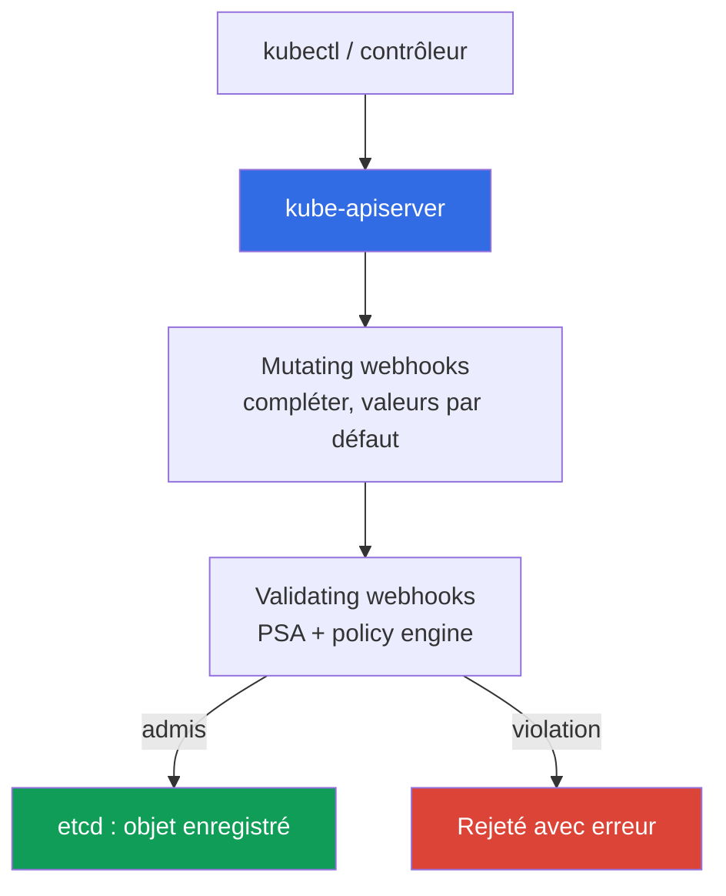
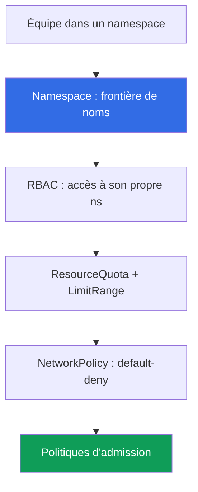

[Русская версия](ru.md) · [Eng version](en.md) · [Versión en español](es.md) · [Deutsche Version](de.md) · [ქართული ვერსია](ge.md) · [繁體中文版](tw.md) · [日本語版](jp.md)
# Chapitre 22. Politiques et multi-tenancy : Kyverno et Gatekeeper, isolation des équipes

> **La suite.** Le chapitre 19 a activé Pod Security Admission (PSA), avec trois niveaux prêts à l'emploi :
> privileged/baseline/restricted. Ils suffisent pour le durcissement de base d'un pod, mais pas pour vos propres
> règles ni pour empêcher les équipes d'interférer entre elles dans le cluster. Ce chapitre conclut la partie 3 :
> les policy engines (Kyverno, Gatekeeper) pour les règles absentes de PSA, et la multi-tenancy au sein du
> cluster. Les sujets connexes sont traités dans d'autres chapitres : PSA (chapitre 19), signature d'image
> (chapitre 20), RBAC (chapitre 5), NetworkPolicy (chapitre 30), quotas (chapitre 14), admission webhooks
> (chapitre 2), compte comme frontière (chapitres 0.1, 32).

## 22.1. « PSA ne sait pas appliquer mes règles, et les équipes se gênent mutuellement »

PSA est activé, restricted est défini sur les namespaces de production (chapitre 19), un pod privilégié ne
passera pas. Il semble que l'admission soit sous contrôle. Mais une exigence arrive, que PSA ne couvre pas :
interdire les images qui ne viennent pas de son propre ECR. PSA ne sait pas le faire : il a trois profils fixes,
et **il est impossible d'y ajouter sa propre règle**. Puis viennent d'autres exigences : imposer les labels
`owner` et `cost-center` sur un pod, n'autoriser que certaines StorageClass, ne pas laisser passer `:latest`.
Aucun de ces éléments ne s'exprime par les niveaux baseline/restricted. PSA répond à « le pod est-il sûr selon
le standard ? », mais non à « respecte-t-il **nos** règles ? ».

Une seconde difficulté existe à côté : plusieurs équipes dans un même cluster se marchent sur les pieds :

- **Une équipe a déployé un pod sans limites et a épuisé le nœud.** Un pod sans `resources.limits` a augmenté
  sa consommation mémoire, un OOM s'est déclenché, les pods voisins ont été affectés. Le namespace n'avait pas
  de ResourceQuota, et une équipe a capté les ressources de tout le nœud (dimensionnement et limites :
  chapitre 14).
- **Une équipe a créé un LoadBalancer dans le namespace d'une autre.** RBAC avait été accordé trop largement,
  un ingénieur a déployé par erreur un Service de type LoadBalancer dans le namespace d'une autre équipe, un NLB
  superflu a été créé, ainsi que la facture.

La première difficulté se traite avec un policy engine : imposer des règles absentes de PSA. La seconde, par
l'isolation des équipes à l'intérieur du cluster : namespace, quotas, RBAC, réseau et ces mêmes politiques
d'admission réunis.

## 22.2. Admission control comme point de contrôle

Avant qu'un objet arrive dans etcd, l'apiserver le fait passer par les contrôleurs d'admission (chapitre 2).
Deux types de webhooks effectuent tout le travail extensible :

- **Mutating admission webhook** : appelé en premier, il **peut modifier** l'objet : ajouter un label, définir
  des `resources` par défaut, ajouter un sidecar.
- **Validating admission webhook** : appelé ensuite, il **vérifie seulement** : autoriser ou rejeter. Il ne peut
  pas modifier l'objet.



**Un policy engine est précisément un admission webhook**, mais c'est vous qui lui définissez les règles. Il
vérifie et, si nécessaire, modifie les objets selon vos règles **avant leur écriture dans etcd**. PSA est aussi
un contrôleur d'admission, mais avec des profils fixes : là où PSA s'arrête (trois niveaux, aucune règle
personnalisée), le policy engine commence. En pratique, ils sont **combinés** : PSA maintient le niveau de base
du pod, le moteur ajoute le reste. Il ne faut pas remplacer PSA par un moteur : leurs rôles sont différents.

Depuis Kubernetes 1.30, l'apiserver possède une alternative **intégrée** au webhook :
`ValidatingAdmissionPolicy`. Les règles sont écrites en **CEL** (Common Expression Language) directement dans
la ressource, et la vérification s'exécute **dans l'apiserver, sans webhook externe**. Il n'y a pas de pod de
moteur séparé, donc pas d'appel réseau qui puisse ne pas répondre et bloquer l'admission (ce risque et
`failurePolicy` sont traités en 22.9). Le modèle repose sur deux ressources :
`ValidatingAdmissionPolicy` (règle CEL dans `validations`) et `ValidatingAdmissionPolicyBinding` (ce à quoi
l'appliquer et réaction). Voici la même interdiction de `:latest` que dans Kyverno en 22.3, mais sans moteur
tiers :

```yaml
apiVersion: admissionregistration.k8s.io/v1
kind: ValidatingAdmissionPolicy
metadata:
  name: disallow-latest-tag
spec:
  matchConstraints:
    resourceRules:
      - apiGroups: [""]
        apiVersions: ["v1"]
        operations: ["CREATE", "UPDATE"]
        resources: ["pods"]
  validations:
    - expression: "object.spec.containers.all(c, !c.image.endsWith(':latest'))"
      message: "le tag :latest est interdit"
---
apiVersion: admissionregistration.k8s.io/v1
kind: ValidatingAdmissionPolicyBinding
metadata:
  name: disallow-latest-tag-binding
spec:
  policyName: disallow-latest-tag
  validationActions: ["Deny"]        # Audit/Warn lors du déploiement -> Deny
```

La validation intégrée convient aux contrôles simples sans mutate/generate ; la logique complexe, la signature
d'image et la génération de ressources restent du ressort de Kyverno/Gatekeeper.

## 22.3. Kyverno : les politiques sous forme de ressources YAML

Kyverno est un policy engine où **une politique est une ressource YAML Kubernetes ordinaire**, sans langage
séparé. Vous écrivez une `ClusterPolicy` (pour tout le cluster) ou une `Policy` (dans un namespace), l'appliquez
avec `kubectl apply`, la consultez avec `kubectl get`. À l'intérieur d'une politique se trouvent des règles, et
chacune est de l'un des types suivants :

- **validate** : vérifier et interdire/imposer (pas de label : rejeter).
- **mutate** : ajouter des éléments à l'objet (définir un label ou des `resources` par défaut).
- **generate** : créer une ressource associée (par exemple une NetworkPolicy pour un nouveau namespace).
- **verifyImages** : vérifier la signature d'une image (l'étape du chapitre 20 à l'admission).

La réaction à une violation est définie par `validationFailureAction` : `Enforce` signifie que le pod est
**rejeté** ; `Audit` signifie que le pod est créé et que la violation apparaît dans le policy report. L'ordre de
déploiement est le même qu'avec PSA (chapitre 19) : commencez par `Audit` pour voir les contrevenants, puis
passez à `Enforce`.

Exemple de validate : interdire le tag `:latest` (une règle qui impose `requests`/`limits` se construit de la
même manière, par `pattern` avec `resources`) :

```yaml
apiVersion: kyverno.io/v1
kind: ClusterPolicy
metadata:
  name: disallow-latest-tag
spec:
  validationFailureAction: Enforce        # violation -> pod rejeté
  rules:
    - name: no-latest
      match:
        any:
          - resources:
              kinds: ["Pod"]
      validate:
        message: "le tag :latest est interdit, déployez par version ou digest"
        pattern:
          spec:
            containers:
              - image: "!*:latest"          # l'image ne doit pas finir par :latest
```

Les `requests`/`limits` obligatoires correspondent au même validate avec un `pattern` sur `resources` (la
valeur `?*` signifie toute valeur non vide). N'autoriser que son propre ECR revient à faire un validate sur le
modèle d'image ; vérifier la signature revient à employer une règle `verifyImages` avec une clé de confiance
(mécanique : chapitre 20). Ainsi, le moteur couvre exactement les exigences de 22.1 absentes de PSA.

## 22.4. Gatekeeper : les politiques en Rego

Gatekeeper est un policy engine basé sur Open Policy Agent (OPA), où les règles s'écrivent dans le langage
**Rego**. Il est constitué de deux ressources :

- **ConstraintTemplate** : le modèle porte le code Rego (règle `violation`) et le schéma des paramètres. À
  partir de lui, Gatekeeper crée un nouveau type de ressource (CRD).
- **Constraint** : une instance du modèle, qui indique **à quoi** l'appliquer (quels kinds) et avec quels
  paramètres.

Un modèle « imposer des labels » permet autant de Constraint que souhaité, avec des ensembles de labels
différents selon les namespaces. Exemple d'un label obligatoire (version abrégée) :

```yaml
apiVersion: templates.gatekeeper.sh/v1
kind: ConstraintTemplate
metadata:
  name: k8srequiredlabels
spec:
  crd:
    spec:
      names:
        kind: K8sRequiredLabels
  targets:
    - target: admission.k8s.gatekeeper.sh
      rego: |
        package k8srequiredlabels
        violation[{"msg": msg}] {
          required := input.parameters.labels[_]
          not input.review.object.metadata.labels[required]
          msg := sprintf("missing label: %v", [required])
        }
---
apiVersion: constraints.gatekeeper.sh/v1beta1
kind: K8sRequiredLabels              # type créé par le modèle ci-dessus
metadata:
  name: pods-must-have-owner
spec:
  match:
    kinds:
      - apiGroups: [""]
        kinds: ["Pod"]
  parameters:
    labels: ["owner", "cost-center"]  # labels obligatoires
```

Rego est plus puissant que les modèles YAML de Kyverno pour une logique complexe, mais son **seuil d'entrée
est plus élevé** : il faut apprendre le langage et le débogage est plus difficile. Gatekeeper est choisi quand
un langage de politiques complet est nécessaire ; Kyverno est préférable pour les règles déclaratives et quand
mutate/generate sont requis sans langage séparé.

## 22.5. Kyverno contre Gatekeeper

Les deux sont des admission webhooks dans le cluster. Ils diffèrent par le langage, les possibilités et le
seuil d'entrée.

| Propriété | Kyverno | Gatekeeper (OPA) |
|---|---|---|
| Langage des politiques | Ressources YAML Kubernetes | Rego |
| Seuil d'entrée | faible, syntaxe connue | plus élevé, Rego à apprendre |
| Modèle | `ClusterPolicy`/`Policy` avec règles | `ConstraintTemplate` + `Constraint` |
| mutate (modifier l'objet) | oui, nativement | limité (mutation séparée) |
| generate (créer des ressources) | oui | non |
| verifyImages (signature) | oui, intégré | par une intégration séparée |
| Puissance du langage | modèles + CEL | Rego complet, logique complexe |
| Quand le choisir | règles déclaratives, mutate/generate | besoin d'un langage, contrôles complexes |

Le choix pratique : un seul moteur par cluster, pas les deux à la fois (deux admission webhooks sur les mêmes
objets compliquent le débogage). Pour la plupart des équipes EKS, Kyverno est plus simple au début ; Gatekeeper
est choisi lorsque les règles dépassent les modèles déclaratifs.

## 22.6. Ce qui est vérifié par les politiques en pratique

Un policy engine couvre toute une classe d'exigences absentes de PSA. Ensemble type :

| Règle | Type | Pourquoi |
|---|---|---|
| Interdire le tag `:latest` | validate | reproductibilité, déploiement par digest (chapitre 20) |
| `requests`/`limits` obligatoires | validate | une équipe ne peut pas épuiser le nœud (chapitre 14) |
| Registres de confiance uniquement (son propre ECR) | validate | ne pas tirer d'images tierces (chapitre 20) |
| Labels/annotations obligatoires (owner, cost-center) | validate | propriétaire et suivi des coûts |
| Interdire `hostPath`/`privileged` | validate | complète PSA baseline/restricted (chapitre 19) |
| Vérifier la signature de l'image | verifyImages | artefact de confiance uniquement (chapitre 20) |
| StorageClass autorisées | validate | ne pas créer de volume sur une classe coûteuse ou étrangère (chapitre 23) |
| Types de Service autorisés | validate | ne pas créer un LoadBalancer superflu (chapitre 26) |
| Définir les labels par défaut | mutate | suivi uniforme sans modifier les manifestes |
| Créer une NetworkPolicy sur le namespace | generate | réseau fermé dès la création du namespace (chapitre 30) |

Les deux dernières lignes sont mutate et generate : le moteur ne fait pas qu'interdire, il complète l'objet et
crée des ressources. L'interdiction de `hostPath`/`privileged` recoupe PSA baseline/restricted, et c'est normal :
PSA maintient le standard, la politique ajoute les nuances. La vérification de signature et de registre est le
maillon d'admission de la chaîne supply chain du chapitre 20 : ECR a signé, le moteur vérifie à l'entrée.

## 22.7. Multi-tenancy dans le cluster : soft contre hard

La multi-tenancy désigne plusieurs « tenants » (équipes, environnements, clients) dans une infrastructure. Il
existe deux approches, et le choix entre elles est fondamental.

- **Soft multi-tenancy** : les tenants sont dans **un même cluster**, séparés par des namespaces et des
  mécanismes Kubernetes (RBAC, ResourceQuota, LimitRange, NetworkPolicy, politiques). C'est peu coûteux, mais
  le control plane et le noyau des nœuds sont partagés.
- **Hard multi-tenancy** : les tenants sont dans des **clusters ou comptes distincts** (chapitres 0.1, 32).
  C'est plus coûteux et plus complexe, mais la frontière est stricte : leur propre noyau et leur propre control
  plane.



Ce qui apporte l'isolation dans le modèle soft : le **namespace** comme frontière de noms et portée de RBAC ;
**RBAC** (chapitre 5) n'autorise l'équipe que dans son namespace ; **ResourceQuota et LimitRange** (liés au
dimensionnement, chapitre 14) empêchent une équipe d'épuiser le cluster ; **NetworkPolicy** (chapitre 30)
limite le trafic entre namespaces ; les **politiques d'admission** imposent les règles obligatoires.

Ce que la soft multi-tenancy **n'apporte pas** : un control plane commun (apiserver, etcd, scheduler sont les
mêmes pour tous) et un noyau de nœud commun (les pods des équipes partagent le noyau Linux, une évasion de
conteneur par une vulnérabilité du noyau traverse la frontière de namespace). Le namespace et RBAC sont des
frontières logiques, pas une isolation du noyau.

Règle de choix : équipes de confiance de la même organisation, modèle soft dans un cluster partagé ; tenants
hostiles ou soumis à une réglementation stricte, modèle hard, avec clusters/comptes séparés (chapitres 0.1, 32).

## 22.8. Isolation concrète des équipes

La soft multi-tenancy est constituée de couches, chacune traitant sa difficulté de 22.1. Un namespace par équipe
est l'unité de base ; le reste y est attaché.

**ResourceQuota** limite la consommation totale d'un namespace, pour qu'une équipe ne puisse pas épuiser le
cluster :

```yaml
apiVersion: v1
kind: ResourceQuota
metadata:
  name: team-a-quota
  namespace: team-a
spec:
  hard:
    requests.cpu: "10"              # requests totales de tous les pods du ns
    requests.memory: 20Gi
    limits.memory: 40Gi
    pods: "50"
    services.loadbalancers: "2"     # pas plus de deux LB dans le namespace
```

**LimitRange** définit les valeurs par défaut et les bornes pour **un conteneur individuel**, afin qu'un pod sans
`resources` explicites ne démarre pas sans limites (difficulté de 22.1) :

```yaml
apiVersion: v1
kind: LimitRange
metadata:
  name: team-a-limits
  namespace: team-a
spec:
  limits:
    - type: Container
      default:                      # limits si non définis dans le pod
        cpu: "500m"
        memory: 512Mi
      defaultRequest: {cpu: "100m", memory: 128Mi}   # requests si non définis
```

Par-dessus : **RBAC** (chapitre 5) n'accorde des rôles que dans le namespace de l'équipe, empêchant de créer
un LoadBalancer dans celui d'une autre ; **NetworkPolicy** (chapitre 30) avec default-deny limite le trafic
entre ns ; les **politiques d'admission** imposent les règles obligatoires : registre, labels, types de Service.
Lorsqu'une ResourceQuota existe, Kubernetes exige `requests`/`limits` pour chaque pod ; un LimitRange avec des
valeurs par défaut n'est donc pas un luxe, mais la condition pour que les pods puissent être créés.

## 22.9. Application en production

- **Déploiement d'une règle : `Audit`/`Warn` -> `PolicyReport` -> `Enforce`.** Une nouvelle politique est
  introduite en `Audit` (Kyverno) ou avec un avertissement, les `PolicyReport` du trafic réel sont collectés et
  les contrevenants identifiés, puis seulement elle passe en `Enforce`, faute de quoi des déploiements légitimes
  seraient bloqués. C'est le même chemin que PSA (chapitre 19) ; pour `ValidatingAdmissionPolicyBinding`, les
  mêmes `validationActions` s'appliquent : `Audit`/`Warn` -> `Deny`.
- **`failurePolicy` : d'abord `Ignore`, puis `Fail`.** Le webhook du moteur est enregistré avec
  `failurePolicy` : avec `Fail`, un webhook indisponible **arrête l'admission** et les déploiements sont bloqués ;
  avec `Ignore`, l'objet passe sans contrôle. Durant le déploiement initial, définissez `Ignore` et une alerte sur
  les erreurs et timeouts du webhook, puis passez à `Fail` uniquement après stabilisation.
  `ValidatingAdmissionPolicy` intégré n'a pas ce risque : le contrôle s'exécute dans l'apiserver (22.2).
- **Les politiques comme code dans git.** Les `ClusterPolicy`/`ConstraintTemplate` se trouvent dans le dépôt et
  sont déployées via GitOps (chapitre 44), non manuellement : l'historique et la revue des règles sont dans git.
- **PSA pour les niveaux de base, plus un policy engine pour le reste.** PSA maintient baseline/restricted dans
  le namespace (chapitre 19), le moteur ajoute registre, labels, digest et types de Service, absents de PSA.
- **ResourceQuota et LimitRange pour chaque namespace d'équipe.** Un namespace sans quota est une équipe sans
  plafond ; ils sont mis en place lors de la création du namespace, non après le premier incident de nœud épuisé.
- **Un moteur par cluster et révision régulière.** Kyverno ou Gatekeeper, mais pas les deux sur les mêmes objets ;
  l'ensemble des règles et les limites sont revus à mesure que les charges augmentent, sinon une politique
  obsolète bloque à tort et un quota sous-dimensionné ralentit l'équipe.

## 22.10. Mini-glossaire

- **Admission webhook** : gestionnaire externe appelé par l'apiserver avant d'écrire l'objet dans etcd ; mutating
  modifie l'objet, validating l'autorise ou le rejette seulement (chapitre 2).
- **Policy engine** : admission webhook avec vos règles (Kyverno, Gatekeeper) ; vérifie et, si nécessaire,
  modifie les objets selon les règles avant leur écriture dans etcd.
- **Kyverno** : policy engine où une politique est une ressource YAML (`ClusterPolicy`/`Policy`) avec les règles
  validate/mutate/generate/verifyImages ; réactions : `Enforce`/`Audit`.
- **Gatekeeper** : policy engine basé sur OPA ; règles en Rego, modèle `ConstraintTemplate` (modèle + schéma)
  plus `Constraint` (instance).
- **ValidatingAdmissionPolicy** : validation CEL intégrée à l'apiserver (Kubernetes 1.30+), sans webhook externe ;
  paire avec `ValidatingAdmissionPolicyBinding` (à quoi l'appliquer et réaction `Deny`/`Warn`/`Audit`).
- **failurePolicy** : réaction à un webhook indisponible : `Fail` arrête l'admission, `Ignore` laisse passer
  l'objet sans contrôle.
- **Soft multi-tenancy** : tenants dans un cluster (namespace, RBAC, ResourceQuota, LimitRange, NetworkPolicy,
  politiques) ; control plane et noyau communs. **Hard multi-tenancy** : tenants dans des clusters/comptes
  séparés ; frontière stricte au prix de la complexité (chapitres 0.1, 32).
- **ResourceQuota / LimitRange** : limite de consommation totale d'un namespace et valeurs par défaut/bornes pour
  un conteneur individuel, respectivement.

## 22.11. Résumé du chapitre

- PSA (chapitre 19) fournit trois niveaux fixes et **ne s'étend pas avec des règles personnalisées** (registre
  tiers, label obligatoire, StorageClass). Un policy engine, admission webhook avec vos règles, couvre cela.
- Admission control est le point de contrôle : le mutating webhook modifie l'objet, le validating l'autorise ou
  le rejette, tous deux avant l'écriture dans etcd. PSA et policy engine sont combinés, ils ne se remplacent pas.
  Depuis 1.30, `ValidatingAdmissionPolicy` intégré sur CEL permet aussi de contrôler sans webhook externe.
- Kyverno fournit des politiques YAML (`ClusterPolicy`/`Policy`), les règles validate/mutate/generate et
  verifyImages, les réactions `Enforce`/`Audit`, avec un faible seuil d'entrée. Gatekeeper utilise Rego,
  `ConstraintTemplate` plus `Constraint` ; il est plus puissant et plus complexe. Un moteur par cluster, pas deux.
- Les politiques imposent ce qui manque à PSA : interdiction de `:latest`, `requests`/`limits` obligatoires,
  registres de confiance, labels obligatoires, signature d'image, StorageClass et Service autorisés.
- La multi-tenancy à l'intérieur d'un cluster est le modèle soft : namespace, RBAC (chapitre 5), ResourceQuota et
  LimitRange (chapitre 14), NetworkPolicy (chapitre 30), politiques. Elle n'isole pas le noyau ni le control
  plane : pour des tenants hostiles, le modèle hard est nécessaire (clusters/comptes séparés, chapitres 0.1, 32).

## 22.12. Utilité dans le travail réel

L'exigence « interdire les images qui ne viennent pas de notre ECR », à laquelle PSA ne peut pas répondre, se
résout avec une seule `ClusterPolicy` ; la règle est visible lors de la revue, au lieu de rester dans des
échanges. L'incident « une équipe a épuisé le nœud avec un pod sans limites » ne survient pas quand le namespace
porte une ResourceQuota et un LimitRange avec valeurs par défaut : un pod sans `resources` reçoit une valeur par
défaut ou n'est pas créé. Le choix entre soft et hard multi-tenancy se décide par une question : faites-vous
confiance aux tenants pour partager le même noyau ? Si non, il faut un cluster ou un compte séparé, et cette
décision coûte moins cher avant, plutôt qu'après, une évasion de conteneur.

## 22.13. Questions d'auto-évaluation

1. Pourquoi PSA ne couvre-t-il pas l'exigence « uniquement les images de son propre ECR », et qu'est-ce qui la couvre ?
2. Quelle différence entre un mutating webhook et un validating webhook, et dans quel ordre l'apiserver les appelle-t-il ?
3. Pourquoi un policy engine est-il un admission webhook, et où PSA se termine-t-il pour laisser place au moteur ?
4. Quels types de règles Kyverno propose-t-il, et en quoi validate diffère-t-il de mutate et generate ?
5. Que fait `validationFailureAction: Audit` par rapport à `Enforce`, et pourquoi commencer avec Audit ?
6. De quelles deux ressources se compose une politique Gatekeeper, et que porte chacune d'elles ?
7. Dans quel langage les règles Gatekeeper sont-elles écrites, et quels sont son avantage et son inconvénient face à Kyverno ?
8. Pourquoi choisir un seul policy engine par cluster, plutôt que les deux à la fois ?
9. Quelle différence entre soft et hard multi-tenancy, et qu'apporte l'isolation dans le modèle soft ?
10. Que n'apporte pas la soft multi-tenancy, et quand faut-il un modèle hard pour cette raison ?
11. Pourquoi un namespace d'équipe a-t-il besoin à la fois de ResourceQuota et de LimitRange, et quel est le rôle de chacun ?
12. Pourquoi un LimitRange avec valeurs par défaut devient-il obligatoire lorsqu'une ResourceQuota existe ?
13. En quoi `ValidatingAdmissionPolicy` intégré sur CEL diffère-t-il d'un moteur webhook, et quel est le lien avec `failurePolicy: Ignore`/`Fail` lors du déploiement initial ?

## Pratique

Le lab du cours pour ce sujet est [lab 127 - politiques sans moteur :
ValidatingAdmissionPolicy sur CEL](../../labs/127/README_FR.MD). Vous y écrivez une règle CEL contre le tag
`:latest`, suivez le chemin `Audit` -> `Deny` et voyez le texte de refus de l'apiserver, ajoutez une seconde
politique pour imposer `resources.requests` et examinez pourquoi la vérification intégrée n'a pas le risque
« le webhook ne répond pas » ; la vérification se fait avec la commande `check_result`. Lancez-le avec
`TASK=127 make run_eks_task`.

Le lab n'installe pas Kyverno ni Gatekeeper, mais il est utile de comparer manuellement leur comportement sur un
cluster actif. Installez un seul policy engine (Kyverno ou Gatekeeper) via Helm et consultez les ressources :
`kubectl get clusterpolicy` pour Kyverno, `kubectl get constraints` pour Gatekeeper. Appliquez la
`ClusterPolicy` de 22.3 avec `validationFailureAction: Audit`, déployez un pod avec `nginx:latest` et trouvez la
violation dans le policy report (`kubectl get policyreport -A`). Passez à `Enforce` et vérifiez qu'un tel pod est
maintenant rejeté à l'admission. Construisez la même interdiction sans moteur tiers avec le
`ValidatingAdmissionPolicy` intégré de 22.2 (`kubectl get validatingadmissionpolicy`), en commençant par
`validationActions: ["Audit"]`.

Poursuivez avec l'isolation de l'équipe. Créez le namespace `team-a`, attachez-lui ResourceQuota et LimitRange
de 22.8, créez un pod sans `resources` : il doit recevoir les valeurs par défaut de LimitRange. Dépassez le quota
(`pods` ou `requests.cpu`) et vérifiez que le pod supplémentaire n'est pas créé : `kubectl describe
resourcequota -n team-a` montre l'utilisation par rapport à la limite. Laissez RBAC au chapitre 5,
NetworkPolicy default-deny au chapitre 30, et la vérification de signature d'image au lien avec le chapitre 20.

---
[Table des matières](../README_FR.md) · [Chapitre 21](../21/fr.md) · [Chapitre 23](../23/fr.md)
