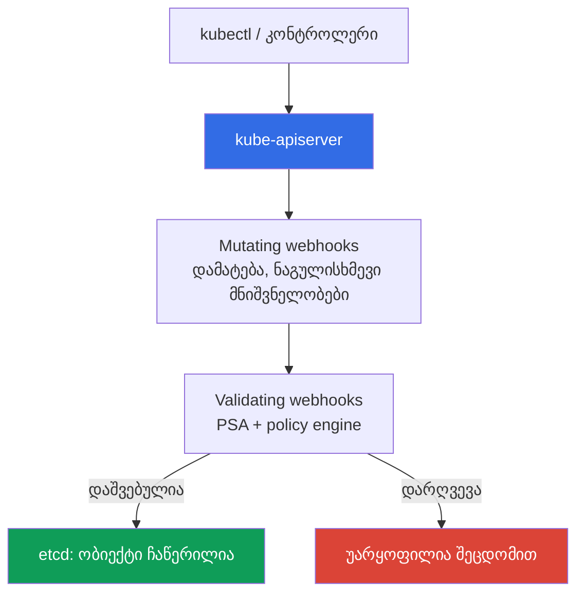
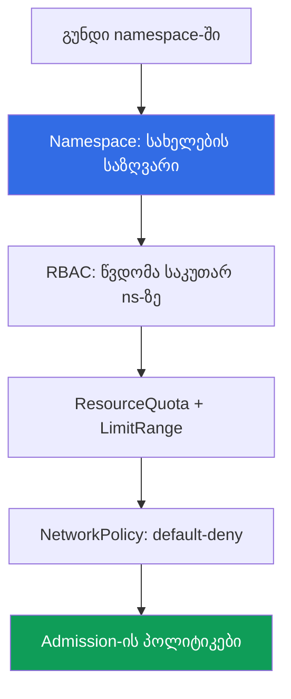

[Русская версия](ru.md) · [Eng version](en.md) · [Versión en español](es.md) · [Version française](fr.md) · [Deutsche Version](de.md) · [繁體中文版](tw.md) · [日本語版](jp.md)

# თავი 22. პოლიტიკები და მულტიტენანტობა: Kyverno და Gatekeeper, გუნდების იზოლაცია

> **რა არის შემდეგ.** მე-19 თავში ჩავრთეთ Pod Security Admission (PSA) - სამი მზა დონე:
> privileged/baseline/restricted. ისინი საკმარისია პოდის საბაზისო ჰარდენინგისთვის, მაგრამ არა
> საკუთარი წესებისთვის და არც იმისთვის, რომ კლასტერში გუნდებმა ერთმანეთს ხელი არ შეუშალონ. ეს თავი
> ასრულებს მე-3 ნაწილს: policy engine-ები (Kyverno, Gatekeeper) იმ წესებისთვის, რომლებიც PSA-ში არ
> არის, და მულტიტენანტობა კლასტერის შიგნით. მომიჯნავე თემები სხვა თავებშია: PSA (თავი 19), image-ის
> ხელმოწერა (თავი 20), RBAC (თავი 5), NetworkPolicy (თავი 30), კვოტები (თავი 14), admission webhook-ები
> (თავი 2), ანგარიში, როგორც საზღვარი (თავები 0.1, 32).

## 22.1. „PSA-ს ჩემი წესები არ შეუძლია, გუნდები კი ერთმანეთს ხელს უშლიან“

PSA ჩართულია, restricted დაყენებულია საბრძოლო namespace-ებზე (თავი 19), პრივილეგირებული პოდი ვერ
გაივლის. თითქოს admission კონტროლქვეშაა. მაგრამ ჩნდება მოთხოვნა, რომელსაც PSA ვერ ფარავს: აიკრძალოს
images, რომლებიც საკუთარი ECR-დან არ არის. PSA-ს ეს არ შეუძლია - მას სამი ფიქსირებული პროფილი აქვს და
**მათში საკუთარი წესის დამატება შეუძლებელია**. ამას მოსდევს სხვა მოთხოვნებიც: პოდზე `owner` და
`cost-center` label-ების მოთხოვნა, მხოლოდ განსაზღვრული StorageClass-ების დაშვება, `:latest`-ის
აკრძალვა. ამ ყველაფრის გამოხატვა baseline/restricted დონეებით შეუძლებელია. PSA პასუხობს კითხვას
„უსაფრთხოა თუ არა პოდი სტანდარტის მიხედვით“, მაგრამ არა კითხვას „შეესაბამება თუ არა ის **ჩვენს**
წესებს“.

იქვე მეორე პრობლემაც არსებობს - ერთ კლასტერში რამდენიმე გუნდი ერთმანეთს ხელს უშლის:

- **გუნდმა პოდი ლიმიტების გარეშე გაუშვა და ნოდის რესურსები მთლიანად შეჭამა.** პოდი
  `resources.limits`-ის გარეშე მეხსიერებაში გაიზარდა, მოხდა OOM და მეზობელი პოდები დაზიანდა.
  namespace-ს ResourceQuota არ ჰქონდა და ერთმა გუნდმა მთელი კვანძის რესურსები წაიღო (საიზინგი და
  ლიმიტები - თავი 14).
- **გუნდმა LoadBalancer სხვის namespace-ში შექმნა.** RBAC ზედმეტად ფართოდ იყო გაცემული,
  ინჟინერმა შეცდომით Service ტიპის LoadBalancer სხვა გუნდის namespace-ში დაადეპლოია, რის გამოც
  ზედმეტი NLB და ხარჯი გაჩნდა.

პირველი პრობლემა policy engine-ით გვარდება - იმ წესების თავს მოხვევა, რომლებიც PSA-ში არ არის.
მეორე კი კლასტერის შიგნით გუნდების იზოლაციით: namespace, კვოტები, RBAC, ქსელი და იგივე admission-ის
პოლიტიკები ერთობლივად.

## 22.2. Admission control, როგორც კონტროლის წერტილი

სანამ ობიექტი etcd-ში მოხვდება, apiserver მას admission-კონტროლერებში ატარებს (თავი 2). მთელ
გაფართოებად სამუშაოს ორი ტიპის webhook ასრულებს:

- **Mutating admission webhook** - პირველი გამოიძახება და **შეუძლია ობიექტის შეცვლა**: label-ის
  დამატება, ნაგულისხმევი `resources`-ის დაყენება, sidecar-ის დამატება.
- **Validating admission webhook** - შემდეგ გამოიძახება და **მხოლოდ ამოწმებს**: გაატაროს თუ
  უარყოს. ობიექტის შეცვლა მას არ შეუძლია.



**Policy engine სწორედ admission webhook-ია**, ოღონდ წესებს თქვენ განსაზღვრავთ. ის ობიექტებს
თქვენი წესებით ამოწმებს და სურვილის შემთხვევაში ცვლის **etcd-ში ჩაწერამდე**. PSA-ც
admission-კონტროლერია, მაგრამ ფიქსირებული პროფილებით: იქ, სადაც PSA მთავრდება (სამი დონე, საკუთარი
არაფერი), policy engine იწყება. პრაქტიკაში მათ **აერთიანებენ**: PSA პოდის საბაზისო დონეს იცავს,
ძრავა კი დანარჩენს ამატებს. PSA-ს ძრავით ჩანაცვლება საჭირო არ არის - ეს სხვადასხვა ამოცანაა.

Kubernetes 1.30-დან apiserver-ს webhook-ის **ჩაშენებული** ალტერნატივა აქვს -
`ValidatingAdmissionPolicy`: წესები პირდაპირ რესურსში **CEL**-ზე (Common Expression Language)
იწერება, შემოწმება კი **apiserver-ის შიგნით, გარე webhook-ის გარეშე** მიმდინარეობს. ცალკე ძრავის
პოდი არ არის, შესაბამისად არც ქსელური გამოძახებაა, რომელმაც შეიძლება არ უპასუხოს და admission
შეაჩეროს (ამ რისკისა და `failurePolicy`-ის შესახებ იხილეთ 22.9). მოდელი ორი რესურსისგან შედგება:
`ValidatingAdmissionPolicy` (CEL-ზე დაწერილი წესი `validations`-ში) და
`ValidatingAdmissionPolicyBinding` (რაზე გავრცელდეს და რა რეაქცია ჰქონდეს). იგივე `:latest`-ის
აკრძალვა, რაც Kyverno-ს აქვს 22.3-ში, მაგრამ გარეშე ძრავის გარეშე:

```yaml
apiVersion: admissionregistration.k8s.io/v1
kind: ValidatingAdmissionPolicy
metadata:
  name: disallow-latest-tag
spec:
  matchConstraints:
    resourceRules:
      - apiGroups: [""]
        apiVersions: ["v1"]
        operations: ["CREATE", "UPDATE"]
        resources: ["pods"]
  validations:
    - expression: "object.spec.containers.all(c, !c.image.endsWith(':latest'))"
      message: "ტეგი :latest აკრძალულია"
---
apiVersion: admissionregistration.k8s.io/v1
kind: ValidatingAdmissionPolicyBinding
metadata:
  name: disallow-latest-tag-binding
spec:
  policyName: disallow-latest-tag
  validationActions: ["Deny"]        # ტესტირებისას Audit/Warn -> შემდეგ Deny
```

ჩაშენებული ვალიდაცია კარგია მარტივი შემოწმებებისთვის mutate/generate-ის გარეშე; რთულ ლოგიკას,
image-ის ხელმოწერასა და რესურსების გენერირებას Kyverno/Gatekeeper-ს უტოვებენ.

## 22.3. Kyverno: პოლიტიკები YAML-რესურსების სახით

Kyverno არის policy engine, სადაც **პოლიტიკა Kubernetes-ის ჩვეულებრივი YAML-რესურსია**, ცალკე ენის
გარეშე. წერთ `ClusterPolicy`-ს (მოქმედებს მთელ კლასტერზე) ან `Policy`-ს (namespace-ის ფარგლებში),
იყენებთ `kubectl apply`-ით და კითხულობთ `kubectl get`-ით. პოლიტიკის შიგნით წესებია და თითოეული წესი
ერთ-ერთ ტიპს მიეკუთვნება:

- **validate** - შეამოწმოს და აკრძალოს/მოითხოვოს (label არ არის - უარყოს).
- **mutate** - ობიექტს რამე დაუმატოს (დააყენოს ნაგულისხმევი label ან `resources`).
- **generate** - შექმნას თანმხლები რესურსი (მაგალითად, NetworkPolicy ახალი namespace-ისთვის).
- **verifyImages** - შეამოწმოს image-ის ხელმოწერა (მე-20 თავში აღწერილი ნაბიჯი admission-ზე).

დარღვევაზე რეაქციას `validationFailureAction` განსაზღვრავს: `Enforce` - პოდი **უარყოფილია**;
`Audit` - პოდი იქმნება, დარღვევა კი policy report-ში ხვდება. დანერგვის მიმდევრობა იგივეა, რაც
PSA-სთვის (თავი 19): ჯერ `Audit`, რათა დამრღვევები დაინახოთ, შემდეგ `Enforce`.

validate-ის მაგალითი - `:latest` ტეგის აკრძალვა (`requests`/`limits`-ის მოთხოვნის წესი იმავე
პრინციპით, `resources`-ზე `pattern`-ით იგება):

```yaml
apiVersion: kyverno.io/v1
kind: ClusterPolicy
metadata:
  name: disallow-latest-tag
spec:
  validationFailureAction: Enforce        # დარღვევა -> პოდი უარყოფილია
  rules:
    - name: no-latest
      match:
        any:
          - resources:
              kinds: ["Pod"]
      validate:
        message: "ტეგი :latest აკრძალულია, დაადეპლოიეთ ვერსიით ან digest-ით"
        pattern:
          spec:
            containers:
              - image: "!*:latest"          # image არ უნდა მთავრდებოდეს :latest-ით
```

სავალდებულო `requests`/`limits` - ასეთივე validate-ია `resources`-ზე `pattern`-ით (`?*` ნიშნავს
ნებისმიერ არაცარიელ მნიშვნელობას). მხოლოდ საკუთარი ECR-ის დაშვება - validate image-ის შაბლონით;
ხელმოწერის შემოწმება - `verifyImages` წესი სანდო გასაღებით (მექანიკა - თავი 20). ასე ფარავს ძრავა
ზუსტად 22.1-ის იმ მოთხოვნებს, რომლებიც PSA-ში არ არის.

## 22.4. Gatekeeper: პოლიტიკები Rego-ზე

Gatekeeper არის policy engine Open Policy Agent-ის (OPA) საფუძველზე, სადაც წესები **Rego** ენაზე
იწერება. ის ორი რესურსისგან შედგება:

- **ConstraintTemplate** - შაბლონი: შეიცავს Rego კოდს (`violation` წესი) და პარამეტრების სქემას.
  მისგან Gatekeeper რესურსის ახალ ტიპს (CRD) ქმნის.
- **Constraint** - შაბლონის ეგზემპლარი: მიუთითებს, **რაზე** გავრცელდეს (რომელ kinds-ზე) და რომელი
  პარამეტრებით.

ერთი შაბლონი „labels-ის მოთხოვნა“ და რამდენიც გსურთ Constraint, namespace-ების მიხედვით labels-ის
სხვადასხვა ნაკრებით. მაგალითი - სავალდებულო label (შემოკლებით):

```yaml
apiVersion: templates.gatekeeper.sh/v1
kind: ConstraintTemplate
metadata:
  name: k8srequiredlabels
spec:
  crd:
    spec:
      names:
        kind: K8sRequiredLabels
  targets:
    - target: admission.k8s.gatekeeper.sh
      rego: |
        package k8srequiredlabels
        violation[{"msg": msg}] {
          required := input.parameters.labels[_]
          not input.review.object.metadata.labels[required]
          msg := sprintf("missing label: %v", [required])
        }
---
apiVersion: constraints.gatekeeper.sh/v1beta1
kind: K8sRequiredLabels              # ტიპი ზემოთ მოცემულმა შაბლონმა შექმნა
metadata:
  name: pods-must-have-owner
spec:
  match:
    kinds:
      - apiGroups: [""]
        kinds: ["Pod"]
  parameters:
    labels: ["owner", "cost-center"]  # სავალდებულო labels
```

Rego რთული ლოგიკისთვის Kyverno-ს YAML-შაბლონებზე მძლავრია, მაგრამ მას **შესვლის უფრო მაღალი
ზღურბლი** აქვს: ენა უნდა შეისწავლოთ და გამართვაც უფრო რთულია. Gatekeeper-ს მაშინ ირჩევენ, როდესაც
პოლიტიკების სრულფასოვანი ენაა საჭირო; Kyverno კი დეკლარაციული წესებისა და ცალკე ენის გარეშე
mutate/generate-ის საჭიროებისას იმარჯვებს.

## 22.5. Kyverno Gatekeeper-ის წინააღმდეგ

ორივე კლასტერში admission webhook-ია. განსხვავება ენაში, შესაძლებლობებსა და შესვლის ზღურბლშია.

| თვისება | Kyverno | Gatekeeper (OPA) |
|---|---|---|
| პოლიტიკების ენა | Kubernetes-ის YAML-რესურსები | Rego |
| შესვლის ზღურბლი | დაბალი, ნაცნობი სინტაქსი | უფრო მაღალი, Rego-ს სწავლაა საჭირო |
| მოდელი | `ClusterPolicy`/`Policy` წესებით | `ConstraintTemplate` + `Constraint` |
| mutate (ობიექტის შეცვლა) | დიახ, სტანდარტულად | შეზღუდულად (mutation ცალკეა) |
| generate (რესურსების შექმნა) | დიახ | არა |
| verifyImages (ხელმოწერა) | დიახ, ჩაშენებულია | ცალკე ინტეგრაციის მეშვეობით |
| ენის ძალა | შაბლონები + CEL | სრულფასოვანი Rego, რთული ლოგიკა |
| როდის ავირჩიოთ | დეკლარაციული წესები, mutate/generate | საჭიროა ენა, რთული შემოწმებები |

პრაქტიკული არჩევანი: ერთი კლასტერისთვის ერთი ძრავა, ორივე ერთად არა (ერთსა და იმავე ობიექტებზე ორი
admission webhook გამართვას ართულებს). EKS-ის გუნდების უმეტესობისთვის დასაწყისში Kyverno უფრო
მარტივია; Gatekeeper-ს მაშინ ირჩევენ, როდესაც წესები დეკლარაციულ შაბლონებს სცდება.

## 22.6. რას ამოწმებენ პოლიტიკებით პრაქტიკაში

Policy engine მოთხოვნების მთელ კლასს ფარავს, რომლებიც PSA-ში არ არის. ტიპური ნაკრები:

| წესი | ტიპი | რისთვის |
|---|---|---|
| `:latest` ტეგის აკრძალვა | validate | გამეორებადობა, დეპლოი digest-ით (თავი 20) |
| სავალდებულო `requests`/`limits` | validate | ერთმა გუნდმა ნოდი მთლიანად რომ არ შეჭამოს (თავი 14) |
| მხოლოდ სანდო რეესტრები (საკუთარი ECR) | validate | უცხო images-ის ჩამოტვირთვის აკრძალვა (თავი 20) |
| სავალდებულო labels/ანოტაციები (owner, cost-center) | validate | მფლობელი და ხარჯების აღრიცხვა |
| `hostPath`/`privileged`-ის აკრძალვა | validate | baseline/restricted PSA-ს ავსებს (თავი 19) |
| image-ის ხელმოწერის შემოწმება | verifyImages | მხოლოდ სანდო არტეფაქტი (თავი 20) |
| დაშვებული StorageClass-ები | validate | ძვირ ან უცხო კლასზე ტომის შექმნის აკრძალვა (თავი 23) |
| Service-ის დაშვებული ტიპები | validate | ზედმეტი LoadBalancer-ის შექმნის აკრძალვა (თავი 26) |
| ნაგულისხმევი labels-ის დაყენება | mutate | ერთიანი აღრიცხვა მანიფესტების შესწორების გარეშე |
| NetworkPolicy-ის შექმნა namespace-ზე | generate | ქსელი namespace-ის შექმნისთანავე დახურულია (თავი 30) |

ბოლო ორი სტრიქონი mutate და generate-ია: ძრავა მხოლოდ არ კრძალავს, არამედ ობიექტს ავსებს და
რესურსებს ქმნის. `hostPath`/`privileged`-ის აკრძალვა baseline/restricted PSA-ს ემთხვევა და ეს
ნორმალურია: PSA სტანდარტს იცავს, პოლიტიკა კი ნიუანსებს ამატებს. ხელმოწერისა და რეესტრის შემოწმება
მე-20 თავის supply chain-ის admission-რგოლია: ECR-მა ხელი მოაწერა, ძრავამ შესვლისას შეამოწმა.

## 22.7. მულტიტენანტობა კლასტერის შიგნით: soft და hard

მულტიტენანტობა არის რამდენიმე „მოიჯარე“ (გუნდი, გარემო, კლიენტი) ერთ ინფრასტრუქტურაში. ორი მიდგომა
არსებობს და მათ შორის არჩევანი ფუნდამენტურია.

- **Soft multi-tenancy** - მოიჯარეები **ერთ კლასტერში** არიან და namespace-ებითა და Kubernetes-ის
  მექანიზმებით (RBAC, ResourceQuota, LimitRange, NetworkPolicy, პოლიტიკები) იყოფიან. იაფია, მაგრამ
  control plane და ნოდების ბირთვი საერთოა.
- **Hard multi-tenancy** - მოიჯარეები **ცალკეულ კლასტერებში ან ანგარიშებში** არიან (თავები 0.1,
  32). უფრო ძვირი და რთულია, მაგრამ საზღვარი ხისტია: საკუთარი ბირთვი, საკუთარი control plane.



რა უზრუნველყოფს იზოლაციას soft-მოდელში: **namespace**, როგორც სახელების საზღვარი და RBAC-ის
მოქმედების არეალი; **RBAC** (თავი 5) გუნდს მხოლოდ საკუთარ namespace-ში უშვებს; **ResourceQuota და
LimitRange** (კავშირი საიზინგთან, თავი 14) ერთ გუნდს კლასტერის რესურსების მთლიანად მოხმარების
საშუალებას არ აძლევს; **NetworkPolicy** (თავი 30) namespace-ებს შორის ტრაფიკს ჭრის; **admission-ის
პოლიტიკები** სავალდებულო წესებს თავს ახვევს.

რას **არ უზრუნველყოფს** soft multi-tenancy: control plane საერთოა (apiserver, etcd, scheduler
ყველასთვის ერთია) და ნოდების ბირთვიც საერთოა (გუნდების პოდები Linux-ის ბირთვს იზიარებენ,
კონტეინერიდან ბირთვის მოწყვლადობის მეშვეობით გაქცევა namespace-ის საზღვარს არღვევს). namespace და
RBAC ლოგიკური საზღვრებია და არა ბირთვის იზოლაცია.

არჩევის წესი: ერთი ორგანიზაციის სანდო გუნდებისთვის საერთო კლასტერში soft-მოდელი; მტრულად
განწყობილი ან მკაცრად რეგულირებული მოიჯარეებისთვის hard, ცალკეული კლასტერები/ანგარიშები (თავები
0.1, 32).

## 22.8. გუნდების იზოლაცია პრაქტიკულად

Soft multi-tenancy ფენებისგან იგება და თითოეული მათგანი 22.1-ში აღწერილ საკუთარ პრობლემას ფარავს.
თითო გუნდის namespace საბაზისო ერთეულია; დანარჩენი მასზე ეწყობა.

**ResourceQuota** namespace-ის ჯამურ მოხმარებას ზღუდავს, რათა ერთმა გუნდმა კლასტერი მთლიანად არ
შეჭამოს:

```yaml
apiVersion: v1
kind: ResourceQuota
metadata:
  name: team-a-quota
  namespace: team-a
spec:
  hard:
    requests.cpu: "10"              # ns-ის ყველა პოდის ჯამური requests
    requests.memory: 20Gi
    limits.memory: 40Gi
    pods: "50"
    services.loadbalancers: "2"     # namespace-ში არაუმეტეს ორი LB-ისა
```

**LimitRange** **ცალკეული კონტეინერისთვის** ნაგულისხმევ მნიშვნელობებსა და საზღვრებს ადგენს, რათა
პოდი აშკარად მითითებული `resources`-ის გარეშე შეუზღუდავად არ გაეშვას (პრობლემა 22.1-დან):

```yaml
apiVersion: v1
kind: LimitRange
metadata:
  name: team-a-limits
  namespace: team-a
spec:
  limits:
    - type: Container
      default:                      # limits, თუ პოდში მითითებული არ არის
        cpu: "500m"
        memory: 512Mi
      defaultRequest: {cpu: "100m", memory: 128Mi}   # requests, თუ მითითებული არ არის
```

მათ ზემოდან: **RBAC** (თავი 5) როლებს მხოლოდ საკუთარ namespace-ში გასცემს, ამიტომ სხვის
namespace-ში LoadBalancer ვერ შეიქმნება; **NetworkPolicy** (თავი 30) default-deny-ით ns-ებს შორის
ტრაფიკს ჭრის; **admission-ის პოლიტიკები** სავალდებულო წესებს აწესებს - რეესტრს, labels-ს, Service-ის
ტიპებს. ResourceQuota-ს არსებობისას Kubernetes თითოეული პოდისგან `requests`/`limits`-ს მოითხოვს,
ამიტომ ნაგულისხმევი მნიშვნელობების მქონე LimitRange აქ ფუფუნება კი არა, პოდების საერთოდ
შესაქმნელად აუცილებელი პირობაა.

## 22.9. როგორ იყენებენ ამას პროდაქშენში

- **წესის გაშლა: `Audit`/`Warn` -> `PolicyReport` -> `Enforce`.** ახალ პოლიტიკას `Audit` რეჟიმში
  (Kyverno) ან გაფრთხილებით ნერგავენ, რეალურ ტრაფიკზე `PolicyReport`-ს აგროვებენ და დამრღვევებს
  პოულობენ, მხოლოდ ამის შემდეგ გადაჰყავთ `Enforce`-ში, წინააღმდეგ შემთხვევაში ლეგიტიმურ დეპლოებს
  დაბლოკავენ. გზა იგივეა, რაც PSA-სთვის (თავი 19); `ValidatingAdmissionPolicyBinding`-ისთვის ეს
  იგივე `validationActions`-ია: `Audit`/`Warn` -> `Deny`.
- **`failurePolicy`: ჯერ `Ignore`, შემდეგ `Fail`.** ძრავის webhook რეგისტრირდება `failurePolicy`-ით:
  `Fail`-ის შემთხვევაში მიუწვდომელი webhook **admission-ს აჩერებს** და დეპლოები ჩერდება, `Ignore`-ის
  შემთხვევაში კი ობიექტი შემოწმების გვერდის ავლით გაივლის. ტესტირებისას აყენებენ `Ignore`-ს და
  webhook-ის შეცდომებსა და timeout-ებზე alert-ს, ხოლო `Fail`-ზე მხოლოდ სტაბილიზაციის შემდეგ
  გადადიან. ჩაშენებულ `ValidatingAdmissionPolicy`-ს ეს რისკი არ აქვს - შემოწმება apiserver-ის
  შიგნით მიმდინარეობს (22.2).
- **პოლიტიკები, როგორც კოდი git-ში.** `ClusterPolicy`/`ConstraintTemplate` რეპოზიტორიაში ინახება და
  GitOps-ით (თავი 44) ვრცელდება, არა ხელით: წესების ისტორია და review git-შია.
- **PSA საბაზისო დონეებისთვის და policy engine დანარჩენისთვის.** PSA namespace-ზე
  baseline/restricted-ს იცავს (თავი 19), ძრავა კი რეესტრს, labels-ს, digest-სა და Service-ის ტიპებს
  ამატებს, რაც PSA-ში არ არის.
- **ResourceQuota და LimitRange გუნდის თითოეულ namespace-ზე.** namespace კვოტის გარეშე არის გუნდი
  ზედა ზღვრის გარეშე; მათ namespace-ის შექმნისას აყენებენ და არა ნოდის რესურსების შეჭმის პირველი
  ინციდენტის შემდეგ.
- **ერთი ძრავა კლასტერზე და რეგულარული გადახედვა.** Kyverno ან Gatekeeper, მაგრამ არა ორივე ერთსა
  და იმავე ობიექტებზე; წესებისა და ლიმიტების ნაკრებს დატვირთვების ზრდასთან ერთად გადახედავენ,
  წინააღმდეგ შემთხვევაში მოძველებული პოლიტიკა შეცდომით ბლოკავს, ხოლო დაბალი კვოტა გუნდს აფერხებს.

## 22.10. მინი-გლოსარიუმი

- **Admission webhook** - გარე დამმუშავებელი, რომელსაც apiserver ობიექტის etcd-ში ჩაწერამდე
  იძახებს; mutating ობიექტს ცვლის, validating კი მხოლოდ ატარებს ან უარყოფს (თავი 2).
- **Policy engine** - admission webhook თქვენი წესებით (Kyverno, Gatekeeper); ობიექტებს წესებით
  ამოწმებს და საჭიროებისას etcd-ში ჩაწერამდე ცვლის.
- **Kyverno** - policy engine, სადაც პოლიტიკა YAML-რესურსია (`ClusterPolicy`/`Policy`) და შეიცავს
  validate/mutate/generate/verifyImages წესებს; რეაქციაა `Enforce`/`Audit`.
- **Gatekeeper** - policy engine OPA-ს საფუძველზე; წესები Rego-ზე, მოდელია `ConstraintTemplate`
  (შაბლონი + სქემა) და `Constraint` (ეგზემპლარი).
- **ValidatingAdmissionPolicy** - apiserver-ში ჩაშენებული ვალიდაცია CEL-ზე (Kubernetes 1.30+), გარე
  webhook-ის გარეშე; წყვილდება `ValidatingAdmissionPolicyBinding`-თან (რაზე გავრცელდეს და რეაქცია
  `Deny`/`Warn`/`Audit`).
- **failurePolicy** - რეაქცია მიუწვდომელ webhook-ზე: `Fail` admission-ს აჩერებს, `Ignore` კი
  ობიექტს შემოწმების გვერდის ავლით ატარებს.
- **Soft multi-tenancy** - მოიჯარეები ერთ კლასტერში (namespace, RBAC, ResourceQuota, LimitRange,
  NetworkPolicy, პოლიტიკები); საერთო control plane და ბირთვი. **Hard multi-tenancy** - მოიჯარეები
  ცალკეულ კლასტერებში/ანგარიშებში; სირთულის ფასად მიღებული ხისტი საზღვარი (თავები 0.1, 32).
- **ResourceQuota / LimitRange** - შესაბამისად namespace-ის ჯამური მოხმარების ლიმიტი და ცალკეული
  კონტეინერის ნაგულისხმევი მნიშვნელობები/საზღვრები.

## 22.11. თავის შეჯამება

- PSA (თავი 19) სამ ფიქსირებულ დონეს გვთავაზობს და **საკუთარი წესებით არ ფართოვდება** (უცხო
  რეესტრი, სავალდებულო label, StorageClass). ამას policy engine ფარავს - admission webhook თქვენი
  წესებით.
- Admission control კონტროლის წერტილია: mutating webhook ობიექტს ცვლის, validating ატარებს ან
  უარყოფს, ორივე კი etcd-ში ჩაწერამდე მუშაობს. PSA-სა და policy engine-ს აერთიანებენ და არა
  ერთმანეთით ანაცვლებენ. 1.30-დან არსებობს CEL-ზე ჩაშენებული `ValidatingAdmissionPolicy`-ც, ანუ
  შემოწმება გარე webhook-ის გარეშე.
- Kyverno არის პოლიტიკები YAML-ის სახით (`ClusterPolicy`/`Policy`), validate/mutate/generate და
  verifyImages წესები, `Enforce`/`Audit` რეაქცია და შესვლის დაბალი ზღურბლი. Gatekeeper არის
  პოლიტიკები Rego-ზე, `ConstraintTemplate` და `Constraint`; უფრო მძლავრი და რთულია. ერთი ძრავა
  კლასტერზე და არა ორივე.
- პოლიტიკებით თავს ახვევენ იმას, რაც PSA-ში არ არის: `:latest`-ის აკრძალვას, სავალდებულო
  `requests`/`limits`-ს, სანდო რეესტრებს, სავალდებულო labels-ს, image-ის ხელმოწერას, დაშვებულ
  StorageClass-ებსა და Service-ს.
- კლასტერის შიგნით მულტიტენანტობა soft-მოდელია: namespace, RBAC (თავი 5), ResourceQuota და
  LimitRange (თავი 14), NetworkPolicy (თავი 30), პოლიტიკები. ის ბირთვისა და control plane-ის
  იზოლაციას არ უზრუნველყოფს, ამიტომ მტრულად განწყობილი მოიჯარეებისთვის საჭიროა hard (ცალკეული
  კლასტერები/ანგარიშები, თავები 0.1, 32).

## 22.12. როგორ გამოგადგებათ ეს რეალურ სამუშაოში

მოთხოვნა „აიკრძალოს images, რომლებიც ჩვენი ECR-დან არ არის“, რომელსაც PSA ვერ პასუხობს, ერთი
`ClusterPolicy`-ით იფარება და review-ზე მიმოწერის ნაცვლად წესი ჩანს. ინციდენტი „გუნდმა ლიმიტების
გარეშე პოდით ნოდის რესურსები შეჭამა“ არ ხდება იქ, სადაც namespace-ზე ResourceQuota და ნაგულისხმევი
მნიშვნელობების მქონე LimitRange მოქმედებს: პოდი `resources`-ის გარეშე ან ნაგულისხმევ მნიშვნელობებს
მიიღებს, ან არ შეიქმნება. soft და hard multi-tenancy-ს შორის არჩევანი ერთ კითხვას ეფუძნება: ენდობით
თუ არა მოიჯარეებს იმდენად, რომ საერთო ბირთვი ჰქონდეთ. თუ არა, საჭიროა ცალკე კლასტერი ან ანგარიში,
და ამის გადაწყვეტა კონტეინერიდან გაქცევამდე უფრო იაფია, ვიდრე შემდეგ.

## 22.13. კითხვები თვითშემოწმებისთვის

1. რატომ ვერ ფარავს PSA მოთხოვნას „მხოლოდ images საკუთარი ECR-დან“ და რა ფარავს მას?
2. რით განსხვავდება mutating webhook validating-ისგან და რა თანმიმდევრობით იძახებს მათ apiserver?
3. რატომ არის policy engine admission webhook და სად მთავრდება PSA და იწყება ძრავა?
4. რა ტიპის წესები აქვს Kyverno-ს და რით განსხვავდება validate mutate-ისა და generate-ისგან?
5. რას აკეთებს `validationFailureAction: Audit` `Enforce`-თან შედარებით და რატომ იწყებენ Audit-ით?
6. რომელი ორი რესურსისგან შედგება Gatekeeper-ის პოლიტიკა და რას შეიცავს თითოეული?
7. რომელ ენაზე იწერება Gatekeeper-ის წესები და რა უპირატესობა და ნაკლი აქვს მას Kyverno-სთან
   შედარებით?
8. რატომ ირჩევენ ერთი კლასტერისთვის ერთ policy engine-ს და არა ორივეს ერთად?
9. რით განსხვავდება soft multi-tenancy hard-ისგან და რა უზრუნველყოფს იზოლაციას soft-მოდელში?
10. რას არ უზრუნველყოფს soft multi-tenancy და როდის არის ამის გამო hard საჭირო?
11. რატომ სჭირდება გუნდის namespace-ს ResourceQuota-ც და LimitRange-ც, რას აკეთებს თითოეული?
12. რატომ ხდება ნაგულისხმევი მნიშვნელობების მქონე LimitRange სავალდებულო ResourceQuota-ს
    არსებობისას?
13. რით განსხვავდება CEL-ზე ჩაშენებული `ValidatingAdmissionPolicy` webhook-ძრავისგან და რა კავშირი
    აქვს ამას ტესტირებისას `failurePolicy: Ignore`/`Fail`-თან?

## პრაქტიკა

ამ თემის შესაბამისი კურსის ლაბა: [ლაბა 127 - პოლიტიკები ძრავის გარეშე:
ValidatingAdmissionPolicy CEL-ზე](../../labs/127/README_GE.MD). მასში დაწერთ CEL-წესს `:latest`
ტეგის წინააღმდეგ, გაივლით გზას `Audit` -> `Deny` და ნახავთ apiserver-ის უარყოფის ტექსტს, დაამატებთ
მეორე პოლიტიკას სავალდებულო `resources.requests`-ზე და გაარკვევთ, რატომ არ აქვს ჩაშენებულ შემოწმებას
რისკი „webhook-მა არ უპასუხა“; შემოწმება სრულდება `check_result` ბრძანებით. გაშვება:
`TASK=127 make run_eks_task`.

ლაბა Kyverno-სა და Gatekeeper-ს არ აყენებს, მაგრამ სასარგებლოა მათი ქცევის ცოცხალ კლასტერში ხელით
შედარება. Helm-ის მეშვეობით დააყენეთ ერთი policy engine (Kyverno ან Gatekeeper) და დაათვალიერეთ
რესურსები: `kubectl get clusterpolicy` Kyverno-სთვის, `kubectl get constraints` Gatekeeper-ისთვის.
გამოიყენეთ 22.3-ის `ClusterPolicy` `validationFailureAction: Audit`-ით, დაადეპლოიეთ პოდი
`nginx:latest`-ით და policy report-ში დარღვევა იპოვეთ (`kubectl get policyreport -A`). გადადით
`Enforce`-ზე და დარწმუნდით, რომ ასეთი პოდი ახლა admission-ზე უარყოფილია. იგივე აკრძალვა გარე ძრავის გარეშე ააწყვეთ 22.2-ის ჩაშენებული `ValidatingAdmissionPolicy`-ით (`kubectl get
validatingadmissionpolicy`), დასაწყისში `validationActions: ["Audit"]` გამოიყენეთ.

შემდეგ გუნდის იზოლაცია. შექმენით namespace `team-a`, მიაბით 22.8-ის ResourceQuota და LimitRange,
შექმენით პოდი `resources`-ის გარეშე - მან LimitRange-დან ნაგულისხმევი მნიშვნელობები უნდა მიიღოს.
გადააჭარბეთ კვოტას (`pods` ან `requests.cpu`) და დარწმუნდით, რომ ზედმეტი პოდი არ იქმნება: `kubectl
describe resourcequota -n team-a` გამოყენებას ლიმიტთან მიმართებით აჩვენებს. RBAC მე-5 თავისთვის
დატოვეთ, NetworkPolicy default-deny - 30-ე თავისთვის, image-ის ხელმოწერის შემოწმება კი მე-20 თავთან
კავშირისთვის.

---
[სარჩევი](../README_GE.md) · [თავი 21](../21/ge.md) · [თავი 23](../23/ge.md)
