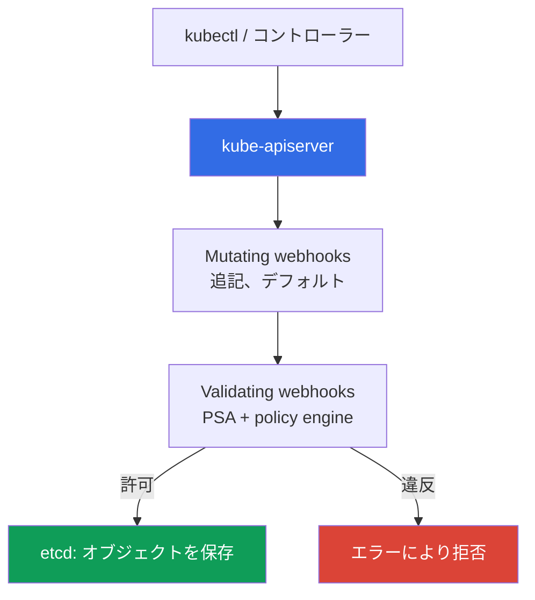
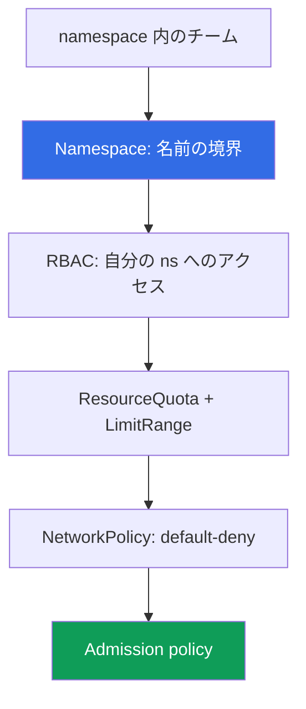

[Eng version](en.md) · [Versión en español](es.md) · [Version française](fr.md) · [Deutsche Version](de.md) · [Русская версия](ru.md) · [ქართული ვერსია](ge.md) · [繁體中文版](tw.md)
# 第22章. ポリシーとマルチテナンシー: Kyverno と Gatekeeper、チームの分離

> **この先。** 第19章では、Pod Security Admission (PSA) の3つの標準レベル、
> privileged/baseline/restricted を有効化しました。これらは基本的な Pod のハードニングには十分ですが、
> 独自ルールやクラスター内でチーム同士が干渉しないようにする用途には十分ではありません。この章で
> 第3部を完結します。PSA にはないルールのための policy engine (Kyverno、Gatekeeper) と、
> クラスター内のマルチテナンシーを扱います。関連内容は他章で扱います。PSA (第19章)、イメージ署名
> (第20章)、RBAC (第5章)、NetworkPolicy (第30章)、quota (第14章)、admission webhook
> (第2章)、境界としてのアカウント (第0.1、32章) です。

## 22.1. 「PSA では独自ルールを実現できず、チーム同士が干渉する」

PSA は有効で、本番 namespace には restricted が設定されており (第19章)、特権 Pod は通りません。
admission は制御されているように見えます。しかし PSA ではカバーできない要件が来ます。自分たちの
ECR 以外のイメージを禁止したいのです。PSA にはそれができません。3つの固定プロファイルしかなく、
**独自ルールを追加できない**からです。続いて、Pod に `owner` と `cost-center` の label を必須にする、
特定の StorageClass だけを許可する、`:latest` を許可しない、といった要件も出ます。これらは
baseline/restricted レベルでは表現できません。PSA は「Pod が標準に照らして安全か」には答えますが、
「**私たちの**ルールに準拠しているか」には答えません。

その隣には、1つのクラスターにいる複数チームが互いに干渉するという別の問題があります。

- **チームが limit なしの Pod をデプロイし、ノードを使い尽くした。** `resources.limits` のない Pod が
  メモリを増やし続け、OOM が発生して隣接する Pod にも影響しました。namespace に ResourceQuota がなく、
  1チームがノード全体のリソースを奪いました (サイジングと limit は第14章)。
- **チームが他チームの namespace に LoadBalancer を作成した。** RBAC が広く付与されており、エンジニアが
  誤って別チームの namespace に LoadBalancer 型 Service をデプロイしました。不要な NLB が作られ、
  請求が発生しました。

最初の問題は policy engine で解決します。PSA にはないルールを強制します。2つ目は、クラスター内の
チーム分離で解決します。namespace、quota、RBAC、ネットワーク、そして admission policy を組み合わせます。

## 22.2. 制御点としての Admission control

オブジェクトが etcd に到達する前に、apiserver は admission controller を通過させます (第2章)。
すべての拡張可能な処理は、2種類の webhook により行われます。

- **Mutating admission webhook** は最初に呼ばれ、**オブジェクトを変更できます**。label の追加、
  デフォルト `resources` の設定、sidecar の追加などです。
- **Validating admission webhook** はその後に呼ばれ、**検証だけを行います**。許可または拒否します。
  オブジェクトは変更できません。



**Policy engine は admission webhook そのもの**ですが、ルールを定義するのはあなたです。独自ルールに従い、
etcd に**書き込まれる前に**オブジェクトを検証し、必要に応じて変更します。PSA も admission controller ですが、
固定プロファイルを持ちます。PSA が終わる場所 (3レベル、独自ルールなし) から policy engine が始まります。
実運用では両者を**組み合わせます**。PSA は Pod の基礎レベルを維持し、engine が残りを追加します。PSA を
engine で置き換える必要はありません。役割が異なります。

Kubernetes 1.30 以降、apiserver には webhook の**組み込み**代替手段があります。
`ValidatingAdmissionPolicy` です。ルールを **CEL** (Common Expression Language) でリソースに直接記述し、
**外部 webhook なしで apiserver 内部**で検証します。別の engine Pod がないため、応答しないネットワーク呼び出しに
よって admission が止まることもありません (このリスクと `failurePolicy` は 22.9 を参照)。モデルは2つの
リソースです。CEL の `validations` にルールを持つ `ValidatingAdmissionPolicy` と、適用対象および反応を定める
`ValidatingAdmissionPolicyBinding` です。22.3 の Kyverno と同じ `:latest` の禁止を、サードパーティー engine
なしで行う例です。

```yaml
apiVersion: admissionregistration.k8s.io/v1
kind: ValidatingAdmissionPolicy
metadata:
  name: disallow-latest-tag
spec:
  matchConstraints:
    resourceRules:
      - apiGroups: [""]
        apiVersions: ["v1"]
        operations: ["CREATE", "UPDATE"]
        resources: ["pods"]
  validations:
    - expression: "object.spec.containers.all(c, !c.image.endsWith(':latest'))"
      message: "タグ :latest は禁止されています"
---
apiVersion: admissionregistration.k8s.io/v1
kind: ValidatingAdmissionPolicyBinding
metadata:
  name: disallow-latest-tag-binding
spec:
  policyName: disallow-latest-tag
  validationActions: ["Deny"]        # ロールアウト時は Audit/Warn -> Deny
```

組み込み検証は mutate/generate を必要としない単純な検査に適しています。複雑なロジック、イメージ署名、
リソース生成は Kyverno/Gatekeeper に任せます。

## 22.3. Kyverno: YAML リソースとしてのポリシー

Kyverno は、**ポリシーが通常の Kubernetes YAML リソース**であり、独自言語を必要としない policy engine です。
クラスター全体に適用する `ClusterPolicy` または namespace 内に適用する `Policy` を記述し、`kubectl apply` で
適用し、`kubectl get` で参照します。ポリシー内部にはルールがあり、それぞれは次のいずれかの型です。

- **validate**: 検証し、禁止または要求します (label がなければ拒否)。
- **mutate**: オブジェクトに追加します (デフォルト label または `resources` を設定)。
- **generate**: 関連リソースを作成します (例: 新しい namespace 用の NetworkPolicy)。
- **verifyImages**: イメージ署名を検証します (admission 時に行う第20章のステップ)。

違反時の反応は `validationFailureAction` で定めます。`Enforce` は Pod を**拒否**し、`Audit` は Pod を作成して
違反を policy report に記録します。導入順序は PSA (第19章) と同じです。まず `Audit` で違反者を確認し、
その後 `Enforce` にします。

validate の例として `:latest` タグを禁止します (`requests`/`limits` を要求するルールも、`resources` を含む
`pattern` で同様に構築します)。

```yaml
apiVersion: kyverno.io/v1
kind: ClusterPolicy
metadata:
  name: disallow-latest-tag
spec:
  validationFailureAction: Enforce        # 違反 -> Pod を拒否
  rules:
    - name: no-latest
      match:
        any:
          - resources:
              kinds: ["Pod"]
      validate:
        message: "タグ :latest は禁止されています。バージョンまたは digest でデプロイしてください"
        pattern:
          spec:
            containers:
              - image: "!*:latest"          # イメージは :latest で終わってはならない
```

必須の `requests`/`limits` も、`resources` に対する `pattern` を用いた同じ validate です (`?*` は空でない任意の値)。
自分たちの ECR だけを許可するにはイメージパターンの validate を使い、署名を検証するには信頼済みキーを使った
`verifyImages` ルールを使います (仕組みは第20章)。こうして engine は PSA にない 22.1 の要件を正確に満たします。

## 22.4. Gatekeeper: Rego によるポリシー

Gatekeeper は Open Policy Agent (OPA) 上の policy engine で、ルールは **Rego** 言語で記述します。
2つのリソースで構成されます。

- **ConstraintTemplate**: テンプレートです。Rego コード (`violation` ルール) とパラメータスキーマを含みます。
  これを元に Gatekeeper は新しいリソース種別 (CRD) を作成します。
- **Constraint**: テンプレートのインスタンスです。**何に**適用するか (どの kinds か) と、使用するパラメータを
  指定します。

「labels を必須にする」テンプレートを1つ作れば、namespace ごとに異なる label セットを持つ Constraint をいくつでも
作れます。必須 label の例 (簡略版) です。

```yaml
apiVersion: templates.gatekeeper.sh/v1
kind: ConstraintTemplate
metadata:
  name: k8srequiredlabels
spec:
  crd:
    spec:
      names:
        kind: K8sRequiredLabels
  targets:
    - target: admission.k8s.gatekeeper.sh
      rego: |
        package k8srequiredlabels
        violation[{"msg": msg}] {
          required := input.parameters.labels[_]
          not input.review.object.metadata.labels[required]
          msg := sprintf("missing label: %v", [required])
        }
---
apiVersion: constraints.gatekeeper.sh/v1beta1
kind: K8sRequiredLabels              # 上記テンプレートが作成した種別
metadata:
  name: pods-must-have-owner
spec:
  match:
    kinds:
      - apiGroups: [""]
        kinds: ["Pod"]
  parameters:
    labels: ["owner", "cost-center"]  # 必須 labels
```

Rego は複雑なロジックでは Kyverno の YAML テンプレートより強力ですが、**習得のハードルが高い**という側面があります。
言語を習得する必要があり、複雑な処理はデバッグも困難です。完全なポリシー言語が必要な場合は Gatekeeper を選び、
宣言的ルールや独自言語なしの mutate/generate が必要な場合は Kyverno が優れます。

## 22.5. Kyverno と Gatekeeper の比較

どちらもクラスター内の admission webhook です。違いは言語、機能、習得のハードルにあります。

| 特性 | Kyverno | Gatekeeper (OPA) |
|---|---|---|
| ポリシー言語 | Kubernetes YAML リソース | Rego |
| 習得のハードル | 低い、慣れた構文 | 高い、Rego の学習が必要 |
| モデル | ルールを持つ `ClusterPolicy`/`Policy` | `ConstraintTemplate` + `Constraint` |
| mutate (オブジェクト変更) | はい、標準機能 | 制限あり (mutation は別途) |
| generate (リソース作成) | はい | いいえ |
| verifyImages (署名) | はい、組み込み | 別の統合を介して |
| 言語の表現力 | テンプレート + CEL | 完全な Rego、複雑なロジック |
| 選択するとき | 宣言的ルール、mutate/generate | 言語や複雑な検査が必要 |

実務的な選択は、1クラスターにつき engine は1つです。同時に両方は使いません (同じオブジェクトに対する
admission webhook が2つになるとデバッグが複雑になるためです)。多くの EKS チームでは、開始時は Kyverno が
簡単です。ルールが宣言的テンプレートを超えたときに Gatekeeper を選びます。

## 22.6. 実運用でポリシーにより検査するもの

Policy engine は PSA にはない要件のクラス全体をカバーします。典型的なセットは次のとおりです。

| ルール | 型 | 目的 |
|---|---|---|
| `:latest` タグの禁止 | validate | 再現性、digest によるデプロイ (第20章) |
| 必須の `requests`/`limits` | validate | 1チームがノードを使い尽くさない (第14章) |
| 信頼済みレジストリのみ (自分たちの ECR) | validate | 外部イメージを取得しない (第20章) |
| 必須 labels/annotations (owner、cost-center) | validate | 所有者とコストの把握 |
| `hostPath`/`privileged` の禁止 | validate | baseline/restricted PSA を補完 (第19章) |
| イメージ署名の検証 | verifyImages | 信頼済みアーティファクトのみ (第20章) |
| 許可する StorageClass | validate | 高価な、または他者のクラスに volume を作らない (第23章) |
| 許可する Service 型 | validate | 余計な LoadBalancer を作らない (第26章) |
| デフォルト labels の設定 | mutate | manifest 修正なしで統一した把握 |
| namespace に NetworkPolicy を作成 | generate | namespace 作成時からネットワークを閉じる (第30章) |

最後の2行は mutate と generate です。engine は禁止するだけでなく、オブジェクトを追記しリソースを作成します。
`hostPath`/`privileged` の禁止は baseline/restricted PSA と重複しますが、それで問題ありません。PSA は標準を維持し、
policy は詳細を追加します。署名とレジストリの検証は、第20章の supply chain における admission の一環です。ECR が
署名し、engine が入口で検査します。

## 22.7. クラスター内のマルチテナンシー: soft と hard

マルチテナンシーとは、1つのインフラストラクチャに複数の「テナント」(チーム、環境、顧客) が存在することです。
2つのアプローチがあり、選択は根本的です。

- **Soft multi-tenancy**: テナントは **1つのクラスター**にあり、namespace と Kubernetes の仕組み
  (RBAC、ResourceQuota、LimitRange、NetworkPolicy、policy) で分離されます。低コストですが、control plane と
  ノードカーネルを共有します。
- **Hard multi-tenancy**: テナントは**別々のクラスターまたはアカウント**にあります (第0.1、32章)。高コストで
  複雑ですが、境界は強固です。独自のカーネルと独自の control plane を持ちます。



soft モデルで分離をもたらすものは、名前の境界および RBAC のスコープとしての **namespace**、チームを自分の
namespace のみに入れる **RBAC** (第5章)、1チームがクラスターを使い尽くすことを防ぐ **ResourceQuota と
LimitRange** (サイジングとの関係は第14章)、namespace 間のトラフィックを制限する **NetworkPolicy** (第30章)、
必須ルールを強制する **admission policy** です。

soft multi-tenancy が**提供しないもの**は、共通の control plane (apiserver、etcd、scheduler は全員で同じ) と、
共有ノードカーネルです (チームの Pod は Linux カーネルを共有し、カーネル脆弱性を介するコンテナ脱出は
namespace 境界を突破します)。namespace と RBAC は論理的な境界であり、カーネルの分離ではありません。

選択の基準は次のとおりです。同じ組織の信頼できるチームなら共通クラスターの soft モデル、敵対的または厳格な
規制対象のテナントなら hard、すなわち別のクラスター/アカウントです (第0.1、32章)。

## 22.8. チームを具体的に分離する

Soft multi-tenancy は層で構成され、それぞれが 22.1 の別の問題を解決します。チームごとの namespace が基本単位で、
残りをそこに適用します。

**ResourceQuota** は namespace の合計消費を制限し、1チームがクラスターを使い尽くさないようにします。

```yaml
apiVersion: v1
kind: ResourceQuota
metadata:
  name: team-a-quota
  namespace: team-a
spec:
  hard:
    requests.cpu: "10"              # ns 内の全 Pod の requests 合計
    requests.memory: 20Gi
    limits.memory: 40Gi
    pods: "50"
    services.loadbalancers: "2"     # namespace あたり最大2つの LB
```

**LimitRange** は**個々のコンテナ**のデフォルトと境界を設定します。明示的な `resources` のない Pod が無制限で
起動しないようにします (22.1 の問題)。

```yaml
apiVersion: v1
kind: LimitRange
metadata:
  name: team-a-limits
  namespace: team-a
spec:
  limits:
    - type: Container
      default:                      # Pod に未指定の場合の limits
        cpu: "500m"
        memory: 512Mi
      defaultRequest: {cpu: "100m", memory: 128Mi}   # 未指定の場合の requests
```

その上で、**RBAC** (第5章) は自分の namespace 内だけにロールを与えるため、他チームの namespace に
LoadBalancer を作成できません。**NetworkPolicy** (第30章) の default-deny は ns 間のトラフィックを制限し、
**admission policy** はレジストリ、labels、Service 型などの必須ルールを強制します。ResourceQuota がある場合、
Kubernetes は各 Pod に `requests`/`limits` を要求します。そのため、デフォルトを持つ LimitRange は贅沢品ではなく、
Pod をそもそも作成できるようにする条件です。

## 22.9. 本番環境での適用方法

- **ルールのロールアウト: `Audit`/`Warn` -> `PolicyReport` -> `Enforce`。** 新しいポリシーは `Audit`
  (Kyverno) または警告で導入し、実際のトラフィックに対する `PolicyReport` を収集して違反者を見つけます。
  その後にのみ `Enforce` にします。そうしなければ正当なデプロイをブロックします。これは PSA (第19章) と
  同じ手順です。`ValidatingAdmissionPolicyBinding` では同じ `validationActions`、すなわち
  `Audit`/`Warn` -> `Deny` です。
- **`failurePolicy`: まず `Ignore`、その後 `Fail`。** engine の webhook は `failurePolicy` で登録します。
  `Fail` では利用不能な webhook が**admission を停止**しデプロイが止まり、`Ignore` ではオブジェクトは検査を
  通らずに許可されます。ロールアウト時は `Ignore` と webhook のエラーおよび timeout のアラートを設定し、
  安定後にのみ `Fail` にします。組み込み `ValidatingAdmissionPolicy` にはこのリスクがありません。検査は
  apiserver 内部で行われます (22.2)。
- **git でポリシーをコードとして管理する。** `ClusterPolicy`/`ConstraintTemplate` はリポジトリに置き、手作業で
  はなく GitOps (第44章) でロールアウトします。ルールの履歴とレビューは git に残ります。
- **基本レベルには PSA、残りには policy engine。** PSA は namespace で baseline/restricted を維持し (第19章)、
  engine が PSA にはないレジストリ、labels、digest、Service 型を追加します。
- **各チーム namespace に ResourceQuota と LimitRange。** quota のない namespace は上限のないチームです。
  最初のノード枯渇インシデントの後ではなく、namespace 作成時に設定します。
- **クラスターごとに engine は1つ、定期的に見直す。** Kyverno または Gatekeeper のいずれかを選び、同じオブジェクトに
  両方を使いません。負荷の増加に応じてルールセットと limit を見直します。そうしなければ古いポリシーが誤って
  ブロックし、低すぎる quota がチームを遅らせます。

## 22.10. ミニ用語集

- **Admission webhook**: apiserver がオブジェクトを etcd に書き込む前に呼ぶ外部ハンドラーです。mutating は
  オブジェクトを変更し、validating は許可または拒否だけをします (第2章)。
- **Policy engine**: 独自ルールを持つ admission webhook (Kyverno、Gatekeeper) です。etcd に書き込む前に、
  ルールに従ってオブジェクトを検査し、必要に応じて変更します。
- **Kyverno**: ポリシーがルール validate/mutate/generate/verifyImages を持つ YAML リソース
  (`ClusterPolicy`/`Policy`) である policy engine です。反応は `Enforce`/`Audit` です。
- **Gatekeeper**: OPA 上の policy engine です。ルールは Rego で書き、モデルは `ConstraintTemplate`
  (テンプレート + スキーマ) と `Constraint` (インスタンス) です。
- **ValidatingAdmissionPolicy**: CEL による apiserver 組み込みの検証 (Kubernetes 1.30+) です。外部 webhook は不要で、
  `ValidatingAdmissionPolicyBinding` と組み合わせます (適用対象と `Deny`/`Warn`/`Audit` の反応)。
- **failurePolicy**: webhook が利用不能な場合の反応です。`Fail` は admission を停止し、`Ignore` は検査なしで
  オブジェクトを通します。
- **Soft multi-tenancy**: 1つのクラスター内のテナント (namespace、RBAC、ResourceQuota、LimitRange、
  NetworkPolicy、policy) です。control plane とカーネルを共有します。**Hard multi-tenancy** は別の
  クラスター/アカウントにいるテナントです。複雑さを代償に強固な境界を得ます (第0.1、32章)。
- **ResourceQuota / LimitRange**: それぞれ namespace の合計消費の上限、および個々のコンテナのデフォルト/境界です。

## 22.11. 章のまとめ

- PSA (第19章) は3つの固定レベルを提供し、**独自ルールで拡張できません** (外部レジストリ、必須 label、
  StorageClass)。これをカバーするのが、独自ルールを持つ admission webhook である policy engine です。
- Admission control は制御点です。mutating webhook はオブジェクトを変更し、validating は許可または拒否します。
  いずれも etcd への書き込み前に実行されます。PSA と policy engine は置き換えるのではなく組み合わせます。
  1.30 以降には CEL による組み込み `ValidatingAdmissionPolicy` もあり、外部 webhook なしで検査できます。
- Kyverno は YAML (`ClusterPolicy`/`Policy`) によるポリシー、validate/mutate/generate/verifyImages ルール、
  `Enforce`/`Audit` の反応、低い習得ハードルを提供します。Gatekeeper は Rego によるポリシーで、
  `ConstraintTemplate` と `Constraint` を使用します。より強力でより複雑です。1クラスターに engine は1つで、
  両方は使いません。
- ポリシーにより、PSA にない `:latest` の禁止、必須 `requests`/`limits`、信頼済みレジストリ、必須 labels、
  イメージ署名、許可する StorageClass と Service を強制します。
- クラスター内のマルチテナンシーは soft モデルです。namespace、RBAC (第5章)、ResourceQuota と LimitRange
  (第14章)、NetworkPolicy (第30章)、policy で構成されます。カーネルと control plane の分離は提供しないため、
  敵対的テナントには hard (別クラスター/アカウント、第0.1、32章) が必要です。

## 22.12. 実際の業務でどう役立つか

PSA が答えられない「自分たちの ECR 以外のイメージを禁止する」という要件は、1つの `ClusterPolicy` で満たせます。
レビュー時にはやり取りではなくルールそのものを確認できます。「チームが limit なしの Pod でノードを使い尽くした」
というインシデントは、namespace に ResourceQuota とデフォルトを持つ LimitRange があれば起こりません。
`resources` のない Pod はデフォルトを得るか、作成されないためです。soft と hard multi-tenancy の選択は、
テナントに共通カーネルを信頼できるかという1つの問いで決まります。信頼できなければ別クラスターまたはアカウントであり、
コンテナ脱出の後ではなく前に決める方が低コストです。

## 22.13. 自己確認のための質問

1. PSA が「自分たちの ECR からのイメージのみ」という要件を満たせない理由と、それを満たすものは何ですか。
2. mutating webhook と validating webhook の違いは何ですか。apiserver はどの順序で呼びますか。
3. policy engine が admission webhook である理由は何ですか。PSA が終わり engine が始まる場所はどこですか。
4. Kyverno にはどのようなルール型がありますか。validate、mutate、generate の違いは何ですか。
5. `validationFailureAction: Audit` と `Enforce` は何をしますか。なぜ Audit から始めますか。
6. Gatekeeper のポリシーはどの2つのリソースから成り、それぞれは何を持ちますか。
7. Gatekeeper のルールはどの言語で書きますか。Kyverno と比べた長所と短所は何ですか。
8. 1クラスターには policy engine を1つだけ選び、両方を使わないのはなぜですか。
9. soft multi-tenancy と hard multi-tenancy の違いは何ですか。soft モデルでは何が分離をもたらしますか。
10. soft multi-tenancy が提供しないものは何ですか。そのために hard が必要になるのはいつですか。
11. チーム namespace に ResourceQuota と LimitRange の両方が必要なのはなぜですか。それぞれ何をしますか。
12. ResourceQuota がある場合、デフォルトを持つ LimitRange が必須になるのはなぜですか。
13. CEL による組み込み `ValidatingAdmissionPolicy` は webhook engine とどう異なりますか。ロールアウト時の
    `failurePolicy: Ignore`/`Fail` とどのように関係しますか。

## 実践

このテーマのコースラボは [ラボ127 - エンジンなしのポリシー:
CEL による ValidatingAdmissionPolicy](../../labs/127/README_JP.MD) です。このラボでは `:latest` タグに対する
CEL ルールを記述し、`Audit` -> `Deny` の手順を実行して apiserver の拒否メッセージを確認します。さらに必須の
`resources.requests` に対する2つ目のポリシーを追加し、組み込み検査には「webhook が応答しない」リスクがない理由を
理解します。検証には `check_result` コマンドを使います。起動コマンドは `TASK=127 make run_eks_task` です。

ラボでは Kyverno と Gatekeeper をインストールしませんが、実際のクラスターで両者の動作を手動で比較すると有用です。
Helm を通じて1つの policy engine (Kyverno または Gatekeeper) をインストールし、リソースを確認します。Kyverno では
`kubectl get clusterpolicy`、Gatekeeper では `kubectl get constraints` を使用します。22.3 の `ClusterPolicy` を
`validationFailureAction: Audit` で適用し、`nginx:latest` の Pod をデプロイして policy report の違反を見つけます
(`kubectl get policyreport -A`)。`Enforce` に変更し、その Pod が admission で拒否されることを確認します。
サードパーティー engine を使わない同じ禁止を、22.2 の組み込み `ValidatingAdmissionPolicy` で構築します
(`kubectl get validatingadmissionpolicy`)。まず `validationActions: ["Audit"]` から始めます。

続いてチームの分離です。namespace `team-a` を作成し、22.8 の ResourceQuota と LimitRange を適用します。
`resources` のない Pod を作成すると、LimitRange からデフォルトを受け取るはずです。quota (`pods` または
`requests.cpu`) を超過させ、余分な Pod が作成されないことを確認します。`kubectl describe resourcequota -n team-a`
は limit に対する使用量を表示します。RBAC は第5章、default-deny NetworkPolicy は第30章、イメージ署名の検証は
第20章との組み合わせに残します。

---
[目次](../README_JP.md) · [第21章](../21/jp.md) · [第23章](../23/jp.md)
