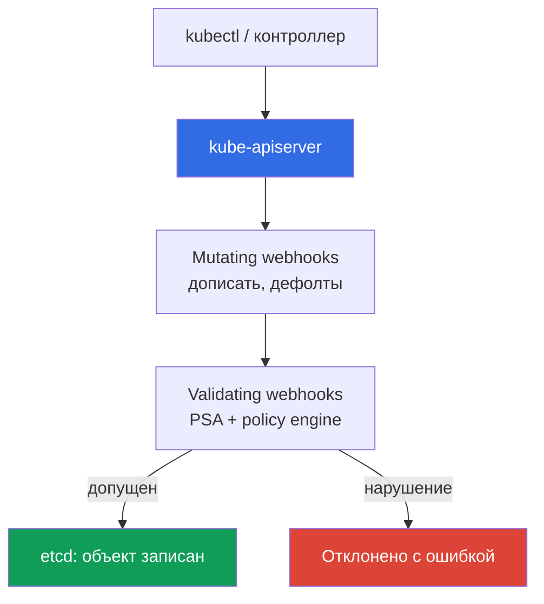
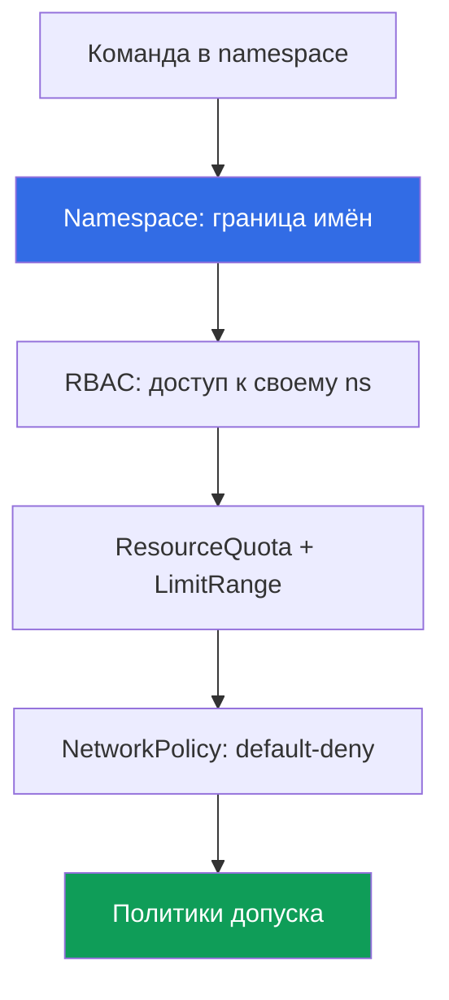

# Глава 22. Политики и мультитенантность: Kyverno и Gatekeeper, изоляция команд

> **Что дальше.** Глава 19 включила Pod Security Admission (PSA) - три готовых уровня
> privileged/baseline/restricted. Их хватает для базового харденинга пода, но не для своих
> правил и не для того, чтобы команды в кластере не мешали друг другу. Эта глава завершает
> Часть 3: policy engines (Kyverno, Gatekeeper) для правил, которых нет в PSA, и
> мультитенантность внутри кластера. Смежное - в других главах: PSA (глава 19), подпись образа
> (глава 20), RBAC (глава 5), NetworkPolicy (глава 30), квоты (глава 14), admission webhooks
> (глава 2), аккаунт как граница (главы 0.1, 32).

## 22.1. «PSA не умеет мои правила, а команды мешают друг другу»

PSA включён, restricted стоит на боевых namespace (глава 19), привилегированный под не пройдёт.
Кажется, admission под контролем. Но приходит требование, которого PSA не закрывает: запретить
образы не из своего ECR. PSA так не умеет - у него три фиксированных профиля, и **своё правило
в них не добавить**. Следом ещё: потребовать на поде label `owner` и `cost-center`, разрешить
только определённые StorageClass, не пускать `:latest`. Ничего из этого уровнями
baseline/restricted не выражается. PSA отвечает на «безопасен ли под по стандарту», но не на
«соответствует ли он **нашим** правилам».

Рядом живёт вторая боль - несколько команд в одном кластере наступают друг на друга:

- **Команда выкатила под без лимитов и выжрала ноду.** Под без `resources.limits` разросся по
  памяти, сработал OOM, соседние поды поехали. У namespace не было ResourceQuota, и одна
  команда утащила ресурсы всего узла (сайзинг и лимиты - глава 14).
- **Команда создала LoadBalancer в чужом namespace.** RBAC был выдан широко, инженер по ошибке
  задеплоил Service типа LoadBalancer в namespace другой команды, поднялся лишний NLB и счёт.

Первая боль лечится policy engine - навязать правила, которых нет в PSA. Вторая - изоляцией
команд внутри кластера: namespace, квоты, RBAC, сеть и те же политики допуска вместе.

## 22.2. Admission control как точка контроля

Прежде чем объект окажется в etcd, apiserver прогоняет его через admission-контроллеры (глава
2). Два вида webhook'ов делают всю расширяемую работу:

- **Mutating admission webhook** - вызывается первым, **может менять** объект: дописать label,
  проставить дефолтные `resources`, добавить sidecar.
- **Validating admission webhook** - вызывается после, **только проверяет**: пропустить или
  отклонить. Изменить объект он не может.



**Policy engine - это и есть admission webhook**, только правила ему задаёте вы. Он проверяет и
при желании меняет объекты по вашим правилам **до записи в etcd**. PSA - тоже
admission-контроллер, но с фиксированными профилями: где заканчивается PSA (три уровня, ничего
своего), там начинается policy engine. На практике их **комбинируют**: PSA держит базовый
уровень пода, движок добавляет остальное. Заменять PSA движком не нужно - это разные задачи.

## 22.3. Kyverno: политики как YAML-ресурсы

Kyverno - policy engine, где **политика это обычный YAML-ресурс Kubernetes**, без отдельного
языка. Пишете `ClusterPolicy` (действует на весь кластер) или `Policy` (в пределах namespace),
применяете через `kubectl apply`, читаете через `kubectl get`. Внутри политики - правила, и
каждое правило одного из типов:

- **validate** - проверить и запретить/потребовать (нет label - отклонить).
- **mutate** - дописать в объект (проставить дефолтный label или `resources`).
- **generate** - создать сопутствующий ресурс (например, NetworkPolicy на новый namespace).
- **verifyImages** - проверить подпись образа (тот самый шаг из главы 20 на admission).

Реакцию на нарушение задаёт `validationFailureAction`: `Enforce` - под **отклоняется**;
`Audit` - под создаётся, а нарушение попадает в policy report. Порядок внедрения тот же, что у
PSA (глава 19): сначала `Audit`, чтобы увидеть нарушителей, потом `Enforce`.

Пример validate - запретить тег `:latest` (правило требования `requests`/`limits` строится так
же, по `pattern` с `resources`):

```yaml
apiVersion: kyverno.io/v1
kind: ClusterPolicy
metadata:
  name: disallow-latest-tag
spec:
  validationFailureAction: Enforce        # нарушение -> под отклонён
  rules:
    - name: no-latest
      match:
        any:
          - resources:
              kinds: ["Pod"]
      validate:
        message: "тег :latest запрещён, деплой по версии или digest"
        pattern:
          spec:
            containers:
              - image: "!*:latest"          # образ не должен кончаться на :latest
```

Обязательные `requests`/`limits` - такой же validate с `pattern` на `resources` (значение
`?*` - любое непустое). Разрешить только свой ECR - validate по шаблону образа; проверить
подпись - правило `verifyImages` с доверенным ключом (механика - глава 20). Так движок
закрывает ровно требования из 22.1, которых нет в PSA.

## 22.4. Gatekeeper: политики на Rego

Gatekeeper - policy engine поверх Open Policy Agent (OPA), где правила пишут на языке **Rego**.
Устроен из двух ресурсов:

- **ConstraintTemplate** - шаблон: несёт код на Rego (правило `violation`) и схему параметров.
  Из него Gatekeeper создаёт новый вид ресурса (CRD).
- **Constraint** - экземпляр шаблона: говорит, **к чему** применить (какие kinds) и с какими
  параметрами.

Один шаблон «требовать labels» - и сколько угодно Constraint с разными наборами labels под
разные namespace. Пример - обязательный label (сокращённо):

```yaml
apiVersion: templates.gatekeeper.sh/v1
kind: ConstraintTemplate
metadata:
  name: k8srequiredlabels
spec:
  crd:
    spec:
      names:
        kind: K8sRequiredLabels
  targets:
    - target: admission.k8s.gatekeeper.sh
      rego: |
        package k8srequiredlabels
        violation[{"msg": msg}] {
          required := input.parameters.labels[_]
          not input.review.object.metadata.labels[required]
          msg := sprintf("missing label: %v", [required])
        }
---
apiVersion: constraints.gatekeeper.sh/v1beta1
kind: K8sRequiredLabels              # вид создан шаблоном выше
metadata:
  name: pods-must-have-owner
spec:
  match:
    kinds:
      - apiGroups: [""]
        kinds: ["Pod"]
  parameters:
    labels: ["owner", "cost-center"]  # обязательные labels
```

Rego мощнее YAML-шаблонов Kyverno для сложной логики, но у него **выше порог входа**: язык надо
освоить, отлаживать сложнее. Gatekeeper берут там, где нужен полноценный язык политик; Kyverno
выигрывает на декларативных правилах и когда нужны mutate/generate без отдельного языка.

## 22.5. Kyverno против Gatekeeper

Оба - admission webhook'и в кластере. Разница в языке, возможностях и пороге входа.

| Свойство | Kyverno | Gatekeeper (OPA) |
|---|---|---|
| Язык политик | YAML-ресурсы Kubernetes | Rego |
| Порог входа | низкий, знакомый синтаксис | выше, надо учить Rego |
| Модель | `ClusterPolicy`/`Policy` с правилами | `ConstraintTemplate` + `Constraint` |
| mutate (менять объект) | да, штатно | ограниченно (mutation отдельно) |
| generate (создавать ресурсы) | да | нет |
| verifyImages (подпись) | да, встроено | через отдельную интеграцию |
| Сила языка | шаблоны + CEL | полноценный Rego, сложная логика |
| Когда выбирать | декларативные правила, mutate/generate | нужен язык, сложные проверки |

Практический выбор: одному кластеру - один движок, не оба сразу (два admission webhook'а на те
же объекты усложняют отладку). Для большинства команд EKS Kyverno проще на старте; Gatekeeper
берут, когда правила перерастают декларативные шаблоны.

## 22.6. Что проверяют политиками на практике

Policy engine закрывает целый класс требований, которых нет в PSA. Типовой набор:

| Правило | Тип | Зачем |
|---|---|---|
| Запрет тега `:latest` | validate | воспроизводимость, деплой по digest (глава 20) |
| Обязательные `requests`/`limits` | validate | одна команда не выжрет ноду (глава 14) |
| Только доверенные реестры (свой ECR) | validate | не тянуть чужие образы (глава 20) |
| Обязательные labels/аннотации (owner, cost-center) | validate | владелец и учёт затрат |
| Запрет `hostPath`/`privileged` | validate | дополняет baseline/restricted PSA (глава 19) |
| Проверка подписи образа | verifyImages | только доверенный артефакт (глава 20) |
| Разрешённые StorageClass | validate | не создать том на дорогом/чужом классе (глава 23) |
| Разрешённые типы Service | validate | не поднять лишний LoadBalancer (глава 26) |
| Проставить дефолтные labels | mutate | единый учёт без правок манифестов |
| Создать NetworkPolicy на namespace | generate | сеть закрыта с рождения namespace (глава 30) |

Две последние строки - mutate и generate: движок не только запрещает, но дописывает объект и
создаёт ресурсы. Запрет `hostPath`/`privileged` пересекается с baseline/restricted PSA, и это
нормально: PSA держит стандарт, политика добавляет нюансы. Проверка подписи и реестра -
admission-звено цепочки supply chain из главы 20: ECR подписал, движок на входе проверил.

## 22.7. Мультитенантность внутри кластера: soft против hard

Мультитенантность - это несколько «арендаторов» (команд, окружений, клиентов) в одной
инфраструктуре. Есть два подхода, и выбор между ними фундаментальный.

- **Soft multi-tenancy** - арендаторы в **одном кластере**, разделённые namespace и механизмами
  Kubernetes (RBAC, ResourceQuota, LimitRange, NetworkPolicy, политики). Дёшево, но control
  plane и ядро нод общие.
- **Hard multi-tenancy** - арендаторы в **отдельных кластерах или аккаунтах** (главы 0.1, 32).
  Дороже и сложнее, но граница жёсткая: своё ядро, свой control plane.



Что даёт изоляцию в soft-модели: **namespace** как граница имён и область действия RBAC;
**RBAC** (глава 5) пускает команду только в свой namespace; **ResourceQuota и LimitRange**
(связь с сайзингом, глава 14) не дают одной команде выесть кластер; **NetworkPolicy** (глава
30) режет трафик между namespace; **политики допуска** навязывают обязательные правила.

Чего soft multi-tenancy **не даёт**: общий control plane (apiserver, etcd, scheduler одни на
всех) и общее ядро нод (поды команд делят ядро Linux, побег из контейнера через уязвимость ядра
пробивает границу namespace). namespace и RBAC - логические границы, а не изоляция ядра.

Правило выбора: доверенные команды одной организации - soft-модель в общем кластере; враждебные
или строго регулируемые арендаторы - hard, отдельные кластеры/аккаунты (главы 0.1, 32).

## 22.8. Изоляция команд предметно

Soft multi-tenancy собирается из слоёв, и каждый закрывает свою боль из 22.1. Namespace на
команду - базовая единица; на него навешивают остальное.

**ResourceQuota** ограничивает суммарное потребление namespace - чтобы одна команда не выжрала
кластер:

```yaml
apiVersion: v1
kind: ResourceQuota
metadata:
  name: team-a-quota
  namespace: team-a
spec:
  hard:
    requests.cpu: "10"              # суммарные requests всех подов ns
    requests.memory: 20Gi
    limits.memory: 40Gi
    pods: "50"
    services.loadbalancers: "2"     # не больше двух LB в namespace
```

**LimitRange** задаёт дефолты и границы на **отдельный контейнер** - чтобы под без явных
`resources` не стартовал безлимитным (боль из 22.1):

```yaml
apiVersion: v1
kind: LimitRange
metadata:
  name: team-a-limits
  namespace: team-a
spec:
  limits:
    - type: Container
      default:                      # limits, если не заданы в поде
        cpu: "500m"
        memory: 512Mi
      defaultRequest: {cpu: "100m", memory: 128Mi}   # requests, если не заданы
```

Поверх них: **RBAC** (глава 5) даёт роли только в своём namespace, так что LoadBalancer в чужом
не создать; **NetworkPolicy** (глава 30) с default-deny режет трафик между ns; **политики
допуска** навязывают обязательные правила - реестр, labels, типы Service. При наличии
ResourceQuota Kubernetes требует у каждого пода `requests`/`limits` - поэтому LimitRange с
дефолтами здесь не роскошь, а условие, чтобы поды вообще создавались.

## 22.9. Как это применяют в продакшене

- **Policy engine сначала в audit, потом в enforce.** Новую политику вводят в `Audit`
  (Kyverno) или на dry-run-подобном режиме, смотрят policy report на реальном трафике и лишь
  потом переводят в `Enforce` - иначе рискуют заблокировать легитимные деплои. Тот же путь, что
  у PSA (глава 19).
- **Политики как код в git.** `ClusterPolicy`/`ConstraintTemplate` лежат в репозитории и катятся
  через GitOps (глава 44), а не руками: история правил и ревью - в git.
- **PSA для базовых уровней плюс policy engine для остального.** PSA держит baseline/restricted
  на namespace (глава 19), движок добавляет реестр, labels, digest, типы Service - чего в PSA нет.
- **ResourceQuota и LimitRange на каждый namespace команды.** Namespace без квоты - команда без
  потолка; их ставят с созданием namespace, а не после первого инцидента с выжранной нодой.
- **Один движок на кластер и регулярный пересмотр.** Kyverno или Gatekeeper, но не оба на одни
  объекты; набор правил и лимиты пересматривают по мере роста нагрузок, иначе устаревшая
  политика ложно блокирует, а заниженная квота тормозит команду.

## 22.10. Мини-глоссарий

- **Admission webhook** - внешний обработчик, который apiserver зовёт до записи объекта в etcd;
  mutating меняет объект, validating только пропускает или отклоняет (глава 2).
- **Policy engine** - admission webhook с вашими правилами (Kyverno, Gatekeeper); проверяет и
  при необходимости меняет объекты по правилам до записи в etcd.
- **Kyverno** - policy engine, где политика это YAML-ресурс (`ClusterPolicy`/`Policy`) с
  правилами validate/mutate/generate/verifyImages; реакция - `Enforce`/`Audit`.
- **Gatekeeper** - policy engine поверх OPA; правила на Rego, модель `ConstraintTemplate`
  (шаблон + схема) плюс `Constraint` (экземпляр).
- **Soft multi-tenancy** - арендаторы в одном кластере (namespace, RBAC, ResourceQuota,
  LimitRange, NetworkPolicy, политики); общий control plane и ядро. **Hard multi-tenancy** -
  арендаторы в отдельных кластерах/аккаунтах; жёсткая граница ценой сложности (главы 0.1, 32).
- **ResourceQuota / LimitRange** - лимит суммарного потребления namespace и дефолты/границы на
  отдельный контейнер соответственно.

## 22.11. Итоги главы

- PSA (глава 19) даёт три фиксированных уровня и **не расширяется своими правилами** (чужой
  реестр, обязательный label, StorageClass). Это закрывает policy engine - admission webhook с
  вашими правилами.
- Admission control - точка контроля: mutating webhook меняет объект, validating пропускает или
  отклоняет, оба до записи в etcd. PSA и policy engine комбинируют, а не заменяют один другим.
- Kyverno - политики как YAML (`ClusterPolicy`/`Policy`), правила validate/mutate/generate и
  verifyImages, реакция `Enforce`/`Audit`, низкий порог входа. Gatekeeper - политики на Rego,
  `ConstraintTemplate` плюс `Constraint`; мощнее и сложнее. Один движок на кластер, не оба.
- Политиками навязывают то, чего нет в PSA: запрет `:latest`, обязательные `requests`/`limits`,
  доверенные реестры, обязательные labels, подпись образа, разрешённые StorageClass и Service.
- Мультитенантность внутри кластера - soft-модель: namespace, RBAC (глава 5), ResourceQuota и
  LimitRange (глава 14), NetworkPolicy (глава 30), политики. Она не даёт изоляции ядра и control
  plane - для враждебных арендаторов нужен hard (отдельные кластеры/аккаунты, главы 0.1, 32).

## 22.12. Как это пригодится в реальной работе

Требование «запретить образы не из нашего ECR», на которое PSA ответить не может, закрывается
одной `ClusterPolicy` - и на ревью видно правило, а не переписку. Инцидент «команда выжрала
ноду подом без лимитов» не случается там, где на namespace висит ResourceQuota и LimitRange с
дефолтами: под без `resources` либо получит дефолт, либо не создастся. А выбор soft против hard
multi-tenancy решается одним вопросом: доверяете ли вы арендаторам общее ядро - если нет, это
отдельный кластер или аккаунт, и решать это дешевле до, а не после побега из контейнера.

## 22.13. Вопросы для самопроверки

1. Почему PSA не закрывает требование «только образы из своего ECR» и что закрывает?
2. Чем mutating webhook отличается от validating и в каком порядке их зовёт apiserver?
3. Почему policy engine - это admission webhook и где заканчивается PSA, а начинается движок?
4. Какие типы правил есть у Kyverno и чем validate отличается от mutate и generate?
5. Что делает `validationFailureAction: Audit` против `Enforce` и почему начинают с Audit?
6. Из каких двух ресурсов состоит политика Gatekeeper и что несёт каждый?
7. На каком языке пишут правила Gatekeeper и в чём его плюс и минус против Kyverno?
8. Почему на один кластер берут один policy engine, а не оба сразу?
9. Чем soft multi-tenancy отличается от hard и что даёт изоляцию в soft-модели?
10. Чего soft multi-tenancy не даёт и когда из-за этого нужен hard?
11. Зачем на namespace команды и ResourceQuota, и LimitRange - что делает каждый?
12. Почему при наличии ResourceQuota LimitRange с дефолтами становится обязательным?

## Практика

Своей лабы у главы пока нет, но всё проверяется на живом кластере. Поставьте один policy engine
(Kyverno или Gatekeeper) через Helm и посмотрите ресурсы: `kubectl get clusterpolicy` для
Kyverno, `kubectl get constraints` для Gatekeeper. Примените `ClusterPolicy` из 22.3 с
`validationFailureAction: Audit`, задеплойте под с `nginx:latest` и найдите нарушение в policy
report (`kubectl get policyreport -A`). Переведите в `Enforce` и
убедитесь, что такой под теперь отклоняется на admission.

Дальше изоляция команды. Создайте namespace `team-a`, навесьте ResourceQuota и LimitRange из
22.8, создайте под без `resources` - он должен получить дефолты от LimitRange. Превысьте квоту
(`pods` или `requests.cpu`) и убедитесь, что лишний под не создаётся: `kubectl describe
resourcequota -n team-a` покажет использование против лимита. RBAC оставьте на главу 5,
NetworkPolicy default-deny - на главу 30, проверку подписи образа - связку с главой 20.

---
[Оглавление](../README_RU.md) · [Глава 21](../21/ru.md) · [Глава 23](../23/ru.md)
