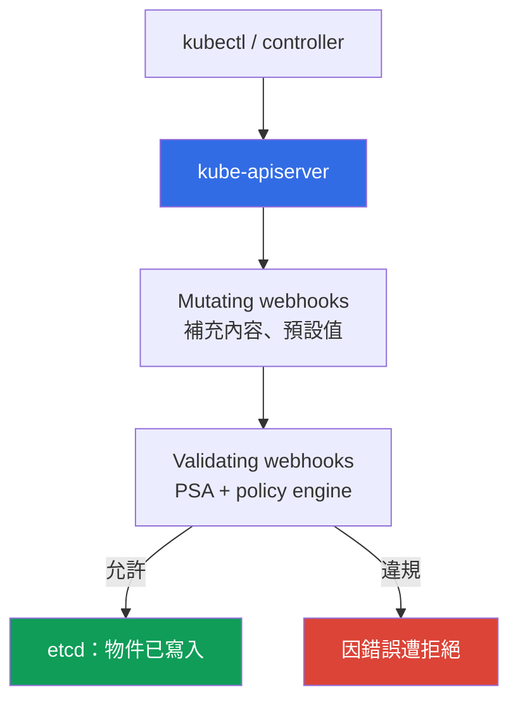
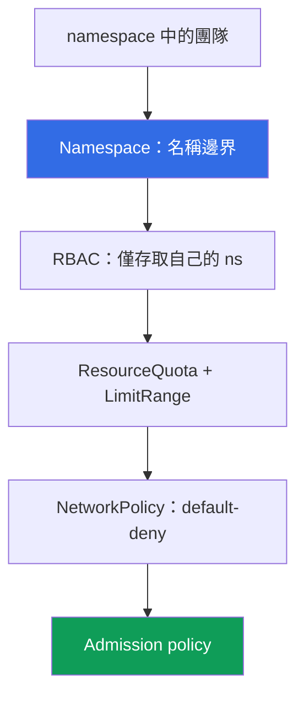

[Русская версия](ru.md) · [Eng version](en.md) · [Versión en español](es.md) · [Version française](fr.md) · [Deutsche Version](de.md) · [ქართული ვერსია](ge.md) · [日本語版](jp.md)
# 第 22 章。政策與多租戶：Kyverno、Gatekeeper 與團隊隔離

> **接下來。** 第 19 章啟用了 Pod Security Admission (PSA)，它有三個現成層級：privileged/baseline/restricted。它們足以進行基本的 Pod 強化，但無法滿足自訂規則，也無法避免叢集中的團隊彼此干擾。本章完成第 3 部分：使用 policy engine（Kyverno、Gatekeeper）處理 PSA 沒有的規則，以及叢集內的多租戶。相關主題位於其他章節：PSA（第 19 章）、映像簽署（第 20 章）、RBAC（第 5 章）、NetworkPolicy（第 30 章）、配額（第 14 章）、admission webhook（第 2 章），以及帳戶作為邊界（第 0.1、32 章）。

## 22.1.「PSA 無法處理我的規則，團隊又彼此干擾」

PSA 已啟用，production namespace 使用 restricted（第 19 章），privileged Pod 無法通過。看來 admission 已受到控制。但出現了 PSA 無法涵蓋的要求：禁止非自家 ECR 的映像。PSA 做不到，因為它只有三個固定 profile，且**無法加入自訂規則**。接著還有：要求 Pod 具有 `owner` 與 `cost-center` label、只允許特定 StorageClass、不允許 `:latest`。baseline/restricted 層級無法表達以上任何要求。PSA 回答的是「此 Pod 是否符合標準安全要求」，而不是「它是否符合**我們的**規則」。

另一個痛點也同時存在，單一叢集中的多個團隊彼此踩到對方：

- **團隊部署了沒有 limit 的 Pod 並耗盡節點。** 未設 `resources.limits` 的 Pod 記憶體不斷成長，引發 OOM，鄰近 Pod 受到影響。namespace 沒有 ResourceQuota，單一團隊耗用了整個節點的資源（sizing 與 limit 請見第 14 章）。
- **團隊在別人的 namespace 建立 LoadBalancer。** RBAC 授權範圍過大，工程師誤在另一團隊的 namespace 部署 LoadBalancer 類型的 Service，因而建立多餘的 NLB 並產生帳單。

第一個痛點以 policy engine 解決，也就是強制 PSA 沒有的規則。第二個痛點以叢集內的團隊隔離解決：將 namespace、配額、RBAC、網路及同一套 admission policy 結合使用。

## 22.2. Admission control 作為控制點

物件寫入 etcd 前，apiserver 會讓它通過 admission controller（第 2 章）。兩種 webhook 執行所有可擴充的工作：

- **Mutating admission webhook**：最先呼叫，**可修改**物件，例如補上 label、設定預設 `resources`、新增 sidecar。
- **Validating admission webhook**：之後呼叫，**僅驗證**，允許或拒絕，無法修改物件。



**Policy engine 本身就是 admission webhook**，只是規則由您定義。它會依照您的規則驗證，必要時修改物件，且都在**寫入 etcd 前**完成。PSA 也是 admission controller，但它使用固定 profile：PSA 的邊界是三個層級且無法自訂，超出這個邊界便是 policy engine 的範圍。實務上會**結合**兩者：PSA 維持 Pod 的基礎層級，engine 補上其他規則。無須用 engine 取代 PSA，兩者處理不同問題。

自 Kubernetes 1.30 起，apiserver 提供不需 webhook 的**內建**替代方案 `ValidatingAdmissionPolicy`：直接在 resource 中以 **CEL**（Common Expression Language）撰寫規則，並且在**apiserver 內部、沒有外部 webhook** 的情況下驗證。沒有獨立的 engine Pod，也沒有可能無回應並中斷 admission 的網路呼叫（此風險及 `failurePolicy` 請見 22.9）。模型使用兩種 resource：`ValidatingAdmissionPolicy`（在 `validations` 中包含 CEL 規則）和 `ValidatingAdmissionPolicyBinding`（套用目標與反應）。以下為與 22.3 Kyverno 相同的 `:latest` 禁止規則，但不使用第三方 engine：

```yaml
apiVersion: admissionregistration.k8s.io/v1
kind: ValidatingAdmissionPolicy
metadata:
  name: disallow-latest-tag
spec:
  matchConstraints:
    resourceRules:
      - apiGroups: [""]
        apiVersions: ["v1"]
        operations: ["CREATE", "UPDATE"]
        resources: ["pods"]
  validations:
    - expression: "object.spec.containers.all(c, !c.image.endsWith(':latest'))"
      message: "禁止使用 :latest tag"
---
apiVersion: admissionregistration.k8s.io/v1
kind: ValidatingAdmissionPolicyBinding
metadata:
  name: disallow-latest-tag-binding
spec:
  policyName: disallow-latest-tag
  validationActions: ["Deny"]        # rollout 時使用 Audit/Warn，之後改為 Deny
```

內建驗證適合不需要 mutate/generate 的簡單檢查；複雜邏輯、映像簽署及 resource 生成則仍交由 Kyverno/Gatekeeper。

## 22.3. Kyverno：將政策作為 YAML resource

Kyverno 是一個 policy engine，**policy 是一般的 Kubernetes YAML resource**，不需另一種語言。您可撰寫 `ClusterPolicy`（作用於整個叢集）或 `Policy`（限於 namespace），以 `kubectl apply` 套用，並以 `kubectl get` 讀取。policy 內含規則，每個規則屬於下列一種：

- **validate**：驗證並禁止或要求（缺少 label 就拒絕）。
- **mutate**：補入物件內容（設定預設 label 或 `resources`）。
- **generate**：建立相關 resource（例如為新 namespace 建立 NetworkPolicy）。
- **verifyImages**：驗證映像簽署（第 20 章的 admission 步驟）。

違規反應由 `validationFailureAction` 指定：`Enforce` 會**拒絕** Pod；`Audit` 會建立 Pod，並將違規寫入 policy report。導入順序與 PSA 相同（第 19 章）：先採用 `Audit` 以找出違規者，再切換至 `Enforce`。

以下是 validate 範例，禁止 `:latest` tag（要求 `requests`/`limits` 的規則也以相同方式建立，即對含有 `resources` 的 `pattern`）：

```yaml
apiVersion: kyverno.io/v1
kind: ClusterPolicy
metadata:
  name: disallow-latest-tag
spec:
  validationFailureAction: Enforce        # 違規 -> Pod 遭拒絕
  rules:
    - name: no-latest
      match:
        any:
          - resources:
              kinds: ["Pod"]
      validate:
        message: "禁止使用 :latest tag，請依版本或 digest 部署"
        pattern:
          spec:
            containers:
              - image: "!*:latest"          # 映像不得以 :latest 結尾
```

強制 `requests`/`limits` 使用對 `resources` 的 `pattern` 建立相同的 validate 規則（值 `?*` 代表任何非空值）。只允許自家 ECR 時，對映像 pattern 進行 validate；驗證簽署時，使用受信任金鑰的 `verifyImages` 規則（機制請見第 20 章）。因此 engine 恰好能處理 22.1 中 PSA 沒有的要求。

## 22.4. Gatekeeper：以 Rego 撰寫政策

Gatekeeper 是建立在 Open Policy Agent（OPA）上的 policy engine，規則使用 **Rego** 語言撰寫。它由兩種 resource 組成：

- **ConstraintTemplate**：template，包含 Rego 程式碼（`violation` 規則）及參數 schema。Gatekeeper 會依此建立新的 resource 類型（CRD）。
- **Constraint**：template 的 instance，指定**套用對象**（哪些 kind）及參數。

只需一個「要求 labels」template，便可對不同 namespace 建立任意多個具有不同 label 集合的 Constraint。以下為必填 label 範例（縮減版）：

```yaml
apiVersion: templates.gatekeeper.sh/v1
kind: ConstraintTemplate
metadata:
  name: k8srequiredlabels
spec:
  crd:
    spec:
      names:
        kind: K8sRequiredLabels
  targets:
    - target: admission.k8s.gatekeeper.sh
      rego: |
        package k8srequiredlabels
        violation[{"msg": msg}] {
          required := input.parameters.labels[_]
          not input.review.object.metadata.labels[required]
          msg := sprintf("missing label: %v", [required])
        }
---
apiVersion: constraints.gatekeeper.sh/v1beta1
kind: K8sRequiredLabels              # 此類型由上方 template 建立
metadata:
  name: pods-must-have-owner
spec:
  match:
    kinds:
      - apiGroups: [""]
        kinds: ["Pod"]
  parameters:
    labels: ["owner", "cost-center"]  # 必填 labels
```

相較於 Kyverno 的 YAML pattern，Rego 對複雜邏輯更強大，但**入門門檻較高**：必須學習語言，也較難除錯。需要完整 policy language 時可選 Gatekeeper；Kyverno 則適合宣告式規則，以及不想另學語言卻需要 mutate/generate 的情況。

## 22.5. Kyverno 與 Gatekeeper 比較

兩者都是叢集中的 admission webhook。差異在於語言、功能和入門門檻。

| 特性 | Kyverno | Gatekeeper (OPA) |
|---|---|---|
| 政策語言 | Kubernetes YAML resource | Rego |
| 入門門檻 | 低，語法熟悉 | 較高，必須學習 Rego |
| 模型 | 含規則的 `ClusterPolicy`/`Policy` | `ConstraintTemplate` + `Constraint` |
| mutate（修改物件） | 是，原生支援 | 有限（mutation 分開處理） |
| generate（建立 resource） | 是 | 否 |
| verifyImages（簽署） | 是，內建 | 透過獨立整合 |
| 語言能力 | pattern + CEL | 完整 Rego，複雜邏輯 |
| 選用時機 | 宣告式規則、mutate/generate | 需要語言與複雜驗證 |

實務選擇是：一個叢集使用一個 engine，不要同時使用兩個（兩個 admission webhook 處理相同物件會使除錯更複雜）。對多數 EKS 團隊而言，Kyverno 較容易上手；當規則超出宣告式 pattern 時再選 Gatekeeper。

## 22.6. 實務上以政策檢查什麼

Policy engine 可涵蓋 PSA 沒有的一整類要求。典型集合如下：

| 規則 | 類型 | 原因 |
|---|---|---|
| 禁止 `:latest` tag | validate | 可重現性，依 digest 部署（第 20 章） |
| 必填 `requests`/`limits` | validate | 避免一個團隊耗盡節點（第 14 章） |
| 僅信任的 registry（自家 ECR） | validate | 不拉取外部映像（第 20 章） |
| 必填 labels/annotations（owner、cost-center） | validate | 擁有者與成本核算 |
| 禁止 `hostPath`/`privileged` | validate | 補充 baseline/restricted PSA（第 19 章） |
| 映像簽署驗證 | verifyImages | 僅允許受信任 artifact（第 20 章） |
| 允許的 StorageClass | validate | 不在昂貴或其他團隊的 class 建立 volume（第 23 章） |
| 允許的 Service 類型 | validate | 避免建立多餘的 LoadBalancer（第 26 章） |
| 設定預設 labels | mutate | 不修改 manifest 也能統一核算 |
| 為 namespace 建立 NetworkPolicy | generate | namespace 建立時網路即為封閉狀態（第 30 章） |

最後兩列是 mutate 和 generate：engine 不只禁止，也會補充物件內容及建立 resource。禁止 `hostPath`/`privileged` 與 baseline/restricted PSA 有重疊，這是正常的：PSA 維持標準，policy 補充細節。簽署和 registry 驗證是第 20 章 supply chain 的 admission 環節：ECR 簽署後，engine 在入口驗證。

## 22.7. 叢集內多租戶：soft 與 hard

多租戶是在同一 infrastructure 中有多個「tenant」（團隊、環境或客戶）。有兩種作法，選擇至關重要。

- **Soft multi-tenancy**：tenant 位於**同一叢集**，以 namespace 及 Kubernetes 機制（RBAC、ResourceQuota、LimitRange、NetworkPolicy、policy）隔離。成本低，但 control plane 和 node kernel 共用。
- **Hard multi-tenancy**：tenant 位於**獨立叢集或帳戶**（第 0.1、32 章）。成本較高、較複雜，但邊界嚴格：各自有 kernel 與 control plane。



soft 模型中提供隔離的內容包括：作為名稱邊界及 RBAC 範圍的 **namespace**；**RBAC**（第 5 章）讓團隊僅能進入自己的 namespace；**ResourceQuota 與 LimitRange**（與 sizing 相關，見第 14 章）避免單一團隊耗盡叢集；**NetworkPolicy**（第 30 章）限制 namespace 間的流量；**admission policy** 強制必要規則。

soft multi-tenancy **無法提供**的內容是共用的 control plane（apiserver、etcd、scheduler 為所有人共用）與 node kernel（各團隊 Pod 共用 Linux kernel，透過 kernel 漏洞逃逸 container 可突破 namespace 邊界）。namespace 和 RBAC 是邏輯邊界，並非 kernel 隔離。

選擇原則：同一組織內彼此信任的團隊適合共用叢集的 soft 模型；敵對或嚴格受監管的 tenant 則適合 hard 模型，使用獨立叢集或帳戶（第 0.1、32 章）。

## 22.8. 具體的團隊隔離

Soft multi-tenancy 由多個層組成，每一層處理 22.1 的不同痛點。每個團隊一個 namespace 是基本單位，並在其上加上其他機制。

**ResourceQuota** 限制 namespace 的總用量，避免單一團隊耗盡叢集：

```yaml
apiVersion: v1
kind: ResourceQuota
metadata:
  name: team-a-quota
  namespace: team-a
spec:
  hard:
    requests.cpu: "10"              # ns 中所有 Pod 的 requests 總和
    requests.memory: 20Gi
    limits.memory: 40Gi
    pods: "50"
    services.loadbalancers: "2"     # namespace 中最多兩個 LB
```

**LimitRange** 為**單一 container**設定預設值及界限，使未明確設定 `resources` 的 Pod 不會以無限制方式啟動（22.1 的痛點）：

```yaml
apiVersion: v1
kind: LimitRange
metadata:
  name: team-a-limits
  namespace: team-a
spec:
  limits:
    - type: Container
      default:                      # Pod 未設定時的 limits
        cpu: "500m"
        memory: 512Mi
      defaultRequest: {cpu: "100m", memory: 128Mi}   # Pod 未設定時的 requests
```

此外，**RBAC**（第 5 章）僅在自己的 namespace 授予角色，因此無法在別人的 namespace 建立 LoadBalancer；具備 default-deny 的 **NetworkPolicy**（第 30 章）限制 ns 間流量；**admission policy** 強制必要規則，例如 registry、labels、Service 類型。存在 ResourceQuota 時，Kubernetes 要求每個 Pod 都有 `requests`/`limits`，因此具有預設值的 LimitRange 並非可有可無，而是讓 Pod 能夠建立的前提。

## 22.9. 在 production 中如何套用

- **規則 rollout：`Audit`/`Warn` -> `PolicyReport` -> `Enforce`。** 新 policy 先以 `Audit`（Kyverno）或警告導入，依真實流量收集 `PolicyReport` 並找出違規者，最後才轉為 `Enforce`，否則會阻擋合法部署。這與 PSA（第 19 章）相同；對 `ValidatingAdmissionPolicyBinding` 而言，使用相同的 `validationActions`：`Audit`/`Warn` -> `Deny`。
- **`failurePolicy`：先 `Ignore`，後 `Fail`。** Engine 的 webhook 註冊了 `failurePolicy`：設為 `Fail` 時，無法使用的 webhook **會停止 admission**，部署將停擺；設為 `Ignore` 時，物件會略過檢查而通過。Rollout 時設定 `Ignore`，並對 webhook error 和 timeout 發出 alert，只有在穩定後才改為 `Fail`。內建的 `ValidatingAdmissionPolicy` 沒有這項風險，因驗證在 apiserver 內執行（22.2）。
- **將政策作為 git 中的程式碼。** `ClusterPolicy`/`ConstraintTemplate` 放在 repository，透過 GitOps（第 44 章）部署，而非手動操作，如此規則歷史與 review 都在 git 中。
- **PSA 處理基礎層級，policy engine 處理其他內容。** PSA 對 namespace 維持 baseline/restricted（第 19 章），engine 補充 registry、labels、digest、Service 類型等 PSA 沒有的要求。
- **每個團隊 namespace 都設定 ResourceQuota 與 LimitRange。** 沒有 quota 的 namespace 代表團隊沒有上限；應在建立 namespace 時設定，而非等到第一次節點被耗盡的 incident 後。
- **每個叢集一個 engine 並定期檢討。** 使用 Kyverno 或 Gatekeeper，但不是兩者同時處理相同物件；隨工作負載成長檢討規則集與 limit，否則過時 policy 會誤擋，而過低 quota 會拖慢團隊。

## 22.10. 小型詞彙表

- **Admission webhook**：apiserver 在物件寫入 etcd 前呼叫的外部 handler；mutating 會修改物件，validating 僅允許或拒絕（第 2 章）。
- **Policy engine**：包含您自訂規則的 admission webhook（Kyverno、Gatekeeper）；在寫入 etcd 前依規則驗證，必要時修改物件。
- **Kyverno**：policy 是 YAML resource（`ClusterPolicy`/`Policy）的 policy engine，具 validate/mutate/generate/verifyImages 規則；反應為 `Enforce`/`Audit`。
- **Gatekeeper**：建立於 OPA 的 policy engine；規則使用 Rego，模型為 `ConstraintTemplate`（template + schema）加上 `Constraint`（instance）。
- **ValidatingAdmissionPolicy**：內建於 apiserver 的 CEL 驗證（Kubernetes 1.30+），沒有外部 webhook；搭配 `ValidatingAdmissionPolicyBinding`（套用目標與反應 `Deny`/`Warn`/`Audit`）。
- **failurePolicy**：webhook 無法使用時的反應：`Fail` 停止 admission，`Ignore` 讓物件略過檢查。
- **Soft multi-tenancy**：tenant 位於同一叢集（namespace、RBAC、ResourceQuota、LimitRange、NetworkPolicy、policy），共用 control plane 和 kernel。**Hard multi-tenancy**：tenant 位於獨立叢集或帳戶，以複雜性換取嚴格邊界（第 0.1、32 章）。
- **ResourceQuota / LimitRange**：分別是 namespace 總用量限制，以及單一 container 的預設值與界限。

## 22.11. 本章總結

- PSA（第 19 章）提供三個固定層級，且**不能以自訂規則擴充**（外部 registry、必填 label、StorageClass）。這些要求由 policy engine，也就是含有自訂規則的 admission webhook 處理。
- Admission control 是控制點：mutating webhook 修改物件，validating webhook 允許或拒絕，兩者都在寫入 etcd 前執行。PSA 與 policy engine 應結合使用，不是彼此取代。1.30 起也有基於 CEL 的內建 `ValidatingAdmissionPolicy`，可在沒有外部 webhook 下驗證。
- Kyverno 將政策寫成 YAML（`ClusterPolicy`/`Policy`），有 validate/mutate/generate 和 verifyImages 規則，反應為 `Enforce`/`Audit`，入門門檻低。Gatekeeper 使用 Rego，採用 `ConstraintTemplate` 加 `Constraint`；更強大也更複雜。每個叢集僅使用一個 engine，不要同時使用兩個。
- 政策可強制 PSA 沒有的要求：禁止 `:latest`、必填 `requests`/`limits`、受信任 registry、必填 labels、映像簽署、允許的 StorageClass 與 Service。
- 叢集內多租戶是 soft 模型：namespace、RBAC（第 5 章）、ResourceQuota 與 LimitRange（第 14 章）、NetworkPolicy（第 30 章）及 policy。它不提供 kernel 與 control plane 隔離，敵對 tenant 需要 hard 模型，也就是獨立叢集或帳戶（第 0.1、32 章）。

## 22.12. 這在實際工作中如何派上用場

「禁止非自家 ECR 的映像」這項 PSA 無法回答的要求，可用單一 `ClusterPolicy` 處理，因此 review 時可看到規則，而不是訊息往來。只要 namespace 設定 ResourceQuota 與具有預設值的 LimitRange，「團隊以無 limit Pod 耗盡節點」的 incident 就不會發生：未設定 `resources` 的 Pod 不是取得預設值，就是無法建立。而選擇 soft 或 hard multi-tenancy 只要回答一個問題：是否信任 tenant 共用 kernel？若否，便應使用獨立叢集或帳戶，而且在 container escape 發生前做出這項決定的成本更低。

## 22.13. 自我檢查問題

1. 為何 PSA 無法滿足「僅允許自家 ECR 的映像」要求？什麼可以處理？
2. Mutating webhook 與 validating webhook 有何不同？apiserver 呼叫它們的順序是什麼？
3. 為何 policy engine 是 admission webhook？PSA 的範圍在哪裡結束，而 engine 從哪裡開始？
4. Kyverno 有哪些規則類型？validate 與 mutate、generate 有何不同？
5. `validationFailureAction: Audit` 與 `Enforce` 分別做什麼？為何先從 Audit 開始？
6. Gatekeeper policy 由哪兩種 resource 組成？各自承載什麼？
7. Gatekeeper 規則使用什麼語言？相對於 Kyverno 的優點與缺點是什麼？
8. 為何每個叢集只選一個 policy engine，而不同時使用兩者？
9. Soft multi-tenancy 與 hard 有何不同？soft 模型中的哪些內容提供隔離？
10. Soft multi-tenancy 缺少什麼？何時因而需要 hard？
11. 為何團隊 namespace 同時需要 ResourceQuota 和 LimitRange？各自做什麼？
12. 為何存在 ResourceQuota 時，具有預設值的 LimitRange 變成必需？
13. 內建的 CEL `ValidatingAdmissionPolicy` 與 webhook engine 有何不同？rollout 中的 `failurePolicy: Ignore`/`Fail` 又與此有何關係？

## 實作練習

本課程與此主題相關的 lab：[lab 127：不使用 engine 的政策，基於 CEL 的 ValidatingAdmissionPolicy](../../labs/127/README_TW.MD)。在其中，您將撰寫禁止 `:latest` tag 的 CEL 規則，經歷 `Audit` -> `Deny` 的流程並看到 apiserver 的拒絕訊息，新增第二項政策以強制 `resources.requests`，並理解為何內建驗證沒有「webhook 沒有回應」的風險；使用 `check_result` 指令驗證。啟動方式為 `TASK=127 make run_eks_task`。

Lab 不會安裝 Kyverno 或 Gatekeeper，但在實際叢集上親自比較它們的行為很有幫助。透過 Helm 安裝一個 policy engine（Kyverno 或 Gatekeeper）並檢視 resource：Kyverno 使用 `kubectl get clusterpolicy`，Gatekeeper 使用 `kubectl get constraints`。套用 22.3 的 `ClusterPolicy`，設定 `validationFailureAction: Audit`，部署含有 `nginx:latest` 的 Pod，並在 policy report 找到違規（`kubectl get policyreport -A`）。切換至 `Enforce`，確認該 Pod 現在會在 admission 時遭拒絕。不使用第三方 engine 時，使用 22.2 的內建 `ValidatingAdmissionPolicy` 建立相同禁止規則（`kubectl get validatingadmissionpolicy`），先從 `validationActions: ["Audit"]` 開始。

接著進行團隊隔離。建立 namespace `team-a`，套用 22.8 的 ResourceQuota 與 LimitRange，建立未設定 `resources` 的 Pod，它應取得 LimitRange 的預設值。超出 quota（`pods` 或 `requests.cpu`）後，確認多餘的 Pod 無法建立：`kubectl describe resourcequota -n team-a` 會顯示用量相對於 limit。RBAC 請參閱第 5 章，default-deny NetworkPolicy 請參閱第 30 章，映像簽署驗證請結合第 20 章。

---
[目錄](../README_TW.md) · [第 21 章](../21/tw.md) · [第 23 章](../23/tw.md)
