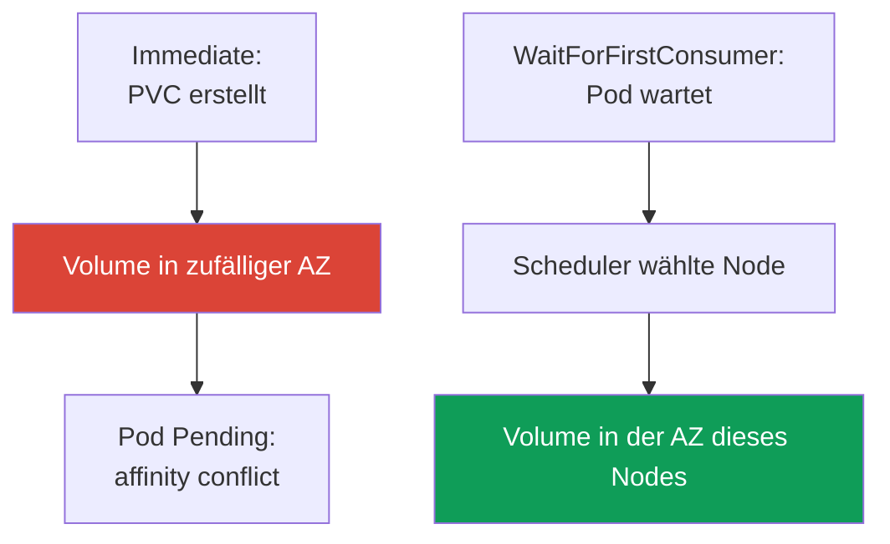
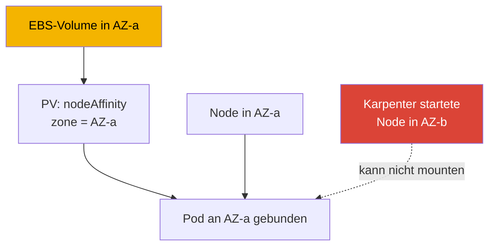

[Русская версия](ru.md) · [Eng version](en.md) · [Versión en español](es.md) · [Version française](fr.md) · [ქართული ვერსია](ge.md) · [繁體中文版](tw.md) · [日本語版](jp.md)
# Kapitel 23. EBS CSI: gp3, StorageClass, Erweiterung, Snapshots, AZ-Bindung

> **Was als Nächstes kommt.** Teil 3 endete mit Sicherheit, Teil 4 beginnt mit Speicher. Dieses
> Kapitel behandelt EBS-Blockspeicher: Ein Volume befindet sich in einer Availability Zone (AZ)
> und wird nur an eine Instance dieser Zone gemountet. Die gesamte Besonderheit dreht sich um
> diese Tatsache. Gemeinsamer Schreibzugriff vieler Pods und Betrieb über AZs hinweg sind EFS
> und FSx (Kapitel 24), Objektspeicher über Mountpoint behandelt Kapitel 25. Die Rolle für den
> CSI-Treiber wird über IRSA oder Pod Identity vergeben (Kapitel 16-17) - darauf verweisen wir,
> ohne es zu wiederholen. Karpenter und die Konsolidierung, die Nodes zwischen AZs verschiebt,
> behandelt Kapitel 12, Volume-Backups über AWS Backup Kapitel 41. PV, PVC und StatefulSet
> kennen Sie aus CKA; hier geht es um die Besonderheiten von EBS in einer konkreten Zone.

## 23.1. „Der StatefulSet-Pod hängt in Pending, und das Volume wurde schon in der falschen Zone erstellt“

Ein Szenario, das fast alle erleben, die einen StatefulSet auf ein frisches EKS umziehen. Der PVC
wurde erstellt, der PV erscheint, aber der Pod startet nicht:

```bash
kubectl describe pod db-0
# Events:
#   Warning  FailedScheduling  default-scheduler
#     0/6 nodes are available: 6 node(s) had volume node affinity conflict.
```

Die Schlüsselworte sind `volume node affinity conflict`. Das Volume wurde bereits bereitgestellt,
aber der Scheduler kann den Pod auf keinen Node setzen. Sehen wir uns an, wo das Volume genau
liegt:

```bash
kubectl get pv -o yaml | grep -A6 nodeAffinity
#   nodeAffinity:
#     required:
#       nodeSelectorTerms:
#       - matchExpressions:
#         - key: topology.ebs.csi.aws.com/zone
#           values: [eu-central-1c]
```

Das Volume wurde in `eu-central-1c` erstellt, aber die freien Nodes für die Workload befinden
sich in `eu-central-1a` und `eu-central-1b`. Ein EBS-Volume kann nicht an eine Instance in einer
anderen Zone gemountet werden - daher der Konflikt.

Die Ursache ist `volumeBindingMode: Immediate` in der StorageClass: Das Volume wird unmittelbar
nach dem Erscheinen des PVC bereitgestellt, bevor bekannt ist, wohin der Pod kommt. Daher wird die
Zone willkürlich gewählt, und der Scheduler muss die `nodeAffinity` des Volumes beachten und
findet keinen Node. `WaitForFirstConsumer` behebt das - der Kern dieses Kapitels. Zuerst sehen
wir uns jedoch den Treiber an.

## 23.2. EBS-CSI-Treiber: Managed Add-on statt in-tree

Historisch wurde EBS über den eingebauten in-tree-Provisioner `kubernetes.io/aws-ebs`
angebunden. Er ist **deprecated**: Er wird nicht weiterentwickelt, beherrscht keine Snapshots und
unterstützt kein `gp3` (nur `io1`, `gp2`, `sc1`, `st1`). Seit EKS 1.23 ist die CSI-Migration
aktiviert, und ein separater CSI-Treiber **aws-ebs-csi-driver** mit dem Provisioner
`ebs.csi.aws.com` verwaltet EBS. Er wird als **managed addon** installiert - mit
Versionierung und Updates über die API:

```bash
aws eks create-addon --cluster-name demo --addon-name aws-ebs-csi-driver \
  --service-account-role-arn arn:aws:iam::111122223333:role/eks-ebs-csi-driver
```

Der Treiber benötigt eine IAM-Rolle: Der Controller ruft die EC2-API auf (`CreateVolume`,
`AttachVolume`, `CreateSnapshot`). Die Rolle wird über IRSA oder EKS Pod Identity vergeben
(Kapitel 16-17), ihr ARN wird an `--service-account-role-arn` übergeben, und die fertige
managed Policy ist `AmazonEBSCSIDriverPolicy`. Ohne Rolle erhält der Controller bei
`CreateVolume` ein `AccessDenied`, und der PVC bleibt aus einem anderen Grund in `Pending`:
Niemand kann das Volume erstellen.

> **EKS Auto Mode - separater Provisioner.** Im Auto Mode (Kapitel 9) verwendet die
> StorageClass `ebs.csi.eks.amazonaws.com` statt `ebs.csi.aws.com`. Das sind unterschiedliche
> Treiber; ein Volume des einen wird nicht vom anderen übernommen. Hier geht es um das
> standardmäßige `ebs.csi.aws.com`.

## 23.3. StorageClass für gp3

`gp3` ist der aktuelle universelle SSD-Typ: Anders als bei `gp2`, bei dem IOPS und Durchsatz
zusammen mit der Volume-Größe wachsen, werden sie bei `gp3` **unabhängig** von der Größe
festgelegt (grundlegende 3000 IOPS und 125 MiB/s bei jeder Größe). Für die meisten Workloads ist
`gp3` besser als `gp2`.

Eine EKS-Besonderheit: **Die Standard-StorageClass im Cluster ist `gp2` über den in-tree-
Provisioner**. Das bleibt aus historischen Gründen so, und ein PVC ohne explizites
`storageClassName` verwendet sie. Eine StorageClass für `gp3` muss **explizit erstellt** und
bei Bedarf zur Standardklasse gemacht werden.

```yaml
apiVersion: storage.k8s.io/v1
kind: StorageClass
metadata:
  name: gp3
  annotations:
    storageclass.kubernetes.io/is-default-class: "true"
provisioner: ebs.csi.aws.com
volumeBindingMode: WaitForFirstConsumer
allowVolumeExpansion: true
parameters:
  type: gp3
  iops: "3000"
  throughput: "125"
  encrypted: "true"
  kmsKeyId: arn:aws:kms:eu-central-1:111122223333:key/abcd-1234
```

| Parameter in `parameters` | Zweck | Hinweis |
|---|---|---|
| `type` | Volume-Typ: `gp3`, `io2`, `st1` | für CSI standardmäßig `gp3` |
| `iops` | Ziel-IOPS | bei `gp3` unabhängig von der Größe |
| `throughput` | Durchsatz, MiB/s | nur für `gp3` |
| `encrypted` | Volume-Verschlüsselung | immer aktivieren |
| `kmsKeyId` | KMS-Schlüssel | ohne ihn der Standardschlüssel |

Bei `kmsKeyId` gibt es einen separaten Fallstrick. Handelt es sich um einen eigenen customer
managed key, genügt eine IAM-Policy für die Treiberrolle nicht: **Auch die Policy des Schlüssels
muss diese Rolle erlauben**. Erforderlich sind `kms:GenerateDataKey*`, `kms:Decrypt`,
`kms:DescribeKey`, `kms:ReEncrypt*` und, am wichtigsten, `kms:CreateGrant`: Die
EBS-Verschlüsselung arbeitet über Grants, und ohne die Berechtigung, sie zu erstellen, kann der
Treiber das Volume zwar erstellen, **es aber nicht an die Instance mounten**. Das Symptom ist
eindeutig: Der PVC ist `Bound`, aber der Pod hängt, und in den Events steht `AccessDenied` von
KMS, obwohl die IAM-Policy der Rolle korrekt aussieht. Den Grant beschränkt man üblicherweise
mit der Bedingung `kms:GrantIsForAWSResource`. Die Schlüssel-Policy muss immer geprüft werden,
wenn der Schlüssel nicht durch denselben Code wie der Cluster erstellt wurde, und besonders,
wenn der Schlüssel in einem anderen Account liegt: Dort ist die Berechtigung in der key policy
zwingend erforderlich (Treiberrolle: Kapitel 16 und 17).

Ein normaler PVC für diese Klasse und der Befehl zum Prüfen der Standardklasse:

```yaml
apiVersion: v1
kind: PersistentVolumeClaim
metadata: {name: data}
spec:
  storageClassName: gp3
  accessModes: ["ReadWriteOnce"]
  resources:
    requests: {storage: 20Gi}
```

```bash
kubectl get storageclass
# gp2 (default)  kubernetes.io/aws-ebs  WaitForFirstConsumer  false
# gp3            ebs.csi.aws.com        WaitForFirstConsumer  true
```

## 23.4. volumeBindingMode im Detail

Dies ist der wichtigste Parameter der StorageClass für EBS und mit ihm hängt das Problem aus
23.1 zusammen. Er bestimmt, **wann** das Volume im Verhältnis zum Scheduling des Pods erstellt
wird.



- **`Immediate`** - das Volume wird sofort erstellt, wenn der PVC erscheint. Der Treiber weiß
  noch nicht, wohin der Pod kommt, und wählt die Zone willkürlich. Kann der Pod später nicht in
  dieser Zone platziert werden, treten `volume node affinity conflict` und ein dauerhafter
  `Pending` auf.
- **`WaitForFirstConsumer`** - das Provisioning wird bis zum Scheduling des Pods verschoben.
  Der Scheduler wählt einen Node unter Berücksichtigung von Ressourcen, taints und affinity;
  erst dann erstellt der Treiber das Volume in der Zone des gewählten Nodes. Die Topologie des
  Volumes stimmt dadurch mit dem Pod überein.

| Eigenschaft | `Immediate` | `WaitForFirstConsumer` |
|---|---|---|
| Wann wird das Volume erstellt? | beim Erscheinen des PVC | beim Scheduling des Pods |
| Wer wählt die AZ? | Treiber, willkürlich | Scheduler, am Ort des Pods |
| Risiko eines affinity conflict | hoch | keines |
| PVC ohne Pod | Volume bereits erstellt und hängt | `Pending`, das ist normal |
| Für EBS | nicht verwenden | Standard |

Die Schlussfolgerung ist einfach: **Für EBS immer `WaitForFirstConsumer`**. Der Nebeneffekt ist,
dass ein PVC ohne laufenden Pod in `Pending` bleibt, was erwartet ist. Soll die Menge der Zonen
beschränkt werden, legt man in der StorageClass `allowedTopologies` mit dem Schlüssel
`topology.ebs.csi.aws.com/zone` und einer Liste erlaubter Zonen fest.

## 23.5. AZ-Bindung: Warum sie alles bestimmt

Ein EBS-Volume ist eine zonale Ressource: Es wird in einer konkreten AZ erstellt und nur an eine
EC2-Instance **derselben Zone** gemountet. Dies ist eine AWS-Einschränkung, keine von Kubernetes,
und daraus folgt die gesamte Mechanik.



Die Bindungskette: Das Volume befindet sich in AZ-a; der CSI-Treiber setzt im PV die
`nodeAffinity` auf `topology.ebs.csi.aws.com/zone = eu-central-1a`; der Scheduler platziert
einen Pod mit diesem PVC nur auf einem Node in AZ-a; gibt es in AZ-a keinen geeigneten Node,
bleibt der Pod in `Pending`, bis einer erscheint.

Daraus folgt die Konsequenz für das Autoscaling. Startet Karpenter oder Cluster Autoscaler einen
Node in einer anderen Zone, wird ein Pod mit bereits vorhandenem Volume nicht darauf platziert;
umgekehrt kann die Karpenter-Konsolidierung (Kapitel 12) eine StatefulSet-Replik nicht in eine
andere AZ verschieben - die Zone des Volumes hält sie fest. Kapazität muss unter der Annahme
geplant werden, dass Volumes Pods an Zonen „festnageln“.

Bei einem StatefulSet mit `volumeClaimTemplates` erhält jede Replik ihr eigenes Volume und ist an
ihre Zone gebunden. Damit sich die Replikate nicht in einer AZ sammeln, werden sie über
`topologySpreadConstraints` mit `topologyKey: topology.kubernetes.io/zone` und `maxSkew: 1`
verteilt (Zuverlässigkeit: Kapitel 40).

Die zweite Seite derselben Einschränkung ist der **Zugriffsmodus**. Bei EBS ist dies fast immer
`ReadWriteOnce`: Das Volume wird an einen Node gemountet, und `ReadWriteMany` im Sinn von
„mehrere Pods sollen in dieselben Dateien schreiben“ funktioniert hier nicht. Es gibt außerdem
`ReadWriteOncePod` - die strenge Variante, bei der genau ein Pod das Volume erhält, nützlich
gegen einen versehentlichen zweiten Schreiber. Die einzige und eng begrenzte Ausnahme ist EBS
Multi-Attach für den Typ `io2`; der Treiber unterstützt ihn **nur im Blockmodus**
(`volumeMode: Block`), innerhalb einer AZ und ohne Dateisystem. Die Anwendung muss das geteilte
Blockgerät selbst nutzen können, beispielsweise über ein Cluster-Dateisystem. Daraus wird kein
EFS-Ersatz: Gemeinsamer Dateizugriff mehrerer Pods, insbesondere aus verschiedenen Zonen, wird
über EFS oder FSx gelöst (Kapitel 24).

## 23.6. Volume-Erweiterung

Ein EBS-Volume kann im laufenden Betrieb **vergrößert** werden, wenn in der StorageClass
`allowVolumeExpansion: true` gesetzt ist (siehe 23.3). Anschließend genügt es, die Anforderung
im PVC zu erhöhen:

```bash
kubectl patch pvc data -p '{"spec":{"resources":{"requests":{"storage":"50Gi"}}}}'
```

Der CSI-Treiber ruft die Volume-Modifikation in EC2 auf und erweitert das Dateisystem. Bei `gp3`
geschieht das online, ohne den Pod anzuhalten. Wichtige Einschränkungen:

- **nur nach oben** - ein EBS-Volume lässt sich weder über PVC noch in AWS verkleinern; eine
  PVC-Anforderung unterhalb der aktuellen Größe wird abgelehnt;
- **Häufigkeitslimit** für Änderungen eines Volumes: Die nächste Modifikation ist erst möglich,
  nachdem die vorherige den Zustand `completed` erreicht hat, und es sind höchstens vier
  Änderungen in gleitenden 24 Stunden erlaubt. Die Modifikation eines großen Volumes (etwa
  1 TiB) kann dabei bis zu sechs Stunden dauern; häufige aufeinanderfolgende Erweiterungen
  stoßen daher an das Limit (beachten Sie die EBS-Dokumentation).

Eine Erweiterung ist ein regulärer Vorgang, aber kein Werkzeug für häufige kleine Anpassungen:
Planen Sie eine sinnvolle Startgröße und erweitern Sie in merklichen Schritten.

## 23.7. Snapshots

Snapshots arbeiten über eine separate Komponente, den CSI snapshotter, mit drei Objekten:

| Objekt | Rolle | Analogie |
|---|---|---|
| `VolumeSnapshotClass` | wie Snapshots erstellt werden (Treiber, Parameter) | wie StorageClass |
| `VolumeSnapshot` | Anfrage „Snapshot dieses PVC erstellen“ | wie PVC |
| `VolumeSnapshotContent` | der tatsächliche Snapshot in AWS | wie PV |

Ein Snapshot wird über einen Verweis auf den PVC angefordert:

```yaml
apiVersion: snapshot.storage.k8s.io/v1
kind: VolumeSnapshot
metadata: {name: db-snap}
spec:
  volumeSnapshotClassName: ebs-snapclass   # driver: ebs.csi.aws.com
  source:
    persistentVolumeClaimName: data
```

Die Wiederherstellung erfolgt über einen normalen PVC mit `dataSource`, wobei `kind:
VolumeSnapshot`, `name: db-snap` und `apiGroup: snapshot.storage.k8s.io` sowie das benötigte
`storageClassName` gesetzt werden. Die Besonderheit bei Zonen: Der EBS-Snapshot selbst ist ein
**regionales** Objekt, aber das daraus wiederhergestellte Volume wird erneut in **einer konkreten
AZ** erstellt (mit `WaitForFirstConsumer` in der Zone des Pods). Der Snapshot übersteht den
Ausfall einer Zone als Daten, aber das wiederhergestellte Volume ist erneut zonal und erlaubt
keine „Verteilung“ der Workload über AZs. Vollständige geplante Backups übernimmt AWS Backup
(Kapitel 41); CSI-Snapshots sind dessen Baustein.

## 23.8. Diagnose

Die drei häufigsten Situationen.

| Symptom | Ursache | Was prüfen? |
|---|---|---|
| `Pending`, `volume node affinity conflict` | Volume in einer AZ, Nodes in einer anderen | Zone in der `nodeAffinity` des PV |
| PVC lange `Pending`, kein PV | keine Treiberrolle oder `WaitForFirstConsumer` ohne Pod | Controller-Logs, ob es einen Pod gibt |
| `Pending`, `gp3` nicht unterstützt | StorageClass auf in-tree-Provisioner | `provisioner` in der StorageClass |
| PVC `Bound`, Pod startet nicht, `AccessDenied` von KMS | Treiberrolle darf kein `kms:CreateGrant` | Policy des CMK selbst, Pod-Events |

Zuerst prüft man den Modus der vorhandenen StorageClass - er erklärt die meisten „zonalen“
Incidents:

```bash
kubectl get storageclass gp3 -o jsonpath='{.volumeBindingMode}'
```

Ein weiterer tückischer Fall ist **„funktioniert zufällig“**. Steht bei einer StorageClass
`Immediate`, aber alle Cluster-Nodes befinden sich in einer AZ, entsteht kein Konflikt: Es gibt
nur eine Zone für alle. Die Konfiguration wirkt funktionsfähig, bis der Cluster in eine zweite AZ
erweitert wird (oder Karpenter einen Node in einer anderen Zone startet) - dann erscheint
`Pending` „aus heiterem Himmel“. Eine glückliche Konfiguration lässt sich von einer korrekten nur
an `volumeBindingMode` unterscheiden: `WaitForFirstConsumer` ist immer korrekt, `Immediate`
funktioniert nur bis zur ersten Abweichung der Zonen.

## 23.9. Anwendung in der Produktion

- **`gp3` als explizite StorageClass.** Verlassen Sie sich nicht auf das Standard-`gp2`:
  Erstellen Sie eine StorageClass mit `ebs.csi.aws.com`, Typ `gp3` und den benötigten
  IOPS/Durchsatz.
- **Immer `WaitForFirstConsumer`.** Der einzige korrekte Modus für zonales EBS; `Immediate`
  bleibt allenfalls dort, wo die Topologie garantiert nur eine Zone hat.
- **Sofort `allowVolumeExpansion: true`.** Das Volume nachträglich ohne dieses Flag zu
  erweitern, ist nicht möglich.
- **Verschlüsselung standardmäßig.** `encrypted: "true"` in jeder StorageClass, der
  KMS-Schlüssel wird bewusst gewählt.
- **Snapshots plus Verständnis der Zonalität.** Regelmäßige Snapshots (oder AWS Backup,
  Kapitel 41), aber die Wiederherstellung ergibt erneut ein zonales Volume. Zugriff über AZs
  hinweg benötigt EFS (Kapitel 24).
- **Kapazität nach Zonen planen.** Ein Volume bindet einen Pod an seine AZ;
  StatefulSet-Replikate werden über `topologySpreadConstraints` verteilt.

## 23.10. Mini-Glossar

- **EBS-CSI-Treiber** - `aws-ebs-csi-driver`, ein managed addon mit dem Provisioner
  `ebs.csi.aws.com`; verwaltet den Lebenszyklus von EBS-Volumes.
- **in-tree-Provisioner** - der eingebaute `kubernetes.io/aws-ebs`, deprecated, ohne `gp3` und
  Snapshots; das Standard-`gp2` in EKS verwendet ihn weiterhin.
- **`volumeBindingMode`** - wann ein Volume provisioniert wird: `Immediate` (beim Erscheinen
  des PVC) oder `WaitForFirstConsumer` (beim Scheduling des Pods).
- **volume node affinity conflict** - Scheduler-Event, wenn die `nodeAffinity` des Volumes auf
  eine Zone ohne geeigneten Node zeigt.
- **EBS-Zugriffsmodi** - `ReadWriteOnce` (ein Node) und `ReadWriteOncePod` (genau ein Pod);
  `ReadWriteMany` ist nur als Multi-Attach `io2` im Modus `volumeMode: Block` in einer AZ und
  ohne Dateisystem möglich. Gemeinsamer Dateizugriff erfolgt über EFS oder FSx (Kapitel 24).
- **`kms:CreateGrant`** - die Berechtigung, ohne die der Treiber ein Volume mit eigenem CMK
  erstellt, aber nicht mountet: EBS-Verschlüsselung läuft über Grants, und die Berechtigung ist
  auch in der Schlüssel-Policy nötig.
- **VolumeSnapshot / Content / Class** - Objekte für CSI-Snapshots: Anfrage, Snapshot in AWS,
  Klasse.
- **`allowVolumeExpansion`** - StorageClass-Flag, das die Vergrößerung eines Volumes durch
  Erhöhen des PVC erlaubt.

## 23.11. Zusammenfassung des Kapitels

- Ein EBS-Volume ist zonal: Es wird in einer AZ erstellt und nur an eine Instance dieser Zone
  gemountet. Dies bestimmt die gesamte Besonderheit des Speichers in EKS.
- Das typische Problem ist ein StatefulSet-Pod in `Pending` mit `volume node affinity conflict`:
  Das Volume wurde in einer Zone erstellt, die Nodes für die Workload befinden sich in einer
  anderen. Ursache ist `Immediate` in der StorageClass.
- EBS wird durch den CSI-Treiber `ebs.csi.aws.com` (managed addon) mit einer Rolle über
  IRSA/Pod Identity (Kapitel 16-17) verwaltet; in-tree `kubernetes.io/aws-ebs` ist deprecated.
  Die Standard-StorageClass in EKS ist in-tree-`gp2`; `gp3` (IOPS und Durchsatz unabhängig von
  der Größe) wird explizit festgelegt.
- `volumeBindingMode: WaitForFirstConsumer` ist für EBS verpflichtend: Das Volume wird in der
  Zone des gewählten Nodes erstellt. `Immediate` führt zu Zonenkonflikten.
- Das Volume bindet einen Pod über die `nodeAffinity` des PV an seine AZ; Karpenter verschiebt
  eine Replik nicht in eine andere AZ (Kapitel 12), StatefulSet-Replikate werden über
  `topologySpreadConstraints` verteilt.
- Erweiterung ist nur nach oben möglich, mit `allowVolumeExpansion`, online für `gp3` und mit
  einem Häufigkeitslimit.
- CSI-Snapshots: Der Snapshot ist regional, das wiederhergestellte Volume jedoch erneut zonal.
  Vollständige geplante Backups übernimmt AWS Backup (Kapitel 41).

## 23.12. Nutzen in der täglichen Arbeit

Im Bereitschaftsdienst lassen sich die meisten „zonalen“ Incidents mit einer Prüfung schließen:
`kubectl get pv -o yaml` auf die Zone in `nodeAffinity` und `volumeBindingMode` der
StorageClass. `Immediate` plus `volume node affinity conflict` - die Ursache ist gefunden und
wird durch die Umstellung auf `WaitForFirstConsumer` und das Neuerstellen des PVC behoben.
Denken Sie bei der Kapazitätsplanung daran, dass das Volume den Pod an die Zone bindet:
Skalierung, Konsolidierung und Updates können eine Workload mit ihrem Volume nicht in eine
benachbarte AZ verschieben. Die gefährlichste Konfiguration ist jedoch „funktioniert zufällig“
in einer Zone: Sie bricht an dem Tag, an dem auf eine zweite AZ erweitert wird.

## 23.13. Fragen zur Selbstkontrolle

1. Warum kann ein StatefulSet-Pod mit dem Event `volume node affinity conflict` in `Pending`
hängen?
2. Wie lässt sich anhand von `kubectl get pv -o yaml` feststellen, in welcher AZ ein Volume
erstellt wurde?
3. Worin unterscheidet sich `Immediate` von `WaitForFirstConsumer`, und warum wird für EBS
letzteres benötigt?
4. Warum bleibt ein PVC ohne laufenden Pod bei `WaitForFirstConsumer` in `Pending` - und warum
ist das normal?
5. Was kann der in-tree-Provisioner `kubernetes.io/aws-ebs` nicht, und welche StorageClass ist
in EKS standardmäßig gesetzt?
6. Warum benötigt der EBS-CSI-Treiber eine IAM-Rolle, und welches Kapitel beschreibt deren
Vergabe?
7. Wie bindet ein EBS-Volume einen Pod an eine Zone, und warum verschiebt Karpenter eine Replik
nicht in eine andere AZ?
8. Wie werden StatefulSet-Replikate über Zonen verteilt, und warum ist das bei zonalen Volumes
nötig?
9. Welche Einschränkungen gelten für die Erweiterung eines EBS-Volumes, und was ist grundsätzlich
nicht möglich?
10. In welcher Zone befindet sich ein Volume aus einem Snapshot, und warum löst ein Snapshot
nicht die Aufgabe des Zugriffs über AZs hinweg?
11. Wie lässt sich eine korrekte Speicherkonfiguration von einer „glücklichen“ unterscheiden, die
in einer AZ funktioniert?
12. Ein Volume mit eigenem KMS-Schlüssel wurde erstellt, aber der Pod startet nicht. Welche
Berechtigung ist wo genau zu prüfen?
13. Warum ermöglicht `ReadWriteMany` mehreren Pods nicht die Arbeit mit Dateien auf einem
EBS-Volume, und was bleibt die einzige Ausnahme?

## Practice

Das Kurs-Lab zu diesem Thema: [Lab 106 - EBS CSI: gp3, AZ-Bindung, Erweiterung,
Snapshot](../../labs/106/README_DE.MD). EBS CSI wirkt auch in
[Lab 122 - AWS Backup für EKS](../../labs/122/README_DE.MD) als Volume hinter dem PVC mit, das
im Backup landet, und wird mit EFS in [Lab 107 - EFS CSI: ReadWriteMany zwischen Availability
Zones](../../labs/107/README_DE.MD) verglichen. Darüber hinaus wird alles auf einem laufenden
Cluster geprüft. Beginnen Sie mit `kubectl get storageclass` - welche StorageClass ist die
Standardklasse, welchen `volumeBindingMode` und welchen `provisioner` hat sie? Stellen Sie
sicher, dass der EBS-CSI-Treiber installiert ist: `aws eks list-addons --cluster-name
<cluster>` und `kubectl get pods -n kube-system | grep ebs-csi`.

Reproduzieren Sie anschließend das Problem aus 23.1: Erstellen Sie eine StorageClass mit
`volumeBindingMode: Immediate`, starten Sie einen StatefulSet mit `volumeClaimTemplates` in
einem Cluster mit Nodes in mehreren AZs und finden Sie den Pod in `Pending`. Sehen Sie sich
`kubectl describe pod <pod>` (Event `volume node affinity conflict`) und `kubectl get pv -o
yaml` (Zone in `nodeAffinity`) an. Erstellen Sie die StorageClass dann mit
`WaitForFirstConsumer`, `allowVolumeExpansion: true`, `encrypted: "true"` neu, erstellen Sie
den PVC neu und vergewissern Sie sich, dass das Volume in der Zone des Pods erstellt wird.
Üben Sie die Erweiterung über `kubectl patch pvc`, erstellen Sie anschließend einen
`VolumeSnapshot`, stellen Sie daraus einen PVC wieder her und prüfen Sie mit `kubectl get pv -o
yaml`, dass die Zone des wiederhergestellten Volumes mit der Zone des Pods übereinstimmt.

---
[Inhaltsverzeichnis](../README_DE.md) · [Kapitel 22](../22/de.md) · [Kapitel 24](../24/de.md)
