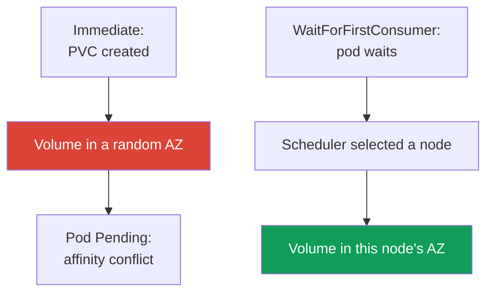
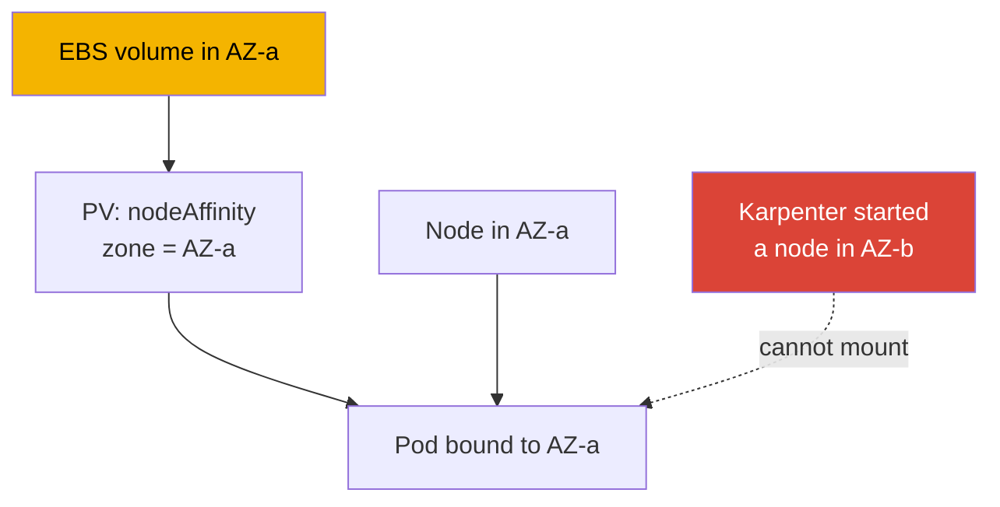

[Русская версия](ru.md) · [Versión en español](es.md) · [Version française](fr.md) · [Deutsche Version](de.md) · [ქართული ვერსია](ge.md) · [繁體中文版](tw.md) · [日本語版](jp.md)
# Chapter 23. EBS CSI: gp3, StorageClass, expansion, snapshots, AZ binding

> **What comes next.** Part 3 ended with security; Part 4 opens with storage. This chapter is
> about EBS block storage: a volume lives in one Availability Zone (AZ) and mounts only to an
> instance in that zone, and every specific detail follows from that fact. Shared write access
> from many pods and operation across AZs are for EFS and FSx (chapter 24); object storage via
> Mountpoint is chapter 25. The CSI driver's role is granted through IRSA or Pod Identity
> (chapters 16-17) - we refer to that rather than repeat it. Karpenter and consolidation that
> move nodes between AZs are covered in chapter 12, and backing up volumes through AWS Backup is
> chapter 41. You know PVs, PVCs, and StatefulSets from CKA; this chapter covers EBS specifics
> in a particular zone.

## 23.1. "A StatefulSet pod is stuck in Pending, and the volume was already created in the wrong place"

This is a scenario encountered by almost everyone moving a StatefulSet to a fresh EKS cluster.
The PVC was created, the PV appeared, but the pod does not start:

```bash
kubectl describe pod db-0
# Events:
#   Warning  FailedScheduling  default-scheduler
#     0/6 nodes are available: 6 node(s) had volume node affinity conflict.
```

The key words are `volume node affinity conflict`. The volume has already been provisioned, but
the scheduler cannot place the pod on any node. Check exactly where the volume ended up:

```bash
kubectl get pv -o yaml | grep -A6 nodeAffinity
#   nodeAffinity:
#     required:
#       nodeSelectorTerms:
#       - matchExpressions:
#         - key: topology.ebs.csi.aws.com/zone
#           values: [eu-central-1c]
```

The volume was created in `eu-central-1c`, while free nodes for the workload are in
`eu-central-1a` and `eu-central-1b`. An EBS volume cannot mount to an instance in another zone,
hence the conflict.

The cause is `volumeBindingMode: Immediate` in the StorageClass: the volume is provisioned as
soon as the PVC appears, before it is known where the pod will be placed, so the zone is chosen
arbitrarily. The scheduler must respect the volume's `nodeAffinity` and finds no nodes.
`WaitForFirstConsumer` fixes this - it is the core of this chapter. First, though, let us cover
the driver.

## 23.2. EBS CSI driver: managed addon instead of in-tree

Historically, EBS was attached through the built-in in-tree provisioner `kubernetes.io/aws-ebs`.
It is **deprecated**: it is no longer developed, cannot create snapshots, and does not support
`gp3` (only `io1`, `gp2`, `sc1`, and `st1`). Starting with EKS 1.23, CSI migration is enabled,
and EBS is handled by the separate **aws-ebs-csi-driver** CSI driver with the
`ebs.csi.aws.com` provisioner. Install it as a **managed addon** - with versioning and updates
through the API:

```bash
aws eks create-addon --cluster-name demo --addon-name aws-ebs-csi-driver \
  --service-account-role-arn arn:aws:iam::111122223333:role/eks-ebs-csi-driver
```

The driver needs an IAM role: the controller calls EC2 APIs (`CreateVolume`, `AttachVolume`,
`CreateSnapshot`). Grant the role through IRSA or EKS Pod Identity (chapters 16-17), pass its ARN
in `--service-account-role-arn`, and use the ready-made managed policy
`AmazonEBSCSIDriverPolicy`. Without a role, the controller receives `AccessDenied` for
`CreateVolume`, and the PVC gets stuck in `Pending` for a different reason - nothing can create
the volume.

> **EKS Auto Mode is a separate provisioner.** In Auto Mode (chapter 9), the StorageClass uses
> `ebs.csi.eks.amazonaws.com`, not `ebs.csi.aws.com`. These are different drivers; one does not
> pick up the other's volumes. This chapter covers standard `ebs.csi.aws.com`.

## 23.3. StorageClass for gp3

`gp3` is the current general-purpose SSD: unlike `gp2`, where IOPS and throughput increase
along with volume size, `gp3` sets them **independently** of capacity (a baseline of 3,000 IOPS
and 125 MiB/s at any size). For most workloads, `gp3` is better than `gp2`.

An EKS nuance: **the default StorageClass in the cluster is `gp2` through the in-tree
provisioner**. It remains for historical reasons, and a PVC without an explicit
`storageClassName` will use it. You must **explicitly create** a StorageClass for `gp3` and can
make it the default if desired.

```yaml
apiVersion: storage.k8s.io/v1
kind: StorageClass
metadata:
  name: gp3
  annotations:
    storageclass.kubernetes.io/is-default-class: "true"
provisioner: ebs.csi.aws.com
volumeBindingMode: WaitForFirstConsumer
allowVolumeExpansion: true
parameters:
  type: gp3
  iops: "3000"
  throughput: "125"
  encrypted: "true"
  kmsKeyId: arn:aws:kms:eu-central-1:111122223333:key/abcd-1234
```

| `parameters` setting | Purpose | Note |
|---|---|---|
| `type` | volume type: `gp3`, `io2`, `st1` | `gp3` is the CSI default |
| `iops` | target IOPS | independent of size for `gp3` |
| `throughput` | throughput, MiB/s | only for `gp3` |
| `encrypted` | volume encryption | always enable it |
| `kmsKeyId` | KMS key | without it, the default key is used |

There is a separate trap with `kmsKeyId`. If it is your customer managed key, an IAM policy on
the driver's role alone is insufficient: **the key policy itself must also allow that role**.
You need `kms:GenerateDataKey*`, `kms:Decrypt`, `kms:DescribeKey`, `kms:ReEncrypt*`, and most
importantly `kms:CreateGrant`: EBS encryption works through grants, and without permission to
create them, the driver creates the volume but **cannot mount it to the instance**. The symptom
is recognizable: the PVC is `Bound`, but the pod is stuck, and its events show `AccessDenied`
from KMS even though the role's IAM policy looks correct. The grant is usually limited with the
`kms:GrantIsForAWSResource` condition. Always check the key policy when the key was not created
by the same code as the cluster, especially when it lives in another account: a permission in the
key policy is mandatory there (the driver role is covered in chapters 16 and 17).

A regular PVC for this class and a command to check the default class:

```yaml
apiVersion: v1
kind: PersistentVolumeClaim
metadata: {name: data}
spec:
  storageClassName: gp3
  accessModes: ["ReadWriteOnce"]
  resources:
    requests: {storage: 20Gi}
```

```bash
kubectl get storageclass
# gp2 (default)  kubernetes.io/aws-ebs  WaitForFirstConsumer  false
# gp3            ebs.csi.aws.com        WaitForFirstConsumer  true
```

## 23.4. volumeBindingMode in detail

This is the key StorageClass setting for EBS, and it is directly related to the problem in 23.1.
It determines **when** a volume is created relative to pod scheduling.



- **`Immediate`** - the volume is created as soon as the PVC appears. The driver does not yet
  know where the pod will be placed and chooses a zone arbitrarily. If the pod later cannot be
  placed in that zone, the result is `volume node affinity conflict` and permanent `Pending`.
- **`WaitForFirstConsumer`** - provisioning is deferred until the pod is scheduled. The
  scheduler selects a node considering resources, taints, and affinity; the driver then creates
  the volume in the selected node's zone. The volume topology matches the pod by construction.

| Property | `Immediate` | `WaitForFirstConsumer` |
|---|---|---|
| When the volume is created | when the PVC appears | when the pod is scheduled |
| Who selects the AZ | the driver, arbitrarily | the scheduler, based on pod placement |
| Risk of affinity conflict | high | none |
| PVC without a pod | volume is already created and idle | `Pending`, which is normal |
| For EBS | do not use | default |

The conclusion is simple: **always use `WaitForFirstConsumer` for EBS**. A side effect is that a
PVC without a running pod remains `Pending`, which is expected. To limit the set of zones, set
`allowedTopologies` in the StorageClass with the key `topology.ebs.csi.aws.com/zone` and a list
of allowed zones.

## 23.5. AZ binding: why it determines everything

An EBS volume is a zonal resource: it is created in a particular AZ and mounts only to an
EC2 instance in **that same zone**. This is an AWS limitation, not Kubernetes, and it drives the
entire mechanism.



The binding chain is as follows: the volume lives in AZ-a; the CSI driver sets PV
`nodeAffinity` to `topology.ebs.csi.aws.com/zone = eu-central-1a`; the scheduler places a pod
with this PVC only on a node in AZ-a; if no suitable node exists in AZ-a, the pod remains
`Pending` until one appears.

This has implications for autoscaling. If Karpenter or Cluster Autoscaler starts a node in a
different zone, a pod with an existing volume cannot land on it; conversely, Karpenter
consolidation (chapter 12) cannot move a StatefulSet replica into another AZ - the volume's zone
keeps it in place. Plan capacity with the understanding that volumes "nail" pods to zones.

For a StatefulSet with `volumeClaimTemplates`, every replica gets its own volume and is bound to
its own zone. To avoid gathering replicas in one AZ, spread them using
`topologySpreadConstraints` with `topologyKey: topology.kubernetes.io/zone` and `maxSkew: 1`
(reliability is covered in chapter 40).

The other half of the same limitation is the **access mode**. For EBS, this is almost always
`ReadWriteOnce`: a volume mounts to one node, and `ReadWriteMany` does not work as a way to let
multiple pods write to the same files. There is also `ReadWriteOncePod`, a strict variant where
exactly one pod gets the volume, useful to prevent an accidental second writer. There is one
narrow exception: EBS Multi-Attach for `io2`, and the driver supports it **only in block mode**
(`volumeMode: Block`), within one AZ, without a file system. The application itself must know how
to use the shared block device, for example through a clustered file system. This cannot replace
EFS: shared file access for multiple pods, especially from different zones, is solved through EFS
or FSx (chapter 24).

## 23.6. Volume expansion

An EBS volume can be **increased** online if the StorageClass has `allowVolumeExpansion: true`
(see 23.3). Then simply increase the request in the PVC:

```bash
kubectl patch pvc data -p '{"spec":{"resources":{"requests":{"storage":"50Gi"}}}}'
```

The CSI driver calls EC2 to modify the volume and expands the file system. For `gp3`, this
happens online without stopping the pod. The important limitations are:

- **up only** - you cannot shrink an EBS volume through either a PVC or AWS; a PVC request
  smaller than the current size will be rejected;
- a **rate limit** applies to changes of a single volume: the next modification is possible only
  after the preceding one reaches the `completed` state, and no more than four changes are
  allowed in a rolling 24-hour period. A modification of a large volume (about 1 TiB) can itself
  take up to six hours, so frequent successive expansions hit the limit (check the EBS
  documentation).

Expansion is a normal operation, but not a tool for frequent minor adjustments: choose a
reasonable initial size and expand in meaningful increments.

## 23.7. Snapshots

Snapshots work through a separate component, the CSI snapshotter, with three objects:

| Object | Role | Analogy |
|---|---|---|
| `VolumeSnapshotClass` | how to create snapshots (driver, parameters) | like a StorageClass |
| `VolumeSnapshot` | a request to "snapshot this PVC" | like a PVC |
| `VolumeSnapshotContent` | the actual snapshot in AWS | like a PV |

Request a snapshot with a reference to the PVC:

```yaml
apiVersion: snapshot.storage.k8s.io/v1
kind: VolumeSnapshot
metadata: {name: db-snap}
spec:
  volumeSnapshotClassName: ebs-snapclass   # driver: ebs.csi.aws.com
  source:
    persistentVolumeClaimName: data
```

Restoration uses a regular PVC with `dataSource`, where `kind: VolumeSnapshot`, `name: db-snap`,
and `apiGroup: snapshot.storage.k8s.io`, plus the desired `storageClassName`. The zonal nuance
is that an EBS snapshot itself is a **regional** object, but the volume restored from it is again
created in a **specific AZ** (with `WaitForFirstConsumer`, in the pod's zone). A snapshot
survives the loss of a zone as data, but the restored volume is zonal again and does not let you
"spread" the workload between AZs. Full scheduled backups are AWS Backup (chapter 41); CSI
snapshots are a building block beneath it.

## 23.8. Troubleshooting

The three most common situations are:

| Symptom | Cause | What to check |
|---|---|---|
| `Pending`, `volume node affinity conflict` | volume in one AZ, nodes in another | zone in the PV's `nodeAffinity` |
| PVC is `Pending` for a long time, no PV | no driver role, or `WaitForFirstConsumer` without a pod | controller logs, whether a pod exists |
| `Pending`, `gp3` unsupported | StorageClass uses the in-tree provisioner | `provisioner` in the StorageClass |
| PVC `Bound`, pod does not start, KMS `AccessDenied` | the driver role is not allowed `kms:CreateGrant` | the CMK key policy itself, pod events |

First, check the mode of the existing StorageClass - it explains most "zonal" incidents:

```bash
kubectl get storageclass gp3 -o jsonpath='{.volumeBindingMode}'
```

A separate insidious case is **"it works by accident"**. If a StorageClass uses `Immediate`,
but every cluster node happens to be in one AZ, there is no conflict: there is one zone for
everyone. The configuration looks functional until the cluster expands into a second AZ (or
Karpenter starts a node in another zone), when `Pending` appears "out of nowhere". You can
distinguish a lucky configuration from a correct one only by `volumeBindingMode`:
`WaitForFirstConsumer` is always correct, while `Immediate` works only until zones diverge.

## 23.9. How this is used in production

- **An explicit `gp3` StorageClass.** Do not rely on default `gp2`: create a StorageClass with
  `ebs.csi.aws.com`, type `gp3`, and the required IOPS/throughput.
- **Always use `WaitForFirstConsumer`.** It is the only correct mode for zonal EBS; retain
  `Immediate` only where topology is guaranteed to be single-zone.
- **Set `allowVolumeExpansion: true` immediately.** You cannot expand a volume later without
  this flag.
- **Encryption by default.** Put `encrypted: "true"` in every StorageClass and choose the KMS
  key deliberately.
- **Snapshots plus an understanding of zonality.** Use regular snapshots (or AWS Backup,
  chapter 41), but restoration produces a zonal volume again. For cross-AZ access, use EFS
  (chapter 24).
- **Plan capacity per zone.** A volume pins a pod to an AZ; spread StatefulSet replicas through
  `topologySpreadConstraints`.

## 23.10. Mini-glossary

- **EBS CSI driver** - `aws-ebs-csi-driver`, a managed addon with the `ebs.csi.aws.com`
  provisioner; manages the EBS volume lifecycle.
- **in-tree provisioner** - the built-in `kubernetes.io/aws-ebs`, deprecated and without `gp3`
  or snapshots; the EKS default `gp2` still uses it.
- **`volumeBindingMode`** - when a volume is provisioned: `Immediate` (when the PVC appears) or
  `WaitForFirstConsumer` (when the pod is scheduled).
- **volume node affinity conflict** - a scheduler event when a volume's `nodeAffinity` points to
  a zone without a suitable node.
- **EBS access modes** - `ReadWriteOnce` (one node) and `ReadWriteOncePod` (exactly one pod);
  `ReadWriteMany` is possible only as Multi-Attach `io2` in `volumeMode: Block` within one AZ
  and without a file system. Shared file access requires EFS or FSx (chapter 24).
- **`kms:CreateGrant`** - the permission without which the driver can create a volume with its
  CMK but cannot mount it: EBS encryption uses grants, and the permission is required in the key
  policy too.
- **VolumeSnapshot / Content / Class** - CSI snapshot objects: request, snapshot in AWS, class.
- **`allowVolumeExpansion`** - the StorageClass flag that permits growing a volume through an
  increased PVC request.

## 23.11. Chapter summary

- An EBS volume is zonal: it is created in one AZ and mounts only to an instance in that zone.
  This determines all EBS storage specifics in EKS.
- The typical problem is a StatefulSet pod in `Pending` with `volume node affinity conflict`:
  the volume was created in one zone and workload nodes are in another. The cause is `Immediate`
  in the StorageClass.
- The CSI driver `ebs.csi.aws.com` (a managed addon) handles EBS, with a role through IRSA/Pod
  Identity (chapters 16-17); in-tree `kubernetes.io/aws-ebs` is deprecated. The default
  StorageClass in EKS is in-tree `gp2`; specify `gp3` (IOPS and throughput independent of size)
  explicitly.
- `volumeBindingMode: WaitForFirstConsumer` is mandatory for EBS: the volume is created in the
  selected node's zone. `Immediate` causes zone conflicts.
- A volume pins a pod to its AZ through PV `nodeAffinity`; Karpenter cannot move a replica to
  another AZ (chapter 12), and StatefulSet replicas are spread with
  `topologySpreadConstraints`.
- Expansion is upward only, requires `allowVolumeExpansion`, is online for `gp3`, and is
  rate-limited.
- CSI snapshots: the snapshot is regional, but the restored volume is zonal again. Full
  scheduled backups use AWS Backup (chapter 41).

## 23.12. How this helps in real work

On call, most "zonal" incidents are resolved with one check: run `kubectl get pv -o yaml` for
the zone in `nodeAffinity` and inspect `volumeBindingMode` on the StorageClass. `Immediate` plus
`volume node affinity conflict` identifies the cause; fix it by switching to
`WaitForFirstConsumer` and recreating the PVC. When planning capacity, remember that the volume
binds the pod to a zone: scaling, consolidation, and upgrades cannot move a workload with its
volume into a neighboring AZ. The most dangerous configuration is one that "works by accident"
in a single zone: it breaks on the day you expand to a second AZ.

## 23.13. Self-check questions

1. Why can a StatefulSet pod remain in `Pending` with the `volume node affinity conflict` event?
2. How can you tell which AZ a volume was created in from `kubectl get pv -o yaml`?
3. How does `Immediate` differ from `WaitForFirstConsumer`, and why does EBS need the latter?
4. Why does a PVC without a running pod remain `Pending` with `WaitForFirstConsumer`, and why is that normal?
5. What can the in-tree `kubernetes.io/aws-ebs` provisioner not do, and which StorageClass is default in EKS?
6. Why does the EBS CSI driver need an IAM role, and which chapter describes granting it?
7. How does an EBS volume bind a pod to a zone, and why cannot Karpenter move the replica into another AZ?
8. How can you spread StatefulSet replicas across zones, and why is this needed with zonal volumes?
9. What are the constraints on EBS volume expansion, and what is impossible in principle?
10. In which zone does a volume from a snapshot end up, and why does a snapshot not solve cross-AZ access?
11. How can you distinguish a correct storage configuration from a "lucky" one working in one AZ?
12. A volume with its own KMS key was created, but the pod does not start. Which permission should you check, and exactly where?
13. Why does `ReadWriteMany` not let multiple pods work with files on an EBS volume, and what remains the only exception?

## Practice

The course lab for this topic is [lab 106 - EBS CSI: gp3, AZ binding, expansion,
snapshot](../../labs/106/README.MD). EBS CSI also participates in
[lab 122 - AWS Backup for EKS](../../labs/122/README.MD) as the volume behind a PVC that enters
the backup, and it is compared with EFS in [lab 107 - EFS CSI: ReadWriteMany across Availability
Zones](../../labs/107/README.MD). Beyond these, everything is verified on a live cluster. Start
with `kubectl get storageclass` - which StorageClass is default, and what are its
`volumeBindingMode` and `provisioner`? Confirm that the EBS CSI driver is installed:
`aws eks list-addons --cluster-name <cluster>` and `kubectl get pods -n kube-system | grep ebs-csi`.

Next, reproduce the problem from 23.1: create a StorageClass with
`volumeBindingMode: Immediate`, start a StatefulSet with `volumeClaimTemplates` on a cluster with
nodes in several AZs, and find the pod in `Pending`. Inspect `kubectl describe pod <pod>` (the
`volume node affinity conflict` event) and `kubectl get pv -o yaml` (the zone in
`nodeAffinity`). Then recreate the StorageClass with `WaitForFirstConsumer`,
`allowVolumeExpansion: true`, `encrypted: "true"`, recreate the PVC, and confirm that the volume
is created in the pod's zone. Practice expansion with `kubectl patch pvc`, then create a
`VolumeSnapshot`, restore a PVC from it, and use `kubectl get pv -o yaml` to verify that the
restored volume's zone matches the pod's zone.

---
[Table of contents](../README.md) · [Chapter 22](../22/en.md) · [Chapter 24](../24/en.md)
