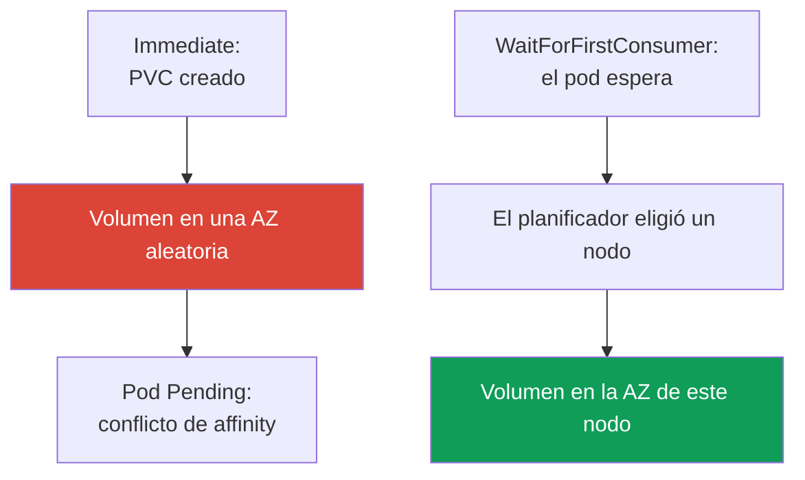
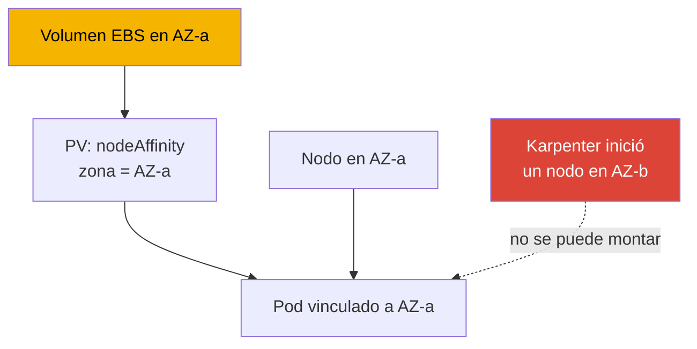

[English version](en.md) · [Русская версия](ru.md) · [Version française](fr.md) · [Deutsche Version](de.md) · [ქართული ვერსია](ge.md) · [繁體中文版](tw.md) · [日本語版](jp.md)
# Capítulo 23. EBS CSI: gp3, StorageClass, expansión, snapshots, vinculación a AZ

> **Qué sigue.** La Parte 3 terminó con seguridad; la Parte 4 se abre con almacenamiento. Este
> capítulo trata sobre el almacenamiento en bloques EBS: un volumen vive en una sola zona de
> disponibilidad (AZ) y solo se monta en una instancia de esa zona, y todas las particularidades
> giran en torno a este hecho. El acceso compartido de escritura desde muchos pods y el trabajo
> entre AZ corresponden a EFS y FSx (capítulo 24); el almacenamiento de objetos mediante
> Mountpoint es el capítulo 25. El rol del controlador CSI se concede mediante IRSA o Pod Identity
> (capítulos 16-17), a los que hacemos referencia sin repetirlos. Karpenter y la consolidación
> que mueve nodos entre AZ se cubren en el capítulo 12, y la copia de seguridad de volúmenes con
> AWS Backup en el capítulo 41. Conoce PV, PVC y StatefulSet de CKA; aquí veremos las
> particularidades de EBS en una zona concreta.

## 23.1. «Un pod de StatefulSet está en Pending y el volumen ya se creó en el lugar equivocado»

Es un escenario que encuentran casi todos quienes trasladan un StatefulSet a un EKS recién
creado. Se creó el PVC, apareció el PV, pero el pod no arranca:

```bash
kubectl describe pod db-0
# Events:
#   Warning  FailedScheduling  default-scheduler
#     0/6 nodes are available: 6 node(s) had volume node affinity conflict.
```

Las palabras clave son `volume node affinity conflict`. El volumen ya se aprovisionó, pero el
planificador no puede colocar el pod en ningún nodo. Veamos exactamente dónde acabó el volumen:

```bash
kubectl get pv -o yaml | grep -A6 nodeAffinity
#   nodeAffinity:
#     required:
#       nodeSelectorTerms:
#       - matchExpressions:
#         - key: topology.ebs.csi.aws.com/zone
#           values: [eu-central-1c]
```

El volumen se creó en `eu-central-1c`, mientras que los nodos libres para la carga están en
`eu-central-1a` y `eu-central-1b`. Un volumen EBS no se puede montar en una instancia de otra
zona, de ahí el conflicto.

La causa es `volumeBindingMode: Immediate` en la StorageClass: el volumen se aprovisiona en
cuanto aparece el PVC, antes de saber dónde se colocará el pod, por lo que la zona se elige de
forma arbitraria. El planificador debe respetar el `nodeAffinity` del volumen y no encuentra
nodos. `WaitForFirstConsumer` lo corrige, y es el núcleo de este capítulo. Pero primero veamos
el controlador.

## 23.2. Controlador EBS CSI: managed addon en lugar de in-tree

Históricamente, EBS se conectaba mediante el aprovisionador in-tree integrado
`kubernetes.io/aws-ebs`. Está **deprecated**: ya no se desarrolla, no admite snapshots y no
admite `gp3` (solo `io1`, `gp2`, `sc1` y `st1`). Desde EKS 1.23 está habilitada la migración a
CSI, y EBS se gestiona con el controlador CSI independiente **aws-ebs-csi-driver**, con el
aprovisionador `ebs.csi.aws.com`. Instálelo como un **managed addon**, con versionado y
actualizaciones mediante la API:

```bash
aws eks create-addon --cluster-name demo --addon-name aws-ebs-csi-driver \
  --service-account-role-arn arn:aws:iam::111122223333:role/eks-ebs-csi-driver
```

El controlador necesita un rol IAM: el controlador llama a las API de EC2 (`CreateVolume`,
`AttachVolume`, `CreateSnapshot`). Conceda el rol mediante IRSA o EKS Pod Identity (capítulos
16-17), pase su ARN en `--service-account-role-arn` y utilice la política administrada ya
preparada `AmazonEBSCSIDriverPolicy`. Sin un rol, el controlador recibe `AccessDenied` en
`CreateVolume` y el PVC queda en `Pending` por otra razón: no hay quien cree el volumen.

> **EKS Auto Mode es un aprovisionador distinto.** En Auto Mode (capítulo 9), la StorageClass
> usa `ebs.csi.eks.amazonaws.com`, no `ebs.csi.aws.com`. Son controladores distintos; uno no
> recoge los volúmenes del otro. Este capítulo trata sobre el estándar `ebs.csi.aws.com`.

## 23.3. StorageClass para gp3

`gp3` es el SSD actual de uso general: a diferencia de `gp2`, donde los IOPS y el throughput
crecen junto con el tamaño del volumen, en `gp3` se configuran **independientemente** de la
capacidad (una base de 3000 IOPS y 125 MiB/s para cualquier tamaño). Para la mayoría de las
cargas, `gp3` es mejor que `gp2`.

Una particularidad de EKS: **la StorageClass predeterminada del clúster es `gp2` mediante el
aprovisionador in-tree**. Se mantiene por motivos históricos, y un PVC sin un
`storageClassName` explícito irá a ella. Debe **crear explícitamente** una StorageClass para
`gp3` y, si lo desea, convertirla en la predeterminada.

```yaml
apiVersion: storage.k8s.io/v1
kind: StorageClass
metadata:
  name: gp3
  annotations:
    storageclass.kubernetes.io/is-default-class: "true"
provisioner: ebs.csi.aws.com
volumeBindingMode: WaitForFirstConsumer
allowVolumeExpansion: true
parameters:
  type: gp3
  iops: "3000"
  throughput: "125"
  encrypted: "true"
  kmsKeyId: arn:aws:kms:eu-central-1:111122223333:key/abcd-1234
```

| Ajuste de `parameters` | Finalidad | Nota |
|---|---|---|
| `type` | tipo de volumen: `gp3`, `io2`, `st1` | `gp3` es el predeterminado de CSI |
| `iops` | IOPS objetivo | independientes del tamaño en `gp3` |
| `throughput` | throughput, MiB/s | solo para `gp3` |
| `encrypted` | cifrado del volumen | actívelo siempre |
| `kmsKeyId` | clave KMS | sin ella se usa la clave predeterminada |

Hay una trampa distinta con `kmsKeyId`. Si es una clave administrada por el cliente, no basta con
una política IAM en el rol del controlador: **la propia política de la clave también debe
permitir ese rol**. Necesita `kms:GenerateDataKey*`, `kms:Decrypt`, `kms:DescribeKey`,
`kms:ReEncrypt*` y, sobre todo, `kms:CreateGrant`: el cifrado de EBS funciona mediante grants y,
sin permiso para crearlos, el controlador crea el volumen pero **no puede montarlo en la
instancia**. El síntoma es reconocible: el PVC está `Bound`, pero el pod queda bloqueado y sus
eventos muestran `AccessDenied` de KMS aunque la política IAM del rol parece correcta. El grant
se limita habitualmente con la condición `kms:GrantIsForAWSResource`. Revise siempre la política
de la clave cuando no fue creada por el mismo código que el clúster, y en especial si vive en otra
cuenta: en ese caso el permiso en la key policy es obligatorio (el rol del controlador se cubre
en los capítulos 16 y 17).

Un PVC habitual para esta clase y un comando para comprobar la clase predeterminada:

```yaml
apiVersion: v1
kind: PersistentVolumeClaim
metadata: {name: data}
spec:
  storageClassName: gp3
  accessModes: ["ReadWriteOnce"]
  resources:
    requests: {storage: 20Gi}
```

```bash
kubectl get storageclass
# gp2 (default)  kubernetes.io/aws-ebs  WaitForFirstConsumer  false
# gp3            ebs.csi.aws.com        WaitForFirstConsumer  true
```

## 23.4. volumeBindingMode en detalle

Este es el ajuste clave de StorageClass para EBS y está directamente relacionado con el problema
de 23.1. Determina **cuándo** se crea un volumen respecto de la planificación del pod.



- **`Immediate`**: el volumen se crea en cuanto aparece el PVC. El controlador todavía no sabe
  dónde se colocará el pod y elige una zona arbitrariamente. Si después el pod no puede ubicarse
  en esa zona, el resultado es `volume node affinity conflict` y un `Pending` permanente.
- **`WaitForFirstConsumer`**: el aprovisionamiento se aplaza hasta planificar el pod. El
  planificador elige un nodo teniendo en cuenta recursos, taints y affinity; después el
  controlador crea el volumen en la zona del nodo elegido. La topología del volumen coincide con
  la del pod por construcción.

| Propiedad | `Immediate` | `WaitForFirstConsumer` |
|---|---|---|
| Cuándo se crea el volumen | al aparecer el PVC | al planificar el pod |
| Quién elige la AZ | el controlador, arbitrariamente | el planificador, según la ubicación del pod |
| Riesgo de conflicto de affinity | alto | ninguno |
| PVC sin pod | el volumen ya está creado e inactivo | `Pending`, lo cual es normal |
| Para EBS | no usar | predeterminado |

La conclusión es sencilla: **use siempre `WaitForFirstConsumer` para EBS**. Un efecto secundario
es que un PVC sin un pod en ejecución permanece en `Pending`, lo cual es esperado. Para limitar
el conjunto de zonas, configure `allowedTopologies` en la StorageClass con la clave
`topology.ebs.csi.aws.com/zone` y una lista de zonas permitidas.

## 23.5. Vinculación a AZ: por qué lo determina todo

Un volumen EBS es un recurso zonal: se crea en una AZ concreta y solo se monta en una instancia
EC2 de **esa misma zona**. Es una limitación de AWS, no de Kubernetes, y determina todo el
mecanismo.



La cadena de vinculación es esta: el volumen vive en AZ-a; el controlador CSI establece el
`nodeAffinity` del PV en `topology.ebs.csi.aws.com/zone = eu-central-1a`; el planificador coloca
un pod con este PVC solo en un nodo de AZ-a; si no hay un nodo adecuado en AZ-a, el pod permanece
en `Pending` hasta que aparezca uno.

Esto tiene consecuencias para el escalado automático. Si Karpenter o Cluster Autoscaler inicia
un nodo en otra zona, un pod con un volumen existente no podrá ubicarse en él; a la inversa, la
consolidación de Karpenter (capítulo 12) no puede mover una réplica de StatefulSet a otra AZ: la
zona del volumen la mantiene fija. Planifique la capacidad entendiendo que los volúmenes
«clavan» los pods a las zonas.

Para un StatefulSet con `volumeClaimTemplates`, cada réplica recibe su propio volumen y queda
vinculada a su propia zona. Para evitar reunir las réplicas en una AZ, distribúyalas mediante
`topologySpreadConstraints` con `topologyKey: topology.kubernetes.io/zone` y `maxSkew: 1` (la
fiabilidad se cubre en el capítulo 40).

La otra mitad de la misma limitación es el **modo de acceso**. Para EBS, casi siempre es
`ReadWriteOnce`: un volumen se monta en un nodo, y `ReadWriteMany` no funciona como forma de
permitir que varios pods escriban en los mismos archivos. También existe `ReadWriteOncePod`, una
variante estricta donde recibe el volumen exactamente un pod, útil para evitar un segundo escritor
accidental. Hay una excepción estrecha: EBS Multi-Attach para `io2`, y el controlador lo admite
**solo en modo de bloques** (`volumeMode: Block`), dentro de una AZ y sin sistema de archivos. La
aplicación debe saber usar por sí misma el dispositivo de bloques compartido, por ejemplo mediante
un sistema de archivos de clúster. Esto no puede sustituir EFS: el acceso compartido a archivos de
varios pods, sobre todo desde zonas distintas, se resuelve con EFS o FSx (capítulo 24).

## 23.6. Expansión de volumen

Un volumen EBS se puede **aumentar** en línea si la StorageClass tiene
`allowVolumeExpansion: true` (véase 23.3). Después basta con aumentar la solicitud en el PVC:

```bash
kubectl patch pvc data -p '{"spec":{"resources":{"requests":{"storage":"50Gi"}}}}'
```

El controlador CSI llama a EC2 para modificar el volumen y amplía el sistema de archivos. Para
`gp3`, ocurre en línea sin detener el pod. Es importante recordar estas limitaciones:

- **solo hacia arriba**: no se puede reducir un volumen EBS ni mediante un PVC ni mediante AWS;
  una solicitud de PVC menor que el tamaño actual será rechazada;
- se aplica un **límite de frecuencia** a los cambios de un volumen: la siguiente modificación
  solo es posible después de que la anterior alcance el estado `completed`, y no se permiten más
  de cuatro cambios en un período móvil de 24 horas. Una modificación de un volumen grande
  (aproximadamente 1 TiB) puede tardar hasta seis horas, por lo que expansiones frecuentes y
  sucesivas alcanzarán el límite (consulte la documentación de EBS).

La expansión es una operación habitual, pero no una herramienta para pequeños ajustes frecuentes:
elija un tamaño inicial razonable y amplíe en incrementos significativos.

## 23.7. Snapshots

Los snapshots funcionan mediante un componente separado, el CSI snapshotter, con tres objetos:

| Objeto | Función | Analogía |
|---|---|---|
| `VolumeSnapshotClass` | cómo crear snapshots (controlador, parámetros) | como una StorageClass |
| `VolumeSnapshot` | solicitud de «crear un snapshot de este PVC» | como un PVC |
| `VolumeSnapshotContent` | el snapshot real en AWS | como un PV |

Solicite un snapshot mediante una referencia al PVC:

```yaml
apiVersion: snapshot.storage.k8s.io/v1
kind: VolumeSnapshot
metadata: {name: db-snap}
spec:
  volumeSnapshotClassName: ebs-snapclass   # driver: ebs.csi.aws.com
  source:
    persistentVolumeClaimName: data
```

La restauración usa un PVC normal con `dataSource`, donde `kind: VolumeSnapshot`,
`name: db-snap` y `apiGroup: snapshot.storage.k8s.io`, además del `storageClassName` deseado. La
particularidad zonal es que un snapshot EBS en sí es un objeto **regional**, pero el volumen
restaurado a partir de él vuelve a crearse en una **AZ concreta** (con `WaitForFirstConsumer`, en
la zona del pod). Un snapshot sobrevive como datos a la pérdida de una zona, pero el volumen
restaurado vuelve a ser zonal y no permite «distribuir» la carga entre AZ. Las copias de seguridad
programadas completas corresponden a AWS Backup (capítulo 41); los snapshots CSI son una pieza
que está por debajo.

## 23.8. Diagnóstico

Las tres situaciones más frecuentes son:

| Síntoma | Causa | Qué comprobar |
|---|---|---|
| `Pending`, `volume node affinity conflict` | volumen en una AZ, nodos en otra | zona en el `nodeAffinity` del PV |
| PVC en `Pending` durante mucho tiempo, no hay PV | no hay rol del controlador o `WaitForFirstConsumer` sin pod | logs del controlador, si existe un pod |
| `Pending`, `gp3` no admitido | StorageClass con aprovisionador in-tree | `provisioner` en la StorageClass |
| PVC `Bound`, el pod no arranca, `AccessDenied` de KMS | el rol del controlador no tiene permitido `kms:CreateGrant` | la propia política de la clave CMK, eventos del pod |

Primero compruebe el modo de la StorageClass existente: explica la mayoría de los incidentes
«zonales»:

```bash
kubectl get storageclass gp3 -o jsonpath='{.volumeBindingMode}'
```

Un caso aparte y engañoso es **«funciona por casualidad»**. Si una StorageClass usa `Immediate`,
pero todos los nodos del clúster están por casualidad en una AZ, no hay conflicto: hay una zona
para todos. La configuración parece funcional hasta que el clúster se amplía a una segunda AZ (o
Karpenter inicia un nodo en otra zona), cuando aparece `Pending` «de la nada». Solo se puede
distinguir una configuración afortunada de una correcta por `volumeBindingMode`:
`WaitForFirstConsumer` es siempre correcto, mientras que `Immediate` solo funciona hasta que las
zonas divergen.

## 23.9. Cómo se aplica en producción

- **Una StorageClass `gp3` explícita.** No dependa de la `gp2` predeterminada: cree una
  StorageClass con `ebs.csi.aws.com`, tipo `gp3` y los IOPS/throughput requeridos.
- **Use siempre `WaitForFirstConsumer`.** Es el único modo correcto para EBS zonal; conserve
  `Immediate` solo cuando la topología esté garantizada como de una única zona.
- **Configure `allowVolumeExpansion: true` desde el principio.** No podrá ampliar un volumen
  después sin este indicador.
- **Cifrado de forma predeterminada.** Incluya `encrypted: "true"` en cada StorageClass y elija
  la clave KMS deliberadamente.
- **Snapshots más comprensión de la zonalidad.** Use snapshots periódicos (o AWS Backup,
  capítulo 41), pero la restauración vuelve a producir un volumen zonal. Para acceso entre AZ,
  use EFS (capítulo 24).
- **Planifique la capacidad por zona.** Un volumen fija un pod a una AZ; distribuya las réplicas
  de StatefulSet mediante `topologySpreadConstraints`.

## 23.10. Mini glosario

- **Controlador EBS CSI**: `aws-ebs-csi-driver`, un managed addon con el aprovisionador
  `ebs.csi.aws.com`; gestiona el ciclo de vida de los volúmenes EBS.
- **Aprovisionador in-tree**: el integrado `kubernetes.io/aws-ebs`, deprecated y sin `gp3` ni
  snapshots; la `gp2` predeterminada de EKS todavía lo utiliza.
- **`volumeBindingMode`**: cuándo se aprovisiona un volumen: `Immediate` (cuando aparece el PVC)
  o `WaitForFirstConsumer` (cuando se planifica el pod).
- **volume node affinity conflict**: evento del planificador cuando el `nodeAffinity` de un
  volumen apunta a una zona sin un nodo adecuado.
- **Modos de acceso de EBS**: `ReadWriteOnce` (un nodo) y `ReadWriteOncePod` (exactamente un
  pod); `ReadWriteMany` solo es posible como Multi-Attach `io2` en `volumeMode: Block` dentro de
  una AZ y sin sistema de archivos. El acceso compartido a archivos requiere EFS o FSx
  (capítulo 24).
- **`kms:CreateGrant`**: el permiso sin el que el controlador puede crear un volumen con su CMK
  pero no montarlo: el cifrado de EBS usa grants y el permiso también se necesita en la política
  de la clave.
- **VolumeSnapshot / Content / Class**: objetos de snapshots CSI: solicitud, snapshot en AWS,
  clase.
- **`allowVolumeExpansion`**: el indicador de StorageClass que permite aumentar un volumen
  mediante una solicitud de PVC mayor.

## 23.11. Resumen del capítulo

- Un volumen EBS es zonal: se crea en una AZ y solo se monta en una instancia de esa zona. Esto
  determina todas las particularidades del almacenamiento EBS en EKS.
- El problema típico es un pod de StatefulSet en `Pending` con `volume node affinity conflict`:
  el volumen se creó en una zona y los nodos de la carga están en otra. La causa es `Immediate`
  en la StorageClass.
- El controlador CSI `ebs.csi.aws.com` (un managed addon) gestiona EBS, con un rol mediante
  IRSA/Pod Identity (capítulos 16-17); el in-tree `kubernetes.io/aws-ebs` está deprecated. La
  StorageClass predeterminada de EKS es la `gp2` in-tree; especifique explícitamente `gp3` (IOPS
  y throughput independientes del tamaño).
- `volumeBindingMode: WaitForFirstConsumer` es obligatorio para EBS: el volumen se crea en la
  zona del nodo seleccionado. `Immediate` causa conflictos de zona.
- Un volumen fija un pod a su AZ mediante el `nodeAffinity` del PV; Karpenter no puede mover una
  réplica a otra AZ (capítulo 12), y las réplicas de StatefulSet se distribuyen con
  `topologySpreadConstraints`.
- La expansión solo es hacia arriba, requiere `allowVolumeExpansion`, es en línea para `gp3` y
  tiene límite de frecuencia.
- Snapshots CSI: el snapshot es regional, pero el volumen restaurado vuelve a ser zonal. Las
  copias de seguridad completas programadas usan AWS Backup (capítulo 41).

## 23.12. Cómo ayuda en el trabajo real

Durante una guardia, la mayoría de los incidentes «zonales» se resuelven con una comprobación:
ejecute `kubectl get pv -o yaml` para la zona en `nodeAffinity` e inspeccione
`volumeBindingMode` en la StorageClass. `Immediate` junto con `volume node affinity conflict`
identifica la causa; corríjala cambiando a `WaitForFirstConsumer` y recreando el PVC. Al
planificar capacidad, recuerde que el volumen vincula el pod a una zona: el escalado, la
consolidación y las actualizaciones no pueden trasladar una carga con su volumen a una AZ vecina.
La configuración más peligrosa es la que «funciona por casualidad» en una sola zona: se rompe el
día que se expande a una segunda AZ.

## 23.13. Preguntas de autoevaluación

1. ¿Por qué un pod de StatefulSet puede quedarse en `Pending` con el evento `volume node affinity conflict`?
2. ¿Cómo puede saber en qué AZ se creó un volumen a partir de `kubectl get pv -o yaml`?
3. ¿En qué se diferencia `Immediate` de `WaitForFirstConsumer` y por qué EBS necesita el segundo?
4. ¿Por qué un PVC sin un pod en ejecución queda en `Pending` con `WaitForFirstConsumer` y por qué es normal?
5. ¿Qué no puede hacer el aprovisionador in-tree `kubernetes.io/aws-ebs` y qué StorageClass es predeterminada en EKS?
6. ¿Por qué el controlador EBS CSI necesita un rol IAM y qué capítulo describe cómo concederlo?
7. ¿Cómo vincula un volumen EBS un pod a una zona y por qué Karpenter no puede mover la réplica a otra AZ?
8. ¿Cómo puede distribuir réplicas de StatefulSet entre zonas y por qué es necesario con volúmenes zonales?
9. ¿Cuáles son las restricciones de la expansión de volumen EBS y qué es imposible en principio?
10. ¿En qué zona queda un volumen a partir de un snapshot y por qué un snapshot no resuelve el acceso entre AZ?
11. ¿Cómo puede distinguir una configuración de almacenamiento correcta de una «afortunada» que funciona en una AZ?
12. Se creó un volumen con su propia clave KMS, pero el pod no arranca. ¿Qué permiso debe comprobar y exactamente dónde?
13. ¿Por qué `ReadWriteMany` no permite que varios pods trabajen con archivos en un volumen EBS y cuál es la única excepción?

## Práctica

La práctica del curso para este tema es la [práctica 106: EBS CSI: gp3, vinculación a AZ,
expansión y snapshot](../../labs/106/README_ES.MD). EBS CSI también participa en la
[práctica 122: AWS Backup para EKS](../../labs/122/README_ES.MD) como el volumen detrás de un
PVC que entra en la copia de seguridad, y se compara con EFS en la [práctica 107: EFS CSI:
ReadWriteMany entre zonas de disponibilidad](../../labs/107/README_ES.MD). Además de estas,
todo se verifica en un clúster activo. Comience con `kubectl get storageclass`: ¿qué StorageClass
es predeterminada y cuáles son su `volumeBindingMode` y `provisioner`? Confirme que el
controlador EBS CSI está instalado: `aws eks list-addons --cluster-name <cluster>` y
`kubectl get pods -n kube-system | grep ebs-csi`.

A continuación, reproduzca el problema de 23.1: cree una StorageClass con
`volumeBindingMode: Immediate`, inicie un StatefulSet con `volumeClaimTemplates` en un clúster
con nodos en varias AZ y encuentre el pod en `Pending`. Inspeccione `kubectl describe pod <pod>`
(el evento `volume node affinity conflict`) y `kubectl get pv -o yaml` (la zona en
`nodeAffinity`). Después, recree la StorageClass con `WaitForFirstConsumer`,
`allowVolumeExpansion: true`, `encrypted: "true"`, recree el PVC y confirme que el volumen se
crea en la zona del pod. Practique la expansión con `kubectl patch pvc`, cree después un
`VolumeSnapshot`, restaure un PVC desde él y use `kubectl get pv -o yaml` para verificar que la
zona del volumen restaurado coincide con la zona del pod.

---
[Índice](../README_ES.md) · [Capítulo 22](../22/es.md) · [Capítulo 24](../24/es.md)
