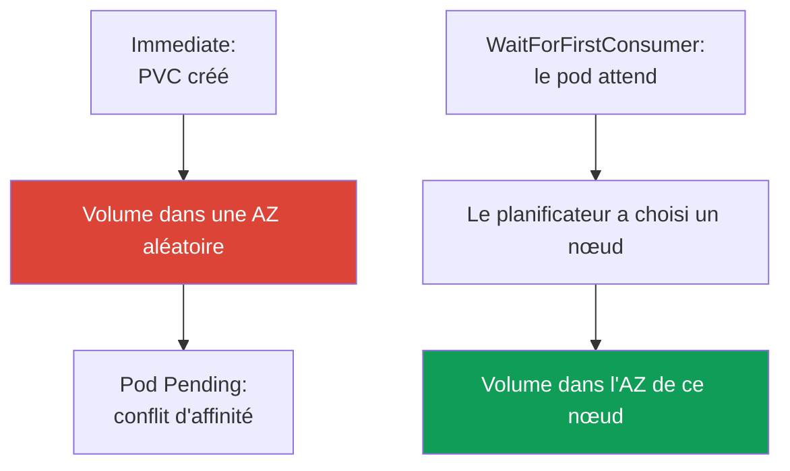
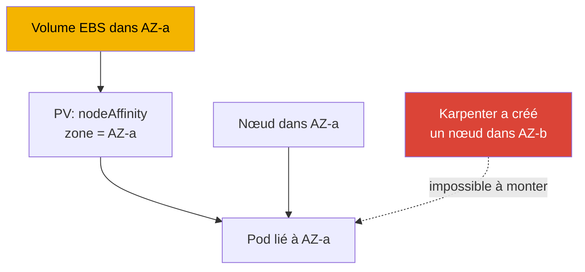

[Русская версия](ru.md) · [Eng version](en.md) · [Versión en español](es.md) · [Deutsche Version](de.md) · [ქართული ვერსია](ge.md) · [繁體中文版](tw.md) · [日本語版](jp.md)
# Chapitre 23. EBS CSI : gp3, StorageClass, extension, instantanés, liaison à une AZ

> **La suite.** La partie 3 s'est terminée sur la sécurité, la partie 4 s'ouvre avec le stockage. Ce
> chapitre traite du stockage par blocs EBS : un volume vit dans une seule zone de disponibilité (AZ) et ne se monte
> que sur une instance de cette zone, et toutes les particularités découlent de ce fait. L'accès partagé en
> écriture depuis plusieurs pods et le fonctionnement entre AZ relèvent d'EFS et FSx (chapitre 24), le stockage objet
> via Mountpoint du chapitre 25. Le rôle du pilote CSI est accordé via IRSA ou Pod Identity (chapitres 16-17) : nous
> nous y référons sans les répéter. Karpenter et la consolidation qui déplace les nœuds entre AZ sont traités au
> chapitre 12, la sauvegarde de volumes via AWS Backup au chapitre 41. Vous connaissez PV, PVC et StatefulSet avec
> CKA ; il s'agit ici des particularités d'EBS dans une zone précise.

## 23.1. « Le pod StatefulSet reste en Pending, et le volume a déjà été créé au mauvais endroit »

C'est le scénario que rencontrent presque tous ceux qui migrent un StatefulSet vers un EKS récent. Le PVC est créé, le
PV apparaît, mais le pod ne démarre pas :

```bash
kubectl describe pod db-0
# Events:
#   Warning  FailedScheduling  default-scheduler
#     0/6 nodes are available: 6 node(s) had volume node affinity conflict.
```

Les mots clés sont `volume node affinity conflict`. Le volume est déjà provisionné, mais le planificateur ne peut
placer le pod sur aucun nœud. Regardons où le volume s'est précisément retrouvé :

```bash
kubectl get pv -o yaml | grep -A6 nodeAffinity
#   nodeAffinity:
#     required:
#       nodeSelectorTerms:
#       - matchExpressions:
#         - key: topology.ebs.csi.aws.com/zone
#           values: [eu-central-1c]
```

Le volume a été créé dans `eu-central-1c`, tandis que les nœuds disponibles pour la charge sont dans
`eu-central-1a` et `eu-central-1b`. Un volume EBS ne peut pas être monté sur une instance d'une autre zone, d'où le
conflit.

La cause est `volumeBindingMode: Immediate` dans la StorageClass : le volume est provisionné immédiatement après
l'apparition du PVC, avant de savoir où le pod sera placé ; la zone est donc choisie arbitrairement, et le
planificateur doit respecter le `nodeAffinity` du volume sans trouver de nœud. `WaitForFirstConsumer`, le cœur de ce
chapitre, résout le problème. Mais commençons par le pilote.

## 23.2. Pilote EBS CSI : addon géré plutôt qu'in-tree

Historiquement, EBS était connecté par le provisionneur in-tree intégré `kubernetes.io/aws-ebs`. Il est
**deprecated** : il n'est plus développé, ne sait pas gérer les instantanés et ne prend pas en charge `gp3` (seulement
`io1`, `gp2`, `sc1`, `st1`). À partir d'EKS 1.23, la migration CSI est activée et un pilote CSI distinct,
**aws-ebs-csi-driver**, avec le provisionneur `ebs.csi.aws.com`, gère EBS. Il s'installe comme **managed addon**,
avec gestion des versions et mises à jour via l'API :

```bash
aws eks create-addon --cluster-name demo --addon-name aws-ebs-csi-driver \
  --service-account-role-arn arn:aws:iam::111122223333:role/eks-ebs-csi-driver
```

Le pilote a besoin d'un rôle IAM : le contrôleur appelle l'API EC2 (`CreateVolume`, `AttachVolume`,
`CreateSnapshot`). Le rôle est accordé via IRSA ou EKS Pod Identity (chapitres 16-17), son ARN est transmis dans
`--service-account-role-arn`, et la politique gérée prête à l'emploi est `AmazonEBSCSIDriverPolicy`. Sans rôle, le
contrôleur reçoit `AccessDenied` sur `CreateVolume`, et le PVC reste en `Pending` pour une autre raison : personne ne
peut créer le volume.

> **EKS Auto Mode : un provisionneur distinct.** En Auto Mode (chapitre 9), la StorageClass utilise
> `ebs.csi.eks.amazonaws.com`, et non `ebs.csi.aws.com`. Ce sont des pilotes différents ; le volume de l'un n'est pas
> pris en charge par l'autre. Ici, nous parlons du `ebs.csi.aws.com` standard.

## 23.3. StorageClass pour gp3

`gp3` est le SSD polyvalent actuel : contrairement à `gp2`, où les IOPS et le débit évoluent avec la taille du volume,
ils sont configurés **indépendamment** de la capacité avec `gp3` (3 000 IOPS et 125 MiB/s de base quelle que soit la
taille). Pour la plupart des charges, `gp3` est préférable à `gp2`.

Subtilité EKS : la **StorageClass par défaut du cluster est `gp2` via le provisionneur in-tree**. Elle demeure pour des
raisons historiques, et un PVC sans `storageClassName` explicite l'utilisera. Il faut **créer explicitement** une
StorageClass pour `gp3` et, si souhaité, la définir comme classe par défaut.

```yaml
apiVersion: storage.k8s.io/v1
kind: StorageClass
metadata:
  name: gp3
  annotations:
    storageclass.kubernetes.io/is-default-class: "true"
provisioner: ebs.csi.aws.com
volumeBindingMode: WaitForFirstConsumer
allowVolumeExpansion: true
parameters:
  type: gp3
  iops: "3000"
  throughput: "125"
  encrypted: "true"
  kmsKeyId: arn:aws:kms:eu-central-1:111122223333:key/abcd-1234
```

| Paramètre `parameters` | Rôle | Note |
|---|---|---|
| `type` | type de volume : `gp3`, `io2`, `st1` | pour CSI, `gp3` par défaut |
| `iops` | IOPS cibles | indépendantes de la taille avec `gp3` |
| `throughput` | débit, MiB/s | uniquement pour `gp3` |
| `encrypted` | chiffrement du volume | activez-le toujours |
| `kmsKeyId` | clé KMS | sans elle, clé par défaut |

Il existe un autre piège concernant `kmsKeyId`. Si c'est une customer managed key, la politique IAM du rôle du pilote
ne suffit pas : **la politique de la clé elle-même doit aussi autoriser ce rôle**. Il faut `kms:GenerateDataKey*`,
`kms:Decrypt`, `kms:DescribeKey`, `kms:ReEncrypt*` et, surtout, `kms:CreateGrant` : le chiffrement EBS fonctionne avec
des grants et, sans le droit de les créer, le pilote créera le volume, mais **ne pourra pas le monter sur l'instance**.
Le symptôme est reconnaissable : le PVC est `Bound`, mais le pod reste bloqué, avec `AccessDenied` de KMS dans les
événements, alors que la politique IAM du rôle semble correcte. Le grant est habituellement restreint par la condition
`kms:GrantIsForAWSResource`. Il faut toujours vérifier la politique de la clé lorsque cette dernière n'a pas été créée
par le même code que le cluster, et particulièrement lorsqu'elle vit dans un autre compte : l'autorisation dans la key
policy est alors obligatoire (rôle du pilote : chapitres 16 et 17).

Voici un PVC ordinaire pour cette classe et la commande pour vérifier la classe par défaut :

```yaml
apiVersion: v1
kind: PersistentVolumeClaim
metadata: {name: data}
spec:
  storageClassName: gp3
  accessModes: ["ReadWriteOnce"]
  resources:
    requests: {storage: 20Gi}
```

```bash
kubectl get storageclass
# gp2 (default)  kubernetes.io/aws-ebs  WaitForFirstConsumer  false
# gp3            ebs.csi.aws.com        WaitForFirstConsumer  true
```

## 23.4. volumeBindingMode en pratique

C'est le principal paramètre de la StorageClass pour EBS, et celui auquel est liée la difficulté de 23.1. Il détermine
**quand** le volume est créé par rapport à la planification du pod.



- **`Immediate`** : le volume est créé dès l'apparition du PVC. Le pilote ne sait pas encore où sera placé le pod et
  choisit une zone arbitrairement. Si le pod ne peut ensuite pas être placé dans cette zone : `volume node affinity
  conflict` et `Pending` permanent.
- **`WaitForFirstConsumer`** : le provisionnement est différé jusqu'à la planification du pod. Le planificateur
  sélectionne un nœud selon les ressources, taints et affinity, puis le pilote crée le volume dans la zone du nœud
  retenu. La topologie du volume correspond donc au pod par construction.

| Propriété | `Immediate` | `WaitForFirstConsumer` |
|---|---|---|
| Création du volume | à l'apparition du PVC | à la planification du pod |
| Choix de l'AZ | pilote, arbitrairement | planificateur, selon l'emplacement du pod |
| Risque de conflit d'affinité | élevé | absent |
| PVC sans pod | le volume est déjà créé et attend | `Pending`, c'est normal |
| Pour EBS | ne pas utiliser | par défaut |

La conclusion est simple : **pour EBS, utilisez toujours `WaitForFirstConsumer`**. L'effet secondaire est qu'un PVC
sans pod en cours d'exécution reste en `Pending`, ce qui est attendu. Pour restreindre l'ensemble des zones, configurez
`allowedTopologies` dans la StorageClass avec la clé `topology.ebs.csi.aws.com/zone` et la liste des zones autorisées.

## 23.5. Liaison à une AZ : pourquoi elle détermine tout

Un volume EBS est une ressource zonale : il est créé dans une AZ précise et ne se monte que sur une instance EC2 de la
**même zone**. C'est une contrainte AWS, non Kubernetes, qui entraîne toute cette mécanique.



La chaîne de liaison : le volume vit dans AZ-a ; le pilote CSI place sur le PV le `nodeAffinity`
`topology.ebs.csi.aws.com/zone = eu-central-1a` ; le planificateur ne placera un pod avec ce PVC que sur un nœud de
AZ-a ; s'il n'y a aucun nœud adapté dans AZ-a, le pod reste en `Pending` jusqu'à ce qu'il apparaisse.

D'où la conséquence pour l'autoscaling. Si Karpenter ou Cluster Autoscaler crée un nœud dans une autre zone, un pod
ayant déjà un volume ne pourra pas s'y placer ; inversement, la consolidation de Karpenter (chapitre 12) ne peut pas
déplacer une réplique StatefulSet vers une autre AZ : elle est retenue par la zone du volume. Il faut planifier la
capacité en tenant compte du fait que les volumes « clouent » les pods aux zones.

Avec un StatefulSet utilisant `volumeClaimTemplates`, chaque réplique reçoit son propre volume et est liée à sa zone.
Pour éviter que les répliques se regroupent dans une seule AZ, répartissez-les via `topologySpreadConstraints` avec
`topologyKey: topology.kubernetes.io/zone` et `maxSkew: 1` (fiabilité : chapitre 40).

L'autre moitié de cette même contrainte est le **mode d'accès**. Pour EBS, c'est presque toujours `ReadWriteOnce` : le
volume se monte sur un seul nœud, et `ReadWriteMany`, dans l'idée que plusieurs pods écriraient dans les mêmes
fichiers, ne fonctionne pas ici. Il existe aussi `ReadWriteOncePod`, une variante stricte où le volume est attribué à
exactement un pod, utile pour éviter un second écrivain accidentel. L'exception est unique et limitée : EBS
Multi-Attach pour le type `io2`, que le pilote ne prend en charge **qu'en mode bloc** (`volumeMode: Block`), dans une
seule AZ, sans système de fichiers : l'application doit elle-même savoir utiliser le périphérique bloc partagé, par
exemple avec un système de fichiers en cluster. Cela ne remplace pas EFS : l'accès aux fichiers partagé par plusieurs
pods, a fortiori depuis différentes zones, se résout avec EFS ou FSx (chapitre 24).

## 23.6. Extension du volume

Un volume EBS peut être **augmenté** à chaud si la StorageClass contient `allowVolumeExpansion: true` (voir 23.3).
Il suffit ensuite d'augmenter la demande dans le PVC :

```bash
kubectl patch pvc data -p '{"spec":{"resources":{"requests":{"storage":"50Gi"}}}}'
```

Le pilote CSI appellera la modification du volume dans EC2 et étendra le système de fichiers. Pour `gp3`, cela se fait
en ligne, sans arrêter le pod. Les limites importantes à garder en tête :

- **uniquement vers le haut** : il est impossible de réduire un volume EBS, ni via PVC ni dans AWS ; une demande PVC
  inférieure à la capacité actuelle sera refusée ;
- **limite de fréquence** des modifications d'un volume : la modification suivante n'est possible qu'après que la
  précédente a atteint l'état `completed`, et pas plus de quatre modifications dans une fenêtre glissante de 24 heures ;
  de plus, la modification d'un gros volume (environ 1 TiB) peut durer jusqu'à six heures, donc des extensions
  fréquentes et successives atteindront la limite (consultez la documentation EBS).

L'extension est une opération courante, mais pas un outil pour de fréquents petits ajustements : prévoyez une taille
de départ raisonnable et augmentez par paliers notables.

## 23.7. Instantanés

Les instantanés fonctionnent par un composant distinct, CSI snapshotter, avec trois objets :

| Objet | Rôle | Analogie |
|---|---|---|
| `VolumeSnapshotClass` | comment créer des instantanés (pilote, paramètres) | comme StorageClass |
| `VolumeSnapshot` | demande « créer un instantané de ce PVC » | comme PVC |
| `VolumeSnapshotContent` | instantané réel dans AWS | comme PV |

Un instantané est demandé par une référence au PVC :

```yaml
apiVersion: snapshot.storage.k8s.io/v1
kind: VolumeSnapshot
metadata: {name: db-snap}
spec:
  volumeSnapshotClassName: ebs-snapclass   # driver: ebs.csi.aws.com
  source:
    persistentVolumeClaimName: data
```

La restauration est un PVC ordinaire avec `dataSource`, où `kind: VolumeSnapshot`, `name: db-snap` et
`apiGroup: snapshot.storage.k8s.io`, plus le `storageClassName` nécessaire. Subtilité concernant les zones :
l'instantané EBS lui-même est un objet **régional**, mais le volume restauré depuis celui-ci est de nouveau créé dans
une **AZ précise** (avec `WaitForFirstConsumer`, dans la zone du pod). L'instantané survit à la perte d'une zone en
tant que données, mais le volume restauré est à nouveau zonal et ne permet pas de « répartir » la charge entre AZ. Une
sauvegarde complète planifiée relève d'AWS Backup (chapitre 41) ; les instantanés CSI en sont les briques.

## 23.8. Diagnostic

Les trois situations les plus courantes.

| Symptôme | Cause | À vérifier |
|---|---|---|
| `Pending`, `volume node affinity conflict` | volume dans une AZ, nœuds dans une autre | zone dans le `nodeAffinity` du PV |
| PVC longtemps `Pending`, pas de PV | pas de rôle pour le pilote ou `WaitForFirstConsumer` sans pod | logs du contrôleur, présence d'un pod |
| `Pending`, `gp3` non pris en charge | StorageClass sur provisionneur in-tree | `provisioner` dans la StorageClass |
| PVC `Bound`, le pod ne démarre pas, `AccessDenied` de KMS | le rôle du pilote n'a pas `kms:CreateGrant` | politique de la clé CMK elle-même, événements du pod |

Commencez par regarder le mode de la StorageClass existante : il explique la plupart des incidents « zonaux » :

```bash
kubectl get storageclass gp3 -o jsonpath='{.volumeBindingMode}'
```

Un cas particulièrement trompeur est **« cela fonctionne par hasard »**. Si la StorageClass est en `Immediate`, mais
tous les nœuds du cluster se trouvent dans une seule AZ, il n'y a aucun conflit : une zone unique pour tous. La
configuration paraît fonctionnelle jusqu'à ce que le cluster s'étende à une seconde AZ (ou que Karpenter crée un nœud
dans une autre zone), et `Pending` apparaît alors « sans raison ». La seule façon de distinguer une configuration
chanceuse d'une configuration correcte est `volumeBindingMode` : `WaitForFirstConsumer` est toujours correct,
`Immediate` ne fonctionne que jusqu'à la première divergence entre zones.

## 23.9. Application en production

- **`gp3` dans une StorageClass explicite.** Ne vous fiez pas au `gp2` par défaut : créez une StorageClass avec
  `ebs.csi.aws.com`, le type `gp3` et les IOPS/débit nécessaires.
- **Toujours `WaitForFirstConsumer`.** C'est le seul mode correct pour EBS zonal ; ne laissez `Immediate` que là où la
  topologie est assurément unique.
- **`allowVolumeExpansion: true` dès le départ.** Il ne sera pas possible ultérieurement d'étendre un volume sans ce
  drapeau.
- **Chiffrement par défaut.** `encrypted: "true"` dans chaque StorageClass, et une clé KMS choisie consciemment.
- **Instantanés et compréhension du caractère zonal.** Instantanés réguliers (ou AWS Backup, chapitre 41), mais la
  restauration produit de nouveau un volume zonal. Besoin d'accès entre AZ : EFS (chapitre 24).
- **Capacité planifiée par zones.** Un volume ancre le pod à une AZ ; répartissez les répliques StatefulSet avec
  `topologySpreadConstraints`.

## 23.10. Mini-glossaire

- **Pilote EBS CSI** : `aws-ebs-csi-driver`, addon géré avec le provisionneur `ebs.csi.aws.com` ; il gère le cycle de
  vie des volumes EBS.
- **provisionneur in-tree** : intégré, `kubernetes.io/aws-ebs`, deprecated, sans `gp3` ni instantanés ; le `gp2` par
  défaut dans EKS l'utilise toujours.
- **`volumeBindingMode`** : quand le volume est provisionné : `Immediate` (à l'apparition du PVC) ou
  `WaitForFirstConsumer` (à la planification du pod).
- **volume node affinity conflict** : événement du planificateur lorsqu'un `nodeAffinity` de volume pointe vers une
  zone sans nœud adapté.
- **Modes d'accès EBS** : `ReadWriteOnce` (un nœud) et `ReadWriteOncePod` (exactement un pod) ; `ReadWriteMany` n'est
  possible que comme Multi-Attach `io2` en mode `volumeMode: Block`, dans une AZ et sans système de fichiers. L'accès
  partagé aux fichiers relève d'EFS ou FSx (chapitre 24).
- **`kms:CreateGrant`** : droit sans lequel le pilote créera un volume avec son propre CMK mais ne pourra pas le monter :
  le chiffrement EBS passe par des grants, l'autorisation est nécessaire aussi dans la politique de clé.
- **VolumeSnapshot / Content / Class** : objets des instantanés CSI : demande, instantané dans AWS, classe.
- **`allowVolumeExpansion`** : drapeau de StorageClass qui autorise l'augmentation du volume par croissance du PVC.

## 23.11. Résumé du chapitre

- Un volume EBS est zonal : il est créé dans une AZ et ne se monte que sur une instance de cette zone. Cela définit
  toutes les particularités du stockage dans EKS.
- Le problème typique est un pod StatefulSet en `Pending` avec `volume node affinity conflict` : le volume est créé
  dans une zone et les nœuds de charge dans une autre. La cause est `Immediate` dans la StorageClass.
- EBS est géré par le pilote CSI `ebs.csi.aws.com` (managed addon), avec un rôle via IRSA/Pod Identity (chapitres
  16-17) ; le `kubernetes.io/aws-ebs` in-tree est deprecated. La StorageClass par défaut d'EKS est `gp2` sur in-tree ;
  `gp3` (IOPS et débit indépendants de la taille) doit être défini explicitement.
- `volumeBindingMode: WaitForFirstConsumer` est obligatoire pour EBS : le volume est créé dans la zone du nœud choisi.
  `Immediate` provoque un conflit de zones.
- Le volume lie le pod à son AZ via le `nodeAffinity` du PV ; Karpenter ne déplacera pas une réplique dans une autre AZ
  (chapitre 12), répartissez les répliques StatefulSet avec `topologySpreadConstraints`.
- L'extension se fait uniquement vers le haut, avec `allowVolumeExpansion`, en ligne pour `gp3`, et avec une limite de
  fréquence.
- Instantanés CSI : l'instantané est régional, mais le volume restauré est de nouveau zonal. La sauvegarde complète
  planifiée relève d'AWS Backup (chapitre 41).

## 23.12. Utilité dans le travail quotidien

En astreinte, la plupart des incidents « zonaux » se résolvent avec une seule vérification : `kubectl get pv -o yaml`
pour la zone dans `nodeAffinity` et le `volumeBindingMode` de la StorageClass. `Immediate` avec `volume node affinity
conflict` : la cause est identifiée ; passez à `WaitForFirstConsumer` et recréez le PVC. Lors de la planification de
capacité, gardez à l'esprit que le volume lie le pod à la zone : le scaling, la consolidation et les mises à jour ne
peuvent pas déplacer une charge avec son volume vers une AZ voisine. Et la configuration la plus dangereuse est celle
qui « fonctionne par hasard » dans une zone : elle cassera le jour de l'extension vers une seconde AZ.

## 23.13. Questions d'auto-évaluation

1. Pourquoi un pod StatefulSet peut-il rester en `Pending` avec l'événement `volume node affinity conflict` ?
2. Comment déterminer, avec `kubectl get pv -o yaml`, dans quelle AZ un volume a été créé ?
3. Quelle est la différence entre `Immediate` et `WaitForFirstConsumer`, et pourquoi EBS requiert-il le second ?
4. Pourquoi un PVC sans pod démarré avec `WaitForFirstConsumer` reste-t-il en `Pending`, et est-ce normal ?
5. Que ne sait pas faire le provisionneur in-tree `kubernetes.io/aws-ebs` et quelle StorageClass est celle par défaut
   dans EKS ?
6. Pourquoi le pilote EBS CSI a-t-il besoin d'un rôle IAM et quel chapitre décrit son attribution ?
7. Comment un volume EBS lie-t-il un pod à une zone et pourquoi Karpenter ne déplacera-t-il pas une réplique dans une
   autre AZ ?
8. Comment répartir les répliques StatefulSet entre les zones et pourquoi est-ce nécessaire avec des volumes zonaux ?
9. Quelles sont les limites de l'extension d'un volume EBS et qu'est-il impossible de faire par principe ?
10. Dans quelle zone se trouvera le volume issu d'un instantané, et pourquoi l'instantané ne résout-il pas l'accès entre
    AZ ?
11. Comment distinguer une configuration de stockage correcte d'une configuration « chanceuse » qui fonctionne dans
    une seule AZ ?
12. Un volume avec sa propre clé KMS a été créé, mais le pod ne démarre pas. Quel droit faut-il vérifier, et où
    exactement ?
13. Pourquoi `ReadWriteMany` ne permet-il pas à plusieurs pods de travailler avec des fichiers sur un volume EBS, et
    quelle est l'unique exception restante ?

## Pratique

Le lab du cours pour ce sujet : [lab 106 - EBS CSI : gp3, liaison à une AZ, extension,
instantané](../../labs/106/README_FR.MD). EBS CSI intervient également dans le
[lab 122 - AWS Backup pour EKS](../../labs/122/README_FR.MD) comme volume derrière un PVC qui entre dans la
sauvegarde, et est comparé à EFS dans le [lab 107 - EFS CSI : ReadWriteMany entre zones de
disponibilité](../../labs/107/README_FR.MD). En dehors de cela, tout se vérifie sur un cluster en fonctionnement.
Commencez avec `kubectl get storageclass` : quelle StorageClass est par défaut, quels sont son `volumeBindingMode` et
son `provisioner` ? Vérifiez que le pilote EBS CSI est installé : `aws eks list-addons --cluster-name
<cluster>` et `kubectl get pods -n kube-system | grep ebs-csi`.

Reproduisez ensuite le problème de 23.1 : créez une StorageClass avec `volumeBindingMode: Immediate`, déployez un
StatefulSet avec `volumeClaimTemplates` dans un cluster ayant des nœuds dans plusieurs AZ et trouvez le pod en
`Pending`. Examinez `kubectl describe pod <pod>` (événement `volume node affinity conflict`) et `kubectl get pv -o
yaml` (la zone dans `nodeAffinity`). Recréez ensuite la StorageClass avec `WaitForFirstConsumer`,
`allowVolumeExpansion: true`, `encrypted: "true"`, recréez le PVC et vérifiez que le volume se crée dans la zone du
pod. Entraînez-vous à l'extension avec `kubectl patch pvc`, créez ensuite un `VolumeSnapshot`, restaurez-en un PVC et
vérifiez avec `kubectl get pv -o yaml` que la zone du volume restauré correspond à celle du pod.

---
[Table des matières](../README_FR.md) · [Chapitre 22](../22/fr.md) · [Chapitre 24](../24/fr.md)
