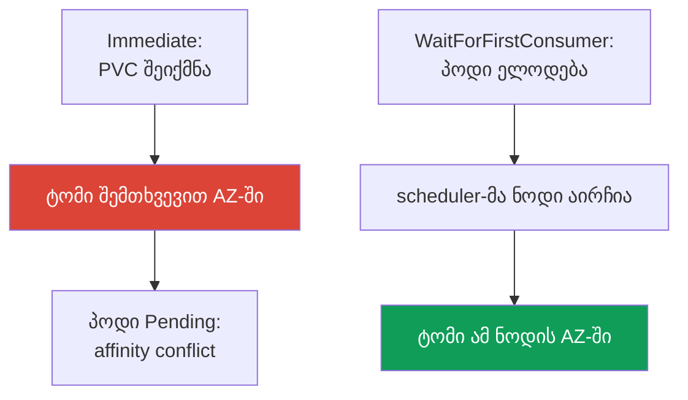
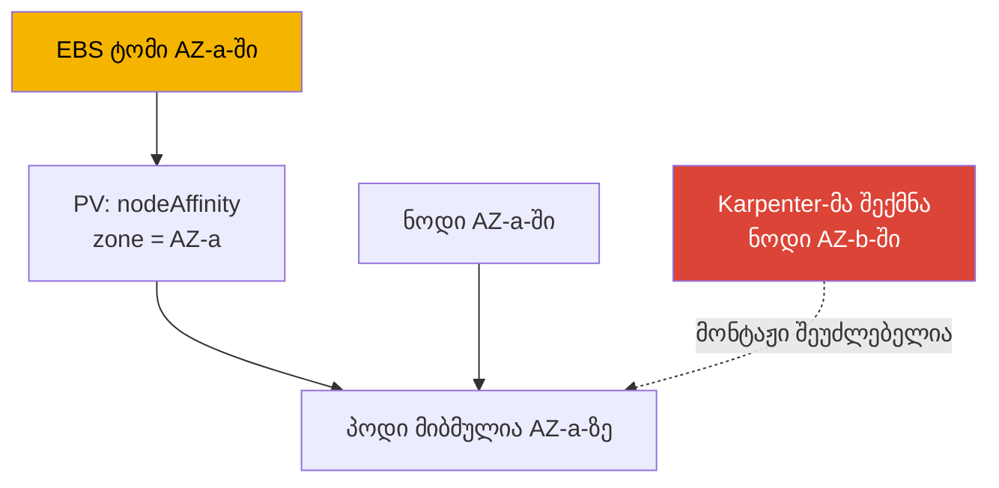

[Русская версия](ru.md) · [Eng version](en.md) · [Versión en español](es.md) · [Version française](fr.md) · [Deutsche Version](de.md) · [繁體中文版](tw.md) · [日本語版](jp.md)
# თავი 23. EBS CSI: gp3, StorageClass, გაფართოება, სნეპშოტები, AZ-ზე მიბმა

> **რა არის შემდეგ.** მე-3 ნაწილი უსაფრთხოებით დასრულდა, მე-4 ნაწილი კი საცავით იწყება. ეს
> თავი EBS-ის ბლოკურ საცავს ეხება: ტომი ხელმისაწვდომობის ერთ ზონაში (AZ) არსებობს და მხოლოდ
> ამ ზონის instance-ზე მონტაჟდება, მთელი სპეციფიკაც ამ ფაქტის გარშემო ტრიალებს. მრავალი
> პოდიდან ჩაწერისთვის საერთო წვდომა და AZ-ებს შორის მუშაობა EFS-სა და FSx-ს ეხება (თავი 24),
> ობიექტური საცავი Mountpoint-ის მეშვეობით კი 25-ე თავშია. CSI-დრაივერის როლი IRSA-ს ან Pod
> Identity-ის მეშვეობით გაიცემა (თავები 16-17) - მას მხოლოდ მივუთითებთ და აღარ გავიმეორებთ.
> Karpenter და კონსოლიდაცია, რომელსაც ნოდები AZ-ებს შორის გადააქვს, მე-12 თავშია, AWS Backup-ის
> მეშვეობით ტომების ბექაპი კი 41-ე თავში. PV, PVC და StatefulSet CKA-დან იცით; აქ EBS-ის
> კონკრეტულ ზონასთან დაკავშირებული სპეციფიკაა.

## 23.1. „StatefulSet-ის პოდი Pending-შია გაჭედილი, ტომი კი უკვე არასწორ ადგილას შეიქმნა“

ეს სცენარი თითქმის ყველას ხვდება, ვისაც StatefulSet ახალ EKS-ზე გადააქვს. PVC შეიქმნა, PV
გამოჩნდა, მაგრამ პოდი არ ეშვება:

```bash
kubectl describe pod db-0
# Events:
#   Warning  FailedScheduling  default-scheduler
#     0/6 nodes are available: 6 node(s) had volume node affinity conflict.
```

საკვანძო სიტყვებია `volume node affinity conflict`. ტომი უკვე მომზადდა, მაგრამ scheduler-ს
პოდის ვერც ერთ ნოდზე განთავსება არ შეუძლია. ვნახოთ, ზუსტად სად აღმოჩნდა ტომი:

```bash
kubectl get pv -o yaml | grep -A6 nodeAffinity
#   nodeAffinity:
#     required:
#       nodeSelectorTerms:
#       - matchExpressions:
#         - key: topology.ebs.csi.aws.com/zone
#           values: [eu-central-1c]
```

ტომი `eu-central-1c`-ში შეიქმნა, დატვირთვისთვის თავისუფალი ნოდები კი `eu-central-1a`-სა და
`eu-central-1b`-ში აღმოჩნდა. EBS ტომის სხვა ზონის instance-ზე მონტაჟი შეუძლებელია - აქედან მოდის
კონფლიქტი.

მიზეზია StorageClass-ში `volumeBindingMode: Immediate`: ტომის მომზადება PVC-ის გამოჩენისთანავე,
მანამდე ხდება, სანამ ცნობილი იქნება, სად გაეშვება პოდი, ამიტომ ზონა შემთხვევით ირჩევა, scheduler
კი ვალდებულია ტომის `nodeAffinity` გაითვალისწინოს და შესაფერის ნოდს ვერ პოულობს. ამას
`WaitForFirstConsumer` აგვარებს - ეს თავის მთავარი თემაა. მაგრამ ჯერ დრაივერი განვიხილოთ.

## 23.2. EBS CSI-დრაივერი: managed addon in-tree-ის ნაცვლად

ისტორიულად EBS ჩაშენებული in-tree provisioner-ით `kubernetes.io/aws-ebs` ერთდებოდა. ის
**deprecated** არის: აღარ ვითარდება, სნეპშოტები არ შეუძლია და `gp3`-ს მხარს არ უჭერს (მხოლოდ
`io1`, `gp2`, `sc1`, `st1`). EKS 1.23-დან CSI-მიგრაცია ჩართულია და EBS-თან მუშაობას ცალკე
CSI-დრაივერი **aws-ebs-csi-driver**, provisioner-ით `ebs.csi.aws.com`, ასრულებს. ის
**managed addon**-ის სახით ყენდება - ვერსიების მართვითა და API-ის მეშვეობით განახლებით:

```bash
aws eks create-addon --cluster-name demo --addon-name aws-ebs-csi-driver \
  --service-account-role-arn arn:aws:iam::111122223333:role/eks-ebs-csi-driver
```

დრაივერს IAM-როლი სჭირდება: controller EC2 API-ს (`CreateVolume`, `AttachVolume`,
`CreateSnapshot`) იძახებს. როლი IRSA-ს ან EKS Pod Identity-ის მეშვეობით გაიცემა (თავები 16-17),
მისი ARN `--service-account-role-arn`-ში გადაეცემა, მზა managed-პოლიტიკა კი
`AmazonEBSCSIDriverPolicy` არის. როლის გარეშე controller `CreateVolume`-ზე `AccessDenied`-ს
იღებს და PVC სხვა მიზეზით რჩება `Pending`-ში - ტომის შემქმნელი არავინაა.

> **EKS Auto Mode - ცალკე provisioner.** Auto Mode-ში (თავი 9) StorageClass იყენებს
> `ebs.csi.eks.amazonaws.com`-ს და არა `ebs.csi.aws.com`-ს. ეს სხვადასხვა დრაივერია, ერთი
> მათგანის ტომს მეორე არ აიღებს. აქ საუბარია სტანდარტულ `ebs.csi.aws.com`-ზე.

## 23.3. StorageClass gp3-სთვის

`gp3` - აქტუალური ზოგადი დანიშნულების SSD-ია: `gp2`-სგან განსხვავებით, რომელშიც IOPS და
გამტარუნარიანობა ტომის ზომასთან ერთად იზრდება, `gp3`-ში ისინი მოცულობისგან **დამოუკიდებლად**
განისაზღვრება (საბაზისო 3000 IOPS და 125 MiB/s ნებისმიერი ზომისთვის). დატვირთვების
უმეტესობისთვის `gp3` `gp2`-ზე უკეთესია.

EKS-ის ნიუანსი: **კლასტერში ნაგულისხმევი StorageClass არის `gp2` in-tree provisioner-ის
მეშვეობით**. ის ისტორიული მიზეზებით რჩება და PVC აშკარად მითითებული `storageClassName`-ის გარეშე
მას გამოიყენებს. `gp3`-სთვის StorageClass **აშკარად უნდა შექმნათ** და სურვილის შემთხვევაში
ნაგულისხმევად აქციოთ.

```yaml
apiVersion: storage.k8s.io/v1
kind: StorageClass
metadata:
  name: gp3
  annotations:
    storageclass.kubernetes.io/is-default-class: "true"
provisioner: ebs.csi.aws.com
volumeBindingMode: WaitForFirstConsumer
allowVolumeExpansion: true
parameters:
  type: gp3
  iops: "3000"
  throughput: "125"
  encrypted: "true"
  kmsKeyId: arn:aws:kms:eu-central-1:111122223333:key/abcd-1234
```

| `parameters` პარამეტრი | დანიშნულება | შენიშვნა |
|---|---|---|
| `type` | ტომის ტიპი: `gp3`, `io2`, `st1` | CSI-სთვის ნაგულისხმევად `gp3` |
| `iops` | სამიზნე IOPS | `gp3`-ში ზომისგან დამოუკიდებელია |
| `throughput` | გამტარუნარიანობა, MiB/s | მხოლოდ `gp3`-სთვის |
| `encrypted` | ტომის დაშიფვრა | ყოველთვის ჩართეთ |
| `kmsKeyId` | KMS გასაღები | მის გარეშე ნაგულისხმევი გასაღები გამოიყენება |

`kmsKeyId`-ს ცალკე მახე ახლავს. თუ ეს თქვენი customer managed key-ია, დრაივერის როლისთვის მხოლოდ
IAM-პოლიტიკა საკმარისი არ არის: **თავად გასაღების პოლიტიკამაც უნდა დაუშვას ეს როლი**. საჭიროა
`kms:GenerateDataKey*`, `kms:Decrypt`, `kms:DescribeKey`, `kms:ReEncrypt*` და, რაც ყველაზე
მნიშვნელოვანია, `kms:CreateGrant`: EBS-ის დაშიფვრა grant-ებით მუშაობს და მათი შექმნის უფლების
გარეშე დრაივერი ტომს შექმნის, მაგრამ **instance-ზე მის მონტაჟს ვერ შეძლებს**. სიმპტომი ადვილად
საცნობია - PVC `Bound` მდგომარეობაშია, პოდი კი გაჭედილია და მოვლენებში KMS-ის `AccessDenied` ჩანს,
თუმცა როლის IAM-პოლიტიკა სწორად გამოიყურება. grant-ს, ჩვეულებრივ, `kms:GrantIsForAWSResource`
პირობით ზღუდავენ. გასაღების პოლიტიკა ყოველთვის უნდა შეამოწმოთ, როდესაც გასაღები იმავე კოდით არ
შექმნილა, რომლითაც კლასტერი, და განსაკუთრებით მაშინ, როდესაც გასაღები სხვა ანგარიშშია: იქ key
policy-ში ნებართვა აუცილებელია (დრაივერის როლი - თავები 16 და 17).

ჩვეულებრივი PVC ამ კლასისთვის და ნაგულისხმევი კლასის შემოწმების ბრძანება:

```yaml
apiVersion: v1
kind: PersistentVolumeClaim
metadata: {name: data}
spec:
  storageClassName: gp3
  accessModes: ["ReadWriteOnce"]
  resources:
    requests: {storage: 20Gi}
```

```bash
kubectl get storageclass
# gp2 (default)  kubernetes.io/aws-ebs  WaitForFirstConsumer  false
# gp3            ebs.csi.aws.com        WaitForFirstConsumer  true
```

## 23.4. volumeBindingMode დეტალურად

ეს EBS-ის StorageClass-ის მთავარი პარამეტრია და 23.1-ში აღწერილი პრობლემაც სწორედ მას უკავშირდება.
ის განსაზღვრავს, **როდის** იქმნება ტომი პოდის დაგეგმვასთან მიმართებით.



- **`Immediate`** - ტომი PVC-ის გამოჩენისთანავე იქმნება. დრაივერმა ჯერ არ იცის, სად გაეშვება
  პოდი და ზონას შემთხვევით ირჩევს. თუ მოგვიანებით პოდის ამ ზონაში განთავსება შეუძლებელია - `volume
  node affinity conflict` და მუდმივი `Pending`.
- **`WaitForFirstConsumer`** - provision-ინგი პოდის დაგეგმვამდე გადაიდება. scheduler ნოდს
  რესურსების, taints-ისა და affinity-ის გათვალისწინებით ირჩევს და დრაივერი ტომს უკვე არჩეული ნოდის
  ზონაში ქმნის. ტომის ტოპოლოგია თავიდანვე ემთხვევა პოდს.

| თვისება | `Immediate` | `WaitForFirstConsumer` |
|---|---|---|
| როდის იქმნება ტომი | PVC-ის გამოჩენისას | პოდის დაგეგმვისას |
| ვინ ირჩევს AZ-ს | დრაივერი, შემთხვევით | scheduler, პოდის განთავსების მიხედვით |
| affinity conflict-ის რისკი | მაღალი | არ არსებობს |
| PVC პოდის გარეშე | ტომი უკვე შექმნილია და უმოქმედოდ არის | `Pending`, ეს ნორმაა |
| EBS-სთვის | არ გამოიყენოთ | ნაგულისხმევი არჩევანი |

დასკვნა მარტივია: **EBS-სთვის ყოველთვის `WaitForFirstConsumer`**. გვერდითი ეფექტი ისაა, რომ PVC
გაშვებული პოდის გარეშე `Pending` მდგომარეობაში რჩება და ეს მოსალოდნელია. თუ ზონების ნაკრების
შეზღუდვა გჭირდებათ, StorageClass-ში `allowedTopologies` მიუთითეთ გასაღებით
`topology.ebs.csi.aws.com/zone` და დაშვებული ზონების სიით.

## 23.5. AZ-ზე მიბმა: რატომ განსაზღვრავს ეს ყველაფერს

EBS ტომი ზონალური რესურსია: კონკრეტულ AZ-ში იქმნება და მხოლოდ **იმავე ზონის** EC2 instance-ზე
მონტაჟდება. ეს AWS-ის და არა Kubernetes-ის შეზღუდვაა და მთელი მექანიკა აქედან გამომდინარეობს.



მიბმის ჯაჭვი: ტომი AZ-a-ში არსებობს; CSI-დრაივერი PV-ზე `nodeAffinity`-ს
`topology.ebs.csi.aws.com/zone = eu-central-1a` მნიშვნელობით აყენებს; scheduler ამ PVC-ის მქონე
პოდს მხოლოდ AZ-a-ს ნოდზე განათავსებს; თუ AZ-a-ში შესაფერისი ნოდი არ არის, პოდი მის გამოჩენამდე
`Pending` მდგომარეობაში დარჩება.

აქედან გამომდინარეობს შედეგი autoscaling-ისთვის. თუ Karpenter ან Cluster Autoscaler ნოდს სხვა
ზონაში შექმნის, უკვე არსებული ტომის მქონე პოდი მასზე ვერ განთავსდება; და პირიქით, Karpenter-ის
კონსოლიდაცია (თავი 12) StatefulSet-ის რეპლიკას სხვა AZ-ში ვერ გადაიტანს - მას ტომის ზონა აკავებს.
სიმძლავრე იმის გათვალისწინებით უნდა დაგეგმოთ, რომ ტომები პოდებს ზონებზე „აჭედებს“.

`volumeClaimTemplates`-ის მქონე StatefulSet-ის თითოეული რეპლიკა საკუთარ ტომს იღებს და საკუთარ
ზონაზეა მიბმული. რეპლიკები ერთ AZ-ში რომ არ მოგროვდეს, მათ `topologySpreadConstraints`-ის
მეშვეობით ანაწილებენ, `topologyKey: topology.kubernetes.io/zone` და `maxSkew: 1` მნიშვნელობებით
(საიმედოობა - თავი 40).

ამავე შეზღუდვის მეორე მხარეა **წვდომის რეჟიმი**. EBS-სთვის ეს პრაქტიკულად ყოველთვის
`ReadWriteOnce` არის: ტომი ერთ ნოდზე მონტაჟდება და `ReadWriteMany` იმ გათვლით, რომ „რამდენიმე პოდმა
ერთსა და იმავე ფაილებში წეროს“, აქ არ მუშაობს. არსებობს `ReadWriteOncePod`-იც - მკაცრი ვარიანტი,
როდესაც ტომს ზუსტად ერთი პოდი იღებს, რაც შემთხვევითი მეორე ჩამწერისგან დასაცავად გამოდგება.
წესის ერთადერთი და ვიწრო გამონაკლისია EBS Multi-Attach `io2` ტიპისთვის, რომელსაც დრაივერი **მხოლოდ
ბლოკურ რეჟიმში** (`volumeMode: Block`), ერთი AZ-ის ფარგლებში და ფაილური სისტემის გარეშე უჭერს
მხარს - აპლიკაციას საზიარო ბლოკური მოწყობილობის გამოყენება თავად უნდა შეეძლოს, მაგალითად,
კლასტერული ფაილური სისტემის მეშვეობით. ეს EFS-ს ვერ ჩაანაცვლებს: რამდენიმე პოდისთვის ფაილებზე
საერთო წვდომა, მით უმეტეს სხვადასხვა ზონიდან, EFS-ით ან FSx-ით წყდება (თავი 24).

## 23.6. ტომის გაფართოება

EBS ტომი მუშაობისას შეიძლება **გაიზარდოს**, თუ StorageClass-ში `allowVolumeExpansion: true` წერია
(იხ. 23.3). შემდეგ საკმარისია PVC-ში მოთხოვნის გაზრდა:

```bash
kubectl patch pvc data -p '{"spec":{"resources":{"requests":{"storage":"50Gi"}}}}'
```

CSI-დრაივერი EC2-ში ტომის მოდიფიკაციას გამოიძახებს და ფაილურ სისტემას გააფართოებს. `gp3`-სთვის ეს
ონლაინ, პოდის გაჩერების გარეშე ხდება. შეზღუდვების დამახსოვრება მნიშვნელოვანია:

- **მხოლოდ ზრდა** - EBS ტომის შემცირება არც PVC-ის და არც AWS-ის მეშვეობით შეიძლება; მიმდინარე
  ზომაზე ნაკლები PVC მოთხოვნა უარყოფილი იქნება;
- **ერთი ტომის ცვლილებების სიხშირის ლიმიტი**: შემდეგი მოდიფიკაცია მხოლოდ წინა მოდიფიკაციის
  `completed` მდგომარეობაში გადასვლის შემდეგაა შესაძლებელი და მცოცავ 24 საათში არაუმეტეს ოთხი
  ცვლილებისა; ამასთან, დიდი ტომის (დაახლოებით 1 TiB) მოდიფიკაცია შეიძლება ექვს საათამდე გაგრძელდეს,
  ამიტომ ხშირი გაფართოებები ზედიზედ ამ შეზღუდვას მიაღწევს (გადაამოწმეთ EBS-ის დოკუმენტაციაში).

გაფართოება სტანდარტული ოპერაციაა, მაგრამ არა ხშირი მცირე კორექტირებების ინსტრუმენტი: განსაზღვრეთ
გონივრული საწყისი ზომა და მნიშვნელოვანი ნაბიჯებით გააფართოეთ.

## 23.7. სნეპშოტები

სნეპშოტები ცალკე კომპონენტის, CSI snapshotter-ის, მეშვეობით მუშაობს და სამ ობიექტს იყენებს:

| ობიექტი | როლი | ანალოგია |
|---|---|---|
| `VolumeSnapshotClass` | როგორ შეიქმნას სნეპშოტები (დრაივერი, პარამეტრები) | როგორც StorageClass |
| `VolumeSnapshot` | მოთხოვნა „შეიქმნას ამ PVC-ის სნეპშოტი“ | როგორც PVC |
| `VolumeSnapshotContent` | ფაქტობრივი სნეპშოტი AWS-ში | როგორც PV |

სნეპშოტი PVC-ზე მითითებით მოითხოვება:

```yaml
apiVersion: snapshot.storage.k8s.io/v1
kind: VolumeSnapshot
metadata: {name: db-snap}
spec:
  volumeSnapshotClassName: ebs-snapclass   # driver: ebs.csi.aws.com
  source:
    persistentVolumeClaimName: data
```

აღდგენა ჩვეულებრივი PVC-ით ხდება, რომლის `dataSource`-ში `kind: VolumeSnapshot`, `name: db-snap`
და `apiGroup: snapshot.storage.k8s.io`, ასევე საჭირო `storageClassName` არის მითითებული. ზონების
ნიუანსი: თავად EBS სნეპშოტი **რეგიონული** ობიექტია, მაგრამ მისგან აღდგენილი ტომი კვლავ
**კონკრეტულ AZ-ში** იქმნება (`WaitForFirstConsumer`-ით - პოდის ზონაში). სნეპშოტი ზონის დაკარგვას
მონაცემების სახით გადაიტანს, მაგრამ აღდგენილი ტომი ისევ ზონალურია და დატვირთვის AZ-ებს შორის
„გაშლის“ საშუალებას არ იძლევა. განრიგით სრულფასოვანი ბექაპი AWS Backup-ს ეკუთვნის (თავი 41); CSI
სნეპშოტები მისი საშენი ბლოკია.

## 23.8. დიაგნოსტიკა

სამი ყველაზე ხშირი სიტუაცია.

| სიმპტომი | მიზეზი | რა უნდა შეამოწმოთ |
|---|---|---|
| `Pending`, `volume node affinity conflict` | ტომი ერთ AZ-შია, ნოდები სხვაში | ზონა PV-ის `nodeAffinity`-ში |
| PVC დიდხანს `Pending`-შია, PV არ არსებობს | დრაივერს როლი არ აქვს ან `WaitForFirstConsumer` პოდის გარეშეა | controller-ის ლოგები, არსებობს თუ არა პოდი |
| `Pending`, `gp3` მხარდაჭერილი არ არის | StorageClass in-tree provisioner-ზეა | `provisioner` StorageClass-ში |
| PVC `Bound` მდგომარეობაშია, პოდი არ ეშვება, KMS-ის `AccessDenied` | დრაივერის როლისთვის `kms:CreateGrant` დაშვებული არ არის | თავად CMK გასაღების პოლიტიკა, პოდის მოვლენები |

პირველ რიგში არსებული StorageClass-ის რეჟიმს ამოწმებენ - ის „ზონალური“ ინციდენტების უმეტესობას
ხსნის:

```bash
kubectl get storageclass gp3 -o jsonpath='{.volumeBindingMode}'
```

ცალკე მზაკვრული შემთხვევაა **„შემთხვევით მუშაობს“**. თუ StorageClass-ს `Immediate` აქვს, მაგრამ
კლასტერის ყველა ნოდი ერთ AZ-ში აღმოჩნდა, კონფლიქტი არ არის: ზონა ყველასთვის ერთია. კონფიგურაცია
გამართულად გამოიყურება, სანამ კლასტერი მეორე AZ-ზე არ გაფართოვდება (ან Karpenter სხვა ზონაში ნოდს
არ შექმნის) - მაშინ `Pending` „უმიზეზოდ“ გამოჩნდება. იღბლიანი კონფიგურაციის სწორიდან გარჩევა მხოლოდ
`volumeBindingMode`-ით შეიძლება: `WaitForFirstConsumer` ყოველთვის სწორია, `Immediate` კი მხოლოდ
ზონების პირველ განსხვავებამდე მუშაობს.

## 23.9. როგორ იყენებენ ამას პროდაქშენში

- **`gp3` აშკარად განსაზღვრული StorageClass-ით.** ნაგულისხმევ `gp2`-ს არ ეყრდნობიან: ქმნიან
  StorageClass-ს `ebs.csi.aws.com`-ით, `gp3` ტიპითა და საჭირო IOPS/throughput-ით.
- **`WaitForFirstConsumer` ყოველთვის.** ზონალური EBS-ისთვის ერთადერთი სწორი რეჟიმია;
  `Immediate`-ს მხოლოდ იქ ტოვებენ, სადაც ერთი ტოპოლოგია გარანტირებულია.
- **`allowVolumeExpansion: true` თავიდანვე.** ამ flag-ის გარეშე ტომის მოგვიანებით გაფართოება არ
  გამოვა.
- **დაშიფვრა ნაგულისხმევად.** `encrypted: "true"` ყველა StorageClass-ში, KMS გასაღები კი
  გააზრებულად.
- **სნეპშოტები ზონალურობის გააზრებით.** რეგულარული სნეპშოტები (ან AWS Backup, თავი 41), მაგრამ
  აღდგენისას კვლავ ზონალური ტომი მიიღება. AZ-ებს შორის წვდომა თუ გჭირდებათ, ეს EFS-ია (თავი 24).
- **სიმძლავრე ზონების მიხედვით იგეგმება.** ტომი პოდს AZ-ზე აბამს; StatefulSet-ის რეპლიკები
  `topologySpreadConstraints`-ის მეშვეობით ნაწილდება.

## 23.10. მინი-გლოსარიუმი

- **EBS CSI-დრაივერი** - `aws-ebs-csi-driver`, managed addon provisioner-ით `ebs.csi.aws.com`;
  EBS ტომების სასიცოცხლო ციკლს მართავს.
- **in-tree provisioner** - ჩაშენებული `kubernetes.io/aws-ebs`, deprecated, `gp3`-ისა და
  სნეპშოტების გარეშე; ნაგულისხმევი `gp2` EKS-ში ჯერ კიდევ მასზეა.
- **`volumeBindingMode`** - როდის ხდება ტომის provision-ინგი: `Immediate` (PVC-ის გამოჩენისას) ან
  `WaitForFirstConsumer` (პოდის დაგეგმვისას).
- **volume node affinity conflict** - scheduler-ის მოვლენა, როდესაც ტომის `nodeAffinity`
  მიუთითებს ზონაზე, სადაც შესაფერისი ნოდი არ არის.
- **EBS-ის წვდომის რეჟიმები** - `ReadWriteOnce` (ერთი ნოდი) და `ReadWriteOncePod` (ზუსტად ერთი
  პოდი); `ReadWriteMany` შესაძლებელია მხოლოდ `io2` Multi-Attach-ის სახით, ერთ AZ-ში,
  `volumeMode: Block` რეჟიმში და ფაილური სისტემის გარეშე. ფაილებზე საერთო წვდომისთვის გამოიყენება
  EFS ან FSx (თავი 24).
- **`kms:CreateGrant`** - უფლება, რომლის გარეშეც დრაივერი ტომს საკუთარი CMK-ით შექმნის, მაგრამ
  ვერ დაამონტაჟებს: EBS-ის დაშიფვრა grant-ებით მუშაობს და ნებართვა გასაღების პოლიტიკაშიც არის
  საჭირო.
- **VolumeSnapshot / Content / Class** - CSI სნეპშოტების ობიექტები: მოთხოვნა, სნეპშოტი AWS-ში,
  კლასი.
- **`allowVolumeExpansion`** - StorageClass-ის flag, რომელიც PVC-ის გაზრდის მეშვეობით ტომის
  გაფართოებას უშვებს.

## 23.11. თავის შეჯამება

- EBS ტომი ზონალურია: ერთ AZ-ში იქმნება და მხოლოდ ამ ზონის instance-ზე მონტაჟდება. ეს EKS-ში
  საცავის მთელ სპეციფიკას განსაზღვრავს.
- ტიპური პრობლემა - StatefulSet-ის პოდი `Pending` მდგომარეობაშია `volume node affinity conflict`
  მოვლენით: ტომი ერთ ზონაში შეიქმნა, დატვირთვისთვის განკუთვნილი ნოდები კი სხვაშია. მიზეზია
  StorageClass-ში `Immediate`.
- EBS-თან მუშაობას CSI-დრაივერი `ebs.csi.aws.com` (managed addon) ასრულებს, რომელსაც როლი
  IRSA/Pod Identity-ის მეშვეობით აქვს (თავები 16-17); in-tree `kubernetes.io/aws-ebs` deprecated
  არის. EKS-ში ნაგულისხმევი StorageClass არის `gp2` in-tree-ზე; `gp3` (IOPS და throughput ზომისგან
  დამოუკიდებლად) აშკარად განისაზღვრება.
- `volumeBindingMode: WaitForFirstConsumer` EBS-სთვის აუცილებელია: ტომი არჩეული ნოდის ზონაში
  იქმნება. `Immediate` ზონების კონფლიქტს იწვევს.
- ტომი PV-ის `nodeAffinity`-ის მეშვეობით პოდს საკუთარ AZ-ზე აბამს; Karpenter რეპლიკას სხვა AZ-ში
  ვერ გადაიტანს (თავი 12), StatefulSet-ის რეპლიკები კი `topologySpreadConstraints`-ის მეშვეობით
  ნაწილდება.
- გაფართოება მხოლოდ ზრდის მიმართულებითაა შესაძლებელი, `allowVolumeExpansion`-ით, `gp3`-სთვის
  ონლაინ და სიხშირის ლიმიტით.
- CSI სნეპშოტები: სნეპშოტი რეგიონულია, მაგრამ აღდგენილი ტომი ისევ ზონალურია. განრიგით
  სრულფასოვანი ბექაპისთვის გამოიყენება AWS Backup (თავი 41).

## 23.12. როგორ გამოგადგებათ ეს რეალურ სამუშაოში

მორიგეობისას „ზონალური“ ინციდენტების უმეტესობა ერთი შემოწმებით იხურება: `kubectl get pv -o yaml`
ბრძანებით `nodeAffinity`-ში ზონის ნახვა და StorageClass-ის `volumeBindingMode`-ის შემოწმება.
`Immediate` პლუს `volume node affinity conflict` - მიზეზი ნაპოვნია, გამოსავალი კი
`WaitForFirstConsumer`-ზე გადასვლა და PVC-ის ხელახლა შექმნაა. სიმძლავრის დაგეგმვისას გახსოვდეთ, რომ
ტომი პოდს ზონაზე აბამს: მასშტაბირება, კონსოლიდაცია და განახლებები დატვირთვას თავის ტომთან ერთად
მეზობელ AZ-ში ვერ გადაიტანს. ყველაზე სახიფათო კონფიგურაცია კი ისაა, რომელიც ერთ ზონაში
„შემთხვევით მუშაობს“: ის მეორე AZ-ზე გაფართოების დღეს გაფუჭდება.

## 23.13. კითხვები თვითშემოწმებისთვის

1. რატომ შეიძლება StatefulSet-ის პოდი `Pending` მდგომარეობაში იყოს `volume node affinity conflict`
   მოვლენით?
2. როგორ გავიგოთ `kubectl get pv -o yaml` ბრძანებით, რომელ AZ-ში შეიქმნა ტომი?
3. რით განსხვავდება `Immediate` `WaitForFirstConsumer`-ისგან და რატომ სჭირდება EBS-ს მეორე?
4. რატომ რჩება PVC გაშვებული პოდის გარეშე `WaitForFirstConsumer`-ის დროს `Pending` მდგომარეობაში -
   ნორმალურია ეს?
5. რა არ შეუძლია in-tree provisioner-ს `kubernetes.io/aws-ebs` და რომელი StorageClass არის
   ნაგულისხმევი EKS-ში?
6. რატომ სჭირდება EBS CSI-დრაივერს IAM-როლი და რომელი თავი აღწერს მის გაცემას?
7. როგორ აბამს EBS ტომი პოდს ზონაზე და რატომ ვერ გადაიტანს Karpenter რეპლიკას სხვა AZ-ში?
8. როგორ გავანაწილოთ StatefulSet-ის რეპლიკები ზონებზე და რატომაა ეს საჭირო ზონალური ტომების
   შემთხვევაში?
9. რა შეზღუდვები აქვს EBS ტომის გაფართოებას და რისი გაკეთებაა პრინციპულად შეუძლებელი?
10. რომელ ზონაში აღმოჩნდება სნეპშოტიდან შექმნილი ტომი და რატომ ვერ წყვეტს სნეპშოტი AZ-ებს შორის
    წვდომის ამოცანას?
11. როგორ გავარჩიოთ საცავის სწორი კონფიგურაცია „იღბლიანი“ კონფიგურაციისგან, რომელიც ერთ AZ-ში
    მუშაობს?
12. საკუთარი KMS გასაღებით ტომი შეიქმნა, მაგრამ პოდი არ ეშვება. რომელი უფლება და ზუსტად სად უნდა
    შეამოწმოთ?
13. რატომ არ აძლევს `ReadWriteMany` რამდენიმე პოდს EBS ტომზე ფაილებთან მუშაობის საშუალებას და რა
    რჩება ერთადერთ გამონაკლისად?

## პრაქტიკა

ამ თემის შესაბამისი კურსის ლაბა: [ლაბა 106 - EBS CSI: gp3, AZ-ზე მიბმა, გაფართოება,
სნეპშოტი](../../labs/106/README_GE.MD). EBS CSI ასევე მონაწილეობს
[ლაბაში 122 - AWS Backup EKS-სთვის](../../labs/122/README_GE.MD), როგორც PVC-ის უკან არსებული
ტომი, რომელიც ბექაპში ხვდება, და EFS-სთან შედარებულია [ლაბაში 107 - EFS CSI: ReadWriteMany
ხელმისაწვდომობის ზონებს შორის](../../labs/107/README_GE.MD). ამის გარდა, ყველაფერი ცოცხალ
კლასტერზე მოწმდება. დაიწყეთ `kubectl get storageclass` ბრძანებით - რომელი StorageClass არის
ნაგულისხმევი, როგორია მისი `volumeBindingMode` და `provisioner`. დარწმუნდით, რომ EBS CSI-დრაივერი
დაყენებულია: `aws eks list-addons --cluster-name <cluster>` და `kubectl get pods -n kube-system |
grep ebs-csi`.

შემდეგ გაიმეორეთ 23.1-ის პრობლემა: შექმენით StorageClass `volumeBindingMode: Immediate`-ით,
რამდენიმე AZ-ში ნოდების მქონე კლასტერზე გაუშვით StatefulSet `volumeClaimTemplates`-ით და იპოვეთ
`Pending` მდგომარეობაში მყოფი პოდი. ნახეთ `kubectl describe pod <pod>` (`volume node affinity
conflict` მოვლენა) და `kubectl get pv -o yaml` (ზონა `nodeAffinity`-ში). შემდეგ ხელახლა შექმენით
StorageClass `WaitForFirstConsumer`-ით, `allowVolumeExpansion: true`-ითა და `encrypted: "true"`-ით,
ხელახლა შექმენით PVC და დარწმუნდით, რომ ტომი პოდის ზონაში იქმნება. ივარჯიშეთ გაფართოებაში `kubectl
patch pvc` ბრძანებით, შემდეგ შექმენით `VolumeSnapshot`, მისგან აღადგინეთ PVC და `kubectl get pv -o
yaml` ბრძანებით გადაამოწმეთ, რომ აღდგენილი ტომის ზონა პოდის ზონას ემთხვევა.

---
[სარჩევი](../README_GE.md) · [თავი 22](../22/ge.md) · [თავი 24](../24/ge.md)
