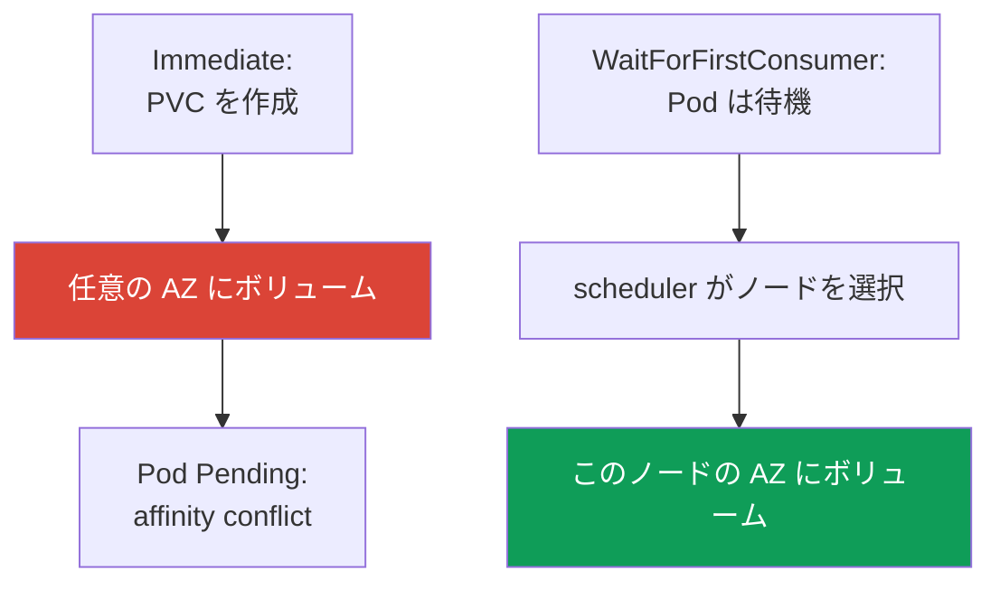
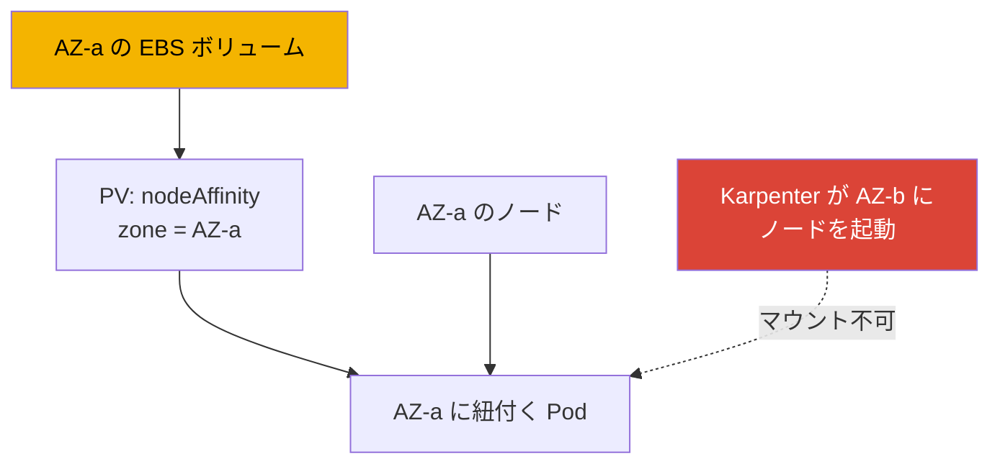

[Eng version](en.md) · [Versión en español](es.md) · [Version française](fr.md) · [Deutsche Version](de.md) · [Русская версия](ru.md) · [ქართული ვერსია](ge.md) · [繁體中文版](tw.md)
# 第23章. EBS CSI: gp3、StorageClass、拡張、スナップショット、AZ への紐付け

> **この先。** 第3部はセキュリティで終わり、第4部はストレージから始まります。この章は EBS ブロックストレージを扱います。ボリュームは1つのアベイラビリティーゾーン (AZ) に存在し、そのゾーンのインスタンスにのみマウントできます。ここで扱うすべての特性はこの事実を中心にしています。複数 Pod からの共有書き込みと AZ をまたぐ利用には EFS と FSx (第24章)、Mountpoint 経由のオブジェクトストレージには第25章を参照してください。CSI ドライバーのロールは IRSA または Pod Identity (第16、17章) で付与します。ここでは参照のみとし、繰り返しません。ノードを AZ 間で移動させる Karpenter と consolidation は第12章、AWS Backup によるボリュームのバックアップは第41章です。PV、PVC、StatefulSet は CKA で学習済みであり、ここでは特定ゾーンにおける EBS の特性を扱います。

## 23.1. 「StatefulSet の Pod が Pending のままなのに、ボリュームはすでに別の場所に作成されている」

新しい EKS へ StatefulSet を移行するほぼすべての人が遭遇するシナリオです。PVC は作成され、PV も現れますが、Pod が起動しません。

```bash
kubectl describe pod db-0
# Events:
#   Warning  FailedScheduling  default-scheduler
#     0/6 nodes are available: 6 node(s) had volume node affinity conflict.
```

重要な語は `volume node affinity conflict` です。ボリュームはすでにプロビジョニングされていますが、scheduler は Pod をどのノードにも配置できません。ボリュームがどこに置かれたかを確認します。

```bash
kubectl get pv -o yaml | grep -A6 nodeAffinity
#   nodeAffinity:
#     required:
#       nodeSelectorTerms:
#       - matchExpressions:
#         - key: topology.ebs.csi.aws.com/zone
#           values: [eu-central-1c]
```

ボリュームは `eu-central-1c` に作成されましたが、ワークロードを受け入れられる空きノードは `eu-central-1a` と `eu-central-1b` にあります。EBS ボリュームは別のゾーンにあるインスタンスへマウントできないため、競合が発生します。

原因は StorageClass の `volumeBindingMode: Immediate` です。PVC の作成直後、Pod がどこへ配置されるか判明する前にボリュームがプロビジョニングされるため、ゾーンが任意に選択されます。scheduler はボリュームの `nodeAffinity` を尊重する必要があり、ノードを見つけられません。これを解決するのが、この章の中心である `WaitForFirstConsumer` です。ただし最初にドライバーを確認します。

## 23.2. EBS CSI ドライバー: in-tree ではなく managed addon

歴史的に EBS は組み込みの in-tree プロビジョナー `kubernetes.io/aws-ebs` により接続されていました。これは **deprecated** です。開発は進んでおらず、スナップショットを扱えず、`gp3` もサポートしません (`io1`、`gp2`、`sc1`、`st1` のみです)。EKS 1.23 以降は CSI migration が有効であり、EBS はプロビジョナー `ebs.csi.aws.com` を持つ独立した CSI ドライバー **aws-ebs-csi-driver** が管理します。これは API を通じたバージョニングと更新ができる **managed addon** としてインストールします。

```bash
aws eks create-addon --cluster-name demo --addon-name aws-ebs-csi-driver \
  --service-account-role-arn arn:aws:iam::111122223333:role/eks-ebs-csi-driver
```

ドライバーには IAM ロールが必要です。コントローラーは EC2 API (`CreateVolume`、`AttachVolume`、`CreateSnapshot`) を呼び出します。ロールは IRSA または EKS Pod Identity (第16、17章) を通じて付与し、その ARN を `--service-account-role-arn` に渡します。用意された managed policy は `AmazonEBSCSIDriverPolicy` です。ロールなしでは、コントローラーは `CreateVolume` に対して `AccessDenied` を受け取り、今度はボリュームを作成するものがいないという別の理由で PVC が `Pending` のままになります。

> **EKS Auto Mode は別のプロビジョナーです。** Auto Mode (第9章) では StorageClass は `ebs.csi.aws.com` ではなく `ebs.csi.eks.amazonaws.com` を使用します。これらは別のドライバーであり、一方のボリュームを他方は引き継げません。ここで扱うのは標準の `ebs.csi.aws.com` です。

## 23.3. gp3 用 StorageClass

`gp3` は現行の汎用 SSD です。IOPS とスループットがボリュームサイズとともに増える `gp2` と異なり、`gp3` ではこれらを容量から **独立して** 指定できます (あらゆるサイズでベースラインは 3000 IOPS と 125 MiB/s)。ほとんどのワークロードでは `gp3` が `gp2` より適しています。

EKS の注意点は、**クラスターのデフォルト StorageClass が in-tree プロビジョナー経由の `gp2` である**ことです。これは歴史的な理由で残っており、明示的な `storageClassName` を持たない PVC はこれを使用します。`gp3` の StorageClass は **明示的に作成**し、必要に応じてデフォルトにする必要があります。

```yaml
apiVersion: storage.k8s.io/v1
kind: StorageClass
metadata:
  name: gp3
  annotations:
    storageclass.kubernetes.io/is-default-class: "true"
provisioner: ebs.csi.aws.com
volumeBindingMode: WaitForFirstConsumer
allowVolumeExpansion: true
parameters:
  type: gp3
  iops: "3000"
  throughput: "125"
  encrypted: "true"
  kmsKeyId: arn:aws:kms:eu-central-1:111122223333:key/abcd-1234
```

| `parameters` パラメーター | 用途 | 注記 |
|---|---|---|
| `type` | ボリューム種別: `gp3`、`io2`、`st1` | CSI ではデフォルトで `gp3` |
| `iops` | 目標 IOPS | `gp3` ではサイズから独立 |
| `throughput` | スループット、MiB/s | `gp3` のみ |
| `encrypted` | ボリュームの暗号化 | 常に有効にする |
| `kmsKeyId` | KMS キー | 指定しない場合はデフォルトキー |

`kmsKeyId` には別の落とし穴があります。これが独自の customer managed key である場合、ドライバーのロールにある IAM policy だけでは不十分です。**キー自体の policy もこのロールを許可する必要があります**。`kms:GenerateDataKey*`、`kms:Decrypt`、`kms:DescribeKey`、`kms:ReEncrypt*`、そして最も重要な `kms:CreateGrant` が必要です。EBS 暗号化は grant を通じて機能するため、grant の作成権限がなければドライバーはボリュームを作成できても、**インスタンスへマウントできません**。症状は明確です。PVC は `Bound` ですが Pod は待機し、ロールの IAM policy が正しく見えるにもかかわらずイベントには KMS からの `AccessDenied` が出ます。通常、grant は `kms:GrantIsForAWSResource` 条件で制限します。キーがクラスターと同じコードで作成されていない場合、特にキーが別アカウントにある場合は、常にキー policy を確認してください。その場合は key policy 内の許可が必須です (ドライバーのロールは第16、17章)。

このクラスを使う通常の PVC と、デフォルトクラスを確認するコマンドです。

```yaml
apiVersion: v1
kind: PersistentVolumeClaim
metadata: {name: data}
spec:
  storageClassName: gp3
  accessModes: ["ReadWriteOnce"]
  resources:
    requests: {storage: 20Gi}
```

```bash
kubectl get storageclass
# gp2 (default)  kubernetes.io/aws-ebs  WaitForFirstConsumer  false
# gp3            ebs.csi.aws.com        WaitForFirstConsumer  true
```

## 23.4. volumeBindingMode を具体的に理解する

これは EBS にとって StorageClass の最重要パラメーターであり、23.1 の問題に直結します。Pod のスケジューリングに対して、**いつ**ボリュームを作成するかを決めます。




- **`Immediate`**: PVC の作成直後にボリュームが作成されます。ドライバーは Pod がどこへ配置されるかをまだ知らないため、任意にゾーンを選択します。その後にそのゾーンへ Pod を配置できなければ、`volume node affinity conflict` と永続的な `Pending` が発生します。
- **`WaitForFirstConsumer`**: Pod のスケジューリングまでプロビジョニングを遅延します。scheduler がリソース、taints、affinity を考慮してノードを選び、その選択されたノードのゾーンにドライバーがボリュームを作成します。ボリュームのトポロジーは構造上 Pod と一致します。

| 特性 | `Immediate` | `WaitForFirstConsumer` |
|---|---|---|
| ボリュームを作成する時点 | PVC 作成時 | Pod のスケジューリング時 |
| AZ を選ぶもの | ドライバー、任意 | scheduler、Pod の配置先に基づく |
| affinity conflict のリスク | 高い | ない |
| Pod のない PVC | ボリュームはすでに作成され残る | `Pending`、これは正常 |
| EBS での使用 | 使用しない | デフォルト |

結論は単純です。**EBS では常に `WaitForFirstConsumer` を使います**。副作用として、起動中の Pod がない PVC は `Pending` のままですが、これは期待される動作です。ゾーンの集合を制限する必要がある場合、StorageClass に `topology.ebs.csi.aws.com/zone` キーと許可ゾーンのリストを持つ `allowedTopologies` を指定します。

## 23.5. AZ への紐付け: なぜこれがすべてを決めるのか

EBS ボリュームはゾーンリソースです。特定の AZ に作成され、**同じゾーン**の EC2 インスタンスにのみマウントされます。これは Kubernetes ではなく AWS の制限であり、すべての仕組みはここから生じます。




紐付けの連鎖は次のとおりです。ボリュームは AZ-a に存在し、CSI ドライバーは `topology.ebs.csi.aws.com/zone = eu-central-1a` に対する `nodeAffinity` を PV に設定します。この PVC を持つ Pod は scheduler により AZ-a のノードにのみ配置されます。AZ-a に適切なノードがなければ、出現するまで Pod は `Pending` です。

ここからオートスケーリングへの影響が導かれます。Karpenter または Cluster Autoscaler が別のゾーンにノードを起動しても、既存のボリュームを持つ Pod はそのノードに配置されません。反対に、Karpenter の consolidation (第12章) は StatefulSet レプリカを別の AZ へ移動できません。ボリュームのゾーンがそれを保持するためです。ボリュームが Pod をゾーンに「固定」することを考慮してキャパシティーを計画する必要があります。

`volumeClaimTemplates` を持つ StatefulSet では、各レプリカが独自のボリュームを取得し、独自のゾーンに紐付きます。レプリカが1つの AZ に集まらないように、`topologyKey: topology.kubernetes.io/zone` と `maxSkew: 1` を持つ `topologySpreadConstraints` で分散します (信頼性は第40章)。

同じ制限のもう半分が **アクセスモード** です。EBS では実質的に常に `ReadWriteOnce` です。ボリュームは1つのノードへマウントされ、「複数 Pod が同じファイルへ書き込めるように」という用途で `ReadWriteMany` は機能しません。より厳密な `ReadWriteOncePod` もあり、ボリュームを正確に1つの Pod にのみ割り当てます。これは偶発的な2つ目の writer を防ぐのに有用です。この規則の例外は1つだけで限定的です。`io2` タイプの EBS Multi-Attach であり、ドライバーは **ブロックモード** (`volumeMode: Block`) のみ、1つの AZ 内、ファイルシステムなしでサポートします。共有ブロックデバイスをアプリケーション自身が、たとえばクラスターファイルシステムを通じて使える必要があります。これを EFS の代わりにはできません。複数 Pod からの共有ファイルアクセス、特に異なるゾーンからのアクセスは、EFS または FSx (第24章) で解決します。

## 23.6. ボリュームの拡張

StorageClass に `allowVolumeExpansion: true` がある場合 (23.3 参照)、EBS ボリュームはオンラインで**拡張**できます。あとは PVC のリクエストを増やすだけです。

```bash
kubectl patch pvc data -p '{"spec":{"resources":{"requests":{"storage":"50Gi"}}}}'
```

CSI ドライバーが EC2 でボリュームの変更を呼び出し、ファイルシステムを拡張します。`gp3` では Pod を停止せずオンラインで行われます。覚えておくべき制限は以下です。

- **増加のみ**: EBS ボリュームを縮小することは PVC 経由でも AWS でもできません。現在より小さい PVC リクエストは拒否されます。
- 1つのボリュームに対する変更の**頻度制限**があります。次の変更は前の変更が `completed` になってからのみ可能であり、ローリング24時間で最大4回です。また大きなボリューム (約 1 TiB) の変更自体に最大6時間かかる場合があるため、頻繁に続けて拡張すると制限に達します (EBS ドキュメントを確認してください)。

拡張は通常の操作ですが、頻繁な細かい調整のための手段ではありません。妥当な初期容量を見積もり、目に見える単位で拡張してください。

## 23.7. スナップショット

スナップショットは CSI snapshotter という別のコンポーネントを通じ、3つのオブジェクトを使います。

| オブジェクト | 役割 | 類推 |
|---|---|---|
| `VolumeSnapshotClass` | スナップショットの作成方法 (ドライバー、パラメーター) | StorageClass のようなもの |
| `VolumeSnapshot` | 「この PVC のスナップショットを作成する」というリクエスト | PVC のようなもの |
| `VolumeSnapshotContent` | AWS 内の実際のスナップショット | PV のようなもの |

スナップショットは PVC への参照でリクエストします。

```yaml
apiVersion: snapshot.storage.k8s.io/v1
kind: VolumeSnapshot
metadata: {name: db-snap}
spec:
  volumeSnapshotClassName: ebs-snapclass   # driver: ebs.csi.aws.com
  source:
    persistentVolumeClaimName: data
```

復元は通常の PVC で行います。`dataSource` に `kind: VolumeSnapshot`、`name: db-snap`、`apiGroup: snapshot.storage.k8s.io`、さらに必要な `storageClassName` を設定します。ゾーンに関する注意点があります。EBS スナップショット自体は **リージョン**オブジェクトですが、そこから復元されたボリュームは再び**特定の AZ** に作成されます (`WaitForFirstConsumer` なら Pod のゾーンです)。スナップショットはデータとしてゾーン障害を乗り越えますが、復元されたボリュームは再びゾーン単位であり、ワークロードを AZ 間に「分散」できるようにはなりません。スケジュールされた完全なバックアップには AWS Backup (第41章) を使います。CSI スナップショットはその構成要素です。

## 23.8. 診断

最もよく発生する3つの状況です。

| 症状 | 原因 | 確認するもの |
|---|---|---|
| `Pending`、`volume node affinity conflict` | ボリュームがある AZ とノードがある AZ が異なる | PV の `nodeAffinity` にあるゾーン |
| PVC が長時間 `Pending`、PV がない | ドライバーにロールがない、または Pod なしの `WaitForFirstConsumer` | コントローラーのログ、Pod の有無 |
| `Pending`、`gp3` がサポートされない | StorageClass が in-tree プロビジョナーを使用 | StorageClass の `provisioner` |
| PVC は `Bound`、Pod は起動せず KMS から `AccessDenied` | ドライバーのロールに `kms:CreateGrant` が許可されていない | CMK 自体の policy、Pod イベント |

最初に既存 StorageClass のモードを確認します。これは大部分の「ゾーン」インシデントを説明します。

```bash
kubectl get storageclass gp3 -o jsonpath='{.volumeBindingMode}'
```

別の厄介なケースは **「偶然動いている」** 状態です。StorageClass が `Immediate` でも、クラスターの全ノードが1つの AZ にあれば競合はありません。全員に対してゾーンが1つしかないためです。クラスターが2つ目の AZ へ拡張されるまで (または Karpenter が別のゾーンにノードを起動するまで)、設定は動いているように見えます。そしてそのときに `Pending` が「突然」発生します。運よく動いている設定と正しい設定を見分けるには、`volumeBindingMode` だけを見ます。`WaitForFirstConsumer` は常に正しく、`Immediate` は最初のゾーン差異が起きるまでしか動きません。

## 23.9. 本番ではどう適用するか

- **明示的な StorageClass の `gp3`。** デフォルトの `gp2` には依存せず、`ebs.csi.aws.com`、`gp3` タイプ、必要な IOPS/throughput を持つ StorageClass を作成します。
- **常に `WaitForFirstConsumer`。** ゾーン単位の EBS にとって唯一正しいモードです。`Immediate` はトポロジーが確実に1つの場合にのみ残します。
- **最初から `allowVolumeExpansion: true`。** このフラグなしに後からボリュームを拡張することはできません。
- **デフォルトで暗号化。** すべての StorageClass で `encrypted: "true"` とし、KMS キーは意図的に選択します。
- **スナップショットとゾーン性の理解。** 定期的なスナップショット (または AWS Backup、第41章) を取りますが、復元すると再びゾーン単位のボリュームになります。AZ 間のアクセスが必要なら EFS (第24章) を使います。
- **ゾーンごとにキャパシティーを計画。** ボリュームは Pod を AZ に固定するため、StatefulSet レプリカは `topologySpreadConstraints` を通じて分散します。

## 23.10. ミニ用語集

- **EBS CSI ドライバー**: `aws-ebs-csi-driver`。プロビジョナー `ebs.csi.aws.com` を持つ managed addon で、EBS ボリュームのライフサイクルを管理します。
- **in-tree プロビジョナー**: `kubernetes.io/aws-ebs`。deprecated であり、`gp3` とスナップショットを扱えません。EKS のデフォルト `gp2` は現在もこれを使用しています。
- **`volumeBindingMode`**: ボリュームをプロビジョニングする時点です。`Immediate` (PVC の作成時) または `WaitForFirstConsumer` (Pod のスケジューリング時) です。
- **volume node affinity conflict**: ボリュームの `nodeAffinity` が適切なノードのないゾーンを指しているときの scheduler イベントです。
- **EBS のアクセスモード**: `ReadWriteOnce` (1ノード) と `ReadWriteOncePod` (正確に1 Pod) です。`ReadWriteMany` が可能なのは、1つの AZ でファイルシステムなしの `volumeMode: Block` を使用する Multi-Attach `io2` のみです。共有ファイルアクセスには EFS または FSx を使います (第24章)。
- **`kms:CreateGrant`**: これがないとドライバーは独自の CMK でボリュームを作成できてもマウントできません。EBS 暗号化は grant を通じて行われ、この許可はキー policy にも必要です。
- **VolumeSnapshot / Content / Class**: CSI スナップショットのオブジェクトです。リクエスト、AWS 内のスナップショット、クラスを表します。
- **`allowVolumeExpansion`**: PVC の増加を通じたボリュームの拡張を許可する StorageClass のフラグです。

## 23.11. 章のまとめ

- EBS ボリュームはゾーン単位です。1つの AZ に作成され、そのゾーンのインスタンスにのみマウントされます。これが EKS におけるストレージの特性すべてを決めます。
- 典型的な問題は、`volume node affinity conflict` で `Pending` になる StatefulSet Pod です。ボリュームは1つのゾーンに作成され、ワークロード用ノードは別のゾーンにあります。原因は StorageClass の `Immediate` です。
- EBS は IRSA/Pod Identity (第16、17章) 経由のロールを持つ CSI ドライバー `ebs.csi.aws.com` (managed addon) が管理します。in-tree の `kubernetes.io/aws-ebs` は deprecated です。EKS のデフォルト StorageClass は in-tree の `gp2` であり、`gp3` (IOPS と throughput はサイズから独立) は明示的に指定します。
- `volumeBindingMode: WaitForFirstConsumer` は EBS で必須です。選択されたノードのゾーンにボリュームが作成されます。`Immediate` はゾーン競合を起こします。
- ボリュームは PV の `nodeAffinity` を通じて Pod を AZ に固定します。Karpenter はレプリカを別の AZ へ移動できません (第12章)。StatefulSet レプリカは `topologySpreadConstraints` を通じて分散します。
- 拡張は `allowVolumeExpansion` により増加方向にのみ可能であり、`gp3` ではオンラインで行えます。頻度制限があります。
- CSI スナップショットでは、スナップショットはリージョン単位ですが、復元されたボリュームは再びゾーン単位です。スケジュールされた完全なバックアップには AWS Backup (第41章) を使います。

## 23.12. 実際の業務でどう役立つか

オンコールでは、大部分の「ゾーン」インシデントが1回の確認で解決します。`kubectl get pv -o yaml` で `nodeAffinity` のゾーンを、StorageClass の `volumeBindingMode` を確認します。`Immediate` と `volume node affinity conflict` があれば原因は判明しており、`WaitForFirstConsumer` への切り替えと PVC の再作成で解決します。キャパシティーを計画するときは、ボリュームが Pod をゾーンへ紐付けることを忘れないでください。スケーリング、consolidation、更新では、自身のボリュームを持つワークロードを隣の AZ へ移動できません。最も危険な設定は、1つのゾーンで「偶然動いている」ものです。2つ目の AZ へ拡張した日に壊れます。

## 23.13. 自己確認のための質問

1. StatefulSet Pod が `volume node affinity conflict` イベントとともに `Pending` のままになるのはなぜですか。
2. `kubectl get pv -o yaml` により、ボリュームがどの AZ に作成されたかをどのように確認できますか。
3. `Immediate` と `WaitForFirstConsumer` の違いは何ですか。EBS で後者が必要なのはなぜですか。
4. `WaitForFirstConsumer` で起動中の Pod がない PVC が `Pending` のままであることが正常なのはなぜですか。
5. in-tree プロビジョナー `kubernetes.io/aws-ebs` にできないことは何ですか。EKS でデフォルトの StorageClass はどれですか。
6. EBS CSI ドライバーに IAM ロールが必要なのはなぜですか。その付与はどの章で説明されていますか。
7. EBS ボリュームはどのように Pod をゾーンへ紐付けますか。Karpenter がレプリカを別の AZ へ移動できないのはなぜですか。
8. StatefulSet のレプリカをゾーン間に分散するにはどうしますか。ゾーン単位のボリュームでそれが必要なのはなぜですか。
9. EBS ボリューム拡張の制限は何ですか。原理的にできないことは何ですか。
10. スナップショットから作成されるボリュームはどのゾーンに置かれますか。スナップショットが AZ 間アクセスの問題を解決しないのはなぜですか。
11. 正しいストレージ設定と、1つの AZ で「運よく」動いている設定をどのように見分けますか。
12. 独自の KMS キーを持つボリュームは作成されたのに Pod が起動しません。どの権限を、具体的にどこで確認しますか。
13. `ReadWriteMany` が複数 Pod に EBS ボリューム上のファイルを使わせられないのはなぜですか。唯一の例外として残るものは何ですか。

## 実践

このテーマのコースラボは [ラボ106 - EBS CSI: gp3、AZ への紐付け、拡張、スナップショット](../../labs/106/README_JP.MD) です。EBS CSI は、PVC の背後にあるボリュームがバックアップ対象となる [ラボ122 - EKS の AWS Backup](../../labs/122/README_JP.MD) にも関わり、[ラボ107 - AZ 間の ReadWriteMany を実現する EFS CSI](../../labs/107/README_JP.MD) では EFS と比較します。これら以外はすべて稼働中のクラスターで確認します。まず `kubectl get storageclass` を実行してください。どの StorageClass がデフォルトか、その `volumeBindingMode` と `provisioner` は何かを確認します。EBS CSI ドライバーがインストールされていることも確認します。`aws eks list-addons --cluster-name <cluster>` と `kubectl get pods -n kube-system | grep ebs-csi` を実行します。

続いて 23.1 の問題を再現します。`volumeBindingMode: Immediate` を持つ StorageClass を作成し、複数の AZ にノードがあるクラスターで `volumeClaimTemplates` を持つ StatefulSet を起動して、`Pending` の Pod を見つけます。`kubectl describe pod <pod>` (`volume node affinity conflict` イベント) と `kubectl get pv -o yaml` (`nodeAffinity` のゾーン) を確認します。次に `WaitForFirstConsumer`、`allowVolumeExpansion: true`、`encrypted: "true"` を持つ StorageClass を再作成し、PVC を再作成して、ボリュームが Pod のゾーンに作成されることを確認します。`kubectl patch pvc` による拡張を試し、その後 `VolumeSnapshot` を作成してそこから PVC を復元します。`kubectl get pv -o yaml` により、復元されたボリュームのゾーンが Pod のゾーンと一致することを確認します。

---
[目次](../README_JP.md) · [第22章](../22/jp.md) · [第24章](../24/jp.md)
