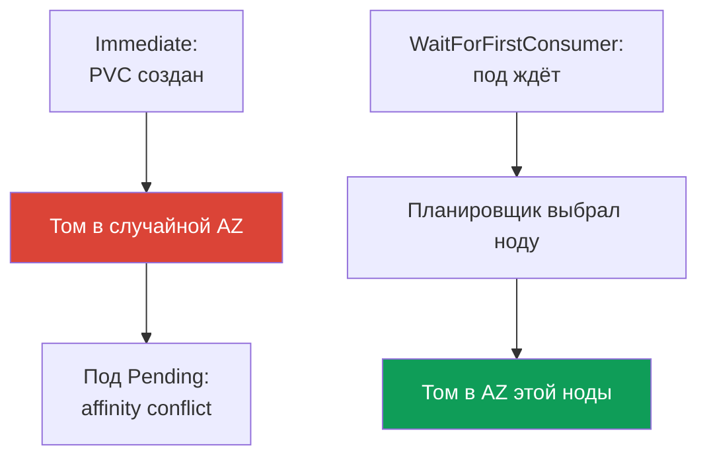
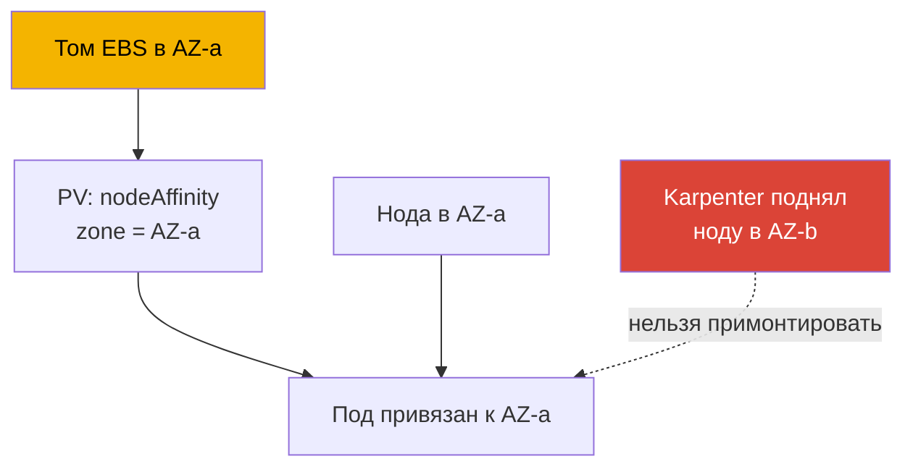

[Eng version](en.md) · [Versión en español](es.md) · [Version française](fr.md) · [Deutsche Version](de.md) · [ქართული ვერსია](ge.md) · [繁體中文版](tw.md) · [日本語版](jp.md)
# Глава 23. EBS CSI: gp3, StorageClass, расширение, снапшоты, привязка к AZ

> **Что дальше.** Часть 3 закончилась на безопасности, Часть 4 открывается хранилищем. Эта
> глава - про блочное хранилище EBS: том живёт в одной зоне доступности (AZ) и монтируется
> только к инстансу этой зоны, и вся специфика вращается вокруг этого факта. Общий доступ на
> запись из многих подов и работа между AZ - это EFS и FSx (глава 24), объектное хранилище
> через Mountpoint - глава 25. Роль для CSI-драйвера выдаётся через IRSA или Pod Identity
> (главы 16-17) - на неё ссылаемся, не повторяя. Karpenter и консолидация, двигающая ноды
> между AZ, - глава 12, бэкап томов через AWS Backup - глава 41. PV, PVC и StatefulSet вы
> знаете с CKA; здесь - специфика EBS в конкретной зоне.

## 23.1. «Под StatefulSet висит в Pending, а том уже создан не там»

Сценарий, который ловят почти все, кто переносит StatefulSet на свежий EKS. PVC создался, PV
появился, но под не стартует:

```bash
kubectl describe pod db-0
# Events:
#   Warning  FailedScheduling  default-scheduler
#     0/6 nodes are available: 6 node(s) had volume node affinity conflict.
```

Ключевые слова - `volume node affinity conflict`. Том уже провизионился, но планировщик не
может поставить под ни на одну ноду. Смотрим, где именно оказался том:

```bash
kubectl get pv -o yaml | grep -A6 nodeAffinity
#   nodeAffinity:
#     required:
#       nodeSelectorTerms:
#       - matchExpressions:
#         - key: topology.ebs.csi.aws.com/zone
#           values: [eu-central-1c]
```

Том создан в `eu-central-1c`, а свободные ноды под нагрузку оказались в `eu-central-1a` и
`eu-central-1b`. Том EBS нельзя примонтировать к инстансу другой зоны - отсюда конфликт.

Причина - `volumeBindingMode: Immediate` у StorageClass: том провизионится сразу после
появления PVC, до того как известно, куда поедет под, поэтому зона выбрана произвольно, а
планировщик обязан уважать `nodeAffinity` тома и не находит ноды. Лечит это
`WaitForFirstConsumer` - ядро главы. Но сначала разберёмся с драйвером.

## 23.2. EBS CSI-драйвер: managed addon вместо in-tree

Исторически EBS подключался встроенным in-tree провизионером `kubernetes.io/aws-ebs`. Он
**deprecated**: не развивается, не умеет снапшоты и не поддерживает `gp3` (только `io1`,
`gp2`, `sc1`, `st1`). Начиная с EKS 1.23 включена CSI-миграция, и работу с EBS ведёт отдельный
CSI-драйвер **aws-ebs-csi-driver** с провизионером `ebs.csi.aws.com`. Ставится он как
**managed addon** - с версионированием и обновлением через API:

```bash
aws eks create-addon --cluster-name demo --addon-name aws-ebs-csi-driver \
  --service-account-role-arn arn:aws:iam::111122223333:role/eks-ebs-csi-driver
```

Драйверу нужна IAM-роль: контроллер вызывает EC2 API (`CreateVolume`, `AttachVolume`,
`CreateSnapshot`). Роль выдаётся через IRSA или EKS Pod Identity (главы 16-17), её ARN
передают в `--service-account-role-arn`, а готовая managed-политика -
`AmazonEBSCSIDriverPolicy`. Без роли контроллер получает `AccessDenied` на `CreateVolume`, и
PVC зависает в `Pending` уже по другой причине - тому некому создаться.

> **EKS Auto Mode - отдельный провизионер.** В Auto Mode (глава 9) StorageClass использует
> `ebs.csi.eks.amazonaws.com`, а не `ebs.csi.aws.com`. Это разные драйверы, том одного не
> подхватывается другим. Здесь речь про стандартный `ebs.csi.aws.com`.

## 23.3. StorageClass для gp3

`gp3` - актуальный SSD общего назначения: в отличие от `gp2`, где IOPS и пропускная
способность растут вместе с размером тома, у `gp3` они задаются **независимо** от объёма
(базовые 3000 IOPS и 125 MiB/s на любом размере). Для большинства нагрузок `gp3` лучше `gp2`.

Тонкость EKS: **дефолтный StorageClass в кластере - `gp2` через in-tree провизионер**. Он
остаётся по историческим причинам, и PVC без явного `storageClassName` уедет на него.
StorageClass для `gp3` надо **создать явно** и при желании сделать дефолтным.

```yaml
apiVersion: storage.k8s.io/v1
kind: StorageClass
metadata:
  name: gp3
  annotations:
    storageclass.kubernetes.io/is-default-class: "true"
provisioner: ebs.csi.aws.com
volumeBindingMode: WaitForFirstConsumer
allowVolumeExpansion: true
parameters:
  type: gp3
  iops: "3000"
  throughput: "125"
  encrypted: "true"
  kmsKeyId: arn:aws:kms:eu-central-1:111122223333:key/abcd-1234
```

| Параметр `parameters` | Назначение | Заметка |
|---|---|---|
| `type` | тип тома: `gp3`, `io2`, `st1` | для CSI по умолчанию `gp3` |
| `iops` | целевые IOPS | у `gp3` независимы от размера |
| `throughput` | пропускная способность, MiB/s | только для `gp3` |
| `encrypted` | шифрование тома | включайте всегда |
| `kmsKeyId` | ключ KMS | без него ключ по умолчанию |

Про `kmsKeyId` есть отдельная засада. Если это свой customer managed key, одной IAM-политики у
роли драйвера недостаточно: **политика самого ключа тоже должна разрешать эту роль**. Нужны
`kms:GenerateDataKey*`, `kms:Decrypt`, `kms:DescribeKey`, `kms:ReEncrypt*` и, что важнее всего,
`kms:CreateGrant`: шифрование EBS работает через гранты, и без права их создавать драйвер
создаст том, но **не сможет примонтировать его к инстансу**. Симптом узнаваемый - PVC
`Bound`, а под висит, и в событиях `AccessDenied` от KMS, хотя IAM-политика роли выглядит
правильной. Грант обычно ограничивают условием `kms:GrantIsForAWSResource`. Проверять политику
ключа нужно всегда, когда ключ создан не тем же кодом, что кластер, и особенно когда ключ живёт
в другом аккаунте: там разрешение в key policy обязательно (роль драйвера - главы 16 и 17).

Обычный PVC под этот класс и команда проверки дефолтного класса:

```yaml
apiVersion: v1
kind: PersistentVolumeClaim
metadata: {name: data}
spec:
  storageClassName: gp3
  accessModes: ["ReadWriteOnce"]
  resources:
    requests: {storage: 20Gi}
```

```bash
kubectl get storageclass
# gp2 (default)  kubernetes.io/aws-ebs  WaitForFirstConsumer  false
# gp3            ebs.csi.aws.com        WaitForFirstConsumer  true
```

## 23.4. volumeBindingMode предметно

Это главный параметр StorageClass для EBS, и именно с ним связана боль из 23.1. Он определяет,
**когда** создаётся том относительно планирования пода.



- **`Immediate`** - том создаётся сразу при появлении PVC. Драйвер ещё не знает, куда поедет
  под, и выбирает зону произвольно. Если позже под нельзя разместить в этой зоне - `volume
  node affinity conflict` и вечный `Pending`.
- **`WaitForFirstConsumer`** - провижининг откладывается до планирования пода. Планировщик
  выбирает ноду с учётом ресурсов, taints и affinity, и уже в зону выбранной ноды драйвер
  создаёт том. Топология тома по построению совпадает с подом.

| Свойство | `Immediate` | `WaitForFirstConsumer` |
|---|---|---|
| Когда создаётся том | при появлении PVC | при планировании пода |
| Кто выбирает AZ | драйвер, произвольно | планировщик, по месту пода |
| Риск affinity conflict | высокий | отсутствует |
| PVC без пода | том уже создан и висит | `Pending`, это норма |
| Для EBS | не использовать | по умолчанию |

Вывод простой: **для EBS всегда `WaitForFirstConsumer`**. Побочный эффект - PVC без
запущенного пода остаётся в `Pending`, и это ожидаемо. Если нужно ограничить набор зон, в
StorageClass задают `allowedTopologies` с ключом `topology.ebs.csi.aws.com/zone` и списком
разрешённых зон.

## 23.5. Привязка к AZ: почему это определяет всё

Том EBS - зональный ресурс: создаётся в конкретной AZ и монтируется только к EC2-инстансу
**той же зоны**. Это ограничение AWS, не Kubernetes, и оно тянет за собой всю механику.



Цепочка привязки: том живёт в AZ-a; CSI-драйвер проставляет PV `nodeAffinity` на
`topology.ebs.csi.aws.com/zone = eu-central-1a`; под с этим PVC планировщик поставит только на
ноду AZ-a; если в AZ-a нет подходящей ноды - под в `Pending`, пока она не появится.

Отсюда следствие для автоскейлинга. Если Karpenter или Cluster Autoscaler поднимет ноду в
другой зоне, под с уже существующим томом на неё не сядет; и наоборот, консолидация Karpenter
(глава 12) не может перенести реплику StatefulSet в другую AZ - её держит зона тома.
Планировать ёмкость нужно с учётом того, что тома «прибивают» поды к зонам.

Для StatefulSet с `volumeClaimTemplates` каждая реплика получает свой том и привязана к своей
зоне. Чтобы реплики не собрались в одной AZ, их разносят через `topologySpreadConstraints` с
`topologyKey: topology.kubernetes.io/zone` и `maxSkew: 1` (надёжность - глава 40).

Вторая половина того же ограничения - **режим доступа**. Для EBS это практически всегда
`ReadWriteOnce`: том монтируется на одну ноду, и `ReadWriteMany` в расчёте на «пусть несколько
подов пишут в одни файлы» здесь не работает. Есть ещё `ReadWriteOncePod` - строгий вариант, где
том получает ровно один под, полезный против случайного второго писателя. Исключение из правила
одно и узкое: EBS Multi-Attach для типа `io2`, и драйвер поддерживает его **только в блочном
режиме** (`volumeMode: Block`), в пределах одной AZ, без файловой системы - разделяемое блочное
устройство приложение должно уметь использовать само, например через кластерную ФС. Замену EFS
из этого не сделать: общий файловый доступ нескольких подов, тем более из разных зон, решается
через EFS или FSx (глава 24).

## 23.6. Расширение тома

EBS-том можно **увеличить** на лету, если в StorageClass стоит `allowVolumeExpansion: true`
(см. 23.3). Дальше достаточно увеличить запрос в PVC:

```bash
kubectl patch pvc data -p '{"spec":{"resources":{"requests":{"storage":"50Gi"}}}}'
```

CSI-драйвер вызовет модификацию тома в EC2 и расширит файловую систему. Для `gp3` это
происходит онлайн, без остановки пода. Ограничения важно помнить:

- **только вверх** - уменьшить том EBS нельзя ни через PVC, ни в AWS; запрос PVC меньше
  текущего будет отклонён;
- **лимит на частоту** изменений одного тома: следующая модификация возможна лишь после того,
  как предыдущая дойдёт до состояния `completed`, и не более четырёх изменений в скользящие 24
  часа; при этом сама модификация крупного тома (около 1 TiB) может длиться до шести часов,
  поэтому частые расширения подряд упрутся в ограничение (сверяйтесь с документацией EBS).

Расширение - штатная операция, но не инструмент для частых мелких подгонок: закладывайте
разумный старт и расширяйте заметными шагами.

## 23.7. Снапшоты

Снапшоты работают через отдельный компонент - CSI snapshotter, с тремя объектами:

| Объект | Роль | Аналогия |
|---|---|---|
| `VolumeSnapshotClass` | как делать снапшоты (драйвер, параметры) | как StorageClass |
| `VolumeSnapshot` | запрос «сделать снапшот этого PVC» | как PVC |
| `VolumeSnapshotContent` | фактический снапшот в AWS | как PV |

Снапшот запрашивается ссылкой на PVC:

```yaml
apiVersion: snapshot.storage.k8s.io/v1
kind: VolumeSnapshot
metadata: {name: db-snap}
spec:
  volumeSnapshotClassName: ebs-snapclass   # driver: ebs.csi.aws.com
  source:
    persistentVolumeClaimName: data
```

Восстановление - обычный PVC с `dataSource`, где `kind: VolumeSnapshot`, `name: db-snap` и
`apiGroup: snapshot.storage.k8s.io`, плюс нужный `storageClassName`. Тонкость про зоны: сам
снапшот EBS - **региональный** объект, но восстановленный из него том создаётся снова в
**конкретной AZ** (с `WaitForFirstConsumer` - в зоне пода). Снапшот переживает потерю зоны как
данные, но восстановленный том опять зональный и не даёт «размазать» нагрузку между AZ.
Полноценный бэкап по расписанию - AWS Backup (глава 41); снапшоты CSI - кирпич под ним.

## 23.8. Диагностика

Три ситуации, которые встречаются чаще всего.

| Симптом | Причина | Что проверить |
|---|---|---|
| `Pending`, `volume node affinity conflict` | том в одной AZ, ноды в другой | зона в `nodeAffinity` PV |
| PVC долго `Pending`, PV нет | нет роли у драйвера или `WaitForFirstConsumer` без пода | логи контроллера, есть ли под |
| `Pending`, `gp3` не поддержан | StorageClass на in-tree провизионере | `provisioner` в StorageClass |
| PVC `Bound`, под не стартует, `AccessDenied` от KMS | роли драйвера не разрешён `kms:CreateGrant` | политику самого ключа CMK, события пода |

Первым делом смотрят режим существующего StorageClass - он объясняет большинство «зональных»
инцидентов:

```bash
kubectl get storageclass gp3 -o jsonpath='{.volumeBindingMode}'
```

Отдельный коварный случай - **«работает случайно»**. Если у StorageClass стоит `Immediate`, но
все ноды кластера оказались в одной AZ, конфликта нет: зона одна на всех. Конфигурация
выглядит рабочей, пока кластер не расширится на вторую AZ (или Karpenter не поднимет ноду в
другой зоне) - и тогда `Pending` появится «на ровном месте». Отличить везучую конфигурацию от
правильной можно только по `volumeBindingMode`: `WaitForFirstConsumer` корректен всегда,
`Immediate` работает лишь до первого расхождения зон.

## 23.9. Как это применяют в продакшене

- **`gp3` явным StorageClass.** Не полагаются на дефолтный `gp2`: заводят StorageClass с
  `ebs.csi.aws.com`, типом `gp3` и нужными IOPS/throughput.
- **`WaitForFirstConsumer` всегда.** Единственный корректный режим для зонального EBS;
  `Immediate` оставляют разве что там, где топология гарантированно одна.
- **`allowVolumeExpansion: true` сразу.** Задним числом расширять том без этого флага не
  выйдет.
- **Шифрование по умолчанию.** `encrypted: "true"` в каждом StorageClass, ключ KMS -
  осознанно.
- **Снапшоты плюс понимание зональности.** Регулярные снапшоты (или AWS Backup, глава 41), но
  восстановление даёт снова зональный том. Нужен доступ между AZ - это EFS (глава 24).
- **Ёмкость планируют по зонам.** Том прибивает под к AZ; реплики StatefulSet разносят через
  `topologySpreadConstraints`.

## 23.10. Мини-глоссарий

- **EBS CSI-драйвер** - `aws-ebs-csi-driver`, managed addon с провизионером `ebs.csi.aws.com`;
  управляет жизненным циклом томов EBS.
- **in-tree провизионер** - встроенный `kubernetes.io/aws-ebs`, deprecated, без `gp3` и
  снапшотов; дефолтный `gp2` в EKS всё ещё на нём.
- **`volumeBindingMode`** - когда провизионится том: `Immediate` (при появлении PVC) или
  `WaitForFirstConsumer` (при планировании пода).
- **volume node affinity conflict** - событие планировщика, когда `nodeAffinity` тома
  указывает на зону без подходящей ноды.
- **Режимы доступа EBS** - `ReadWriteOnce` (одна нода) и `ReadWriteOncePod` (ровно один под);
  `ReadWriteMany` возможен лишь как Multi-Attach `io2` в режиме `volumeMode: Block` в одной
  AZ и без файловой системы. Общий файловый доступ - EFS или FSx (глава 24).
- **`kms:CreateGrant`** - право, без которого драйвер создаст том со своим CMK, но не
  примонтирует его: шифрование EBS идёт через гранты, разрешение нужно и в политике ключа.
- **VolumeSnapshot / Content / Class** - объекты CSI-снапшотов: запрос, снапшот в AWS, класс.
- **`allowVolumeExpansion`** - флаг StorageClass, разрешающий увеличивать том через рост PVC.

## 23.11. Итоги главы

- Том EBS зональный: создаётся в одной AZ и монтируется только к инстансу этой зоны. Это
  определяет всю специфику хранилища в EKS.
- Типовая боль - под StatefulSet в `Pending` с `volume node affinity conflict`: том создан в
  одной зоне, а ноды под нагрузку в другой. Причина - `Immediate` в StorageClass.
- Работу с EBS ведёт CSI-драйвер `ebs.csi.aws.com` (managed addon) с ролью через IRSA/Pod
  Identity (главы 16-17); in-tree `kubernetes.io/aws-ebs` deprecated. Дефолтный StorageClass в
  EKS - `gp2` на in-tree; `gp3` (IOPS и throughput независимо от размера) задают явно.
- `volumeBindingMode: WaitForFirstConsumer` обязателен для EBS: том создаётся в зоне выбранной
  ноды. `Immediate` даёт конфликт зон.
- Том прибивает под к своей AZ через `nodeAffinity` PV; Karpenter не перенесёт реплику в
  другую AZ (глава 12), реплики StatefulSet разносят через `topologySpreadConstraints`.
- Расширение - только вверх, с `allowVolumeExpansion`, онлайн для `gp3`, с лимитом на частоту.
- Снапшоты CSI: снапшот региональный, но восстановленный том снова зональный. Полноценный
  бэкап по расписанию - AWS Backup (глава 41).

## 23.12. Как это пригодится в реальной работе

На дежурстве большинство «зональных» инцидентов закрываются одной проверкой: `kubectl get pv
-o yaml` на зону в `nodeAffinity` и `volumeBindingMode` у StorageClass. `Immediate` плюс
`volume node affinity conflict` - причина найдена, лечится переводом на `WaitForFirstConsumer`
и пересозданием PVC. При планировании ёмкости помните, что том привязывает под к зоне:
масштабирование, консолидация и обновления не могут передвинуть нагрузку со своим томом в
соседнюю AZ. А самая опасная конфигурация - «работает случайно» на одной зоне: сломается в
день расширения на вторую AZ.

## 23.13. Вопросы для самопроверки

1. Почему под StatefulSet может висеть в `Pending` с событием `volume node affinity conflict`?
2. Как по `kubectl get pv -o yaml` понять, в какой AZ создан том?
3. Чем `Immediate` отличается от `WaitForFirstConsumer` и почему для EBS нужен второй?
4. Почему PVC без запущенного пода при `WaitForFirstConsumer` остаётся `Pending` - это норма?
5. Что не умеет in-tree провизионер `kubernetes.io/aws-ebs` и какой StorageClass дефолтный в
   EKS?
6. Зачем EBS CSI-драйверу IAM-роль и какая глава описывает её выдачу?
7. Как том EBS привязывает под к зоне и почему Karpenter не перенесёт реплику в другую AZ?
8. Как разнести реплики StatefulSet по зонам и зачем это нужно с зональными томами?
9. Какие ограничения у расширения тома EBS и что нельзя сделать в принципе?
10. В какой зоне окажется том из снапшота и почему снапшот не решает задачу доступа между AZ?
11. Как отличить правильную конфигурацию хранилища от «везучей», работающей на одной AZ?
12. Том со своим ключом KMS создался, но под не стартует. Какое право проверить и где именно?
13. Почему `ReadWriteMany` не даёт нескольким подам работать с файлами на томе EBS и что
    остаётся единственным исключением?

## Практика

Лаба курса к этой теме: [лаба 106 - EBS CSI: gp3, привязка к AZ, расширение,
снапшот](../../labs/106/README_RU.MD). EBS CSI также участвует в
[лабе 122 - AWS Backup для EKS](../../labs/122/README_RU.MD) как том за PVC, который попадает
в бэкап, и сравнивается с EFS в [лабе 107 - EFS CSI: ReadWriteMany между зонами
доступности](../../labs/107/README_RU.MD). Кроме них, всё проверяется на живом кластере. Начните с `kubectl get
storageclass` - какой StorageClass дефолтный, какой у него `volumeBindingMode` и
`provisioner`. Убедитесь, что стоит EBS CSI-драйвер: `aws eks list-addons --cluster-name
<cluster>` и `kubectl get pods -n kube-system | grep ebs-csi`.

Дальше воспроизведите боль из 23.1: создайте StorageClass с `volumeBindingMode: Immediate`,
поднимите StatefulSet с `volumeClaimTemplates` на кластере с нодами в нескольких AZ и найдите
под в `Pending`. Посмотрите `kubectl describe pod <pod>` (событие `volume node affinity
conflict`) и `kubectl get pv -o yaml` (зона в `nodeAffinity`). Затем пересоздайте StorageClass
с `WaitForFirstConsumer`, `allowVolumeExpansion: true`, `encrypted: "true"`, пересоздайте PVC
и убедитесь, что том создаётся в зоне пода. Потренируйте расширение через `kubectl patch pvc`,
затем сделайте `VolumeSnapshot`, восстановите из него PVC и сверьте по `kubectl get pv -o
yaml`, что зона восстановленного тома совпала с зоной пода.

---
[Оглавление](../README_RU.md) · [Глава 22](../22/ru.md) · [Глава 24](../24/ru.md)
