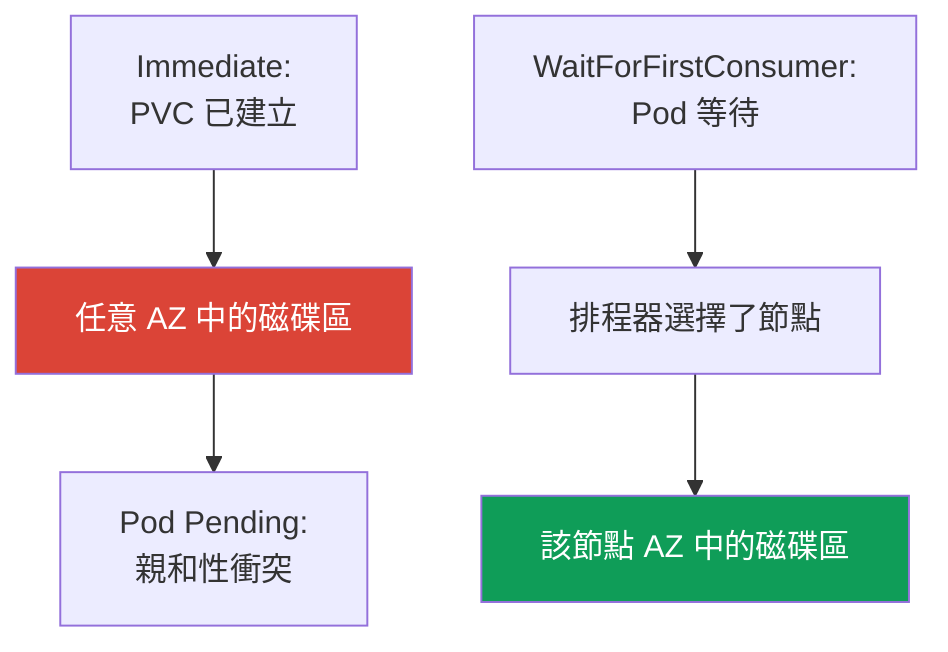
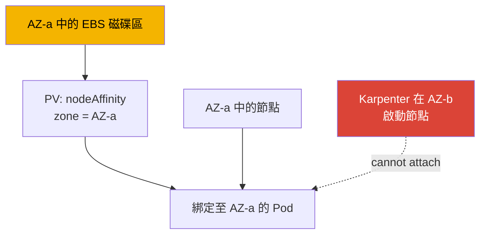

[Русская версия](ru.md) · [Eng version](en.md) · [Versión en español](es.md) · [Version française](fr.md) · [Deutsche Version](de.md) · [ქართული ვერსია](ge.md) · [日本語版](jp.md)
# 第 23 章。EBS CSI：gp3、StorageClass、擴容、快照與 AZ 綁定

> **接下來。** 第 3 部分以安全性結束，第 4 部分由儲存開啟。本章探討 EBS 區塊儲存：磁碟區存在於一個可用區 (AZ)，只能掛載到該區的執行個體，所有特性都圍繞這個事實。多個 Pod 的共用寫入存取和跨 AZ 作業是 EFS 與 FSx（第 24 章），透過 Mountpoint 的物件儲存是第 25 章。CSI 驅動程式的角色透過 IRSA 或 Pod Identity（第 16-17 章）授予，這裡只會參照而不重複說明。Karpenter 以及使節點在 AZ 間移動的整併請見第 12 章，透過 AWS Backup 備份磁碟區請見第 41 章。您從 CKA 已了解 PV、PVC 和 StatefulSet；這裡介紹特定可用區中 EBS 的特性。

## 23.1.「StatefulSet Pod 卡在 Pending，但磁碟區已在錯誤的位置建立」

幾乎每個人在新的 EKS 上遷移 StatefulSet 時都會遇到這個情境。PVC 已建立，PV 也出現了，但 Pod 無法啟動：

```bash
kubectl describe pod db-0
# Events:
#   Warning  FailedScheduling  default-scheduler
#     0/6 nodes are available: 6 node(s) had volume node affinity conflict.
```

關鍵字是 `volume node affinity conflict`。磁碟區已佈建，但排程器無法將 Pod 放到任何節點。來看磁碟區究竟位於何處：

```bash
kubectl get pv -o yaml | grep -A6 nodeAffinity
#   nodeAffinity:
#     required:
#       nodeSelectorTerms:
#       - matchExpressions:
#         - key: topology.ebs.csi.aws.com/zone
#           values: [eu-central-1c]
```

磁碟區建立於 `eu-central-1c`，但可用的負載節點位於 `eu-central-1a` 與 `eu-central-1b`。EBS 磁碟區無法掛載到其他可用區的執行個體，因此發生衝突。

原因是 StorageClass 使用 `volumeBindingMode: Immediate`：磁碟區在 PVC 出現後立即佈建，尚未得知 Pod 將被放到哪裡，因此會任意選擇可用區，而排程器必須遵守磁碟區的 `nodeAffinity`，結果找不到節點。`WaitForFirstConsumer` 能解決此問題，這是本章核心。先來了解驅動程式。

## 23.2. EBS CSI 驅動程式：使用 managed addon 取代 in-tree

從前 EBS 是透過內建的 in-tree 佈建器 `kubernetes.io/aws-ebs` 連接。它已**deprecated**：不再開發、不支援快照，也不支援 `gp3`（只支援 `io1`、`gp2`、`sc1`、`st1`）。自 EKS 1.23 起已啟用 CSI 遷移，EBS 由使用佈建器 `ebs.csi.aws.com` 的獨立 CSI 驅動程式 **aws-ebs-csi-driver** 管理。它以 **managed addon** 安裝，可透過 API 進行版本控制和更新：

```bash
aws eks create-addon --cluster-name demo --addon-name aws-ebs-csi-driver \
  --service-account-role-arn arn:aws:iam::111122223333:role/eks-ebs-csi-driver
```

驅動程式需要 IAM 角色：控制器會呼叫 EC2 API（`CreateVolume`、`AttachVolume`、`CreateSnapshot`）。該角色透過 IRSA 或 EKS Pod Identity（第 16-17 章）授予，其 ARN 傳入 `--service-account-role-arn`，現成的 managed policy 是 `AmazonEBSCSIDriverPolicy`。沒有角色時，控制器會在 `CreateVolume` 收到 `AccessDenied`，PVC 會因另一個原因卡在 `Pending`，即沒有人能建立磁碟區。

> **EKS Auto Mode 使用另一個佈建器。** 在 Auto Mode（第 9 章）中，StorageClass 使用 `ebs.csi.eks.amazonaws.com`，而不是 `ebs.csi.aws.com`。這是不同的驅動程式，一個驅動程式的磁碟區不會由另一個接管。這裡討論的是標準的 `ebs.csi.aws.com`。

## 23.3. gp3 的 StorageClass

`gp3` 是目前通用型 SSD：不同於 IOPS 與輸送量會隨磁碟區大小一同增加的 `gp2`，`gp3` 的兩者可**獨立**於容量設定（任何容量的基準值皆為 3000 IOPS 與 125 MiB/s）。對大多數工作負載來說，`gp3` 優於 `gp2`。

EKS 有一個細節：**叢集預設 StorageClass 是透過 in-tree 佈建器的 `gp2`**。它因歷史原因仍被保留，沒有明確 `storageClassName` 的 PVC 會使用它。必須**明確建立** `gp3` 的 StorageClass，並可選擇將其設為預設值。

```yaml
apiVersion: storage.k8s.io/v1
kind: StorageClass
metadata:
  name: gp3
  annotations:
    storageclass.kubernetes.io/is-default-class: "true"
provisioner: ebs.csi.aws.com
volumeBindingMode: WaitForFirstConsumer
allowVolumeExpansion: true
parameters:
  type: gp3
  iops: "3000"
  throughput: "125"
  encrypted: "true"
  kmsKeyId: arn:aws:kms:eu-central-1:111122223333:key/abcd-1234
```

| `parameters` 參數 | 用途 | 備註 |
|---|---|---|
| `type` | 磁碟區類型：`gp3`、`io2`、`st1` | CSI 預設為 `gp3` |
| `iops` | 目標 IOPS | 對 `gp3` 而言獨立於大小 |
| `throughput` | 輸送量，MiB/s | 僅適用於 `gp3` |
| `encrypted` | 磁碟區加密 | 務必啟用 |
| `kmsKeyId` | KMS 金鑰 | 未指定時使用預設金鑰 |

`kmsKeyId` 有個特別的陷阱。若它是自訂的 customer managed key，僅有驅動程式角色的 IAM policy 還不夠：**金鑰本身的 policy 也必須允許該角色**。需要 `kms:GenerateDataKey*`、`kms:Decrypt`、`kms:DescribeKey`、`kms:ReEncrypt*`，最重要的是 `kms:CreateGrant`：EBS 加密透過 grant 運作，沒有建立 grant 的權限時，驅動程式能建立磁碟區，卻**無法將其掛載到執行個體**。症狀很容易辨認：PVC 是 `Bound`，但 Pod 卡住，事件中有來自 KMS 的 `AccessDenied`，即使角色的 IAM policy 看起來正確。通常使用條件 `kms:GrantIsForAWSResource` 限制 grant。只要金鑰不是由與叢集相同的程式碼建立，就應一律檢查金鑰 policy，尤其是金鑰位於另一個帳戶時：此時 key policy 中的允許是必要的（驅動程式角色請見第 16 與 17 章）。

此類別的一般 PVC，以及檢查預設類別的指令：

```yaml
apiVersion: v1
kind: PersistentVolumeClaim
metadata: {name: data}
spec:
  storageClassName: gp3
  accessModes: ["ReadWriteOnce"]
  resources:
    requests: {storage: 20Gi}
```

```bash
kubectl get storageclass
# gp2 (default)  kubernetes.io/aws-ebs  WaitForFirstConsumer  false
# gp3            ebs.csi.aws.com        WaitForFirstConsumer  true
```

## 23.4. 詳解 volumeBindingMode

這是 EBS 最重要的 StorageClass 參數，也與 23.1 的問題直接相關。它決定磁碟區相對於 Pod 排程的**建立時機**。



- **`Immediate`**：磁碟區在 PVC 出現後立即建立。驅動程式尚不知道 Pod 將被放到何處，會任意選擇可用區。若之後無法將 Pod 放入該可用區，便會出現 `volume node affinity conflict`，並永遠處於 `Pending`。
- **`WaitForFirstConsumer`**：佈建延後至 Pod 排程時。排程器會考量資源、taint 與 affinity 選擇節點，驅動程式隨後在所選節點的可用區建立磁碟區。磁碟區拓撲會在設計上與 Pod 相符。

| 屬性 | `Immediate` | `WaitForFirstConsumer` |
|---|---|---|
| 磁碟區建立時機 | PVC 出現時 | Pod 排程時 |
| 誰選擇 AZ | 驅動程式，任意選擇 | 排程器，依 Pod 所在位置 |
| affinity conflict 的風險 | 高 | 無 |
| 沒有 Pod 的 PVC | 磁碟區已建立並閒置 | `Pending`，屬正常現象 |
| 對 EBS 而言 | 不要使用 | 預設選擇 |

結論很簡單：**EBS 一律使用 `WaitForFirstConsumer`**。副作用是沒有執行中 Pod 的 PVC 保持在 `Pending`，這是預期行為。若需限制可用區集合，可在 StorageClass 中使用鍵 `topology.ebs.csi.aws.com/zone` 和允許的可用區清單設定 `allowedTopologies`。

## 23.5. AZ 綁定：為何它決定一切

EBS 磁碟區是區域資源：在特定 AZ 建立，且只能掛載到**同一可用區**的 EC2 執行個體。這是 AWS 的限制，而不是 Kubernetes 的限制，並由此衍生所有機制。



綁定鏈如下：磁碟區存在於 AZ-a；CSI 驅動程式將 PV `nodeAffinity` 設為 `topology.ebs.csi.aws.com/zone = eu-central-1a`；排程器只會將使用此 PVC 的 Pod 放到 AZ-a 的節點；若 AZ-a 中沒有合適節點，Pod 會保持 `Pending`，直到節點出現。

因此會影響自動擴展。若 Karpenter 或 Cluster Autoscaler 在另一個可用區建立節點，已有磁碟區的 Pod 無法放到該節點；反過來說，Karpenter 整併（第 12 章）也無法將 StatefulSet 副本遷移到另一個 AZ，因為磁碟區所在的可用區限制了它。規劃容量時，必須考慮磁碟區會將 Pod「釘」在可用區。

對具有 `volumeClaimTemplates` 的 StatefulSet，每個副本都有自己的磁碟區，並綁定其所在可用區。為避免副本集中在同一個 AZ，請透過 `topologySpreadConstraints` 分散它們，設定 `topologyKey: topology.kubernetes.io/zone` 與 `maxSkew: 1`（可靠性請見第 40 章）。

同一限制的另一面是**存取模式**。對 EBS 而言，這幾乎總是 `ReadWriteOnce`：磁碟區掛載到單一節點，基於「讓多個 Pod 寫入同一批檔案」的 `ReadWriteMany` 在此不可行。另有 `ReadWriteOncePod`，這是嚴格版本，磁碟區恰好只能給一個 Pod 使用，有助防止意外出現第二個寫入者。此規則有唯一且狹窄的例外：`io2` 類型的 EBS Multi-Attach，驅動程式**只在區塊模式**（`volumeMode: Block`）下支援它，且僅限同一 AZ、沒有檔案系統。應用程式必須自行能夠使用共享區塊裝置，例如透過叢集檔案系統。它無法取代 EFS：多個 Pod 的共用檔案存取，尤其跨不同可用區時，應透過 EFS 或 FSx（第 24 章）解決。

## 23.6. 擴容

若 StorageClass 設有 `allowVolumeExpansion: true`（見 23.3），EBS 磁碟區可在線上**擴大**。接著只須提高 PVC 中的請求：

```bash
kubectl patch pvc data -p '{"spec":{"resources":{"requests":{"storage":"50Gi"}}}}'
```

CSI 驅動程式會呼叫 EC2 中的磁碟區修改並擴展檔案系統。對 `gp3` 而言，這會在線上進行，不需停止 Pod。務必記住以下限制：

- **只能向上**：無論透過 PVC 或 AWS 都無法縮小 EBS 磁碟區；小於目前大小的 PVC 請求會遭拒絕；
- 單一磁碟區的變更有**頻率限制**：下一次修改只能在前一次達到 `completed` 狀態後進行，且在滾動的 24 小時內最多四次變更；大型磁碟區（約 1 TiB）的修改本身可持續六小時，因此頻繁的連續擴容會受此限制（請參閱 EBS 文件）。

擴容是標準作業，但不是用於頻繁小幅調整的工具：請規劃合理的起始容量，並以明顯的步幅擴大。

## 23.7. 快照

快照透過獨立元件 CSI snapshotter 運作，包含三種物件：

| 物件 | 角色 | 類比 |
|---|---|---|
| `VolumeSnapshotClass` | 如何建立快照（驅動程式、參數） | 如同 StorageClass |
| `VolumeSnapshot` | 「為此 PVC 建立快照」的請求 | 如同 PVC |
| `VolumeSnapshotContent` | AWS 中的實際快照 | 如同 PV |

快照會以對 PVC 的參照提出請求：

```yaml
apiVersion: snapshot.storage.k8s.io/v1
kind: VolumeSnapshot
metadata: {name: db-snap}
spec:
  volumeSnapshotClassName: ebs-snapclass   # driver: ebs.csi.aws.com
  source:
    persistentVolumeClaimName: data
```

還原時使用一般 PVC 與 `dataSource`，其中包含 `kind: VolumeSnapshot`、`name: db-snap`、`apiGroup: snapshot.storage.k8s.io`，以及所需的 `storageClassName`。可用區有一項細節：EBS 快照本身是**區域性**物件，但從中還原的磁碟區會再次建立於**特定 AZ**（使用 `WaitForFirstConsumer` 時，位於 Pod 的可用區）。快照能以資料形式存活於可用區故障，但還原後的磁碟區又是區域性的，無法讓工作負載「分散」於各 AZ。完整的排程備份使用 AWS Backup（第 41 章）；CSI 快照是它的基礎元件。

## 23.8. 診斷

最常遇到的三種情況。

| 症狀 | 原因 | 應檢查項目 |
|---|---|---|
| `Pending`、`volume node affinity conflict` | 磁碟區在一個 AZ，節點在另一個 AZ | PV `nodeAffinity` 中的可用區 |
| PVC 長時間 `Pending`，沒有 PV | 驅動程式沒有角色，或 `WaitForFirstConsumer` 沒有 Pod | 控制器日誌，是否有 Pod |
| `Pending`，不支援 `gp3` | StorageClass 使用 in-tree 佈建器 | StorageClass 中的 `provisioner` |
| PVC `Bound`，Pod 未啟動，來自 KMS 的 `AccessDenied` | 驅動程式角色不允許 `kms:CreateGrant` | CMK 本身的 policy、Pod 事件 |

首先檢查現有 StorageClass 的模式，它能解釋大多數「可用區」事件：

```bash
kubectl get storageclass gp3 -o jsonpath='{.volumeBindingMode}'
```

還有一種隱蔽情況：**「碰巧能運作」**。若 StorageClass 設為 `Immediate`，但叢集的所有節點恰好都在同一個 AZ，便不會有衝突：所有人都在同一區。設定看似可運作，直到叢集擴展至第二個 AZ（或 Karpenter 在另一個可用區建立節點），才會無故出現 `Pending`。唯一能區分幸運設定與正確設定的方法是看 `volumeBindingMode`：`WaitForFirstConsumer` 永遠正確，`Immediate` 只在可用區首次分歧前能運作。

## 23.9. 如何在正式環境套用

- **使用明確的 StorageClass 設定 `gp3`。** 不依賴預設 `gp2`：建立使用 `ebs.csi.aws.com`、`gp3` 類型與所需 IOPS/throughput 的 StorageClass。
- **一律使用 `WaitForFirstConsumer`。** 這是區域性 EBS 唯一正確的模式；僅在拓撲保證單一可用區時才可能保留 `Immediate`。
- **立即設定 `allowVolumeExpansion: true`。** 事後沒有此旗標，便無法擴大磁碟區。
- **預設加密。** 每個 StorageClass 都使用 `encrypted: "true"`，並有意識地選擇 KMS 金鑰。
- **快照加上對區域性的理解。** 定期快照（或 AWS Backup，第 41 章），但還原後仍會是區域性磁碟區。需要跨 AZ 存取時，使用 EFS（第 24 章）。
- **依可用區規劃容量。** 磁碟區將 Pod 釘在 AZ；透過 `topologySpreadConstraints` 分散 StatefulSet 副本。

## 23.10. 迷你詞彙表

- **EBS CSI 驅動程式**：`aws-ebs-csi-driver`，使用佈建器 `ebs.csi.aws.com` 的 managed addon；管理 EBS 磁碟區生命週期。
- **in-tree 佈建器**：內建的 `kubernetes.io/aws-ebs`，已 deprecated，沒有 `gp3` 與快照；EKS 的預設 `gp2` 仍使用它。
- **`volumeBindingMode`**：磁碟區何時佈建：`Immediate`（PVC 出現時）或 `WaitForFirstConsumer`（Pod 排程時）。
- **volume node affinity conflict**：當磁碟區的 `nodeAffinity` 指向沒有合適節點的可用區時，排程器產生的事件。
- **EBS 存取模式**：`ReadWriteOnce`（一個節點）與 `ReadWriteOncePod`（恰好一個 Pod）；`ReadWriteMany` 只可能是同一 AZ、無檔案系統下 `volumeMode: Block` 模式的 `io2` Multi-Attach。共用檔案存取應使用 EFS 或 FSx（第 24 章）。
- **`kms:CreateGrant`**：少了此權限，驅動程式可以用自訂 CMK 建立磁碟區，卻不能掛載它：EBS 加密透過 grant 運作，金鑰 policy 也必須允許此權限。
- **VolumeSnapshot / Content / Class**：CSI 快照物件：請求、AWS 中的快照、類別。
- **`allowVolumeExpansion`**：允許透過增加 PVC 大小來擴大磁碟區的 StorageClass 旗標。

## 23.11. 本章總結

- EBS 磁碟區是區域性的：建立於一個 AZ，且只能掛載到該可用區的執行個體。這決定了 EKS 中儲存的所有特性。
- 典型問題是 StatefulSet Pod 因 `volume node affinity conflict` 處於 `Pending`：磁碟區建立於一個可用區，而負載節點在另一個可用區。原因是 StorageClass 中的 `Immediate`。
- EBS 由透過 IRSA/Pod Identity（第 16-17 章）取得角色的 CSI 驅動程式 `ebs.csi.aws.com`（managed addon）管理；in-tree `kubernetes.io/aws-ebs` 已 deprecated。EKS 預設 StorageClass 是 in-tree 的 `gp2`；`gp3`（IOPS 與 throughput 獨立於大小）應明確指定。
- `volumeBindingMode: WaitForFirstConsumer` 對 EBS 是必要的：磁碟區在所選節點的可用區建立。`Immediate` 會導致可用區衝突。
- 磁碟區透過 PV `nodeAffinity` 將 Pod 釘在其 AZ；Karpenter 無法將副本移至另一個 AZ（第 12 章），StatefulSet 副本應透過 `topologySpreadConstraints` 分散。
- 擴容只能向上，使用 `allowVolumeExpansion`；對 `gp3` 可在線上進行，但有頻率限制。
- CSI 快照：快照是區域性的，但還原的磁碟區再次是區域性的。完整的排程備份使用 AWS Backup（第 41 章）。

## 23.12. 這在實際工作中如何派上用場

值班時，大多數「可用區」事件只要一項檢查即可處理：執行 `kubectl get pv -o yaml` 查看 `nodeAffinity` 中的可用區，以及 StorageClass 的 `volumeBindingMode`。`Immediate` 加上 `volume node affinity conflict` 就找到了原因，以 `WaitForFirstConsumer` 取代並重新建立 PVC 即可解決。規劃容量時，請記得磁碟區會將 Pod 綁定至可用區：擴展、整併與更新無法把連同磁碟區的工作負載移到相鄰 AZ。而最危險的設定是單一可用區上「碰巧能運作」：在擴展到第二個 AZ 的那天就會失效。

## 23.13. 自我檢查問題

1. 為什麼 StatefulSet Pod 可能因事件 `volume node affinity conflict` 而卡在 `Pending`？
2. 如何透過 `kubectl get pv -o yaml` 判斷磁碟區建立於哪個 AZ？
3. `Immediate` 與 `WaitForFirstConsumer` 有何不同，為什麼 EBS 需要後者？
4. 為什麼 `WaitForFirstConsumer` 下沒有執行中 Pod 的 PVC 會保持 `Pending`，而這是正常的？
5. in-tree 佈建器 `kubernetes.io/aws-ebs` 缺少什麼功能，EKS 中哪個 StorageClass 是預設？
6. EBS CSI 驅動程式為何需要 IAM 角色，哪一章說明其授予方式？
7. EBS 磁碟區如何將 Pod 綁定到可用區，為什麼 Karpenter 無法將副本移至另一個 AZ？
8. 如何將 StatefulSet 副本分散至各可用區，為何區域性磁碟區需要如此做？
9. EBS 磁碟區擴容有哪些限制，什麼操作原則上無法完成？
10. 從快照還原的磁碟區將位於哪個可用區，為何快照無法解決跨 AZ 存取問題？
11. 如何區分正確的儲存設定與只在單一 AZ 中「幸運」運作的設定？
12. 使用自訂 KMS 金鑰的磁碟區已建立，但 Pod 無法啟動。應檢查什麼權限，又應在哪裡檢查？
13. 為什麼 `ReadWriteMany` 無法讓多個 Pod 操作 EBS 磁碟區上的檔案，唯一例外又是什麼？

## 實作

本課程此主題的實驗室：[實驗室 106：EBS CSI：gp3、AZ 綁定、擴容、快照](../../labs/106/README_TW.MD)。EBS CSI 也參與了[實驗室 122：適用於 EKS 的 AWS Backup](../../labs/122/README_TW.MD)，作為納入備份的 PVC 後方磁碟區，並在[實驗室 107：EFS CSI：可用區間的 ReadWriteMany](../../labs/107/README_TW.MD)中與 EFS 比較。除此之外，所有內容都應在實際叢集上驗證。先從 `kubectl get storageclass` 開始：哪一個 StorageClass 是預設，它的 `volumeBindingMode` 與 `provisioner` 是什麼。確認 EBS CSI 驅動程式已安裝：`aws eks list-addons --cluster-name <cluster>` 與 `kubectl get pods -n kube-system | grep ebs-csi`。

接著重現 23.1 的問題：建立 `volumeBindingMode: Immediate` 的 StorageClass，在節點分布於多個 AZ 的叢集上以 `volumeClaimTemplates` 啟動 StatefulSet，並找出 `Pending` 中的 Pod。查看 `kubectl describe pod <pod>`（`volume node affinity conflict` 事件）以及 `kubectl get pv -o yaml`（`nodeAffinity` 中的可用區）。然後以 `WaitForFirstConsumer`、`allowVolumeExpansion: true`、`encrypted: "true"` 重新建立 StorageClass，重新建立 PVC，並確認磁碟區在 Pod 的可用區建立。練習透過 `kubectl patch pvc` 擴容，接著建立 `VolumeSnapshot`，從中還原 PVC，並以 `kubectl get pv -o yaml` 驗證還原磁碟區的可用區與 Pod 的可用區一致。

---
[目錄](../README_TW.md) · [第 22 章](../22/tw.md) · [第 24 章](../24/tw.md)
