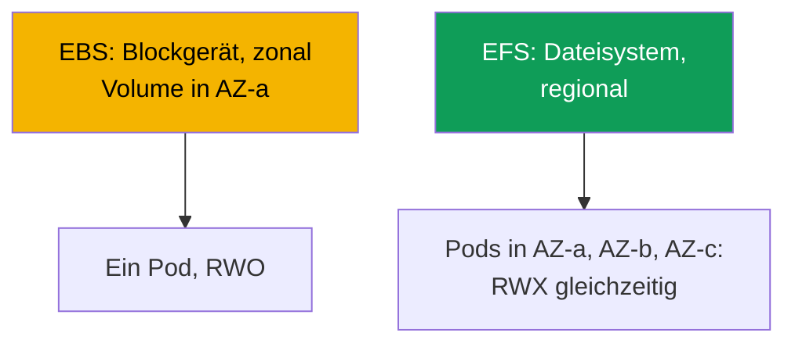
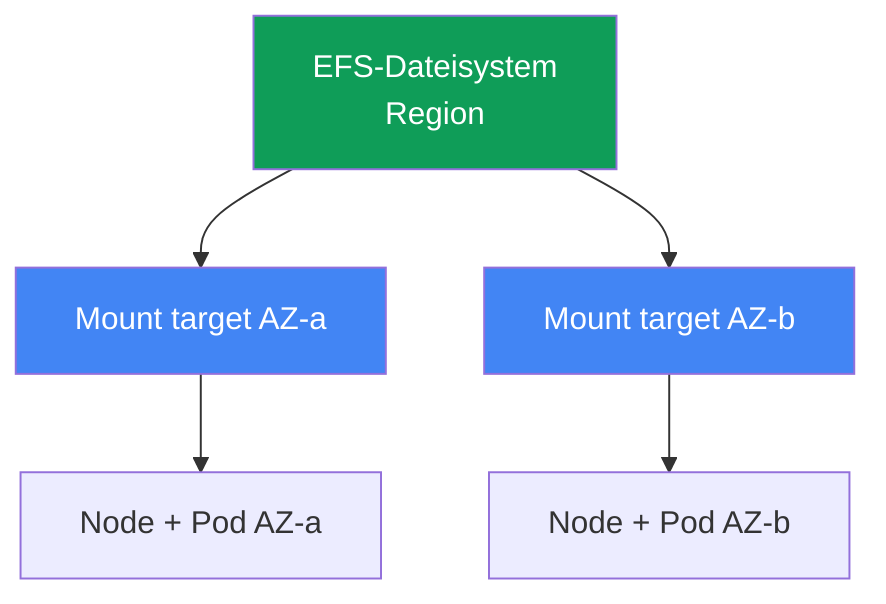

[Русская версия](ru.md) · [Eng version](en.md) · [Versión en español](es.md) · [Version française](fr.md) · [ქართული ვერსია](ge.md) · [繁體中文版](tw.md) · [日本語版](jp.md)
# Kapitel 24. EFS und FSx: gemeinsam genutzter Speicher für Workloads über AZs hinweg

> **Was als Nächstes kommt.** Kapitel 23 zeigte, dass EBS zonal ist: ein Volume in einer AZ, ein Schreiber
> (ReadWriteOnce) und ein Pod, der an die Zone gebunden ist. Dieses Kapitel behandelt die gegenteilige Klasse
> von Aufgaben: gemeinsamen Schreibzugriff vieler Pods (ReadWriteMany) und Betrieb über AZs hinweg. Das sind EFS
> (verwaltetes, regionales NFS) und ein Überblick über FSx. Die Rolle des CSI-Treibers wird über IRSA oder Pod
> Identity bereitgestellt (Kapitel 16-17), Mountpoint for Amazon S3 behandelt Kapitel 25, Backups Kapitel 41 und
> Fargate Kapitel 15. PVs, PVCs und Access Modes kennen Sie aus CKA; hier geht es um die Besonderheiten des
> Netzwerkdateizugriffs in EKS.

## 24.1. „Zwei Pods brauchen ein Volume, aber EBS gibt es nur einem“

Es gibt drei Szenarien, in denen EBS aus Kapitel 23 an seine Grenzen stößt, und alle drei führen
zur selben Lösung.

Erstens: Mehrere Pods müssen gleichzeitig in ein Volume schreiben (ein gemeinsames Upload-Verzeichnis,
Worker für einen Datensatz). Sie versuchen, ein EBS-Volume an die zweite Replik anzuhängen:

```bash
kubectl describe pod uploader-1
# Events:
#   Warning  FailedAttachVolume  attachdetach-controller
#     Multi-Attach error for volume "pvc-..." Volume is already exclusively attached
#     to one node and can't be attached to another
```

`Multi-Attach error` bedeutet, dass das EBS-Volume bereits von einem Node verwendet wird. Der Modus
`ReadWriteOnce` bedeutet genau das: ein Node, ein Schreiber. Keine StorageClass-Einstellung ändert dies;
es ist eine Beschränkung eines Blockgeräts.

Zweites Szenario: Ein Pod muss einen Umzug zwischen AZs überstehen. Mit EBS ist ein Pod an die Zone des
Volumes gebunden (Kapitel 23), und wenn diese AZ keinen Node hat, bleibt der Pod auf `Pending`. Drittens:
Ein Fargate-Pod benötigt persistenten Speicher, aber EBS kann auf Fargate überhaupt nicht gemountet werden
(Kapitel 15).

Alle drei haben dieselbe Ursache: ein Blockgerät. EBS bietet Blockzugriff: eine Platte, die an eine
Instance in einer Zone angehängt ist. Sie benötigen **Netzwerkdateizugriff**, also ein Dateisystem, auf
das mehrere Nodes und Pods gleichzeitig über das Netzwerk zugreifen, unabhängig von der AZ. Das ist EFS.

## 24.2. EBS gegenüber EFS gegenüber FSx: Block gegenüber Datei

Der Unterschied ist nicht „schneller gegenüber langsamer“, sondern das Zugriffsmodell selbst. EBS ist eine
Platte, die AWS an eine Instance anhängt. EFS und FSx sind Dateiserver, auf die Clients über das Netzwerk
zugreifen (NFS bei EFS, NFS/SMB/Lustre bei FSx); daher sehen viele Clients sie gleichzeitig und aus
verschiedenen Zonen.



| Eigenschaft | EBS | EFS | FSx |
|---|---|---|---|
| Modell | Blockgerät | Datei (NFS) | Datei (NFS/SMB/Lustre) |
| Access Modes | ReadWriteOnce | ReadWriteMany | RWX (abhängig vom Typ) |
| Umfang | eine AZ | Region, alle AZs | abhängig vom Typ |
| Über AZs hinweg | nein, Volume an eine Zone gebunden | ja, transparent | abhängig vom Typ |
| Latenz | wie eine lokale SSD | höher, da über das Netzwerk | Lustre: sehr niedrig |
| Preismodell | bereitgestellte Kapazität | genutzte Kapazität | bereitgestellte Kapazität |
| Wann | Datenbanken, einzelner Schreiber | gemeinsames RWX, über AZs hinweg | HPC/ML, Windows/SMB |

Die grobe Auswahlregel lautet: Wenn Sie einen schnellen Schreiber und Plattenleistung benötigen, verwenden
Sie EBS (Kapitel 23); wenn Sie gemeinsamen Schreibzugriff und Betrieb über AZs hinweg benötigen, EFS;
wenn Sie Spezialisierung benötigen (Lustre für HPC, SMB für Windows, ONTAP-Funktionen), FSx.

## 24.3. EFS im Detail: regionales NFS

Amazon EFS ist ein verwaltetes Dateisystem über NFS. Der wesentliche Unterschied zu EBS besteht darin,
dass es **regional** und nicht zonal ist. Die Kapazität ist elastisch: Speicherplatz wird nicht im Voraus
bereitgestellt, und das Dateisystem wächst und schrumpft beim Schreiben und Löschen von Daten.

Regional bedeutet Zugriff aus jeder Zone, aber ein Client (Node) benötigt einen Einstiegspunkt in seiner
eigenen Zone. Dieser Einstiegspunkt ist ein **mount target**, eine EFS-Netzwerkschnittstelle in einem
Subnetz einer bestimmten AZ. Die Regel ist einfach: **ein mount target je Availability Zone** (bei einem
standardmäßigen Dateisystem, nicht One Zone). Ein Node in `eu-central-1a` mountet EFS über das mount target
in `eu-central-1a`.



Daraus folgt die wichtigste Betriebseigenschaft: EFS **ist nicht an eine Zone gebunden**. Ein Pod zieht von
AZ-a nach AZ-b um (Neuerstellung, Karpenter-Konsolidierung, Verlust einer Zone) und sieht weiterhin
identische Daten; er mountet EFS einfach über das mount target der neuen Zone. Den Schmerz aus Kapitel 23
(`volume node affinity conflict`) gibt es bei EFS nicht: Ein EFS-PV enthält keine zonale `nodeAffinity`.
Und `ReadWriteMany` erlaubt vielen Pods auf vielen Nodes, gleichzeitig in das Dateisystem zu schreiben.

Der **aws-efs-csi-driver** mit dem Provisioner `efs.csi.aws.com` verwaltet EFS im Cluster. Installieren Sie
ihn als managed addon:

```bash
aws eks create-addon --cluster-name demo --addon-name aws-efs-csi-driver \
  --service-account-role-arn arn:aws:iam::111122223333:role/eks-efs-csi-driver
```

Der Treiber benötigt eine IAM-Rolle: Der Controller ruft EFS-APIs auf (Erstellen und Löschen von access
points, Lesen von mount targets und Zonen). Gewähren Sie die Rolle über IRSA oder EKS Pod Identity
(Kapitel 16-17), übergeben Sie ihren ARN in `--service-account-role-arn` und verwenden Sie die fertige
managed policy `AmazonEFSCSIDriverPolicy`. Ohne Rolle schlägt dynamisches Provisioning beim Erstellen eines
access point mit `AccessDenied` fehl. Der Treiber ist mit Windows-Container-Images nicht kompatibel.

## 24.4. EFS-Provisioning: statisch und dynamisch

EFS bietet zwei Möglichkeiten, einem Pod ein Volume bereitzustellen, und sie unterscheiden sich von EBS.
Das EFS-Dateisystem selbst wird in beiden Fällen **im Voraus** erstellt (manuell, über Terraform oder in
der Konsole); der CSI-Treiber erstellt es nicht. Er arbeitet auf einem vorhandenen Dateisystem über dessen
`fileSystemId` (wie `fs-0123456789abcdef0`).

**Statisches** Provisioning bedeutet, dass Sie den PV manuell definieren und `fileSystemId` in `volumeHandle`
angeben. Es eignet sich, wenn ein Dateisystem von allen geteilt wird und ein gemeinsames Verzeichnis
akzeptabel ist. Dies ist die einzige Option auf Fargate (24.7).

```yaml
apiVersion: v1
kind: PersistentVolume
metadata: {name: efs-shared}
spec:
  capacity: {storage: 5Gi}          # bei EFS ist die Zahl nominell; die Kapazität ist elastisch
  accessModes: ["ReadWriteMany"]
  persistentVolumeReclaimPolicy: Retain
  storageClassName: efs-sc
  mountOptions: ["tls"]             # NFS-Verschlüsselung in transit, immer beibehalten
  csi:
    driver: efs.csi.aws.com
    volumeHandle: fs-0123456789abcdef0
```

**Dynamisches** Provisioning verwendet eine StorageClass mit `provisioningMode: efs-ap`; für jeden PVC
erstellt der Treiber einen **access point** in einem Dateisystem. Ein access point ist ein Einstiegspunkt
in ein eigenes Unterverzeichnis mit eigenen Berechtigungen und POSIX-Identität, also ein
Isolierungsmechanismus: Unterschiedliche PVCs erhalten unterschiedliche Verzeichnisse in einem EFS und
sehen die Daten der anderen nicht.

```yaml
apiVersion: storage.k8s.io/v1
kind: StorageClass
metadata: {name: efs-sc}
provisioner: efs.csi.aws.com
parameters:
  provisioningMode: efs-ap
  fileSystemId: fs-0123456789abcdef0
  directoryPerms: "755"          # Berechtigungen des Wurzelverzeichnisses des access point
  uid: "1000"                    # OwnerUid des Wurzelverzeichnisses des access point (non-root)
  gid: "1000"                    # OwnerGid; gidRange wird bei angegebenem uid/gid nicht verwendet
  basePath: "/dynamic"           # Wurzel für Unterverzeichnisse der access points
mountOptions: ["tls"]            # Verschlüsselung in transit auch auf dem dynamischen Pfad
```

Der Treiber wendet `uid`, `gid` und `directoryPerms` auf das Wurzelverzeichnis des access point an, also
auf dessen `creationInfo` (`OwnerUid`, `OwnerGid`, `Permissions`). Setzen Sie einen non-root-Eigentümer und
`0755`-Berechtigungen: Andernfalls schlagen Pods mit `runAsNonRoot` beim ersten Schreiben mit `Permission
Denied` fehl, weil das Verzeichniswurzel einer anderen Identität gehört.

Ein PVC für diese Klasse ist gewöhnlich, verwendet aber `ReadWriteMany`:

```yaml
apiVersion: v1
kind: PersistentVolumeClaim
metadata: {name: shared-data}
spec:
  storageClassName: efs-sc
  accessModes: ["ReadWriteMany"]
  resources:
    requests: {storage: 5Gi}
```

| Eigenschaft | Statisch | Dynamisch (`efs-ap`) |
|---|---|---|
| EFS-Dateisystem | im Voraus erstellen | im Voraus erstellen |
| PV | manuell schreiben | Treiber erstellt ihn |
| Bereitstellungseinheit | gesamtes Dateisystem oder Verzeichnis | access point je PVC |
| Verzeichnisisolation | manuell | über access points |
| Auf Fargate | ja | nein (24.7) |

Beachten Sie, dass `storage: 5Gi` in einem EFS-PVC nominell ist. Die Kapazität ist elastisch und wird nicht
vorab bereitgestellt; eine Größenquote wird nicht wie bei EBS angewendet. Die Zahl ist formal erforderlich,
um das PVC-Schema zu erfüllen.

## 24.5. EFS-Nuancen: Leistung, Verschlüsselung, Kosten

EFS ist ein Netzwerkdateisystem und keine lokale Platte, was sein Profil bestimmt. Die Latenz ist höher als
bei EBS: Jede Anfrage durchläuft das Netzwerk zum mount target und zurück. Bei Streaming-Arbeit mit großen
Dateien fällt dies nicht auf, bei Tausenden kleiner synchroner Operationen dagegen deutlich.

Daraus folgt eine Lektion, die Sie sofort verinnerlichen sollten: **EFS ist nicht für Datenbanken mit
niedriger Latenz geeignet**. PostgreSQL oder MySQL auf EFS zu betreiben ist ein Anti-Pattern: Datenbanken
führen viele kleine synchrone Schreibvorgänge aus, die ein Netzwerkdateisystem verlangsamt, und NFS-Sperren
verhalten sich nicht wie eine lokale Platte. Verwenden Sie für Datenbanken zonales EBS mit einem einzelnen
Schreiber (Kapitel 23). EFS eignet sich dort, wo der gemeinsame Zugriff selbst wertvoll ist: statische
Assets und Medien, gemeinsam genutzte Konfigurationen, Datensätze für ML und Verzeichnisse, in die mehrere
Worker schreiben.

Der Dateisystemdurchsatz wird über seinen **throughput mode** konfiguriert:

| Throughput mode | Funktionsweise | Wann |
|---|---|---|
| Elastic | skaliert automatisch mit der Last | unvorhersehbarer oder seltener Zugriff |
| Bursting | wächst mit dem Datenvolumen und sammelt Credits | gleichmäßige, zur Kapazität proportionale Last |
| Provisioned | fester Wert unabhängig von der Kapazität | eine höhere Obergrenze als Bursting bietet wird benötigt |

Verschlüsselung: **at-rest** wird beim Erstellen des Dateisystems aktiviert (mit einem KMS-Schlüssel) und
kann später nicht geändert werden. **In-transit** (TLS) wird auf Client-Seite aktiviert; beim EFS-CSI-Treiber
über die Mount-Option `tls`, die immer aktiviert bleiben sollte, damit NFS-Traffic zwischen Node und mount
target verschlüsselt ist.

Die EFS-Preisgestaltung unterscheidet sich von EBS. Sie zahlen für **tatsächlich genutzten Speicherplatz**
(ohne Volume-Vorabbereitstellung) sowie für Durchsatz entsprechend dem throughput mode. Das verändert die
Denkweise: Bei EBS zahlen Sie für die bereitgestellte Volume-Größe, auch wenn sie leer ist; bei EFS für das,
was sich tatsächlich im Dateisystem befindet.

## 24.6. FSx kurz: wenn EFS nicht passt

EFS deckt gemeinsamen NFS-Zugriff unter Linux ab. Wenn Sie ein anderes Protokoll oder extremen Durchsatz
benötigen, verwenden Sie die Familie **Amazon FSx**: vier unterschiedliche Dateidienste, jeweils mit eigenem
CSI-Treiber. Hier nur ein Überblick, damit Sie wissen, wo Sie suchen müssen.

| FSx | Protokoll | Profil | Wann statt EFS |
|---|---|---|---|
| FSx for Lustre | Lustre | HPC, ML, sehr hoher Durchsatz | ML-Training, S3-Integration |
| FSx for Windows File Server | SMB | Windows-Workloads in einer Domäne | Windows-Container, SMB |
| FSx for NetApp ONTAP | NFS/SMB/iSCSI | ONTAP-Funktionen (Snapshots, Deduplizierung) | ONTAP-Fähigkeiten werden benötigt |
| FSx for OpenZFS | NFS | ZFS, Snapshots, niedrige Latenz | ZFS-Semantik, Latenz |

Die häufigste Option im EKS-Kontext ist **FSx for Lustre**: ein paralleles Dateisystem für ML und HPC mit
sehr hohem Durchsatz und S3-Integration (der Datensatz liegt in S3, während Lustre schnellen POSIX-Zugriff
darauf bietet). Sein Treiber ist das separate Add-on `aws-fsx-csi-driver`. **Windows/SMB** ist die einzige
Option, wenn Sie ein gemeinsames Volume für Windows-Container benötigen: EFS unterstützt sie nicht. Dieser
Kurs behandelt FSx nicht weiter; EFS genügt für 90 % der Aufgaben mit gemeinsamem Speicher über AZs hinweg.

## 24.7. Fargate und EFS

Auf Fargate (Kapitel 15) gibt es keine Nodes, die Sie verwalten, und **EBS kann dort nicht gemountet werden**.
EFS ist der einzige persistente Speicher für Fargate-Pods. Damit ist die Kombination Fargate + EFS das
Standardmuster für zustandsbehaftete Workloads ohne Nodes.

Es gibt zwei Besonderheiten. Erstens unterstützt Fargate nur **statisches** Provisioning (24.4); dynamisches
Provisioning über access points wird auf Fargate nicht unterstützt. Zweitens wird der Treiber auf Fargate
**nicht als DaemonSet installiert**: DaemonSets laufen auf Fargate überhaupt nicht (Kapitel 15), und das
Mounten von EFS ist in die Plattform selbst integriert. Ein Fargate-Pod mountet EFS automatisch, ohne
Treiberkomponenten zu installieren: Ein PV mit statischem Verweis auf `fileSystemId` und ein PVC genügen.

## 24.8. Fehlerdiagnose: Ein Pod mountet EFS nicht

Es gibt normalerweise ein Symptom: Der Pod hängt in `ContainerCreating`, und seine Events zeigen einen
Mount-Timeout:

```bash
kubectl describe pod app-0
# Events:
#   Warning  FailedMount  kubelet
#     Unable to attach or mount volumes: unmounted volumes=[data]:
#     timed out waiting for the condition
```

Anders als bei EBS, wo das Problem zonal ist, läuft bei EFS fast alles auf Netzwerk und Zugriffsrechte
hinaus. Prüfen Sie in dieser Reihenfolge:

| Symptom | Ursache | Was prüfen |
|---|---|---|
| `FailedMount`, Timeout | SG des mount target lässt NFS nicht zu | Inbound 2049 von Node-SGs |
| Kein mount target in der AZ des Pods | Dateisystem hat kein mount target in dieser Zone | `aws efs describe-mount-targets` |
| `AccessDenied` an einem access point | Treiber hat keine Rolle | IRSA-/Pod-Identity-Rolle, Policy |
| Dateisystemname wird nicht aufgelöst | DNS in der VPC | Auflösung von `fs-...efs.<region>...` |
| Verbindung mit TLS schlägt fehl | Option `tls` und Port | Mount-Optionen prüfen |

Die häufigste Ursache ist die **Security Group des mount target**. NFS verwendet Port **2049**, und die SG
des mount target muss eine Inbound-Regel auf 2049 von der SG der Cluster-Nodes haben. Ohne diese Regel wartet
das Mounten bis zum Timeout. Prüfen Sie mount targets wie folgt:

```bash
# ob es in jeder Node-Zone ein mount target gibt und in welchem Zustand es ist
aws efs describe-mount-targets --file-system-id fs-0123456789abcdef0 \
  --query 'MountTargets[].{AZ:AvailabilityZoneName,State:LifeCycleState,IP:IpAddress}'
```

Gehen Sie danach die Liste weiter durch: In **jeder** Zone, in der Nodes mit diesem Pod laufen, existiert ein
mount target (ohne target in der Zone des Pods ist das Mounten unmöglich); der Treiber hat eine Rolle mit
`AmazonEFSCSIDriverPolicy`; der Dateisystemname wird in der VPC aufgelöst (DNS-Auflösung ist erforderlich);
und die Option `tls` ist für die Verschlüsselung in transit aktiviert.

Eine eigene Problemklasse sind **veraltete NFS-Sperren**. Eine Anwendung, die eine Dateisperre über
`flock`/`lockf` setzt, hält sie als Sperrstatus auf NFSv4-Seite, und alle EFS-Sperren sind **advisory**: Sie
werden nur von Beteiligten berücksichtigt, die die Sperre selbst prüfen; der Kernel verbietet Schreibvorgänge
nicht. Bei einem Crash-Neustart (`kill -9`, OOM, harte Eviction) stirbt der Pod, ohne die Sperre freizugeben,
und bei einem solchen Ende kann sie nicht sauber freigegeben werden. NFSv4 behält die Sperre, bis der Lease
des besitzenden Clients abläuft: Ein lebender Client erneuert seinen Lease, ein verschwundener nicht, und der
Server gibt die Sperre erst nach Ablauf frei. Das Symptom ist, dass ein neuer Pod startet, aber beim Versuch,
dieselbe Sperre zu erhalten, hängt, weil die vorherige Sperre auf EFS noch eine Zeit lang als belegt erscheint.
Abhilfen: Führen Sie ein graceful shutdown aus, damit die Anwendung ihre Sperre vor dem Beenden freigibt;
lassen Sie nach einem Neustart den Lease ablaufen, statt die Sperre in einer Schleife zu hämmern; verwenden
Sie ein Single-Writer-Muster, wenn nur ein Pod in ein Verzeichnis auf gemeinsamem EFS schreibt; entwerfen Sie
Anwendungen ohne Dateisperren auf EFS und verlagern Sie Koordination aus dem Netzwerkdateisystem heraus (in
eine Datenbank oder eine verteilte Sperre).

## 24.9. Anwendung in der Produktion

- **EFS für RWX und über AZs hinweg.** Gemeinsamer Schreibzugriff vieler Pods und Betrieb über Zonen hinweg
  sind das Profil von EFS. Behalten Sie Workloads mit einem einzelnen Schreiber und Plattenleistung auf EBS
  (Kapitel 23).
- **Access points zur Isolation.** Dynamisches `efs-ap` gibt jedem PVC ein eigenes Verzeichnis mit
  Berechtigungen und POSIX-Identität; ein Dateisystem bedient viele Workloads sicher.
- **Verschlüsselung in transit standardmäßig.** Die Option `tls` ist immer aktiviert; aktivieren Sie
  Verschlüsselung at-rest beim Erstellen des Dateisystems mit einem KMS-Schlüssel.
- **Nicht für Datenbanken.** Verwenden Sie EFS für Medien, Assets, Konfigurationen, ML-Datensätze und
  gemeinsame Verzeichnisse. Verwenden Sie zonales EBS für Datenbanken; die Latenz eines
  Netzwerkdateisystems ist für sie toxisch.
- **Ein mount target in jeder Zone.** Das Dateisystem muss in jeder AZ, in der Nodes leben, ein mount target
  haben; die SG des mount target erlaubt 2049 von Node-SGs.
- **FSx für Spezialisierung.** Lustre für ML/HPC-Durchsatz mit S3-Integration, Windows File Server für SMB
  und Windows-Container, ONTAP für seine eigenen Funktionen. EFS genügt für gemeinsames NFS.

## 24.10. Mini-Glossar

- **EFS**: Amazon Elastic File System, verwaltetes regionales NFS mit elastischer Kapazität und dem Modus
  ReadWriteMany.
- **EFS-CSI-Treiber**: `aws-efs-csi-driver`, ein managed addon mit dem Provisioner `efs.csi.aws.com`; arbeitet
  auf einem vorab erstellten Dateisystem.
- **mount target**: eine EFS-Netzwerkschnittstelle in einem Subnetz einer bestimmten AZ; der Einstiegspunkt
  für Nodes in dieser Zone, einer je Availability Zone.
- **access point**: ein Einstiegspunkt in ein EFS-Unterverzeichnis mit eigenen Berechtigungen und
  POSIX-Identität; die Grundlage für dynamisches Provisioning und Verzeichnisisolation.
- **provisioningMode: efs-ap**: ein StorageClass-Modus, in dem der Treiber für jeden PVC einen access point
  erstellt.
- **throughput mode**: ein EFS-Durchsatzmodus: Elastic, Bursting oder Provisioned.
- **ReadWriteMany (RWX)**: ein Access Mode: Ein Volume wird gleichzeitig von vielen Pods auf vielen Nodes zum
  Schreiben gemountet.

## 24.11. Zusammenfassung des Kapitels

- EBS stößt dort an Grenzen, wo gemeinsamer Schreibzugriff nötig ist (RWO, `Multi-Attach error`), ein Umzug
  über AZs hinweg nötig ist oder Speicher auf Fargate benötigt wird. Die Antwort auf alle drei Fälle ist
  Netzwerkdateizugriff: EFS.
- EFS ist regional: Der Zugriff aus jeder Zone erfolgt über ein mount target in jeder AZ (eines je Zone). Ein
  Pod zieht zwischen AZs um und sieht seine Daten weiterhin; bei EFS gibt es keinen `volume node affinity
  conflict` aus Kapitel 23, und `ReadWriteMany` erlaubt viele Schreiber.
- `efs.csi.aws.com` (das managed addon `aws-efs-csi-driver`) übernimmt die Arbeit, mit einer Rolle über
  IRSA/Pod Identity (Kapitel 16-17) und der Policy `AmazonEFSCSIDriverPolicy`. Das Dateisystem wird im Voraus
  erstellt; der Treiber arbeitet darauf über `fileSystemId`.
- Provisioning ist statisch (ein manuell definierter PV auf `fileSystemId`) oder dynamisch
  (`provisioningMode: efs-ap`, ein access point je PVC zur Verzeichnis- und UID-Isolation).
- EFS ist ein Netzwerkdateisystem: Seine Latenz ist höher als bei EBS, und es ist nicht für Datenbanken mit
  niedriger Latenz geeignet; es passt zu Medien, Assets, Konfigurationen und ML-Datensätzen. Der Throughput
  ist Elastic/Bursting/Provisioned; Verschlüsselung ist at-rest (KMS) und in-transit (`tls`). Sie zahlen für
  genutzte Kapazität plus Durchsatz.
- FSx dient der Spezialisierung: Lustre (HPC/ML, S3-Integration), Windows File Server (SMB), ONTAP und
  OpenZFS; jeder hat seinen eigenen CSI-Treiber. EFS genügt für gemeinsames NFS über AZs hinweg.
- Auf Fargate kann EBS nicht gemountet werden, und EFS ist der einzige persistente Speicher; nur statisches
  Provisioning wird unterstützt, und das Mounten ist ohne DaemonSet in die Plattform integriert.
- Prüfen Sie zur Fehlerdiagnose beim Mounten Port 2049 der SG des mount target von Node-SGs aus, das Vorhandensein
  eines mount target in der Zone des Pods, die Treiberrolle, DNS-Auflösung und die Option `tls`.

## 24.12. Nutzen in der praktischen Arbeit

Im Bereitschaftsdienst geht es bei EFS-Incidents fast immer um Netzwerk und Berechtigungen, nicht um Zonen.
Wenn ein Pod mit `FailedMount` in `ContainerCreating` hängt, führen Sie zuerst `aws efs describe-mount-targets`
aus: Gibt es ein target in der Zone des Pods, und ist Port 2049 in seiner SG von den Nodes aus geöffnet? Das
löst die meisten Fälle. Behalten Sie beim Entwurf die Grenze aus Kapitel 23 im Kopf: EBS ist für einen
schnellen Schreiber und Leistung, EFS für gemeinsamen Zugriff und Betrieb über AZs hinweg; legen Sie niemals
eine Datenbank auf ein Netzwerkdateisystem. Wenn ein Fargate-Workload mit einer Zustandsanforderung kommt,
denken Sie daran, dass es genau eine Wahl gibt: statisches EFS. Und wenn Engineers nach „Dateispeicher wie im
Rechenzentrum“ mit SMB oder ML-Durchsatz fragen, ist das FSx-Gebiet; vergleichen Sie Lustre und Windows File
Server, bevor Sie EFS-Workarounds bauen.

## 24.13. Fragen zur Selbstkontrolle

1. Warum kann ein EBS-Volume nicht zugleich an zwei Pods angehängt werden, und wie sieht der Fehler aus?
2. Wie unterscheidet sich aus Sicht der Client-Anzahl Blockzugriff (EBS) von Dateizugriff (EFS)?
3. Warum wird EFS regional und EBS zonal genannt, und was ist ein mount target?
4. Wie viele mount targets werden benötigt, und warum übersteht ein Pod auf EFS einen Umzug zwischen AZs?
5. Warum benötigt der EFS-CSI-Treiber eine IAM-Rolle, und welche managed policy benötigt er?
6. Wie unterscheidet sich statisches EFS-Provisioning von dynamischem Provisioning über `efs-ap`?
7. Was ist ein access point, und wie stellt er Verzeichnis- und UID-Isolation bereit?
8. Warum sollte EFS nicht für Datenbanken verwendet werden, und wofür eignet es sich?
9. Welche EFS-throughput modes gibt es, und wie unterscheidet sich sein Preismodell von EBS?
10. Wie werden at-rest- und in-transit-Verschlüsselung für EFS aktiviert?
11. Warum ist auf Fargate nur statisches Provisioning verfügbar, und warum wird kein DaemonSet benötigt?
12. Ein Pod hängt mit `FailedMount` auf EFS: Welche Ursachen prüfen Sie und in welcher Reihenfolge?
13. Wann wird FSx statt EFS benötigt, und welche FSx-Option ist für ML und welche für Windows?

## Praxis

Das Kurs-Lab zu diesem Thema ist [Lab 107: EFS CSI: ReadWriteMany über Availability Zones
hinweg](../../labs/107/README_DE.MD). Darüber hinaus wird alles auf einem Live-Cluster geprüft. Stellen Sie
sicher, dass der EFS-CSI-Treiber installiert ist: `aws eks list-addons --cluster-name <cluster>` und `kubectl
get pods -n kube-system | grep efs-csi`. Untersuchen Sie ein vorhandenes Dateisystem: `aws efs
describe-file-systems`, dann `aws efs describe-mount-targets --file-system-id fs-...`; prüfen Sie, ob in jeder
Zone Ihrer Nodes ein mount target vorhanden und im Zustand `available` ist.

Reproduzieren Sie anschließend RWX: Erstellen Sie eine StorageClass mit `provisioningMode: efs-ap` und Ihrer
`fileSystemId`, stellen Sie ein Deployment mit 2-3 Replikas in unterschiedlichen AZs bereit, die einen
`ReadWriteMany`-PVC verwenden, und prüfen Sie, dass alle Replikas gleichzeitig in das gemeinsame Verzeichnis
schreiben (was EBS nicht erlaubt). Führen Sie `kubectl get pv -o yaml` aus: Anders als bei EBS hat ein EFS-PV
keine zonale `nodeAffinity`. Unterbrechen Sie anschließend das Mounten absichtlich: Entfernen Sie die Regel
der SG des mount target für Port 2049, erstellen Sie einen Pod neu und suchen Sie in `kubectl describe pod`
nach `FailedMount`; stellen Sie die Regel wieder her und prüfen Sie, dass das Mounten gelingt. Wenn Sie Zugriff
auf ein Fargate-Profil haben, wiederholen Sie dies mit einem statischen PV auf `fileSystemId` und vergleichen
Sie: Ein EBS-Volume kann nicht an einen Fargate-Pod angehängt werden, während EFS ohne DaemonSet gemountet wird.

---
[Inhaltsverzeichnis](../README_DE.md) · [Kapitel 23](../23/de.md) · [Kapitel 25](../25/de.md)
