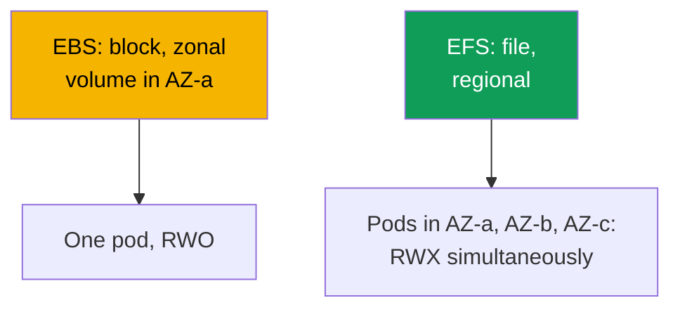
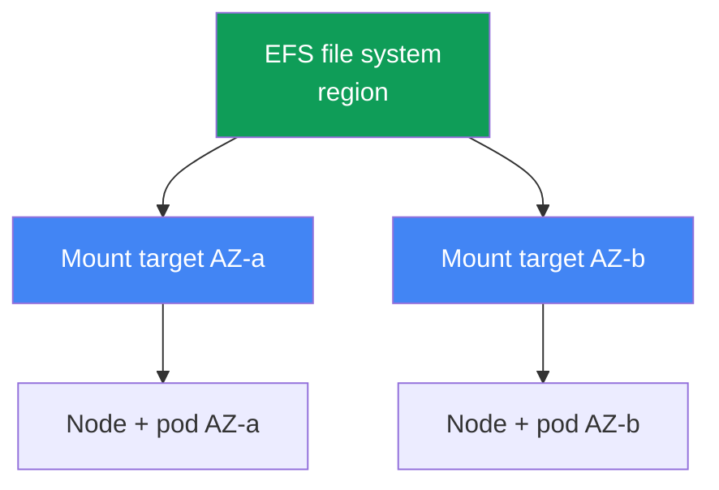

[Русская версия](ru.md) · [Versión en español](es.md) · [Version française](fr.md) · [Deutsche Version](de.md) · [ქართული ვერსია](ge.md) · [繁體中文版](tw.md) · [日本語版](jp.md)
# Chapter 24. EFS and FSx: shared storage for workloads across AZs

> **What comes next.** Chapter 23 showed that EBS is zonal: a volume in one AZ, one writer
> (ReadWriteOnce), and a pod pinned to the zone. This chapter covers the opposite class of tasks:
> shared write access from many pods (ReadWriteMany) and operation across AZs. That means EFS
> (managed, regional NFS) and a high-level overview of FSx. The CSI driver's role is provided
> through IRSA or Pod Identity (chapters 16-17), Mountpoint for Amazon S3 is chapter 25, backup
> is chapter 41, and Fargate is chapter 15. You know PVs, PVCs, and access modes from CKA; this
> chapter covers the specifics of network file access in EKS.

## 24.1. "Two pods need one volume, but EBS gives it to only one"

There are three scenarios where the EBS from chapter 23 hits a wall, and all three lead to the
same solution.

First: several pods need to write to one volume simultaneously (a shared upload directory,
workers on one dataset). You try to attach an EBS volume to the second replica:

```bash
kubectl describe pod uploader-1
# Events:
#   Warning  FailedAttachVolume  attachdetach-controller
#     Multi-Attach error for volume "pvc-..." Volume is already exclusively attached
#     to one node and can't be attached to another
```

`Multi-Attach error` means the EBS volume is already in use by one node. The `ReadWriteOnce`
mode means exactly that: one node, one writer. No StorageClass setting changes this - it is a
block-device limitation.

Second scenario: a pod must survive moving between AZs. With EBS, a pod is pinned to the volume's
zone (chapter 23), and if that AZ has no node, the pod remains `Pending`. Third: a Fargate pod
needs persistent storage, but EBS cannot be mounted on Fargate at all (chapter 15).

All three have the same root cause: a block device. EBS provides block access: a disk attached to
one instance in one zone. You need **network file access** - a file system that multiple nodes
and pods access over the network simultaneously, independently of the AZ. That is EFS.

## 24.2. EBS versus EFS versus FSx: block versus file

The difference is not "faster versus slower," but the access model itself. EBS is a disk that AWS
attaches to one instance. EFS and FSx are file servers that clients access over the network
(NFS for EFS, NFS/SMB/Lustre for FSx), so many clients can see them at once and from different
zones.



| Property | EBS | EFS | FSx |
|---|---|---|---|
| Model | block device | file (NFS) | file (NFS/SMB/Lustre) |
| Access modes | ReadWriteOnce | ReadWriteMany | RWX (depends on type) |
| Scope | one AZ | region, all AZs | depends on type |
| Across AZs | no, volume pinned to a zone | yes, transparently | depends on type |
| Latency | like a local SSD | higher, it is networked | Lustre: very low |
| Pricing model | allocated capacity | used capacity | allocated capacity |
| When | databases, single writer | shared RWX, across AZs | HPC/ML, Windows/SMB |

The rough selection rule is: if you need one fast writer and disk performance, use EBS
(chapter 23); if you need shared write access and operation across AZs, use EFS; if you need
specialization (Lustre for HPC, SMB for Windows, ONTAP features), use FSx.

## 24.3. EFS in detail: regional NFS

Amazon EFS is a managed file system using NFS. The key difference from EBS is that it is
**regional**, rather than zonal. Capacity is elastic: space is not allocated ahead of time, and
the file system grows and shrinks as data is written and deleted.

Regional means it is reachable from every zone, but a client (node) needs an entry point in its
own zone. That entry point is a **mount target** - an EFS network interface inside a subnet in a
specific AZ. The rule is simple: **one mount target per Availability Zone** (for a standard,
non-One Zone file system). A node in `eu-central-1a` mounts EFS through the mount target in
`eu-central-1a`.



This yields the main operational property: EFS **is not tied to a zone**. A pod moves from AZ-a
to AZ-b (re-creation, Karpenter consolidation, loss of a zone) and continues seeing the same
data - it simply mounts EFS through the mount target in the new zone. EFS has none of the pain
from chapter 23 (`volume node affinity conflict`): an EFS PV has no zone `nodeAffinity`. And
`ReadWriteMany` allows many pods on many nodes to write to the file system simultaneously.

The **aws-efs-csi-driver** with the `efs.csi.aws.com` provisioner manages EFS in the cluster.
Install it as a managed addon:

```bash
aws eks create-addon --cluster-name demo --addon-name aws-efs-csi-driver \
  --service-account-role-arn arn:aws:iam::111122223333:role/eks-efs-csi-driver
```

The driver needs an IAM role: the controller calls EFS APIs (creating and deleting access
points, reading mount targets and zones). Grant the role through IRSA or EKS Pod Identity
(chapters 16-17), pass its ARN in `--service-account-role-arn`, and use the ready-made managed
policy `AmazonEFSCSIDriverPolicy`. Without a role, dynamic provisioning fails with `AccessDenied`
when it creates an access point. The driver is incompatible with Windows container images.

## 24.4. EFS provisioning: static and dynamic

EFS has two ways to give a pod a volume, and they differ from EBS. The EFS file system itself is
created **in advance** in both cases (manually, through Terraform, or in the console) - the CSI
driver does not create it. It works on top of an existing one via its `fileSystemId` (such as
`fs-0123456789abcdef0`).

**Static** provisioning means you define the PV manually and specify `fileSystemId` in
`volumeHandle`. It is suitable when one file system is shared by everyone and a shared directory
is acceptable. This is the only option on Fargate (24.7).

```yaml
apiVersion: v1
kind: PersistentVolume
metadata: {name: efs-shared}
spec:
  capacity: {storage: 5Gi}          # for EFS, the number is nominal; capacity is elastic
  accessModes: ["ReadWriteMany"]
  persistentVolumeReclaimPolicy: Retain
  storageClassName: efs-sc
  mountOptions: ["tls"]             # in-transit NFS encryption, always keep it
  csi:
    driver: efs.csi.aws.com
    volumeHandle: fs-0123456789abcdef0
```

**Dynamic** provisioning uses a StorageClass with `provisioningMode: efs-ap`; for every PVC, the
driver creates an **access point** inside one file system. An access point is an entry point to
its own subdirectory with its own permissions and POSIX identity, making it an isolation
mechanism: different PVCs receive different directories in one EFS and cannot see each other's
data.

```yaml
apiVersion: storage.k8s.io/v1
kind: StorageClass
metadata: {name: efs-sc}
provisioner: efs.csi.aws.com
parameters:
  provisioningMode: efs-ap
  fileSystemId: fs-0123456789abcdef0
  directoryPerms: "755"          # access point root directory permissions
  uid: "1000"                    # OwnerUid of the access point root dir (non-root)
  gid: "1000"                    # OwnerGid; gidRange is not used when uid/gid are specified
  basePath: "/dynamic"           # root for access point subdirectories
mountOptions: ["tls"]            # in-transit encryption on the dynamic path too
```

The driver applies `uid`, `gid`, and `directoryPerms` to the access point root directory - its
`creationInfo` (`OwnerUid`, `OwnerGid`, `Permissions`). Set a non-root owner and `0755`
permissions: otherwise pods using `runAsNonRoot` fail with `Permission Denied` on their first
write, because the directory root is owned by a different identity.

A PVC for this class is ordinary, but uses `ReadWriteMany`:

```yaml
apiVersion: v1
kind: PersistentVolumeClaim
metadata: {name: shared-data}
spec:
  storageClassName: efs-sc
  accessModes: ["ReadWriteMany"]
  resources:
    requests: {storage: 5Gi}
```

| Property | Static | Dynamic (`efs-ap`) |
|---|---|---|
| EFS file system | create in advance | create in advance |
| PV | write manually | driver creates it |
| Provisioning unit | entire file system or directory | access point per PVC |
| Directory isolation | manually | through access points |
| On Fargate | yes | no (24.7) |

Note that `storage: 5Gi` in an EFS PVC is nominal. Capacity is elastic and is not preallocated;
a size quota is not applied as it is for EBS. The number is formally required to satisfy the PVC
schema.

## 24.5. EFS nuances: performance, encryption, cost

EFS is a network file system, not a local disk, and this determines its profile. Latency is
higher than for EBS: every request travels over the network to and from the mount target. This
is unnoticeable for streaming work with large files, but significant for thousands of small,
synchronous operations.

This leads to a lesson worth learning immediately: **EFS is not for low-latency databases**.
Putting PostgreSQL or MySQL on EFS is an anti-pattern: databases perform many small synchronous
writes, which a network file system slows down, and NFS locking does not behave like a local
disk. For databases, use zonal EBS with a single writer (chapter 23). EFS is good where shared
access itself is valuable: static assets and media, shared configurations, datasets for ML, and
directories written by several workers.

File-system throughput is configured by its **throughput mode**:

| Throughput mode | How it works | When |
|---|---|---|
| Elastic | scales automatically with load | unpredictable or infrequent access |
| Bursting | grows with data volume and accumulates credits | steady load proportional to capacity |
| Provisioned | fixed value independent of capacity | a ceiling higher than Bursting provides is needed |

Encryption: **at-rest** encryption is enabled when the file system is created (using a KMS key)
and cannot be changed later. **In-transit** (TLS) encryption is enabled on the client side - in
the EFS CSI driver this uses the `tls` mount option, which should always remain enabled so NFS
traffic between the node and mount target is encrypted.

EFS pricing differs from EBS. You pay for **actually used space** (without volume
preallocation), plus throughput according to the throughput mode. This changes the mindset: with
EBS, you pay for the allocated volume size even when it is empty; with EFS, you pay for what is
actually in the file system.

## 24.6. FSx briefly: when EFS is not suitable

EFS covers shared NFS access on Linux. When you need another protocol or extreme throughput, use
the **Amazon FSx** family: four distinct file services, each with its own CSI driver. This is
only an overview so you know where to look.

| FSx | Protocol | Profile | When instead of EFS |
|---|---|---|---|
| FSx for Lustre | Lustre | HPC, ML, very high throughput | ML training, S3 integration |
| FSx for Windows File Server | SMB | domain-joined Windows workloads | Windows containers, SMB |
| FSx for NetApp ONTAP | NFS/SMB/iSCSI | ONTAP features (snapshots, deduplication) | ONTAP capabilities are needed |
| FSx for OpenZFS | NFS | ZFS, snapshots, low latency | ZFS semantics, latency |

The most common option in an EKS context is **FSx for Lustre**: a parallel file system for ML and
HPC with very high throughput and S3 integration (the dataset resides in S3, while Lustre gives
fast POSIX access to it). Its driver is the separate `aws-fsx-csi-driver` addon. **Windows/SMB**
is the only option when you need a shared volume for Windows containers: EFS does not support
them. This course does not go deeper into FSx - EFS is sufficient for 90% of shared-storage
tasks across AZs.

## 24.7. Fargate and EFS

On Fargate (chapter 15), there are no nodes you manage, and **EBS cannot be mounted there**. EFS
is the only persistent storage for Fargate pods. This makes the Fargate + EFS combination the
standard pattern for stateful workloads without nodes.

There are two details. First, Fargate supports only **static** provisioning (24.4); dynamic
provisioning through access points is not supported on Fargate. Second, the driver is **not
installed as a DaemonSet** on Fargate - DaemonSets do not run on Fargate at all (chapter 15),
and EFS mounting is built into the platform itself. A Fargate pod mounts EFS automatically,
without installing driver components: a PV with a static reference to `fileSystemId` and a PVC
are sufficient.

## 24.8. Troubleshooting: a pod does not mount EFS

There is usually one symptom: the pod is stuck in `ContainerCreating`, and its events show a
mount timeout:

```bash
kubectl describe pod app-0
# Events:
#   Warning  FailedMount  kubelet
#     Unable to attach or mount volumes: unmounted volumes=[data]:
#     timed out waiting for the condition
```

Unlike EBS, where the pain is zonal, nearly every EFS issue comes down to networking and access
permissions. Check in this order:

| Symptom | Cause | What to check |
|---|---|---|
| `FailedMount`, timeout | mount target SG does not allow NFS | inbound 2049 from node SGs |
| No mount target in the pod's AZ | file system has no mount target in that zone | `aws efs describe-mount-targets` |
| `AccessDenied` on an access point | driver has no role | IRSA/Pod Identity role, policy |
| File system name does not resolve | DNS in the VPC | resolution of `fs-...efs.<region>...` |
| Connection fails with TLS | `tls` option and port | check mount options |

The most common cause is the **mount target security group**. NFS uses port **2049**, and the
mount target's SG must have an inbound rule on 2049 from the cluster nodes' SG. Without that
rule, mounting waits for a timeout. Check mount targets as follows:

```bash
# whether there is a mount target in every node zone and what state it is in
aws efs describe-mount-targets --file-system-id fs-0123456789abcdef0 \
  --query 'MountTargets[].{AZ:AvailabilityZoneName,State:LifeCycleState,IP:IpAddress}'
```

Then continue down the list: a mount target exists in **every** zone that has nodes running this
pod (no target in the pod's zone means mounting is impossible); the driver has a role with
`AmazonEFSCSIDriverPolicy`; the file system name resolves in the VPC (DNS resolution is
required); and the `tls` option is enabled for in-transit encryption.

A separate class of issues is **stale NFS locks**. An application that takes a file lock through
`flock`/`lockf` holds it as lock state on the NFSv4 side, and all EFS locks are **advisory**:
they are honored only by participants that check the lock themselves; the kernel does not forbid
writes. During a crash restart (`kill -9`, OOM, hard eviction), the pod dies without releasing
the lock, and that kind of termination cannot release it cleanly. NFSv4 retains the lock until
the owning client's lease expires: a live client renews its lease, a missing one does not, and
the server releases the lock only after expiry. The symptom is that a new pod starts but hangs
when attempting to acquire the same lock, because the previous lock still appears taken on EFS
for some time. Mitigations: perform graceful shutdown so the application releases its lock before
exit; after restart, let the lease expire rather than hammering the lock in a loop; keep a
single-writer pattern when only one pod writes to a directory on shared EFS; design applications
without file locks on EFS - move coordination outside the network file system (to a database or
distributed lock).

## 24.9. How this is used in production

- **EFS for RWX and across AZs.** Shared write access from many pods and operation across zones
  are EFS's profile. Keep single-writer workloads and disk performance on EBS (chapter 23).
- **Access points for isolation.** Dynamic `efs-ap` gives each PVC its own directory with
  permissions and POSIX identity; one file system safely serves many workloads.
- **In-transit encryption by default.** The `tls` option is always enabled; enable at-rest
  encryption when creating the file system with a KMS key.
- **Not for databases.** Use EFS for media, assets, configurations, ML datasets, and shared
  directories. Use zonal EBS for databases; network-file-system latency is toxic to them.
- **A mount target in every zone.** The file system must have a mount target in every AZ where
  nodes live; the mount target SG allows 2049 from node SGs.
- **FSx for specialization.** Lustre for ML/HPC throughput with S3 integration, Windows File
  Server for SMB and Windows containers, ONTAP for its own features. EFS is sufficient for
  shared NFS.

## 24.10. Mini-glossary

- **EFS** - Amazon Elastic File System, managed regional NFS with elastic capacity and the
  ReadWriteMany mode.
- **EFS CSI driver** - `aws-efs-csi-driver`, a managed addon with the `efs.csi.aws.com`
  provisioner; works on top of a pre-created file system.
- **mount target** - an EFS network interface in a subnet in a specific AZ; the entry point for
  nodes in that zone, one per Availability Zone.
- **access point** - an entry point to an EFS subdirectory with its own permissions and POSIX
  identity; the basis of dynamic provisioning and directory isolation.
- **provisioningMode: efs-ap** - a StorageClass mode in which the driver creates an access point
  for every PVC.
- **throughput mode** - an EFS throughput mode: Elastic, Bursting, or Provisioned.
- **ReadWriteMany (RWX)** - an access mode: a volume is mounted for writing by many pods on many
  nodes simultaneously.

## 24.11. Chapter summary

- EBS hits a wall where shared write access is needed (RWO, `Multi-Attach error`), a move across
  AZs is needed, or storage is needed on Fargate. The answer to all three is network file
  access: EFS.
- EFS is regional: it is accessed from every zone through a mount target in each AZ (one per
  zone). A pod moves between AZs and continues to see its data; EFS has no `volume node affinity
  conflict` from chapter 23, and `ReadWriteMany` permits many writers.
- `efs.csi.aws.com` (the `aws-efs-csi-driver` managed addon) manages the work, with a role via
  IRSA/Pod Identity (chapters 16-17) and the `AmazonEFSCSIDriverPolicy` policy. The file system
  is created in advance; the driver works on top of it through `fileSystemId`.
- Provisioning is static (a manually defined PV on `fileSystemId`) or dynamic
  (`provisioningMode: efs-ap`, an access point per PVC for directory and UID isolation).
- EFS is a network file system: its latency is higher than EBS and it is not for low-latency
  databases; it is good for media, assets, configurations, and ML datasets. Throughput is
  Elastic/Bursting/Provisioned; encryption is at-rest (KMS) and in-transit (`tls`). You pay for
  used capacity plus throughput.
- FSx is for specialization: Lustre (HPC/ML, S3 integration), Windows File Server (SMB), ONTAP,
  and OpenZFS; each has its own CSI driver. EFS is sufficient for shared NFS across AZs.
- On Fargate, EBS cannot be mounted and EFS is the only persistent storage; only static
  provisioning is supported, and mounting is built into the platform without a DaemonSet.
- To troubleshoot mounting, check mount-target SG port 2049 from node SGs, the presence of a
  mount target in the pod's zone, the driver role, DNS resolution, and the `tls` option.

## 24.12. How this helps in real work

On call, EFS incidents are almost always about networking and permissions, not zones. If a pod
is stuck in `ContainerCreating` with `FailedMount`, first run `aws efs describe-mount-targets`:
does a target exist in the pod's zone, and is port 2049 open in its SG from the nodes? This solves
most cases. When designing, keep the boundary from chapter 23 in mind: EBS is for one fast writer
and performance; EFS is for shared access and operation across AZs; never put a database on a
network file system. When a Fargate workload arrives with a stateful requirement, remember that
there is exactly one choice: static EFS. And if engineers ask for "file storage like in a data
center" with SMB or ML-level throughput, that is FSx territory; compare Lustre and Windows File
Server before building EFS workarounds.

## 24.13. Self-check questions

1. Why cannot an EBS volume be attached to two pods at once, and what does the error look like?
2. From the perspective of client count, how does block access (EBS) differ from file access
   (EFS)?
3. Why is EFS called regional and EBS zonal, and what is a mount target?
4. How many mount targets are needed, and why does a pod on EFS survive a move between AZs?
5. Why does the EFS CSI driver need an IAM role, and which managed policy does it need?
6. How does static EFS provisioning differ from dynamic provisioning through `efs-ap`?
7. What is an access point, and how does it provide directory and UID isolation?
8. Why should EFS not be used for databases, and what is it good for?
9. Which EFS throughput modes exist, and how does its pricing model differ from EBS?
10. How are at-rest and in-transit encryption enabled for EFS?
11. Why is only static provisioning available on Fargate, and why is no DaemonSet needed?
12. A pod is stuck with `FailedMount` on EFS: which causes do you check, and in what order?
13. When is FSx needed instead of EFS, and which FSx option is for ML and which for Windows?

## Practice

The course lab for this topic is [lab 107 - EFS CSI: ReadWriteMany across Availability
Zones](../../labs/107/README.MD). Beyond it, everything is verified on a live cluster. Ensure the
EFS CSI driver is installed: `aws eks list-addons --cluster-name <cluster>` and `kubectl get pods
-n kube-system | grep efs-csi`. Inspect an existing file system: `aws efs describe-file-systems`,
then `aws efs describe-mount-targets --file-system-id fs-...` - verify that a mount target exists
in every zone of your nodes and is in the `available` state.

Next, reproduce RWX: create a StorageClass with `provisioningMode: efs-ap` and your
`fileSystemId`, deploy a Deployment with 2-3 replicas in different AZs using one `ReadWriteMany`
PVC, and verify that all replicas write to the shared directory simultaneously (which EBS does
not allow). Run `kubectl get pv -o yaml` - unlike EBS, an EFS PV has no zone `nodeAffinity`.
Then deliberately break mounting: remove the mount target SG rule for port 2049, re-create a pod,
and find `FailedMount` in `kubectl describe pod`; restore the rule and verify that mounting
succeeds. If you have access to a Fargate profile, repeat with a static PV on `fileSystemId` and
compare: an EBS volume cannot be attached to a Fargate pod, whereas EFS mounts without a
DaemonSet.

---
[Table of contents](../README.md) · [Chapter 23](../23/en.md) · [Chapter 25](../25/en.md)
