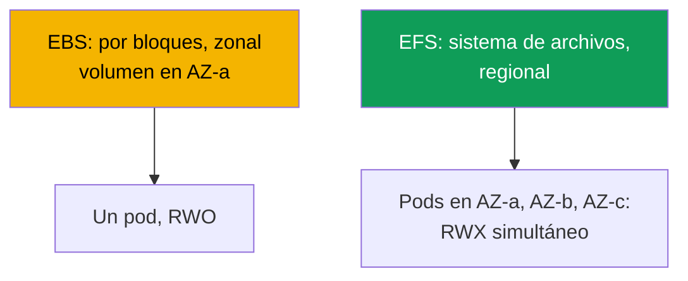
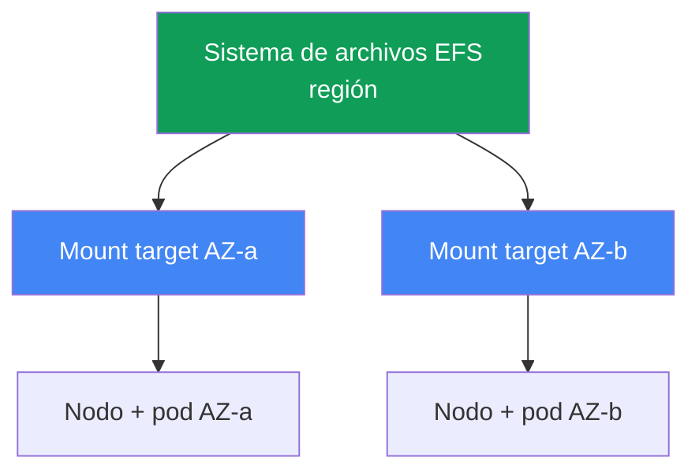

[English version](en.md) · [Русская версия](ru.md) · [Version française](fr.md) · [Deutsche Version](de.md) · [ქართული ვერსია](ge.md) · [繁體中文版](tw.md) · [日本語版](jp.md)
# Capítulo 24. EFS y FSx: almacenamiento compartido para cargas de trabajo entre AZ

> **Qué sigue.** El capítulo 23 mostró que EBS es zonal: un volumen en una AZ, un único escritor
> (ReadWriteOnce), un pod vinculado a la zona. Este capítulo trata la clase de problemas opuesta:
> acceso compartido de escritura desde muchos pods (ReadWriteMany) y funcionamiento entre AZ.
> Se trata de EFS (NFS administrado, regional) y una visión general de FSx. El rol del controlador
> CSI se concede mediante IRSA o Pod Identity (capítulos 16-17), Mountpoint for Amazon S3 es el
> capítulo 25, la copia de seguridad el capítulo 41 y Fargate el capítulo 15. Conoce PV, PVC y
> los modos de acceso de CKA; aquí veremos las particularidades del acceso a sistemas de archivos
> por red en EKS.

## 24.1. «Dos pods necesitan un volumen, pero EBS solo se lo da a uno»

Tres escenarios en los que EBS del capítulo 23 llega a un límite, y los tres conducen a una
misma solución.

El primero: varios pods necesitan escribir simultáneamente en un mismo volumen (un directorio
compartido de cargas, workers sobre el mismo dataset). Intenta conectar un volumen EBS a la
segunda réplica:

```bash
kubectl describe pod uploader-1
# Events:
#   Warning  FailedAttachVolume  attachdetach-controller
#     Multi-Attach error for volume "pvc-..." Volume is already exclusively attached
#     to one node and can't be attached to another
```

`Multi-Attach error` significa que el volumen EBS ya está ocupado por un nodo. El modo
`ReadWriteOnce` significa exactamente eso: un nodo, un escritor. Ninguna configuración de
StorageClass cambia esto: es una limitación del dispositivo de bloques.

El segundo escenario: el pod debe sobrevivir a una reubicación entre AZ. Con EBS, el pod queda
vinculado a la zona del volumen (capítulo 23), y si no hay un nodo en su AZ, permanece en
`Pending`. El tercero: un pod de Fargate necesita almacenamiento persistente, pero EBS no se
monta en Fargate en absoluto (capítulo 15).

La causa común de los tres es el dispositivo de bloques. EBS proporciona acceso por bloques: un
disco vinculado a una instancia en una zona. Se necesita **acceso a archivos por red**, es decir,
un sistema de archivos al que varios nodos y pods accedan simultáneamente por la red,
independientemente de la AZ. Eso es EFS.

## 24.2. EBS frente a EFS frente a FSx: bloques frente a archivos

La diferencia no es «más rápido o más lento», sino el propio modelo de acceso. EBS es un disco
que AWS conecta a una instancia. EFS y FSx son servidores de archivos a los que se accede por
red (NFS en EFS, NFS/SMB/Lustre en FSx), por lo que muchos clientes los ven a la vez y desde
distintas zonas.



| Propiedad | EBS | EFS | FSx |
|---|---|---|---|
| Modelo | dispositivo de bloques | archivos (NFS) | archivos (NFS/SMB/Lustre) |
| Access modes | ReadWriteOnce | ReadWriteMany | RWX (depende del tipo) |
| Alcance | una AZ | región, todas las AZ | depende del tipo |
| Entre AZ | no, el volumen está vinculado a la zona | sí, transparente | depende del tipo |
| Latencia | como un SSD local | mayor, es una red | Lustre: muy baja |
| Modelo de precio | por volumen aprovisionado | por espacio utilizado | por capacidad aprovisionada |
| Cuándo | BD, single-writer | RWX compartido, entre AZ | HPC/ML, Windows/SMB |

La regla de elección es aproximadamente esta: si necesita un único escritor rápido y rendimiento
de disco, EBS (capítulo 23); si necesita acceso compartido de escritura y operación entre AZ,
EFS; si necesita una particularidad (Lustre para HPC, SMB para Windows, características de
ONTAP), FSx.

## 24.3. EFS en detalle: NFS regional

Amazon EFS es un sistema de archivos administrado mediante el protocolo NFS. La diferencia clave
con EBS es que es **regional**, no zonal. La capacidad es elástica: el espacio no se aprovisiona
de antemano; el sistema de archivos crece y se reduce a medida que se escriben y eliminan datos.

Regional significa accesible desde todas las zonas, pero el cliente (nodo) necesita un punto de
entrada en su zona. Ese punto es un **mount target**, una interfaz de red de EFS dentro de la
subred de una AZ concreta. La regla es sencilla: **un mount target por zona de disponibilidad**
(para un sistema de archivos estándar, no One Zone). Un nodo de `eu-central-1a` monta EFS a
través del mount target de `eu-central-1a`.



De ahí surge la principal propiedad operativa: EFS **no está vinculado a una zona**. Un pod se
mueve de AZ-a a AZ-b (recreación, consolidación de Karpenter, pérdida de zona) y sigue viendo
los mismos datos: simplemente monta EFS mediante el mount target de la nueva zona. Con EFS no
existe el problema del capítulo 23 (`volume node affinity conflict`): un PV en EFS no lleva
`nodeAffinity` para una zona. Y el modo `ReadWriteMany` permite a muchos pods en muchos nodos
escribir simultáneamente en el sistema de archivos.

El trabajo con EFS en el clúster lo realiza **aws-efs-csi-driver**, con el aprovisionador
`efs.csi.aws.com`. Se instala como managed addon:

```bash
aws eks create-addon --cluster-name demo --addon-name aws-efs-csi-driver \
  --service-account-role-arn arn:aws:iam::111122223333:role/eks-efs-csi-driver
```

El controlador necesita un rol IAM: el controlador llama a la API de EFS (crea y elimina access
points, lee mount targets y zonas). El rol se concede mediante IRSA o EKS Pod Identity
(capítulos 16-17), su ARN se pasa en `--service-account-role-arn`, y la managed policy lista es
`AmazonEFSCSIDriverPolicy`. Sin el rol, el aprovisionamiento dinámico falla con `AccessDenied`
al crear un access point. El controlador es incompatible con imágenes de contenedores Windows.

## 24.4. Aprovisionamiento de EFS: estático y dinámico

EFS tiene dos formas de entregar un volumen a un pod, y no son como las de EBS. El propio sistema
de archivos EFS se crea **por adelantado** en ambos casos (manualmente, mediante Terraform o la
consola): el controlador CSI no lo crea, sino que funciona sobre uno existente mediante su
`fileSystemId` (como `fs-0123456789abcdef0`).

El aprovisionamiento **estático** consiste en describir el PV manualmente, indicando el
`fileSystemId` en `volumeHandle`. Es adecuado cuando el sistema de archivos es uno para todos y
un directorio común sirve. Es la única opción en Fargate (24.7).

```yaml
apiVersion: v1
kind: PersistentVolume
metadata: {name: efs-shared}
spec:
  capacity: {storage: 5Gi}          # para EFS el número es indicativo; el espacio es elástico
  accessModes: ["ReadWriteMany"]
  persistentVolumeReclaimPolicy: Retain
  storageClassName: efs-sc
  mountOptions: ["tls"]             # cifra el tráfico NFS in-transit; mantener siempre
  csi:
    driver: efs.csi.aws.com
    volumeHandle: fs-0123456789abcdef0
```

El aprovisionamiento **dinámico** usa una StorageClass con `provisioningMode: efs-ap`; para cada
PVC, el controlador crea un **access point** dentro de un mismo sistema de archivos. Un access
point es una entrada a su propio subdirectorio con permisos e identidad POSIX propios, por lo
que es un mecanismo de aislamiento: distintos PVC reciben distintos directorios en un EFS y no
ven los datos de los demás.

```yaml
apiVersion: storage.k8s.io/v1
kind: StorageClass
metadata: {name: efs-sc}
provisioner: efs.csi.aws.com
parameters:
  provisioningMode: efs-ap
  fileSystemId: fs-0123456789abcdef0
  directoryPerms: "755"          # permisos del directorio raíz del access point
  uid: "1000"                    # OwnerUid del directorio raíz del access point (no-root)
  gid: "1000"                    # OwnerGid; gidRange no se usa con uid/gid definidos
  basePath: "/dynamic"           # raíz para subdirectorios de access points
mountOptions: ["tls"]            # cifrado in-transit también en la ruta dinámica
```

El controlador aplica los parámetros `uid`, `gid` y `directoryPerms` al directorio raíz del
access point: son sus `creationInfo` (`OwnerUid`, `OwnerGid`, `Permissions`). Defina un
propietario no-root y permisos `0755`; de lo contrario, los pods con `runAsNonRoot` fallarán con
`Permission Denied` en la primera escritura, porque la raíz del directorio pertenecerá a otra
identidad.

El PVC para esta clase es normal, pero con `ReadWriteMany`:

```yaml
apiVersion: v1
kind: PersistentVolumeClaim
metadata: {name: shared-data}
spec:
  storageClassName: efs-sc
  accessModes: ["ReadWriteMany"]
  resources:
    requests: {storage: 5Gi}
```

| Propiedad | Estático | Dinámico (`efs-ap`) |
|---|---|---|
| Sistema de archivos EFS | se crea por adelantado | se crea por adelantado |
| PV | se escribe manualmente | lo crea el controlador |
| Unidad entregada | todo el sistema de archivos o un directorio | access point por PVC |
| Aislamiento de directorios | manualmente | mediante access points |
| En Fargate | sí | no (24.7) |

Tenga en cuenta que `storage: 5Gi` en un PVC de EFS es un valor indicativo. El espacio es
elástico y no se preasigna; la cuota por tamaño no se aplica como en EBS. El número se necesita
formalmente para satisfacer el esquema del PVC.

## 24.5. Matices de EFS: rendimiento, cifrado y coste

EFS es un sistema de archivos de red, no un disco local, y eso define su perfil. La latencia es
mayor que en EBS: cada solicitud viaja por la red hasta el mount target y vuelve. Para trabajo
secuencial con archivos grandes esto no se nota; para miles de operaciones síncronas pequeñas,
sí se nota.

De aquí una consecuencia que conviene aprender de inmediato: **EFS no es para bases de datos de
baja latencia**. Colocar PostgreSQL o MySQL en EFS es un antipatrón: el SGBD realiza muchas
escrituras síncronas pequeñas, el sistema de archivos de red las ralentiza y los bloqueos NFS no
se comportan como en un disco local. Para BD, EBS zonal con single-writer (capítulo 23). EFS es
bueno donde importa el acceso compartido: assets estáticos y multimedia, configuraciones
compartidas, datasets para ML y directorios donde escriben varios workers.

El rendimiento se configura mediante el **modo de throughput** del sistema de archivos:

| Modo de throughput | Cómo funciona | Cuándo |
|---|---|---|
| Elastic | se escala automáticamente según la carga | acceso impredecible o poco frecuente |
| Bursting | crece con el volumen de datos y acumula créditos | carga uniforme, proporcional al volumen |
| Provisioned | valor fijo, independiente del volumen | se necesita un techo mayor que el de Bursting |

El cifrado **at-rest** se activa al crear el sistema de archivos (clave KMS) y después no cambia.
El cifrado **in-transit** (TLS) se activa en el cliente: el controlador CSI de EFS lo hace con la
opción de montaje `tls`, que conviene mantener siempre activada para que el tráfico NFS entre el
nodo y el mount target esté cifrado.

El coste de EFS funciona de otro modo que el de EBS. Se paga por el **espacio realmente usado**
(sin preasignar un volumen) más el rendimiento según el modo de throughput. Esto cambia la
forma de pensar: con EBS paga por el tamaño aprovisionado del volumen, incluso vacío; con EFS,
por lo que realmente hay en el sistema de archivos.

## 24.6. FSx en breve: cuando EFS no es adecuado

EFS cubre el acceso NFS compartido en Linux. Cuando se necesita otro protocolo o rendimiento
extremo, está la familia **Amazon FSx**, cuatro servicios de archivos distintos, cada uno con su
propio controlador CSI. Aquí solo se ofrece una visión general para saber dónde buscar.

| FSx | Protocolo | Perfil | Cuándo usarlo en vez de EFS |
|---|---|---|---|
| FSx for Lustre | Lustre | HPC, ML, throughput muy alto | entrenamiento de ML, integración con S3 |
| FSx for Windows File Server | SMB | cargas Windows de dominio | contenedores Windows, SMB |
| FSx for NetApp ONTAP | NFS/SMB/iSCSI | características de ONTAP (snapshots, deduplicación) | se necesitan capacidades de ONTAP |
| FSx for OpenZFS | NFS | ZFS, snapshots, latencia baja | semántica ZFS, latencia |

El más frecuente en el contexto de EKS es **FSx for Lustre**: un sistema de archivos paralelo
para ML y HPC con un throughput muy alto y conexión con S3 (el dataset está en S3; Lustre ofrece
acceso POSIX rápido). El controlador es un addon independiente, `aws-fsx-csi-driver`.
**Windows/SMB** es la única opción cuando se necesita un volumen compartido para contenedores
Windows: EFS no los admite. FSx no se aborda con más profundidad en este curso: para el 90% de
las tareas de almacenamiento compartido entre AZ, EFS es suficiente.

## 24.7. Fargate y EFS

En Fargate (capítulo 15) no hay nodos que usted administre, y **EBS no se monta allí**. El único
almacenamiento persistente para pods de Fargate es EFS. Esto hace de Fargate + EFS un patrón
estándar para cargas stateful sin nodos.

Dos particularidades. Primera: en Fargate solo funciona el aprovisionamiento **estático** (24.4);
el dinámico mediante access points no está admitido. Segunda: el controlador en Fargate **no se
instala como DaemonSet**. En Fargate un DaemonSet no se ejecuta en absoluto (capítulo 15), y el
montaje de EFS está integrado en la propia plataforma. Un pod de Fargate monta EFS
automáticamente sin instalar componentes del controlador: basta un PV con una referencia
estática al `fileSystemId` y un PVC.

## 24.8. Diagnóstico: el pod no monta EFS

El síntoma suele ser uno: el pod se queda en `ContainerCreating` y los eventos muestran un
timeout de montaje:

```bash
kubectl describe pod app-0
# Events:
#   Warning  FailedMount  kubelet
#     Unable to attach or mount volumes: unmounted volumes=[data]:
#     timed out waiting for the condition
```

A diferencia de EBS, donde el problema es zonal, en EFS casi todo se reduce a red y permisos de
acceso. Orden de comprobación:

| Síntoma | Causa | Qué comprobar |
|---|---|---|
| `FailedMount`, timeout | El SG del mount target no permite NFS | inbound 2049 desde el SG de nodos |
| No hay mount target en la AZ del pod | El sistema de archivos no tiene mount target en esa zona | `aws efs describe-mount-targets` |
| `AccessDenied` en un access point | Falta el rol del controlador | rol IRSA/Pod Identity, policy |
| No se resuelve el nombre del sistema de archivos | DNS en la VPC | resolución de `fs-...efs.<region>...` |
| Se corta la conexión con TLS | opción `tls` y puerto | comprobar mount options |

La causa más frecuente es el **security group del mount target**. NFS usa el puerto **2049**, y
en el SG del mount target debe haber una regla inbound al 2049 desde el SG de los nodos del
clúster. Sin regla, el montaje queda esperando hasta el timeout. Los mount targets se comprueban
así:

```bash
# si hay un mount target en cada zona de nodos y cuál es su estado
aws efs describe-mount-targets --file-system-id fs-0123456789abcdef0 \
  --query 'MountTargets[].{AZ:AvailabilityZoneName,State:LifeCycleState,IP:IpAddress}'
```

Después, siga la lista: existe un mount target en **cada** zona donde haya nodos con ese pod (sin
target en la zona del pod, el montaje es imposible); el controlador tiene un rol con
`AmazonEFSCSIDriverPolicy`; el nombre del sistema de archivos se resuelve en la VPC (hace falta
resolución DNS); y la opción `tls` está activada para el cifrado in-transit.

Una clase de problema distinta son los **bloqueos NFS obsoletos**. Una aplicación que toma un
bloqueo de archivo mediante `flock`/`lockf` lo mantiene como estado de bloqueo en NFSv4, y todos
los bloqueos de EFS son **advisory**: solo los considera quien comprueba el bloqueo por sí mismo;
el núcleo no prohíbe la escritura. En un reinicio anómalo (`kill -9`, OOM, desalojo forzado), el
pod muere sin liberar el bloqueo y no hay liberación correcta en tal finalización. NFSv4 retiene
el bloqueo hasta que vence el lease del cliente propietario: un cliente vivo renueva el lease,
un cliente desaparecido no lo hace, y solo al vencer el servidor elimina el bloqueo. El síntoma:
el nuevo pod se inicia pero queda bloqueado al intentar tomar el mismo lock, porque el bloqueo
antiguo de EFS sigue figurando como ocupado durante un tiempo. Mitigación: implementar graceful
shutdown para que la aplicación libere el lock antes de salir; al reiniciar, dejar que venza el
lease en lugar de golpear el lock en un bucle; mantener un patrón single-writer cuando solo un
pod escribe en un directorio de EFS compartido; diseñar la aplicación sin bloqueos de archivos
en EFS y externalizar la coordinación (BD, lock distribuido), en vez de ponerla en un sistema de
archivos de red.

## 24.9. Cómo se usa en producción

- **EFS para RWX y entre AZ.** El acceso compartido de escritura desde muchos pods y el trabajo
  entre zonas es el perfil de EFS. Single-writer y rendimiento de disco se dejan a EBS (capítulo
  23).
- **Access points para aislamiento.** `efs-ap` dinámico da a cada PVC su propio directorio con
  permisos e identidad POSIX; un sistema de archivos atiende de forma segura muchas cargas.
- **Cifrado in-transit por defecto.** La opción `tls` está siempre activa; at-rest se activa al
  crear el sistema de archivos con una clave KMS.
- **No para bases de datos.** EFS para multimedia, assets, configuraciones, datasets de ML y
  directorios compartidos. SGBD: EBS zonal; la latencia del sistema de archivos de red les
  perjudica.
- **Mount target en cada zona.** El sistema de archivos debe tener mount target en todas las AZ
  donde vivan nodos; el SG del mount target permite el 2049 desde el SG de nodos.
- **FSx para necesidades específicas.** Lustre para throughput de ML/HPC con integración S3,
  Windows File Server para SMB y contenedores Windows, ONTAP para sus propias características.
  Para NFS compartido, EFS basta.

## 24.10. Mini glosario

- **EFS**: Amazon Elastic File System, NFS regional administrado con capacidad elástica y modo
  ReadWriteMany.
- **Controlador CSI de EFS**: `aws-efs-csi-driver`, managed addon con el aprovisionador
  `efs.csi.aws.com`; funciona sobre un sistema de archivos creado por adelantado.
- **mount target**: interfaz de red de EFS en la subred de una AZ concreta; punto de entrada
  para los nodos de esa zona, uno por zona de disponibilidad.
- **access point**: entrada a un subdirectorio de EFS con permisos e identidad POSIX propios;
  base del aprovisionamiento dinámico y del aislamiento de directorios.
- **provisioningMode: efs-ap**: modo de StorageClass en el que el controlador crea un access
  point para cada PVC.
- **throughput mode**: modo de rendimiento de EFS: Elastic, Bursting o Provisioned.
- **ReadWriteMany (RWX)**: access mode: el volumen se monta en escritura por muchos pods en
  muchos nodos simultáneamente.

## 24.11. Resumen del capítulo

- EBS llega a un límite cuando se necesita acceso compartido de escritura (RWO, `Multi-Attach
  error`), reubicación entre AZ o almacenamiento en Fargate. La respuesta a los tres es acceso
  a archivos por red, EFS.
- EFS es regional: se accede desde todas las zonas mediante un mount target en cada AZ (uno por
  zona). Un pod se mueve entre AZ y sigue viendo los datos; en EFS no existe `volume node
  affinity conflict` (capítulo 23), y `ReadWriteMany` permite muchos escritores.
- El trabajo lo realiza `efs.csi.aws.com` (managed addon `aws-efs-csi-driver`) con un rol por
  IRSA/Pod Identity (capítulos 16-17) y la policy `AmazonEFSCSIDriverPolicy`. El sistema de
  archivos se crea por adelantado; el controlador opera sobre él mediante `fileSystemId`.
- El aprovisionamiento es estático (PV manual sobre `fileSystemId`) o dinámico
  (`provisioningMode: efs-ap`, un access point por PVC para aislamiento de directorios y UID).
- EFS es un sistema de archivos de red: su latencia es mayor que EBS, no sirve para BD de baja
  latencia y es bueno para multimedia, assets, configuraciones y datasets de ML. Throughput:
  Elastic/Bursting/Provisioned; cifrado at-rest (KMS) e in-transit (`tls`). Se paga por el
  espacio usado más el throughput.
- FSx es para necesidades específicas: Lustre (HPC/ML, integración con S3), Windows File Server
  (SMB), ONTAP, OpenZFS; cada uno tiene su controlador CSI. Para NFS compartido entre AZ, EFS
  basta.
- En Fargate EBS no se monta; EFS es el único almacenamiento persistente. Solo hay
  aprovisionamiento estático y el montaje está integrado en la plataforma, sin DaemonSet.
- Diagnóstico de montaje: SG del mount target en el puerto 2049 desde el SG de nodos, existencia
  de mount target en la zona del pod, rol del controlador, resolución DNS y opción `tls`.

## 24.12. Cómo sirve en el trabajo real

En guardia, los incidentes de EFS casi siempre tratan de red y permisos, no de zonas. Un pod se
queda en `ContainerCreating` con `FailedMount`: primero ejecute `aws efs
describe-mount-targets`: compruebe si hay target en la zona del pod y si el puerto 2049 está
abierto en su SG desde los nodos. Eso resuelve la mayoría de los casos. Al diseñar, tenga en
mente la distinción del capítulo 23: EBS para un escritor rápido y rendimiento; EFS para acceso
compartido y trabajo entre AZ; nunca ponga un SGBD en un sistema de archivos de red. Cuando
llegue una carga de Fargate con un requisito stateful, recuerde que solo hay una elección: EFS
estático. Y si los ingenieros piden «almacenamiento de archivos como en el centro de datos» con
SMB o con throughput para ML, ya es territorio de FSx, y conviene comparar Lustre y Windows File
Server antes de construir soluciones alternativas sobre EFS.

## 24.13. Preguntas de autoevaluación

1. ¿Por qué no se puede conectar un volumen EBS a dos pods a la vez y cómo se ve este error?
2. ¿En qué se diferencia el acceso por bloques (EBS) del acceso a archivos (EFS) respecto al número de clientes?
3. ¿Por qué EFS se llama regional y EBS zonal, y qué es un mount target?
4. ¿Cuántos mount targets se necesitan y por qué un pod en EFS sobrevive a una reubicación entre AZ?
5. ¿Por qué el controlador CSI de EFS necesita un rol IAM y qué managed policy necesita?
6. ¿En qué se diferencia el aprovisionamiento estático de EFS del dinámico mediante `efs-ap`?
7. ¿Qué es un access point y cómo proporciona aislamiento de directorios y UID?
8. ¿Por qué EFS no debe usarse para bases de datos y para qué es bueno?
9. ¿Qué modos de throughput tiene EFS y en qué se diferencia el modelo de costes del de EBS?
10. ¿Cómo se activa el cifrado at-rest e in-transit en EFS?
11. ¿Por qué en Fargate solo está disponible el aprovisionamiento estático y no se necesita un DaemonSet?
12. Un pod queda bloqueado con `FailedMount` en EFS: ¿qué causas se comprueban y en qué orden?
13. ¿Cuándo se necesita FSx en vez de EFS y qué variantes de FSx sirven para ML y para Windows?

## Práctica

Laboratorio del curso para este tema: [laboratorio 107: EFS CSI: ReadWriteMany entre zonas de
 disponibilidad](../../labs/107/README_ES.MD). Además de este, todo se comprueba en un clúster
activo. Asegúrese de que está instalado el controlador CSI de EFS: `aws eks list-addons --cluster-name <cluster>` y `kubectl get pods -n kube-system
| grep efs-csi`. Examine un sistema de archivos existente: `aws efs describe-file-systems`, después `aws efs
 describe-mount-targets --file-system-id fs-...`: compruebe que haya un mount target en cada zona de sus nodos y que esté
en estado `available`.

Después, reproduzca RWX: cree una StorageClass con `provisioningMode: efs-ap` y su
`fileSystemId`, levante un Deployment con 2-3 réplicas en distintas AZ con un PVC único en
`ReadWriteMany` y compruebe que todas las réplicas escriben simultáneamente en el directorio
compartido (algo que EBS no permite). Compruebe `kubectl get pv -o yaml`: a diferencia de EBS,
un PV de EFS no tiene `nodeAffinity` de zona. Después rompa el montaje intencionadamente: elimine
del SG del mount target la regla del puerto 2049, recree el pod y encuentre `FailedMount` en
`kubectl describe pod`; restaure la regla y compruebe que el montaje funciona. Si tiene acceso a
un perfil de Fargate, repita con un PV estático sobre `fileSystemId` y compare: no puede conectar
EBS a un pod de Fargate, mientras que EFS se monta sin DaemonSet.

---
[Índice](../README_ES.md) · [Capítulo 23](../23/es.md) · [Capítulo 25](../25/es.md)
