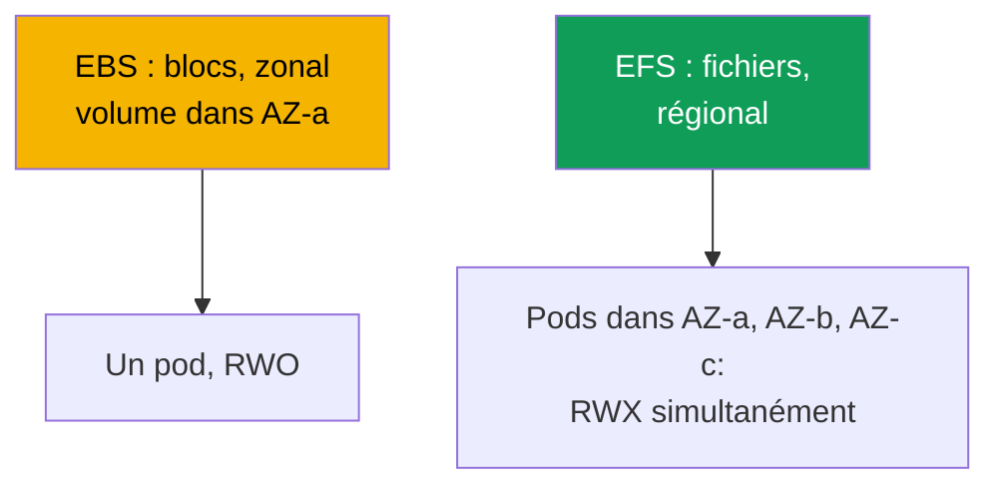
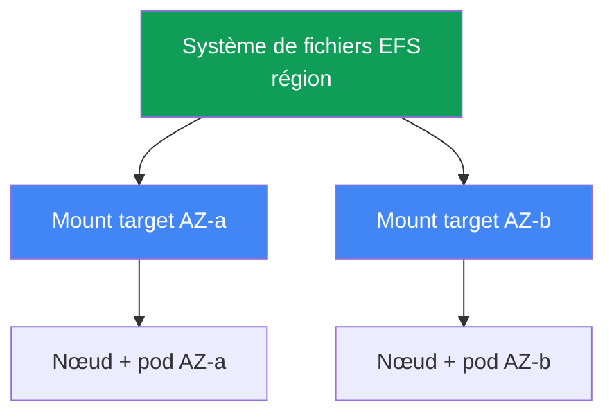

[Русская версия](ru.md) · [Eng version](en.md) · [Versión en español](es.md) · [Deutsche Version](de.md) · [ქართული ვერსია](ge.md) · [繁體中文版](tw.md) · [日本語版](jp.md)
# Chapitre 24. EFS et FSx : stockage partagé pour les charges de travail entre AZ

> **La suite.** Le chapitre 23 a montré qu'EBS est zonal : un volume dans une AZ, un seul écrivain
> (ReadWriteOnce), et un pod lié à la zone. Ce chapitre traite de la classe de problèmes opposée :
> l'accès partagé en écriture par de nombreux pods (ReadWriteMany) et le fonctionnement entre AZ.
> Il s'agit d'EFS (NFS géré, régional) et d'une vue d'ensemble de FSx. Le rôle du pilote CSI est
> fourni via IRSA ou Pod Identity (chapitres 16-17), Mountpoint for Amazon S3 est traité au
> chapitre 25, la sauvegarde au chapitre 41 et Fargate au chapitre 15. Vous connaissez les PV,
> PVC et modes d'accès depuis CKA ; nous examinons ici les spécificités de l'accès réseau aux
> systèmes de fichiers dans EKS.

## 24.1. « Deux pods ont besoin d'un volume, mais EBS ne le donne qu'à un seul »

Trois scénarios dans lesquels l'EBS du chapitre 23 atteint une limite, et les trois mènent à la
même solution.

Premier scénario : plusieurs pods doivent écrire simultanément dans un volume (répertoire partagé
d'import, workers travaillant sur le même jeu de données). Vous essayez d'attacher un volume EBS à
la seconde réplique :

```bash
kubectl describe pod uploader-1
# Events:
#   Warning  FailedAttachVolume  attachdetach-controller
#     Multi-Attach error for volume "pvc-..." Volume is already exclusively attached
#     to one node and can't be attached to another
```

`Multi-Attach error` signifie que le volume EBS est déjà utilisé par un nœud. Le mode
`ReadWriteOnce` signifie exactement cela : un nœud, un écrivain. Aucun réglage de StorageClass ne
change cette limite inhérente au périphérique de blocs.

Deuxième scénario : un pod doit survivre à un déplacement entre AZ. Avec EBS, le pod est lié à la
zone du volume (chapitre 23), et si aucune nœud ne se trouve dans cette AZ, le pod reste en
`Pending`. Troisième scénario : un pod Fargate a besoin de stockage persistant, mais EBS ne peut
pas du tout être monté sur Fargate (chapitre 15).

Les trois cas ont la même cause racine : un périphérique de blocs. EBS fournit un accès par blocs :
un disque attaché à une instance dans une zone. Il faut un **accès réseau à un système de fichiers**
: un système de fichiers auquel plusieurs nœuds et pods accèdent simultanément par le réseau,
indépendamment de l'AZ. C'est EFS.

## 24.2. EBS contre EFS contre FSx : blocs contre fichiers

La différence n'est pas « plus rapide contre plus lent », mais le modèle d'accès lui-même. EBS est
un disque qu'AWS attache à une instance. EFS et FSx sont des serveurs de fichiers auxquels les
clients accèdent par le réseau (NFS pour EFS, NFS/SMB/Lustre pour FSx), donc de nombreux clients
peuvent les voir simultanément et depuis différentes zones.



| Propriété | EBS | EFS | FSx |
|---|---|---|---|
| Modèle | périphérique de blocs | fichiers (NFS) | fichiers (NFS/SMB/Lustre) |
| Modes d'accès | ReadWriteOnce | ReadWriteMany | RWX (selon le type) |
| Portée | une AZ | région, toutes les AZ | selon le type |
| Entre AZ | non, volume lié à une zone | oui, de façon transparente | selon le type |
| Latence | comme un SSD local | plus élevée, c'est du réseau | Lustre : très faible |
| Modèle de tarification | capacité allouée | capacité utilisée | capacité allouée |
| Cas d'usage | bases de données, écrivain unique | RWX partagé, entre AZ | HPC/ML, Windows/SMB |

La règle de choix approximative est la suivante : si vous avez besoin d'un seul écrivain rapide et
de performances disque, utilisez EBS (chapitre 23) ; si vous avez besoin d'un accès partagé en
écriture et d'un fonctionnement entre AZ, utilisez EFS ; si vous avez besoin d'une spécialisation
(Lustre pour HPC, SMB pour Windows, fonctionnalités ONTAP), utilisez FSx.

## 24.3. EFS en détail : NFS régional

Amazon EFS est un système de fichiers géré reposant sur NFS. La différence essentielle avec EBS
est qu'il est **régional**, et non zonal. Sa capacité est élastique : l'espace n'est pas alloué à
l'avance et le système de fichiers grandit ou rétrécit à mesure que des données sont écrites ou
supprimées.

Régional signifie qu'il est accessible depuis toutes les zones, mais qu'un client (nœud) a besoin
d'un point d'entrée dans sa propre zone. Ce point est une **mount target** : une interface réseau
EFS dans un sous-réseau d'une AZ donnée. La règle est simple : **une mount target par zone de
disponibilité** (pour un système de fichiers standard, non One Zone). Un nœud dans
`eu-central-1a` monte EFS via la mount target de `eu-central-1a`.



Il en résulte la propriété opérationnelle principale : EFS **n'est pas lié à une zone**. Un pod se
déplace d'AZ-a vers AZ-b (recréation, consolidation Karpenter, perte d'une zone) et continue de
voir les mêmes données : il monte simplement EFS via la mount target de la nouvelle zone. EFS ne
subit pas la difficulté du chapitre 23 (`volume node affinity conflict`) : un PV EFS ne porte pas
de `nodeAffinity` de zone. Et `ReadWriteMany` permet à de nombreux pods sur de nombreux nœuds
d'écrire simultanément dans le système de fichiers.

Le **aws-efs-csi-driver** avec le provisionneur `efs.csi.aws.com` gère EFS dans le cluster.
Installez-le comme addon géré :

```bash
aws eks create-addon --cluster-name demo --addon-name aws-efs-csi-driver \
  --service-account-role-arn arn:aws:iam::111122223333:role/eks-efs-csi-driver
```

Le pilote a besoin d'un rôle IAM : le contrôleur appelle les API EFS (création et suppression des
access points, lecture des mount targets et des zones). Accordez le rôle via IRSA ou EKS Pod
Identity (chapitres 16-17), transmettez son ARN dans `--service-account-role-arn` et utilisez la
politique gérée prête à l'emploi `AmazonEFSCSIDriverPolicy`. Sans rôle, le provisionnement
dynamique échoue avec `AccessDenied` lors de la création d'un access point. Le pilote est
incompatible avec les images de conteneur Windows.

## 24.4. Provisionnement EFS : statique et dynamique

EFS offre deux façons de fournir un volume à un pod, et elles diffèrent d'EBS. Le système de
fichiers EFS lui-même est créé **à l'avance** dans les deux cas (manuellement, par Terraform ou
dans la console) : le pilote CSI ne le crée pas. Il fonctionne sur un système existant grâce à son
`fileSystemId` (par exemple `fs-0123456789abcdef0`).

Le provisionnement **statique** consiste à définir le PV manuellement et à indiquer le
`fileSystemId` dans `volumeHandle`. Il convient lorsqu'un système de fichiers est partagé par tous
et qu'un répertoire commun est acceptable. C'est la seule option sur Fargate (24.7).

```yaml
apiVersion: v1
kind: PersistentVolume
metadata: {name: efs-shared}
spec:
  capacity: {storage: 5Gi}          # pour EFS, ce nombre est indicatif ; la capacité est élastique
  accessModes: ["ReadWriteMany"]
  persistentVolumeReclaimPolicy: Retain
  storageClassName: efs-sc
  mountOptions: ["tls"]             # chiffrement NFS in-transit, à toujours conserver
  csi:
    driver: efs.csi.aws.com
    volumeHandle: fs-0123456789abcdef0
```

Le provisionnement **dynamique** utilise une StorageClass avec `provisioningMode: efs-ap` ; pour
chaque PVC, le pilote crée un **access point** dans un seul système de fichiers. Un access point
est un point d'entrée vers son propre sous-répertoire, avec ses permissions et son identité POSIX :
c'est donc un mécanisme d'isolation. Des PVC différents reçoivent des répertoires différents dans
un même EFS et ne voient pas les données des autres.

```yaml
apiVersion: storage.k8s.io/v1
kind: StorageClass
metadata: {name: efs-sc}
provisioner: efs.csi.aws.com
parameters:
  provisioningMode: efs-ap
  fileSystemId: fs-0123456789abcdef0
  directoryPerms: "755"          # permissions du répertoire racine de l'access point
  uid: "1000"                    # OwnerUid de la racine de l'access point (non-root)
  gid: "1000"                    # OwnerGid ; gidRange n'est pas utilisé si uid/gid sont indiqués
  basePath: "/dynamic"           # racine des sous-répertoires des access points
mountOptions: ["tls"]            # chiffrement in-transit aussi sur le chemin dynamique
```

Le pilote applique `uid`, `gid` et `directoryPerms` au répertoire racine de l'access point, soit
son `creationInfo` (`OwnerUid`, `OwnerGid`, `Permissions`). Définissez un propriétaire non-root
et les permissions `0755` : sinon les pods utilisant `runAsNonRoot` échouent avec `Permission
Denied` à leur première écriture, car la racine du répertoire appartient à une autre identité.

Un PVC de cette classe est ordinaire, mais utilise `ReadWriteMany` :

```yaml
apiVersion: v1
kind: PersistentVolumeClaim
metadata: {name: shared-data}
spec:
  storageClassName: efs-sc
  accessModes: ["ReadWriteMany"]
  resources:
    requests: {storage: 5Gi}
```

| Propriété | Statique | Dynamique (`efs-ap`) |
|---|---|---|
| Système de fichiers EFS | créé à l'avance | créé à l'avance |
| PV | écrit manuellement | créé par le pilote |
| Unité de provisionnement | système de fichiers entier ou répertoire | access point par PVC |
| Isolation des répertoires | manuellement | par les access points |
| Sur Fargate | oui | non (24.7) |

Notez que `storage: 5Gi` dans un PVC EFS est indicatif. La capacité est élastique et n'est pas
préallouée ; un quota de taille ne s'applique pas comme pour EBS. Ce nombre est formellement
nécessaire pour satisfaire le schéma PVC.

## 24.5. Particularités d'EFS : performances, chiffrement, coût

EFS est un système de fichiers réseau, et non un disque local, ce qui détermine son profil. La
latence est plus élevée que pour EBS : chaque requête traverse le réseau jusqu'à la mount target
puis revient. C'est imperceptible pour un traitement en flux de gros fichiers, mais sensible pour
des milliers de petites opérations synchrones.

Il en découle une leçon à retenir immédiatement : **EFS n'est pas destiné aux bases de données à
faible latence**. Installer PostgreSQL ou MySQL sur EFS est un anti-pattern : les bases de données
réalisent de nombreuses petites écritures synchrones, qu'un système de fichiers réseau ralentit,
et les verrouillages NFS ne se comportent pas comme sur un disque local. Pour les bases de
données, utilisez EBS zonal avec un seul écrivain (chapitre 23). EFS est adapté lorsque l'accès
partagé lui-même est précieux : assets statiques et médias, configurations partagées, jeux de
données pour ML et répertoires dans lesquels plusieurs workers écrivent.

Le débit du système de fichiers se configure par son **mode throughput** :

| Mode throughput | Fonctionnement | Quand |
|---|---|---|
| Elastic | évolue automatiquement avec la charge | accès imprévisible ou peu fréquent |
| Bursting | augmente avec le volume de données et accumule des crédits | charge stable proportionnelle à la capacité |
| Provisioned | valeur fixe indépendante de la capacité | un plafond supérieur à celui de Bursting est nécessaire |

Le chiffrement **at-rest** est activé lors de la création du système de fichiers (avec une clé KMS)
et ne peut plus être modifié ensuite. Le chiffrement **in-transit** (TLS) est activé côté client :
dans le pilote EFS CSI, il utilise l'option de montage `tls`, qui devrait toujours rester activée
pour que le trafic NFS entre le nœud et la mount target soit chiffré.

La tarification EFS diffère de celle d'EBS. Vous payez pour l'**espace effectivement utilisé**
(sans préallocation du volume), ainsi que pour le débit selon le mode throughput. Cela change la
façon de penser : avec EBS, vous payez la taille allouée du volume, même vide ; avec EFS, vous
payez ce qui est réellement présent dans le système de fichiers.

## 24.6. FSx en bref : quand EFS ne convient pas

EFS couvre l'accès NFS partagé sous Linux. Quand vous avez besoin d'un autre protocole ou d'un
débit extrême, utilisez la famille **Amazon FSx** : quatre services de fichiers distincts, chacun
avec son propre pilote CSI. Il ne s'agit ici que d'une vue d'ensemble pour savoir vers quoi se
tourner.

| FSx | Protocole | Profil | Quand à la place d'EFS |
|---|---|---|---|
| FSx for Lustre | Lustre | HPC, ML, débit très élevé | entraînement ML, intégration S3 |
| FSx for Windows File Server | SMB | charges Windows jointes au domaine | conteneurs Windows, SMB |
| FSx for NetApp ONTAP | NFS/SMB/iSCSI | fonctionnalités ONTAP (snapshots, déduplication) | fonctionnalités ONTAP requises |
| FSx for OpenZFS | NFS | ZFS, snapshots, faible latence | sémantique ZFS, latence |

L'option la plus fréquente dans un contexte EKS est **FSx for Lustre** : un système de fichiers
parallèle pour ML et HPC, à très haut débit et intégré à S3 (le jeu de données réside dans S3,
tandis que Lustre fournit un accès POSIX rapide). Son pilote est l'addon distinct
`aws-fsx-csi-driver`. **Windows/SMB** est la seule option lorsqu'un volume partagé est nécessaire
pour des conteneurs Windows : EFS ne les prend pas en charge. Ce cours n'approfondit pas FSx : EFS
suffit pour 90 % des tâches de stockage partagé entre AZ.

## 24.7. Fargate et EFS

Sur Fargate (chapitre 15), vous ne gérez aucun nœud et **EBS ne peut pas y être monté**. EFS est
le seul stockage persistant pour les pods Fargate. L'association Fargate + EFS est donc le modèle
standard pour les charges stateful sans nœuds.

Deux particularités sont à connaître. Premièrement, Fargate ne prend en charge que le
provisionnement **statique** (24.4) ; le provisionnement dynamique par access points n'y est pas
pris en charge. Deuxièmement, le pilote n'est **pas installé comme DaemonSet** sur Fargate : les
DaemonSets ne s'exécutent pas du tout sur Fargate (chapitre 15), et le montage EFS est intégré à
la plateforme elle-même. Un pod Fargate monte EFS automatiquement sans installer de composants
du pilote : un PV avec une référence statique à `fileSystemId` et un PVC suffisent.

## 24.8. Diagnostic : un pod ne monte pas EFS

Il y a généralement un seul symptôme : le pod reste bloqué dans `ContainerCreating` et ses
événements affichent un délai d'attente au montage :

```bash
kubectl describe pod app-0
# Events:
#   Warning  FailedMount  kubelet
#     Unable to attach or mount volumes: unmounted volumes=[data]:
#     timed out waiting for the condition
```

Contrairement à EBS, dont les problèmes sont zonaux, presque tous les problèmes EFS se ramènent
au réseau et aux droits d'accès. Vérifiez dans cet ordre :

| Symptôme | Cause | À vérifier |
|---|---|---|
| `FailedMount`, délai d'attente | le SG de la mount target n'autorise pas NFS | entrée 2049 depuis les SG des nœuds |
| Aucune mount target dans l'AZ du pod | le système de fichiers n'a pas de mount target dans cette zone | `aws efs describe-mount-targets` |
| `AccessDenied` sur un access point | le pilote n'a pas de rôle | rôle et politique IRSA/Pod Identity |
| Le nom du système de fichiers ne se résout pas | DNS dans le VPC | résolution de `fs-...efs.<region>...` |
| La connexion échoue avec TLS | option `tls` et port | vérifier les options de montage |

La cause la plus fréquente est le **security group de la mount target**. NFS utilise le port
**2049** et le SG de la mount target doit avoir une règle entrante sur 2049 depuis le SG des nœuds
du cluster. Sans cette règle, le montage attend jusqu'au délai d'expiration. Vérifiez les mount
targets ainsi :

```bash
# présence d'une mount target dans chaque zone de nœuds et état correspondant
aws efs describe-mount-targets --file-system-id fs-0123456789abcdef0 \
  --query 'MountTargets[].{AZ:AvailabilityZoneName,State:LifeCycleState,IP:IpAddress}'
```

Continuez ensuite la liste : une mount target existe dans **chaque** zone où des nœuds exécutent
ce pod (sans target dans la zone du pod, le montage est impossible) ; le pilote a un rôle avec
`AmazonEFSCSIDriverPolicy` ; le nom du système de fichiers se résout dans le VPC (la résolution
DNS est nécessaire) ; et l'option `tls` est activée pour le chiffrement in-transit.

Une classe distincte de problèmes est celle des **verrous NFS obsolètes**. Une application qui
prend un verrou de fichier avec `flock`/`lockf` le détient comme état de verrou côté NFSv4, et tous
les verrous EFS sont **advisory** : ils ne sont respectés que par les participants qui vérifient
le verrou eux-mêmes ; le noyau n'interdit pas les écritures. Lors d'un redémarrage après incident
(`kill -9`, OOM, éviction forcée), le pod meurt sans libérer le verrou, et ce type de terminaison
ne peut pas le libérer proprement. NFSv4 conserve le verrou jusqu'à l'expiration du lease du
client propriétaire : un client vivant renouvelle son lease, un client disparu ne le fait pas, et
le serveur ne libère le verrou qu'après son expiration. Le symptôme est qu'un nouveau pod démarre
mais reste bloqué lorsqu'il tente d'acquérir le même verrou, car l'ancien verrou apparaît encore
comme occupé sur EFS pendant un certain temps. Mesures d'atténuation : effectuer un arrêt propre
pour que l'application libère son verrou avant de sortir ; après un redémarrage, laisser le lease
expirer plutôt que de marteler le verrou dans une boucle ; conserver un modèle à écrivain unique
lorsqu'un seul pod écrit dans un répertoire sur EFS partagé ; concevoir les applications sans
verrous de fichiers sur EFS, en déplaçant la coordination hors du système de fichiers réseau (dans
une base de données ou un verrou distribué).

## 24.9. Utilisation en production

- **EFS pour RWX et entre AZ.** L'accès partagé en écriture de nombreux pods et le fonctionnement
  entre zones correspondent au profil d'EFS. Conservez les charges à écrivain unique et les
  performances disque sur EBS (chapitre 23).
- **Access points pour l'isolation.** Le `efs-ap` dynamique donne à chaque PVC son propre
  répertoire avec permissions et identité POSIX ; un système de fichiers sert de nombreuses
  charges en toute sécurité.
- **Chiffrement in-transit par défaut.** L'option `tls` est toujours activée ; activez le
  chiffrement at-rest lors de la création du système de fichiers avec une clé KMS.
- **Pas pour les bases de données.** Utilisez EFS pour les médias, assets, configurations, jeux de
  données ML et répertoires partagés. Utilisez EBS zonal pour les bases de données ; la latence du
  système de fichiers réseau leur est néfaste.
- **Une mount target dans chaque zone.** Le système de fichiers doit avoir une mount target dans
  chaque AZ où vivent des nœuds ; le SG de la mount target autorise 2049 depuis les SG des nœuds.
- **FSx pour la spécialisation.** Lustre pour le débit ML/HPC avec intégration S3, Windows File
  Server pour SMB et les conteneurs Windows, ONTAP pour ses propres fonctionnalités. EFS suffit
  pour NFS partagé.

## 24.10. Mini-glossaire

- **EFS** : Amazon Elastic File System, NFS régional géré à capacité élastique et mode
  ReadWriteMany.
- **Pilote EFS CSI** : `aws-efs-csi-driver`, addon géré avec le provisionneur `efs.csi.aws.com` ;
  il fonctionne sur un système de fichiers créé à l'avance.
- **mount target** : interface réseau EFS dans un sous-réseau d'une AZ donnée ; point d'entrée
  pour les nœuds de cette zone, une par zone de disponibilité.
- **access point** : point d'entrée vers un sous-répertoire EFS avec ses propres permissions et
  identité POSIX ; base du provisionnement dynamique et de l'isolation des répertoires.
- **provisioningMode: efs-ap** : mode StorageClass dans lequel le pilote crée un access point pour
  chaque PVC.
- **throughput mode** : mode de débit EFS : Elastic, Bursting ou Provisioned.
- **ReadWriteMany (RWX)** : mode d'accès : un volume est monté en écriture par de nombreux pods
  sur de nombreux nœuds simultanément.

## 24.11. Résumé du chapitre

- EBS atteint une limite lorsqu'un accès partagé en écriture est nécessaire (RWO, `Multi-Attach
  error`), qu'un déplacement entre AZ est requis ou que du stockage est nécessaire sur Fargate.
  La réponse aux trois cas est l'accès réseau à un système de fichiers : EFS.
- EFS est régional : il est accessible depuis toutes les zones via une mount target dans chaque AZ
  (une par zone). Un pod se déplace entre AZ et continue de voir ses données ; EFS n'a pas le
  `volume node affinity conflict` du chapitre 23, et `ReadWriteMany` autorise de nombreux
  écrivains.
- `efs.csi.aws.com` (l'addon géré `aws-efs-csi-driver`) gère le stockage, avec un rôle via
  IRSA/Pod Identity (chapitres 16-17) et la politique `AmazonEFSCSIDriverPolicy`. Le système de
  fichiers est créé à l'avance ; le pilote travaille dessus via `fileSystemId`.
- Le provisionnement est statique (PV défini manuellement sur `fileSystemId`) ou dynamique
  (`provisioningMode: efs-ap`, un access point par PVC pour l'isolation des répertoires et UID).
- EFS est un système de fichiers réseau : sa latence est plus élevée que celle d'EBS et il ne
  convient pas aux bases de données à faible latence ; il est adapté aux médias, assets,
  configurations et jeux de données ML. Le throughput est Elastic/Bursting/Provisioned ; le
  chiffrement est at-rest (KMS) et in-transit (`tls`). Vous payez la capacité utilisée plus le
  throughput.
- FSx est destiné à la spécialisation : Lustre (HPC/ML, intégration S3), Windows File Server
  (SMB), ONTAP et OpenZFS ; chacun a son pilote CSI. EFS suffit pour NFS partagé entre AZ.
- Sur Fargate, EBS ne peut pas être monté et EFS est le seul stockage persistant ; seul le
  provisionnement statique est pris en charge et le montage est intégré à la plateforme, sans
  DaemonSet.
- Pour diagnostiquer le montage, vérifiez le port 2049 du SG de la mount target depuis les SG des
  nœuds, la présence d'une mount target dans la zone du pod, le rôle du pilote, la résolution DNS
  et l'option `tls`.

## 24.12. Utilité dans le travail réel

En astreinte, les incidents EFS concernent presque toujours le réseau et les permissions, pas les
zones. Si un pod reste bloqué dans `ContainerCreating` avec `FailedMount`, commencez par
`aws efs describe-mount-targets` : une target existe-t-elle dans la zone du pod, et le port 2049
est-il ouvert dans son SG depuis les nœuds ? Cela résout la plupart des cas. Lors de la conception,
gardez à l'esprit la séparation du chapitre 23 : EBS sert à un écrivain rapide et aux performances,
EFS à l'accès partagé et au fonctionnement entre AZ ; ne placez jamais une base de données sur un
système de fichiers réseau. Lorsqu'une charge Fargate arrive avec une exigence stateful,
souvenez-vous qu'il n'existe qu'un choix : EFS statique. Et si les ingénieurs demandent un
« stockage de fichiers comme dans un datacenter » avec SMB ou un débit de niveau ML, vous êtes
dans le domaine de FSx ; comparez Lustre et Windows File Server avant de construire des
contournements avec EFS.

## 24.13. Questions d'auto-évaluation

1. Pourquoi un volume EBS ne peut-il pas être attaché à deux pods à la fois, et à quoi ressemble
   l'erreur ?
2. Du point de vue du nombre de clients, en quoi l'accès par blocs (EBS) diffère-t-il de l'accès
   aux fichiers (EFS) ?
3. Pourquoi EFS est-il appelé régional et EBS zonal, et qu'est-ce qu'une mount target ?
4. Combien de mount targets sont nécessaires, et pourquoi un pod sur EFS survit-il à un déplacement
   entre AZ ?
5. Pourquoi le pilote EFS CSI a-t-il besoin d'un rôle IAM, et de quelle politique gérée a-t-il
   besoin ?
6. En quoi le provisionnement EFS statique diffère-t-il du provisionnement dynamique via `efs-ap` ?
7. Qu'est-ce qu'un access point, et comment fournit-il l'isolation des répertoires et des UID ?
8. Pourquoi EFS ne doit-il pas être utilisé pour les bases de données, et à quoi sert-il ?
9. Quels modes throughput EFS existent, et en quoi son modèle de tarification diffère-t-il d'EBS ?
10. Comment les chiffrements at-rest et in-transit sont-ils activés pour EFS ?
11. Pourquoi seul le provisionnement statique est-il disponible sur Fargate, et pourquoi aucun
    DaemonSet n'est-il nécessaire ?
12. Un pod est bloqué avec `FailedMount` sur EFS : quelles causes vérifiez-vous et dans quel ordre ?
13. Quand FSx est-il nécessaire à la place d'EFS, et quelle option FSx convient à ML et laquelle à
    Windows ?

## Pratique

Le laboratoire du cours pour ce sujet est [lab 107 - EFS CSI : ReadWriteMany entre zones de
disponibilité](../../labs/107/README_FR.MD). Au-delà, tout se vérifie sur un cluster actif.
Assurez-vous que le pilote EFS CSI est installé : `aws eks list-addons --cluster-name <cluster>` et
`kubectl get pods -n kube-system | grep efs-csi`. Examinez un système de fichiers existant : `aws
efs describe-file-systems`, puis `aws efs describe-mount-targets --file-system-id fs-...` ;
vérifiez qu'une mount target existe dans chaque zone de vos nœuds et qu'elle est dans l'état
`available`.

Ensuite, reproduisez RWX : créez une StorageClass avec `provisioningMode: efs-ap` et votre
`fileSystemId`, déployez un Deployment avec 2-3 répliques dans différentes AZ utilisant un PVC
`ReadWriteMany`, et vérifiez que toutes les répliques écrivent simultanément dans le répertoire
partagé (ce qu'EBS ne permet pas). Exécutez `kubectl get pv -o yaml` : contrairement à EBS, un PV
EFS n'a pas de `nodeAffinity` de zone. Ensuite, cassez délibérément le montage : supprimez la règle
SG de la mount target pour le port 2049, recréez un pod et trouvez `FailedMount` dans `kubectl
describe pod` ; restaurez la règle et vérifiez que le montage réussit. Si vous avez accès à un
profil Fargate, répétez avec un PV statique sur `fileSystemId` et comparez : un volume EBS ne peut
pas être attaché à un pod Fargate, tandis qu'EFS se monte sans DaemonSet.

---
[Table des matières](../README_FR.md) · [Chapitre 23](../23/fr.md) · [Chapitre 25](../25/fr.md)
