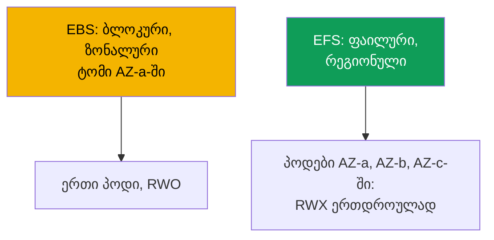
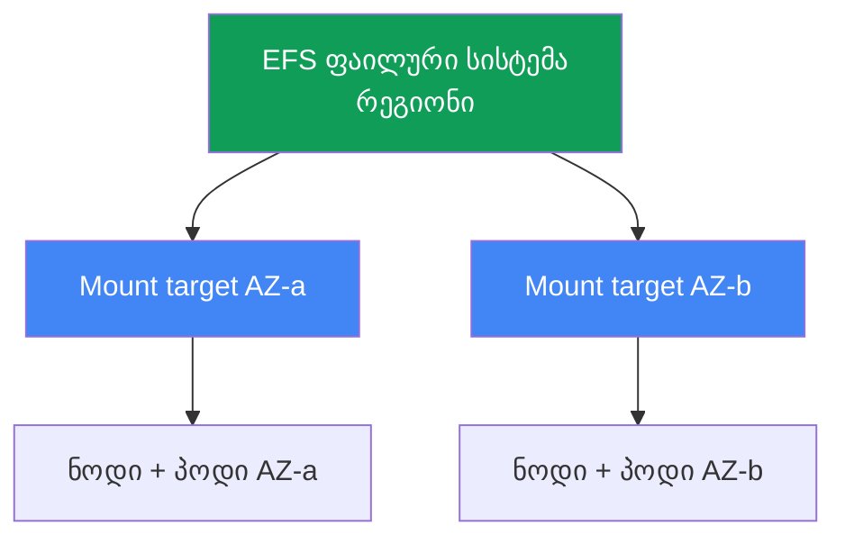

[Русская версия](ru.md) · [Eng version](en.md) · [Versión en español](es.md) · [Version française](fr.md) · [Deutsche Version](de.md) · [繁體中文版](tw.md) · [日本語版](jp.md)
# თავი 24. EFS და FSx: საერთო საცავი AZ-ებს შორის დატვირთვებისთვის

> **რა არის შემდეგ.** 23-ე თავმა აჩვენა, რომ EBS ზონალურია: ტომი ერთ AZ-შია, ერთი ჩამწერი
> (ReadWriteOnce), პოდი კი ზონაზეა მიბმული. ეს თავი ამოცანების საპირისპირო კლასს ეხება: მრავალი
> პოდიდან ჩაწერის საერთო წვდომას (ReadWriteMany) და AZ-ებს შორის მუშაობას. ეს არის EFS
> (მართვადი, რეგიონული NFS) და FSx-ის მიმოხილვა. CSI-დრაივერის როლი IRSA-ს ან Pod Identity-ის
> მეშვეობით გაიცემა (თავები 16-17), Mountpoint for Amazon S3 25-ე თავშია, ბექაპი 41-ე თავში,
> Fargate კი მე-15 თავში. PV, PVC და access modes CKA-დან იცით; აქ EKS-ში ქსელური ფაილური
> წვდომის სპეციფიკაა.

## 24.1. „ორ პოდს ერთი ტომი სჭირდება, EBS კი მას მხოლოდ ერთს აძლევს“

არსებობს სამი სცენარი, რომლებშიც 23-ე თავში განხილული EBS ჩიხში შედის, და სამივე ერთსა და იმავე
გამოსავალთან მიგვიყვანს.

პირველი: რამდენიმე პოდს ერთ ტომში ერთდროულად ჩაწერა სჭირდება (ატვირთვების საერთო კატალოგი,
ერთ dataset-ზე მომუშავე worker-ები). ცდილობთ EBS ტომის მეორე რეპლიკასთან მიერთებას:

```bash
kubectl describe pod uploader-1
# Events:
#   Warning  FailedAttachVolume  attachdetach-controller
#     Multi-Attach error for volume "pvc-..." Volume is already exclusively attached
#     to one node and can't be attached to another
```

`Multi-Attach error` ნიშნავს, რომ EBS ტომი უკვე ერთ ნოდს აქვს დაკავებული. `ReadWriteOnce` რეჟიმიც
ზუსტად ამას ნიშნავს: ერთი ნოდი, ერთი ჩამწერი. StorageClass-ის ვერანაირი პარამეტრი ამას ვერ შეცვლის,
რადგან ეს ბლოკური მოწყობილობის შეზღუდვაა.

მეორე სცენარი: პოდმა AZ-ებს შორის გადასვლა უნდა გადაიტანოს. EBS-ის შემთხვევაში პოდი ტომის ზონაზეა
მიბმული (თავი 23), და თუ მის AZ-ში ნოდი არ არის, პოდი `Pending` მდგომარეობაში რჩება. მესამე:
Fargate-პოდს მუდმივი საცავი სჭირდება, EBS კი Fargate-ზე საერთოდ არ მონტაჟდება (თავი 15).

სამივეს საერთო მიზეზი ბლოკური მოწყობილობაა. EBS ბლოკურ წვდომას იძლევა: დისკი ერთ ზონაში ერთ
instance-ზეა მიბმული. საჭიროა **ქსელური ფაილური წვდომა**, ანუ ფაილური სისტემა, რომელსაც რამდენიმე
ნოდი და პოდი ქსელით ერთდროულად, AZ-ისგან დამოუკიდებლად უკავშირდება. ეს არის EFS.

## 24.2. EBS, EFS და FSx: ბლოკური და ფაილური

განსხვავება „უფრო სწრაფსა და უფრო ნელს“ შორის კი არა, თავად წვდომის მოდელშია. EBS არის დისკი,
რომელსაც AWS ერთ instance-ს უერთებს. EFS და FSx ფაილური სერვერებია, რომლებსაც კლიენტები ქსელით
უკავშირდებიან (NFS EFS-ისთვის, NFS/SMB/Lustre FSx-ისთვის), ამიტომ მათ ერთდროულად მრავალი კლიენტი
და სხვადასხვა ზონა ხედავს.



| თვისება | EBS | EFS | FSx |
|---|---|---|---|
| მოდელი | ბლოკური მოწყობილობა | ფაილური (NFS) | ფაილური (NFS/SMB/Lustre) |
| Access modes | ReadWriteOnce | ReadWriteMany | RWX (ტიპზეა დამოკიდებული) |
| მასშტაბი | ერთი AZ | რეგიონი, ყველა AZ | ტიპზეა დამოკიდებული |
| AZ-ებს შორის | არა, ტომი ზონაზეა მიბმული | დიახ, გამჭვირვალედ | ტიპზეა დამოკიდებული |
| დაყოვნება | ლოკალური SSD-ის მსგავსი | უფრო მაღალი, რადგან ქსელურია | Lustre: ძალიან დაბალი |
| ფასის მოდელი | გამოყოფილი მოცულობა | გამოყენებული მოცულობა | გამოყოფილი მოცულობა |
| როდის | მონაცემთა ბაზები, single-writer | საერთო RWX, AZ-ებს შორის | HPC/ML, Windows/SMB |

არჩევის უხეში წესი ასეთია: თუ ერთი სწრაფი ჩამწერი და დისკის წარმადობა გჭირდებათ, გამოიყენეთ EBS
(თავი 23); თუ ჩაწერის საერთო წვდომა და AZ-ებს შორის მუშაობა გჭირდებათ, გამოიყენეთ EFS; თუ
სპეციალიზაციაა საჭირო (Lustre HPC-სთვის, SMB Windows-ისთვის, ONTAP-ის შესაძლებლობები), გამოიყენეთ
FSx.

## 24.3. EFS დეტალურად: რეგიონული NFS

Amazon EFS NFS-ზე დაფუძნებული მართვადი ფაილური სისტემაა. EBS-ისგან მთავარი განსხვავება ისაა, რომ
იგი **რეგიონულია** და არა ზონალური. მოცულობა ელასტიკურია: ადგილი წინასწარ არ გამოიყოფა, ფაილური
სისტემა კი მონაცემების ჩაწერისა და წაშლის შესაბამისად იზრდება და მცირდება.

რეგიონულობა ყველა ზონიდან წვდომას ნიშნავს, მაგრამ კლიენტს (ნოდს) საკუთარ ზონაში შესასვლელი წერტილი
სჭირდება. ეს წერტილია **mount target**, EFS-ის ქსელური ინტერფეისი კონკრეტული AZ-ის subnet-ში. წესი
მარტივია: **ერთი mount target ხელმისაწვდომობის თითოეულ ზონაზე** (სტანდარტული, არა One Zone,
ფაილური სისტემისთვის). `eu-central-1a`-ში არსებული ნოდი EFS-ს `eu-central-1a`-ში არსებული mount
target-ის მეშვეობით ამონტაჟებს.



აქედან გამომდინარეობს მთავარი საექსპლუატაციო თვისება: EFS **ზონაზე მიბმული არ არის**. პოდი AZ-a-დან
AZ-b-ში გადადის (ხელახლა შექმნა, Karpenter-ის კონსოლიდაცია, ზონის დაკარგვა) და კვლავ იმავე მონაცემებს
ხედავს, რადგან EFS-ს უბრალოდ ახალი ზონის mount target-ის მეშვეობით ამონტაჟებს. EFS-ს 23-ე თავის
პრობლემა (`volume node affinity conflict`) არ აქვს: EFS PV ზონის `nodeAffinity`-ს არ შეიცავს.
`ReadWriteMany` კი მრავალ ნოდზე განთავსებულ მრავალ პოდს ფაილურ სისტემაში ერთდროულად ჩაწერის უფლებას
აძლევს.

კლასტერში EFS-თან მუშაობას **aws-efs-csi-driver**, provisioner-ით `efs.csi.aws.com`, მართავს.
ის managed addon-ის სახით ყენდება:

```bash
aws eks create-addon --cluster-name demo --addon-name aws-efs-csi-driver \
  --service-account-role-arn arn:aws:iam::111122223333:role/eks-efs-csi-driver
```

დრაივერს IAM-როლი სჭირდება: controller EFS API-ებს იძახებს (access point-ების შექმნა და წაშლა,
mount target-ებისა და ზონების წაკითხვა). როლი IRSA-ს ან EKS Pod Identity-ის მეშვეობით გაიცემა
(თავები 16-17), მისი ARN `--service-account-role-arn`-ში გადაეცემა, მზა managed-პოლიტიკა კი
`AmazonEFSCSIDriverPolicy` არის. როლის გარეშე dynamic provisioning access point-ის შექმნისას
`AccessDenied` შეცდომით მთავრდება. დრაივერი Windows container image-ებთან შეუთავსებელია.

## 24.4. EFS provisioning: სტატიკური და დინამიკური

EFS-ს პოდისთვის ტომის გადაცემის ორი გზა აქვს და ისინი EBS-ისგან განსხვავდება. თავად EFS ფაილური
სისტემა ორივე შემთხვევაში **წინასწარ** იქმნება (ხელით, Terraform-ით ან კონსოლში), CSI-დრაივერი მას
არ ქმნის. იგი არსებული ფაილური სისტემის ზედაპირზე მისი `fileSystemId`-ით (მაგალითად,
`fs-0123456789abcdef0`) მუშაობს.

**სტატიკური** provisioning ნიშნავს, რომ PV-ს ხელით აღწერთ და `volumeHandle`-ში `fileSystemId`-ს
უთითებთ. ეს მიდგომა გამოდგება, როცა ერთი ფაილური სისტემა ყველასთვის საერთოა და საერთო კატალოგი
მისაღებია. Fargate-ზე ეს ერთადერთი ვარიანტია (24.7).

```yaml
apiVersion: v1
kind: PersistentVolume
metadata: {name: efs-shared}
spec:
  capacity: {storage: 5Gi}          # EFS-ისთვის რიცხვი პირობითია, მოცულობა ელასტიკურია
  accessModes: ["ReadWriteMany"]
  persistentVolumeReclaimPolicy: Retain
  storageClassName: efs-sc
  mountOptions: ["tls"]             # NFS-ტრაფიკის in-transit დაშიფვრა, ყოველთვის დატოვეთ
  csi:
    driver: efs.csi.aws.com
    volumeHandle: fs-0123456789abcdef0
```

**დინამიკური** provisioning იყენებს StorageClass-ს `provisioningMode: efs-ap` პარამეტრით და
ყოველი PVC-სთვის დრაივერი ერთ ფაილურ სისტემაში **access point**-ს ქმნის. Access point არის საკუთარ
ქვეკატალოგში შესასვლელი წერტილი საკუთარი უფლებებითა და POSIX-იდენტობით, ანუ იზოლაციის მექანიზმი:
სხვადასხვა PVC ერთ EFS-ში სხვადასხვა კატალოგს იღებს და ერთმანეთის მონაცემებს ვერ ხედავს.

```yaml
apiVersion: storage.k8s.io/v1
kind: StorageClass
metadata: {name: efs-sc}
provisioner: efs.csi.aws.com
parameters:
  provisioningMode: efs-ap
  fileSystemId: fs-0123456789abcdef0
  directoryPerms: "755"          # access point-ის root-კატალოგის უფლებები
  uid: "1000"                    # access point root dir-ის OwnerUid (არა root)
  gid: "1000"                    # OwnerGid; მითითებული uid/gid-ისას gidRange არ გამოიყენება
  basePath: "/dynamic"           # access point-ების ქვეკატალოგების root
mountOptions: ["tls"]            # in-transit დაშიფვრა დინამიკურ გზაზეც
```

დრაივერი `uid`, `gid` და `directoryPerms` პარამეტრებს access point-ის root-კატალოგზე, მის
`creationInfo`-ზე (`OwnerUid`, `OwnerGid`, `Permissions`) იყენებს. მიუთითეთ არა-root მფლობელი და
`0755` უფლებები: წინააღმდეგ შემთხვევაში `runAsNonRoot`-ის მქონე პოდები პირველივე ჩაწერისას
`Permission Denied` შეცდომას მიიღებენ, რადგან კატალოგის root სხვა იდენტობის მფლობელობაში აღმოჩნდება.

ამ კლასისთვის PVC ჩვეულებრივია, მაგრამ `ReadWriteMany`-ს იყენებს:

```yaml
apiVersion: v1
kind: PersistentVolumeClaim
metadata: {name: shared-data}
spec:
  storageClassName: efs-sc
  accessModes: ["ReadWriteMany"]
  resources:
    requests: {storage: 5Gi}
```

| თვისება | სტატიკური | დინამიკური (`efs-ap`) |
|---|---|---|
| EFS ფაილური სისტემა | წინასწარ ქმნით | წინასწარ ქმნით |
| PV | ხელით აღწერთ | დრაივერი ქმნის |
| გაცემის ერთეული | მთელი ფაილური სისტემა ან კატალოგი | თითო PVC-ზე access point |
| კატალოგების იზოლაცია | ხელით | access point-ების მეშვეობით |
| Fargate-ზე | დიახ | არა (24.7) |

გაითვალისწინეთ: EFS-ის PVC-ში `storage: 5Gi` პირობითი სიდიდეა. მოცულობა ელასტიკურია და წინასწარ არ
გამოიყოფა, ზომის კვოტა კი EBS-ის მსგავსად არ გამოიყენება; რიცხვი PVC-ის სქემის ფორმალურად
დასაკმაყოფილებლად არის საჭირო.

## 24.5. EFS-ის ნიუანსები: წარმადობა, დაშიფვრა, ღირებულება

EFS ქსელური ფაილური სისტემაა და არა ლოკალური დისკი, რაც მის პროფილს განსაზღვრავს. დაყოვნება EBS-ზე
მაღალია: ყოველი მოთხოვნა ქსელით mount target-მდე და უკან მიდის. დიდი ფაილების ნაკადური
დამუშავებისას ეს შეუმჩნეველია, მაგრამ ათასობით მცირე სინქრონული ოპერაციისას მნიშვნელოვანია.

აქედან გამომდინარეობს გაკვეთილი, რომელიც თავიდანვე უნდა დაიმახსოვროთ: **EFS დაბალი დაყოვნების
მონაცემთა ბაზებისთვის არ არის**. PostgreSQL-ის ან MySQL-ის EFS-ზე განთავსება ანტიპატერნია:
მონაცემთა ბაზები მრავალ მცირე სინქრონულ ჩაწერას ასრულებს, რომლებსაც ქსელური ფაილური სისტემა
ანელებს, NFS-ის lock-ები კი ლოკალური დისკის მსგავსად არ იქცევა. მონაცემთა ბაზებისთვის გამოიყენეთ
ზონალური EBS ერთი ჩამწერით (თავი 23). EFS კარგია იქ, სადაც თავად საერთო წვდომაა მნიშვნელოვანი:
სტატიკური asset-ები და media, საერთო კონფიგურაციები, ML-ის dataset-ები და კატალოგები, რომლებშიც
რამდენიმე worker წერს.

ფაილური სისტემის გამტარუნარიანობა მისი **throughput mode**-ით კონფიგურირდება:

| Throughput mode | როგორ მუშაობს | როდის |
|---|---|---|
| Elastic | დატვირთვის შესაბამისად ავტომატურად მასშტაბირდება | არაპროგნოზირებადი ან იშვიათი წვდომა |
| Bursting | მონაცემთა მოცულობასთან ერთად იზრდება და კრედიტებს აგროვებს | მოცულობის პროპორციული თანაბარი დატვირთვა |
| Provisioned | მოცულობისგან დამოუკიდებელი ფიქსირებული მნიშვნელობა | საჭიროა Bursting-ზე მაღალი ზედა ზღვარი |

დაშიფვრა: **at-rest** დაშიფვრა ფაილური სისტემის შექმნისას ირთვება (KMS გასაღებით) და მოგვიანებით
ვეღარ იცვლება. **In-transit** (TLS) დაშიფვრა კლიენტის მხარეს ირთვება. EFS CSI-დრაივერში ამისთვის
მონტაჟის `tls` პარამეტრი გამოიყენება, რომელიც ყოველთვის ჩართული უნდა დატოვოთ, რათა ნოდსა და mount
target-ს შორის NFS-ტრაფიკი დაშიფრული იყოს.

EFS-ის ფასი EBS-ისგან განსხვავებულად არის მოწყობილი. იხდით **ფაქტობრივად გამოყენებული ადგილისთვის**
(ტომის წინასწარი გამოყოფის გარეშე), დამატებით კი throughput mode-ის მიხედვით გამტარუნარიანობისთვის.
ეს მიდგომას ცვლის: EBS-ის შემთხვევაში გამოყოფილი ტომის ზომაში იხდით, თუნდაც ის ცარიელი იყოს;
EFS-ის შემთხვევაში კი იმაში, რაც რეალურად ინახება ფაილურ სისტემაში.

## 24.6. მოკლედ FSx-ის შესახებ: როცა EFS არ გამოდგება

EFS Linux-ზე საერთო NFS-წვდომას ფარავს. როცა სხვა პროტოკოლი ან ექსტრემალური გამტარუნარიანობაა
საჭირო, გამოიყენება **Amazon FSx**-ის ოჯახი: ოთხი განსხვავებული ფაილური სერვისი, თითოეული საკუთარი
CSI-დრაივერით. აქ მხოლოდ მიმოხილვაა, რათა იცოდეთ, სად მოძებნოთ გამოსავალი.

| FSx | პროტოკოლი | პროფილი | როდის გამოიყენება EFS-ის ნაცვლად |
|---|---|---|---|
| FSx for Lustre | Lustre | HPC, ML, ძალიან მაღალი გამტარუნარიანობა | ML-ის სწავლება, S3-თან ინტეგრაცია |
| FSx for Windows File Server | SMB | დომენთან მიერთებული Windows-დატვირთვები | Windows-კონტეინერები, SMB |
| FSx for NetApp ONTAP | NFS/SMB/iSCSI | ONTAP-ის შესაძლებლობები (snapshot-ები, deduplication) | საჭიროა ONTAP-ის შესაძლებლობები |
| FSx for OpenZFS | NFS | ZFS, snapshot-ები, დაბალი დაყოვნება | ZFS-ის სემანტიკა, latency |

EKS-ის კონტექსტში ყველაზე გავრცელებული ვარიანტია **FSx for Lustre**: ML-ისა და HPC-ის პარალელური
ფაილური სისტემა ძალიან მაღალი გამტარუნარიანობითა და S3-თან ინტეგრაციით (dataset S3-ში ინახება,
Lustre კი მასზე სწრაფ POSIX-წვდომას იძლევა). მისი დრაივერი ცალკე `aws-fsx-csi-driver` addon-ია.
**Windows/SMB** ერთადერთი ვარიანტია, როცა Windows-კონტეინერებისთვის საერთო ტომია საჭირო: EFS მათ
მხარს არ უჭერს. ამ კურსში FSx უფრო ღრმად არ განიხილება, რადგან AZ-ებს შორის საერთო საცავის
ამოცანების 90%-ისთვის EFS საკმარისია.

## 24.7. Fargate და EFS

Fargate-ზე (თავი 15) თქვენ მიერ მართვადი ნოდები არ არსებობს და **EBS იქ არ მონტაჟდება**. Fargate-
პოდებისთვის ერთადერთი მუდმივი საცავი EFS-ია. ამიტომ Fargate + EFS ნოდების გარეშე stateful-
დატვირთვების სტანდარტული პატერნია.

ორი დეტალია გასათვალისწინებელი. პირველი: Fargate-ზე მხოლოდ **სტატიკური** provisioning მუშაობს
(24.4); access point-ების მეშვეობით დინამიკური provisioning მხარდაჭერილი არ არის. მეორე: დრაივერი
Fargate-ზე **DaemonSet-ის სახით არ ყენდება**, რადგან DaemonSet-ები Fargate-ზე საერთოდ არ ეშვება
(თავი 15), EFS-ის მონტაჟი კი თავად პლატფორმაშია ჩაშენებული. Fargate-პოდი EFS-ს დრაივერის
კომპონენტების დაყენების გარეშე ავტომატურად ამონტაჟებს: საკმარისია PV `fileSystemId`-ზე სტატიკური
მითითებით და PVC.

## 24.8. დიაგნოსტიკა: პოდი EFS-ს ვერ ამონტაჟებს

სიმპტომი, ჩვეულებრივ, ერთია: პოდი `ContainerCreating` მდგომარეობაშია გაჭედილი, მის მოვლენებში კი
მონტაჟის timeout ჩანს:

```bash
kubectl describe pod app-0
# Events:
#   Warning  FailedMount  kubelet
#     Unable to attach or mount volumes: unmounted volumes=[data]:
#     timed out waiting for the condition
```

EBS-ისგან განსხვავებით, სადაც პრობლემა ზონალურობას უკავშირდება, EFS-ის თითქმის ყველა პრობლემა
ქსელსა და წვდომის უფლებებზე დაიყვანება. შეამოწმეთ ამ თანმიმდევრობით:

| სიმპტომი | მიზეზი | რა უნდა შეამოწმოთ |
|---|---|---|
| `FailedMount`, timeout | mount target-ის SG NFS-ს არ უშვებს | inbound 2049 ნოდების SG-ებიდან |
| პოდის AZ-ში mount target არ არის | ფაილურ სისტემას ამ ზონაში mount target არ აქვს | `aws efs describe-mount-targets` |
| `AccessDenied` access point-ზე | დრაივერს როლი არ აქვს | IRSA/Pod Identity-ის როლი, პოლიტიკა |
| ფაილური სისტემის სახელი არ resolve-დება | DNS VPC-ში | `fs-...efs.<region>...`-ის resolution |
| TLS-ისას კავშირი წყდება | `tls` პარამეტრი და პორტი | mount options შეამოწმეთ |

ყველაზე ხშირი მიზეზია **mount target-ის security group**. NFS **2049** პორტს იყენებს და mount
target-ის SG-ში 2049 პორტზე კლასტერის ნოდების SG-ებიდან inbound წესი უნდა არსებობდეს. ამ წესის
გარეშე მონტაჟი timeout-მდე იცდის. Mount target-ები ასე შეამოწმეთ:

```bash
# არის თუ არა mount target ნოდების თითოეულ ზონაში და რა მდგომარეობაშია ის
aws efs describe-mount-targets --file-system-id fs-0123456789abcdef0 \
  --query 'MountTargets[].{AZ:AvailabilityZoneName,State:LifeCycleState,IP:IpAddress}'
```

შემდეგ სიის მიხედვით გააგრძელეთ: mount target არსებობს **ყველა** ზონაში, სადაც ამ პოდის ნოდები
მუშაობენ (პოდის ზონაში target-ის არარსებობისას მონტაჟი შეუძლებელია); დრაივერს აქვს როლი
`AmazonEFSCSIDriverPolicy`-ით; ფაილური სისტემის სახელი VPC-ში resolve-დება (DNS resolution
აუცილებელია); in-transit დაშიფვრისთვის კი `tls` პარამეტრი ჩართულია.

პრობლემების ცალკე კლასია **გაჭედილი NFS-lock-ები**. აპლიკაცია, რომელიც ფაილის lock-ს
`flock`/`lockf`-ის მეშვეობით იღებს, მას NFSv4-ის მხარეს lock state-ის სახით ინახავს, EFS-ის ყველა
lock კი **advisory** არის: მას მხოლოდ ის მონაწილე ითვალისწინებს, რომელიც თავად ამოწმებს lock-ს;
kernel ჩაწერას არ კრძალავს. ავარიული restart-ისას (`kill -9`, OOM, იძულებითი eviction) პოდი lock-ის
გათავისუფლების გარეშე კვდება და ასეთი დასრულებისას მისი კორექტულად გათავისუფლება შეუძლებელია.
NFSv4 lock-ს მფლობელი კლიენტის lease-ის ვადის ამოწურვამდე ინარჩუნებს: ცოცხალი კლიენტი lease-ს
ახანგრძლივებს, გამქრალი კი ვერა, და სერვერი lock-ს მხოლოდ ვადის გასვლის შემდეგ ათავისუფლებს.
სიმპტომი ასეთია: ახალი პოდი ეშვება, მაგრამ იმავე lock-ის აღების მცდელობისას იჭედება, რადგან ძველი
lock EFS-ზე გარკვეული ხნით კვლავ დაკავებულად ითვლება. შემამსუბუქებელი ზომები: გამოიყენეთ graceful
shutdown, რათა აპლიკაციამ გასვლამდე თავად გაათავისუფლოს lock; restart-ის შემდეგ დაელოდეთ lease-ის
ვადის გასვლას და lock-ს ციკლში განუწყვეტლივ ნუ მიმართავთ; შეინარჩუნეთ single-writer პატერნი, როცა
საერთო EFS-ის კატალოგში მხოლოდ ერთი პოდი წერს; აპლიკაციები EFS-ზე ფაილური lock-ების გარეშე
დააპროექტეთ და კოორდინაცია ქსელური ფაილური სისტემის გარეთ, მონაცემთა ბაზაში ან განაწილებულ lock-ში
გაიტანეთ.

## 24.9. როგორ იყენებენ ამას პროდაქშენში

- **EFS RWX-ისა და AZ-ებს შორის მუშაობისთვის.** მრავალი პოდიდან ჩაწერის საერთო წვდომა და ზონებს
  შორის მუშაობა EFS-ის პროფილია. Single-writer დატვირთვები და დისკის წარმადობა EBS-ზე დატოვეთ
  (თავი 23).
- **Access point-ები იზოლაციისთვის.** დინამიკური `efs-ap` თითოეულ PVC-ს საკუთარ კატალოგს აძლევს,
  თავისი უფლებებითა და POSIX-იდენტობით; ერთი ფაილური სისტემა მრავალ დატვირთვას უსაფრთხოდ
  ემსახურება.
- **In-transit დაშიფვრა ნაგულისხმევად.** `tls` პარამეტრი ყოველთვის ჩართულია; at-rest დაშიფვრა
  ფაილური სისტემის KMS გასაღებით შექმნისას ჩართეთ.
- **არა მონაცემთა ბაზებისთვის.** EFS გამოიყენეთ media-სთვის, asset-ებისთვის, კონფიგურაციებისთვის,
  ML-ის dataset-ებისა და საერთო კატალოგებისთვის. მონაცემთა ბაზებისთვის გამოიყენეთ ზონალური EBS;
  ქსელური ფაილური სისტემის დაყოვნება მათთვის დამღუპველია.
- **Mount target ყველა ზონაში.** ფაილურ სისტემას mount target ყველა იმ AZ-ში უნდა ჰქონდეს, სადაც
  ნოდები მუშაობენ; mount target-ის SG 2049 პორტზე ნოდების SG-ებიდან ტრაფიკს უშვებს.
- **FSx სპეციალიზაციისთვის.** Lustre ML/HPC-ის გამტარუნარიანობისა და S3-თან ინტეგრაციისთვის,
  Windows File Server SMB-სა და Windows-კონტეინერებისთვის, ONTAP კი საკუთარი შესაძლებლობებისთვის.
  საერთო NFS-ისთვის EFS საკმარისია.

## 24.10. მინი-გლოსარიუმი

- **EFS** - Amazon Elastic File System, მართვადი რეგიონული NFS ელასტიკური მოცულობითა და
  ReadWriteMany რეჟიმით.
- **EFS CSI-დრაივერი** - `aws-efs-csi-driver`, managed addon provisioner-ით `efs.csi.aws.com`;
  წინასწარ შექმნილი ფაილური სისტემის ზედაპირზე მუშაობს.
- **mount target** - EFS-ის ქსელური ინტერფეისი კონკრეტული AZ-ის subnet-ში; ამ ზონის ნოდებისთვის
  შესასვლელი წერტილი, თითო ხელმისაწვდომობის ზონაზე.
- **access point** - EFS-ის ქვეკატალოგში შესასვლელი წერტილი საკუთარი უფლებებითა და POSIX-
  იდენტობით; დინამიკური provisioning-ისა და კატალოგების იზოლაციის საფუძველი.
- **provisioningMode: efs-ap** - StorageClass-ის რეჟიმი, რომელშიც დრაივერი თითოეული PVC-სთვის
  access point-ს ქმნის.
- **throughput mode** - EFS-ის გამტარუნარიანობის რეჟიმი: Elastic, Bursting ან Provisioned.
- **ReadWriteMany (RWX)** - access mode: ტომი მრავალ ნოდზე განთავსებული მრავალი პოდის მიერ
  ერთდროულად ჩასაწერად მონტაჟდება.

## 24.11. თავის შეჯამება

- EBS ჩიხში შედის, როცა ჩაწერის საერთო წვდომა (RWO, `Multi-Attach error`), AZ-ებს შორის გადასვლა
  ან Fargate-ზე საცავია საჭირო. სამივეს პასუხია ქსელური ფაილური წვდომა, ანუ EFS.
- EFS რეგიონულია: მასზე წვდომა ყველა ზონიდან, თითოეულ AZ-ში არსებული mount target-ის მეშვეობით
  ხდება (თითო ზონაზე ერთი). პოდი AZ-ებს შორის გადადის და მონაცემებს კვლავ ხედავს; EFS-ს 23-ე
  თავის `volume node affinity conflict` არ აქვს, `ReadWriteMany` კი მრავალ ჩამწერს უშვებს.
- მუშაობას `efs.csi.aws.com` (managed addon `aws-efs-csi-driver`) მართავს, როლით IRSA/Pod
  Identity-ის მეშვეობით (თავები 16-17) და `AmazonEFSCSIDriverPolicy` პოლიტიკით. ფაილური სისტემა
  წინასწარ იქმნება, დრაივერი კი მასზე `fileSystemId`-ით მუშაობს.
- Provisioning სტატიკურია (ხელით აღწერილი PV `fileSystemId`-ზე) ან დინამიკური
  (`provisioningMode: efs-ap`, თითო PVC-ზე access point კატალოგისა და UID-ის იზოლაციისთვის).
- EFS ქსელური ფაილური სისტემაა: მისი დაყოვნება EBS-ზე მაღალია და დაბალი დაყოვნების მონაცემთა
  ბაზებისთვის არ გამოდგება; კარგია media-სთვის, asset-ებისთვის, კონფიგურაციებისა და ML-ის
  dataset-ებისთვის. Throughput არის Elastic/Bursting/Provisioned; დაშიფვრა at-rest (KMS) და
  in-transit (`tls`). იხდით გამოყენებული მოცულობისა და გამტარუნარიანობისთვის.
- FSx სპეციალიზაციისთვისაა: Lustre (HPC/ML, S3-თან ინტეგრაცია), Windows File Server (SMB),
  ONTAP და OpenZFS; თითოეულს საკუთარი CSI-დრაივერი აქვს. AZ-ებს შორის საერთო NFS-ისთვის EFS
  საკმარისია.
- Fargate-ზე EBS არ მონტაჟდება და EFS ერთადერთი მუდმივი საცავია; მხარდაჭერილია მხოლოდ სტატიკური
  provisioning, მონტაჟი კი DaemonSet-ის გარეშე პლატფორმაშია ჩაშენებული.
- მონტაჟის დიაგნოსტიკისას შეამოწმეთ mount target-ის SG-ში 2049 პორტი ნოდების SG-ებიდან, პოდის
  ზონაში mount target-ის არსებობა, დრაივერის როლი, DNS resolution და `tls` პარამეტრი.

## 24.12. როგორ გამოგადგებათ ეს რეალურ სამუშაოში

მორიგეობისას EFS-ის ინციდენტები თითქმის ყოველთვის ქსელსა და უფლებებს უკავშირდება და არა ზონებს.
თუ პოდი `ContainerCreating` მდგომარეობაში `FailedMount`-ით გაიჭედა, პირველ რიგში გაუშვით `aws efs
describe-mount-targets`: არსებობს თუ არა target პოდის ზონაში და გახსნილია თუ არა მის SG-ში 2049
პორტი ნოდებიდან? ეს შემთხვევების უმეტესობას აგვარებს. დაპროექტებისას გახსოვდეთ 23-ე თავის ზღვარი:
EBS ერთი სწრაფი ჩამწერისა და წარმადობისთვისაა, EFS საერთო წვდომისა და AZ-ებს შორის მუშაობისთვის;
მონაცემთა ბაზა არასოდეს განათავსოთ ქსელურ ფაილურ სისტემაზე. როცა Fargate-ის დატვირთვას stateful-
მოთხოვნა აქვს, გახსოვდეთ, რომ არჩევანი ზუსტად ერთია: სტატიკური EFS. ხოლო თუ ინჟინრები ითხოვენ
„ფაილურ საცავს, როგორც მონაცემთა ცენტრში“, SMB-ით ან ML-ის დონის გამტარუნარიანობით, ეს უკვე FSx-ის
ტერიტორიაა; EFS-ზე შემოვლითი გზების აგებამდე შეადარეთ Lustre და Windows File Server.

## 24.13. კითხვები თვითშემოწმებისთვის

1. რატომ ვერ მიერთდება EBS ტომი ერთდროულად ორ პოდთან და როგორ გამოიყურება ეს შეცდომა?
2. კლიენტების რაოდენობის თვალსაზრისით, რით განსხვავდება ბლოკური წვდომა (EBS) ფაილური წვდომისგან
   (EFS)?
3. რატომ ეწოდება EFS-ს რეგიონული, EBS-ს კი ზონალური, და რა არის mount target?
4. რამდენი mount target არის საჭირო და რატომ უძლებს EFS-ზე არსებული პოდი AZ-ებს შორის გადასვლას?
5. რატომ სჭირდება EFS CSI-დრაივერს IAM-როლი და რომელი managed-პოლიტიკა სჭირდება მას?
6. რით განსხვავდება EFS-ის სტატიკური provisioning დინამიკური `efs-ap` provisioning-ისგან?
7. რა არის access point და როგორ უზრუნველყოფს ის კატალოგებისა და UID-ის იზოლაციას?
8. რატომ არ უნდა გამოიყენოთ EFS მონაცემთა ბაზებისთვის და რისთვის გამოდგება ის?
9. EFS-ის throughput-ის რომელი რეჟიმები არსებობს და რით განსხვავდება მისი ფასის მოდელი EBS-ისგან?
10. როგორ ირთვება EFS-ის at-rest და in-transit დაშიფვრა?
11. რატომ არის Fargate-ზე მხოლოდ სტატიკური provisioning ხელმისაწვდომი და რატომ არ არის საჭირო
    DaemonSet?
12. პოდი EFS-ზე `FailedMount`-ით გაიჭედა: რომელ მიზეზებს და რა თანმიმდევრობით შეამოწმებთ?
13. როდის არის EFS-ის ნაცვლად FSx საჭირო და FSx-ის რომელი ვარიანტია ML-ისთვის, რომელი კი
    Windows-ისთვის?

## პრაქტიკა

ამ თემის შესაბამისი კურსის ლაბა: [ლაბა 107 - EFS CSI: ReadWriteMany ხელმისაწვდომობის ზონებს
შორის](../../labs/107/README_GE.MD). ამის გარდა, ყველაფერი ცოცხალ კლასტერზე მოწმდება. დარწმუნდით,
რომ EFS CSI-დრაივერი დაყენებულია: `aws eks list-addons --cluster-name <cluster>` და `kubectl get
pods -n kube-system | grep efs-csi`. შეამოწმეთ არსებული ფაილური სისტემა: `aws efs
describe-file-systems`, შემდეგ `aws efs describe-mount-targets --file-system-id fs-...` და
გადაამოწმეთ, რომ თქვენი ნოდების თითოეულ ზონაში mount target არსებობს და `available` მდგომარეობაშია.

შემდეგ გაიმეორეთ RWX: შექმენით StorageClass `provisioningMode: efs-ap`-ითა და თქვენი
`fileSystemId`-ით, სხვადასხვა AZ-ში გაუშვით Deployment 2-3 რეპლიკით, რომლებიც ერთ
`ReadWriteMany` PVC-ს იყენებენ, და დარწმუნდით, რომ ყველა რეპლიკა საერთო კატალოგში ერთდროულად წერს
(რის საშუალებასაც EBS არ იძლევა). გაუშვით `kubectl get pv -o yaml` და გადაამოწმეთ, რომ EBS-ისგან
განსხვავებით, EFS PV-ს ზონის `nodeAffinity` არ აქვს. შემდეგ მონტაჟი განზრახ გააფუჭეთ: mount
target-ის SG-იდან 2049 პორტის წესი წაშალეთ, პოდი ხელახლა შექმენით და `kubectl describe pod`-ში
`FailedMount` იპოვეთ; აღადგინეთ წესი და დარწმუნდით, რომ მონტაჟი წარმატებით სრულდება. თუ Fargate-
პროფილზე წვდომა გაქვთ, გაიმეორეთ `fileSystemId`-ზე სტატიკური PV-ით და შეადარეთ: EBS ტომი Fargate-
პოდს ვერ მიერთდება, EFS კი DaemonSet-ის გარეშე მონტაჟდება.

---
[სარჩევი](../README_GE.md) · [თავი 23](../23/ge.md) · [თავი 25](../25/ge.md)
