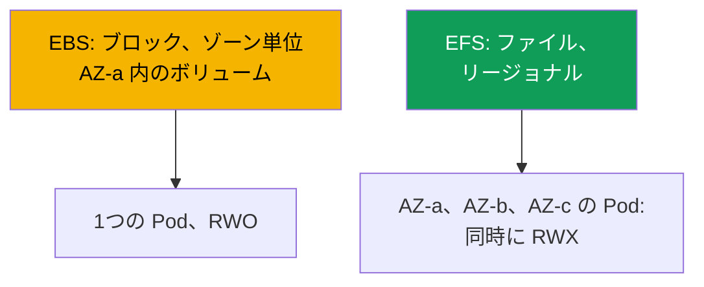
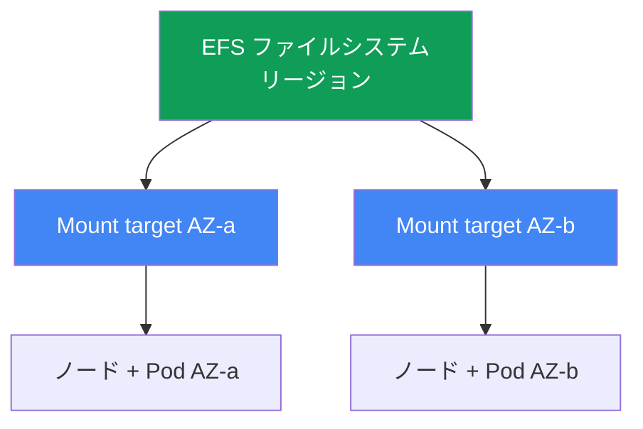

[ロシア語版](ru.md) · [英語版](en.md) · [スペイン語版](es.md) · [フランス語版](fr.md) · [ドイツ語版](de.md) · [ジョージア語版](ge.md) · [繁体字中国語版](tw.md)
# 第24章. EFS と FSx: AZ をまたぐワークロードの共有ストレージ

> **この先。** 第23章では EBS がゾーン単位であることを示しました。ボリュームは1つの AZ にあり、1つの書き込み元 (ReadWriteOnce) だけを許可し、Pod はゾーンに固定されます。この章は反対の種類の課題、つまり多数の Pod からの共有書き込みアクセス (ReadWriteMany) と AZ をまたぐ運用を扱います。対象は EFS (マネージド NFS、リージョナル) と FSx の概要です。CSI ドライバーのロールは IRSA または Pod Identity (第16、17章) 経由で付与します。Mountpoint for Amazon S3 は第25章、バックアップは第41章、Fargate は第15章を参照してください。PV、PVC、access modes は CKA で学習済みであり、ここでは EKS におけるネットワークファイルアクセスの特性を扱います。

## 24.1. 「2つの Pod に1つのボリュームが必要なのに、EBS は一方にしか渡してくれない」

第23章の EBS が行き詰まる3つのシナリオがあり、いずれも同じ解決策に至ります。

1つ目は、複数の Pod が同じボリュームに同時に書き込む必要がある場合です (共有アップロードディレクトリ、同じデータセットを扱うワーカー)。EBS ボリュームを2つ目のレプリカに接続しようとします。

```bash
kubectl describe pod uploader-1
# Events:
#   Warning  FailedAttachVolume  attachdetach-controller
#     Multi-Attach error for volume "pvc-..." Volume is already exclusively attached
#     to one node and can't be attached to another
```

`Multi-Attach error` は、EBS ボリュームがすでに1つのノードに使用されていることを示します。`ReadWriteOnce` モードはまさにこれ、すなわち1ノード、1書き込み元を意味します。StorageClass のどの設定でも変更できません。これはブロックデバイスの制約です。

2つ目のシナリオは、Pod が AZ 間の移動に耐える必要がある場合です。EBS では Pod はボリュームのゾーンに固定されており (第23章)、その AZ にノードがなければ Pod は `Pending` のままになります。3つ目は、Fargate Pod に永続ストレージが必要な場合です。EBS は Fargate にまったくマウントできません (第15章)。

3つすべての共通原因はブロックデバイスです。EBS はブロックアクセスを提供します。つまり、1つのゾーンにある1つのインスタンスに接続されたディスクです。必要なのは **ネットワークファイルアクセス**、すなわち AZ に関係なく複数のノードと Pod がネットワーク経由で同時にアクセスできるファイルシステムです。これが EFS です。

## 24.2. EBS 対 EFS 対 FSx: ブロックとファイル

違いは「速いか遅いか」ではなく、アクセスモデルそのものです。EBS は AWS が1つのインスタンスに接続するディスクです。EFS と FSx はネットワーク経由でアクセスするファイルサーバー (EFS は NFS、FSx は NFS/SMB/Lustre) なので、多数のクライアントが同時に、かつ異なるゾーンから利用できます。



| 特性 | EBS | EFS | FSx |
|---|---|---|---|
| モデル | ブロックデバイス | ファイル (NFS) | ファイル (NFS/SMB/Lustre) |
| Access modes | ReadWriteOnce | ReadWriteMany | RWX (タイプに依存) |
| スコープ | 1つの AZ | リージョン、すべての AZ | タイプに依存 |
| AZ 間 | 不可、ボリュームはゾーンに固定 | 可、透過的 | タイプに依存 |
| レイテンシー | ローカル SSD 相当 | 高い、ネットワークであるため | Lustre は非常に低い |
| 料金モデル | プロビジョニング済み容量 | 使用済み容量 | プロビジョニング済み容量 |
| 用途 | DB、single-writer | 共有 RWX、AZ 間 | HPC/ML、Windows/SMB |

選択の大まかなルールは次のとおりです。高速な1つの書き込み元とディスク性能が必要なら EBS (第23章)、共有書き込みアクセスと AZ をまたぐ運用が必要なら EFS、特別な要件 (HPC 向け Lustre、Windows 向け SMB、ONTAP 機能) があるなら FSx です。

## 24.3. EFS の詳細: リージョナル NFS

Amazon EFS は NFS プロトコルによるマネージドファイルシステムです。EBS との重要な違いは、**ゾーン単位**ではなく**リージョナル**であることです。容量は伸縮自在で、あらかじめ容量を割り当てる必要はなく、データの書き込みと削除に応じてファイルシステムが拡張・縮小します。

リージョナルであるためすべてのゾーンからアクセスできますが、クライアント (ノード) には自身のゾーン内のエントリポイントが必要です。この役割を果たすのが **mount target**、すなわち特定 AZ のサブネット内にある EFS のネットワークインターフェイスです。ルールは単純です。標準の One Zone ではないファイルシステムでは、**アベイラビリティーゾーンごとに1つの mount target** です。`eu-central-1a` のノードは、`eu-central-1a` の mount target 経由で EFS をマウントします。



ここから運用上の重要な性質が導かれます。EFS は **ゾーンに紐付きません**。Pod が AZ-a から AZ-b に移動しても (再作成、Karpenter の consolidation、ゾーン障害)、同じデータを引き続き参照できます。新しいゾーンの mount target 経由で EFS をマウントするだけです。第23章にあった `volume node affinity conflict` の問題は EFS にはありません。EFS の PV はゾーンの `nodeAffinity` を持たないためです。さらに `ReadWriteMany` モードでは、多数のノード上の多数の Pod が同時にファイルシステムへ書き込めます。

クラスター内で EFS を扱うのは、プロビジョナー `efs.csi.aws.com` を持つ **aws-efs-csi-driver** です。managed addon としてインストールします。

```bash
aws eks create-addon --cluster-name demo --addon-name aws-efs-csi-driver \
  --service-account-role-arn arn:aws:iam::111122223333:role/eks-efs-csi-driver
```

ドライバーには IAM ロールが必要です。コントローラーは EFS API を呼び出し、access point の作成・削除、mount target とゾーンの読み取りを行います。ロールは IRSA または EKS Pod Identity (第16、17章) 経由で付与し、その ARN を `--service-account-role-arn` に渡します。用意されている managed ポリシーは `AmazonEFSCSIDriverPolicy` です。ロールがなければ、動的プロビジョニングは access point 作成時に `AccessDenied` で失敗します。このドライバーは Windows コンテナイメージと互換性がありません。

## 24.4. EFS provisioning: 静的と動的

EFS から Pod にボリュームを渡す方法は2つあり、EBS の方法とは異なります。EFS ファイルシステム自体は、どちらの場合も **事前に** 作成します (手作業、Terraform、またはコンソール)。CSI ドライバーはファイルシステムを作成せず、`fs-0123456789abcdef0` のような `fileSystemId` により既存のファイルシステム上で動作します。

**静的**プロビジョニングでは、PV を手動で記述し、`volumeHandle` に `fileSystemId` を指定します。全員が1つのファイルシステムを共有し、共通ディレクトリで問題ない場合に適しています。Fargate で利用できるのはこの方法だけです (24.7)。

```yaml
apiVersion: v1
kind: PersistentVolume
metadata: {name: efs-shared}
spec:
  capacity: {storage: 5Gi}          # EFS では数値は便宜上のもの、容量は伸縮自在
  accessModes: ["ReadWriteMany"]
  persistentVolumeReclaimPolicy: Retain
  storageClassName: efs-sc
  mountOptions: ["tls"]             # 転送中の NFS トラフィックを暗号化、常に維持する
  csi:
    driver: efs.csi.aws.com
    volumeHandle: fs-0123456789abcdef0
```

**動的**プロビジョニングでは、`provisioningMode: efs-ap` を持つ StorageClass を使用し、ドライバーが1つのファイルシステム内に各 PVC 用の **access point** を作成します。Access point は、独自の権限と POSIX アイデンティティを持つサブディレクトリへの入口です。すなわち分離の仕組みであり、異なる PVC は1つの EFS 内で異なるディレクトリを取得し、他のデータを見ることはできません。

```yaml
apiVersion: storage.k8s.io/v1
kind: StorageClass
metadata: {name: efs-sc}
provisioner: efs.csi.aws.com
parameters:
  provisioningMode: efs-ap
  fileSystemId: fs-0123456789abcdef0
  directoryPerms: "755"          # access point ルートディレクトリの権限
  uid: "1000"                    # OwnerUid of access point root dir (non-root)
  gid: "1000"                    # OwnerGid; uid/gid 指定時は gidRange を使わない
  basePath: "/dynamic"           # access point ディレクトリのルート
mountOptions: ["tls"]            # 動的パスでも転送中暗号化
```

ドライバーは `uid`、`gid`、`directoryPerms` パラメーターを access point のルートディレクトリに適用します。これはその `creationInfo` (`OwnerUid`、`OwnerGid`、`Permissions`) です。non-root の所有者と `0755` 権限を設定してください。そうしないと、`runAsNonRoot` を持つ Pod は最初の書き込みで `Permission Denied` により失敗します。ディレクトリのルートが別のアイデンティティに所有されるためです。

このクラスに対する PVC は通常どおりですが、`ReadWriteMany` を使用します。

```yaml
apiVersion: v1
kind: PersistentVolumeClaim
metadata: {name: shared-data}
spec:
  storageClassName: efs-sc
  accessModes: ["ReadWriteMany"]
  resources:
    requests: {storage: 5Gi}
```

| 特性 | 静的 | 動的 (`efs-ap`) |
|---|---|---|
| EFS ファイルシステム | 事前に作成 | 事前に作成 |
| PV | 手動で記述 | ドライバーが作成 |
| 提供単位 | ファイルシステム全体またはディレクトリ | PVC ごとの access point |
| ディレクトリ分離 | 自分で行う | access points 経由 |
| Fargate での利用 | 可 | 不可 (24.7) |

注意してください。EFS の PVC における `storage: 5Gi` は便宜上の値です。容量は伸縮自在で事前割り当てされず、EBS のようにサイズクォータは適用されません。この数値は PVC スキーマを満たすために形式上必要です。

## 24.5. EFS の注意点: パフォーマンス、暗号化、コスト

EFS はローカルディスクではなくネットワークファイルシステムであり、これがその特性を決定します。EBS よりレイテンシーは高くなります。各リクエストがネットワーク経由で mount target に到達し、戻るためです。大きなファイルのストリーミング処理では目立ちませんが、数千件の小さな同期操作では顕著です。

ここから、すぐに理解すべき結論が導かれます。**EFS は低レイテンシーのデータベース向けではありません**。PostgreSQL や MySQL を EFS 上に置くのはアンチパターンです。DBMS は多数の小さな同期書き込みを行い、ネットワークファイルシステムがそれらを遅くします。また、NFS ロックはローカルディスクとは異なる動作をします。DB には single-writer のゾーン単位 EBS (第23章) を使います。EFS が適するのは、共有アクセス自体に価値がある場合です。静的アセットとメディア、共有設定、ML データセット、複数ワーカーが書き込むディレクトリなどです。

スループットはファイルシステムの **throughput mode** により設定します。

| throughput mode | 動作 | 用途 |
|---|---|---|
| Elastic | 負荷に応じて自動的にスケール | 予測不能または低頻度のアクセス |
| Bursting | データ量に応じて増加し、クレジットを蓄積 | データ量に比例する安定した負荷 |
| Provisioned | データ量に関係なく固定値 | Bursting が提供する値を超える上限が必要 |

暗号化について、**at-rest** はファイルシステムの作成時に有効化します (KMS キー)。後から変更できません。**In-transit** (TLS) はクライアント側で有効化します。EFS CSI ドライバーではマウントオプション `tls` により設定し、ノードと mount target 間の NFS トラフィックを暗号化するため、常に有効にすべきです。

EFS のコスト構造は EBS と異なります。**実際に使用した容量** (ボリュームの事前割り当てなし) に加えて、throughput mode に応じたスループットに対して支払います。この違いは考え方を変えます。EBS では空であっても割り当て済みボリュームサイズに対して支払います。EFS ではファイルシステムに実際に置かれた分に対して支払います。

## 24.6. FSx の概要: EFS が適さない場合

EFS は Linux における共有 NFS アクセスをカバーします。別のプロトコルまたは極めて高いスループットが必要なら、4種類の異なるファイルサービスからなる **Amazon FSx** ファミリーを使います。それぞれに独自の CSI ドライバーがあります。ここでは参照先を知るための概要だけを扱います。

| FSx | プロトコル | プロファイル | EFS の代わりに使う場合 |
|---|---|---|---|
| FSx for Lustre | Lustre | HPC、ML、非常に高いスループット | ML トレーニング、S3 連携 |
| FSx for Windows File Server | SMB | ドメイン参加した Windows ワークロード | Windows コンテナ、SMB |
| FSx for NetApp ONTAP | NFS/SMB/iSCSI | ONTAP 機能 (スナップショット、重複排除) | ONTAP の機能が必要 |
| FSx for OpenZFS | NFS | ZFS、スナップショット、低レイテンシー | ZFS セマンティクス、latency |

EKS の文脈で最も多いのは **FSx for Lustre** です。これは ML と HPC 向けの、非常に高いスループットを持つ並列ファイルシステムで、S3 と連携します (データセットは S3 にあり、Lustre が高速な POSIX アクセスを提供します)。ドライバーは別の addon `aws-fsx-csi-driver` です。**Windows/SMB** は、Windows コンテナに共有ボリュームが必要な場合の唯一の選択肢です。EFS はこれをサポートしません。このコースでは FSx をこれ以上深掘りしません。AZ をまたぐ共有ストレージの課題の90%には EFS で十分です。

## 24.7. Fargate と EFS

Fargate (第15章) には、ユーザーが管理するノードがなく、**EBS をそこにマウントすることはできません**。Fargate Pod の唯一の永続ストレージは EFS です。このため、Fargate + EFS の組み合わせはノードなしの stateful ワークロードにおける標準パターンです。

2つの特徴があります。1つ目として、Fargate で動作するのは **静的**プロビジョニングだけです (24.4)。Fargate では access points による動的プロビジョニングはサポートされません。2つ目として、Fargate のドライバーは **DaemonSet としてインストールされません**。Fargate では DaemonSet 自体が実行されず (第15章)、EFS のマウントはプラットフォームに組み込まれています。Fargate 上の Pod は、`fileSystemId` への静的参照を持つ PV と PVC だけで、ドライバーコンポーネントをインストールせずに EFS を自動マウントします。

## 24.8. トラブルシューティング: Pod が EFS をマウントしない

症状は通常1つです。Pod が `ContainerCreating` で停止し、イベントにはマウントのタイムアウトが表示されます。

```bash
kubectl describe pod app-0
# Events:
#   Warning  FailedMount  kubelet
#     Unable to attach or mount volumes: unmounted volumes=[data]:
#     timed out waiting for the condition
```

ゾーンが問題となる EBS と異なり、EFS ではほぼすべての問題がネットワークとアクセス権に集約されます。確認順序は以下のとおりです。

| 症状 | 原因 | 確認すること |
|---|---|---|
| `FailedMount`、タイムアウト | mount target の SG が NFS を許可しない | ノード SG からの inbound 2049 |
| Pod の AZ に mount target がない | そのゾーンに mount target がないファイルシステム | `aws efs describe-mount-targets` |
| access point で `AccessDenied` | ドライバーにロールがない | IRSA/Pod Identity ロール、ポリシー |
| ファイルシステム名を解決できない | VPC 内の DNS | `fs-...efs.<region>...` の名前解決 |
| TLS 使用時に接続が切れる | `tls` オプションとポート | mount options を確認 |

最も多い原因は **mount target の security group** です。NFS はポート **2049** を使用するため、mount target の SG にはクラスターのノード SG からの 2049 inbound ルールが必要です。ルールがなければマウントはタイムアウトで停止します。mount targets は次のように確認します。

```bash
# 各ノードのゾーンに mount target があり、どの状態かを確認する
aws efs describe-mount-targets --file-system-id fs-0123456789abcdef0 \
  --query 'MountTargets[].{AZ:AvailabilityZoneName,State:LifeCycleState,IP:IpAddress}'
```

次にリストに従って確認します。Pod がある **各**ゾーンに mount target が存在すること (Pod のゾーンに target がなければマウント不可能)、ドライバーに `AmazonEFSCSIDriverPolicy` を持つロールがあること、ファイルシステム名が VPC 内で解決されること (DNS resolution が必要)、転送中暗号化では `tls` オプションが有効なことです。

別の種類の問題として、**残存した NFS ロック** があります。アプリケーションが `flock`/`lockf` でファイルロックを取得すると、NFSv4 側で lock state として保持されます。EFS のすべてのロックは **advisory** であり、ロックを自ら確認する者だけが考慮し、カーネルは書き込みを禁止しません。異常な再起動 (`kill -9`、OOM、強制退避) では、Pod はロックを解除せずに終了し、そのような終了で正しく解放されることはありません。NFSv4 は所有クライアントの lease が期限切れになるまでロックを保持します。稼働中のクライアントは lease を更新しますが、消失したクライアントは更新せず、期限切れになったときにだけサーバーがロックを解除します。症状は、新しい Pod は起動するものの、同じ lock の取得時に停止することです。以前の EFS ロックがしばらく使用中として残るためです。緩和策は、アプリケーションが終了前に lock を自ら解除できるよう graceful shutdown を行うこと、再起動時にはループで lock を繰り返し試すのではなく lease の期限切れを待つこと、shared EFS のディレクトリには1つの Pod だけが書き込む single-writer パターンを維持すること、そして EFS 上のファイルロックなしでアプリケーションを設計することです。協調処理はネットワークファイルシステムではなく、外部 (DB、分散 lock) に置きます。

## 24.9. 本番環境での適用方法

- **RWX と AZ 間には EFS。** 多数の Pod からの共有書き込みアクセスとゾーンをまたぐ運用は EFS の領域です。single-writer とディスク性能は EBS に残します (第23章)。
- **分離には access points。** 動的 `efs-ap` は各 PVC に権限と POSIX アイデンティティを持つ独自のディレクトリを与えます。1つのファイルシステムで多数のワークロードを安全に提供できます。
- **転送中暗号化をデフォルトに。** `tls` オプションは常に有効にし、at-rest は KMS キーを使ってファイルシステム作成時に設定します。
- **データベースには使わない。** EFS はメディア、アセット、設定、ML データセット、共有ディレクトリ向けです。DBMS にはゾーン単位 EBS を使います。ネットワークファイルシステムのレイテンシーは DBMS にとって有害です。
- **各ゾーンに mount target。** ファイルシステムはノードが存在するすべての AZ に mount target を持ち、mount target の SG はノード SG からの 2049 を許可します。
- **特別な要件には FSx。** S3 と連携した ML/HPC スループットには Lustre、SMB と Windows コンテナには Windows File Server、独自の機能には ONTAP を使います。共有 NFS には EFS で十分です。

## 24.10. ミニ用語集

- **EFS**: Amazon Elastic File System。伸縮自在の容量と ReadWriteMany モードを持つ、マネージドなリージョナル NFS。
- **EFS CSI ドライバー**: `aws-efs-csi-driver`。プロビジョナー `efs.csi.aws.com` を持つ managed addon。事前作成済みのファイルシステム上で動作します。
- **mount target**: 特定 AZ のサブネット内にある EFS ネットワークインターフェイス。そのゾーンのノードのエントリポイントであり、アベイラビリティーゾーンごとに1つです。
- **access point**: 独自の権限と POSIX アイデンティティを持つ EFS サブディレクトリへの入口。動的プロビジョニングとディレクトリ分離の基盤です。
- **provisioningMode: efs-ap**: ドライバーが PVC ごとに access point を作成する StorageClass モード。
- **throughput mode**: EFS のスループットモード。Elastic、Bursting、または Provisioned。
- **ReadWriteMany (RWX)**: 多数のノード上の多数の Pod が同時に書き込み用にボリュームをマウントできる access mode。

## 24.11. 章のまとめ

- EBS は共有書き込みアクセス (RWO、`Multi-Attach error`)、AZ 間の移動、または Fargate 上のストレージが必要なところで行き詰まります。3つすべてへの答えはネットワークファイルアクセス、EFS です。
- EFS はリージョナルです。各 AZ の mount target を通じてすべてのゾーンからアクセスします (ゾーンごとに1つ)。Pod は AZ 間を移動してもデータを見続けられます。EFS では `volume node affinity conflict` (第23章) は発生せず、`ReadWriteMany` により多数の書き込み元を許可します。
- 操作は、IRSA/Pod Identity (第16、17章) 経由のロールと `AmazonEFSCSIDriverPolicy` を持つ `efs.csi.aws.com` (managed addon `aws-efs-csi-driver`) が行います。ファイルシステムは事前に作成し、ドライバーは `fileSystemId` によりその上で動作します。
- プロビジョニングは静的 (PV を手動で `fileSystemId` に指定) または動的 (`provisioningMode: efs-ap`、ディレクトリと UID を分離する PVC ごとの access point) です。
- EFS はネットワークファイルシステムです。レイテンシーは EBS より高く、低レイテンシー DB 向けではありません。メディア、アセット、設定、ML データセットに適します。Throughput は Elastic/Bursting/Provisioned、暗号化は at-rest (KMS) と in-transit (`tls`) です。使用済み容量と throughput に対して支払います。
- FSx は特別な要件向けです。Lustre (HPC/ML、S3 連携)、Windows File Server (SMB)、ONTAP、OpenZFS があり、それぞれ専用 CSI ドライバーを持ちます。AZ をまたぐ共有 NFS には EFS で十分です。
- Fargate には EBS をマウントできず、EFS が唯一の永続ストレージです。使えるのは静的プロビジョニングのみで、マウントは DaemonSet なしでプラットフォームに組み込まれています。
- マウントの診断では、ノード SG から mount target SG のポート 2049、Pod のゾーンにおける mount target の存在、ドライバーのロール、DNS resolution、`tls` オプションを確認します。

## 24.12. 実務での活用方法

当番時の EFS インシデントは、ほとんどの場合ゾーンではなくネットワークと権限に関するものです。`FailedMount` で Pod が `ContainerCreating` に停止したら、まず `aws efs describe-mount-targets` を実行します。Pod のゾーンに target があるか、ノードからその SG のポート 2049 が開いているかを確認します。これで大半のケースは解決します。設計時には第23章の区分を意識してください。高速な1つの書き込み元と性能には EBS、共有アクセスと AZ 間の運用には EFS を使い、DBMS をネットワークファイルシステム上に置かないでください。stateful 要件のある Fargate ワークロードが来たら、選択肢は静的 EFS だけであることを思い出してください。エンジニアが SMB、または ML 向けのスループットを備えた「データセンターのようなファイルストレージ」を求めるなら、それは FSx の領域です。EFS 上に回避策を構築する前に Lustre と Windows File Server を比較してください。

## 24.13. 自己確認の質問

1. EBS ボリュームを2つの Pod に同時に接続できない理由と、そのエラーの表示は何ですか。
2. クライアント数の観点で、ブロックアクセス (EBS) はファイルアクセス (EFS) とどう異なりますか。
3. EFS がリージョナル、EBS がゾーン単位と呼ばれる理由は何ですか。mount target とは何ですか。
4. 必要な mount targets の数と、EFS 上の Pod が AZ 間の移動に耐えられる理由は何ですか。
5. EFS CSI ドライバーに IAM ロールが必要な理由と、必要な managed ポリシーは何ですか。
6. 静的 EFS プロビジョニングは `efs-ap` を使う動的プロビジョニングとどう異なりますか。
7. access point とは何であり、どのようにディレクトリと UID の分離を提供しますか。
8. EFS をデータベースに使うべきでない理由と、適する用途は何ですか。
9. EFS の throughput mode には何があり、コストモデルは EBS とどう異なりますか。
10. EFS の at-rest と in-transit の暗号化はどのように有効化しますか。
11. Fargate で静的プロビジョニングだけが使え、DaemonSet が不要な理由は何ですか。
12. EFS 上の Pod が `FailedMount` で停止した場合、どの原因をどの順序で確認しますか。
13. EFS ではなく FSx が必要なのはどのような場合ですか。また ML 向けと Windows 向けの FSx はどれですか。

## 実践

このトピックのコースラボ: [ラボ 107: EFS CSI: アベイラビリティーゾーン間の ReadWriteMany](../../labs/107/README_JP.MD)。これ以外はすべて稼働中のクラスターで確認します。EFS CSI ドライバーがインストールされていることを確認してください。`aws eks list-addons --cluster-name <cluster>` と `kubectl get pods -n kube-system
| grep efs-csi` を実行します。既存のファイルシステムを確認します。`aws efs
describe-file-systems`、続けて `aws efs describe-mount-targets --file-system-id fs-...` を実行し、各ノードのゾーンに mount target があり、状態が `available` であるかを確認します。

次に RWX を再現します。`provisioningMode: efs-ap` と自身の `fileSystemId` を持つ StorageClass を作成し、`ReadWriteMany` の1つの PVC で異なる AZ に2から3レプリカの Deployment を起動します。すべてのレプリカが同時に共有ディレクトリへ書き込めることを確認してください (EBS ではできません)。`kubectl get pv -o yaml` を確認します。EBS と異なり、EFS の PV にはゾーンの `nodeAffinity` がありません。続いて、mount target の SG からポート 2049 のルールを削除して、意図的にマウントを壊します。Pod を再作成し、`kubectl describe pod` で `FailedMount` を見つけます。ルールを戻して、マウントが通ることを確認してください。Fargate プロファイルにアクセスできる場合は、`fileSystemId` を使う静的 PV で繰り返し、EBS は Fargate Pod に接続できない一方、EFS は DaemonSet なしでマウントされることを比較してください。

---
[目次](../README_JP.md) · [第23章](../23/jp.md) · [第25章](../25/jp.md)
