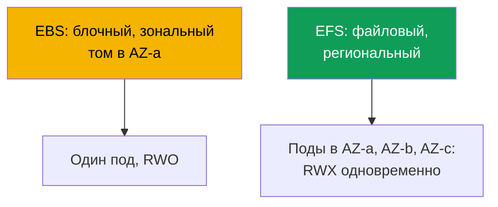
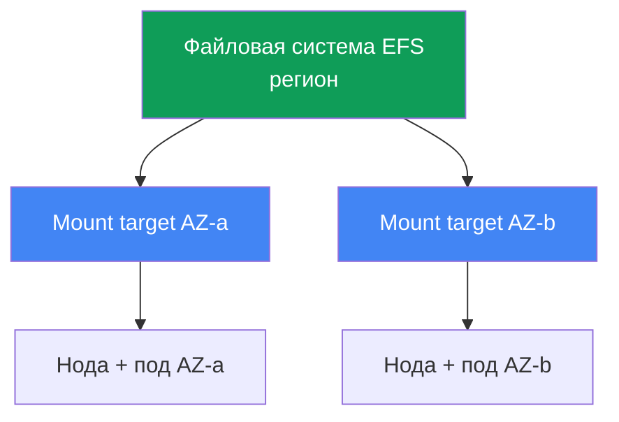

# Глава 24. EFS и FSx: shared storage для нагрузок между AZ

> **Что дальше.** Глава 23 показала, что EBS зональный: том в одной AZ, один писатель
> (ReadWriteOnce), под прибит к зоне. Эта глава - про противоположный класс задач: общий
> доступ на запись из многих подов (ReadWriteMany) и работу между AZ. Это EFS (управляемый
> NFS, регионален) и обзорно FSx. Роль CSI-драйвера - через IRSA или Pod Identity (главы
> 16-17), Mountpoint for Amazon S3 - глава 25, бэкап - глава 41, Fargate - глава 15. PV, PVC
> и access modes вы знаете с CKA; здесь специфика сетевого файлового доступа в EKS.

## 24.1. «Двум подам нужен один том, а EBS отдаёт его только одному»

Три сценария, где EBS из главы 23 упирается в стену, и все три ведут к одному решению.

Первый: нескольким подам нужно писать в один том одновременно (общий каталог загрузок,
воркеры на одном датасете). Пробуете подключить EBS-том к второй реплике:

```bash
kubectl describe pod uploader-1
# Events:
#   Warning  FailedAttachVolume  attachdetach-controller
#     Multi-Attach error for volume "pvc-..." Volume is already exclusively attached
#     to one node and can't be attached to another
```

`Multi-Attach error` - том EBS уже занят одной нодой. Режим `ReadWriteOnce` означает ровно
это: один узел, один писатель. Никакие настройки StorageClass это не меняют - ограничение
блочного устройства.

Второй сценарий: под должен переживать переезд между AZ. С EBS под прибит к зоне тома (глава
23), и если в его AZ нет ноды - под висит в `Pending`. Третий: Fargate-поду нужно постоянное
хранилище, а EBS на Fargate не монтируется вовсе (глава 15).

Общий корень у всех трёх - блочное устройство. EBS даёт блочный доступ: диск, привязанный к
одному инстансу в одной зоне. Нужен **сетевой файловый доступ** - файловая система, к которой
несколько нод и подов обращаются по сети одновременно, независимо от AZ. Это EFS.

## 24.2. EBS против EFS против FSx: блочное против файлового

Разница не в «быстрее-медленнее», а в самой модели доступа. EBS - это диск, который AWS
подключает к одному инстансу. EFS и FSx - это файловые серверы, к которым обращаются по сети
(NFS у EFS, NFS/SMB/Lustre у FSx), поэтому их видят много клиентов сразу и из разных зон.



| Свойство | EBS | EFS | FSx |
|---|---|---|---|
| Модель | блочное устройство | файловая (NFS) | файловая (NFS/SMB/Lustre) |
| Access modes | ReadWriteOnce | ReadWriteMany | RWX (зависит от типа) |
| Масштаб | одна AZ | регион, все AZ | зависит от типа |
| Между AZ | нет, том прибит к зоне | да, прозрачно | зависит от типа |
| Латентность | как локальный SSD | выше, это сеть | Lustre - очень низкая |
| Модель цены | за выделенный объём | за использованное место | за выделенную ёмкость |
| Когда | БД, single-writer | shared RWX, между AZ | HPC/ML, Windows/SMB |

Правило выбора грубо такое: нужен один быстрый писатель и производительность диска - EBS
(глава 23); нужен общий доступ на запись и работа между AZ - EFS; нужна специфика (Lustre для
HPC, SMB для Windows, фичи ONTAP) - FSx.

## 24.3. EFS предметно: региональный NFS

Amazon EFS - управляемая файловая система по протоколу NFS. Ключевое отличие от EBS в том,
что она **региональная**, а не зональная. Ёмкость эластична: место не выделяется заранее,
файловая система растёт и сжимается по мере записи и удаления данных.

Регион означает доступ из всех зон, но клиенту (ноде) нужна точка входа в его зоне. Этой
точкой служит **mount target** - сетевой интерфейс EFS внутри подсети конкретной AZ. Правило
простое: **один mount target на зону доступности** (для стандартной, не One Zone, файловой
системы). Нода из `eu-central-1a` монтирует EFS через mount target в `eu-central-1a`.



Отсюда главное свойство для эксплуатации: EFS **не привязан к зоне**. Под переезжает из AZ-a в
AZ-b (пересоздание, консолидация Karpenter, потеря зоны) и продолжает видеть те же данные -
он просто монтирует EFS через mount target новой зоны. Той боли, что была в главе 23 (`volume
node affinity conflict`), с EFS нет: PV на EFS не несёт `nodeAffinity` на зону. И режим
`ReadWriteMany` разрешает много подов на многих нодах писать в файловую систему одновременно.

Работу с EFS в кластере ведёт **aws-efs-csi-driver** с провизионером `efs.csi.aws.com`.
Ставится как managed addon:

```bash
aws eks create-addon --cluster-name demo --addon-name aws-efs-csi-driver \
  --service-account-role-arn arn:aws:iam::111122223333:role/eks-efs-csi-driver
```

Драйверу нужна IAM-роль: контроллер вызывает EFS API (создание и удаление access points,
чтение mount targets и зон). Роль выдаётся через IRSA или EKS Pod Identity (главы 16-17), её
ARN передают в `--service-account-role-arn`, а готовая managed-политика -
`AmazonEFSCSIDriverPolicy`. Без роли динамический провижининг падает с `AccessDenied` при
создании access point. Драйвер несовместим с Windows-образами контейнеров.

## 24.4. EFS provisioning: статический и динамический

У EFS два способа отдать под том, и они не такие, как у EBS. Сама файловая система EFS в обоих
случаях создаётся **заранее** (руками, через Terraform или консоль) - CSI-драйвер её не
создаёт, он работает поверх существующей по её `fileSystemId` (вида `fs-0123456789abcdef0`).

**Статический** провижининг - вы описываете PV вручную, указывая `fileSystemId` в
`volumeHandle`. Подходит, когда файловая система одна на всех и общий каталог устраивает. Это
единственный вариант на Fargate (24.7).

```yaml
apiVersion: v1
kind: PersistentVolume
metadata: {name: efs-shared}
spec:
  capacity: {storage: 5Gi}          # для EFS число условно, место эластично
  accessModes: ["ReadWriteMany"]
  persistentVolumeReclaimPolicy: Retain
  storageClassName: efs-sc
  mountOptions: ["tls"]             # шифрование NFS-трафика in-transit, держать всегда
  csi:
    driver: efs.csi.aws.com
    volumeHandle: fs-0123456789abcdef0
```

**Динамический** провижининг - StorageClass с `provisioningMode: efs-ap`, и на каждый PVC
драйвер создаёт **access point** внутри одной файловой системы. Access point - это вход в
свой подкаталог со своими правами и POSIX-идентичностью, то есть механизм изоляции: разные
PVC получают разные каталоги в одной EFS и не видят чужие данные.

```yaml
apiVersion: storage.k8s.io/v1
kind: StorageClass
metadata: {name: efs-sc}
provisioner: efs.csi.aws.com
parameters:
  provisioningMode: efs-ap
  fileSystemId: fs-0123456789abcdef0
  directoryPerms: "755"          # права root-каталога access point
  uid: "1000"                    # OwnerUid access point root dir (не-root)
  gid: "1000"                    # OwnerGid; gidRange не используется при заданных uid/gid
  basePath: "/dynamic"           # корень под каталоги access points
mountOptions: ["tls"]            # in-transit шифрование и в динамическом пути тоже
```

Параметры `uid`, `gid` и `directoryPerms` драйвер применяет к корневому каталогу access
point - это его `creationInfo` (`OwnerUid`, `OwnerGid`, `Permissions`). Задавайте не-root
владельца и права `0755`: иначе поды с `runAsNonRoot` упадут на `Permission Denied` при
первой записи, потому что корень каталога окажется во владении чужой идентичности.

PVC под этот класс - обычный, но с `ReadWriteMany`:

```yaml
apiVersion: v1
kind: PersistentVolumeClaim
metadata: {name: shared-data}
spec:
  storageClassName: efs-sc
  accessModes: ["ReadWriteMany"]
  resources:
    requests: {storage: 5Gi}
```

| Свойство | Статический | Динамический (`efs-ap`) |
|---|---|---|
| Файловая система EFS | создаёте заранее | создаёте заранее |
| PV | пишете руками | создаёт драйвер |
| Единица выдачи | вся ФС или каталог | access point на PVC |
| Изоляция каталогов | своими руками | через access points |
| На Fargate | да | нет (24.7) |

Обратите внимание: `storage: 5Gi` в PVC для EFS - величина условная. Место эластично и не
предвыделяется, квота по размеру не применяется так, как у EBS; число нужно формально, чтобы
удовлетворить схему PVC.

## 24.5. Нюансы EFS: производительность, шифрование, стоимость

EFS - это сетевая файловая система, а не локальный диск, и это определяет её профиль.
Латентность выше, чем у EBS: каждый запрос идёт по сети до mount target и обратно. Для
потоковой работы с крупными файлами это незаметно, для тысяч мелких синхронных операций -
чувствительно.

Отсюда следствие, которое стоит усвоить сразу: **EFS не для низколатентных баз данных**.
Ставить PostgreSQL или MySQL на EFS - антипаттерн: СУБД делает много мелких синхронных
записей, и сетевая ФС их замедляет, а блокировки NFS ведут себя не как локальный диск. Для БД
- зональный EBS с single-writer (глава 23). EFS хороша там, где ценен именно общий доступ:
статические ассеты и media, общие конфиги, датасеты для ML, каталоги, куда пишут несколько
воркеров.

Пропускная способность настраивается **режимом throughput** файловой системы:

| Режим throughput | Как работает | Когда |
|---|---|---|
| Elastic | масштабируется автоматически под нагрузку | непредсказуемый или редкий доступ |
| Bursting | растёт с объёмом данных, копит кредиты | ровная нагрузка, пропорциональная объёму |
| Provisioned | фиксированная величина независимо от объёма | нужен потолок выше, чем даёт Bursting |

Шифрование: **at-rest** включается при создании файловой системы (ключ KMS) и потом не
меняется. **In-transit** (TLS) включается на стороне клиента - у EFS CSI-драйвера это делается
опцией монтирования `tls`, и её стоит держать включённой всегда, чтобы трафик NFS между нодой
и mount target шёл шифрованным.

Стоимость EFS устроена иначе, чем у EBS. Платите за **фактически использованное место** (без
предвыделения тома) плюс за пропускную способность в зависимости от режима throughput. Это
меняет мышление: с EBS вы платите за выделенный размер тома, даже пустого; с EFS - за то, что
реально лежит в файловой системе.

## 24.6. FSx кратко: когда EFS не подходит

EFS покрывает общий NFS-доступ на Linux. Когда нужны другой протокол или экстремальная
пропускная - это семейство **Amazon FSx**, четыре разных файловых сервиса, у каждого свой
CSI-драйвер. Здесь только обзор, чтобы знать, куда смотреть.

| FSx | Протокол | Профиль | Когда вместо EFS |
|---|---|---|---|
| FSx for Lustre | Lustre | HPC, ML, очень высокая пропускная | тренировки ML, интеграция с S3 |
| FSx for Windows File Server | SMB | доменные Windows-нагрузки | контейнеры Windows, SMB |
| FSx for NetApp ONTAP | NFS/SMB/iSCSI | фичи ONTAP (снапшоты, дедуп) | нужны возможности ONTAP |
| FSx for OpenZFS | NFS | ZFS, снапшоты, низкая латентность | ZFS-семантика, latency |

Самый частый в контексте EKS - **FSx for Lustre**: параллельная файловая система для ML и HPC
с очень высокой пропускной способностью и связкой с S3 (датасет лежит в S3, Lustre даёт по
нему быстрый POSIX-доступ). Драйвер - отдельный аддон `aws-fsx-csi-driver`. **Windows/SMB** -
единственный вариант, когда нужен общий том для контейнеров Windows: EFS их не поддерживает.
Глубже FSx в этом курсе не разбирается - для 90% задач общего хранилища между AZ достаточно
EFS.

## 24.7. Fargate и EFS

На Fargate (глава 15) нет узлов, которыми вы управляете, и **EBS туда не монтируется**.
Единственное постоянное хранилище для Fargate-подов - EFS. Это делает связку Fargate + EFS
штатным паттерном для stateful-нагрузок без нод.

Две особенности. Первая: на Fargate работает только **статический** провижининг (24.4);
динамический через access points на Fargate не поддерживается. Вторая: драйвер на Fargate
**не ставится DaemonSet-ом** - на Fargate DaemonSet вообще не запускается (глава 15), и
монтирование EFS встроено в саму платформу. Под с Fargate автоматически монтирует EFS без
установки компонентов драйвера: достаточно PV со статической ссылкой на `fileSystemId` и PVC.

## 24.8. Диагностика: под не монтирует EFS

Симптом обычно один - под застревает в `ContainerCreating`, а в событиях висит таймаут
монтирования:

```bash
kubectl describe pod app-0
# Events:
#   Warning  FailedMount  kubelet
#     Unable to attach or mount volumes: unmounted volumes=[data]:
#     timed out waiting for the condition
```

В отличие от EBS, где боль зональная, у EFS почти всё сводится к сети и правам доступа. Порядок
проверки:

| Симптом | Причина | Что проверить |
|---|---|---|
| `FailedMount`, таймаут | SG mount target не пускает NFS | inbound 2049 с SG нод |
| Нет mount target в AZ пода | ФС без mount target в этой зоне | `aws efs describe-mount-targets` |
| `AccessDenied` на access point | нет роли у драйвера | роль IRSA/Pod Identity, политика |
| Не резолвится имя ФС | DNS в VPC | резолвинг `fs-...efs.<region>...` |
| Соединение рвётся при TLS | опция `tls` и порт | проверить mount options |

Самая частая причина - **security group mount target**. NFS работает по порту **2049**, и в SG
mount target должно быть правило inbound на 2049 от SG узлов кластера. Нет правила - монтаж
виснет по таймауту. Проверяют mount targets так:

```bash
# есть ли mount target в каждой зоне нод и в каком он состоянии
aws efs describe-mount-targets --file-system-id fs-0123456789abcdef0 \
  --query 'MountTargets[].{AZ:AvailabilityZoneName,State:LifeCycleState,IP:IpAddress}'
```

Дальше по списку: mount target существует в **каждой** зоне, где есть ноды с этим подом (нет
target в зоне пода - монтаж невозможен); у драйвера есть роль с `AmazonEFSCSIDriverPolicy`;
имя файловой системы резолвится в VPC (нужен DNS resolution); при in-transit шифровании
включена опция `tls`.

Отдельный класс проблем - **зависшие NFS-блокировки**. Приложение, берущее файловый lock
через `flock`/`lockf`, держит его как lock state на стороне NFSv4, причём все блокировки на
EFS **advisory**: их учитывает лишь тот, кто сам проверяет lock, запись ядро не запрещает. При
аварийном рестарте (`kill -9`, OOM, жёсткое выселение) под гибнет, не сняв блокировку, а
корректного освобождения при таком завершении нет. NFSv4 держит lock, пока не истечёт lease
клиента-владельца: живой клиент продлевает lease, исчезнувший - нет, и лишь по его истечении
сервер снимает блокировку. Симптом: новый под запускается, но виснет на попытке взять тот же
lock, потому что старая блокировка на EFS какое-то время ещё числится занятой. Смягчение:
делать graceful shutdown, чтобы приложение само снимало lock перед выходом; при перезапуске
дать lease истечь, а не долбить lock в цикле; держать single-writer паттерн, когда в каталог на
shared EFS пишет только один под; проектировать приложение без файловых блокировок на EFS -
координацию выносить наружу (БД, распределённый lock), а не в сетевую ФС.

## 24.9. Как это применяют в продакшене

- **EFS для RWX и между AZ.** Общий доступ на запись из многих подов и работа поверх зон -
  профиль EFS. Single-writer и производительность диска оставляют на EBS (глава 23).
- **Access points для изоляции.** Динамический `efs-ap` даёт каждому PVC свой каталог с
  правами и POSIX-идентичностью; одна файловая система обслуживает много нагрузок безопасно.
- **In-transit шифрование по умолчанию.** Опция `tls` включена всегда; at-rest - при создании
  файловой системы с ключом KMS.
- **Не для баз данных.** EFS под media, ассеты, конфиги, ML-датасеты, общие каталоги. СУБД -
  зональный EBS, латентность сетевой ФС для них яд.
- **Mount target в каждой зоне.** Файловая система должна иметь mount target во всех AZ, где
  живут ноды; SG mount target пускает 2049 от SG узлов.
- **FSx под специфику.** Lustre для ML/HPC-пропускной со связкой с S3, Windows File Server для
  SMB и контейнеров Windows, ONTAP - под свои фичи. Для общего NFS достаточно EFS.

## 24.10. Мини-глоссарий

- **EFS** - Amazon Elastic File System, управляемый региональный NFS с эластичной ёмкостью и
  режимом ReadWriteMany.
- **EFS CSI-драйвер** - `aws-efs-csi-driver`, managed addon с провизионером `efs.csi.aws.com`;
  работает поверх заранее созданной файловой системы.
- **mount target** - сетевой интерфейс EFS в подсети конкретной AZ; точка входа для нод этой
  зоны, по одному на зону доступности.
- **access point** - вход в подкаталог EFS со своими правами и POSIX-идентичностью; основа
  динамического провижининга и изоляции каталогов.
- **provisioningMode: efs-ap** - режим StorageClass, при котором драйвер создаёт access point
  на каждый PVC.
- **throughput mode** - режим пропускной способности EFS: Elastic, Bursting или Provisioned.
- **ReadWriteMany (RWX)** - access mode: том монтируется на запись многими подами на многих
  нодах одновременно.

## 24.11. Итоги главы

- EBS упирается в стену там, где нужен общий доступ на запись (RWO, `Multi-Attach error`),
  переезд между AZ или хранилище на Fargate. Ответ на все три - сетевой файловый доступ, EFS.
- EFS регионален: доступ из всех зон через mount target в каждой AZ (по одному на зону). Под
  переезжает между AZ и продолжает видеть данные; `volume node affinity conflict` (глава 23)
  для EFS нет, а `ReadWriteMany` разрешает многих писателей.
- Работу ведёт `efs.csi.aws.com` (managed addon `aws-efs-csi-driver`) с ролью через IRSA/Pod
  Identity (главы 16-17) и политикой `AmazonEFSCSIDriverPolicy`. Файловая система создаётся
  заранее, драйвер работает поверх неё по `fileSystemId`.
- Провижининг статический (PV руками на `fileSystemId`) или динамический (`provisioningMode:
  efs-ap`, access point на каждый PVC для изоляции каталогов и UID).
- EFS - сетевая ФС: латентность выше EBS, не для низколатентных БД; хороша для media, ассетов,
  конфигов, ML-датасетов. Throughput - Elastic/Bursting/Provisioned; шифрование at-rest (KMS)
  и in-transit (`tls`). Платите за использованное место плюс throughput.
- FSx - для специфики: Lustre (HPC/ML, связка с S3), Windows File Server (SMB), ONTAP,
  OpenZFS; свои CSI-драйверы. Для общего NFS между AZ достаточно EFS.
- На Fargate EBS не монтируется, EFS - единственное постоянное хранилище; только статический
  провижининг, монтирование встроено в платформу, без DaemonSet.
- Диагностика монтажа: SG mount target на порт 2049 от SG нод, наличие mount target в зоне
  пода, роль драйвера, DNS-резолвинг, опция `tls`.

## 24.12. Как это пригодится в реальной работе

На дежурстве EFS-инциденты почти всегда про сеть и права, а не про зоны. Под завис в
`ContainerCreating` с `FailedMount` - первым делом `aws efs describe-mount-targets`: есть ли
target в зоне пода и открыт ли порт 2049 в его SG от узлов. Это закрывает большинство случаев.
При проектировании держите в голове разграничение из главы 23: EBS для одного быстрого
писателя и производительности, EFS для общего доступа и работы между AZ, и никогда не кладите
СУБД на сетевую ФС. Когда приходит нагрузка на Fargate со stateful-требованием, вспоминайте,
что выбор там ровно один - статический EFS. А если инженеры просят «файловый сторедж как в
дата-центре» с SMB или с пропускной для ML - это уже территория FSx, и стоит сравнить Lustre и
Windows File Server до того, как городить обходные пути на EFS.

## 24.13. Вопросы для самопроверки

1. Почему EBS-том нельзя подключить к двум подам сразу и как выглядит эта ошибка?
2. Чем блочный доступ (EBS) отличается от файлового (EFS) с точки зрения числа клиентов?
3. Почему EFS называют региональным, а EBS зональным, и что такое mount target?
4. Сколько mount targets нужно и почему под на EFS переживает переезд между AZ?
5. Зачем EFS CSI-драйверу IAM-роль и какая managed-политика ему нужна?
6. Чем статический провижининг EFS отличается от динамического через `efs-ap`?
7. Что такое access point и как он обеспечивает изоляцию каталогов и UID?
8. Почему EFS не стоит использовать под базы данных и для чего он хорош?
9. Какие есть режимы throughput у EFS и чем отличается модель стоимости от EBS?
10. Как включается шифрование at-rest и in-transit у EFS?
11. Почему на Fargate доступен только статический провижининг и не нужен DaemonSet?
12. Под виснет с `FailedMount` на EFS - какие причины проверяете и в каком порядке?
13. Когда нужен FSx вместо EFS и какой из вариантов FSx под ML и под Windows?

## Практика

Своей лабы у главы пока нет, но всё проверяется на живом кластере. Убедитесь, что стоит EFS
CSI-драйвер: `aws eks list-addons --cluster-name <cluster>` и `kubectl get pods -n kube-system
| grep efs-csi`. Посмотрите на существующую файловую систему: `aws efs
describe-file-systems`, затем `aws efs describe-mount-targets --file-system-id fs-...` - есть
ли mount target в каждой зоне ваших нод и в состоянии `available`.

Дальше воспроизведите RWX: создайте StorageClass с `provisioningMode: efs-ap` и вашим
`fileSystemId`, поднимите Deployment на 2-3 реплики в разных AZ с одним PVC на `ReadWriteMany`
и убедитесь, что все реплики пишут в общий каталог одновременно (чего EBS не позволяет).
Проверьте `kubectl get pv -o yaml` - в отличие от EBS, у PV на EFS нет `nodeAffinity` на зону.
Затем сломайте монтаж намеренно: уберите из SG mount target правило на порт 2049, пересоздайте
под и найдите `FailedMount` в `kubectl describe pod`; верните правило и убедитесь, что монтаж
проходит. Если есть доступ к Fargate-профилю, повторите со статическим PV на `fileSystemId` и
сравните, что EBS в Fargate-под подключить нельзя, а EFS монтируется без DaemonSet.

---
[Оглавление](../README_RU.md) · [Глава 23](../23/ru.md) · [Глава 25](../25/ru.md)
