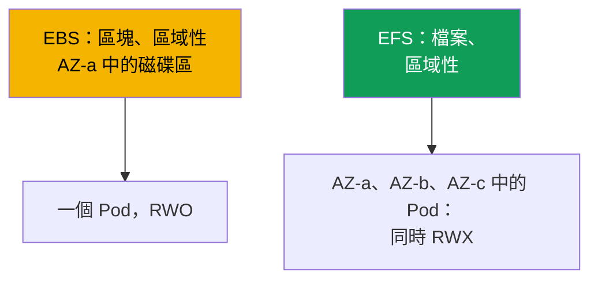
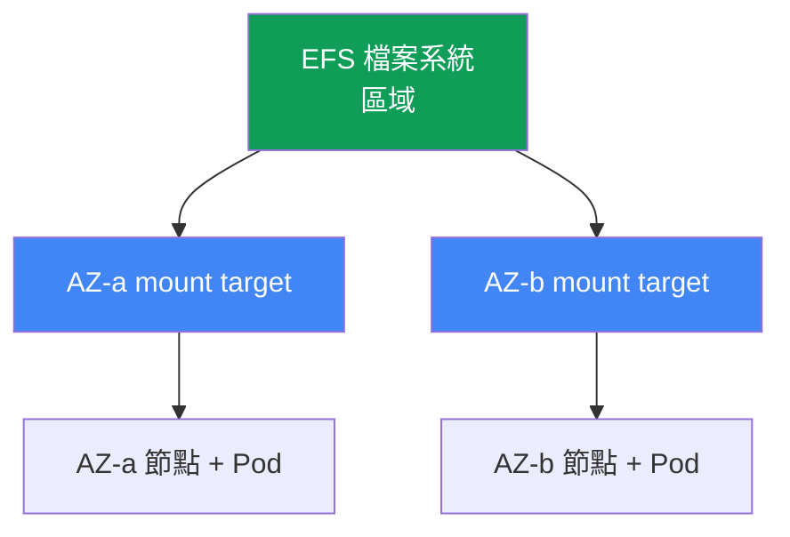

[Русская версия](ru.md) · [Eng version](en.md) · [Versión en español](es.md) · [Version française](fr.md) · [Deutsche Version](de.md) · [ქართული ვერსია](ge.md) · [日本語版](jp.md)
# 第 24 章。EFS 與 FSx：跨 AZ 工作負載的共用儲存

> **接下來。** 第 23 章說明 EBS 是區域性的：磁碟區位於一個 AZ、一個寫入者
> (ReadWriteOnce)，Pod 也綁定該區。本章討論相反類型的任務：多個 Pod 的共用寫入
> 存取 (ReadWriteMany) 以及跨 AZ 運作。這就是 EFS（受管、區域性的 NFS）與 FSx 的
> 概覽。CSI 驅動程式的角色透過 IRSA 或 Pod Identity（第 16-17 章）提供，Mountpoint
> for Amazon S3 請見第 25 章，備份請見第 41 章，Fargate 請見第 15 章。您從 CKA 已
> 了解 PV、PVC 與 access modes；本章介紹 EKS 中網路檔案存取的特性。

## 24.1.「兩個 Pod 需要一個磁碟區，但 EBS 只交給其中一個」

第 23 章的 EBS 有三種情境會碰壁，三者都導向相同的解決方案。

第一種：多個 Pod 必須同時寫入同一個磁碟區（共用上傳目錄、處理同一資料集的
worker）。您嘗試把 EBS 磁碟區連接到第二個副本：

```bash
kubectl describe pod uploader-1
# Events:
#   Warning  FailedAttachVolume  attachdetach-controller
#     Multi-Attach error for volume "pvc-..." Volume is already exclusively attached
#     to one node and can't be attached to another
```

`Multi-Attach error` 表示 EBS 磁碟區已被一個節點占用。`ReadWriteOnce` 模式的意思正是
如此：一個節點、一個寫入者。無論 StorageClass 如何設定都無法改變，這是區塊裝置的限制。

第二種情境：Pod 必須能在 AZ 間遷移後繼續運作。使用 EBS 時，Pod 綁定磁碟區所在的區域
（第 23 章），若該 AZ 沒有節點，Pod 便會停在 `Pending`。第三種：Fargate Pod 需要持久
儲存，但 EBS 根本無法掛載到 Fargate（第 15 章）。

三者共同的根源都是區塊裝置。EBS 提供區塊存取：一個連接到一個 AZ 中單一執行個體的磁碟。
需要的是**網路檔案存取**：多個節點與 Pod 可透過網路同時存取的檔案系統，且不受 AZ 限制。
這就是 EFS。

## 24.2. EBS 與 EFS 與 FSx：區塊與檔案的對比

差異不在於「較快或較慢」，而在於存取模型本身。EBS 是 AWS 連接到一個執行個體的磁碟。
EFS 與 FSx 是經由網路存取的檔案伺服器（EFS 使用 NFS，FSx 使用 NFS/SMB/Lustre），因此
許多客戶端能從不同區域同時看見它們。



| 屬性 | EBS | EFS | FSx |
|---|---|---|---|
| 模型 | 區塊裝置 | 檔案 (NFS) | 檔案 (NFS/SMB/Lustre) |
| Access modes | ReadWriteOnce | ReadWriteMany | RWX（取決於類型） |
| 規模 | 一個 AZ | 區域，所有 AZ | 取決於類型 |
| 跨 AZ | 否，磁碟區綁定區域 | 是，透明運作 | 取決於類型 |
| 延遲 | 如本機 SSD | 較高，因為是網路 | Lustre 非常低 |
| 定價模型 | 按佈建容量 | 按已使用空間 | 按佈建容量 |
| 適用時機 | 資料庫、single-writer | 共用 RWX、跨 AZ | HPC/ML、Windows/SMB |

選擇原則大致如下：需要一個快速的寫入者與磁碟效能時，使用 EBS（第 23 章）；需要共用寫入
存取與跨 AZ 運作時，使用 EFS；需要特定功能時（HPC 使用 Lustre、Windows 使用 SMB、ONTAP
功能），使用 FSx。

## 24.3. EFS 詳解：區域性的 NFS

Amazon EFS 是以 NFS 通訊協定提供的受管檔案系統。它與 EBS 的關鍵差異在於其為**區域性**，
而非區域性。容量具彈性：不需預先配置空間，檔案系統會隨資料寫入與刪除而擴縮。

區域性表示可從所有區域存取，但客戶端（節點）在其所在區域需要一個進入點。該進入點是
**mount target**，也就是位於特定 AZ 子網路內的 EFS 網路介面。規則很簡單：**每個可用區一個
mount target**（適用於標準、非 One Zone 的檔案系統）。`eu-central-1a` 的節點透過
`eu-central-1a` 中的 mount target 掛載 EFS。



由此而來的是重要的營運特性：EFS **不綁定區域**。Pod 從 AZ-a 移至 AZ-b（重新建立、Karpenter
整併、區域故障）後，仍能看見相同資料，它只會透過新區域的 mount target 掛載 EFS。不會有
第 23 章的痛點（`volume node affinity conflict`）：EFS 上的 PV 不帶有區域的 `nodeAffinity`。
而 `ReadWriteMany` 模式允許許多節點上的許多 Pod 同時寫入檔案系統。

叢集中 EFS 的操作由帶有 provisioner `efs.csi.aws.com` 的 **aws-efs-csi-driver** 負責。
它以 managed addon 安裝：

```bash
aws eks create-addon --cluster-name demo --addon-name aws-efs-csi-driver \
  --service-account-role-arn arn:aws:iam::111122223333:role/eks-efs-csi-driver
```

驅動程式需要 IAM 角色：控制器會呼叫 EFS API（建立與刪除 access points、讀取 mount targets
與區域）。角色透過 IRSA 或 EKS Pod Identity（第 16-17 章）授予，其 ARN 傳入
`--service-account-role-arn`，現成的 managed policy 是 `AmazonEFSCSIDriverPolicy`。沒有角色時，
動態佈建會在建立 access point 時因 `AccessDenied` 失敗。該驅動程式不支援 Windows 容器映像。

## 24.4. EFS provisioning：靜態與動態

EFS 有兩種將磁碟區提供給 Pod 的方式，與 EBS 的方式不同。兩種情況下，EFS 檔案系統本身都
必須**預先**建立（手動、透過 Terraform 或主控台），CSI 驅動程式不會建立它，而是透過其
`fileSystemId`（格式為 `fs-0123456789abcdef0`）在既有檔案系統上操作。

**靜態** provisioning 表示您手動描述 PV，並在 `volumeHandle` 指定 `fileSystemId`。它適用於
所有人共用一個檔案系統，且共用目錄已足夠的情況。這是 Fargate 上唯一可用的選項（24.7）。

```yaml
apiVersion: v1
kind: PersistentVolume
metadata: {name: efs-shared}
spec:
  capacity: {storage: 5Gi}          # EFS 的數字僅為形式，空間具彈性
  accessModes: ["ReadWriteMany"]
  persistentVolumeReclaimPolicy: Retain
  storageClassName: efs-sc
  mountOptions: ["tls"]             # 對傳輸中的 NFS 流量加密，應始終保留
  csi:
    driver: efs.csi.aws.com
    volumeHandle: fs-0123456789abcdef0
```

**動態** provisioning 使用帶有 `provisioningMode: efs-ap` 的 StorageClass，驅動程式會在一個
檔案系統內為每個 PVC 建立一個 **access point**。access point 是通往其專屬子目錄的入口，具備
自己的權限與 POSIX 身分，因此是一種隔離機制：不同 PVC 在同一 EFS 中取得不同目錄，且無法
看見彼此的資料。

```yaml
apiVersion: storage.k8s.io/v1
kind: StorageClass
metadata: {name: efs-sc}
provisioner: efs.csi.aws.com
parameters:
  provisioningMode: efs-ap
  fileSystemId: fs-0123456789abcdef0
  directoryPerms: "755"          # access point root 目錄的權限
  uid: "1000"                    # access point root dir 的 OwnerUid（非 root）
  gid: "1000"                    # OwnerGid；設定 uid/gid 時不使用 gidRange
  basePath: "/dynamic"           # access points 目錄下的根目錄
mountOptions: ["tls"]            # 動態路徑也應使用傳輸中加密
```

驅動程式會將 `uid`、`gid` 與 `directoryPerms` 套用至 access point 的根目錄，這就是其
`creationInfo`（`OwnerUid`、`OwnerGid`、`Permissions`）。請設定非 root 擁有者與 `0755` 權限：
否則在第一次寫入時，帶有 `runAsNonRoot` 的 Pod 會因 `Permission Denied` 失敗，因為目錄根目錄
將由另一個身分擁有。

此類別的 PVC 很一般，但使用 `ReadWriteMany`：

```yaml
apiVersion: v1
kind: PersistentVolumeClaim
metadata: {name: shared-data}
spec:
  storageClassName: efs-sc
  accessModes: ["ReadWriteMany"]
  resources:
    requests: {storage: 5Gi}
```

| 屬性 | 靜態 | 動態 (`efs-ap`) |
|---|---|---|
| EFS 檔案系統 | 預先建立 | 預先建立 |
| PV | 手動撰寫 | 由驅動程式建立 |
| 提供單位 | 整個檔案系統或目錄 | 每個 PVC 一個 access point |
| 目錄隔離 | 自行處理 | 透過 access points |
| 在 Fargate 上 | 是 | 否 (24.7) |

請注意：EFS 的 PVC 中 `storage: 5Gi` 是名義數值。空間具彈性且不會預先配置，大小配額的套用
方式不像 EBS；該數字僅是為了正式滿足 PVC schema。

## 24.5. EFS 細節：效能、加密、成本

EFS 是網路檔案系統，不是本機磁碟，這決定了它的特性。延遲高於 EBS：每個請求都要經由網路
前往 mount target 再返回。對大型檔案的串流工作並不明顯，對數千個小型同步操作則很明顯。

因此有一個應立刻理解的結論：**EFS 不適合低延遲資料庫**。在 EFS 上部署 PostgreSQL 或 MySQL
是反模式：DBMS 會進行許多小型同步寫入，網路檔案系統會使它們變慢，而且 NFS 鎖定的行為不同於
本機磁碟。資料庫應使用具 single-writer 的區域性 EBS（第 23 章）。EFS 適合重視共用存取的地方：
靜態資產與媒體、共用設定、ML 資料集，以及多個 worker 寫入的目錄。

檔案系統的**throughput mode** 用來設定吞吐量：

| Throughput mode | 運作方式 | 適用時機 |
|---|---|---|
| Elastic | 隨負載自動擴展 | 不可預測或不常發生的存取 |
| Bursting | 隨資料量增加，累積 credits | 穩定且與容量成比例的負載 |
| Provisioned | 與容量無關的固定數值 | 需要超過 Bursting 所提供的上限 |

加密：**at-rest** 在建立檔案系統時啟用（KMS 金鑰），之後無法變更。**In-transit** (TLS) 在客戶端
啟用，對 EFS CSI 驅動程式而言是使用 `tls` 掛載選項，而且應始終啟用，讓節點與 mount target
之間的 NFS 流量受到加密。

EFS 的成本結構與 EBS 不同。您支付的是**實際使用的空間**（不預先配置磁碟區）加上依
throughput mode 而定的吞吐量費用。這改變了思維方式：使用 EBS 時，您為配置的磁碟區大小付費，
即使它是空的；使用 EFS 時，您為檔案系統實際存放的內容付費。

## 24.6. FSx 簡介：EFS 不合適時

EFS 涵蓋 Linux 上的共用 NFS 存取。若需要其他通訊協定或極高的吞吐量，則使用 **Amazon FSx**
系列，它由四種不同的檔案服務組成，每種都有自己的 CSI 驅動程式。此處僅作概覽，以便知道該往
何處查看。

| FSx | 通訊協定 | 特性 | 何時取代 EFS |
|---|---|---|---|
| FSx for Lustre | Lustre | HPC、ML、極高吞吐量 | ML 訓練、與 S3 整合 |
| FSx for Windows File Server | SMB | 網域中的 Windows 工作負載 | Windows 容器、SMB |
| FSx for NetApp ONTAP | NFS/SMB/iSCSI | ONTAP 功能（快照、重複資料刪除） | 需要 ONTAP 功能 |
| FSx for OpenZFS | NFS | ZFS、快照、低延遲 | ZFS 語意、latency |

在 EKS 情境中最常見的是 **FSx for Lustre**：為 ML 與 HPC 提供非常高吞吐量的平行檔案系統，
並可與 S3 整合（資料集位於 S3，Lustre 為其提供快速 POSIX 存取）。其驅動程式是獨立的
`aws-fsx-csi-driver` addon。**Windows/SMB** 是 Windows 容器需要共用磁碟區時的唯一選項：EFS
不支援它們。本課程不會深入介紹 FSx，因為 EFS 足以涵蓋 90% 跨 AZ 共用儲存的任務。

## 24.7. Fargate 與 EFS

Fargate（第 15 章）沒有您可管理的節點，且**無法在其上掛載 EBS**。Fargate Pod 唯一的持久性
儲存是 EFS。這使 Fargate + EFS 成為無需節點的 stateful 工作負載的標準模式。

有兩項特性。第一，在 Fargate 上只有**靜態** provisioning 可用（24.4），不支援透過 access
points 的動態 provisioning。第二，Fargate 上的驅動程式**不以 DaemonSet 安裝**，因為 Fargate
根本不執行 DaemonSet（第 15 章），而 EFS 掛載功能已內建於平台本身。Fargate Pod 無需安裝驅動
程式元件即可自動掛載 EFS：只需帶有靜態 `fileSystemId` 參照的 PV 與 PVC。

## 24.8. 診斷：Pod 無法掛載 EFS

症狀通常只有一個：Pod 卡在 `ContainerCreating`，事件顯示掛載逾時：

```bash
kubectl describe pod app-0
# Events:
#   Warning  FailedMount  kubelet
#     Unable to attach or mount volumes: unmounted volumes=[data]:
#     timed out waiting for the condition
```

不同於 EBS 的區域性問題，EFS 幾乎都歸結於網路與存取權限。檢查順序如下：

| 症狀 | 原因 | 應檢查事項 |
|---|---|---|
| `FailedMount`、逾時 | mount target 的 SG 不允許 NFS | 從節點 SG 的 inbound 2049 |
| Pod 的 AZ 中沒有 mount target | 該區域的檔案系統沒有 mount target | `aws efs describe-mount-targets` |
| access point 上的 `AccessDenied` | 驅動程式沒有角色 | IRSA/Pod Identity 角色、policy |
| 無法解析檔案系統名稱 | VPC 中的 DNS | `fs-...efs.<region>...` 的解析 |
| TLS 連線中斷 | `tls` 選項與連接埠 | 檢查 mount options |

最常見原因是 **mount target security group**。NFS 使用 **2049** 連接埠，mount target 的 SG 必須有
一條允許叢集節點 SG 連入 2049 的 inbound 規則。沒有此規則時，掛載就會逾時。可如下檢查 mount
 targets：

```bash
# 每個節點區域中是否都有 mount target，以及其狀態為何
aws efs describe-mount-targets --file-system-id fs-0123456789abcdef0 \
  --query 'MountTargets[].{AZ:AvailabilityZoneName,State:LifeCycleState,IP:IpAddress}'
```

接著依序檢查：此 Pod 所在的**每個**區域都有 mount target（Pod 區域沒有 target 就無法掛載）；
驅動程式有帶 `AmazonEFSCSIDriverPolicy` 的角色；檔案系統名稱可在 VPC 中解析（需要 DNS
resolution）；使用傳輸中加密時已啟用 `tls` 選項。

另一類問題是**卡住的 NFS locks**。透過 `flock`/`lockf` 取得檔案 lock 的應用程式，會將其保留為
NFSv4 端的 lock state，且 EFS 中所有鎖定都是 **advisory**：只有主動檢查 lock 的程式才會遵守，
核心不會禁止寫入。若發生異常重啟（`kill -9`、OOM、強制驅逐），Pod 死亡時未釋放 lock，這種
終止方式也無法正確釋放。NFSv4 會持有 lock 直到用戶端擁有者的 lease 到期：仍存活的用戶端會
續租，消失的用戶端則不會，伺服器僅在其到期後才釋放 lock。症狀是：新的 Pod 已啟動，卻卡在
嘗試取得同一 lock，因為 EFS 上的舊 lock 暫時仍標示為已占用。緩解方法：進行 graceful shutdown，
讓應用程式在結束前自行釋放 lock；重啟時讓 lease 到期，而不是循環猛試 lock；採用 single-writer
模式，讓 shared EFS 上一個目錄只有一個 Pod 寫入；將應用程式設計為不在 EFS 上使用檔案鎖定，
把協調工作移到外部（資料庫、distributed lock），而非網路檔案系統。

## 24.9. 在 production 中的使用方式

- **將 EFS 用於 RWX 與跨 AZ。** 從許多 Pod 共用寫入存取並跨區域運作，是 EFS 的適用情境。
  single-writer 與磁碟效能則保留給 EBS（第 23 章）。
- **使用 access points 進行隔離。** 動態 `efs-ap` 為每個 PVC 提供有權限與 POSIX 身分的專屬
  目錄；一個檔案系統可安全地服務許多工作負載。
- **預設使用 in-transit 加密。** 一律啟用 `tls` 選項；at-rest 加密則在建立檔案系統時以 KMS 金鑰
  啟用。
- **不用於資料庫。** EFS 適用於媒體、資產、設定、ML 資料集與共用目錄。DBMS 應使用區域性 EBS，
  網路檔案系統的延遲對它們是毒藥。
- **每個區域都要有 mount target。** 檔案系統必須在節點所在的所有 AZ 都有 mount target；mount
  target 的 SG 允許來自節點 SG 的 2049。
- **FSx 用於特定需求。** Lustre 適用於與 S3 整合的 ML/HPC 吞吐量，Windows File Server 適用於
  SMB 與 Windows 容器，ONTAP 適用於其專屬功能。共用 NFS 使用 EFS 即可。

## 24.10. 迷你詞彙表

- **EFS**：Amazon Elastic File System，具彈性容量與 ReadWriteMany 模式的受管區域性 NFS。
- **EFS CSI 驅動程式**：`aws-efs-csi-driver`，以 provisioner `efs.csi.aws.com` 提供的 managed addon；
  在預先建立的檔案系統上運作。
- **mount target**：位於特定 AZ 子網路內的 EFS 網路介面；該區域節點的進入點，每個可用區一個。
- **access point**：通往具專屬權限與 POSIX 身分的 EFS 子目錄的入口；是動態 provisioning 與目錄
  隔離的基礎。
- **provisioningMode: efs-ap**：StorageClass 模式，驅動程式會為每個 PVC 建立 access point。
- **throughput mode**：EFS 吞吐量模式：Elastic、Bursting 或 Provisioned。
- **ReadWriteMany (RWX)**：access mode：磁碟區可同時掛載給許多節點上的許多 Pod 進行寫入。

## 24.11. 本章總結

- EBS 在需要共用寫入存取（RWO、`Multi-Attach error`）、跨 AZ 遷移或 Fargate 儲存時會碰壁。
  三者的答案都是網路檔案存取 EFS。
- EFS 是區域性的：可透過每個 AZ 的 mount target 存取所有區域（每個區域一個）。Pod 可跨 AZ
  遷移並繼續看見資料；EFS 不會有 `volume node affinity conflict`（第 23 章），且
  `ReadWriteMany` 允許多個寫入者。
- 操作由 `efs.csi.aws.com`（managed addon `aws-efs-csi-driver`）處理，角色透過 IRSA/Pod Identity
  （第 16-17 章）以及 `AmazonEFSCSIDriverPolicy` 提供。檔案系統需預先建立，驅動程式使用其
  `fileSystemId` 在其上操作。
- Provisioning 可為靜態（手動將 PV 指向 `fileSystemId`），也可為動態（`provisioningMode:
  efs-ap`，每個 PVC 一個 access point，用於目錄與 UID 隔離）。
- EFS 是網路檔案系統：延遲高於 EBS，不適用於低延遲資料庫，適用於媒體、資產、設定與 ML 資料集。
  Throughput 有 Elastic/Bursting/Provisioned；加密為 at-rest (KMS) 與 in-transit (`tls`)。費用按
  已使用空間加上 throughput 計算。
- FSx 適用於特殊需求：Lustre（HPC/ML、與 S3 整合）、Windows File Server（SMB）、ONTAP、
  OpenZFS，各自有 CSI 驅動程式。跨 AZ 的共用 NFS 使用 EFS 即可。
- 在 Fargate 上無法掛載 EBS，EFS 是唯一的持久性儲存；僅可使用靜態 provisioning，掛載內建於
  平台，無需 DaemonSet。
- 掛載診斷：mount target 的 SG 允許節點 SG 從 2049 連入、Pod 區域有 mount target、驅動程式
  有角色、DNS 可解析，以及有 `tls` 選項。

## 24.12. 這在實際工作中有何用處

值班時，EFS 事件幾乎總是與網路和權限有關，而非區域。Pod 因 `FailedMount` 卡在
`ContainerCreating` 時，首先執行 `aws efs describe-mount-targets`：Pod 所在區域是否有 target，
以及它的 SG 是否向節點開放 2049。這能解決多數情況。設計時請記住第 23 章的區分：EBS 適合一個
快速寫入者與效能，EFS 適合共用存取與跨 AZ 運作，絕不可把 DBMS 放在網路檔案系統上。當需要具備
stateful 條件的 Fargate 工作負載時，請記住選擇只有一個：靜態 EFS。若工程師要求「如同資料中心
的檔案儲存」，需要 SMB 或 ML 吞吐量，便是 FSx 的領域，在以 EFS 拼湊變通方案前，應比較 Lustre
與 Windows File Server。

## 24.13. 自我檢查問題

1. 為何無法將 EBS 磁碟區同時連接到兩個 Pod，該錯誤長什麼樣子？
2. 從客戶端數量角度而言，區塊存取 (EBS) 與檔案存取 (EFS) 有何不同？
3. 為何 EFS 稱為區域性、EBS 稱為區域性，mount target 是什麼？
4. 需要多少 mount targets，為何 EFS 上的 Pod 能在 AZ 遷移後繼續運作？
5. EFS CSI 驅動程式為何需要 IAM 角色，需要哪個 managed policy？
6. 靜態 EFS provisioning 與透過 `efs-ap` 的動態 provisioning 有何不同？
7. access point 是什麼，它如何確保目錄與 UID 隔離？
8. 為何不該將 EFS 用於資料庫，它適合什麼用途？
9. EFS 有哪些 throughput mode，成本模型與 EBS 有何不同？
10. 如何為 EFS 啟用 at-rest 與 in-transit 加密？
11. 為何 Fargate 上只有靜態 provisioning，且不需要 DaemonSet？
12. Pod 在 EFS 上因 `FailedMount` 卡住時，應依什麼順序檢查哪些原因？
13. 何時需要 FSx 而不是 EFS，哪種 FSx 分別適用於 ML 與 Windows？

## 練習

本主題的課程實驗：[實驗 107 - EFS CSI：跨可用區的 ReadWriteMany](../../labs/107/README_TW.MD)。
除此之外，所有內容都可在實際叢集上驗證。確認已安裝 EFS CSI 驅動程式：`aws eks list-addons
--cluster-name <cluster>` 與 `kubectl get pods -n kube-system | grep efs-csi`。查看現有檔案系統：
`aws efs describe-file-systems`，接著執行 `aws efs describe-mount-targets --file-system-id fs-...`，
確認您的節點每個區域都有 mount target，且狀態為 `available`。

接著重現 RWX：以 `provisioningMode: efs-ap` 與您的 `fileSystemId` 建立 StorageClass，在不同 AZ
中建立使用同一個 `ReadWriteMany` PVC、具有 2-3 個副本的 Deployment，並確認所有副本能同時
寫入共用目錄（EBS 不允許這樣做）。檢查 `kubectl get pv -o yaml`：與 EBS 不同，EFS 的 PV 沒有
區域的 `nodeAffinity`。然後刻意破壞掛載：移除 mount target SG 上對 2049 連接埠的規則，重新建立
Pod，並在 `kubectl describe pod` 中找到 `FailedMount`；恢復該規則並確認掛載成功。若可存取
Fargate profile，請以 `fileSystemId` 上的靜態 PV 重做，並比較：EBS 磁碟區無法連接到 Fargate Pod，
而 EFS 不使用 DaemonSet 也能掛載。

---
[目錄](../README_TW.md) · [第 23 章](../23/tw.md) · [第 25 章](../25/tw.md)
