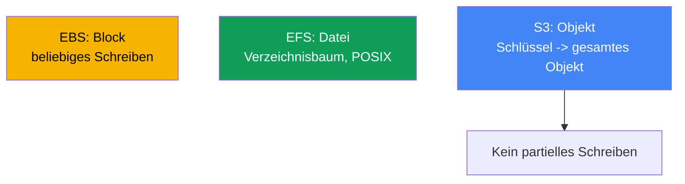
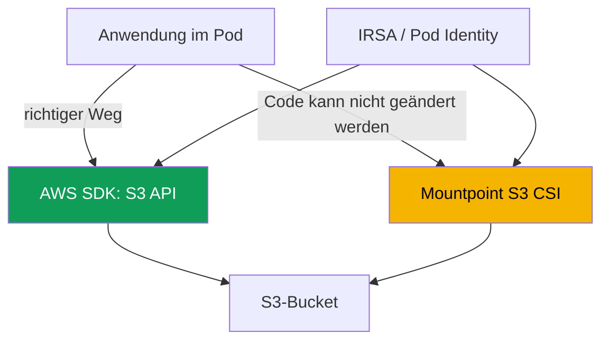

[Eng version](en.md) · [Versión en español](es.md) · [Version française](fr.md) · [Русская версия](ru.md) · [ქართული ვერსია](ge.md) · [繁體中文版](tw.md) · [日本語版](jp.md)
# Kapitel 25. S3 in Anwendungen: Mountpoint for Amazon S3 CSI und Zugriffsmuster

> **Wie es weitergeht.** Kapitel 23 behandelte EBS-Blockspeicher (eine Platte in einer AZ, ein Schreiber), Kapitel 24
> Dateizugriff mit EFS und FSx (Netzwerk-NFS, ReadWriteMany über Zonen hinweg). Dieses Kapitel behandelt die dritte
> Klasse: S3-Objektspeicher. Er hat ein grundsätzlich anderes Modell: weder Platte noch Dateisystem, sondern ein
> Schlüssel-Wert-Speicher. Über Mountpoint S3 lässt er sich als Volume mounten, jedoch mit Einschränkungen - das ist
> der Kern dieses Kapitels. Autorisierung über IRSA oder Pod Identity behandeln die Kapitel 16-17, FSx for Lustre
> mit S3-Integration wird in Kapitel 24 überblicksartig behandelt, privater Zugriff über VPC endpoints in Kapitel 31,
> Backup über AWS Backup in Kapitel 41. Darauf wird verwiesen, ohne es zu wiederholen.

## 25.1. „Wir haben den Bucket als Platte gemountet, aber die Anwendung scheitert bei rename“

Ein Team migriert einen Dienst zu EKS. Die Anwendung schrieb in ein temporäres Verzeichnis: Sie erstellte eine
Datei mit dem Suffix `.tmp`, schrieb schrittweise hinein und benannte sie am Ende in den finalen Namen um. Ein
klassisches atomares Schreiben über `rename`. Das Verzeichnis sollte in S3 liegen - der Bucket wurde über
Mountpoint S3 CSI gemountet, das Volume kam hoch, der Pod startete. Fast sofort traten Fehler auf:

```bash
kubectl logs uploader-0
# rename('/data/report.tmp', '/data/report.csv'): Function not implemented
```

Danach wurde es schlimmer. Ein anderer Dienst schrieb Zeilen über `O_APPEND` in ein Journal und erhielt bereits
beim ersten Anhängen einen Fehler. Ein dritter versuchte, die Mitte einer Konfiguration direkt zu überschreiben:

```bash
kubectl exec app-0 -- sh -c 'echo patched | dd of=/data/config.ini seek=10 conv=notrunc'
# dd: writing '/data/config.ini': Operation not permitted
```

Das Volume ist gemountet, Lesen funktioniert, aber vertraute Dateisystemoperationen - `rename`, `append`, in die
Mitte einer Datei schreiben - scheitern. Zudem sind die errno-Werte **unterschiedlich**, und genau das ist zuerst
zu beachten: `rename` liefert `ENOSYS` (`Function not implemented`) - der Aufruf existiert im Treiber überhaupt
nicht, während `append` und Schreiben in die Mitte `EPERM` (`Operation not permitted`) liefern - die Operation
existiert, ist aber verboten. Der Unterschied wird in 25.7 wichtig: `ENOSYS` lässt sich nicht durch Einstellungen
beheben, `EPERM` gelegentlich durch Mount-Optionen. Das ist weder ein Treiber-Bug noch eine Frage von POSIX-Rechten.
Der Grund liegt tiefer: S3 ist Objektspeicher und kein Dateisystem. Mountpoint bietet eine Datei-**Schnittstelle**
zu Objekten, verwandelt S3 jedoch nicht in ein POSIX-Dateisystem und lehnt ehrlich ab, was sich nicht auf das
Objektmodell abbilden lässt. Sehen wir uns an, warum das so ist und wann Mountpoint überhaupt geeignet ist.

## 25.2. Objekt- gegenüber Datei- und Blockspeicher: Warum S3 kein Dateisystem ist

S3 hat ein Schlüssel-Wert-Modell: Ein Objekt ist ein unveränderlicher Wert (Bytes plus Metadaten) unter einem
String-Schlüssel. Es gibt weder ein Blockgerät wie EBS noch einen Verzeichnisbaum wie EFS. Daraus ergeben sich alle
Unterschiede, die Erwartungen an ein Dateisystem brechen.



Vier Eigenschaften von S3 sind für das Verständnis von Mountpoint wichtig:

- **Keine echten Verzeichnisse.** Der Schlüsselraum ist flach. Präfixe ahmen eine Hierarchie nach: Der Schlüssel
  `logs/2024/app.log` sieht wie ein Pfad aus, aber `logs/` und `2024/` sind keine Verzeichnisobjekte, sondern Teile
  des Schlüssel-Strings. Ein „Verzeichnis“ existiert, solange ein Objekt mit diesem Präfix vorhanden ist.
- **Das Objekt ist vollständig und unveränderlich.** Ein Schreibvorgang ist ein `PutObject` für das gesamte Objekt.
  Bytes in der Mitte lassen sich weder ändern noch am Ende anhängen oder ohne Überschreiben umbenennen. Aktualisieren
  bedeutet ein neues `PutObject` unter demselben Schlüssel, das den gesamten Wert ersetzt.
- **Konsistenzmodell.** S3 bietet strikte Read-after-Write-Konsistenz: Ein neues Objekt ist nach erfolgreichem
  `PutObject` sofort für alle Clients sichtbar, und ein Lesevorgang liefert keine partiellen Daten zurück.
- **Speicherklassen und Metadaten.** Ein Objekt hat eine Speicherklasse (Standard, Intelligent-Tiering, Glacier und
  weitere) und Metadaten. Objekte in Glacier müssen vor dem Lesen wiederhergestellt werden (restore).

Gerade aus „das Objekt ist vollständig und unveränderlich“ entstehen die Verbote aus 25.1: `rename`, `append` und
Schreiben in die Mitte einer Datei lassen sich im Objektmodell nicht kostengünstig umsetzen, weshalb Mountpoint sie
nicht emuliert.

## 25.3. Zwei Zugriffsmuster für S3 aus einer Anwendung

Von einem Pod aus führen zwei grundsätzlich unterschiedliche Wege zu S3, und die Wahl ist wichtiger als die
Treiberkonfiguration. Der erste Weg ist der direkte Zugriff auf S3 per API über das AWS SDK. Der zweite ist, den
Bucket mit Mountpoint S3 CSI als Volume zu mounten und ihn über Dateisystempfade anzusprechen.



**Der Weg über das SDK ist für die meisten Anwendungen richtig.** Der Code ruft `PutObject`, `GetObject` und
`ListObjectsV2` direkt auf und arbeitet ehrlich mit dem Objektmodell, ohne die Illusion eines Dateisystems. Weder
CSI-Treiber noch Volume sind erforderlich. Die Autorisierung erfolgt über IRSA oder EKS Pod Identity (Kapitel 16-17):
Der Pod erhält eine IAM-Rolle mit Zugriff auf den Bucket, das SDK übernimmt die temporären Anmeldedaten selbst. Wenn
die Anwendung erst entworfen wird oder angepasst werden kann, ist dies die Standardwahl.

**Der Weg über Mountpoint** ist nötig, wenn sich der Code nicht auf das SDK umstellen lässt: Er arbeitet strikt mit
Dateisystempfaden (ein Drittanbieter-Binary, Legacy-Software oder ein Werkzeug, das nur Dateien auf einer Platte
lesen kann). Dann wird der Bucket als Volume gemountet und die Anwendung sieht Objekte als Dateien - innerhalb der
Einschränkungen aus 25.5.

| Kriterium | AWS SDK (S3 API) | Mountpoint S3 CSI |
|---|---|---|
| Modell für die Anwendung | objektorientiert, ehrlich | Dateischnittstelle über Objekten |
| CSI und Volume nötig | nein | ja |
| Codeänderung | ja, SDK-Aufrufe | nicht nötig, Arbeit mit Pfaden |
| Vollständigkeit der Operationen | gesamte S3 API | Teilmenge des Dateisystems (25.5) |
| Wann wählen | neuer oder änderbarer Code | Legacy, nur Dateisystempfade |

Regel: Fragen Sie zuerst, ob der Weg über das SDK möglich ist. Mountpoint ist ein Kompromiss für den Fall, dass das
Umschreiben der Anwendung teurer ist als die Einschränkungen der Dateischnittstelle zu akzeptieren.

## 25.4. Mountpoint for Amazon S3 CSI driver im Detail

Der Treiber basiert auf Mountpoint for Amazon S3 - einem Client, der Bucket-Objekte über eine Dateischnittstelle
bereitstellt. Im Cluster läuft er als CSI mit dem Provisioner **`s3.csi.aws.com`** und wird als **managed addon**
`aws-mountpoint-s3-csi-driver` installiert:

```bash
aws eks create-addon --cluster-name demo --addon-name aws-mountpoint-s3-csi-driver \
  --service-account-role-arn arn:aws:iam::111122223333:role/AmazonEKS_S3_CSI_DriverRole
```

Der Treiber benötigt eine IAM-Rolle mit Zugriff auf den Bucket, bereitgestellt über IRSA oder EKS Pod Identity
(Kapitel 16-17). Der minimale Satz von Aktionen nach Mountpoint-Empfehlung lautet: `s3:ListBucket` auf dem Bucket
selbst sowie `s3:GetObject`, `s3:PutObject`, `s3:AbortMultipartUpload` auf Objekten; `s3:DeleteObject` nur, wenn
Löschen erlaubt werden soll. Es gibt auch die fertige managed policy `AmazonS3CSIDriverPolicy`. Ohne Rechte hängt der
Pod beim Mounten oder Operationen scheitern mit `AccessDenied`.

Standardmäßig wird `authenticationSource: driver` verwendet - der gesamte Cluster greift mit der Rolle des
Service-Accounts des Treibers auf S3 zu. Für Mandantentrennung gibt es `authenticationSource: pod`: Das Volume nutzt
die Rolle des Service-Accounts des Pods (IRSA oder Pod Identity), sodass verschiedene Pods unterschiedliche
Berechtigungen erhalten.

**Nur statisches Provisioning.** Dynamisches Provisioning gibt es nicht: Der Treiber erstellt keine Buckets und
stellt sie nicht über eine StorageClass bereit. Der Bucket wird vorher erstellt, der PV wird manuell beschrieben. Die
Schlüsselfelder stehen in `spec.csi`: `driver`, ein eindeutiger `volumeHandle` und `bucketName` in
`volumeAttributes`; die Region wird in `mountOptions` festgelegt.

```yaml
apiVersion: v1
kind: PersistentVolume
metadata: {name: s3-pv}
spec:
  capacity: {storage: 1200Gi}     # Wert wird ignoriert, ist aber vom Schema gefordert
  accessModes: ["ReadOnlyMany"]   # oder ReadWriteMany
  storageClassName: ""            # leer: statisches Provisioning
  claimRef:                       # feste Bindung des PV an einen bestimmten PVC
    namespace: default
    name: s3-pvc
  mountOptions:
    - region eu-central-1
  csi:
    driver: s3.csi.aws.com
    volumeHandle: s3-csi-demo-volume   # muss eindeutig sein
    volumeAttributes:
      bucketName: amzn-s3-demo-bucket
```

Der PVC verweist per Namen auf diesen PV und hat ebenfalls einen leeren `storageClassName`:

```yaml
apiVersion: v1
kind: PersistentVolumeClaim
metadata: {name: s3-pvc}
spec:
  accessModes: ["ReadOnlyMany"]
  storageClassName: ""
  resources:
    requests: {storage: 1200Gi}   # Wert wird ignoriert
  volumeName: s3-pv
```

| Feld | Wo | Zweck |
|---|---|---|
| `driver` | `csi` | immer `s3.csi.aws.com` |
| `volumeHandle` | `csi` | eindeutige Volume-ID; ein Duplikat wird nicht verarbeitet |
| `bucketName` | `volumeAttributes` | Name des vorhandenen Buckets |
| `authenticationSource` | `volumeAttributes` | `driver` (Standard) oder `pod` |
| `region ...` | `mountOptions` | Region des Buckets |
| `cache` | `volumeAttributes` | Typ des lokalen Cache: `emptyDir` oder `ephemeral` |
| `metadata-ttl ...` | `mountOptions` | TTL des Metadaten-Cache (Sekunden/`indefinite`) |
| `storageClassName: ""` | PV und PVC | für statisches Provisioning erforderlich |

**Cache für wiederholtes Lesen.** Mountpoint kann Daten und Metadaten von Objekten cachen, sodass wiederholte
Lesevorgänge derselben Datei nicht erneut zu S3 gehen - das beschleunigt Read-heavy-Workloads. Im CSI-Treiber v2
wird der lokale Datencache nicht mit einem Flag, sondern mit Volume-Attributen konfiguriert: `cache: emptyDir` legt
den Cache auf einem lokalen Node-Volume ab, und `cacheEmptyDirSizeLimit` begrenzt seine Größe (zwingend angeben,
sonst belegt der Cache die Node-Platte). `cacheEmptyDirMedium: Memory` verschiebt den Cache zur Verringerung der
Latenz in tmpfs (RAM), auf Kosten des Node-Speichers. Der Metadaten-Cache wird separat über die Option
`metadata-ttl` in `mountOptions` aktiviert. Für einen Cache auf einem dedizierten Volume (EBS oder instance store)
gibt es den Typ `cache: ephemeral` mit `cacheEphemeralStorageClassName` und
`cacheEphemeralStorageResourceRequest`.

```yaml
    volumeAttributes:
      bucketName: amzn-s3-demo-bucket
      cache: emptyDir              # lokaler Datencache auf dem Node
      cacheEmptyDirSizeLimit: 2Gi  # Limit ist nötig, sonst belegt der Cache die gesamte Platte
```

In v1 wurde der Cache über einen Pfad mit `cache` in `mountOptions` gesetzt; in v2 ist das veraltet - der Pfad wird
ignoriert, der Treiber erstellt das `emptyDir`-Volume selbst. Geben Sie den Cache ausschließlich über
Volume-Attribute an.

Der typische Zugriffsmodus ist `ReadOnlyMany` zum Lesen von Datensätzen durch viele Pods. `ReadWriteMany` wird
unterstützt, aber mit den Vorbehalten aus 25.5: Paralleles Schreiben in dasselbe Objekt wird nicht koordiniert und
denselben Schlüssel darf nicht mehr als ein Pod gleichzeitig beschreiben.

## 25.5. Einschränkungen von Mountpoint: Was Anwendungen scheitern lässt

Dies ist der zentrale Abschnitt. Mountpoint emuliert absichtlich keine Operationen, die über die Objekt-API teuer
wären oder in S3 keine Entsprechung haben. Es **schlägt ausdrücklich fehl**, statt vorzutäuschen, die Operation sei
erfolgreich gewesen. Für gewöhnliche Buckets (general purpose) lautet die Liste:

- **Kein Schreiben in die Mitte einer Datei.** Schreiben ist nur sequenziell und vom Dateianfang an möglich - im
  Wesentlichen die Erstellung eines neuen Objekts. Ein Offset innerhalb eines vorhandenen Objekts ist ein Fehler.
- **Kein `append` an ein vorhandenes Objekt.** Das Anhängen am Ende wird bei gewöhnlichen Buckets nicht unterstützt
  (`append` gibt es nur bei directory buckets von S3 Express One Zone).
- **Kein `rename` / `mv`.** Das Umbenennen von Objekten eines gewöhnlichen Buckets wird überhaupt nicht unterstützt;
  das Umbenennen eines Verzeichnisses bei keinem Bucket-Typ. Genau das hat den Dienst aus 25.1 beschädigt.
- **Kein hard link und symlink.**
- **Eingeschränkte POSIX-Semantik.** `chmod` und `chown` funktionieren nicht: Modus und Besitzer sind Standardwerte
  (`0644` für Dateien, `0755` für Verzeichnisse) und lassen sich nur über Flags beim Mounten ändern. Es gibt keine
  extended attributes und keine POSIX-Sperren (`lockf`).
- **Verzeichnisse werden aus Schlüsselpräfixen emuliert.** Ein vorhandenes Verzeichnis, das durch Objekte in S3
  gestützt wird, lässt sich nicht löschen oder umbenennen.
- **Löschen ist standardmäßig deaktiviert** und wird per Flag aktiviert; ein neu geschriebenes Objekt wird anderen
  Clients erst nach dem Schließen der Datei sichtbar.

| Dateisystemoperation | Mountpoint (gewöhnlicher Bucket) | Warum |
|---|---|---|
| Lesen, auch zufällig | ja | `GetObject`, auch nach Bereich |
| Neue Datei erstellen | ja, sequenziell | `PutObject` für gesamtes Objekt |
| Vorhandene überschreiben | vollständig, mit Flag overwrite | neues `PutObject` unter demselben Schlüssel |
| In die Mitte schreiben | nein | Objekt ist unveränderlich |
| `append` | nein (gewöhnlicher Bucket) | kein partielles Anhängen |
| `rename` / `mv` | nein (gewöhnlicher Bucket) | keine günstige Operation in S3 |
| symlink / hardlink | nein | keine Entsprechung im Objektmodell |

Die betriebliche Schlussfolgerung: Jede Anwendung, die auf `rename`, `append`, Schreiben in die Mitte,
Dateisperren oder das Ändern von POSIX-Rechten angewiesen ist, läuft nicht ohne Anpassung auf Mountpoint. Für solche
Workloads mit gemeinsamem Dateizugriff ist EFS (Kapitel 24) und nicht S3 geeignet.

## 25.6. Wann Mountpoint geeignet ist

Mountpoint ist für hohen Gesamtdurchsatz beim Lesen großer Objekte optimiert und beim Schreiben für das sequenzielle
Erstellen neuer Objekte. Daraus ergeben sich geeignete Szenarien:

- **Read-heavy: ML und Analytics.** Viele Pods lesen große Datensätze aus S3 (Modelle, Parquet, Medien) -
  `ReadOnlyMany`, das Lesen wird parallelisiert, die Anwendung muss nicht auf das SDK umgestellt werden.
- **Bereitstellung großer statischer Dateien.** Ein gemeinsamer Pool großer Assets, auf den nur lesend zugegriffen
  wird.
- **Logs und Artefakte als vollständige Objekte.** Ein Job schreibt sein Ergebnis als neues vollständiges Objekt
  (Bericht, Dump, Build-Artefakt) - das passt zum Muster „neues Objekt erstellen“.

Mountpoint ist ungeeignet für Datenbanken und alle Workloads mit Änderungen an Dateien direkt vor Ort, mit dem
Anhängen an Journale oder Sperren. Separat zum intensiven parallelen Zugriff auf Daten aus S3: Wenn nicht nur eine
Dateischnittstelle, sondern hohe POSIX-Leistung über denselben S3-Daten benötigt wird, ist **FSx for Lustre**
(Kapitel 24) zuständig - ein paralleles Dateisystem mit S3-Integration, das schnellen POSIX-Zugriff auf Datensätze
bietet. Mountpoint ist eine schlanke Dateischnittstelle, Lustre ein leistungsfähiges Dateisystem für HPC und ML.

### S3 Express One Zone (directory buckets) mit Mountpoint

Ein Sonderfall sind directory buckets der Speicherklasse **S3 Express One Zone**. Dies ist zonaler Speicher: Die
Daten liegen in einer Availability Zone in der Nähe von Compute (sie können mit EKS-Nodes in derselben AZ platziert
werden), was niedrigste Latenz und hohe IOPS ermöglicht - Hunderttausende Anfragen pro Sekunde je Bucket. Der Preis
dafür ist zweifach. Erstens die Zonalität: Eine AZ dient der Latenz, nicht der zonenübergreifenden Durability; bei
einem Zonenausfall sind die Daten nicht verfügbar. Zweitens sind die Speicherkosten pro Gigabyte höher als bei
general purpose. Daraus folgt auch eine Planungsanforderung: Das Volume ist an die Zone des Buckets gebunden, daher
bleibt ein Pod mit diesem Volume in derselben AZ, da sonst der Vorteil der Kollokation verloren geht und die Latenz
steigt. Dies ist kein Ersatz für general purpose S3 als zuverlässigen Langzeitspeicher.

Bei Mountpoint haben directory buckets eine wichtige Erleichterung: Sie unterstützen `append` an ein vorhandenes
Objekt, was gewöhnliche general purpose Buckets nicht können (25.5). Das Anhängen am Dateiende funktioniert, sodass
ein Teil der POSIX-Einschränkungen entfällt. Die übrigen Verbote aus 25.5 (kein `rename`, kein Schreiben in die Mitte,
kein symlink) bleiben bestehen - die Objektnatur verschwindet nicht.

Wann ein directory bucket zu wählen ist: Niedrige Latenz und hohe IOPS sind kritisch, und die Daten überstehen den
Verlust einer Zone, weil sie zusätzlich an anderer Stelle liegen (ursprünglicher Datensatz in general purpose S3,
Möglichkeit zur Neuerzeugung) - ML-Training, interaktive Analytics, Medienverarbeitung. Wann general purpose zu
wählen ist: Zonenübergreifende Durability, langfristige Speicherung der einzigen Kopie, Zugriff aus mehreren AZs
oder Schreiben ohne Bindung des Pods an eine Zone sind erforderlich. Ein directory bucket ist ein Beschleuniger für
heiße Daten und kein Ort für die einzige Kopie.

## 25.7. Diagnose typischer Probleme

Vier Situationen treten am häufigsten auf.

| Symptom | Ursache | Was prüfen |
|---|---|---|
| Pod hängt, Mount startet nicht | keine Rolle oder Rechte für den Bucket | Rollenpolicy, `AccessDenied` in den Logs |
| `Function not implemented` bei `rename` | Aufruf existiert im Treiber nicht (25.5) | Schreibmuster der Anwendung |
| `Operation not permitted` bei `append`, Überschreiben, Löschen | Mountpoint-Einschränkungen und Mount-Optionen (25.5) | Schreibmuster, `allow-overwrite`, `allow-delete` |
| Fehler beim Objektzugriff, Bucket nicht lesbar | falsche Bucket-Region | `region` in `mountOptions` |
| Timeouts zu S3 in privatem Subnetz | keine Route zu S3 | VPC gateway endpoint (Kapitel 31) |

Das Erste sind die **Rechte**. Die Rolle des Treibers (oder des Pods bei `authenticationSource: pod`) muss
`s3:ListBucket` für den Bucket sowie `s3:GetObject`/`s3:PutObject` für die Objekte erlauben. Dies prüfen Sie in den
Logs der Treiber-Pods in `kube-system` und auf `AccessDenied`:

```bash
kubectl get pods -n kube-system | grep s3-csi
kubectl logs -n kube-system -l app.kubernetes.io/name=aws-mountpoint-s3-csi-driver
```

Das Zweite ist ein **Fehlschlag bei `rename`/`append`/partial write**. Es handelt sich nicht um einen
Infrastrukturvorfall, sondern um die Inkompatibilität der Anwendung mit dem Objektmodell (25.5). Achten Sie auf errno:
`ENOSYS` bei `rename` bedeutet „das gibt es im Treiber nicht und wird auch nicht kommen“, während sich `EPERM` beim
Überschreiben und Löschen durch die Optionen `allow-overwrite` und `allow-delete` beheben lässt, wenn dies eine
bewusste Entscheidung ist. Die Lösung ist entweder der Wechsel zum SDK (25.3) oder die Migration zu EFS (Kapitel 24),
nicht eine Treiberkonfiguration.

Das Dritte ist die **Region**. Bucket und `mountOptions: region` müssen übereinstimmen; eine falsche Region führt zu
Fehlern beim Objektzugriff. Das Vierte ist **privater Zugriff**: In einem privaten Subnetz ohne Internetzugang ist
eine Route zu S3 über einen **gateway endpoint** (Typ Gateway für S3) erforderlich, sonst laufen Anfragen an die S3
API in Timeouts. Zusätzlich leitet der gateway endpoint den S3-Verkehr am NAT Gateway vorbei, sodass das Lesen von
Datensätzen nicht als NAT-Verkehr abgerechnet wird. Endpoints und privater Verkehr sind Thema von Kapitel 31.

## 25.8. Anwendung in der Produktion

- **Zuerst SDK, dann Mountpoint.** Standardmäßig erfolgt der Zugriff auf S3 über das AWS SDK mit einer IRSA-/Pod
  Identity-Rolle (Kapitel 16-17). Mountpoint wird nur verwendet, wenn sich der Code nicht auf das SDK umstellen lässt.
- **`ReadOnlyMany` für Datensätze.** Gemeinsame Datensätze werden nur lesbar gemountet; dies ist der sicherste und
  häufigste Mountpoint-Modus.
- **Minimale Rechte für den Bucket.** Treiberrollen erhalten genau die notwendigen Aktionen (`s3:ListBucket`,
  `s3:GetObject`, bei Schreiben `s3:PutObject`, `s3:AbortMultipartUpload`) und nicht `AmazonS3FullAccess`.
- **Mandantentrennung über `authenticationSource: pod`.** Wenn verschiedene Pods unterschiedlichen Zugriff auf
  Buckets benötigen, wird die Rolle vom Service-Account des Pods statt von der gemeinsamen Treiberrolle verwendet.
- **Privater Zugriff über gateway endpoint.** In privaten Subnetzen läuft der Verkehr zu S3 über den gateway endpoint
  statt über NAT Gateway: Lesezugriffe gehen nicht nach außen und werden nicht als NAT-Verkehr abgerechnet
  (Kapitel 31).
- **Lokaler Cache für wiederholtes Lesen.** Für Read-heavy-Datensätze wird `cache: emptyDir` mit
  `cacheEmptyDirSizeLimit` aktiviert: Wiederholte Lesevorgänge treffen den Node-Cache statt S3. Metadaten werden durch
  `metadata-ttl` gecacht.
- **Bucket-Versionierung.** Wenn Löschen oder Überschreiben aktiviert ist, schützt Bucket Versioning vor dem
  versehentlichen Verlust von Objekten.

## 25.9. Mini-Glossar

- **Objektspeicher** - ein Schlüssel-Wert-Modell: ein Objekt (Bytes plus Metadaten) unter einem String-Schlüssel,
  unveränderlich und vollständig über `PutObject` aktualisiert.
- **Mountpoint for Amazon S3** - ein Client, der Bucket-Objekte über eine Dateischnittstelle bereitstellt; Grundlage
  des CSI-Treibers.
- **Mountpoint S3 CSI-Treiber** - `aws-mountpoint-s3-csi-driver`, ein managed addon mit dem Provisioner
  `s3.csi.aws.com`; ausschließlich statisches Provisioning.
- **statisches Provisioning** - ein PV wird mit `bucketName` manuell beschrieben; dynamisches Provisioning und die
  Erstellung von Buckets bietet der Treiber nicht.
- **`authenticationSource`** - Quelle der Anmeldedaten des Volumes: `driver` (gemeinsame Treiberrolle) oder `pod`
  (Rolle des Service-Accounts des Pods).
- **Präfix** - der Teil eines Schlüssels vor `/`, aus dem Mountpoint ein Verzeichnis emuliert; echte Verzeichnisse
  gibt es in S3 nicht.
- **lokaler Cache** - Mountpoint-Datencache auf einem Node-Volume (`cache: emptyDir`/`ephemeral`), der wiederholtes
  Lesen beschleunigt; der Metadaten-Cache wird mit `metadata-ttl` konfiguriert.
- **gateway endpoint** - ein VPC endpoint vom Typ Gateway für privaten S3-Zugriff ohne Internet (Kapitel 31).
- **S3 Express One Zone** - zonale Speicherklasse (directory buckets) mit niedriger Latenz und hohen IOPS in einer
  AZ; unterstützt im Unterschied zu general purpose Buckets `append`.

## 25.10. Zusammenfassung des Kapitels

- S3 ist Objektspeicher (Schlüssel-Wert), kein Dateisystem und keine Blockplatte. Ein Objekt ist vollständig und
  unveränderlich, echte Verzeichnisse gibt es nicht, und Präfixe ahmen die Hierarchie nach.
- Aus dem Objektmodell folgen die Verbote: kein Schreiben in die Mitte einer Datei, kein `rename`, kein `append` an
  ein vorhandenes Objekt bei gewöhnlichen Buckets.
- Es gibt zwei Zugriffswege: über das AWS SDK per API (für die meisten richtig, mit IRSA- oder Pod Identity-Rolle,
  ohne CSI) und über die Mountpoint S3 CSI-Dateischnittstelle (wenn der Code nicht für das SDK umgeschrieben werden
  kann).
- Der Treiber `s3.csi.aws.com` wird als managed addon `aws-mountpoint-s3-csi-driver` installiert, mit einer Rolle
  über IRSA/Pod Identity und Bucket-Rechten (`s3:ListBucket`, `s3:GetObject`, `s3:PutObject`,
  `s3:AbortMultipartUpload`), managed policy `AmazonS3CSIDriverPolicy`. Provisioning ist ausschließlich statisch:
  PV mit `bucketName` in `volumeAttributes`, `storageClassName: ""`.
- Die Mountpoint-Einschränkungen sind ehrlich und strikt: kein partial write, `rename`, `append`, hard/symlink,
  eingeschränktes POSIX (kein `chmod`/`chown`, keine Sperren), Verzeichnisse werden emuliert. Jeder Workload, der
  von diesen Operationen abhängt, läuft nicht auf Mountpoint.
- Geeignet ist es für Read-heavy-Workloads: ML/Analytics lesen große Datensätze (`ReadOnlyMany`), für die
  Bereitstellung großer statischer Dateien sowie für das Schreiben von Logs und Artefakten als vollständige Objekte.
  Für intensiven parallelen POSIX-Zugriff auf S3-Daten ist FSx for Lustre (Kapitel 24) geeignet.
- Wiederholtes Lesen beschleunigt ein lokaler Cache (`cache: emptyDir` mit `cacheEmptyDirSizeLimit`,
  `metadata-ttl`), und S3-Verkehr aus einem privaten Subnetz wird über einen gateway endpoint am NAT Gateway
  vorbeigeführt (Kapitel 31).
- Diagnose: Rechte der Rolle zum Bucket (`AccessDenied`), Anwendungsfehler bei `rename`/partial write
  (Inkompatibilität, kein Ausfall), Bucket-Region, privater Zugriff über gateway endpoint.

## 25.11. Nutzen in der täglichen Arbeit

Im Bereitschaftsdienst lassen sich Mountpoint-Vorfälle in zwei Gruppen teilen. Die erste ist infrastrukturell: Der
Pod mountet das Volume nicht, die Treiber-Logs enthalten `AccessDenied` - prüfen Sie die Rolle und ihre Rechte auf den
konkreten Bucket, anschließend die Region in `mountOptions` und die Route zu S3 im privaten Subnetz. Die zweite und
heimtückischere Gruppe: Die Anwendung scheitert bei `rename` (`Function not implemented`), bei `append` oder beim
Schreiben in die Mitte einer Datei (`Operation not permitted`). Das lässt sich nicht durch Konfiguration beheben: Die
Anwendung erwartet von S3 ein POSIX-Dateisystemverhalten, das Objektspeicher nicht hat. Die richtige Antwort ist,
entweder den Code auf das AWS SDK umzustellen (dann ist CSI überhaupt nicht nötig) oder, falls wirklich gemeinsamer
Dateizugriff mit vollständiger Semantik erforderlich ist, EFS zu verwenden (Kapitel 24). Setzen Sie beim Entwurf die
Priorität: Fragen Sie zuerst, ob das SDK möglich ist, und bewerten Sie nur dann, ob der Workload in die
Mountpoint-Einschränkungen passt.

## 25.12. Fragen zur Selbstkontrolle

1. Worin unterscheidet sich das Objektmodell von S3 vom Datei- (EFS) und Blockmodell (EBS)?
2. Warum gibt es in S3 keine echten Verzeichnisse, und was ist ein Präfix?
3. Warum können Sie bei gewöhnlichen Buckets nicht in die Mitte eines Objekts schreiben oder es umbenennen?
4. Welche zwei Zugriffsmuster von einem Pod zu S3 gibt es, und welches ist standardmäßig richtig?
5. Wann ist Mountpoint statt eines Zugriffs über das AWS SDK gerechtfertigt?
6. Wie heißen das managed addon und der Provisioner des Mountpoint S3 CSI-Treibers?
7. Warum braucht der Treiber eine IAM-Rolle, und welche Aktionen für den Bucket benötigt er mindestens?
8. Worin unterscheidet sich `authenticationSource: driver` von `pod`, und wann wird Letzteres benötigt?
9. Warum gibt es bei Mountpoint nur statisches Provisioning, und wie sieht ein solcher PV aus?
10. Welche Dateisystemoperationen unterstützt Mountpoint nicht, und warum scheitert es ausdrücklich statt still?
11. Für welche Workloads ist Mountpoint geeignet, und wann werden stattdessen EFS oder FSx for Lustre verwendet?
12. Ein Pod mountet ein Mountpoint-Volume nicht - welche Ursachen prüfen Sie in welcher Reihenfolge?
13. Warum wird in einem privaten Subnetz ein gateway endpoint für S3 benötigt, und wie spart er NAT-Gateway-Kosten?
14. Wie aktivieren Sie den lokalen Mountpoint-Datencache, und warum muss `cacheEmptyDirSizeLimit` gesetzt werden?
15. Was bietet S3 Express One Zone für Mountpoint, und was ist der Preis der Zonalität?

## Praxis

Das Kurs-Lab zu diesem Thema: [Lab 129 - Mountpoint for S3: Wo die Dateisemantik scheitert und warum
es kein Backup gibt](../../labs/129/README_DE.MD). Es enthält einen statischen PV auf einem echten Bucket,
erfolgreiche Operationen (neues Objekt und Lesen) sowie drei aufeinanderfolgende Fehler mit errno-Analyse und erklärt
am Ende, warum ein solcher PVC keinen Snapshot hat und was stattdessen die Daten schützt. Das Ergebnis wird mit
`check_result` geprüft.

Wiederholen Sie unten dasselbe auf einem eigenen Cluster. Sehen Sie sich zunächst den Bucket auf AWS-Seite an:
`aws s3 ls` zeigt Buckets, `aws s3 ls s3://<bucket>/ --recursive` zeigt Objekte und ihre „Pseudo-Verzeichnisse“ aus
Präfixen. Vergewissern Sie sich, dass der Treiber installiert ist: `aws eks list-addons
--cluster-name <cluster>` und `kubectl get pods -n kube-system | grep s3-csi`.

Reproduzieren Sie dann den Schmerz aus 25.1. Erstellen Sie einen statischen PV mit `driver: s3.csi.aws.com`, dem
`bucketName` Ihres Buckets und `region` in `mountOptions`, binden Sie einen PVC und starten Sie einen Pod mit
`ReadWriteMany`. Verwenden Sie ein Image mit Shell und Hilfsprogrammen (`busybox`), sonst hat `kubectl exec` nichts
zum Ausführen. Prüfen Sie im Pod, dass Lesen und das Erstellen einer neuen Datei funktionieren (`kubectl exec ... --
cat /data/<key>` und Schreiben eines neuen Schlüssels), und stellen Sie dann sicher, dass `mv /data/a /data/b` mit
`Function not implemented` scheitert und das Anhängen `echo x >> /data/existing` sowie Schreiben in die Mitte über
`dd ... seek=...` mit `Operation not permitted` fehlschlagen. Versuchen Sie auch, eine Datei zu überschreiben und zu
löschen: Beides ergibt ebenfalls `Operation not permitted`, bis `allow-overwrite` und `allow-delete` aktiviert sind.
Vergleichen Sie mit `ReadOnlyMany`: Mounten Sie denselben Bucket nur lesend und stellen Sie sicher, dass viele Pods
den Datensatz lesen können. Prüfen Sie separat die Rechte: Entfernen Sie vorübergehend `s3:GetObject` aus der Rolle
des Treibers, erstellen Sie den Pod neu und suchen Sie nach `AccessDenied` in den Logs der Treiber-Pods (`kubectl logs
-n kube-system -l app.kubernetes.io/name=aws-mountpoint-s3-csi-driver`); stellen Sie die Berechtigung wieder her und
vergewissern Sie sich, dass das Mounten funktioniert.

---
[Inhaltsverzeichnis](../README_DE.md) · [Kapitel 24](../24/de.md) · [Kapitel 26](../26/de.md)
